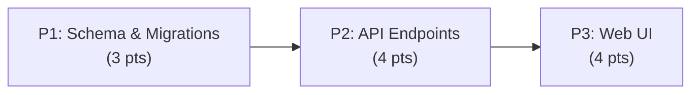

# Decisions Block: [Feature Name]

<!-- HEADER NOTE: 3–5 lines
     Opus author: State the feature goal in one sentence and reference this plan's role.
     This block is for high-level decisions (phase boundaries, risk map, agent routing).
     implementation-planner (sonnet) expands this into a full PRD+Implementation Plan.
     Opus does a brief (~3K token) sanity review before delegation and after expansion.
-->

**Feature Goal**: [One-sentence goal statement, e.g., "Enable users to deploy artifacts via CLI with validation and rollback support."]

**This Decisions Block** captures phase boundaries, agent routing, risk hotspots, estimation anchors, and model routing to guide expansion into a full Implementation Plan. Opus authors this; sonnet `implementation-planner` expands it into the detailed plan template.

---

## 1. Phase Boundaries

<!-- OPUS FILLS: Define work phases where the *shape* of the work product changes
     (schema → API → UI), not at arbitrary task counts.
     Each phase should have clear exit gates and distinct success criteria.
-->

| Phase | Name | Scope | Success Criteria | Exit Gate |
|-------|------|-------|------------------|-----------|
| P1 | [Phase 1 name] | [What gets built/changed in this phase] | [How we know it's done] | [Validation or test threshold] |
| P2 | [Phase 2 name] | [What gets built/changed in this phase] | [How we know it's done] | [Validation or test threshold] |
| P3 | [Phase 3 name] | [What gets built/changed in this phase] | [How we know it's done] | [Validation or test threshold] |
| ... | ... | ... | ... | ... |

**Boundary Rationale**:
- P1–P2: [Why we split here: e.g., "Schema finalized and validated before API implementation begins."]
- P2–P3: [Why we split here: e.g., "Backend contracts defined and mocked; frontend development can proceed independently."]
- [Any additional splits]

---

## 2. Agent Routing

<!-- OPUS FILLS: Map expected agent types per phase.
     Reference @CLAUDE.md Agent Delegation table for model + skills.
     Anticipate parallel work (file-ownership-first batching).
-->

| Phase | Primary Agent(s) | Secondary Agent | Notes |
|-------|------------------|-----------------|-------|
| P1 | [agent-name-1] | [agent-name-2 if parallel] | [Role summary, e.g., "backend-architect designs schema"] |
| P2 | [agent-name-1] | [agent-name-2 if parallel] | [Role summary, e.g., "python-backend-engineer implements endpoints"] |
| P3 | [agent-name-1] | [agent-name-2 if parallel] | [Role summary, e.g., "ui-engineer-enhanced builds frontend"] |
| ... | ... | ... | ... |

**Parallel Opportunities**:
- [Phase A and B can run in parallel because: ...]
- [Phase A and B must sequence because: ...]

---

## 3. Risk Hotspots

<!-- OPUS FILLS: Identify architectural or technical risks with severity, rationale, and mitigation.
     Tag each with severity: low / medium / high.
     Focus on risks that affect phase ordering or agent assignment.
-->

### Risk 1: [Risk Name]
- **Severity**: [low / medium / high]
- **Rationale**: [Why this risk exists; what failure looks like]
- **Mitigation**: [How we reduce the risk; test coverage, early validation, spike, etc.]

### Risk 2: [Risk Name]
- **Severity**: [low / medium / high]
- **Rationale**: [Why this risk exists; what failure looks like]
- **Mitigation**: [How we reduce the risk; test coverage, early validation, spike, etc.]

### Risk 3: [Risk Name]
- **Severity**: [low / medium / high]
- **Rationale**: [Why this risk exists; what failure looks like]
- **Mitigation**: [How we reduce the risk; test coverage, early validation, spike, etc.]

---

## 4. Estimation Anchors

<!-- OPUS FILLS: Points per phase + reasoning anchor (reference past comparable work).
     Rationale should cite past features with similar scope.
     Each phase estimate should be 3–8 pts (splits larger than 8 across phases).
-->

### Total: [N] points

| Phase | Points | Reasoning Anchor |
|-------|--------|------------------|
| P1 | [N] | [Comparable past feature/work; why this phase is X pts] |
| P2 | [N] | [Comparable past feature/work; why this phase is X pts] |
| P3 | [N] | [Comparable past feature/work; why this phase is X pts] |
| ... | ... | ... |

**Estimation Notes**:
- [Any cross-phase dependencies affecting velocity]
- [Any tech-debt payoff expected]
- [Any unknowns that might inflate estimates]

---

## 5. Dependency Map

<!-- OPUS FILLS: Explicit phase ordering and parallelization.
     Format: bulleted list or mermaid graph.
     Example:
       - P1 (schema) → P2 (API impl) → P3 (UI)  [serial critical path]
       - P1.2 (migrations) ∥ P2.1 (endpoints)    [can parallelize with file ownership)
-->

**Critical Path**: [List phases in sequential order if they must all run serial]

**Parallelizable Slices**: [Phases or sub-phases that can run in parallel; file-ownership rationale]

---

## 6. Model Routing

<!-- OPUS FILLS: Model + effort (thinking budget) decisions per phase per agent role.
     Reference .claude/config/multi-model.toml and model-selection-guide.
     Format: phase + agent role → model / effort.
     Examples:
       - "P1 backend-architect: opus / low (no thinking needed; scope is clear)"
       - "P2 python-backend-engineer: sonnet / medium (moderate reasoning for edge cases)"
       - "P3 ui-engineer-enhanced: sonnet / low (straightforward component wiring)"
-->

| Phase | Agent | Model | Effort | Rationale |
|-------|-------|-------|--------|-----------|
| P1 | [agent] | [opus\|sonnet\|haiku] | [none/low/medium/high] | [Why this model + effort] |
| P2 | [agent] | [opus\|sonnet\|haiku] | [none/low/medium/high] | [Why this model + effort] |
| P3 | [agent] | [opus\|sonnet\|haiku] | [none/low/medium/high] | [Why this model + effort] |
| ... | ... | ... | ... | ... |

**Model Routing Notes**:
- [Any cross-phase model fallbacks (if primary unavailable)]
- [Any external model callouts (GPT, Gemini, etc.) and why]

---

## 7. Open Questions for Expansion

<!-- OPUS FILLS: List OQs the implementation-planner should resolve when expanding this block.
     Format: bulleted list. Examples:
       - "Should we create a Deployment model or reuse Artifact?"
       - "Does auth require a new provider or does LocalAuthProvider suffice?"
       - "How deep does error recovery go (transactional or eventually consistent)?"
-->

- **OQ-1**: [Question phrased as a design decision the planner should reason through]
- **OQ-2**: [Question phrased as a design decision the planner should reason through]
- **OQ-3**: [Question phrased as a design decision the planner should reason through]

---

## 8. Plan Skeleton Pointer

<!-- TERMINAL SECTION: Tell the expansion agent which template to use. -->

This decisions block expands into a full **Implementation Plan** using the template:

- **Location**: `.claude/skills/planning/templates/implementation-plan-template.md`
- **Process**: `implementation-planner` (sonnet) reads this decisions block and expands each section into the full plan structure: detailed phase descriptions, task breakdowns, batch definitions, and success criteria.
- **Output path**: `docs/project_plans/implementation/[feature-slug]-plan.md` (or per-PRD convention if a PRD exists).
- **Opus review**: Brief sanity check (~3K tokens) post-expansion; verify phase boundaries and agent routing before execution begins.

---

## Notes for implementation-planner

(These are advisory hints for the expanding agent; not binding.)

- **Section 1 (Phase Boundaries)**: Expand each row into a "Phase X Overview" section with full scope, dependencies, team members, success metrics.
- **Section 2 (Agent Routing)**: Expand into team assignments and skill requirements per phase.
- **Section 3 (Risks)**: Expand into monitoring/validation strategies per risk (tests, code review, staging validation, etc.).
- **Section 4 (Estimation)**: Expand into detailed task list with points, dependencies, and critical-path analysis.
- **Section 5 (Dependency Map)**: Expand into batch definitions and parallelization strategy per file-ownership rules.
- **Section 6 (Model Routing)**: Propagate into task-level model/effort decisions in the plan's task table.
- **Section 7 (OQs)**: Incorporate resolutions into architecture or design decisions sections of the plan.
