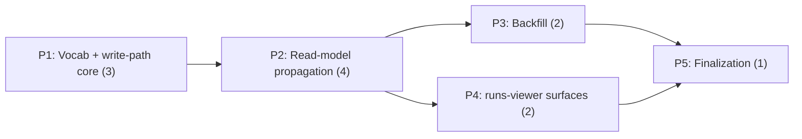

# Decisions Block: Claim Term Indexing

**Feature Goal**: Attach a deterministic, write-time, versioned vocabulary/usage-role index (`_term_index`) to RF claims, propagate it read-only through export → catalog → search → serve → runs-viewer, and backfill existing bundles — with zero impact on verification, identity hashing, or rights governance.

**This Decisions Block** captures phase boundaries, agent routing, risk hotspots, estimation anchors, and model routing. Authored by Opus; expanded by an ICA-routed implementation-planner leaf into the full Implementation Plan.

---

## Decisions

| Decision | Rationale | Status |
|----------|-----------|--------|
| D1: v1 = claims only, open schemas only (`claim_ledger.yaml` + `report_frontmatter` rollup); strict families untouched | Zero schema-contract risk; strict-family extension needs explicit version bump + sign-off (spec §4/OQ-3) → v2 | locked |
| D2: everything under namespaced non-authoritative `_term_index.*` with `vocabulary_version`; never in `SOURCE_ASSERTION_MATERIAL_FIELDS` | Audit-safety next to real `pediatric_cds` threshold blocks; stays outside all verification/identity/rights paths | locked |
| D3: per-row `sensitivity_rank` on `catalog_terms`; read-time filter `rank <= threshold` | One deterministic write pass; per-row filtering mirrors `_redact_evidence_points()` and structurally avoids the flat-`search_text` leak precedent | locked |
| D4: project-scoped versioned `vocab/*.yaml` (pediatric-v1 first), optional RF-core defaults; hand-maintained v1 | Resolves OQ-1 for v1; MeSH/UMLS/LOINC import deferred until hand list outgrows itself | locked |
| D5: CARP-adapted case-folded word-boundary matcher; no Aho-Corasick until vocab >~200 terms | Reuse proven in-repo primitive; no new dependency for small-vocab v1 | locked |
| D6: usage roles = rule-based + `pediatric_cds` structured-field keying only; no model-derived roles in v1 | Deterministic/reproducible; model enrichment is a v2 conditional gate (OQ-2) | locked |
| D7: `run.json` schema 1.7 additive; viewer `run-export.ts` bumped in the same phase | Dual-update rule — the hand-written exporter/types drop unknown fields otherwise | locked |
| D8: `rf verify` stays a pure non-consumer of `_term_index` in v1 (no lint warning added) | Keeps the empirically-validated byte-identical inertness property as a hard regression target; a lint is deferred scope | locked |

---

## 1. Phase Boundaries

| Phase | Name | Scope | Success Criteria | Exit Gate |
|-------|------|-------|------------------|-----------|
| P1 | Vocabulary + write-path core | `vocab/` file format + loader + `vocabulary_version` stamping; term matcher (CARP-adapted); rule-based usage-role classifier (incl. `pediatric_cds` structured-field keying); attach in `claim_mapping.build_claim_ledger`; guard tests | `_term_index` written to `claim_ledger.yaml` deterministically; guard tests green | `source_assertion_fingerprint()` regression test + `rf verify` byte-inertness fixture test pass; task-completion-validator |
| P2 | Read-model propagation | `export_run` additive fields → run.json 1.7 + viewer `run-export.ts` types; `catalog_terms` join table (with `sensitivity_rank` per D3) + `_build_claim_and_inference_rows` extension + rebuild; `rf catalog search --term/--role`; serve passthrough query params | Term facet queries work end-to-end (CLI + HTTP); sensitivity threshold filters term rows | serve-api sensitivity tests at each threshold + catalog rebuild idempotency test; task-completion-validator |
| P3 | Backfill | `term_index_backfill` service modeled on `rights_backfill.py` (dry-run default, idempotent, additive-only, never touches status/attested fields) + `rf catalog rebuild` follow-up; validated against pediatric-CDS bundle population | Dry-run diff on real bundles; wet run on fixtures idempotent | Idempotency + non-clobber tests; dry-run output reviewed; task-completion-validator |
| P4 | runs-viewer surfaces | Term facet chip-row in `AssertionCatalogPane`; `?term=` deep-link + term/role badges in `CatalogScreen`/`ClaimLedgerTable`; role badges visually distinct from `pediatric_cds` attested values | Facets/badges render from live catalog data; deep link filters | `tsc -p tsconfig.app.json --noEmit` clean + runtime smoke on all target_surfaces; task-completion-validator |
| P5 | Finalization | Docs (CLI reference, architecture note), CHANGELOG [Unreleased], deferred-item design specs (strict-schema v2, model-assisted roles, controlled-vocab import), symbol graph regen | All deferred items have design-spec stubs; docs updated | karen end-of-feature gate |

**Boundary Rationale**:
- P1–P2: the index must exist and be proven inert (guard tests) before any propagation surface copies it forward — the write path is the contract everything downstream consumes.
- P2–P3/P4: backfill and UI both consume the finished propagation contract; they are independent of each other (disjoint file ownership: python services vs frontend) and can run in parallel.
- P5 last: docs/deferral capture requires final shapes.

---

## 2. Agent Routing

Per operator directive, **all leaf implementation routes to ICA** (`ica-executor`, `claude-sonnet-5[1m]`, shared-pool offload) via delegation-router; RoutingRecords logged per task. Reviewer gates stay claude-native (verdict class is MUST-stay). **Flat legs only** — ICA leaves must never spawn nested agents.

| Phase | Primary Agent(s) | Secondary Agent | Notes |
|-------|------------------|-----------------|-------|
| P1 | ica-executor (python-backend-engineer profile) | — | Single leaf: vocab loader + matcher + classifier + claim-map attach + guard tests; bounded, single-service scope |
| P2 | ica-executor (python-backend-engineer profile) | ica-executor (data-layer-expert profile) for `catalog_terms` DDL if split needed | Export + catalog + search + serve; the run-export.ts type bump rides with this leaf (small TS edit) |
| P3 | ica-executor (python-backend-engineer profile) | — | Backfill service + CLI; parallel with P4 |
| P4 | ica-executor (ui-engineer-enhanced profile) | — | Frontend-only file ownership; parallel with P3 |
| P5 | ica-executor (documentation-writer profile) | — | Docs + deferred design specs; cheap leaf |
| gates | task-completion-validator (claude sonnet) per phase | karen (claude opus) end of feature | MUST-stay verdict class — never offloaded; CARP lesson: reviewers, not leaves, catch fail-opens |

**Parallel Opportunities**:
- P3 ∥ P4: disjoint file ownership (Python services vs `frontend/runs-viewer`); both depend only on P2's frozen contract.
- P1 and P2 must sequence: P2 copies fields P1 defines.

---

## 3. Risk Hotspots

### Risk 1: Sensitivity leak via derived term rows
- **Severity**: high
- **Rationale**: The flat-`search_text` precedent — captured once at `client_sensitive`, never re-filtered per point — is a live, named leak pattern in `catalog_service.py`. A term table computed at max permissiveness would republish redacted content as terms.
- **Mitigation**: D3 (per-row `sensitivity_rank`, read-time filter); P2 exit gate includes serve-api tests at each threshold; the sensitivity-threshold-router-gate diagnostic signature (list-ok/detail-404) is a known trap — test the serve layer, not just the service layer.

### Risk 2: Identity-hash / verify-gate regression
- **Severity**: high (likelihood low, impact critical)
- **Rationale**: `_term_index` touching `source_assertion_fingerprint()` or flipping any `rf verify` outcome breaks the claim ledger's authority contract — the charter's literal deal-killer.
- **Mitigation**: P1 guard tests are entry-blocking for P2: fingerprint-unchanged regression test + verify byte-inertness fixture (re-encoding the empirical 87-claim validation as CI); D8 keeps verify a pure non-consumer.

### Risk 3: Export/viewer schema drift (run.json 1.7)
- **Severity**: medium
- **Rationale**: `run-export.ts` is hand-written; additive fields silently drop or type-error if the viewer isn't bumped with the exporter.
- **Mitigation**: D7 dual-update in the same P2 leaf; `tsc -p tsconfig.app.json --noEmit` (the real gate — plain `npx tsc --noEmit` is a no-op in this repo).

### Risk 4: Backfill against verified production bundles
- **Severity**: medium
- **Rationale**: 7 verified pediatric-CDS bundles are the highest-stakes corpus; a clobbering write would damage attested evidence. Run data lives in the private data repo (data-plane split).
- **Mitigation**: rights_backfill pattern (dry-run default, idempotent, additive-only, never touches status/attested fields); P3 gate requires reviewed dry-run diff before any wet run; wet-run fixtures first.

### Risk 5: ICA leaf process/quality hazards
- **Severity**: medium (process)
- **Rationale**: Known hazards — orphaned leaves (wrapper timeout ≠ process killed), long-session instability, and fail-open shortcuts that only reviewers catch (5/5 in CARP).
- **Mitigation**: `timeout -k` on every dispatch; one phase per leaf (split, never marathon); claude-native task-completion-validator per phase is non-negotiable; validate tests with `PYTHONPATH=<wt>/src <main>/.venv/bin/python -m pytest` (worktree interpreter gotcha).

---

## 4. Estimation Anchors

### Total: 12 points

| Phase | Points | Reasoning Anchor |
|-------|--------|------------------|
| P1 | 3 | CARP P1 (contract freeze + deterministic retrieval, ~4 pts) minus contract-freeze overhead; matcher is adapted, not invented; H3 flag applies (classification rules) but scenarios are enumerable |
| P2 | 4 | CARP P2 governed adapter (~5 pts) analog — multi-stage propagation (export/catalog/search/serve) + one DDL table + TS type bump; the sensitivity work is the hard part |
| P3 | 2 | rights_backfill.py exists as a direct template; mostly adaptation + tests |
| P4 | 2 | Additive facet/column/param work on existing viewer surfaces; no new screen architecture (value leg) |
| P5 | 1 | Docs + 3 deferred design-spec stubs; mechanical |

**Estimation Notes**:
- H5 anchor: CARP P1+P2 = 9 pts for a comparable deterministic-retrieval + propagation slice; +3 delta justified by UI phase + production backfill, which CARP lacked (<30% delta rule satisfied).
- H6 hidden plumbing (~15%) is absorbed in P2's 4 pts (schema bump, serve params, fixtures).
- Unknown that could inflate: per-tier sensitivity testing breadth (P2) — if serve-api fixtures need reworking, +1 pt.

---

## 5. Dependency Map

**Critical Path**: P1 → P2 → P5 (with P3, P4 forking off P2 in parallel, both joining before P5).

**Parallelizable Slices**: P3 ∥ P4 (disjoint file ownership: `src/research_foundry/services/*` + CLI vs `frontend/runs-viewer/*`).

---

## 6. Model Routing

| Phase | Agent | Model | Effort | Rationale |
|-------|-------|-------|--------|-----------|
| P1 | ica-executor | claude-sonnet-5[1m] (ICA) | adaptive | Bounded deterministic-service work; sonnet-5 clears the bar; free-offload per directive |
| P2 | ica-executor | claude-sonnet-5[1m] (ICA) | adaptive | Highest-risk phase but scope is precisely pre-decided (D3, D7); reviewer gate backstops |
| P3 | ica-executor | claude-sonnet-5[1m] (ICA) | adaptive | Template-driven adaptation of rights_backfill |
| P4 | ica-executor | claude-sonnet-5[1m] (ICA) | adaptive | Additive UI work on known surfaces |
| P5 | ica-executor | claude-sonnet-5[1m] (ICA) | adaptive | Docs + spec stubs |
| all gates | task-completion-validator | claude sonnet | adaptive | MUST-stay verdict class; never offloaded |
| end | karen | claude opus | extended | End-of-feature reality check |
| spine | orchestrator (Opus) | claude-opus-4-8 | — | Orchestration is MUST-stay; commits, merges, dispatch |

**Model Routing Notes**:
- Fallback chain per RoutingRecord: `claude/claude-sonnet-5` native if ICA errors/overloads mid-leaf; re-dispatch the whole leaf (leaves are single-phase and restartable).
- No external (Codex/Gemini) legs planned; debug escalation to gpt-5.6-terra only after 2+ failed Claude cycles per project policy.

---

## 7. Open Questions for Expansion

- **OQ-A (from spec OQ-4)**: Scope the CI regression-fixture suite — which runs/fixtures beyond the 87-claim pediatric ledger are needed to call the inertness property covered? Planner should enumerate concrete fixture files per test.
- **OQ-B**: Should `search_text` in `catalog_items` also gain canonical term IDs (so FTS5 finds "cbc" when text says "complete blood count"), or is the `catalog_terms` exact-facet table the only new query surface in v1? Default: terms table only; adding aliases to `search_text` re-opens the flat-blob sensitivity question.
- **OQ-C**: Exact CLI flag names and plural/repeat semantics for `rf catalog search --term/--role` (repeatable? AND vs OR?). Follow the existing `item_type`/`project` filter pattern.
- **OQ-D**: Vocab file schema validation — jsonschema for `vocab/*.yaml` (id, aliases, version) and where the validator runs (claim-map load time; fail-closed or warn?). Recommend fail-closed on malformed vocab, warn-and-skip on missing.
- **OQ-E**: `report_frontmatter` rollup field shape (union of claim terms per report) — v1-required or defer? Spec names it as a v1 target; planner should size it inside P1 or explicitly defer with rationale.

---

## 8. Plan Skeleton Pointer

This decisions block expands into a full **Implementation Plan** using:

- **Template**: `.claude/skills/planning/templates/implementation-plan-template.md`
- **Process**: implementation-planner (ICA-routed sonnet leaf) reads this block + the PRD and expands into detailed phase/task tables with batch definitions, model/effort columns, and success criteria. Apply plan generator rules R-P1..R-P4 (P4 needs `target_surfaces` + runtime-smoke task; P2's new backend fields need "FE handles missing X" ACs).
- **Output path**: `docs/project_plans/implementation_plans/features/claim-term-indexing-v1.md`
- **Opus review**: sanity check post-expansion; verify phase boundaries, D1–D8 propagation, and R-P1..R-P4 compliance before execution.
