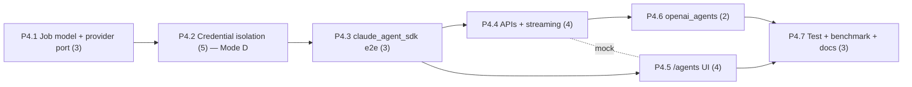

# Decisions Block: Public Multi-User P4 — Embedded Agent Research

**Feature Goal**: Add native, governed embedded-agent research jobs (a `ResearchAgentProvider`
abstraction, job model, event streaming, human-acceptance workflow) integrated with the existing
Search Router and catalog, under subprocess credential isolation per SPIKE ADR-002.

This block resolves the PRD's 3 open questions (see `decisions` above) and encodes the phase
boundaries, routing, and ICA/Codex offload plan for `implementation-planner` to expand.

---

## Decisions

| Decision | Rationale | Status |
|----------|-----------|--------|
| D1: `claude_agent_sdk` first, `openai_agents` second (OQ-1) | Scaffold exists; prove the credential boundary + job model on the constrained adapter before the riskier tool-loop | locked |
| D2: Pepper via env var referenced from a `foundry.yaml` key-profile (OQ-2); final = Mode-D gate #4 | Consistent with RF key-profile handling; no new secrets subsystem | locked |
| D3: FU-1 benchmark early in P4.2, non-blocking; in-process fallback if prohibitive (OQ-3) | ADR-002 names in-process as fallback; don't block the critical path on a benchmark | locked |
| D4: Subprocess isolation for SDK adapters only; static adapters in-process | ADR-002 (accepted) | locked |
| D5: Temp-file creds (0600, unlinked), never env var | ADR-002 — env re-leaks into grandchildren | locked |
| D6: Outputs stage → human acceptance only (exit-7 HITL) | Spec §4; ADR-002 | locked |
| D7: Nullable `workspace_id`/`created_by` unenforced in P4 (D12); enforcement = P5 | Migration-free P4→P5 handoff | locked |

---

## 1. Phase Boundaries

| Phase | Name | Scope | Success Criteria | Exit Gate |
|-------|------|-------|------------------|-----------|
| P4.1 | Agent-job model + `ResearchAgentProvider` port | `agent_job*` schemas (job, event, artifact, `policy_snapshot{allowed_tools,data_scopes}`, nullable workspace_id/created_by); job-scoped staging store; provider Protocol+registry mirroring `adapters/base.py`; job state machine. No provider impl. | Schemas validate; registry + staging round-trip unit-tested | `pytest` green; schema fixtures committed |
| P4.2 | Credential isolation + firewall (**Mode D**) | Subprocess spawn model; temp-file cred delivery (0600, unlinked); write-time redaction guard in `governance.py` on artifacts+events; salted-HMAC fingerprint → run trace + CCDash. FU-1 benchmark (non-blocking). | Secret-scan asserts 0 raw creds in artifacts/events/browser; fingerprint present; crash-safe cleanup tested | **Human gate #1** (before spawn/cred code) + karen security milestone |
| P4.3 | First provider adapter (`claude_agent_sdk`) e2e | Wire the adapter through isolation + governance gates + Search Router/source-card/claim integration; job launches from a selected claim/report gap. | Governed job runs from a claim, streams, produces staged artifacts | **Human gate #2** (first live job, real keys) |
| P4.4 | Agent-job APIs + event streaming + acceptance | Spec §10 endpoints: launch / stream (SSE) / artifacts / accept; acceptance routes through the existing catalog acceptance path only (no direct write). | Contract tests pass; no direct-write code path exists | **Human gate #3** (redaction guard vs real run trace) |
| P4.5 | Frontend `/agents` route | Flip AppShell Agents nav; launch UI from claim/report-gap; live event stream; artifact review/acceptance (Evidence Intake); gate visibility before launch (R-P1 target_surfaces); FE resilience for missing `policy_snapshot` (R-P2). | Runtime smoke over target_surfaces; e2e job flow green | `npm run build` + Playwright job-flow spec |
| P4.6 | Second provider adapter (`openai_agents`) | Add adapter through the same isolation boundary; use SDK-native guardrails/HITL/tracing. | Parity job runs; provider-parametrized tests pass | provider-parity test suite green |
| P4.7 | Testing, benchmark, docs | Credential-firewall regression suite; FU-1 benchmark writeup; e2e static+loopback; CHANGELOG; `/agents` docs; pepper-storage decision doc (gate #4). | Full validation green | **Human gate #4** (pepper location) + karen end-of-feature |

**Boundary Rationale**:
- P4.1→P4.2: job/provider contract frozen before the security-critical isolation layer is built on it.
- P4.2→P4.3: the credential boundary must be proven (0-cred-leak) before any real provider key touches it.
- P4.3→P4.4: one adapter working end-to-end de-risks the API/streaming surface.
- P4.4→P4.5: backend contract stable + mockable before FE consumes it.
- P4.5→P4.6: second provider only after the whole vertical (model→API→UI→acceptance) is proven.

---

## 2. Agent Routing

| Phase | Primary Agent(s) | Secondary | Notes |
|-------|------------------|-----------|-------|
| P4.1 | backend-architect, python-backend-engineer | — | Contract/schema design (MUST-stay) |
| P4.2 | python-backend-engineer | backend-architect | Credential isolation (**MUST-stay, no ICA**) |
| P4.3 | python-backend-engineer | — | Adapter wiring + integration |
| P4.4 | python-backend-engineer | **ICA Sonnet 4.6** (bounded endpoints behind review) | SSE/CRUD endpoints are contract-clear post-P4.1 |
| P4.5 | ui-engineer-enhanced | **ICA Sonnet 4.6** (job-list/event-log subcomponents) | Give delegate the mockup + AppShell nav pattern |
| P4.6 | python-backend-engineer | backend-architect | Second adapter through proven boundary |
| P4.7 | python-backend-engineer (tests), documentation-writer (docs) | **Codex gpt-5.5** (adversarial review of firewall) | Docs → haiku |

**Parallel Opportunities**: P4.4 (API) and P4.5 (FE) can overlap once P4.3 contracts are mocked
(file-ownership: backend `api/` vs frontend `runs-viewer/`). P4.1–P4.3 are strictly serial.

---

## 3. Risk Hotspots

### Risk 1: Prompt-injection exfiltration via live tool-use loop
- **Severity**: high
- **Rationale**: `openai_agents` runs a live tool loop (SPIKE G3); a malicious source could coerce credential/data exfil.
- **Mitigation**: allowlisted tools/data-scopes in `policy_snapshot`; subprocess boundary; write-time redaction firewall; staging-only outputs; SDK-native guardrails. Codex adversarial review in P4.7.

### Risk 2: Credential leak into artifacts/events/browser
- **Severity**: high
- **Rationale**: today artifacts serialize to the run trace which the viewer statically exports (SPIKE G2).
- **Mitigation**: write-time `_redact` guard (not post-hoc scan); fingerprint-only telemetry; secret-scan CI assertion as an exit gate for P4.2.

### Risk 3: Subprocess spawn latency prohibitive
- **Severity**: medium
- **Rationale**: new spawn path, latency unmeasured (SPIKE FU-1).
- **Mitigation**: FU-1 benchmark early in P4.2 (non-blocking); documented in-process-scoping fallback (D3).

---

## 4. Estimation Anchors

### Total: 24 points

| Phase | Points | Reasoning Anchor |
|-------|--------|------------------|
| P4.1 | 3 | Comparable to P3 `builder_service` file-canonical draft model (schema + service scaffold) |
| P4.2 | 5 | Crown-jewel security layer; no direct anchor — new subprocess+firewall path; H3 algorithmic flag (isolation/redaction) |
| P4.3 | 3 | Adapter wiring anchored to existing `adapters/*` integration effort |
| P4.4 | 4 | Anchored to P2 API+CLI wave (endpoints + streaming adds SSE surface) |
| P4.5 | 4 | Anchored to P3 `/builder` UI wave (route + live data + acceptance flow) |
| P4.6 | 2 | Second adapter reuses P4.3 pattern (discounted) |
| P4.7 | 3 | H6 plumbing/test/docs budget (~15–20%) + benchmark writeup |

**Estimation Notes**: P4.2 is the dominant unknown; if FU-1 forces the in-process fallback, P4.2
may drop ~1pt but P4.6 gains risk. Bottom-up (24) exceeds a naive "agents = one feature" top-down
read — trust bottom-up (H4 bundle-vs-sum: 5 capability areas).

---

## 5. Dependency Map

**Critical Path**: P4.1 → P4.2 → P4.3 → P4.4 → P4.5 → P4.6 → P4.7 (P4.4∥P4.5 partial overlap).

**Parallelizable Slices**: P4.4 (backend `api/`) ∥ P4.5 (frontend `runs-viewer/`) after P4.3 mocks.

---

## 6. Model Routing

| Phase | Agent | Model | Effort | Rationale |
|-------|-------|-------|--------|-----------|
| P4.1 | backend-architect / python-backend-engineer | sonnet | extended | Contract design; MUST-stay |
| P4.2 | python-backend-engineer | sonnet | extended | Mode-D credentials; **never ICA/Codex for impl** |
| P4.3 | python-backend-engineer | sonnet | adaptive | Adapter wiring |
| P4.4 | python-backend-engineer / ICA Sonnet 4.6 | sonnet (ICA for bounded waves) | adaptive | Contract-clear endpoints offload behind review gate |
| P4.5 | ui-engineer-enhanced / ICA Sonnet 4.6 | sonnet | adaptive | FE route; subcomponents offloadable |
| P4.6 | python-backend-engineer | sonnet | adaptive | Reuses P4.3 pattern |
| P4.7 | python-backend-engineer / documentation-writer | sonnet / haiku | adaptive | Tests sonnet; docs haiku |

**Model Routing Notes**:
- **ICA Sonnet 4.6** (`~/ica-claude.sh`, `claude-sonnet-4-6[1m]`) takes P4.4 endpoints + P4.5 subcomponents — bounded, contract-clear, **behind a `task-completion-validator` gate**; stdin-pipe long prompts; give FE delegate the mockup.
- **Codex gpt-5.5** (`codex exec`, read-only): adversarial review of the credential firewall (P4.2/P4.7) + final-plan review. Never for Mode-D implementation.
- **MUST-stay on Claude subscription**: P4.1, P4.2, P4.3, P4.6 (contract + credentials + provider adapters).

---

## 7. Open Questions for Expansion

(PRD OQ-1/2/3 are resolved above as D1/D2/D3 — not re-opened.)

- **OQ-A**: Does the SSE event stream reuse the existing runs-viewer streaming transport, or a new endpoint? (implementation-planner: check `api/` for existing SSE/websocket patterns.)
- **OQ-B**: Job-scoped staging store location — under `<workspace>/.rf_cache/` (rebuildable) or `<workspace>/agent_jobs/<id>/` (durable like builder drafts)? Recommend durable (agent outputs are user-facing pending acceptance; mirror D10 builder-draft file-canonical discipline).

---

## 8. Plan Skeleton Pointer

Expand into an **Implementation Plan** using `.claude/skills/planning/templates/implementation-plan-template.md`.
- **Output path**: `docs/project_plans/implementation_plans/features/public-multiuser-p4-agents-v1.md` (split into phase files if >800 lines).
- **Reviewer gates**: `task-completion-validator` per phase; `karen` at P4.2 (security), P4.5 (integration), end-of-feature (Tier 3).
- **Progress**: `.claude/progress/public-multiuser-p4-agents/phase-N-progress.md`.
