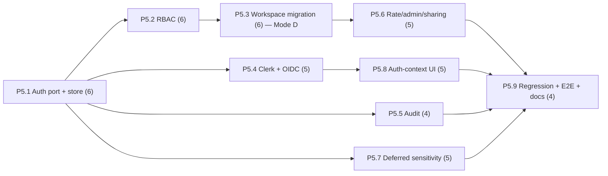

# Decisions Block: Public Multi-User P5 — Auth / RBAC / Isolation / Audit Hardening

**Feature Goal**: Turn RF from single-operator into a governed multi-user system — a swappable
`AuthProvider` (local_static default, Clerk opt-in, OIDC/BYO seam), server-side 5-role RBAC,
enforced workspace isolation, audit logging, rate limits, admin settings, and fail-closed public
sharing — while closing the three deferred sensitivity gaps (SPIKE FU-4).

This block ratifies the PRD's 5 OQ recommendations as locked decisions and encodes the phase
boundaries, routing, and ICA/Codex offload plan for `implementation-planner`.

---

## Decisions

| Decision | Rationale | Status |
|----------|-----------|--------|
| D1: AuthProvider port — local_static default / Clerk opt-in / OIDC seam (ADR-001) | Clerk has no self-host (SPIKE F5); abstraction is the deliverable | locked |
| D2: RBAC/audit in new durable `.rf_state/rbac.db`, never catalog.db (OQ-1) | catalog.db is disposable (D10); identity must survive rebuild | locked |
| D3: local_static multi-token→role table (OQ-5) | Generalize TokenAuthMiddleware; support >1 identity air-gapped | locked |
| D4: P5 after P4; AC-3 vs real ADR-002 firewall, contract-test fallback (OQ-2) | User directive; P5 composes, doesn't re-implement | locked |
| D5: Public-sharing v1 = read-only sensitivity-scoped links; defer public URLs (OQ-3) | Governed primitive without external-URL productization | locked |
| D6: Rate limit per-identity+per-route sliding window, foundry.yaml (OQ-4) | Global budget too coarse for multi-user | locked |
| D7: Enforce workspace_id/created_by via real migration (dry-run+rollback); add the column to `catalog_items` first (it's missing there) | Mixed schema state — fields exist (D12) only on builder_service.py drafts + catalog_report_drafts; catalog_items needs a schema add before migration+enforcement | locked |

---

## 1. Phase Boundaries

| Phase | Name | Scope | Success Criteria | Exit Gate |
|-------|------|-------|------------------|-----------|
| P5.1 | Auth-provider port + local_static + durable RBAC store | `AuthProvider` Protocol+registry; `AuthIdentity{user_id,workspace_id,roles}`; local_static (multi-token→role); new `.rf_state/rbac.db` (users/workspaces/memberships/roles); `foundry.yaml: auth.provider`; middleware wiring; preserve `auth_mode=none`, generic 401, 404-no-existence-leak. | Provider swap works via config; identity flows into request context; store survives catalog rebuild | `pytest` + provider-parametrized auth-header tests green |
| P5.2 | RBAC enforcement (5 roles, server-side) | Role→permission matrix; role checks on ALL HTTP mutations across catalog/reports/builder/runs/agents routers; enforce over `request.state.identity` (not UI hiding). R-P1 target_surfaces = enumerated routers. Plus: classify the CLI/service-direct mutation surface (`rf ingest`/`rf catalog rebuild`/`rf writeback`) as admin-only/single-operator-trust with a static contract test proving no HTTP bypass exists (RBAC-006) — this surface is outside `require_role(...)`'s reach entirely. | Non-role HTTP mutation → 403; visibility enforced server-side; CLI/service surface classified + contract-tested | **Human gate #2** (RBAC-before-exposure sign-off) |
| P5.3 | Workspace isolation + migration (**Mode D, top risk**) | Enforce `workspace_id`/`created_by`; data migration on existing unscoped catalog/draft records (dry-run + rollback runbook); cross-workspace denial for non-admin. | Migration dry-run clean; non-admin cross-workspace read/mutate → 404/403 | **Human gate #1** (before migration enforcement) + karen isolation milestone |
| P5.4 | Clerk adapter + OIDC/BYO seam | `ClerkAuthProvider` (pure-Python JWKS verify, org roles→5 roles); OIDC seam (concrete impl may defer, FU-2); config-flag dark by default. | Clerk verify unit-tested against JWKS fixture; local_static unaffected | **Human gate #3** (Clerk secrets handling) |
| P5.5 | Audit log | Append-only audit (durable store) of catalog mutations, report edits, agent launches, accepted artifacts, publish previews, writebacks — who/what/source/policy-snapshot. Plus: audit-store health probe + durable degraded-health state + admin warning + a public-exposure gate (`is_healthy_for_exposure()`) that P5.6 must call before shared/public exposure — mutations stay fail-open, only exposure is gated (AUDIT-004). | Every mutating path emits an audit row (assertion test); degraded state is visible, never silent | audit-coverage test green + AUDIT-004 health/exposure-gate tests green |
| P5.6 | Rate limits + admin settings + sharing/publish-preview gates | Per-identity+per-route rate limiter (foundry.yaml); admin settings surface; read-only sensitivity-scoped share links; publish-preview fail-closed. | Rate limit enforced; share link respects sensitivity; publish-preview 422 on violation | fail-closed sharing test + karen public-exposure milestone |
| P5.7 | Deferred sensitivity closes (FU-4) | runs-API existence-gate parity (`/api/runs/{id}` + claims/sources); global source index (blank-origin-draft body-sensitivity residual); draft→run/claim reverse catalog links. | Over-threshold run → 404 (existence gate); unlinked sensitive quote caught; reverse links resolve | sensitivity regression suite green |
| P5.8 | Frontend auth-context + admin UI + role-gated affordances | Auth-context abstraction (Clerk React / local login / none); admin settings UI; role-gated affordances; static-export read-only degrade. | Login works per provider; UI hides unauthorized affordances (defense-in-depth, server still enforces) | `npm run build` + Playwright auth spec |
| P5.9 | Regression + E2E + docs + migration runbook | Regression: sensitive text, catalog visibility, job perms (composes w/ P4), writeback approvals; full E2E static+live; CHANGELOG; auth/RBAC docs; migration runbook. | Full validation green in both modes | **karen end-of-feature** + Codex adversarial pass |

**Boundary Rationale**:
- P5.1→P5.2: identity contract frozen before RBAC is enforced over it.
- P5.2→P5.3: role model working before the irreversible workspace migration.
- P5.3 is the highest-risk irreversible step — isolated + human-gated + karen milestone.
- P5.7 (deferred sensitivity) is largely independent of auth → parallelizable.

---

## 2. Agent Routing

| Phase | Primary Agent(s) | Secondary | Notes |
|-------|------------------|-----------|-------|
| P5.1 | backend-architect, data-layer-expert | — | Auth port + durable store (MUST-stay) |
| P5.2 | python-backend-engineer | backend-architect | RBAC enforcement across routers (MUST-stay) |
| P5.3 | data-layer-expert, backend-architect | — | Migration (**MUST-stay, no ICA**) |
| P5.4 | backend-architect | ui-engineer-enhanced | Clerk adapter + FE login (MUST-stay for verify path) |
| P5.5 | python-backend-engineer | **ICA Sonnet 4.6** | Audit is bounded/contract-clear → offload behind review |
| P5.6 | python-backend-engineer | ui-engineer | Rate-limit + admin + sharing gates |
| P5.7 | python-backend-engineer, data-layer-expert | **ICA Sonnet 4.6** | Deferred-sensitivity closes offloadable behind review |
| P5.8 | ui-engineer-enhanced | **ICA Sonnet 4.6** (subcomponents) | Auth-context + admin UI |
| P5.9 | python-backend-engineer (tests), documentation-writer | **Codex gpt-5.5** (adversarial) | Docs → haiku |

**Parallel Opportunities**: after P5.1, {P5.4 Clerk, P5.5 audit, P5.7 deferred-sensitivity} run in
parallel (distinct files). P5.1→P5.2→P5.3 is the serial critical path. P5.8 after P5.1/P5.4 contracts.

---

## 3. Risk Hotspots

### Risk 1: Workspace migration breaks working single-operator deployments
- **Severity**: high
- **Rationale**: enforcing `workspace_id`/`created_by` on existing unscoped catalog/draft records could orphan or hide data mid-migration.
- **Mitigation**: dry-run + rollback runbook; default-workspace backfill for legacy records; Human gate #1 before enforcement; karen isolation milestone; reversible migration.

### Risk 2: Server-side RBAC gaps (UI-only enforcement leak)
- **Severity**: high
- **Rationale**: spec §11 explicitly requires server-side enforcement; hiding in UI only is a public-release blocker. The HTTP route sweep alone also misses a real, independent mutation surface: CLI/service-direct writes (`rf ingest`, `rf catalog rebuild`, `rf writeback`) that never pass through `request.state.identity` at all — an adversarial-review finding.
- **Mitigation**: R-P1 enumerated router target_surfaces; per-route role assertion tests; Human gate #2 before exposure; Codex adversarial pass. Plus: RBAC-006 explicitly enumerates and classifies the CLI/service mutation surface as admin-only/single-operator-trust with a static contract test, rather than leaving it as an unverified assumption.

### Risk 3: Sensitivity fail-open regressions during the refactor
- **Severity**: high
- **Rationale**: auth/RBAC touches read paths where the shipped fail-closed guarantee (0d9d278) lives; the FU-4 existence-gate work is adjacent.
- **Mitigation**: keep the P2/P3 sensitivity regression suite green as a gate every phase; add existence-gate + global-source-index tests (P5.7).

### Risk 4: Audit store degrades silently, undermining the audit guarantee without anyone noticing
- **Severity**: medium-high
- **Rationale**: AUDIT-001/002's fail-open write contract is, by design, silent to the mutation caller on an individual write failure; without an aggregate signal, a persistently-broken audit store (disk full, permissions, corrupted `rbac.db`) could run for weeks with 0 audit coverage and no operator would know — an adversarial-review finding.
- **Mitigation**: AUDIT-004 adds a durable degraded-health state, a startup/on-demand write probe, a loud admin warning (`rf audit health`/`GET /api/audit/health`), and a public-exposure gate (`is_healthy_for_exposure()`) that P5.6 must call before allowing shared/public exposure — without changing the underlying fail-open write contract.

---

## 4. Estimation Anchors

### Total: 47.25 points

| Phase | Points | Reasoning Anchor |
|-------|--------|------------------|
| P5.1 | 6 | New auth subsystem + durable store; H1 noun-count (users/workspaces/memberships/roles ≥2pt each) |
| P5.2 | 6.5 | RBAC across ~5 routers; H1 + cross-cutting enforcement; +0.5 for RBAC-006 (CLI/service mutation-surface classification + static contract test — a coverage gap found in adversarial review) |
| P5.3 | 6 | H3 migration/algorithmic flag; irreversible data migration + isolation |
| P5.4 | 5 | Clerk JWKS adapter + OIDC seam + FE login |
| P5.5 | 4.75 | Audit anchored to existing writeback/telemetry event plumbing; +0.75 for AUDIT-004 (degraded-health probe + admin warning + public-exposure gate — a coverage gap found in adversarial review) |
| P5.6 | 5 | Rate-limit + admin + sharing gates (3 sub-areas); consumes AUDIT-004's `is_healthy_for_exposure()` (no separate point delta — wiring an existing check into an existing gate) |
| P5.7 | 5 | 3 deferred-sensitivity closes; H4 bundle-vs-sum |
| P5.8 | 5 | Auth-context + admin UI, anchored to P3 `/builder` UI wave |
| P5.9 | 4 | H6 plumbing/test/docs + E2E in two modes + runbook |

**Estimation Notes**: 47.25 pts is a large Tier-3 feature — the plan WILL exceed 800 lines and must
split into phase files. Bottom-up (47.25) is trusted over any "just add auth" top-down read (H4:
8 capability areas). If P5.4 Clerk defers to opt-in-later, P5 v1 floor is ~42.25.

---

## 5. Dependency Map

**Critical Path**: P5.1 → P5.2 → P5.3 → P5.6 → P5.9 (auth → RBAC → isolation → gates → validation).

**Parallelizable Slices** (after P5.1): P5.4 (Clerk) ∥ P5.5 (audit) ∥ P5.7 (deferred sensitivity);
P5.8 (FE) after P5.1+P5.4 contracts.

---

## 6. Model Routing

| Phase | Agent | Model | Effort | Rationale |
|-------|-------|-------|--------|-----------|
| P5.1 | backend-architect / data-layer-expert | sonnet | extended | Auth foundation; MUST-stay |
| P5.2 | python-backend-engineer | sonnet | extended | RBAC enforcement; MUST-stay |
| P5.3 | data-layer-expert | sonnet | extended | Irreversible migration; **never ICA/Codex** |
| P5.4 | backend-architect | sonnet | extended | Clerk verify path; MUST-stay |
| P5.5 | python-backend-engineer / ICA Sonnet 4.6 | sonnet | adaptive | Audit bounded → offload behind review |
| P5.6 | python-backend-engineer | sonnet | adaptive | Gates |
| P5.7 | python-backend-engineer / ICA Sonnet 4.6 | sonnet | adaptive | Deferred-sensitivity closes offloadable |
| P5.8 | ui-engineer-enhanced / ICA Sonnet 4.6 | sonnet | adaptive | FE; subcomponents offloadable |
| P5.9 | python-backend-engineer / documentation-writer | sonnet / haiku | adaptive | Tests sonnet; docs haiku |

**Model Routing Notes**:
- **ICA Sonnet 4.6** takes P5.5 (audit), P5.7 (deferred-sensitivity closes), P5.8 subcomponents — bounded, contract-clear, **behind a `task-completion-validator` gate**.
- **Codex gpt-5.5** (read-only): adversarial review of RBAC enforcement completeness, workspace-migration safety, and sensitivity fail-closed (P5.9). Never for Mode-D implementation.
- **MUST-stay on Claude subscription**: P5.1–P5.4 (auth core + RBAC + migration + Clerk = Mode D).

---

## 7. Open Questions for Expansion

(PRD OQ-1..OQ-5 resolved above as D1–D7 — not re-opened.)

- **OQ-A**: Does RBAC enforcement wrap routers via a shared FastAPI dependency (`require_role(...)`) or per-route decorators? (implementation-planner: prefer a single dependency for R-P1 uniformity + testability.)
- **OQ-B**: Migration backfill default-workspace strategy — one synthetic `default` workspace for all legacy records, or per-`created_by` inference? Recommend a single `default` workspace (simplest reversible backfill); revisit if multi-tenant import needed.

---

## 8. Plan Skeleton Pointer

Expand into an **Implementation Plan** using `.claude/skills/planning/templates/implementation-plan-template.md`.
- **Output path**: `docs/project_plans/implementation_plans/features/public-multiuser-p5-auth-rbac-v1.md` — **WILL exceed 800 lines; split into phase files** (`.../public-multiuser-p5-auth-rbac-v1/phase-N-*.md`).
- **Reviewer gates**: `task-completion-validator` per phase; `karen` at P5.3 (isolation), P5.6 (public-exposure), end-of-feature (Tier 3).
- **Progress**: `.claude/progress/public-multiuser-p5-auth-rbac/phase-N-progress.md`.
