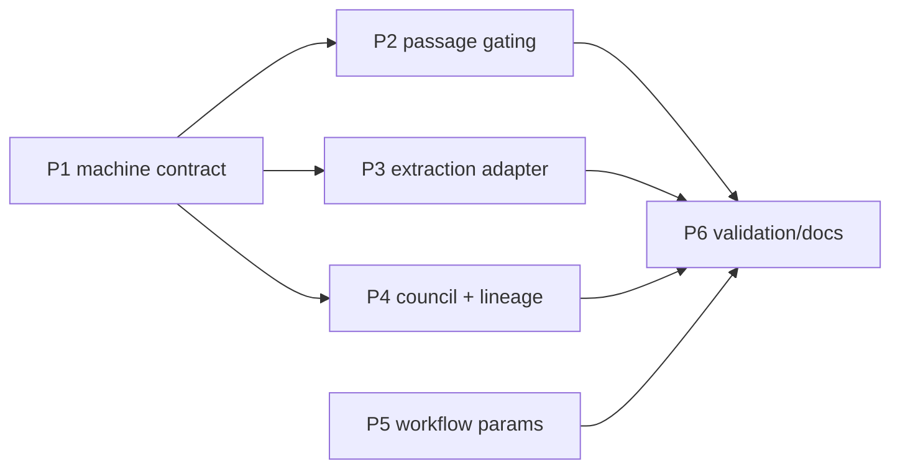

# Decisions Block — rf-upstream-evidence-foundry (RFUP-1..7)

> Opus-authored architectural scaffold. Expanded by `implementation-planner` into
> `docs/project_plans/implementation_plans/enhancements/rf-upstream-evidence-foundry-v1.md`.
> Inputs: IntentTree node_01KXRTYKKW9ECTF9MCBQ8JV1EB (7 work packages), external SPIKE-equivalent
> spec 02 (`/Users/miethe/dev/homelab/development/pediatric-anemia-site/docs/project_plans/expansion/02-evidence-foundry-on-research-foundry.md`
> §6.2 gap register + §8.3 risk table), current-state fact sheet
> (`.claude/worknotes/rf-upstream-evidence-foundry/current-state.md`).

## 0. Framing

- **What this is**: upstream enhancements to Research Foundry itself so the Evidence Foundry seam
  (pediatric-anemia-site CDS) can consume rf as its evidence→verified-claim control plane.
- **Seam boundary (hard constraint)**: everything here stays on the evidence/verified-claim side.
  NO CDS-specific logic upstream — no FHIR, no rule DSL, no signing. If a task drifts toward those,
  it is out of scope and belongs in the converter downstream.
- **Tier**: 3-scale (~26 pts across 6 in-scope items). External spec 02 stands in for the SPIKE
  (gap register + risk table already authored and reviewed downstream). No new SPIKE.
- **RFUP-6 (native discovery adapters install/eval) is DEFERRED by design** — the IntentTree node
  itself says "only after a measured value/security gap." It gets a deferred-items row + design-spec
  authoring task, not a phase.
- Category: `enhancements`. feature_slug: `rf-upstream-evidence-foundry`.
- IntentTree binding: workspace `ws_01KV8VMWXK05CTAZVHKT57HY0H`, tree `tree_01KXQ7WC1HQE2GKZSCNDVXA9G7`;
  per-item nodes RFUP-1..7 = node_01KXRTYKSH49WSKV2T9YWEYB4T, node_01KXRTYKYJD1ZHSZZJCBAKSBQ9,
  node_01KXRTYM3PYC9X5BDFQ054ZHT3, node_01KXRTYM91J4N0GRTAB4WPAQTG, node_01KXRTYME45WHHFQ382BNPBQ1D,
  node_01KXRTYMM3V25RMM8ZPBNRS9PN, node_01KXRTYMSFSZ4FGWNM4RE95YF5.

## 1. Phase Boundaries

| Phase | Name | RFUP | Scope | Exit gate |
|-------|------|------|-------|-----------|
| 1 | Machine contract & schema versioning | RFUP-4 | Stamp `rf_schema_version` (semver) into every machine-readable surface (run export, verify output, catalog/API payloads, `--json` outputs); guarantee stable contract = exit code + YAML/JSON only (Rich is presentation-only, never the contract); contract doc + drift tests | contract tests green; documented machine-surface inventory; task-completion-validator pass |
| 2 | Exact-passage hard-gating in `rf verify` | RFUP-3 | New eligibility check: claims citing a source card without an exact passage/quote anchor fail (not warn) **when strict mode is on**; profile/flag-gated (`verify.exact_passage: warn\|strict`, default `warn`); machine-readable violation list in verify output | strict mode blocks synthetic violation corpus; default mode unchanged on existing real corpus; validator pass |
| 3 | Governed URL/PDF extraction adapter | RFUP-2 | PDF text extraction adapter (pypdf-class dep, optional extra) + extraction pipeline hardening in `rf fetch`; governed: passes existing governance gate (sensitivity, secret scan) before card write; explicit `extraction_status` on source cards (full_text \| partial \| locator_only); locator-only degradation becomes explicit + queryable | PDF fixture → full-text source card; degradation path emits status; governance gate exercised in tests; validator pass |
| 4 | Council normalization + run lineage | RFUP-5, RFUP-7 | (a) Normalize council results to `approve\|concern\|block` enum stored alongside raw text (non-destructive; unparseable → `concern` + flag); (b) run immutability: `rf seal`-style finalization marker + append-only lineage record so a sealed run's evidence chain (claim ledger, source cards, report) is tamper-evident (content digest over bundle, reusing assertion-registry digest patterns) | sealed-run mutation attempt detected by digest check; council enum in machine output; validator pass |
| 5 | Parameterize Path-B workflow | RFUP-1 | `rf-run-execute.js`: hard-coded RF binary/REPO/TMP paths + date stamp → args/config with validation; run-date computed not frozen; keep four-constraints compliance (workflow-authoring skill); registry updated | node --check + dry-run with args on a scratch run; no literal machine paths remain; validator pass |
| 6 | Validation, docs & deferral | — | Cross-phase regression (full pytest under venv), CHANGELOG, docs updates (service contract, skills touching `rf fetch`/`verify`/council), RFUP-6 design spec (deferred item), IntentTree node status writebacks | karen end-of-feature pass; suite green; deferred spec authored |

Ordering rationale: Phase 1 first — the schema/contract surface is what phases 2–4 emit into, so
land the version stamp before adding new machine fields. Phases 2 and 3 are independent of each
other (can overlap in waves). Phase 4 items are small and share the "machine output" theme. Phase 5
is JS-side and fully independent — schedulable any time, kept late to avoid contending with Python
phases in review. karen milestone checkpoints (Tier 3): after Phase 3 and at Phase 6.

## 2. Agent Routing

| Phase | Primary | Secondary | Reviewer |
|-------|---------|-----------|----------|
| 1 | python-backend-engineer | api-designer (contract doc) | task-completion-validator |
| 2 | python-backend-engineer | — | task-completion-validator |
| 3 | python-backend-engineer | backend-architect (adapter shape) | task-completion-validator + karen (milestone) |
| 4 | python-backend-engineer | data-layer-expert (lineage/digest) | task-completion-validator |
| 5 | ai-artifacts-engineer (workflow script, four-constraints) | — | task-completion-validator |
| 6 | documentation-writer, changelog-generator | prd-writer (RFUP-6 design spec) | karen (feature end) |

Parallel opportunities: Phase 2 ∥ Phase 3 (different modules: verify vs fetch); Phase 4a ∥ 4b;
Phase 5 ∥ any Python phase. Single-file conflicts to watch: both Phase 1 and Phase 2 touch verify
output emission — Phase 2 rebases on Phase 1's stamped schema.

## 3. Risk Hotspots

| Risk | Sev | Mitigation |
|------|-----|-----------|
| Strict passage gating breaks existing corpus (2,835 backfilled assertions; KnitWit + prior runs) | HIGH | Flag/profile-gated, default `warn`. Strict is opt-in per run/profile (Evidence Foundry sets strict). Regression test runs default mode over a real-corpus sample and asserts zero new failures. |
| Immutability breaks in-place run workflows (rf tail, report iteration) | HIGH | Immutability applies only to explicitly sealed runs; pre-seal behavior unchanged. Seal is additive metadata + digest, no file locking. |
| Schema stamp churn breaks runs-viewer / existing consumers | MED | Additive-only in this feature (stamp new field, never rename existing). runs-viewer export schema (hand-written run-export.ts, dual-update rule) checked in Phase 1; bump to 1.6 only if a field is added to run export. |
| PDF extraction dependency weight / security (parsing untrusted PDFs) | MED | Optional extra (`pip install research-foundry[pdf]`); graceful degrade to locator_only when absent; extraction runs pre-governance-gate so secret scan/sensitivity apply to extracted text. |
| Council normalization misclassifies free-form verdicts | LOW | Non-destructive: raw text always retained; unparseable → `concern` (fail-toward-caution) + `normalization_confidence` flag. |
| Workflow param refactor breaks the proven Path-B lane | MED | Backward-compat default config reproducing current behavior on this machine; dry-run gate before registry update; four-constraints checklist re-run. |
| Governance regression (WKSP-304 / DI-1 surface) | MED | New adapter + seal surfaces go through existing governance gate; no new privileged writeback targets. Flag any workspace-scoping-relevant query for the DI-1 audit register. |

Mode D check: none of the six in-scope items touch auth, payments, migrations, or data deletion.
Closest edge is Phase 4b (lineage) — it must NOT delete or rewrite history, append-only by design.

## 4. Estimation Anchors

| Phase | Pts | Anchor |
|-------|-----|--------|
| 1 | 5 | assertion-ledger P3 forward-write driver (comparable: stamp+thread a field through emit paths) |
| 2 | 4 | writeback-default-deny-gate exploration → gate work (flag-gated verify check, similar shape) |
| 3 | 8 | Search Router MVP (`rf search`/`rf fetch`, merged d119993) — same pipeline, adapter + provider work; H3 applies (extraction/transform) |
| 4 | 5 | 3 (RFUP-5) + 2... council normalization is S; lineage digest reuses assertion-registry atomic-write/digest patterns → 5 combined |
| 5 | 4 | knitwit-run-execute.js generalization (same workflow, already partially generalized once) |
| 6 | 3 | standard finalization phase incl. H6 plumbing budget |
| **Total** | **29** | H4 floor ≈ sum of per-area estimates; H6 included in Phase 6; H2 n/a (no dual local/enterprise implementation) |

## 5. Dependency Map

Critical path: P1 → P2 → (P4) → P6. P3 and P5 hang off P1 loosely (P3 needs the
`extraction_status` field to land under the stamped schema; P5 independent).

## 6. Model Routing

| Phase | Executor model / effort | Notes |
|-------|------------------------|-------|
| 1–4 | sonnet / adaptive | python-backend-engineer default |
| 5 | sonnet / adaptive | workflow-authoring skill loaded by executor |
| 6 | haiku / adaptive (docs, changelog); sonnet for RFUP-6 design spec | |
| Reviewers | sonnet (validator); opus (karen) | karen after P3 + at P6 |

Routing decision (delegation-router, 2026-07-18): all legs claude-native; ICA fallback chain
recorded (sonnet-5[1m] → sonnet-5 for authoring legs; haiku-4-5 for mechanical legs).
Orchestration/verdict/merge stay primary (MUST-stay).

## 7. Open Questions for Expansion (implementation-planner)

- OQ-1: exact config key + profile shape for strict passage gating (`verify.exact_passage` vs
  sensitivity-profile-driven) — planner proposes; keep both run-level flag and config default.
- OQ-2: seal trigger surface — new `rf seal <run>` command vs flag on existing finalize/export
  path. Planner picks the smaller surface; must be additive.
- OQ-3: which PDF extraction lib (pypdf vs pdfminer.six) — planner picks based on existing deps;
  optional-extra either way.
- OQ-4: whether council enum lands in run export schema now (bump 1.6) or stays CLI/YAML-only
  until the viewer needs it — default: stay out of the viewer export this feature.

## 8. Plan Skeleton Pointer

- Template: `.claude/skills/planning/templates/implementation-plan-template.md`
- Output: `docs/project_plans/implementation_plans/enhancements/rf-upstream-evidence-foundry-v1.md`
- PRD: `docs/project_plans/PRDs/enhancements/rf-upstream-evidence-foundry-v1.md`
- Human brief (qualifies: 29 pts, 6 phases): `docs/project_plans/human-briefs/rf-upstream-evidence-foundry.md`
- Progress: `.claude/progress/rf-upstream-evidence-foundry/phase-N-progress.md` (artifact-tracking skill)
