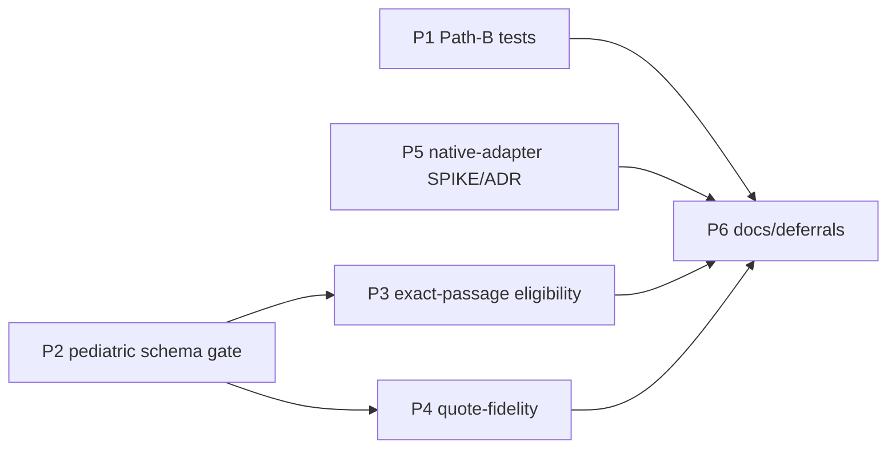

# Decisions Block — RFUP External-Routing Gap Closure

> Opus-authored architectural scaffold (Tier 3). `implementation-planner` (sonnet) expands this into
> the full plan. This block carries only the *new decisions*; stable context lives in durable docs.
> feature_slug: `rfup-external-routing` · category: `enhancements` · tier: 3 · risk_level: medium
> PRD: `docs/project_plans/PRDs/enhancements/rfup-external-routing-v1.md`
> Source: IntentTree work_area `node_01KXRTYKKW9ECTF9MCBQ8JV1EB`; scope-brief + state-audit under
> `.claude/worknotes/rfup-external-routing/`.

## 0. Framing (read once)

This is a **DELTA plan**, not a rebuild. Commit `001a834` already landed RFUP-1..5,7 on `main`. The
four requested items are only *partially* open — see state-audit. Do not re-scope completed work.

**Seam boundary (hard invariant):** only evidence→verified-claim logic goes upstream into `rf`.
NEVER push CDS-specific FHIR / rule-DSL / signing into `rf` — those stay in `pediatric-anemia-site`.

**Tier-3 SPIKE handling:** no separate pre-PRD SPIKE. Items 1–3 design is settled (DF-E1-03,
ADR-0008, the existing RFUP specs). The one genuine research unknown (item 4 native-adapter
value/security) is delivered *as* Phase 5, which doubles as the Tier-3 SPIKE. Phase 5 is **eval-only**
— no install, no live external calls, no credentials — so the whole plan stays out of Mode-D
execution.

## 1. Phase Boundaries

| Phase | Name | Scope (delta only) | Success criteria | Exit gate |
|-------|------|--------------------|------------------|-----------|
| **P1** | Path-B test hardening (item 3) | Add run-date / path-injection tests to `.claude/workflows/rf-run-execute.js` + `rf-pediatric-cds-run-execute.js`. Code is already args-driven (no `Date.now()`); **tests only**. | `stampFromTimestamp`, fallback-path, and `rf_bin`/`repo`/`tmp_dir`/`run_id` injection are test-covered and green; scheduled/unattended use unblocked. | task-completion-validator |
| **P2** | Pediatric evidence-card schema + hard-gate (item 1) | Replace `additionalProperties: true` on the `pediatric_cds` card extension with a formal JSON Schema; hard-gate completeness/type. | Invalid/incomplete `pediatric_cds` block **fails closed**; valid passes; fixtures for both; schema stamped with a version consistent with RFUP-4's machine-contract. | task-completion-validator + **karen milestone** |
| **P3** | Exact-passage eligibility + threshold hard-gate (item 2) | Gate already exists (`resolve_exact_passage_mode`, `--exact-passage` strict) but is warn-only w/ no eligibility filter. Add auto-strict for threshold/clinical claims + default policy. | `threshold`-kind claims lacking an exact passage block publish by default; non-threshold unaffected; tests. | task-completion-validator |
| **P4** | Quote-fidelity check (NEW — open edge) | Detect / normalize / gate character-level source corruption (PMC superscript stripping ×10⁹/L→×10/L). Diff ingested quote vs source text; extensible detector. | Known superscript-class corruption detected + gated (or normalized per OQ-3); fixtures reproduce ×10⁹/L; other classes logged deferred. | task-completion-validator + **karen milestone** |
| **P5** | Native-adapter SPIKE + ADR-0008 verdict (item 4, EVAL-ONLY) | Evaluate `litellm_router` value + security posture; emit accept/reject on ADR-0008; produce (unexecuted) install/wiring plan. | Feasibility/eval report + ADR-0008 flipped to accepted\|rejected\|conditional w/ rationale. **No install, no live calls, no credentials touched.** | task-completion-validator |
| **P6** | Docs / deferrals finalization (DOC-006) | CHANGELOG `[Unreleased]`; design-spec authoring stubs for each deferred item (remaining 5 native adapters + OQs); context/CLAUDE.md pointer updates. | Changelog entry present; every deferred item has a design-spec stub; docs current. | task-completion-validator + **karen (end of feature)** |

## 2. Agent Routing

| Phase | Primary | Secondary | Parallel opportunity |
|-------|---------|-----------|----------------------|
| P1 | python-backend-engineer | — | ∥ with P5 (Wave 1) |
| P2 | python-backend-engineer | data-layer-expert (schema modeling) | — (critical path root) |
| P3 | python-backend-engineer | — | ∥ with P4 (Wave 3) |
| P4 | python-backend-engineer | — | ∥ with P3 (Wave 3) |
| P5 | spike-writer (opus) | search-specialist (prior-art) | ∥ with P1 (Wave 1) |
| P6 | documentation-writer | changelog-generator | — (final wave) |

**Haiku override:** default haiku agents hard-error in this env — route documentation-writer /
changelog-generator on **sonnet**.

**Integration owner (R-P3):** P2/P3/P4 all touch `src/research_foundry/services/verification.py`
(and P2 also `services/source_cards.py`). `integration_owner = python-backend-engineer` for the
Wave-3 pair; add one **seam task**: run the full `rf verify` regression after P3+P4 land to prove the
three gates compose (no gate masks or double-counts another).

## 3. Risk Hotspots

| # | Risk | Severity | Mitigation |
|---|------|----------|------------|
| R1 | **Clinical-gate correctness** (P2/P3/P4): false-pass admits corrupt/incomplete evidence into a pediatric CDS pipeline; false-block halts valid runs. This is *why* the feature is Tier 3 despite modest points. | High | Fail-closed defaults; paired fixtures (valid + corrupt) per gate; **karen milestone after Wave 3**; no gate ships warn-only where the spec says hard. |
| R2 | **Shared `verification.py` churn** across P2/P3/P4. | Medium | Sequence P2 (schema) before Wave-3 pair; declare `integration_owner`; seam regression task. |
| R3 | **Item-4 scope creep into install / Mode-D.** | Medium | Hard constraint: P5 eval-only, no egress/credentials; ADR verdict is the sole deliverable; any install is a *separate future feature* gated on the verdict. |
| R4 | **Quote-fidelity strategy ambiguity** (P4): normalize-vs-reject; which corruption classes. | Medium | Scope to known superscript-class + extensible detector; document the normalize-vs-reject call inline (OQ-3); log other classes deferred. |
| R5 | **JS test harness absence** (P1): RF is python-first; workflows are node. | Low | OQ-1 to planner; fallback = `node:test` or ad-hoc assertion script. |
| R6 | Schema-version / machine-contract drift vs RFUP-4. | Low | Reuse existing schema-version stamping from `001a834`; keep fail-closed on drift. |

## 4. Estimation Anchors (H1–H6)

- **H5 anchor:** commit `001a834` "RFUP-1..5,7" — same surface (`verification.py`, `source_cards.py`,
  workflows, CLI), ran as a 6-phase Tier-3 plan. This delta is smaller per-phase (several S / eval).
- **Bottom-up (H4 floor):** P1≈2 · P2≈5 · P3≈4 · P4≈5 · P5≈5(research) · P6≈3 = **~24 pts**.
- **H6 hidden plumbing (+~15%):** schema DTO/version stamp, CLI flag wiring, test fixtures, changelog
  → +~3 pts. **Total ≈ 24–27 pts** → firmly Tier 3.
- **H3 algorithmic flag:** P4 (fidelity diff/normalize) trips the "transform/diff" flag → ≥3 pts and
  needs enumerable test scenarios (superscript fixtures) — satisfied.

## 5. Dependency Map

Critical path: **P2 → {P3, P4} → P6**. P1 and P5 are off the critical path.

**Waves:** Wave 1 = P1 ∥ P5 · Wave 2 = P2 · Wave 3 = P3 ∥ P4 (integration_owner + seam task) ·
Wave 4 = P6.

## 6. Model Routing

| Phase | Agent | Model | Effort |
|-------|-------|-------|--------|
| P1 | python-backend-engineer | sonnet | adaptive |
| P2 | python-backend-engineer (+ data-layer-expert) | sonnet | extended |
| P3 | python-backend-engineer | sonnet | extended |
| P4 | python-backend-engineer | sonnet | extended |
| P5 | spike-writer | opus | adaptive |
| P6 | documentation-writer / changelog-generator | sonnet | adaptive |

## 7. Open Questions for Expansion (implementation-planner resolves or forwards)

- **OQ-1** (P1): What JS test harness exists for `.claude/workflows/*.js` — `node:test`, or an ad-hoc
  assertion script? Determine before writing tests.
- **OQ-2** (P2): Hard-gate enforcement point — ingest-time (`source_cards.py`), verify-time
  (`verification.py`), or both? state-audit flags both as candidates.
- **OQ-3** (P4): Fidelity policy — normalize corrupt quotes in place vs reject/flag only? Which
  corruption classes beyond superscript stripping are in-scope for v1?
- **OQ-4** (P3): Default policy — flip default to strict for threshold claims globally, or gate on
  audience/sensitivity (clinical only)?
- **OQ-5** (P5): Does the eval need any *offline/sandboxed* `litellm` probe, or is it purely
  doc + code + security-posture review? Must stay no-live-call regardless.

## 8. Plan Skeleton Pointer

- Template: `.claude/skills/planning/templates/implementation-plan-template.md`
- Output: `docs/project_plans/implementation_plans/enhancements/rfup-external-routing-v1.md`
- Wave-plan frontmatter required (see waves in §5) for `/dev:execute-plan`.
- Human-brief applies (≥8 pts, ≥2 phases): scaffold
  `docs/project_plans/human-briefs/rfup-external-routing.md` with H1–H6 output migrated to §2.
