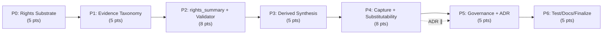

# Decisions Block: Rights & Evidence-Item Entity Model

<!-- Opus-authored scaffold. Expands into PRD (already delegated) + Implementation Plan via
     implementation-planner (sonnet). This block carries only NEW decisions; RF conventions
     (schemas/*.yaml + schemas.py Registry, capture.py pipeline, governance.py pass) are durable
     context referenced by path, not restated. -->

**Feature Goal**: Make reuse rights, licence, access basis, terms, and the measured-vs-judged evidence distinction *machine-checkable properties* of the source and evidence entities RF captures — by porting the verified v1.0 rights substrate into RF and binding it to captured entities via a fail-closed, non-authoritative mirror plus an evidence-taxonomy axis.

**Context correction (load-bearing)**: The v1.0 "Source Reuse & Rights Governance Spec" + its 5 schemas were authored and "adopt"-verified in the *pediatric-anemia-site* repo; **none of them exist in the RF product repo**. This plan therefore lands the substrate first (Phase 0), then builds C1–C4 on top. RF is greenfield for `rights_record`/`rights_extension`.

---

## Decisions

| Decision | Rationale | Status |
|----------|-----------|--------|
| D1: Phase 0 ports v1.0 substrate (rights_record/rights_extension/access/terms) into RF `schemas/*.yaml` before any capability work | C1 mirror requires an authoritative record; substrate absent from RF today | locked |
| D2: Denormalized `rights_summary` entity mirror, not a runtime resolution API | Files-canonical + offline-readable-run constraints; recall path takes no service | locked |
| D3: RF authors its own canonical rights ADR; does not edit the pediatric v1.0 doc | Repo boundaries; canonical model assigned to RF | locked |
| D4: Evidence taxonomy in sibling `extensions.evidence_taxonomy`, decoupled from `rights_extension` | §9.1 — rights and evidence-quality are independent axes | locked |
| D5: `CLEARED_*`/`counsel_approved`/`attested` human-only, fail-closed, both write paths guarded + negative-tested | §9.10 authorization boundary; Mode-D-adjacent | locked |
| D6: Record-the-debt for surveillance (OQ-RF-5) + counsel role (OQ-RF-6) | MVP; name gaps, don't build the loop | locked |
| D7: Runtime resolution API (OQ-RF-3 alt) → DOC-006 design spec, deferred | Mirror is MVP; API is future optimization | pending |

---

## Schema-Conflict Adjudications (§9 — the core design value-add)

<!-- These are resolved by Opus. implementation-planner turns each into concrete schema tasks in the
     phase that owns the affected schema. Each row: conflict → RF resolution. -->

| ID | Conflict (handoff §9) | RF Adjudication (locked) | Owning Phase |
|----|----------------------|--------------------------|--------------|
| §9.1 | Taxonomy can't ride `rights_extension` | New sibling `extensions.evidence_taxonomy` block; taxonomy never nested under rights | P1 |
| §9.2 | `access.basis` enum lacks `unknown` | Add `unknown` as default member; fail-closed | P0 |
| §9.3/§9.4 | TDM / model-training modelled twice with incompatible enums | Single canonical `tdm_model_training` enum on `rights_record`; drop the duplicate; extension references it | P0 |
| §9.5 | `rights_record` can't describe first-party/owned content (no `source_id`, no `OWNED`) | Add optional `source_id` (nullable) + `OWNED` status member so first-party + synthesis records validate | P0 |
| §9.6 | `format: uri` + nullable-empty `contract{}` fail OPEN | Make URI validation strict where present; `contract{}` absence must not imply "no restriction" — absence maps to `unknown`, never "cleared" | P0 |
| §9.7 | `review_status` enum divergence between the two schemas | Reconcile to one `review_status` vocabulary shared by record + summary; document the crosswalk in the ADR | P0/P5 |
| §9.8 | `component_type` enum divergence | Single canonical `component_type` set; extension inherits it | P0 |
| §9.9 | Amendment invalidates shipped examples + validation_report/checksums | RF uses inline-dict test fixtures (no checksum files) — regenerate RF example source_cards/evidence with rights_summary in P6; note pediatric-repo fixtures are not RF's concern | P6 |
| §9.10 | `CLEARED_*` prohibition guards only one of two write paths | Guard BOTH `status` and `review_status`/attestation write paths; negative test asserts neither can reach a cleared value via any agent path | P3/P5 |
| OQ-RF-2 | `evidence_item_type` base vs Evidence-Foundry specialization | Base axis: ship the 7-member enum as the base + mark it domain-extensible (extension mechanism, not a closed clinical list) | P1 |

---

## 1. Phase Boundaries

| Phase | Name | Scope | Success Criteria | Exit Gate |
|-------|------|-------|------------------|-----------|
| P0 | Rights Substrate | Port rights_record/rights_extension/access/terms into `schemas/*.yaml`; adjudicate §9.2–9.8; register in `schemas.py`; inline valid/invalid tests | 4 substrate schemas validate in Registry; fail-closed defaults; §9 adjudications applied | `pytest tests/test_schema_validation.py` green for new schemas |
| P1 | Evidence Taxonomy (C2) | `evidence_item_type` (7, extensible) + separate required `judgment_basis` (default `unassessed`) in sibling `extensions.evidence_taxonomy`; release-gate rule (unassessed blocks commercial, not capture) | 3 independent axes, no cross-derivation; release-gate tested both directions | task-completion-validator pass |
| P2 | Rights Summary Mirror + Validator (C1) | `rights_summary` object (§2.2), `mirror_is_authoritative` const false, fail-closed; attach to source+evidence; §2.6.1 presence invariant; backfill migration; time-parameterized `--as-of` divergence validator (no wall-clock) | Divergence + coverage validators pass with negative tests; existing entities migrate to all-unknown | task-completion-validator pass |
| P3 | Derived Synthesis (C3) | `derived_synthesis` member + `synthesis` object (input_refs minItems 2, attestation{candidate\|attested}); attestation=attested non-agent-writable (both paths, §9.10); valid without third-party source_id | Fail-closed attestation negative test passes over both write paths; synthesis validates first-party | **karen** milestone (Mode-D-adjacent) |
| P4 | Capture Emission + Substitutability (C4) | capture emits rights_summary at `agent_triage_only` (hook `capture.py`/triage); terms snapshot (content-addressed + sha256 + verified_at + structural-failure record + re-snapshot diff); `substitutability` object incl. `no_substitute_found` | Capture produces fail-closed rights_summary; snapshot + substitute paths tested | **karen** milestone |
| P5 | Governance Gate + Canonical ADR | Wire invariants into `governance.py` (no agent path → CLEARED_*/counsel_approved/attested; no third-party full-text stored); author RF canonical rights ADR (§9 adjudications + §8 spec-amendment reasoning: Feist/CCC/ADA, §3.7 works-vs-funded, §3.2 territorial, §16.2 caveat); record-the-debt gaps | Governance adversarial tests pass; ADR published; gaps named | task-completion-validator pass |
| P6 | Testing, Docs, Fixtures, Finalization | Full schema/validator/release-gate/attestation/governance test sweep; regenerate RF example fixtures (inline-dict); CLAUDE.md pointer + artifact-type-reference + `rf` CLI help + README + CHANGELOG [Unreleased]; DOC-006 design specs for deferred items | Full suite green; docs updated; CHANGELOG entry present | **karen** end-of-feature |

**Boundary Rationale**:
- P0→P1: substrate schemas must be authoritative + registered before any mirror or axis references them.
- P1→P2: evidence taxonomy is independent of rights and lower-risk; land it first (handoff's flagged priority) so the mirror work builds on a stable evidence-entity shape.
- P2→P3: the mirror + validator establish the fail-closed pattern P3's attestation boundary reuses.
- P3/P4 are Mode-D-adjacent (authorization boundary + capture writeback) → karen milestones, not just validator.
- P5 collects all governance-gate wiring + the doc workstream so schema phases stay pure-schema.

---

## 2. Agent Routing

| Phase | Primary Agent(s) | Secondary Agent | Notes |
|-------|------------------|-----------------|-------|
| P0 | data-layer-expert | python-backend-engineer | Schema authoring + Registry wiring in `schemas.py` |
| P1 | data-layer-expert | python-backend-engineer | Taxonomy enums + release-gate service |
| P2 | data-layer-expert (schema) + python-backend-engineer (validator) | — | Time-parameterized validator is the algorithmic piece (H3) |
| P3 | python-backend-engineer | data-layer-expert | Attestation fail-closed guard is the risk core |
| P4 | python-backend-engineer | — | Capture pipeline (`capture.py`), terms snapshot, substitute discovery |
| P5 | python-backend-engineer (governance) | documentation-writer (ADR) | Governance wiring + canonical ADR |
| P6 | python-backend-engineer (tests) | documentation-writer + changelog-generator | Test sweep + docs + CHANGELOG |

**Parallel Opportunities**:
- P0 must complete before all others (substrate is the root dependency).
- P1 (evidence taxonomy) ∥ early P2 schema work possible after P0 — different schema files, low overlap. Sequence conservatively (P1→P2) given shared evidence-entity edits.
- P5 ADR authoring ∥ P4 implementation (different owners, no file overlap).

---

## 3. Risk Hotspots

### Risk 1: Fail-closed authorization boundary leaks (agent sets a cleared value)
- **Severity**: high
- **Rationale**: §9.10 already found one of two `CLEARED_*` write paths unguarded. A leak means an automated agent could assert legal clearance — the exact failure the whole feature exists to prevent.
- **Mitigation**: P3/P5 guard BOTH `status` and `review_status`/attestation paths; mandatory negative tests asserting no agent path reaches `CLEARED_*`/`counsel_approved`/`attested`; karen milestone at P3.

### Risk 2: Substrate port drifts from the verified v1.0 schemas
- **Severity**: medium
- **Rationale**: The v1.0 schemas were adversarially verified in the pediatric repo; a sloppy port that silently changes semantics loses that verification and the §9 adjudications become ungrounded.
- **Mitigation**: P0 ports field-by-field with the §9 adjudication table as the ONLY intended deltas; ADR (P5) records every deviation from v1.0 with rationale.

### Risk 3: Validator reads wall-clock time → non-reproducible runs
- **Severity**: medium
- **Rationale**: Rights/terms have time-dependent validity (`next_review_at`, terms `verified_at`). A validator that calls `datetime.now()` breaks byte-reproducibility — no wall-clock precedent exists in RF today (greenfield).
- **Mitigation**: `--as-of` parameter is a hard requirement; test asserts identical output across two invocations; code review greps for `datetime.now|utcnow|time.time|date.today`.

### Risk 4: Backfill migration breaks existing runs
- **Severity**: medium
- **Rationale**: §2.6.1 requires every existing source + evidence entity to carry a `rights_summary`. A backfill that fails validation or is skipped leaves the corpus in a mixed state.
- **Mitigation**: Backfill emits all-`unknown` summaries (fail-closed = valid by construction); P2 exit gate runs the existing corpus through the validator.

---

## 4. Estimation Anchors

### Total: 41 points

| Phase | Points | Reasoning Anchor |
|-------|--------|------------------|
| P0 | 5 | 4 substrate schemas + Registry wiring + §9 adjudications. Anchor: reusable-assertion-ledger phase0/phase1 (multi-schema landing with inline tests). |
| P1 | 5 | 2 enums + sibling extension block + release-gate service (H3 algorithmic: gate logic). Anchor: source_assertion.schema landing + governance profile gate. |
| P2 | 8 | New object + dual attachment + backfill migration + time-parameterized validator (H3, no precedent → +buffer). Highest single-phase estimate. |
| P3 | 5 | 1 object + member + the fail-closed attestation guard (H3: two-path authorization). Anchor: governance adversarial suite. |
| P4 | 8 | Capture-pipeline hook + terms snapshot (content-addressing + diff, H3) + substitute discovery (H3 ranking). Touches `capture.py` + services. |
| P5 | 5 | governance.py wiring + canonical ADR (doc-heavy) + record-the-debt. Anchor: governance.py secret-scan pass. |
| P6 | 5 | H6 hidden-plumbing: test sweep, fixture regen, CLAUDE.md/artifact-type-reference/CLI help/README/CHANGELOG. |

**Estimation Notes**:
- H2 dual-implementation multiplier N/A (no local+enterprise split here; single file-backed plane).
- H3 flags fire on P2 (validator), P4 (snapshot diff + substitute ranking) — these carry the buffer and are the SPIKE-adjacent slices; SPIKE waived because the algorithms are bounded (divergence check, sha256 diff, discovery record) and enumerable in tests.
- H4 bundle-vs-sum: 4 capability areas (substrate, taxonomy, mirror, capture) → summed floor ≈ 41; matches.
- H5 anchor: no single past RF feature is this large; nearest is the reusable-assertion-ledger multi-phase rollout (phase0→phase1 tests) scaled up ~2×.

---

## 5. Dependency Map

**Critical Path**: P0 → P1 → P2 → P3 → P4 → P5 → P6 (schema substrate gates everything; each schema phase builds on the prior entity shape; governance + docs finalize).

**Parallelizable Slices**: P5 ADR authoring (documentation-writer) can run ∥ P4 implementation; P6 doc tasks can start once P5 ADR lands.

---

## 6. Model Routing

| Phase | Agent | Model | Effort | Rationale |
|-------|-------|-------|--------|-----------|
| P0 | data-layer-expert | sonnet | extended | Careful field-by-field port + §9 adjudications; correctness-critical |
| P1 | data-layer-expert | sonnet | adaptive | Enum + extension block; moderate |
| P2 | python-backend-engineer | sonnet | extended | Time-parameterized validator is the hardest reasoning slice |
| P3 | python-backend-engineer | sonnet | extended | Fail-closed authorization boundary; get both paths right |
| P4 | python-backend-engineer | sonnet | extended | Capture-pipeline integration + snapshot/diff algorithm |
| P5 | python-backend-engineer / documentation-writer | sonnet | adaptive | Governance wiring routine; ADR needs sonnet for legal-reasoning prose |
| P6 | python-backend-engineer / changelog-generator | sonnet | adaptive | Test sweep + docs; mechanical |

**Model Routing Notes**:
- All Claude-native; no external model callouts needed (no image/web-research/frontend work).
- **Do NOT route to default haiku agents** (artifact-tracker/documentation-writer/changelog-generator default haiku, which hard-errors in this env) — override to `sonnet` when dispatched.
- Reviewer gates: task-completion-validator (P0,P1,P2,P5), karen (P3,P4 milestones + P6 end-of-feature).

---

## 7. Open Questions for Expansion

- **OQ-1 (resolved → P0)**: How closely must RF schemas mirror the v1.0 JSON files? → Port semantics faithfully; only the §9 adjudication-table rows are intended deltas; RF uses YAML-form JSON Schema (`schemas/*.yaml`), not `.json`.
- **OQ-2 (resolved → P1)**: Is `evidence_item_type` clinical or general? → General base axis (7 members) + domain-extensible extension mechanism; do not hard-code the clinical list as closed.
- **OQ-3 (deferred → DOC-006)**: Should a runtime resolution API replace the mirror? → No for this plan; author a design spec capturing the API alternative + when it would be worth it.
- **OQ-4 (resolved → P4)**: Where do terms snapshots live? → Store hash + snapshot content-addressed in the RF run directory; external hosting is a named gap.
- **OQ-5 (implementation-planner)**: Does the backfill migration need a dedicated `rf` subcommand, or is it a one-shot script? Planner decides based on corpus size + whether re-runs are needed.
- **OQ-6 (implementation-planner)**: Should the release-gate rule live in `governance.py` or `verification.py`? Weigh: gate is policy (governance) but fires at verify-time (verification) — recommend governance owns the rule, verification calls it.

---

## 8. Plan Skeleton Pointer

Expands into a full **Implementation Plan** using:
- **Template**: `.claude/skills/planning/templates/implementation-plan-template.md`
- **Output path**: `docs/project_plans/implementation_plans/infrastructure/rights-entity-model-v1.md` (+ phase files if >800 lines; likely split P0-P2 / P3-P4 / P5-P6).
- **PRD**: `docs/project_plans/PRDs/infrastructure/rights-entity-model-v1.md` (authored in parallel).
- **Opus review**: sanity check post-expansion — verify P0 substrate scope, the §9 adjudication table propagated to tasks, and the fail-closed negative-test tasks exist in P3/P5.

---

## Notes for implementation-planner

- The **§9 Schema-Conflict Adjudications table is binding** — each row must become at least one concrete schema task in its owning phase; do not re-litigate the resolutions.
- Apply **R-P2** (every new backend field → implicit "consumer handles missing X" AC) to every new rights_summary/synthesis field — fail-closed absence handling is a contract state.
- P3 and P5 MUST each carry an explicit **negative-test task** proving no agent path reaches `CLEARED_*`/`counsel_approved`/`attested` over BOTH write paths (§9.10 / D5).
- P6 must include **DOC-006 design-spec tasks** for the deferred items: runtime resolution API (OQ-3), surveillance loop (OQ-RF-5), counsel/rights-owner workflow (OQ-RF-6).
- Populate `changelog_required: true`, `deferred_items_spec_refs: []`, `findings_doc_ref: null` in plan frontmatter.
- Do NOT restate CLAUDE.md/RF architecture — reference by path.
