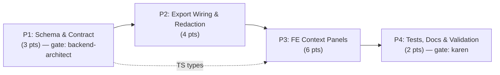

# Decisions Block: Runs Viewer — Run Context Panels (FR-14)

**Feature Goal**: Surface four read-only "why/how" context panels — Routing Decision,
Research Brief, Swarm Plan, and Upstream Entities — inside the runs-viewer run-detail
view, fed by an additive `context` key in the frozen `run.json` export, so operators
can see *why a run was created* and *how the research was conducted* without dropping to
the CLI.

**Tier note**: Estimated 15 pts crosses the Tier-3 floor (13+), but **a SPIKE is waived**.
Rationale: the design spec (`docs/project_plans/design-specs/runs-context-panels.md`)
already settled the approach (additive key, reuse report-overlay Markdown renderer,
lineage-style tree for swarm_plan, graceful degradation); a clean H5 anchor exists
(`run-metadata-enrichment`, ~16–20 pts); and the sole blocking unknown (OQ-1: delivery
mechanism) is an **architecture decision resolved in this block**, not a research question.
Reviewer cadence is elevated to Tier-3 grade: **`karen` per phase milestone + feature end**,
plus `task-completion-validator` per phase.

**OQ-1 RESOLVED (delivery mechanism)** → **Option A: embed `context` in `run.json` at
export time.** The runs-viewer is a *static export SPA that must work offline*; lazy-loading
via the now-shipped loopback API (`rf serve`) would break that invariant and duplicate the
sensitivity-redaction surface into the API path. Embedding keeps redaction in the single
deterministic export-time pass and keeps the viewer self-contained. The lazy-load
optimization is **deferred to v2** (already filed under the design spec's "Routing Decision
(v2)" section), to be reconsidered only if `run.json` size becomes a measured problem.

This decisions block captures phase boundaries, agent routing, risk hotspots, estimation
anchors, and model routing. Opus authored it; `implementation-planner` (sonnet) expands it.

---

## 1. Phase Boundaries

The work product *shape* changes at three seams: contract (schema) → producer (export) →
consumer (FE), with a terminal validation/docs phase.

| Phase | Name | Scope | Success Criteria | Exit Gate |
|-------|------|-------|------------------|-----------|
| P1 | Schema & Contract | Bump `run.json` 1.2→1.3; define additive `context` shape (4 sub-objects) in Python schema + TS types; design redaction coverage for `context.*`; update frozen-schema doc stub | `context` shape frozen; TS types compile; schema doc reflects 1.3 | **backend-architect re-review APPROVED** (frozen-schema policy) |
| P2 | Export Wiring & Redaction | Populate `context` in `export_service.py` from `routing_decision.yaml` / `research_brief.md` / `swarm_plan.yaml` / intent IDs; extend export-time redaction to `context.*`; null-fill missing source files | Real runs export populated+redacted `context`; missing sources → explicit null (no crash) | Export tests pass incl. redaction + missing-field cases; serialization barrier verified |
| P3 | Frontend Context Panels | Four read-only panels in run-detail (collapsed by default, per-session persist): Routing Decision; Research Brief (reuse report-overlay MD renderer); Swarm Plan (collapsible tree, est-vs-actual cost); Upstream Entities (links + graceful degradation) | All 4 panels render from real `context`; each independently handles null field; offline build works | Runtime smoke (R-P4) across all 4 `target_surfaces`; FE component tests pass |
| P4 | Tests, Docs & Validation | Backend+FE test hardening; schema-doc finalize; CHANGELOG `[Unreleased]`; deferred-items design-spec sweep (DOC-006); feature-end review | Full suite green; docs/CHANGELOG merged; design spec set `maturity: promoted` | **`karen` feature-end gate** PASS |

**Boundary Rationale**:
- **P1–P2**: The frozen-schema contract must be finalized *and backend-architect-approved*
  before any producer code writes it — the governance gate is a hard barrier, not a courtesy.
- **P2–P3**: The FE consumes `context` from `run.json`; it cannot integration-test until P2
  emits real populated+redacted data. FE *type-scaffolding* may begin off P1's TS types
  (parallel slice), but display integration waits on P2.
- **P3–P4**: Display correctness is provable only once panels render real data; tests/docs
  harden after behavior exists.

---

## 2. Agent Routing

| Phase | Primary Agent(s) | Secondary Agent | Notes |
|-------|------------------|-----------------|-------|
| P1 | python-backend-engineer, data-layer-expert | **backend-architect** (mandatory re-review) | Schema shape + TS types; backend-architect signs the frozen-schema bump |
| P2 | python-backend-engineer | rf_governance_officer (advisory on redaction coverage) | Export wiring + redaction extension; null-fill semantics |
| P3 | ui-engineer-enhanced | frontend-developer | 4 panels; reuse existing MD renderer + lineage-tree pattern; FE owns missing-field resilience |
| P4 | python-backend-engineer, ui-engineer-enhanced, documentation-writer, changelog-generator | **karen** (feature-end), task-completion-validator (per phase) | Test hardening + docs + CHANGELOG + DOC-006 sweep |

**Parallel Opportunities**:
- **P3 type-scaffold ∥ P2 export wiring**: FE can stub panel components against P1's TS types
  while P2 wires the producer — converge at the P2→P3 serialization barrier.
- **P1 schema-doc stub ∥ P1 type definitions**: doc + types are different files, same phase.
- Hard serial: P1 → P2 (governance gate); P2 → P3 integration (real data needed).

**ICA free-tier delegation** (honoring "Utilize /ica-delegate as needed"): **P2 export wiring**
and **P4 test authoring** are bounded, well-specified, mechanical waves → route to ICA
free-tier (`~/ica-claude.sh`, sonnet-4-6[1m]) to cost-shift. Keep **P1 schema design** and
**P3 FE integration** on native project agents (higher integration sensitivity / pattern
reuse). Re-run authoritative gates (pytest, tsc, backend-architect, karen) in-session
regardless of where the wave executed.

---

## 3. Risk Hotspots

### Risk 1: Frozen-schema bump without governance sign-off
- **Severity**: high
- **Rationale**: `run.json` is a frozen contract (source_of_truth `export_service.py`); any
  consumer relying on shape assumptions can break. Skipping the re-review repeats the class
  of contract regressions the frozen-schema policy exists to prevent.
- **Mitigation**: P1 exit gate is a **recorded backend-architect approval**. The key is
  *additive + optional* (`context?` access), so existing consumers are unaffected — verify
  this explicitly with a backward-compat assertion in P2 tests.

### Risk 2: Sensitive content leaking through `context.*`
- **Severity**: medium-high
- **Rationale**: `research_brief.md` and `swarm_plan.yaml` may contain sensitive material
  (queries, source URLs, cost detail). If the export-time redaction pass does not cover the
  new `context` subtree, embedding publishes unredacted content into the static viewer.
- **Mitigation**: P2 extends the existing export-time redaction to every `context.*` field;
  add one redaction test per sub-object asserting a seeded sensitive token is scrubbed.
  This is the decisive reason OQ-1 resolved to *embed* (one redaction seam, not two).

### Risk 3: Offline static-viewer regression
- **Severity**: medium
- **Rationale**: The viewer must build and run without a backend. A panel that assumes
  `context` is always present (or fetches it live) breaks offline runs and pre-1.3 runs that
  have no `context` key.
- **Mitigation**: embed (Option A); additive optional key; **R-P2 resilience ACs** ("FE
  handles missing `context.<field>`") for every field; P3 runtime smoke includes a pre-1.3
  (context-absent) run and an offline build.

### Risk 4: Swarm-plan tree-view complexity
- **Severity**: low-medium
- **Rationale**: `swarm_plan.yaml` is arbitrarily nested; a naive renderer can sprawl or
  choke on deep/odd structures.
- **Mitigation**: reuse the existing MeatyWiki-lineage collapsible-tree pattern; cap render
  depth with a "show raw YAML" escape hatch; collapsed-by-default bounds initial cost.

### Risk 5: Upstream-entity link resolution depends on external services
- **Severity**: low
- **Rationale**: IntentTree / SkillMeat may be offline; live link resolution would dangle.
- **Mitigation**: graceful degradation to plain-text ID badges (already in scope, FR-CP-9);
  never block panel render on service reachability.

---

## 4. Estimation Anchors

### Total: 15 points

| Phase | Points | Reasoning Anchor |
|-------|--------|------------------|
| P1 | 3 | `run-metadata-enrichment` P1 "Schema & Contract" was 2 pts; +1 here for the redaction-coverage design + backend-architect governance gate overhead |
| P2 | 4 | `run-metadata-enrichment` P4 "Export & FE Types" was 5 pts (incl. FE types); this is export-side only + redaction extension, but with 4 heterogeneous source files (yaml/md/yaml/ids) → 4 pts |
| P3 | 6 | `run-metadata-enrichment` P5 "Viewer Display" was 8 pts (incl. faceting hooks); read-only 4-panel display without faceting, with 2 reused renderers (MD + tree) → 6 pts |
| P4 | 2 | `run-metadata-enrichment` P8 "Tests & Docs" was 5 pts across a wider surface; narrower read-only surface here → 2 pts |

**Estimation Notes**:
- **H5 anchor**: `run-metadata-enrichment` (~16–20 pts) = schema + derivation + backfill +
  creation-path + faceting + FE. FR-14 is the **read-only subset**: subtract derivation /
  backfill / creation-path / faceting (≈ −6 to −8 pts), add governance gate + redaction
  extension (≈ +2 pts) → **15 pts**. Delta from anchor justified and >30% — documented here.
- **H1 (noun-counting)**: one new schema key (`context`) with 4 sub-objects; no new
  CRUD-with-RBAC tables → low structural weight.
- **H3 (algorithmic flag)**: does **not** fire — no dependency/graph/solver/inference/ranking
  logic; the swarm_plan tree is presentation, not computation. (Reinforces "no SPIKE".)
- **H6 (hidden plumbing ~15–20%)**: TS types, schema-doc, CHANGELOG, backward-compat
  assertions ≈ 2 pts, absorbed into P1/P4.

---

## 5. Dependency Map

**Critical Path**: P1 (schema + governance gate) → P2 (export + redaction) → P3 (FE display) → P4 (tests/docs/karen)

**Parallelizable Slices**:
- P3 panel **type-scaffolding** off P1 TS types ∥ P2 export wiring (converge at the
  serialization barrier; P3 integration testing still waits for P2 real data).
- Within P3, the four panels are independent files → batch in parallel by file ownership
  (Routing Decision ∥ Research Brief ∥ Swarm Plan ∥ Upstream Entities).
- Within P1, schema-doc stub ∥ type/schema definitions.

**Integration owner (P2→P3 seam)**: ui-engineer-enhanced owns verifying the `context.*`
propagation contract from `run.json` into each of the 4 panel surfaces (R-P3 seam task).

---

## 6. Model Routing

| Phase | Agent | Model | Effort | Rationale |
|-------|-------|-------|--------|-----------|
| P1 | python-backend-engineer / data-layer-expert | sonnet | adaptive | Schema shape + TS types; clear scope, moderate care on the additive contract |
| P1 | backend-architect (review) | sonnet | extended | Frozen-schema re-review is the high-leverage gate; give it thinking budget |
| P2 | python-backend-engineer | sonnet | adaptive | Export wiring across 4 source files + redaction extension; edge-case reasoning on null-fill |
| P3 | ui-engineer-enhanced / frontend-developer | sonnet | adaptive | Panel components; reuse existing renderers; resilience handling |
| P4 | python-backend-engineer / ui-engineer-enhanced | sonnet | adaptive | Test hardening |
| P4 | documentation-writer / changelog-generator | haiku | adaptive | Schema-doc + CHANGELOG; mechanical |
| P4 | karen (review) | opus | extended | Feature-end reality check across the frozen-schema + offline-viewer invariants |

**Model Routing Notes**:
- No external (GPT/Gemini/nano-banana) models required — pure backend+FE+docs work.
- **ICA free-tier** (`~/ica-claude.sh`, sonnet-4-6[1m]) is the recommended *execution venue*
  for P2 and P4 bounded waves (cost-shift); model tier stays sonnet-equivalent. P1 + P3 stay
  native. Authoritative gates re-run in-session regardless.

---

## 7. Open Questions for Expansion

OQ-1 (delivery mechanism) is **resolved above** (embed). Remaining OQs for `implementation-planner`:

- **OQ-2 (collapse-state persistence)**: Exact mechanism for "collapsed by default, persists
  per-session" — recommend a `sessionStorage` key scheme keyed by run_id + panel_id; planner
  specifies keys and reset semantics.
- **OQ-3 (swarm_plan representation)**: Concrete tree node model + render-depth cap + raw-YAML
  escape hatch; confirm reuse of the lineage-graph collapsible component vs. a lighter list.
- **OQ-4 (P3 split)**: If Phase 3 task detail pushes the plan file >800 lines, split P3 into
  P3a (Routing Decision + Research Brief — simpler) and P3b (Swarm Plan tree + Upstream
  Entities links — complex). Planner decides based on final line count.
- **OQ-5 (redaction policy source)**: Confirm whether `context.*` redaction reuses the same
  sensitivity rules as the existing run.json redaction pass or needs field-specific rules
  (e.g., always-redact source URLs in research_brief). Planner consults the redaction policy
  doc and records the decision.

---

## 8. Plan Skeleton Pointer

This decisions block expands into a full **Implementation Plan** using:

- **Template**: `.claude/skills/planning/templates/implementation-plan-template.md`
- **Process**: `implementation-planner` (sonnet) expands each section into full phase
  descriptions, task tables (with Model/Effort columns), batch definitions, structured ACs
  (R-P1..R-P4), the mandatory Phase Summary table, the Deferred Items triage (DOC-006), and
  `wave_plan` frontmatter.
- **Output path**: `docs/project_plans/implementation_plans/features/runs-context-panels-v1.md`
  (split into `runs-context-panels-v1/phase-N-*.md` if >800 lines).
- **Human Brief**: scaffold `docs/project_plans/human-briefs/runs-context-panels.md` and
  populate §2 Estimation Sanity Check (H1–H6 above), §4 OQ ledger (OQ-1 resolved, OQ-2..5
  open), §8 Expected Success Behaviors (from PRD acceptance criteria).
- **Opus review**: brief sanity check post-expansion (phase boundaries, agent routing, OQ-1
  resolution propagated, no dropped risks).

---

## Notes for implementation-planner

- **§1 Phase Boundaries**: expand each row into a "Phase N Overview" with entry/exit criteria;
  honor the **P1 backend-architect gate** and **P4 karen gate** as explicit exit gates.
- **§2 Agent Routing**: propagate ICA-delegation guidance into task notes for P2/P4 waves.
- **§3 Risks**: expand each into per-task monitoring (redaction tests, backward-compat
  assertion, offline+pre-1.3 smoke).
- **§4 Estimation**: write H1–H6 into the **Human Brief §2**, not the plan body.
- **§5 Dependency Map**: encode the P3-scaffold∥P2 parallel slice and the 4-panel file-owned
  parallel batch in `wave_plan`.
- **§6 Model Routing**: propagate model/effort into task-table cells; default sonnet, haiku
  for docs, opus/extended for karen.
- **§7 OQs**: resolve OQ-2..OQ-5 inline in the plan's design-decisions section; OQ-1 is fixed
  (embed) — do not re-open.
- **AC discipline**: every `context.*` field gets an R-P2 "FE handles missing field" AC;
  every multi-surface AC uses the structured `target_surfaces` schema; P3 gets an R-P4
  runtime-smoke task.
