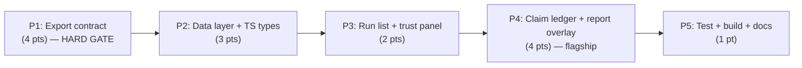

# Decisions Block: Research Foundry Runs Frontend v1

**Feature Goal**: Ship a read-only web viewer that makes RF run claim→evidence provenance and verification status legible in ≤2 clicks, derived entirely from on-disk artifacts via a new deterministic `rf run export --json` contract — no LLM on the recall path, no always-on backend.

**This Decisions Block** captures the load-bearing decisions for expansion. GO verdict from pre-commitment exploration (0.84). Build approach is **fork-and-adapt IntentTree Web** (~60% reuse), not greenfield. The single hard sequencing rule: **no frontend code until the Phase-1 export contract is merged and its schema frozen.**

---

## 1. Phase Boundaries

The work product shape changes at each boundary: Python CLI/export → typed data layer → read surfaces → flagship provenance surfaces → hardening. Phase 1 is a Python-only upstream gate; Phases 2–5 are the forked SPA.

| Phase | Name | Scope | Success Criteria | Exit Gate |
|-------|------|-------|------------------|-----------|
| P1 | Export contract (upstream gate) | `rf run export --json` + `rf run list --json`; denormalized claim-graph join; `FoundryPaths.discover()` path re-derivation; sensitivity redaction at export; derived-status enum; schema doc | Export emits valid `run.json` for a real run; claim→source→quote chain correct; sensitivity-filtered; recursive discovery finds nested `runs/runs/` | **Export schema FROZEN + documented + merged.** Integration test green on `rf_run_20260613_*`. No downstream work starts before this gate. |
| P2 | Data layer + TS types | IntentTree Web fork scaffold (`frontend/runs-viewer/`); entity swap `AgentRun`→`RFRun`; TS types code-genned from `schemas/*.schema.yaml`; React Query hooks; static-JSON + loopback fetch client; OQ-5 `@miethe/ui` audit | App boots against P1 export fixture; typed hooks return run list + detail; no `any` at entity boundaries | Fixtures load; `tsc --noEmit` clean; OQ-5 component-vocabulary decision recorded |
| P3 | Read surfaces — run list + trust panel | Run list (card-per-run, derived badges, filter tabs, sensitivity badges, counts); run overview trust panel (verification checklist, claim-status donut, timeline, governance block); optional-entity empty-states | W2 + W3-portfolio render correctly from fixture; failing check deep-links to ledger anchor | Vitest green for list/filter/checklist; all optional entities show empty-state, never error |
| P4 | Flagship — claim ledger + report overlay | Claim ledger table + facets; provenance drill-down modal (claim→source→quote, inference `from_claims` chain); source-card terminus with sensitivity gate; report Markdown + live `[claim:clm_NNN]` chips + status color-coding + composition sidebar; lineage graph panel (should-have) | W1 two-click audit works; inference empty-basis (RIB-018 class) visibly flagged; chips open modal | Vitest green for drill-down/inference/sensitivity; provenance-correctness test passes |
| P5 | Testing, build, docs | Playwright E2E (W1/W2/W3); provenance-correctness assertion; static SPA build wired to `rf run export --all`; ADR (read path + read-only invariant); README CLI ref; CHANGELOG | E2E green on static fixture; build clean; docs merged | `task-completion-validator` per phase; **`karen` at feature end** |

**Boundary Rationale**:
- **P1↔P2**: The export JSON *is* the frontend's only data contract. Freezing it before any TS is written prevents the UI from re-joining the claim graph (which would violate no-LLM-on-recall and tank perf). This is the project's "CLIs are the contract" invariant made literal.
- **P2↔P3**: Typed hooks + fixtures decouple UI build from further backend churn; P3+ never touches Python.
- **P3↔P4**: P3 surfaces are direct adaptations of existing IntentTree panels (low novelty); P4 is the net-new provenance logic (the actual product value). Splitting isolates the hard part.
- **P4↔P5**: Hardening/docs gate after behavior is complete.

---

## 2. Agent Routing

| Phase | Primary Agent(s) | Secondary Agent | Notes |
|-------|------------------|-----------------|-------|
| P1 | `python-backend-engineer` | `backend-architect` (schema-freeze review only) | Export service = file-walk + claim-graph join + redaction. Algorithmic (graph join) → senior care. Schema freeze is a one-time design decision reviewed before merge. |
| P2 | `ui-engineer-enhanced` | — | Fork scaffold + entity swap + TS codegen (mechanical) + hooks. Runs OQ-5 audit. Sequential — sets the foundation all later UI depends on. |
| P3 | `ui-engineer-enhanced` | `frontend-developer` (parallel: trust panel ∥ run list) | Both adapt existing IntentTree panels; distinct files → safe to parallelize. |
| P4 | `ui-engineer-enhanced` (claim ledger + provenance modal) | `frontend-developer` (report overlay ∥ ledger; lineage graph should-have) | Flagship. Modal and report-overlay are distinct file sets → parallel. Lineage graph adapts MeatyWiki `ArtifactLineageGraph`. |
| P5 | `documentation-writer` (README), `changelog-generator` (CHANGELOG) | `ui-engineer-enhanced` (E2E); `backend-architect` (ADR) | E2E ∥ docs. ADR captures read-path + read-only invariant. |

**Parallel Opportunities**:
- P3 trust panel ∥ run list (different components, shared types from P2).
- P4 provenance modal ∥ report overlay ∥ lineage graph (should-have) — file-ownership-disjoint.
- P5 docs (README/CHANGELOG/ADR) ∥ E2E.
- **Must sequence**: P1→P2 (hard gate); P2→P3 (types/hooks foundation). No cross-phase parallelism past the P1 gate.

---

## 3. Risk Hotspots

### Risk 1: Sensitivity / governance leakage (PRD R9, FR-9)
- **Severity**: **high**
- **Rationale**: Source-card bodies include `extracted_points[].quote`; rendering `work_sensitive`/`client_sensitive` content at a loopback port leaks governed data. This is the one risk that can produce real harm, not just a broken view.
- **Mitigation**: Redact at the **export/serve layer**, never in the component (component can't be the gate). Synthetic sensitivity fixture test in P1. ADR records the invariant. Default threshold `public`-only (OQ-3).

### Risk 2: Export-contract shape (OQ-1 — foundation risk)
- **Severity**: **high**
- **Rationale**: If the JSON is a flat artifact map instead of a denormalized claim-graph, the UI must re-join claim→source→evidence at render time — slow, error-prone, and arguably puts logic on the recall path. Every TS type and hook depends on this shape.
- **Mitigation**: Denormalize in the export step (claim carries resolved `sources[]`). Freeze + document the schema as the P1 exit gate. Integration round-trip test against a real 95–102-claim run before P2.

### Risk 3: Untrusted stored absolute paths (PRD R2)
- **Severity**: **medium-high**
- **Rationale**: `run_index.yaml`/`verification.yaml` store absolute paths that break on any workspace move or different host (`agentic-nuc`). Trusting them makes the export non-portable.
- **Mitigation**: Re-derive every file path via `FoundryPaths.discover()` from workspace root + `run_id` (NFR-F4). `run_index.yaml` used for listing metadata only. Unit test asserts no absolute path is ever read from stored fields.

### Risk 4: `@miethe/ui` ↔ IntentTree-fork incompatibility (OQ-5)
- **Severity**: **medium**
- **Rationale**: User directive is `@miethe/ui` cards/modals as the entity vocabulary, but the fork ships its own component set with possibly conflicting peer deps. Discovering this in P4 would force rework of every entity surface.
- **Mitigation**: Audit at **P2 start** (before any UI). If incompatible: use IntentTree's existing card/panel components for v1, schedule `@miethe/ui` adoption as a post-v1 follow-on. Decision recorded; unblocks P3 cleanly.

### Risk 5: Schema drift (PRD R1/R5)
- **Severity**: **medium**
- **Rationale**: All 20 schemas are `additionalProperties: true`; a required-field rename breaks views silently.
- **Mitigation**: Bind only to `required:` fields; access optional fields with `?.`. Export pins+logs per-artifact `schema_version`, warns on mismatch (OQ-7). Per-artifact graceful empty-state.

### Risk 6: Read-only scope creep (PRD R7)
- **Severity**: **medium**
- **Rationale**: Displaying `reviewer_notes`/`required_fix`/`approved_for_writeback` invites "just add an edit button," violating the file-first invariant.
- **Mitigation**: Enforce architecturally — GET-only serving, zero form elements, no mutation methods in the API client. ADR records it.

---

## 4. Estimation Anchors

### Total: 13 points (lean; reconciled band 8–21 per feasibility brief §3)

| Phase | Points | Reasoning Anchor |
|-------|--------|------------------|
| P1 | 4 (3–5) | Two new `rf` CLI sub-commands + export service. H3 algorithmic flag fires (claim-graph **join** + status **derivation**) → ≥3; +sensitivity redaction +schema freeze +integration test push to 4. Carries the phase variance. |
| P2 | 3 | Data-layer fork. Anchor: IntentTree Web `api/` + hooks layer; ~60% reuse cuts greenfield cost, but entity swap + JSON-Schema→TS codegen wiring + OQ-5 audit keep it at 3. |
| P3 | 2 | Run list + trust panel are direct adaptations of `WorkspaceRuns.tsx` + the 4-panel `WorkflowViewerScreen`. Low novelty, high reuse. |
| P4 | 4 (4–5) | Flagship. Net-new provenance modal + inference chain + report-chip wiring + composition sidebar + sensitivity-gated source card. H3 fires again (provenance resolution). Highest-novelty UI. Lineage graph is a should-have buffer inside this band. |
| P5 | 1 (1–2) | E2E smoke + build wiring + docs. Mostly mechanical; ADR is the only judgment item. |

**Estimation Notes**:
- Bottom-up sum = 14 (4+3+2+4+1), trimmed to 13 lean by treating P3 reuse optimistically; P1's 3–5 band absorbs the variance.
- H5 anchor: IntentTree Web itself (the fork source) is the comparable; the delta is the Python export contract (net-new, no analog) — hence P1 is the least-certain estimate.
- Unknowns that could inflate: OQ-1 schema iterating after P2 starts (mitigated by the hard freeze gate); `@miethe/ui` rework if OQ-5 is mis-timed.

---

## 5. Dependency Map

**Critical Path**: P1 → P2 → P3 → P4 → P5 (serial; the export contract gates everything downstream).

**Parallelizable Slices**:
- Inside P3: run list ∥ trust panel (disjoint components).
- Inside P4: provenance modal ∥ report overlay ∥ lineage-graph panel (disjoint files; lineage is should-have).
- Inside P5: README ∥ CHANGELOG ∥ ADR ∥ E2E.
- OQ-5 audit runs at P2 start so P3 is never blocked on it.

---

## 6. Model Routing

All implementation on **sonnet** (CLAUDE.md default; near-Opus for coding). No external models — this is a fork-adapt of an existing SPA, so no Gemini wireframing and no image generation. Claude effort vocabulary is `adaptive` (default) or `extended` only.

| Phase | Agent | Model | Effort | Rationale |
|-------|-------|-------|--------|-----------|
| P1 | python-backend-engineer | sonnet | extended | Algorithmic claim-graph join + path re-derivation + redaction correctness; the highest-leverage correctness work. |
| P1 | backend-architect (schema review) | sonnet | adaptive | One-time schema-freeze review; bounded. |
| P2 | ui-engineer-enhanced | sonnet | adaptive | Mostly mechanical fork wiring + codegen; novelty is low. |
| P3 | ui-engineer-enhanced / frontend-developer | sonnet | adaptive | Adapting existing panels. |
| P4 | ui-engineer-enhanced | sonnet | extended | Net-new provenance logic, inference chains, chip wiring — the product's core complexity. |
| P4 | frontend-developer | sonnet | adaptive | Report Markdown render + lineage graph adaptation. |
| P5 | documentation-writer / changelog-generator | haiku | adaptive | Docs are mechanical. |
| P5 | backend-architect (ADR) | sonnet | adaptive | Read-path + read-only invariant decision record. |

**Model Routing Notes**:
- No external-model callouts. If a UI design exploration is later wanted, route to gemini-3.1-pro — not needed for a fork.
- ADR stays sonnet (architectural judgment), not haiku.

---

## 7. Open Questions for Expansion

Carry the PRD's OQ-1…OQ-7. The planner must wire these as concrete tasks/gates, not leave them as prose:

- **OQ-1 (BLOCKING P1→P2)**: Freeze the `run.json` shape as **denormalized claim-graph** (claim carries resolved `sources[]`); make it the first P1 task and the P1 exit gate. Document in `docs/dev/architecture/rf-run-export-schema.md`.
- **OQ-2**: Define the derived-status enum (planned → sources_ingested → extracted → claim_mapped → synthesized → verified → published) from `evidence_bundle.status` + `verification.passed` + artifact presence; encode in the export schema (P1).
- **OQ-3**: Sensitivity threshold config — default `public`-only via a `foundry.yaml` viewer key; resolve before FR-9 impl in P1.
- **OQ-5 (BLOCKING P3)**: Schedule the `@miethe/ui` compat audit as the first P2 task; record the card/modal-vocabulary decision before P3.
- **OQ-6**: Static-export-only for v1; defer the loopback live-browse API (FR-11) decision to post-P2 based on observed workflow. Keep behind `RUNS_FRONTEND_LOOPBACK_API` flag.
- **OQ-7**: Schema-version mismatch surface — stderr during export (P1); optional viewer badge as a P3 nice-to-have.
- **OQ-4**: Auth/LAN exposure deferred post-v1 (loopback-only is mandatory now); no task this cycle.

---

## 8. Plan Skeleton Pointer

This decisions block expands into a full **Implementation Plan** using:

- **Template**: `.claude/skills/planning/templates/implementation-plan-template.md`
- **Process**: `implementation-planner` (sonnet) reads this block + the PRD (`docs/project_plans/PRDs/features/runs-frontend-v1.md`) and expands each section into full phase descriptions, task tables, batch/wave definitions, model+effort columns, and success criteria.
- **Output path**: `docs/project_plans/implementation_plans/features/runs-frontend-v1.md` (PRD convention; split into phase files if >800 lines).
- **Opus review**: ~3K-token sanity check post-expansion — verify P1 gate is honored, agent routing propagated to task table, and the R9 sensitivity gate + OQ-1 freeze are not dropped.

---

## Notes for implementation-planner

- **Honor the P1 hard gate**: structure the wave plan so no P2+ task can start before the export schema is frozen and merged. Make the schema-freeze task an explicit dependency of every Phase-2 task.
- **Apply Plan Generator Rules**: FR-3/FR-4 ("all runs", "deep-links") need `target_surfaces:` lists (R-P1). Every backend field added in P1 implies an "FE handles missing field" AC in P2/P3 (R-P2). P3/P4 mix FE owners on shared types → declare `integration_owner` + a seam task (R-P3). All `*.tsx` phases need a runtime-smoke task in P5 (R-P4).
- **Deferred items / DOC-006**: OQ-4 (auth/LAN), OQ-6 (loopback API), and should-haves FR-13/FR-14 are deferred — each needs a design-spec authoring row in the final phase. Initialize `deferred_items_spec_refs: []` and `findings_doc_ref: null` in plan frontmatter.
- **Human Brief applies** (≥8 pts, 5 phases): scaffold `docs/project_plans/human-briefs/runs-frontend.md` and migrate the H1–H6 estimation check there, not into the plan.
