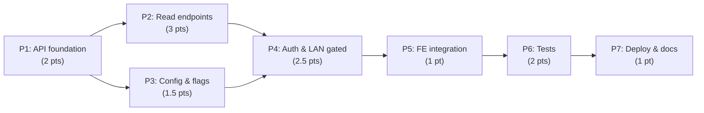

# Decisions Block: Runs Viewer — Live Loopback API + Gated LAN Exposure

<!-- Opus-authored scaffold. Bundles two idea-stage design specs that both say "design these
     together": runs-loopback-api.md (OQ-6, the live API) + runs-auth-lan.md (OQ-4, auth/LAN).
     Two foundational forks were resolved by the operator before authoring:
       (1) Server stack = FastAPI + uvicorn (accepted ~3 deps for routing/OpenAPI/CORS/TestClient).
       (2) Auth posture = loopback-first; LAN exposure is a gated opt-in with shared-secret token.
     implementation-planner (sonnet) expands this into the full PRD + Plan. -->

**Feature Goal**: Add an `rf serve` read-only HTTP API that serves the runs-viewer's data
directly from disk (applying the same sensitivity gate as the export service), so the SPA can
read live runs via its already-built dual-mode client — with LAN exposure available as a gated,
authenticated opt-in.

**Source specs**: `docs/project_plans/design-specs/runs-loopback-api.md` (OQ-6/FR-11) +
`docs/project_plans/design-specs/runs-auth-lan.md` (OQ-4). Both promote from `idea` → `promoted`
in P7. Both are deferred items from `runs-frontend-v1`.

**Tier note**: Bottom-up lands at the Tier 2/3 boundary (~13 pts). Kept **Tier 2** because the
two decisions a SPIKE would resolve (framework + auth posture) are *already resolved* by operator
decision, and the architecture is fully anchored (the shared export core and the frontend dual-mode
seam both already exist). Reviewer cadence is Tier 2 **plus** a `karen` checkpoint at the P4 (auth)
milestone given the network-exposure surface.

---

## 1. Phase Boundaries

| Phase | Name | Scope | Success Criteria | Exit Gate |
|-------|------|-------|------------------|-----------|
| P1 | API foundation | Add `fastapi`/`uvicorn` (optional `[serve]` extra); FastAPI app factory + CORS middleware; `rf serve` Typer command (`--port`, `--bind-host`, `--auth-mode`) reading `foundry.yaml`. | `rf serve` boots on 127.0.0.1, serves a health probe. | Command boots; CORS allows the SPA origin. |
| P2 | Read endpoints | Implement the **5 endpoints the SPA client.ts actually calls**, all read-only JSON, all routed through `export_service`: `GET /runs`, `GET /runs/{run_id}`, `GET /runs/{run_id}/claims`, `GET /runs/{run_id}/sources/{source_card_id}`, `GET /data/governance.json`. 404/error handling. | Each endpoint's shape matches the TS types in `client.ts`; sensitivity threshold applied. | Contract parity verified vs `client.ts`; sensitivity-gate test green. |
| P3 | Config & flag wiring | Extend `viewer.*` config (`bind_host`, `serve_port`, `auth_mode`, `allowlist`) with parse/validate/defaults; deconflict the default port (8765 collides with MeatyWiki); finalize `RUNS_FRONTEND_LOOPBACK_API` / `VITE_RUNS_LOOPBACK_API_BASE` semantics + `rf run export` ↔ `rf serve` co-existence. | Config validated with safe defaults; port deconflicted; flag semantics documented. | Invalid config fails closed; default port documented. |
| P4 | Auth & LAN (gated) | Bind-host gating (127.0.0.1 default; 0.0.0.0 only when explicitly configured + token present → else fail-closed); shared-secret token middleware (`auth_mode=token`); optional IP allowlist; written threat-model section; FE: auth header in `loopbackGet` when token configured. | Loopback works with no auth; LAN mode requires token; 0.0.0.0 without token refuses to bind. | `karen` checkpoint; auth tests green; threat model written. |
| P5 | Frontend integration | Verify SPA against the live API (seam exists); confirm all 5 endpoints, empty/error states, CORS; env-config docs; runtime smoke (R-P4). | SPA loads runs from live API in loopback mode end-to-end. | Runtime smoke passes for every target surface. |
| P6 | Tests | `TestClient` endpoint tests; sensitivity-gate tests; auth tests (token required/rejected, allowlist, fail-closed bind); `CliRunner` test for `rf serve`. | Suite green; all endpoints + auth paths covered. | `pytest` green under venv. |
| P7 | Deploy & docs | `systemd --user` unit for agentic-nuc; update ADR `adr-runs-read-path.md`; README/CLI docs; CHANGELOG `[Unreleased]`; promote both design specs (`maturity: promoted`, `prd_ref`); annotate deferred auth modes in `runs-auth-lan.md`. | Deploy doc + ADR + CHANGELOG done; specs promoted. | Docs land; specs reference the PRD. |

**Boundary Rationale**:
- P1–P2: server skeleton + command must boot before endpoints have a host.
- P2–P3: endpoints define the read contract; config/flag wiring is orthogonal (different files) and can run alongside P2.
- P3–P4: auth consumes config keys (`bind_host`, `auth_mode`, `allowlist`), so config lands first.
- P4–P5: FE needs both the endpoints (P2) and the optional auth header (P4) before integration verify.

---

## 2. Agent Routing

| Phase | Primary Agent(s) | Secondary Agent | Notes |
|-------|------------------|-----------------|-------|
| P1 | python-backend-engineer | — | App factory + Typer command; mirror `cli_commands.py::run_export` pattern. |
| P2 | python-backend-engineer | — | Reuse `export_service.export_run` / `list_runs`; do NOT re-implement serialization or the gate. |
| P3 | python-backend-engineer | — | Extend `FoundryConfig.viewer`; keep dict-access pattern; deconflict port. |
| P4 | python-backend-engineer | senior-code-reviewer | Auth middleware is security-sensitive (Mode D-adjacent): plan, implement, then mandatory reviewer pass. |
| P5 | ui-engineer | — | `frontend/runs-viewer/src/api/client.ts` only; add auth header to `loopbackGet`; no component changes. |
| P6 | python-backend-engineer | — | `tests/` — `CliRunner` + `TestClient`; reference `tests/test_cli_governance.py`. |
| P7 | documentation-writer | python-backend-engineer | docs/ADR/CHANGELOG/spec-promotion (haiku) + systemd unit file (sonnet). |

**Parallel Opportunities**:
- P2 (api/) ∥ P3 (config.py) — disjoint files, no overlap.
- P4 backend (middleware) ∥ P5 prep is NOT safe — FE needs the auth contract first. Sequence P4→P5.

---

## 3. Risk Hotspots

### Risk 1: Sensitivity-gate bypass (data exposure)
- **Severity**: high
- **Rationale**: The API must apply the SAME redaction as the export service. A handwritten serializer that reads run files directly would bypass `resolve_threshold()` and leak sensitive claims.
- **Mitigation**: ALL responses route through `export_service.export_run` / `list_runs` (which already gate at line 569/725). Never serialize raw run data in the API layer. Dedicated sensitivity-gate test in P6.

### Risk 2: Network exposure / weak auth on 0.0.0.0
- **Severity**: high
- **Rationale**: LAN binding without auth exposes the full run corpus to anyone on the LAN.
- **Mitigation**: loopback-only default; 0.0.0.0 requires `auth_mode=token` + a token, else **fail-closed** (refuse to bind). Constant-time token compare. Optional IP allowlist. Written threat model. `karen` checkpoint at P4.

### Risk 3: Endpoint-shape drift from the frontend client
- **Severity**: medium
- **Rationale**: The spec names 2 endpoints, but `client.ts` calls **5**. Building only the spec's 2 would leave the SPA broken in loopback mode.
- **Mitigation**: P2 contract = the 5 calls enumerated from `client.ts`; cross-check against the TS response types; runtime smoke in P5.

### Risk 4: Default-port collision with MeatyWiki (operational)
- **Severity**: low-medium
- **Rationale**: FE default base is `127.0.0.1:8765`; `8765` is MeatyWiki's API port on the agentic-node — a clash if both run there.
- **Mitigation**: pick a distinct default (proposed `7432`), align with `agentic_meta_dev/infra/agentic-node/SERVICES.md`, make it configurable, update the FE default base.

### Risk 5: Dependency footprint vs the "thin / borrow-concepts" ethos
- **Severity**: low
- **Rationale**: FastAPI+uvicorn+starlette is ~3 deps in a deliberately thin CLI.
- **Mitigation**: gate them behind an optional `[serve]` extra in `pyproject.toml` so the core `rf` install stays dependency-light; pin versions.

---

## 4. Estimation Anchors

### Total: 13 points (Tier 2 boundary)

| Phase | Points | Reasoning Anchor |
|-------|--------|------------------|
| P1 | 2 | New Typer command + app factory; anchor: Search Router CLI command addition (`rf search`). |
| P2 | 3 | 5 read endpoints reusing existing core; no new schema (frozen export). |
| P3 | 1.5 | Config keys + validation + port deconfliction; light. |
| P4 | 2.5 | Security-sensitive: middleware + bind gating + allowlist + threat model + FE header. |
| P5 | 1 | Seam already built; mostly verification + smoke. |
| P6 | 2 | Endpoint + auth + sensitivity + CLI tests. |
| P7 | 1 | systemd unit + ADR/README/CHANGELOG + spec promotion. |

**Estimation Notes**:
- Pulled DOWN by pre-existing leverage: `export_run`/`list_runs` exist; FE dual-mode client exists.
- Pushed UP by the security surface (P4) and the 5-vs-2 endpoint reality (P2).
- H6 hidden plumbing (~15%) folded into P1/P3 (DI, config defaults, CORS, extras packaging).

---

## 5. Dependency Map

**Critical Path**: P1 → P2 → P4 → P5 → P6 → P7

**Parallelizable Slices**: P3 (config.py) runs alongside P2 (api/) — disjoint file ownership.

---

## 6. Model Routing

| Phase | Agent | Model | Effort | Rationale |
|-------|-------|-------|--------|-----------|
| P1 | python-backend-engineer | sonnet | adaptive | Bounded scaffold following an existing command pattern. |
| P2 | python-backend-engineer | sonnet | adaptive | Reuses core; mechanical-ish but contract-precise. |
| P3 | python-backend-engineer | sonnet | adaptive | Config plumbing. |
| P4 | python-backend-engineer | sonnet | extended | Security reasoning: fail-closed bind, constant-time compare, threat model. |
| P5 | ui-engineer | sonnet | adaptive | Minimal client wiring. |
| P6 | python-backend-engineer | sonnet | adaptive | Test authoring. |
| P7 | documentation-writer | haiku | adaptive | Docs/ADR/CHANGELOG; systemd unit by python-backend-engineer (sonnet). |

**Model Routing Notes**:
- P4 gets `extended` effort + a `senior-code-reviewer` secondary pass (security surface).
- No external models required.

---

## 7. Open Questions for Expansion

- **OQ-1**: Package `fastapi`/`uvicorn` as an optional `[serve]` extra in `pyproject.toml` (recommended — keeps core thin) vs a core dependency. Resolve to the extra; `rf serve` raises a clear "install rf[serve]" error if missing.
- **OQ-2**: Confirm the default serve port. Proposed `7432` to deconflict from MeatyWiki's `8765`; align with `agentic-node/SERVICES.md` and update the FE default base accordingly.
- **OQ-3**: Hot-reload model — re-read from disk per request (simple, correct; recommended for operator-scale low traffic) vs filesystem-watch cache (deferred to v2). Recommend per-request read for v1.
- **OQ-4**: Shared-secret provisioning — where the token lives. Recommend an env var / secrets file referenced by `viewer.auth_token_env`, NEVER inline in `foundry.yaml` (which may be committed). Planner specifies the exact mechanism.
- **OQ-5**: `GET /data/governance.json` — confirm whether static mode serves a generated file or a static asset, and reproduce that exact source in the API (governance config vs `foundry.yaml` governance block).

---

## 8. Plan Skeleton Pointer

Expands into a full **Implementation Plan**:
- **Location**: `.claude/skills/planning/templates/implementation-plan-template.md`
- **PRD**: `docs/project_plans/PRDs/features/runs-loopback-api-v1.md` (authored first by prd-writer).
- **Output path**: `docs/project_plans/implementation_plans/features/runs-loopback-api-v1.md`
- **Opus review**: ~3K-token sanity check post-expansion — verify phase boundaries, agent routing, and that no security risk (R1/R2) was dropped.

---

## Deferred Items (carry into plan §Deferred Items & DOC-006)

| Item | Origin | Disposition |
|------|--------|-------------|
| mTLS auth mode | OQ-4 | Deferred to v2; annotate in `runs-auth-lan.md`. |
| SSH-tunnel auth mode | OQ-4 | Deferred to v2; annotate in `runs-auth-lan.md`. |
| Filesystem-watch hot-reload cache | OQ-3 | Deferred to v2; per-request read in v1. |

---

## Notes for implementation-planner

- **changelog_required: true** — new user-facing `rf serve` command + live viewer mode.
- Expand the 5-endpoint contract (§1 P2) with explicit request/response shapes cross-referenced to `frontend/runs-viewer/src/api/client.ts` line numbers (109/126/175/197/158).
- Apply R-P2 (FE handles missing field), R-P3 (P4/P5 cross-owner seam: define `integration_owner` + a seam task for the auth-header propagation), R-P4 (P5 runtime smoke references every endpoint).
- Do NOT restate CLAUDE.md or the export-service internals — reference by path: `src/research_foundry/services/export_service.py`, `src/research_foundry/cli_commands.py`, `src/research_foundry/config.py`.
- Section 3 risks → expand into per-risk validation tasks in P6.
