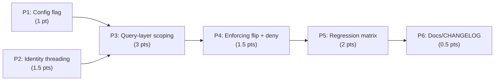

# Decisions Block: WKSP-304 — Row-Level Workspace Isolation Enforcement

<!-- Opus-authored scaffold. Expands into the full Implementation Plan via implementation-planner (sonnet).
     Feature is Mode D (auth/data-isolation, risk_level: high) — the plan must treat the enforcing flip and
     the single-operator fallback as fail-closed invariants, not ordinary features. -->

**Feature Goal**: Flip Research Foundry's per-record workspace scoping from advisory-only logging to fail-closed, query-layer enforcement — gated behind a new orthogonal `workspace_isolation_enforcement` flag — so cross-workspace reads/lists/mutations are denied before any shared-store multi-tenant deployment.

**This Decisions Block** captures phase boundaries, agent routing, risk hotspots, estimation anchors, and model routing. The PRD (`related_feature_prd`) and exploration findings (`.claude/worknotes/wksp-304-workspace-isolation-enforcement/exploration-findings.md`) are the ground-truth inputs; the implementation-planner reads both directly.

---

## Decisions

| Decision | Rationale | Status |
|----------|-----------|--------|
| D1: New orthogonal `workspace_isolation_enforcement` flag, not a reuse of `auth.rbac_enforcement` | Isolation and RBAC are independent gates; conflating them couples two controls | locked |
| D2: Enforce at the query layer (`workspace_id` WHERE predicate), never post-fetch filtering | Post-fetch leaks via COUNT/pagination and cannot close JOIN leaks; the query is the single chokepoint | locked |
| D3: `identity=None` short-circuit evaluated FIRST, before any enforcement branch, by construction | Fallback must be structurally unbreakable, not a reorderable runtime branch (AC-6 Critical) | locked |
| D4: `workspace_id` predicate applied ONLY when enforcement resolves active; advisory leaves queries unscoped + logs | Preserves advisory semantics; makes P4 the single atomic arming step; P2/P3 build inert machinery | locked |
| D5: Cross-workspace read → 404 (not 403); list → omit row | 404 avoids existence-leaking a foreign record; matches PRD OQ-1 | pending |

---

## 1. Phase Boundaries

Phase splits fall where the *shape* of the change product changes: config surface → call-signature plumbing → query bodies → the enforcement gate → verification → docs.

| Phase | Name | Scope | Success Criteria | Exit Gate |
|-------|------|-------|------------------|-----------|
| P1 | Config flag + fail-closed validation | Add `workspace_isolation_enforcement` (`auto\|enabled\|disabled`) to `config.py`, mirroring `auth.rbac_enforcement`; startup validation (advisory + non-loopback bind → ValueError; `auto` keyed on `auth.provider`) | Flag resolves correctly across all provider/bind permutations; ValueError raised on the forbidden combo | AC-7 unit tests pass |
| P2 | Identity threading, router → service | Thread `identity: AuthIdentity \| None` from `request.state.identity` through the 6 in-scope routers into service call signatures (added inert in P3); no behavior change yet | Every in-scope router passes identity to the service layer; existing suite unmodified-green | AC-1 seam task confirms propagation; `tsc`/pytest green |
| P3 | Query-layer scoping (3 services) | Add `identity` param + **flag-gated** `workspace_id` predicate to every AC-2 method in `catalog_service.py` / `builder_service.py` / `agent_job_service.py`; close JOIN + tombstone leaks (AC-4). Predicate inert (advisory) until P4. | All ~60–80 query points carry the gated predicate; parameterized; existing suite green in advisory mode | AC-2/AC-4 code-review checklist ("every JOIN target scoped?"); pytest green |
| P4 | Enforcing flip + deny paths | Flip scope gate to `allowed=False` on mismatch under enforcement; wire 404-on-read, list-omit, mutation-deny (AC-3/AC-5); confirm D3 short-circuit ordering (AC-6) | With flag enabled, cross-workspace denied; with `identity=None`, fully functional; advisory mode unchanged | task-completion-validator on the fail-closed invariants |
| P5 | Regression + enforcement test matrix | ~40–50 tests: 2-workspace × {read,list,mutate} × {allowed,denied} (~12), single-operator fallback (~10), JOIN/tombstone leaks (~15), config validation (~5), SQL-injection-safety assertions | Full matrix green; leak tests fail when a predicate is deliberately removed (mutation-tested) | **mandatory** task-completion-validator gate before P6 |
| P6 | Docs / CHANGELOG / runbook | CHANGELOG `[Unreleased]` entry; `workspace-migration-runbook.md` enforcement section; `config.py` docstring parity with RBAC flag | Docs land; changelog categorized per spec | doc review |

**Boundary Rationale**:
- **P1→P2**: the flag must exist and resolve before any code reads it; P2/P3 gate on it.
- **P2→P3**: identity must reach the service signature before the query body can consume it — but both are *inert* (D4), so they carry zero deny-risk and can even overlap under one owner.
- **P3→P4**: **the critical, non-negotiable ordering.** Flipping the gate to deny (P4) before every query is scoped (P3) would 404 legitimate same-workspace reads that pass through an unscoped method. P4 is the atomic arming step; it must not start until P3's checklist is 100%.
- **P4→P5→P6**: enforcement behavior must be complete before the regression matrix can assert it; docs last.

---

## 2. Agent Routing

| Phase | Primary Agent(s) | Secondary Agent | Notes |
|-------|------------------|-----------------|-------|
| P1 | `python-backend-engineer` | — | Single-file config change; copy the RBAC-flag validation path verbatim, rename. No seam. |
| P2 | `python-backend-engineer` | — | Router→service signature plumbing across 6 routers; **integration_owner** for the P2↔P3 seam. |
| P3 | `data-layer-expert` | `backend-architect` | Largest phase; query correctness + JOIN/tombstone closure. data-layer-expert owns SQL predicates; backend-architect reviews the gate-helper contract. Seam with P2 owner. |
| P4 | `backend-architect` | `python-backend-engineer` | The fail-closed flip — Mode D core. Owns deny-path wiring + D3 ordering proof. |
| P5 | `python-backend-engineer` | — | Test matrix; must include a mutation-test (remove-a-predicate → test fails) for leak coverage credibility. |
| P6 | `documentation-writer` (haiku) | `changelog-generator` | Docs + CHANGELOG. |

**Parallel Opportunities**:
- P1 ∥ P2 partially: the flag (P1) and identity plumbing (P2) touch disjoint files (`config.py` vs routers) and are both inert — can run concurrently, converging before P3 consumes both.
- P3 is the serial bottleneck (one owner for query correctness to avoid split-brain on the predicate helper); do **not** fan P3 across 3 agents by service — the JOIN-leak reasoning must be held in one context.
- P4 strictly serial after P3. P5 serial after P4. P6 after P5 gate.

---

## 3. Risk Hotspots

### Risk 1: Enforcing flip lands before queries are fully scoped (ordering violation)
- **Severity**: high
- **Rationale**: If P4 arms the gate while any P3 query point is still unscoped, legitimate same-workspace reads through that method 404 — a self-inflicted outage, and worse, an inconsistent partial enforcement that masks leaks.
- **Mitigation**: D4 makes P3 predicates inert until the flag flips, so P4 is atomic. Exit gate on P3 is a 100%-coverage code-review checklist enumerating every AC-2 method. P4 cannot start until that checklist signs off.

### Risk 2: Single-operator fallback (`identity=None`) breaks during signature churn
- **Severity**: critical
- **Rationale**: Adding an `identity` param to 20+ signatures risks accidentally routing the `None` path through enforcement logic — breaking every CLI/direct-service user.
- **Mitigation**: D3 — the `identity is None → allowed` short-circuit is the first statement in the gate, before any flag read, by construction. AC-6 verifies via an **unmodified** pass of the entire pre-existing suite with enforcement globally enabled. This is a P4 validator gate item.

### Risk 3: JOIN / tombstone leaks (a scoped primary row surfaces an unscoped joined/soft-deleted row)
- **Severity**: high
- **Rationale**: `catalog_items ← LEFT JOIN catalog_links` (and similar) can surface a foreign-workspace linked row even when the primary is scoped; delete-state predicates can forget workspace scoping.
- **Mitigation**: AC-4 dedicated requirement; ~15 leak edge-case tests in P5, authored as mutation tests (deliberately drop a joined-side predicate → test must fail). Code-review checklist item: "does every JOIN target and every tombstone filter also carry `workspace_id`?"

### Risk 4: A query point outside the enumerated set (hidden caller / 4th surface)
- **Severity**: medium
- **Rationale**: A missed method silently stays unscoped → a leak that no test covers.
- **Mitigation**: PRD Assumption verified 3 direct service callers via grep; P3 begins with a re-run of `grep -rln` over routers + services to confirm the caller set before edits. `workspace_id IS NULL` is treated as a mismatch (deny) under enforcement — a safety net for any row/path that slips scoping.

### Risk 5: SQL injection via new predicates
- **Severity**: medium
- **Rationale**: ~60–80 new WHERE clauses; a single string-interpolated `workspace_id` is an injection hole on a security-critical path.
- **Mitigation**: All predicates parameterized (`?` / native placeholder); P5 includes explicit injection-safety assertions; code review flags any f-string/`%`-format in a WHERE clause.

---

## 4. Estimation Anchors

### Total: 10 points

| Phase | Points | Reasoning Anchor |
|-------|--------|------------------|
| P1 | 1 | Direct copy of the P5.6 `auth.rbac_enforcement` flag + validation; near-mechanical. |
| P2 | 1.5 | 6 routers, established `request.state.identity` pattern (`admin.py`, `reports.py`); plumbing, low reasoning. |
| P3 | 3 | Largest: ~60–80 query points across 3 services + JOIN/tombstone closure; single-owner query correctness. |
| P4 | 1.5 | Small code surface but Mode D reasoning (fail-closed flip + D3 ordering proof). |
| P5 | 2 | ~40–50 tests incl. mutation-tested leak coverage; the regression matrix is the bulk. |
| P6 | 0.5 | Docs/CHANGELOG/runbook. |

**Estimation Notes**:
- **H5 anchor**: closest comparable is **P5.6 (RBAC enforcement toggle, commit `f8906cd`)** — same fail-closed flag pattern, config validation, and loopback guard. WKSP-304 adds the query-layer scoping surface P5.6 didn't have, hence +~3 pts over a pure toggle. Bottom-up sum (§Epics in PRD) is ~11.5 pts; anchoring at **10** reflects that P1/P2 are near-mechanical copies of existing patterns. Within the ≥30% delta tolerance — trust bottom-up; do not compress P3.
- **H6 hidden plumbing** (~15%) is absorbed into P2 (signature churn) and P5 (fixture setup for 2-workspace scenarios).
- No SPIKE needed — exploration resolved all unknowns; the one residual (Postgres vs SQLite placeholder style) is a P3 exploration line-item, not a blocker.

---

## 5. Dependency Map

**Critical Path**: P1 → P3 → P4 → P5 → P6  (P2 joins before P3 consumes identity)

**Parallelizable Slices**: P1 ∥ P2 (disjoint files, both inert). Everything from P3 onward is serial — P3 is single-owner (query-correctness cohesion), P4 arms the gate, P5 verifies, P6 documents.

---

## 6. Model Routing

| Phase | Agent | Model | Effort | Rationale |
|-------|-------|-------|--------|-----------|
| P1 | python-backend-engineer | sonnet | adaptive | Mechanical copy of an existing flag pattern. |
| P2 | python-backend-engineer | sonnet | adaptive | Established plumbing pattern; low reasoning. |
| P3 | data-layer-expert | sonnet | extended | Query correctness + JOIN/tombstone leak reasoning across ~60–80 points — highest-reasoning implementation phase. |
| P4 | backend-architect | sonnet | extended | Fail-closed flip + D3 ordering proof; Mode D core, correctness-critical. |
| P5 | python-backend-engineer | sonnet | adaptive | Systematic matrix authoring; mutation-test design needs some care but is enumerable. |
| P6 | documentation-writer | haiku | adaptive | Docs/CHANGELOG. |

**Model Routing Notes**:
- Claude effort vocabulary is `adaptive`/`extended` only (per multi-model guidance). `extended` reserved for P3 (leak reasoning) and P4 (fail-closed flip) — the two phases where a subtle miss is a security defect.
- No external-model callouts. Optionally, a `gpt-5.3-codex` cross-review of P4's deny path is a cheap adversarial second opinion given the Mode D stakes — implementation-planner may add as an opt-in checkpoint, not a required task.

---

## 7. Open Questions for Expansion

- **OQ-1** (from PRD §13): On a cross-workspace read deny, is the 404 silent (no signal that a record exists elsewhere) or does it emit an audit event? Proposal: silent to the caller, audit-logged server-side. Planner resolves in P4; does not change deny behavior (D5 pending → lock here).
- **OQ-2** (from PRD §13): Deny observability — should denied cross-workspace attempts increment a metric / emit structured telemetry for intrusion detection? Non-blocking; planner may fold into P4 or P5 without PRD amendment.
- **OQ-3** (new): Does Research Foundry support Postgres as a store backend in addition to SQLite? If so, P3 predicates must use the native parameter style, and P5 fixtures must cover both. Planner confirms via a P3 exploration line-item before writing predicates.

---

## 8. Plan Skeleton Pointer

This decisions block expands into a full **Implementation Plan** using:

- **Template**: `.claude/skills/planning/templates/implementation-plan-template.md`
- **Process**: `implementation-planner` (sonnet) reads this block + the PRD + the exploration findings and expands each section into detailed phase descriptions, task tables (with `Model`/`Effort` columns and `wave_plan` frontmatter), batch definitions, structured ACs (carry over AC-1..AC-7 with `target_surfaces`), and success criteria. Apply Plan Generator Rules R-P1..R-P4 — every multi-surface AC enumerates concrete file targets; the P2/P3 seam gets an explicit `integration_owner` + seam task; P5 is the runtime-verification phase.
- **Output path**: `docs/project_plans/implementation_plans/harden-polish/wksp-304-workspace-isolation-enforcement-v1.md` (+ phase files if >800 lines).
- **Reviewer gates**: `task-completion-validator` per phase (mandatory at P5); `karen` at feature end.
- **Opus review**: brief (~3K) sanity check post-expansion — verify phase boundaries match this block and D1–D5 survived.
