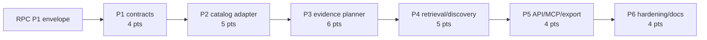

# Decisions Block: Catalog-Assisted Research Planning

**Feature Goal**: Query the authorized private assertion catalog before scheduling discovery, select only exact eligible evidence, and route explicit residual questions to existing providers.

## 0. Boundary Decisions

- RAL owns assertion identity, catalog/packet reads, reuse decisions, lifecycle, rights, and workspace policy.
- Activation owns ledger population and explicit caller-supplied reuse reachability.
- Research Provenance Continuity owns the correlation/selected-evidence envelope and downstream use lineage.
- CARP owns retrieval policy, catalog adapter, evidence plan, conservative coverage, and residual discovery routing.
- RFUP and Search Router providers own extraction/discovery quality; CARP does not add providers.
- V1 uses lexical catalog matching plus deterministic constraints. Vector, graph, model-generated query planning, and canonical merge are deferred.
- `cache_first` means zero external provider calls. Any fallback requires an explicit catalog-then-discovery policy.

## 1. Phase Boundaries

| Phase | Name | Scope | Success Criteria | Exit Gate | Points |
|---|---|---|---|---|---:|
| P1 | Contract and Policy Freeze | Retrieval modes, identity/workspace, evidence-plan schema, coverage/residual enums, budgets, RPC envelope use | Positive/negative schemas validate; no-identity behavior fail-closed; OQ-1..3 resolved/defaulted | backend-architect + api-designer + validator | 4 |
| P2 | Governed Catalog Adapter | Bounded search/packet/reuse calls; stable candidate order; safe denial/empty result | Two-workspace/rights/lifecycle/version matrix passes; no direct ledger scan | task-completion-validator | 5 |
| P3 | Evidence Planner | Map stable question IDs to candidates, exact decisions, covered/residual state; deterministic replay | H3 scenario matrix passes; uncertainty becomes residual | task-completion-validator + karen | 6 |
| P4 | Retrieval-Then-Discovery Integration | Operational `cache_first`; residual provider requests; run/brief/swarm/routing artifact integration | Provider spies prove zero cache-first calls and no covered-question discovery | task-completion-validator + karen | 5 |
| P5 | API, MCP, Export, Metrics | Thread identity/policy/results through launch/API/MCP/search-run/export; generated contracts; safe observed metrics | Contract round-trip and legacy snapshots pass | task-completion-validator | 4 |
| P6 | Hardening and Docs | Adversarial matrices, full focused regression, docs/CHANGELOG/deferred specs, exact-tree final gate | AC CARP-1..6 evidenced; repository/private execution truth separated | task-completion-validator then karen | 4 |
| **Total** | — | — | — | — | **28** |

### Ordering Rationale

- Research Provenance Continuity P1 is an external contract dependency for CARP P1 selected-evidence fields.
- P2 must precede P3 because planner logic may consume only adapter DTOs, never raw ledger files.
- P3 must precede P4 because discovery routing needs stable coverage/residual outcomes.
- P5 follows P4 to expose a settled control flow and metrics contract.
- P6 validates one integrated exact tree.

## 2. Agent Routing

| Phase | Primary Agent(s) | Secondary / Reviewer | Ownership Notes |
|---|---|---|---|
| P1 | backend-architect, api-designer | data-layer-expert | Architect owns coverage/policy semantics; API designer owns envelopes. |
| P2 | python-backend-engineer | senior-code-reviewer | Sole writer for `catalog_retrieval.py` and adapter tests. |
| P3 | backend-architect, python-backend-engineer | data-layer-expert | Architect freezes algorithm; engineer owns planner service. |
| P4 | python-backend-engineer | backend-architect | Integration owner for planning/search-router changes. |
| P5 | api-designer, python-backend-engineer | frontend-developer only for generated-type compatibility | One API integration owner controls OpenAPI regeneration. |
| P6 | validation agents, documentation-writer | task-completion-validator, karen | Reviewers remain read-only. |

**Parallel Opportunities**:

- P1 schema examples and auth/error review can proceed in separate read-only lanes but one contract owner integrates.
- P2 unit fixtures can be prepared beside adapter implementation with non-overlapping ownership.
- P5 API/MCP DTO work may begin after P4 response shapes freeze; no early OpenAPI generation.
- P6 documentation draft may start during P5, then reconcile against the exact final candidate.

## 3. Risk Hotspots

### Risk 1: False coverage suppresses discovery
- **Severity**: high
- **Rationale**: A lexical hit is not proof that a research question is answered; an optimistic rule can silently reduce evidence quality.
- **Mitigation**: Conservative deterministic contract; exact eligibility/version checks; uncertainty and conflicting/missing qualifier cases resolve residual; enumerate ≥10 fixtures.

### Risk 2: Retrieval leaks hidden membership
- **Severity**: high
- **Rationale**: Candidate counts, facets, IDs, result timing, or fallback behavior can reveal another workspace or rights-denied evidence.
- **Mitigation**: Identity and policy before catalog call; fixed safe denial envelope; no derived metrics on denial; two-workspace response/timing bounds.

### Risk 3: `cache_first` unexpectedly reaches the network
- **Severity**: high
- **Rationale**: A generic empty-result fallback could violate the zero-external-query promise.
- **Mitigation**: Distinct policy state, zero budget, injected provider spies, and tests that fail on search/extract calls.

### Risk 4: Stale packet selected
- **Severity**: high
- **Rationale**: Catalog search filters eligible lifecycle, but a lagging projection or version requirement can change between search and packet use.
- **Mitigation**: Re-evaluate exact packet through reuse/version/extraction-contract gate immediately before selection; receipt records decision inputs.

### Risk 5: RPC/CARP envelope drift
- **Severity**: medium
- **Rationale**: Parallel implementation can introduce duplicate selected-evidence fields.
- **Mitigation**: CARP P1 imports/references RPC schema; contract round-trip seam; no alternate top-level refs.

## 4. Estimation Anchors

### Total: 28 points

| Phase | Points | Reasoning Anchor |
|---|---:|---|
| P1 | 4 | Search request/run schemas and launch reuse contract provide additive-schema patterns; identity threading adds risk. |
| P2 | 5 | RAL catalog/packet API exists, so work is adapter/policy orchestration plus adversarial read tests rather than a new index. |
| P3 | 6 | New H3 coverage/residual algorithm; fixture breadth dominates. |
| P4 | 5 | Search Router orchestration and planning artifacts are existing seams, but covered/residual splitting crosses both services. |
| P5 | 4 | Existing MCP/API/export/OpenAPI patterns; breadth and identity propagation remain real work. |
| P6 | 4 | 16.7% of the 24-point implementation subtotal for plumbing, regression, docs, deferred specs, and final gates. |

**Anchor Honesty**:

- RAL catalog/reuse and activation launch-reuse slices are direct completed code analogs; planning docs give their estimates and commits prove reachability, but an authoritative actual-point ledger is not present in the inspected tree.
- No estimate assumes a real-corpus reuse rate, avoided dollar cost, or owner/private qualification result.

## 5. Dependency Map

**Critical Path**: RPC-P1 → CARP-P1 → P2 → P3 → P4 → P5 → P6

**Serialization Barriers**:

- `schemas/search_request.schema.yaml` and `schemas/search_run.schema.yaml`: RPC P1 then CARP P1/P5.
- `src/research_foundry/services/planning.py`: P3 then P4; single integration owner.
- `src/research_foundry/services/search_router/router.py`: P4 sole writer until P5 DTO hooks.
- `src/research_foundry/api/openapi.json`: regenerate once in P5.

## 6. Model Routing

| Phase | Agent | Model | Effort | Rationale |
|---|---|---|---|---|
| P1 | backend-architect / api-designer | sonnet | extended | High-leverage auth and coverage contract decisions. |
| P2 | python-backend-engineer | sonnet | adaptive | Existing catalog/reuse primitives; careful denial tests. |
| P3 | backend-architect / python-backend-engineer | sonnet | extended | H3 algorithm and conservative edge-case matrix. |
| P4 | python-backend-engineer | sonnet | extended | Cross-service orchestration and network-call invariants. |
| P5 | api-designer / python-backend-engineer | sonnet | adaptive | Established transport/generation patterns. |
| P6 | validation tasks | sonnet | adaptive | Deterministic fixtures and regression evidence. |
| P6 | documentation-writer | haiku | adaptive | Usage-focused docs after contracts freeze. |
| P6 | karen | opus | extended | Tier 3 final review and boundary audit. |

## 7. Open Questions for Expansion

- **CARP-OQ-1**: Default coverage rule: at least one exact eligible packet with lexical match plus required qualifier/source-type constraints; conflicts or missing required qualifiers stay residual. Freeze an enum reason for each outcome.
- **CARP-OQ-2**: Default rollout: opt-in request policy in v1. Do not make retrieval default-on until owner evaluation establishes behavior and authorization ergonomics.
- **CARP-OQ-3**: `cache_first` returns eligible selections and optionally typed `refresh_required` candidates only if that does not leak denied/stale membership. Safe default: refresh reason without candidate identity.
- **CARP-OQ-4**: Define maximum questions/candidates/pages per plan. Default bounded limits must prevent intent text from driving unbounded reads.
- **CARP-OQ-5**: Decide whether planning artifacts store full packets or exact refs plus receipts. Default: exact refs/receipts; resolve packets at governed read time.

## 8. Plan Skeleton Pointer

- **Template**: `.agents/skills/planning/templates/implementation-plan-template.md`
- **PRD**: `docs/project_plans/PRDs/enhancements/catalog-assisted-research-planning-v1.md`
- **Output**: `docs/project_plans/implementation_plans/enhancements/catalog-assisted-research-planning-v1.md`
- **Human brief**: `docs/project_plans/human-briefs/catalog-assisted-research-planning.md`

The expansion must preserve the six phases, 28-point bottom-up total, conservative residual-on-uncertainty behavior, RPC contract dependency, zero-network `cache_first`, exact model/effort vocabulary, deferred-spec tasks, and exact-tree reviewer gates. Do not create progress artifacts.
