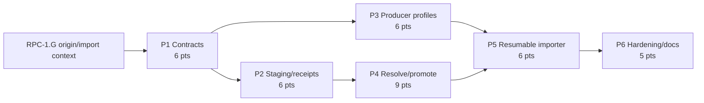

# Decisions Block: External Research Report Interchange

**Feature Goal**: Import externally produced research reports as traceable platform synthesis and quarantined citation/assertion candidates, then advance only exact governed source relationships through existing RF verification and assertion machinery.

This block contains new architectural judgment only. It does not restate or replace RFUP acquisition, RAL identity/materialization, assertion-ledger activation, Research Provenance Continuity, or Intake Citation Adapter behavior.

## 0. Authority and Non-Duplication Decisions

- Research Provenance Continuity owns the shared origin/import context, run/activity correlation, and downstream report-use lineage. ERI consumes that contract after `RPC-1.G` validator/Karen exact-tree approval.
- RFUP owns governed URL/PDF extraction, extraction status, exact-passage verification mode, machine schema stamping, and run sealing.
- RAL owns workspace-local immutable editions, exact passages, source assertions, evaluations, lifecycle, and catalog identity.
- Assertion-ledger activation owns historical/forward population and explicit reuse reachability.
- Intake Citation Adapters owns the normalized `{span, source, relation, confidence}` vocabulary and OpenAI/Perplexity fixture normalization. ERI maps that tuple into packet records; it does not fork it.
- ERI owns the external packet, staging/import receipt, completeness tiers, quarantine, exact-resolution orchestration, templates, and large-packet resume state.
- Vendor report prose always has `content_role: platform_synthesis`. It cannot be a source card or supported claim.
- The canonical v1 input is a materialized local directory. Archive and remote transport formats are separate future layers.
- RFUP network acquisition is callable only after a hard importer-owned prerequisite validates authorization, scheme/authority, every DNS answer, every redirect, and the connected peer; unauthorized local/file and all forbidden address classes fail before effects.
- Every packet and vendor-extension field is untrusted data. No value may become a prompt, tool/resource description, route/control directive, command, schema selector, or execution argument.

## 1. Phase Boundaries

| Phase | Name | Scope | Success Criteria | Exit Gate | Points |
|---|---|---|---|---|---:|
| P1 | Contract Freeze | Packet/member schemas, identity, completeness/quarantine, hostile-data boundary, SSRF-safe acquisition policy, target context, compatibility | Golden instances validate; unsafe/unknown-major/legacy cases explicit; RPC dependency resolved | backend-architect + api-designer + task-completion-validator; Karen contract milestone | 6 |
| P2 | Staging and Receipts | Safe manifest inspection, stable packet/receipt/action identity, immutable effect/final receipts, checkpoint separation, dry-run | Exact replay is a no-op; conflicts and unsafe members block before effects; crash boundaries recover | task-completion-validator exact-tree pass | 6 |
| P3 | Producer Profiles | Generic, ChatGPT, Perplexity, Gemini, NotebookLM templates plus injection-shaped offline fixtures | Five profiles produce one packet; unknown/vendor values remain inert escaped data | task-completion-validator content/fixture pass | 6 |
| P4 | Resolution and Promotion | Inert-data normalization, SSRF-safe acquisition gate, RFUP call, RAL edition/passage binding, quarantine, explicit promotion seam | Forbidden local/address/DNS/redirect/peer cases block before RFUP; exact unique matches advance; unsafe/ambiguous cases quarantine | task-completion-validator + Karen integration milestone | 9 |
| P5 | Resumable Importer | Deterministic action batches, cancellation/resume, CLI/machine output, target-run projection, provenance/export activity | Large fixture converges after faults; safe summaries reconcile; staging-only remains run-free | task-completion-validator + Karen integrated importer milestone | 6 |
| P6 | Hardening and Docs | Cross-profile/adversarial/large fixtures, SSRF/injection matrices, compatibility, docs/CHANGELOG/skill/deferred specs, exact-tree gates | ERI-AC-1..7 evidenced; final artifact/docs match runtime truth | task-completion-validator then Karen final | 5 |
| **Total** | — | — | — | — | **38** |

### Boundary rationale

- P1 is a hard barrier because packet bytes, action identity, receipt identity, completeness, and denial vocabulary govern every later write.
- P2 separates trust-safe receipt plumbing from vendor formats and evidence resolution. A malformed packet must be rejected before any producer-specific logic runs.
- P3 is offline documentation/fixture work and may proceed beside later P2 tests only after P1 freezes schemas.
- P4 alone owns source/citation resolution and promotion. This prevents producer profiles or CLI code from inventing shortcuts.
- P5 consumes P2 action receipts and P4 resolver outcomes to add bounded orchestration and the user-facing CLI.
- P6 begins only after the integrated P5 candidate is frozen.

## 2. Agent Routing and Ownership

| Phase | Primary Agent(s) | Secondary / Reviewer | Ownership notes |
|---|---|---|---|
| P1 | backend-architect, api-designer | data-layer-expert | Architect owns identity/tier semantics; API designer owns schema and safe output shapes. |
| P2 | python-backend-engineer | backend-architect | One writer owns packet validator, receipt/checkpoint service, and fault tests. |
| P3 | documentation-writer, python-backend-engineer | api-designer | Docs writer owns prompts; engineer owns schema-valid fixtures and deterministic mapping. |
| P4 | backend-architect, python-backend-engineer | senior-code-reviewer | Integration owner is python-backend-engineer; existing RFUP/RAL services remain delegated dependencies. |
| P5 | python-backend-engineer | api-designer | One writer owns importer orchestration/CLI; export changes serialize after response shape freezes. |
| P6 | validation implementer, documentation-writer | task-completion-validator, Karen | Reviewers remain read-only; docs land only after runtime contract freeze. |

**Parallel opportunities**:

- P3 producer prompt text and fixtures can split by profile after the generic P1 schema is immutable, with one integration owner for shared template paths.
- P4 resolution fixtures can be prepared while P2 completes, but resolution implementation cannot merge until P2 receipt/effect identity is stable.
- P6 documentation inventory can be drafted during P5; final examples and skill routes wait for the exact CLI/output tree.

**Serialization barriers**:

- `schemas/external_research_handoff.schema.yaml` and receipt/checkpoint schemas: P1 freezes; P2/P3 consume.
- `src/research_foundry/services/external_research_interchange.py`: P2 then P5, never concurrent writers.
- `src/research_foundry/services/source_cards.py` and `assertion_registry.py`: P4 only if an additive seam is actually required; prefer calling existing public methods.
- `src/research_foundry/services/source_acquisition_policy.py`: P4 sole owner; it gates RFUP calls but does not implement HTTP/PDF extraction.
- `src/research_foundry/cli_commands.py`: P5 sole writer.
- `CHANGELOG.md`, `README.md`, and `.agents/skills/research-foundry/SKILL.md`: P6 sole writers.

## 3. Risk Hotspots

### Risk 1: Citation laundering
- **Severity**: critical
- **Failure**: Vendor synthesis or a cited sentence becomes a supported claim without resolving the original source edition and exact passage.
- **Mitigation**: Hard role separation; candidate schemas have no supported state; only existing verifier/materializer can assign verified lineage; negative tests scan for shortcut writes.

### Risk 2: Incorrect packet identity
- **Severity**: high
- **Failure**: Transport metadata changes identity, or meaningful bytes are omitted, so replay either duplicates work or accepts changed content as the same packet.
- **Mitigation**: Sorted relative path plus raw-byte digest over every accepted member; exclude only directory location, mtime, traversal order, and transport metadata; golden hash vectors.

### Risk 3: Unsafe member handling
- **Severity**: critical
- **Failure**: Traversal, symlink, special file, unlisted content, or oversized attachment escapes or exhausts the workspace.
- **Mitigation**: Materialized-directory-only v1, lexical and resolved path containment, regular-file allowlist, pre-open metadata checks, streaming limits, adversarial fixtures.

### Risk 4: Partial replay corrupts authority
- **Severity**: high
- **Failure**: A checkpoint claims an action complete without its effect, or retries duplicate source cards/registry records.
- **Mitigation**: Canonical action manifest, immutable effect receipts, publish checkpoint after effect, validate exact action equality and canonical state before skip.

### Risk 5: Ambiguous citation matching
- **Severity**: critical
- **Failure**: A fuzzy or multi-match selector is bound to the wrong passage.
- **Mitigation**: Exact unique passage only; zero/multiple/drift/conflict outcomes quarantine; fuzzy recovery deferred.

### Risk 6: Cross-workspace existence leak
- **Severity**: high
- **Failure**: Lookup, counts, or errors reveal a hidden source, packet, or candidate before authorization.
- **Mitigation**: Workspace/sensitivity/rights checks precede canonical lookup; one safe denial shape; receipt summaries contain no denied IDs/text.

### Risk 7: Provider drift
- **Severity**: medium
- **Failure**: A template encodes vendor-specific structure as the canonical schema or breaks when a UI changes.
- **Mitigation**: Generic packet is authority; provider files are manual prompt/output overlays with namespaced extensions and offline fixtures, not scrapers or API clients.

### Risk 8: Qualification overstatement
- **Severity**: high
- **Failure**: Offline vendor-shaped fixtures are reported as live ChatGPT/Perplexity/Gemini/NotebookLM qualification.
- **Mitigation**: Evidence labels distinguish repository-ready, offline-unvalidated, owner/private qualified, and live-qualified states.

### Risk 9: SSRF through delegated acquisition
- **Severity**: critical
- **Failure**: A vendor locator reaches a local/file, loopback, private, reserved, link-local, metadata, redirect-pivot, or DNS-rebound destination even though ERI delegates HTTP to RFUP.
- **Mitigation**: Hard pre-effect scheme/address/DNS/redirect/peer validation, public-address allow policy, bounded redirects, connection binding/peer check, no fallback transport, and negative fixtures with an RFUP-call spy.

### Risk 10: Prompt/tool/control injection
- **Severity**: critical
- **Failure**: Instruction-like report, source, candidate, activity, or extension text changes a prompt, tool/resource description, route, schema selector, command, or execution argument.
- **Mitigation**: Treat all producer values as inert data, prohibit control-surface promotion, escape rendering, and run injection fixtures for all five profiles.

## 4. Estimation Anchors

### Total: 38 points

| Phase | Points | Reasoning anchor |
|---|---:|---|
| P1 | 6 | RAL/RFUP contract shapes anchor schemas; ERI adds multi-file identity plus hard hostile-data and acquisition policy. |
| P2 | 6 | RAL registry publication and impact receipts prove immutable/idempotent patterns; ERI adds hostile filesystem input and packet/action manifests. |
| P3 | 6 | Intake Citation Adapters anchors vendor-shaped fixtures; ERI adds five profiles plus cross-member prompt/tool/control injection resistance. |
| P4 | 9 | RAL/RFUP anchor evidence resolution, while SSRF-safe scheme/IP/DNS/redirect/peer validation and multi-source quarantine form a larger H3 matrix. |
| P5 | 6 | RAL replay/resume is the closest behavior anchor; large packet batching, cancellation, CLI, and target projection add orchestration surface. |
| P6 | 5 | 15.2% of the 33-point implementation subtotal for plumbing, compatibility, SSRF/injection adversarial validation, docs, deferred specs, and exact-tree gates. |

**Anchor honesty**:

- Git/runtime surfaces prove comparable RAL registry, materializer, and impact code exists. RFUP and Intake Citation Adapters are planning dependencies and must not be presented as shipped merely because their artifacts exist.
- The inspected repository has no authoritative actual-point ledger for these comparable slices. H5 is a planned/shipped-surface comparison with medium confidence, not measured velocity.
- No estimate assumes live vendor export, owner-held data, remote transport, or private-workspace qualification.

## 5. Dependency Map

**Critical path**: RPC-1.G → ERI P1 → P2 → P4 → P5 → P6

**Parallel slice**: ERI P3 can run after P1 beside the latter part of P2; it must merge before P5 and before P6 cross-profile fixtures.

## 6. Model Routing

| Phase | Agent | Model | Effort | Rationale |
|---|---|---|---|---|
| P1 | backend-architect / api-designer | sonnet | extended | Identity, trust, and compatibility contracts are high leverage. |
| P2 | python-backend-engineer | sonnet | extended | Hostile input, atomic publication, and replay correctness require deeper reasoning. |
| P3 | documentation-writer | haiku | adaptive | Prompt/output copy is bounded after schema freeze. |
| P3 | python-backend-engineer | sonnet | adaptive | Fixture mapping and schema validation are mechanical but code-sensitive. |
| P4 | backend-architect / python-backend-engineer | sonnet | extended | H3 exact resolution, policy order, and quarantine matrix are security-sensitive. |
| P5 | python-backend-engineer | sonnet | extended | Deterministic batching, cancellation, and resume have non-trivial state transitions. |
| P6 | validation implementation | sonnet | adaptive | Known fixture matrices and focused regression execution. |
| P6 | documentation-writer | haiku | adaptive | Usage-focused docs and examples after runtime freeze. |
| P6 | Karen | opus | extended | Tier 3 final exact-tree and trust-boundary review. |

No external model is required to implement or review the feature. The five producer profiles are contract fixtures, not calls to those platforms.

## 7. Open Questions and Defaults

- **ERI-OQ-1 — Transport**: Default to a materialized directory only. Archive/remote containers require a later threat model and shaping spec.
- **ERI-OQ-2 — Identity inputs**: Hash every accepted member's sorted relative path and raw bytes; derive receipt from contract version, packet digest, workspace, and optional target run. Never include mtime or absolute path.
- **ERI-OQ-3 — Missing target run**: Default to staging-only. Do not create a run implicitly; later explicit attachment may project resolved records into a run.
- **ERI-OQ-4 — Limits**: P1 must choose conservative configurable defaults from local fixtures. Exceeding any limit blocks before effects; silent truncation is forbidden.
- **ERI-OQ-5 — Promotion timing**: Default to explicit promotion after source/passage resolution and existing RF verification. Import completion may include quarantine and does not imply verification.
- **ERI-OQ-6 — Source reuse**: Reuse only an authorized exact edition whose content and source-card snapshot bind; otherwise reacquire through RFUP or quarantine.

## 8. Deferred Decisions

| Item | Why deferred | Promotion trigger | Target shaping spec |
|---|---|---|---|
| Live provider automation | Secrets, SDK drift, cost, and vendor policy are outside manual interchange | Approved provider, current API contract, canary and rollback | `docs/project_plans/design-specs/external-research-provider-automation.md` |
| Archive/remote transport | Expands attack surface and identity/auth boundary | Threat model plus bounded transport requirement | `docs/project_plans/design-specs/external-research-transport-containers.md` |
| Fuzzy citation recovery | Similarity cannot establish exact evidence identity safely | Measured unresolved-rate need plus evaluation corpus | `docs/project_plans/design-specs/external-research-citation-recovery.md` |
| Public/cross-workspace exchange | Rights and sensitivity promotion are independent governance work | Public rights review plus tenant-safe resource identity | `docs/project_plans/design-specs/external-research-public-interchange.md` |

P6 authors these specs only if the item remains a real promotion candidate; otherwise it records explicit non-promotion rationale in the plan closeout. NotebookLM live qualification belongs in the initiative's separate NotebookLM refresh spec, not a duplicate ERI spec.

## 9. Plan Skeleton Pointer

- **Template**: `.agents/skills/planning/templates/implementation-plan-template.md`
- **PRD**: `docs/project_plans/PRDs/enhancements/external-research-report-interchange-v1.md`
- **Output**: `docs/project_plans/implementation_plans/enhancements/external-research-report-interchange-v1.md`
- **Human brief**: `docs/project_plans/human-briefs/external-research-report-interchange.md`

Expansion must preserve the 38-point bottom-up total, exact phase boundaries, ownership/serialization barriers, valid model-effort vocabulary, deferred-item policy, observable AC-to-verification mapping, and exact-tree reviewer gates. Planning creates no progress files and authorizes no live vendor calls.
