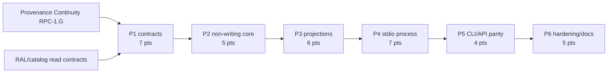

# Decisions Block: Research Foundry Knowledge MCP

**Feature goal**: Give local agents bounded, URL-backed, policy-projected reads over RF
sources, assertions, reports, and runs through one shared service and an exact
schema-aligned `search(query)` / `fetch(id)` contract, without cost-bearing calls,
workspace mutation, or a false hosted-compatibility claim.

## 0. Boundary Decisions

- Build a new `KnowledgeAccessService` and independent `rf-knowledge-mcp` OS process with
  its own registry, entry point, settings/credential allowlist, dependency boundary, and
  inventory; preserve Search Router `rf-mcp` unchanged.
- Register exactly eight v1 MCP tools: core `search`, `fetch`, plus `rf_search`,
  `rf_fetch`, `rf_source_get`, `rf_assertion_get`, `rf_report_get`, and `rf_run_get`.
- Freeze core search input to only `query` and SearchDTO to results whose items contain
  exactly id/title/url; snippets exist only in `rf_search`. Freeze core fetch input to
  only `id` and FetchDTO to required id/title/text/url plus optional generic key/value
  metadata (`Record<string, unknown>`). Core roots/items reject extra properties, while
  the optional metadata map intentionally accepts arbitrary keys; kind/truncated are
  neither required nor exhaustive.
- Emit every core DTO identically in `structuredContent` and one text `content` block
  containing deterministic canonical JSON. Pagination, filters, extended metadata, and
  receipts exist only in separately named `rf_*` tools.
- Do not register or call acquisition, extraction, job, import, approval, bundle,
  provider, cache-build, telemetry-write, audit-write, persistence, or writeback tools.
- Existing source/assertion/report/run services remain authoritative. Knowledge adapters
  return allowlisted DTOs and never create a second catalog or authoritative store.
- Apply identity/workspace, sensitivity, rights/allowed-use, and lifecycle/freshness
  policy before matching, snippets, counts, ranks, cursors, URLs, links, receipts, or
  existence signals.
- Use opaque authority-neutral IDs. Return RF HTTP GET route URLs, never filesystem paths.
  Local v1 URLs are explicitly loopback-scoped rather than canonical public citations.
- Bound query/result/page/text/link/depth sizes and label all returned content untrusted.
- Emit a deterministic caller-carried activity receipt; the service does not persist it.
- CLI, API, and MCP are thin wrappers over the same service and schemas.
- Ship local stdio as schema-aligned only. It is not OpenAI/ChatGPT-compatible because
  loopback resources are not hosted-client reachable. Defer compatibility to a promoted,
  reachable canonical HTTPS profile governed by the linked transport/URL/cache specs.
- Remote gates are recorded in
  `research-foundry-knowledge-mcp-remote-transport.md`,
  `research-foundry-knowledge-mcp-canonical-resource-urls.md`, and
  `research-foundry-knowledge-mcp-remote-cache-isolation.md`; shared retrieval remains in
  `reusable-assertion-ledger-shared-indexes.md`.

## 1. Phase Boundaries

| Phase | Name | Scope | Success criterion | Exit gate | Points |
|---|---|---|---|---|---:|
| P1 | Contract and Boundary Freeze | Exact core/RF DTOs, dual encoding, context/policy, IDs/local URLs, process/credential boundary, eight-tool inventory, remote truth | Examples validate; core extensions reject; OQ defaults/forbidden inventory/remote gates explicit | task-completion-validator + Karen | 7 |
| P2 | Non-Writing Knowledge Core | Service skeleton, query-only catalog, non-rebuilding assertion reads, write/provider spies | Missing projections return unavailable with zero changed files or provider calls | task-completion-validator | 5 |
| P3 | Governed Domain Projections | Source/assertion/report/run adapters, merge/rank/cursor/fetch, bounds, URL/receipt projection | H3 matrix passes; hidden records do not alter derived output | task-completion-validator + karen | 6 |
| P4 | Independent Local Stdio MCP | Optional-SDK process/registry/settings/credential boundary, exact core dual encoding and RF tools, entry point | Process/import/env/inventory and encoding snapshots pass; forbidden registries/credentials absent | task-completion-validator | 7 |
| P5 | CLI and API Parity | Thin CLI/GET routes, error mapping, OpenAPI, local/non-canonical labeling | Normalized responses equivalent; local profile never claims hosted compatibility | task-completion-validator | 4 |
| P6 | Hardening, Docs, Closeout | Adversarial audit, regression, docs/CHANGELOG, four shaping-spec reconciliation, exact-tree review | KMCP-1..6 evidenced; repository/private/remote/release truth separated | task-completion-validator then Karen | 5 |
| **Total** | — | — | — | — | **34** |

### Ordering Rationale

- Research Provenance Continuity `RPC-1.G` owns the origin/activity envelope consumed by P1.
- Catalog-assisted planning's governed read contract and RAL's packet semantics precede
  the projection contract; this feature does not redefine them.
- P2 must prove explicit no-write behavior before P3 composes domain adapters.
- P3 freezes service results before P4/P5 translate them into transport schemas.
- P4 precedes P5 so the primary local MCP inventory is fixed before parity expansion.
- P6 validates one integrated exact candidate; any material fix triggers rereview.

## 2. Agent Routing

| Phase | Primary agent(s) | Reviewer | Ownership notes |
|---|---|---|---|
| P1 | backend-architect, api-designer | task-completion-validator, karen | One contract owner integrates schemas and boundary decisions. |
| P2 | python-backend-engineer, data-layer-expert | task-completion-validator | Serialize changes to catalog/assertion read modes. |
| P3 | python-backend-engineer, backend-architect | task-completion-validator, karen | Engineer owns the service; architect freezes H3 semantics. |
| P4 | python-backend-engineer | task-completion-validator | Sole writer for process, registry, entry point, settings/credentials boundary, and inventory. |
| P5 | api-designer, python-backend-engineer | task-completion-validator | One API owner controls route and OpenAPI regeneration. |
| P6 | validation agents, documentation-writer | task-completion-validator, karen | Reviewers remain read-only; exact tree is the evidence target. |

**Parallel opportunities**:

- P1 threat/error review and fixture design can run in read-only lanes.
- P2 fixtures may be prepared beside implementation with non-overlapping files.
- P3 domain fixtures can be prepared independently, but one service owner integrates.
- P6 documentation may draft during P5 and must reconcile after OpenAPI freezes.

## 3. Risk Hotspots

### Risk 1: A nominal read mutates local state

- **Severity**: critical
- **Mechanisms**: assertion projection rebuild, catalog DB setup/migration/WAL, audit or
  telemetry artifact, receipt persistence, run/source creation.
- **Mitigation**: explicit non-rebuilding/query-only modes; unavailable-on-absence;
  filesystem/DB snapshots and spies around every tool; no hidden fallback.

### Risk 2: Policy ordering leaks hidden membership

- **Severity**: high
- **Mechanisms**: counts, ranks, snippets, cursors, IDs, URLs, receipts, detailed errors,
  links, or timing derived before workspace/sensitivity/rights/lifecycle checks.
- **Mitigation**: one access context and projection pipeline; two-workspace and denied
  fixtures; compare visible responses with hidden records added and removed.

### Risk 3: Raw payloads expose paths or excessive content

- **Severity**: high
- **Mechanisms**: direct run export/report draft/catalog return, recursive fields, raw
  internal paths, excessive links or page text.
- **Mitigation**: allowlisted normalized DTOs, recursive path audit, byte/page/link/depth
  caps, truncation metadata, untrusted-content flag.

### Risk 4: Registry drift introduces cost or mutation

- **Severity**: high
- **Mechanisms**: sharing Search Router registration code or broad service imports.
- **Mitigation**: independent registry and entry point; exact inventory snapshot; provider,
  job, import, approval, bundle, and writeback spies; forbidden-name audit.

### Risk 5: Local URL is mistaken for canonical remote identity

- **Severity**: medium
- **Mechanisms**: returning a loopback URL as a durable public citation or assuming the
  HTTP server is live while stdio alone is running.
- **Mitigation**: distinguish origin URL, RF local resource URL, and future canonical URL;
  return in-band fetch content; defer public HTTPS namespace behind ADR/design gate.

### Risk 6: Exact core DTO drifts behind RF extensions

- **Severity**: high
- **Mechanisms**: adding cursor/filter/receipt arguments, search snippets, or RF-specific
  root/result fields to core search/fetch; closing the optional generic fetch metadata
  map; or emitting different structured and text results.
- **Mitigation**: closed core roots/items, an explicitly open optional fetch metadata map,
  exact DTO snapshots, parsed JSON equality, and separately named `rf_*` contracts for
  every RF extension.

### Risk 7: Process or credential bleed

- **Severity**: critical
- **Mechanisms**: sharing Search Router/Operator registries, provider dependencies, settings,
  or environment credential keys in the Knowledge process.
- **Mitigation**: independent process/import graph/registry/entrypoint/settings allowlist;
  exact inventory/environment snapshots; governed read services are the only shared layer.

### Risk 8: Local schema alignment is called hosted compatibility

- **Severity**: high
- **Mechanisms**: treating loopback URLs as canonical or claiming OpenAI/ChatGPT support
  without a reachable HTTPS server and remote identity/cache posture.
- **Mitigation**: schema-aligned-only local label and three shaping-spec promotion gates
  before any remote compatibility qualification.

## 4. Estimation Anchors

### Total: 34 points

| Phase | Points | Reasoning anchor |
|---|---:|---|
| P1 | 7 | Exact core/RF schemas, dual encoding, process/credential boundary, inventory, and remote truth are high-leverage contracts. |
| P2 | 5 | Existing read authorities avoid a new index, but true query-only/no-rebuild behavior and negative auditing require service changes. |
| P3 | 6 | New H3 merge/rank/cursor/fetch/projection algorithm across four governed domains and an adversarial matrix. |
| P4 | 7 | The optional-SDK pattern helps, but an independent process/import/env/credential boundary plus exact dual encoding and eight tools is new. |
| P5 | 4 | Existing CLI/API patterns plus core/RF parity, local URL truth, and OpenAPI labeling. |
| P6 | 5 | Cross-process regression, filesystem/provider audit, docs, four shaping-spec reconciliation, CHANGELOG, and Tier 3 review. |

**Anchor honesty**:

- The initiative epic's 21 points were preliminary. Live inspection exposed lazy cache
  rebuild, DB/WAL risk, raw path projection, loopback URL semantics, and parity breadth.
- The 28-point catalog-assisted planning package is a nearby policy/multi-service anchor,
  but KMCP does not schedule providers or persist evidence plans.
- The current Search Router MCP is a code-shape anchor only; its cost/write posture is the
  exact boundary this feature must avoid.
- No authoritative actual-point ledger was found in the inspected tree. These are planned
  complexity anchors, not empirical velocity, savings, or delivery claims.

## 5. Dependency Map

**Critical path**: RPC-1.G + governed RAL/catalog reads → KMCP-P1 → P2 → P3 → P4 → P5 → P6

**Serialization barriers**:

- Four `schemas/knowledge_*` files: P1 sole contract owner.
- `knowledge_access.py`: P2 then P3; one integration owner.
- `catalog_service.py` and `assertion_catalog.py`: P2 only until no-write gate passes.
- `knowledge_mcp/process.py`, `registry.py`, `settings.py`, and `pyproject.toml`: P4 sole owner; preserve `rf-mcp` and exclude provider/operator credentials.
- `api/openapi.json`: regenerate once after P5 routes settle.

## 6. Model Routing

| Phase | Agent | Model | Effort | Rationale |
|---|---|---|---|---|
| P1 | backend-architect / api-designer | sonnet | extended | High-leverage policy, identity, ID, URL, and receipt contract. |
| P2 | python-backend-engineer / data-layer-expert | sonnet | extended | Filesystem and SQLite no-write semantics need careful implementation. |
| P3 | python-backend-engineer / backend-architect | sonnet | extended | H3 algorithm and privacy boundary matrix. |
| P4 | python-backend-engineer | sonnet | extended | Process/import/credential isolation, exact dual encoding, and strict inventory. |
| P5 | api-designer / python-backend-engineer | sonnet | adaptive | Established CLI/API/OpenAPI patterns and parity fixtures. |
| P6 | validation agents | sonnet | extended | Adversarial no-write, policy, bounds, URL, and parity audit. |
| P6 | documentation-writer | haiku | adaptive | Usage and architecture docs after contracts freeze. |
| P6 | karen | opus | extended | Tier 3 exact-tree boundary and evidence review. |

## 7. Open Questions for Expansion

- **KMCP-OQ-1**: Enumerate every read path that can rebuild/create/migrate and freeze a
  common unavailable-on-absence contract. Default: reads never repair state.
- **KMCP-OQ-2**: Decide report authority. Default: `report_draft` and `run_final_report`
  remain distinct kinds with explicit IDs and projections.
- **KMCP-OQ-3**: Freeze loopback base and route version. Default: configured loopback
  `/api/knowledge/v1/...`, labeled local/non-canonical and explicitly not hosted-compatible.
- **KMCP-OQ-4**: Freeze activity receipt fields. Default: request/context hash, visible
  returned refs, bounds/truncation, policy/schema version, and no denied membership.

## 8. Plan Skeleton Pointer

- **PRD**: `docs/project_plans/PRDs/enhancements/research-foundry-knowledge-mcp-v1.md`
- **Unified plan**: `docs/project_plans/implementation_plans/enhancements/research-foundry-knowledge-mcp-v1.md`
- **Human brief**: `docs/project_plans/human-briefs/research-foundry-knowledge-mcp.md`
- **Epic**: `docs/project_plans/PRDs/enhancements/research-interchange-provenance-access-epic-v1.md`

Expansion must preserve the six phases, 34-point bottom-up total, one-service parity,
exact core/RF DTO split and dual encoding, policy-before-derivation, explicit zero-write/no-provider boundary, separate process/registry/settings/credentials,
schema-aligned local stdio, deferred remote/public URL/operator scopes, and exact-tree
review gates. Do not create progress artifacts during planning.
