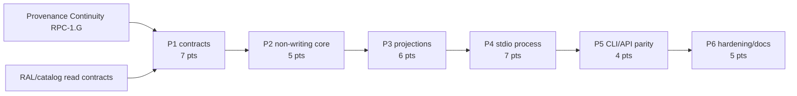

# Decisions Block: Research Foundry Knowledge MCP

**Feature goal**: Give local agents bounded, URL-backed, policy-projected reads over RF
sources, assertions, reports, and runs through one shared service and an exact
schema-aligned `search(query)` / `fetch(id)` contract, without cost-bearing calls,
workspace mutation, or a false hosted-compatibility claim.

## 0. Boundary Decisions

- Build a new `KnowledgeAccessService` and independent `rf-knowledge-mcp` OS process with
  its own registry, entry point, settings/credential allowlist, dependency boundary, and
  inventory; preserve Search Router `rf-mcp` unchanged.
- Register exactly eight v1 MCP tools: core `search`, `fetch`, plus `rf_search`,
  `rf_fetch`, `rf_source_get`, `rf_assertion_get`, `rf_report_get`, and `rf_run_get`.
- Freeze core search input to only `query` and SearchDTO to results whose items contain
  exactly id/title/url; snippets exist only in `rf_search`. Freeze core fetch input to
  only `id` and FetchDTO to required id/title/text/url plus optional generic key/value
  metadata (`Record<string, unknown>`). Core roots/items reject extra properties, while
  the optional metadata map intentionally accepts arbitrary keys; kind/truncated are
  neither required nor exhaustive.
- Emit every core DTO identically in `structuredContent` and one text `content` block
  containing deterministic canonical JSON. Pagination, filters, extended metadata, and
  receipts exist only in separately named `rf_*` tools.
- Do not register or call acquisition, extraction, job, import, approval, bundle,
  provider, cache-build, telemetry-write, audit-write, persistence, or writeback tools.
- Existing source/assertion/report/run services remain authoritative. Knowledge adapters
  return allowlisted DTOs and never create a second catalog or authoritative store.
- Apply identity/workspace, sensitivity, rights/allowed-use, and lifecycle/freshness
  policy before matching, snippets, counts, ranks, cursors, URLs, links, receipts, or
  existence signals.
- Use opaque authority-neutral IDs. Return RF HTTP GET route URLs, never filesystem paths.
  Local v1 URLs are explicitly loopback-scoped rather than canonical public citations.
- Bound query/result/page/text/link/depth sizes and label all returned content untrusted.
- Emit a deterministic caller-carried activity receipt; the service does not persist it.
- CLI, API, and MCP are thin wrappers over the same service and schemas.
- Ship local stdio as schema-aligned only. It is not OpenAI/ChatGPT-compatible because
  loopback resources are not hosted-client reachable. Defer compatibility to a promoted,
  reachable canonical HTTPS profile governed by the linked transport/URL/cache specs.
- Remote gates are recorded in
  `research-foundry-knowledge-mcp-remote-transport.md`,
  `research-foundry-knowledge-mcp-canonical-resource-urls.md`, and
  `research-foundry-knowledge-mcp-remote-cache-isolation.md`; shared retrieval remains in
  `reusable-assertion-ledger-shared-indexes.md`.

## 1. Phase Boundaries

| Phase | Name | Scope | Success criterion | Exit gate | Points |
|---|---|---|---|---|---:|
| P1 | Contract and Boundary Freeze | Exact core/RF DTOs, dual encoding, context/policy, IDs/local URLs, process/credential boundary, eight-tool inventory, remote truth | Examples validate; core extensions reject; OQ defaults/forbidden inventory/remote gates explicit | task-completion-validator + Karen | 7 |
| P2 | Non-Writing Knowledge Core | Service skeleton, query-only catalog, non-rebuilding assertion reads, write/provider spies | Missing projections return unavailable with zero changed files or provider calls | task-completion-validator | 5 |
| P3 | Governed Domain Projections | Source/assertion/report/run adapters, merge/rank/cursor/fetch, bounds, URL/receipt projection | H3 matrix passes; hidden records do not alter derived output | task-completion-validator + karen | 6 |
| P4 | Independent Local Stdio MCP | Optional-SDK process/registry/settings/credential boundary, exact core dual encoding and RF tools, entry point | Process/import/env/inventory and encoding snapshots pass; forbidden registries/credentials absent | task-completion-validator | 7 |
| P5 | CLI and API Parity | Thin CLI/GET routes, error mapping, OpenAPI, local/non-canonical labeling | Normalized responses equivalent; local profile never claims hosted compatibility | task-completion-validator | 4 |
| P6 | Hardening, Docs, Closeout | Adversarial audit, regression, docs/CHANGELOG, four shaping-spec reconciliation, exact-tree review | KMCP-1..6 evidenced; repository/private/remote/release truth separated | task-completion-validator then Karen | 5 |
| **Total** | — | — | — | — | **34** |

### Ordering Rationale

- Research Provenance Continuity `RPC-1.G` owns the origin/activity envelope consumed by P1.
- Catalog-assisted planning's governed read contract and RAL's packet semantics precede
  the projection contract; this feature does not redefine them.
- P2 must prove explicit no-write behavior before P3 composes domain adapters.
- P3 freezes service results before P4/P5 translate them into transport schemas.
- P4 precedes P5 so the primary local MCP inventory is fixed before parity expansion.
- P6 validates one integrated exact candidate; any material fix triggers rereview.

## 2. Agent Routing

| Phase | Primary agent(s) | Reviewer | Ownership notes |
|---|---|---|---|
| P1 | backend-architect, api-designer | task-completion-validator, karen | One contract owner integrates schemas and boundary decisions. |
| P2 | python-backend-engineer, data-layer-expert | task-completion-validator | Serialize changes to catalog/assertion read modes. |
| P3 | python-backend-engineer, backend-architect | task-completion-validator, karen | Engineer owns the service; architect freezes H3 semantics. |
| P4 | python-backend-engineer | task-completion-validator | Sole writer for process, registry, entry point, settings/credentials boundary, and inventory. |
| P5 | api-designer, python-backend-engineer | task-completion-validator | One API owner controls route and OpenAPI regeneration. |
| P6 | validation agents, documentation-writer | task-completion-validator, karen | Reviewers remain read-only; exact tree is the evidence target. |

**Parallel opportunities**:

- P1 threat/error review and fixture design can run in read-only lanes.
- P2 fixtures may be prepared beside implementation with non-overlapping files.
- P3 domain fixtures can be prepared independently, but one service owner integrates.
- P6 documentation may draft during P5 and must reconcile after OpenAPI freezes.

## 3. Risk Hotspots

### Risk 1: A nominal read mutates local state

- **Severity**: critical
- **Mechanisms**: assertion projection rebuild, catalog DB setup/migration/WAL, audit or
  telemetry artifact, receipt persistence, run/source creation.
- **Mitigation**: explicit non-rebuilding/query-only modes; unavailable-on-absence;
  filesystem/DB snapshots and spies around every tool; no hidden fallback.

### Risk 2: Policy ordering leaks hidden membership

- **Severity**: high
- **Mechanisms**: counts, ranks, snippets, cursors, IDs, URLs, receipts, detailed errors,
  links, or timing derived before workspace/sensitivity/rights/lifecycle checks.
- **Mitigation**: one access context and projection pipeline; two-workspace and denied
  fixtures; compare visible responses with hidden records added and removed.

### Risk 3: Raw payloads expose paths or excessive content

- **Severity**: high
- **Mechanisms**: direct run export/report draft/catalog return, recursive fields, raw
  internal paths, excessive links or page text.
- **Mitigation**: allowlisted normalized DTOs, recursive path audit, byte/page/link/depth
  caps, truncation metadata, untrusted-content flag.

### Risk 4: Registry drift introduces cost or mutation

- **Severity**: high
- **Mechanisms**: sharing Search Router registration code or broad service imports.
- **Mitigation**: independent registry and entry point; exact inventory snapshot; provider,
  job, import, approval, bundle, and writeback spies; forbidden-name audit.

### Risk 5: Local URL is mistaken for canonical remote identity

- **Severity**: medium
- **Mechanisms**: returning a loopback URL as a durable public citation or assuming the
  HTTP server is live while stdio alone is running.
- **Mitigation**: distinguish origin URL, RF local resource URL, and future canonical URL;
  return in-band fetch content; defer public HTTPS namespace behind ADR/design gate.

### Risk 6: Exact core DTO drifts behind RF extensions

- **Severity**: high
- **Mechanisms**: adding cursor/filter/receipt arguments, search snippets, or RF-specific
  root/result fields to core search/fetch; closing the optional generic fetch metadata
  map; or emitting different structured and text results.
- **Mitigation**: closed core roots/items, an explicitly open optional fetch metadata map,
  exact DTO snapshots, parsed JSON equality, and separately named `rf_*` contracts for
  every RF extension.

### Risk 7: Process or credential bleed

- **Severity**: critical
- **Mechanisms**: sharing Search Router/Operator registries, provider dependencies, settings,
  or environment credential keys in the Knowledge process.
- **Mitigation**: independent process/import graph/registry/entrypoint/settings allowlist;
  exact inventory/environment snapshots; governed read services are the only shared layer.

### Risk 8: Local schema alignment is called hosted compatibility

- **Severity**: high
- **Mechanisms**: treating loopback URLs as canonical or claiming OpenAI/ChatGPT support
  without a reachable HTTPS server and remote identity/cache posture.
- **Mitigation**: schema-aligned-only local label and three shaping-spec promotion gates
  before any remote compatibility qualification.

## 4. Estimation Anchors

### Total: 34 points

| Phase | Points | Reasoning anchor |
|---|---:|---|
| P1 | 7 | Exact core/RF schemas, dual encoding, process/credential boundary, inventory, and remote truth are high-leverage contracts. |
| P2 | 5 | Existing read authorities avoid a new index, but true query-only/no-rebuild behavior and negative auditing require service changes. |
| P3 | 6 | New H3 merge/rank/cursor/fetch/projection algorithm across four governed domains and an adversarial matrix. |
| P4 | 7 | The optional-SDK pattern helps, but an independent process/import/env/credential boundary plus exact dual encoding and eight tools is new. |
| P5 | 4 | Existing CLI/API patterns plus core/RF parity, local URL truth, and OpenAPI labeling. |
| P6 | 5 | Cross-process regression, filesystem/provider audit, docs, four shaping-spec reconciliation, CHANGELOG, and Tier 3 review. |

**Anchor honesty**:

- The initiative epic's 21 points were preliminary. Live inspection exposed lazy cache
  rebuild, DB/WAL risk, raw path projection, loopback URL semantics, and parity breadth.
- The 28-point catalog-assisted planning package is a nearby policy/multi-service anchor,
  but KMCP does not schedule providers or persist evidence plans.
- The current Search Router MCP is a code-shape anchor only; its cost/write posture is the
  exact boundary this feature must avoid.
- No authoritative actual-point ledger was found in the inspected tree. These are planned
  complexity anchors, not empirical velocity, savings, or delivery claims.

## 5. Dependency Map

**Critical path**: RPC-1.G + governed RAL/catalog reads → KMCP-P1 → P2 → P3 → P4 → P5 → P6

```mermaid
graph LR
  RPC["Provenance Continuity RPC-1.G"] --> P1["P1 contracts\n7 pts"]
  CAT["RAL/catalog read contracts"] --> P1
  P1 --> P2["P2 non-writing core\n5 pts"]
  P2 --> P3["P3 projections\n6 pts"]
  P3 --> P4["P4 stdio process\n7 pts"]
  P4 --> P5["P5 CLI/API parity\n4 pts"]
  P5 --> P6["P6 hardening/docs\n5 pts"]
```

**Serialization barriers**:

- Four `schemas/knowledge_*` files: P1 sole contract owner.
- `knowledge_access.py`: P2 then P3; one integration owner.
- `catalog_service.py` and `assertion_catalog.py`: P2 only until no-write gate passes.
- `knowledge_mcp/process.py`, `registry.py`, `settings.py`, and `pyproject.toml`: P4 sole owner; preserve `rf-mcp` and exclude provider/operator credentials.
- `api/openapi.json`: regenerate once after P5 routes settle.

## 6. Model Routing

| Phase | Agent | Model | Effort | Rationale |
|---|---|---|---|---|
| P1 | backend-architect / api-designer | sonnet | extended | High-leverage policy, identity, ID, URL, and receipt contract. |
| P2 | python-backend-engineer / data-layer-expert | sonnet | extended | Filesystem and SQLite no-write semantics need careful implementation. |
| P3 | python-backend-engineer / backend-architect | sonnet | extended | H3 algorithm and privacy boundary matrix. |
| P4 | python-backend-engineer | sonnet | extended | Process/import/credential isolation, exact dual encoding, and strict inventory. |
| P5 | api-designer / python-backend-engineer | sonnet | adaptive | Established CLI/API/OpenAPI patterns and parity fixtures. |
| P6 | validation agents | sonnet | extended | Adversarial no-write, policy, bounds, URL, and parity audit. |
| P6 | documentation-writer | haiku | adaptive | Usage and architecture docs after contracts freeze. |
| P6 | karen | opus | extended | Tier 3 exact-tree boundary and evidence review. |

## 7. Open Questions for Expansion

- **KMCP-OQ-1**: Enumerate every read path that can rebuild/create/migrate and freeze a
  common unavailable-on-absence contract. Default: reads never repair state.
  - **Status: RESOLVED (P1, KMCP-1.1/1.2 scope).** Freeze the CONTRACT, not yet the full
    enumeration: every knowledge read (core `search`/`fetch` and all `rf_*` tools) uses
    existing catalog/assertion/report/run READ paths in an explicit non-rebuilding /
    query-only mode; a missing or stale cache, index, or projection returns a typed
    "unavailable" result — indistinguishable in shape from "hidden" — never a rebuild,
    migration, schema creation, or WAL/journal write. This applies uniformly across
    CLI/API/MCP transports (invariant 4, one service). Enumerating the concrete read
    paths that currently lack this explicit mode (assertion cache rebuild, catalog
    SQLite WAL/journal creation, etc.) is service-level work owned by P2
    (KMCP-2.1..2.4); P1 freezes the contract ("reads never repair state") that P2 must
    implement and P2's negative matrix (KMCP-2.4) must prove.
- **KMCP-OQ-2**: Decide report authority. Default: `report_draft` and `run_final_report`
  remain distinct kinds with explicit IDs and projections.
  - **Status: RESOLVED (P1, KMCP-1.2 scope, encoded in `schemas/knowledge_document.schema.yaml`
    and `schemas/knowledge_search_response.schema.yaml`).** `report_draft` and
    `report_final` (renamed from this section's earlier `run_final_report` label, for
    symmetry with `report_draft` inside one shared `kind` enum) remain two DISTINCT
    knowledge kinds — their own opaque-ID kind segment (`rfk:v1:report_draft:...` /
    `rfk:v1:report_final:...`), their own explicit P3 projections (KMCP-3.3), and their
    own IDs, never merged into one ambiguous "report" kind. `rf_report_get` addresses
    both by their distinct ids; `rf_run_get` remains the separate run summary/detail
    projection and is not a third report kind. P3 (KMCP-3.1..3.3) still implements four
    DOMAIN adapters (source, assertion, report, run); the `kind` vocabulary frozen here
    has five values because the report domain resolves to two kinds.
- **KMCP-OQ-3**: Freeze loopback base and route version. Default: configured loopback
  `/api/knowledge/v1/...`, labeled local/non-canonical and explicitly not hosted-compatible.
  - **Status: RESOLVED (P1, KMCP-1.3 URL scope, encoded in `schemas/knowledge_search_response.schema.yaml`
    and `schemas/knowledge_document.schema.yaml` as `$defs.local_resource_url`).** Freeze
    the route contract at `/api/knowledge/v1/fetch/<percent-encoded-opaque-id>` on a
    configured loopback origin (`http://127.0.0.1:<port>`, `http://localhost:<port>`, or
    `http://[::1]:<port>`); no other host or scheme validates. The route version segment
    (`v1`) is independent of the opaque-ID version segment (also currently `v1` — see the
    canonical-resource-urls shaping spec's open question on ID- vs route-version bumps);
    one may change without the other. This is the SAME url returned by both `search`
    result items and `fetch`'s document (self-referential fetch route — KMCP-3.4's
    "search result fetches same resource"). Labeled local/non-canonical throughout;
    never a durable citation. The REMOTE canonical HTTPS namespace remains deferred per
    `research-foundry-knowledge-mcp-canonical-resource-urls.md` (unchanged, still
    shaping/deferred by this resolution).
- **KMCP-OQ-4**: Freeze activity receipt fields. Default: request/context hash, visible
  returned refs, bounds/truncation, policy/schema version, and no denied membership.
  - **Status: RESOLVED (P1 Part B, encoded in `schemas/knowledge_activity_receipt.schema.yaml`).**
    The receipt is RF-only (never reachable via a core `search`/`fetch` result), caller-carried,
    and hard-pinned NON-PERSISTED (`persisted: const false` — the Knowledge service never
    writes it to disk/DB/log/audit store). Frozen fields exactly match the default: a
    64-hex-char SHA-256 `request_context_hash` (one-way, never the literal query/filters/
    identity/path), `returned_ids` (exact echo of opaque IDs actually returned, capped at
    50, never a superset), `bounds` (results_returned/results_max/text_bytes_returned/
    text_bytes_max/truncated — scoped only to what was returned), `policy_version`
    (invariant-3 policy/ruleset tag) and `schema_version`/`type` discriminators, plus
    `tool` (one of the eight frozen tool names) and `generated_at`. It carries NO
    total-candidate, denied, or hidden count, and NO filesystem path or denied ID
    (closed root, no open map, at every nesting level) — the "no denied membership"
    half of the default is enforced by absence, not by a field. `rf_search_response.receipt`
    (knowledge_search_response.schema.yaml) and `knowledge_document_extended.receipt`
    (knowledge_document.schema.yaml) remain open (`additionalProperties: true`)
    placeholder slots rather than a `$ref` into this file — this repo's `SchemaRegistry`
    has no cross-file `$ref` resolver (see `tests/test_schema_validation.py`'s
    `content_reuse_assessment`/`rights_record` enum-identity test for the same
    limitation) — so wiring an actual receipt payload through those two extension
    points and validating it against `knowledge_activity_receipt.schema.yaml` is P3/P4
    service-and-transport work; P1 Part B freezes only the standalone contract those
    later phases must produce values against.

> **Numbering note (P6 traceability pass, KMCP-6.x):** section 8 was never drafted in
> this file — the numbering below intentionally continues from 9 rather than
> renumbering, because P2/P3/P4/P5's own module docstrings and tests already cite
> "decisions-block §9.1"/"§9.2"/"§9.3"/"§9.4"/"§10" by these exact numbers (14 files
> as of P6). Renumbering this file would silently stale every one of those citations
> without a matching source-wide edit, which is out of scope for a documentation-
> numbering fix. Treat the gap as intentional, not an error to "correct."

## 9. Process, Credential, and Inventory Boundary (KMCP-1.4)

Freezes invariant 1 (separate process) and invariant 7 (process/credential bleed) into
an explicit, testable inventory. P4 (`KMCP-4.1`/`KMCP-4.4`) implements and snapshots
this exact boundary; P1 freezes the contract that snapshot must prove.

### 9.1 Process, registry, entry point

- Independent OS process `rf-knowledge-mcp`, a packaged entry point distinct from the
  Search Router's `rf-mcp` and from any Operator/Hermes process. Own package
  `research_foundry.knowledge_mcp` (`process.py`, `registry.py`, `settings.py`) — never
  imported by, and never importing from, `research_foundry.search_router.*` or an
  Operator/Hermes-adjacent module.
- Own tool registry (`registry.py`) is the SOLE place any `rf-knowledge-mcp` tool name is
  registered. It imports only from `research_foundry.services.knowledge_access` (the P2/P3
  governed read service) and shared read-only substrate (`paths`, `schemas`, `yamlio`,
  `ids`) — never a provider client, job runner, acquisition/import/writeback service, or
  the Search Router's own registry module.
- Own settings module (`settings.py`) resolves ONLY the read-only allowlist in §9.3; it
  never reads a provider API key, OAuth/OIDC client secret, or Operator/Hermes credential
  even if present in the process environment.

### 9.2 Exact eight-tool inventory (frozen; restates §0 as the KMCP-1.4 inventory-test target)

The registry MUST contain EXACTLY these eight tool names and no others:

1. `search` (core)
2. `fetch` (core)
3. `rf_search`
4. `rf_fetch`
5. `rf_source_get`
6. `rf_assertion_get`
7. `rf_report_get`
8. `rf_run_get`

No acquisition, extraction, job, import, approval, bundle, provider, cache-build,
telemetry-write, audit-write, persistence, writeback, or Search-Router-native
(`web_search`, `fetch_url`, or any provider-specific) tool name may ever appear in this
registry (Risk 4/Risk 7). `KMCP-4.4` snapshots this exact list as a negative-space guard.

### 9.3 Settings and credential allowlist (invariant 1)

**ALLOWED** in `rf-knowledge-mcp` settings/environment:

- Foundry workspace root resolution (same `FoundryPaths.discover` mechanism already used
  by the CLI/API — no new identity mechanism).
- Loopback bind host/port used only to render `local_resource_url` values (KMCP-OQ-3) —
  never to open a non-loopback listener (Risk 8).
- Sensitivity ceiling / identity-resolution inputs already used by existing read services
  (WKSP-304 row-level isolation pattern).
- Logging level.

**FORBIDDEN** — none of the following may be read, referenced, defaulted-to, or declared
as an optional dependency by `rf-knowledge-mcp` settings, its environment, or its
`pyproject.toml` extras:

- Any Search Router / `rf-mcp` provider credential or env key (e.g. a Brave/SerpAPI/
  Tavily/SearXNG search-provider secret or endpoint override).
- Any Operator/Hermes credential or routing config (Hermes/AOS service tokens,
  `RF_TOKEN_AGENT` — an API-transport concern, not a Knowledge-process concern — or any
  model-routing provider API key).
- Any writeback credential (MeatyWiki, SkillMeat, CCDash) or catalog-build/migration flag.
- The Search Router's own registry/settings modules, or an Operator/Hermes registry module.

### 9.4 Governed-read-only sharing (Risk 4/Risk 7 mitigation)

The ONLY shared layer between `rf-knowledge-mcp` and any other RF surface is the existing,
authoritative READ services (`catalog_service`, `assertion_catalog`, `export_service`,
`builder_service` — P2/P3 scope). `rf-knowledge-mcp` never imports a mutator, a provider
client, a job/queue module, or the Search Router's/Operator's own process, registry, or
settings modules.

## 10. Local/Remote Compatibility Gate (KMCP-1.5)

- **Declaration (invariant 8):** the v1 local stdio Knowledge MCP is SCHEMA-ALIGNED ONLY
  with the frozen core `search(query)`/`fetch(id)` contract (KMCP-1.2/1.3). It makes NO
  OpenAI/ChatGPT (or any other hosted-client) compatibility claim, anywhere — not in code,
  docs, `pyproject.toml`, tool descriptions, or this decisions block — because a hosted
  client cannot reach a loopback-only resource URL (`local_resource_url`, KMCP-OQ-3) and no
  remote transport is registered (P4 registers stdio only; Streamable HTTP/SSE/OAuth/
  non-loopback listeners are explicitly absent).
- **Deferred shaping specs (linked below; `status: deferred`/`maturity: shaping`, unchanged
  by this task):**
  - `docs/project_plans/design-specs/research-foundry-knowledge-mcp-remote-transport.md` —
    remote MCP transport (Streamable HTTP lifecycle, session/OAuth, rate limits, incident
    response).
  - `docs/project_plans/design-specs/research-foundry-knowledge-mcp-canonical-resource-urls.md`
    — a remotely reachable, owned-HTTPS canonical resource-URL namespace (vs. today's
    loopback-only `local_resource_url`).
  - `docs/project_plans/design-specs/research-foundry-knowledge-mcp-remote-cache-isolation.md`
    — any remote/multi-tenant cache placed in front of Knowledge reads.
  - `docs/project_plans/design-specs/reusable-assertion-ledger-shared-indexes.md` — any
    shared/cross-workspace assertion index Knowledge search could draw on remotely.
- **Explicit promotion gate (ALL of the following required before ANY compatibility
  claim, local or remote):**
  1. All four linked specs above move from `status: deferred` to an accepted, reviewed
     design (each spec's own SPIKE/ADR gate, per its "Required ... before any
     implementation" section) — no partial promotion; transport, canonical URL, cache
     isolation, and shared-index isolation are each independently load-bearing for a safe
     remote surface.
  2. A reachable canonical HTTPS MCP endpoint exists (owned DNS, valid TLS, explicit
     protocol version) per the remote-transport spec's "Required Remote Profile."
  3. Canonical, non-loopback resource URLs are issued per the canonical-resource-urls
     spec, and the local `local_resource_url` loopback form is never presented as
     canonical in that profile.
  4. The remote-cache-isolation spec's complete partition-key/invalidation model is
     implemented and adversarially tested (cross-tenant probes) before any caching is
     added in front of that remote endpoint.
  5. A named security/privacy/workspace-owner sign-off (per the shared-indexes spec's
     "Future SPIKE gates") is recorded for the specific remote profile being qualified.
  6. Only after 1-5 land may documentation, tool descriptions, or `pyproject.toml`
     metadata state ANY OpenAI/ChatGPT or other hosted-client compatibility claim — and
     even then, scoped explicitly to the qualified remote profile, never implied for the
     local stdio process.
- **Negative-space guard (until promotion):** `rf-knowledge-mcp`'s stdio process, its
  schemas, its CLI/API docs, and this decisions block must never contain "ChatGPT-
  compatible", "OpenAI-compatible", or equivalent hosted-compatibility language without a
  "deferred"/"not yet" qualifier attached. `KMCP-5.4`/`KMCP-6.8` own the negative fixture/
  doc-scan proving this at their respective gates; P1 freezes the rule those later gates
  enforce.

## 11. Plan Skeleton Pointer

- **PRD**: `docs/project_plans/PRDs/enhancements/research-foundry-knowledge-mcp-v1.md`
- **Unified plan**: `docs/project_plans/implementation_plans/enhancements/research-foundry-knowledge-mcp-v1.md`
- **Human brief**: `docs/project_plans/human-briefs/research-foundry-knowledge-mcp.md`
- **Epic**: `docs/project_plans/PRDs/enhancements/research-interchange-provenance-access-epic-v1.md`

Expansion must preserve the six phases, 34-point bottom-up total, one-service parity,
exact core/RF DTO split and dual encoding, policy-before-derivation, explicit zero-write/no-provider boundary, separate process/registry/settings/credentials,
schema-aligned local stdio, deferred remote/public URL/operator scopes, and exact-tree
review gates. Do not create progress artifacts during planning.
