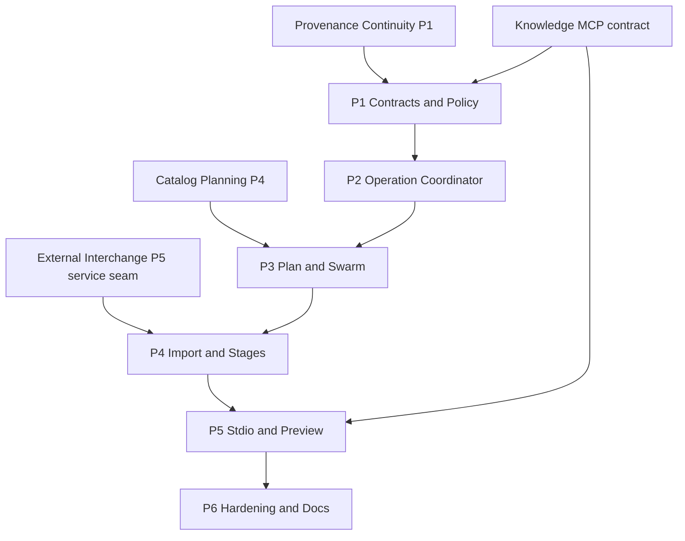

# Decisions Block: Research Foundry Operator MCP

**Feature goal**: expose a closed set of governed local Research Foundry operations over MCP while keeping read-only knowledge access separate, every effect workspace-bound and replay-safe, and live writeback or remote mutations unavailable.

## 0. Boundary Decisions

- `research-foundry-knowledge-mcp` owns read-only search, source, assertion, report, run, and lineage reads. Operator MCP does not duplicate those tools.
- Operator MCP owns cost-bearing or file-mutating plan, swarm, import, ingest, extraction, claim-map, synthesis, verification, bundle, cancellation/resume, and preview operations.
- Local stdio is the only v1 transport. No HTTP, SSE, WebSocket, LAN, public, or hosted mutation endpoint ships in this package.
- Remote transport is deferred. A future remote design must add authenticated identity, authorization, origin/transport security, canonical external URLs, rate limits, revocation, and human approval.
- Writeback is preview-only. No tool calls `services.writeback.writeback()`, external integration clients, or downstream mirrors.
- Existing service functions remain the business-logic authority. MCP handlers are typed adapters and may not implement a second planning, import, source-card, verifier, bundle, or job engine.
- Existing `AgentJobService` is reused for durable attempts, events, staged artifacts, polling, termination, and cleanup. Operator operations add a stable operation manifest/receipt around attempts rather than creating a parallel job store.
- The existing agent-job `accept` route/tool is not exposed. Operator effects flow only through the closed operation adapters in this plan.
- A stable `operation_id` spans retries; each resume creates or records a new attempt while reusing completed effect receipts.
- `governance.preflight()`/`guard_check()` and workspace/sensitivity resolution precede confirmation minting and effect planning.
- A confirmation token is opaque, short-lived, one-time, and bound to actor, workspace, sensitivity, operation kind, canonical input digest, idempotency key, policy snapshot, target refs, and expiry.
- Exact replay returns the existing operation/receipt. Same idempotency key with changed bound inputs fails closed.
- The immutable operator receipt is mandatory and effect-coupled. The existing append-only audit service remains supplemental because its documented write contract is fail-open.
- A degraded audit store blocks confirmation for privileged operations; a post-effect audit-delivery failure is recorded in the mandatory operator receipt and never erased.
- Error envelopes are bounded and redacted. They do not expose stack traces, environment variables, raw secrets, unchecked filesystem paths, or unauthorized object existence.
- No arbitrary command, Python expression, URL fetch, file read/write, adapter id, provider id, or path tool is exposed.

## 1. Phase Boundaries

| Phase | Name | Scope | Success criteria | Exit gate | Points |
|---|---|---|---|---|---:|
| P1 | Contract, Identity, and Confirmation | Tool inventory, schemas, operation identity, AuthIdentity/workspace/sensitivity resolution, guard/preflight, confirmation tokens, bounded errors | Positive/negative schemas validate; stale/mismatched/denied confirmations produce zero effects | backend-architect + security reviewer + task-completion-validator | 4 |
| P2 | Durable Operation Coordinator | Operation manifest/receipt, AgentJob attempt adapter, events/status, cancellation safe points, resume/checkpoint/idempotency | H3 lifecycle matrix converges on one terminal operation receipt and exact effect set | task-completion-validator + karen | 5 |
| P3 | Run Planning and Swarm Adapters | `run.plan`, `swarm.start`, `job.status`, `job.cancel`, `job.resume`; extract current CLI-only swarm orchestration into a service | Guarded local operations use closed DTOs; cancel/resume is durable; no arbitrary adapter execution | task-completion-validator | 5 |
| P4 | Import and Research-Stage Adapters | `external_report.import`, `source.ingest`, `run.extract`, `run.claim_map`, `run.synthesize`, `run.verify`, `run.bundle` | Each adapter delegates to the canonical service and records action/effect receipts; ERI seam round-trips | task-completion-validator + karen | 5 |
| P5 | Stdio Server and Writeback Preview | FastMCP stdio entrypoint, tool registry, limits/errors, pure `writeback.preview`, Knowledge MCP namespace separation | Tool inventory contains no live writeback/read-only duplicates; preview has no external or mirror effect | task-completion-validator | 6 |
| P6 | Hardening, Docs, and Exact-Tree Review | Adversarial identity/policy/replay/cancel tests, optional-dependency behavior, docs/CHANGELOG, deferred specs, final reviews | AC OPM-1..7 evidenced on the exact candidate; repository and live qualification states separated | task-completion-validator then karen | 4 |
| **Total** | — | — | — | — | **29** |

### Ordering rationale

- Research Provenance Continuity P1, External Research Report Interchange P5, Catalog-Assisted Research Planning P4, and the Knowledge MCP contract are external entry gates; their schemas and service seams are consumed, not copied.
- P1 freezes identity, confirmation, receipt, and error contracts before any new effect adapter exists.
- P2 proves durable lifecycle semantics before expensive or multi-step operations are registered.
- P3 proves the smallest complete plan/swarm lifecycle before P4 adds the longer import/research pipeline.
- P4 stabilizes canonical adapter results before P5 exposes them through MCP.
- P6 validates one integrated exact tree; generated contracts or material fixes invalidate prior approvals.

## 2. Agent Routing

| Phase | Primary agent(s) | Reviewer / secondary | Ownership notes |
|---|---|---|---|
| P1 | backend-architect, api-designer | senior-code-reviewer, security reviewer | Architect owns identity/confirmation semantics; API designer owns schemas and bounded errors. |
| P2 | python-backend-engineer | backend-architect, karen | One writer owns operation coordinator and AgentJob seam. |
| P3 | python-backend-engineer | backend-architect | One integration owner extracts swarm orchestration and registers lifecycle adapters. |
| P4 | python-backend-engineer | data-layer-expert, api-designer | Serialize work against ERI service seams and canonical stage services. |
| P5 | python-backend-engineer, api-designer | senior-code-reviewer | Server remains a thin adapter; writeback preview has a dedicated safety review. |
| P6 | validation implementer, documentation-writer | task-completion-validator, karen | Reviewers are read-only; docs agent owns guides/CHANGELOG/deferred specs. |

### Parallel opportunities

- P1 schema fixtures and read-only threat review may run in parallel; one contract owner integrates.
- P2 lifecycle fixtures may be prepared beside implementation if test and service file ownership does not overlap.
- P4 adapters for non-overlapping canonical services may be implemented in separate worktrees, but one integration owner serializes operation registry and receipt changes.
- P6 docs may draft during P5 and must reconcile against the exact final tool inventory.

## 3. Risk Hotspots

### Risk 1: MCP launders caller-supplied workspace identity

- **Severity**: critical
- **Rationale**: Existing agent-job create/spawn/cancel/accept paths contain explicit future workspace-scoping TODOs. Exposing them directly would make caller input an authorization boundary.
- **Mitigation**: resolve `AuthIdentity` before object lookup; bind workspace into confirmation and operation manifest; no default workspace on mutation; two-workspace no-existence-leak tests.
- **Owner**: backend-architect

### Risk 2: Confirmation replay or confused deputy

- **Severity**: critical
- **Rationale**: A token not bound to canonical inputs could approve a changed target, sensitivity, or operation.
- **Mitigation**: opaque single-use token bound to canonical digest/policy/actor/workspace/targets/expiry; atomic manifest creation consumes it; exact replay returns prior receipt.
- **Owner**: python-backend-engineer

### Risk 3: Cancellation leaves partial canonical effects

- **Severity**: high
- **Rationale**: Import and research stages contain multiple durable actions; process termination alone cannot prove effect completeness.
- **Mitigation**: bounded action manifest, immutable effect receipts, atomic checkpoints, safe cancellation points, non-cancelable atomic sections, resume from first incomplete action.
- **Owner**: python-backend-engineer

### Risk 4: Thin MCP layer becomes a second business-logic authority

- **Severity**: high
- **Rationale**: Reimplementing CLI behavior in tools would drift from canonical services and duplicate policy.
- **Mitigation**: one adapter per named service, source scan for shell/subprocess/arbitrary dispatch, contract tests comparing direct-service and MCP results.
- **Owner**: backend-architect

### Risk 5: “Preview” performs a real writeback

- **Severity**: critical
- **Rationale**: `services.writeback.writeback()` may render mirrors or call live integrations depending on target/config.
- **Mitigation**: introduce a pure preview service that cannot invoke clients/mirrors; static call-graph/source scan; network/provider spies; no execute tool registered.
- **Owner**: senior-code-reviewer

### Risk 6: Audit delivery is mistaken for mutation durability

- **Severity**: high
- **Rationale**: `audit_service.record_event()` is deliberately fail-open and cannot be the only proof of an effect.
- **Mitigation**: immutable operation/effect receipts are primary; preflight requires healthy audit exposure; audit id/delivery disposition is recorded separately.
- **Owner**: data-layer-expert

## 4. Estimation Anchors

| Capability area | Estimate | Anchor / rationale |
|---|---:|---|
| Contracts, identity, confirmation, errors | 4 pts | Additive schemas and policy integration; security breadth dominates. |
| Durable coordinator and lifecycle | 5 pts | Reuses AgentJob primitives but adds H3 idempotency/cancel/resume semantics. |
| Plan/swarm adapters | 5 pts | `plan_run()` exists; swarm orchestration must move out of CLI and gain durable lifecycle. |
| Import/research-stage adapters | 5 pts | Reuses ERI P5 and canonical services; breadth is seven closed adapters. |
| Stdio server and safe preview | 6 pts | Existing Search Router FastMCP pattern is reusable; tool registry, limits, namespace split, optional dependency, and pure preview remain. |
| Hardening/docs/plumbing | 4 pts | 16% of the 25-point P1-P5 subtotal. |
| **Total** | **29 pts** | Bottom-up H1-H6 result; no package discount. |

Comparable planned/shipped surfaces are Public Multi-User P4 Embedded Agent Research (24 pts), Assertion-Ledger Activation (30 pts after live mapping discoveries), External Research Report Interchange (34 pts), and the small Search Router MCP adapter. These are surface anchors, not actual-velocity claims; the inspected repository has no authoritative actual-point ledger.

## 5. Dependency Map

**Critical path**: `RPC/KM contract -> P1 -> P2 -> P3 -> ERI-gated P4 -> P5 -> P6`.

**Serialization barriers**:

- `src/research_foundry/services/agent_job_service.py`
- `src/research_foundry/services/agent_job_schemas.py`
- `src/research_foundry/services/governance.py`
- `src/research_foundry/services/audit_service.py`
- `src/research_foundry/services/writeback.py`
- the operator tool registry and generated tool schemas

## 6. Model Routing

| Phase | Primary model | Effort | Reason |
|---|---|---|---|
| P1 | sonnet | extended | Identity, authorization, confirmation, and error contracts are security-critical. |
| P2 | sonnet | extended | H3 state machine and exact effect convergence. |
| P3 | sonnet | adaptive | Known service wiring plus one CLI-to-service extraction. |
| P4 | sonnet | extended | Broad multi-service orchestration and ERI resumability seam. |
| P5 | sonnet | extended | Privileged tool registry and preview-only negative proof. |
| P6 implementation | sonnet | adaptive | Adversarial matrix and focused regression. |
| P6 docs | haiku | adaptive | Usage/reference docs and CHANGELOG after shapes freeze. |
| Milestone/final review | opus | extended | Karen security and feature-end gates. |

No external model or web research is required for this repository-grounded package.

## 7. Open Questions for Expansion

| ID | Question | Default if unresolved | Blocks |
|---|---|---|---|
| OPM-OQ-1 | What establishes local stdio actor/workspace identity? | Explicit configured local identity; no caller-supplied default workspace | P1 |
| OPM-OQ-2 | Confirmation TTL and retry semantics? | Five minutes; atomic consumption with manifest; exact replay returns receipt | P1/P2 |
| OPM-OQ-3 | One confirmation per stage or one bound chain? | One per operation; chaining requires a separately previewed manifest | P1/P4 |
| OPM-OQ-4 | Cancellation safe points? | Between manifest actions; atomic file publication is non-cancelable | P2 |
| OPM-OQ-5 | How much of AgentJob schemas can be reused? | Reuse attempts/events/artifacts; add operation manifest/receipt, not accept semantics | P2 |
| OPM-OQ-6 | How does mandatory receipt interact with fail-open audit? | Receipt is primary; audit is supplemental and its disposition is explicit | P1/P2 |
| OPM-OQ-7 | Where does writeback preview persist? | Operation staging area, never downstream mirrors or integration registries | P5 |
| OPM-OQ-8 | Does verify failure make a job failed or completed-with-denial? | Completed governed result with verification exit code and receipt; downstream stages remain blocked | P4 |

## 8. Deferred Items

- Remote HTTP/SSE/WebSocket transport and approval UI.
- Live or approved external writeback execution.
- Arbitrary shell, filesystem, URL-fetch, provider, adapter, or plugin execution.
- Background schedules, unattended chains, and approval reuse between operations.
- Cross-instance/federated operator control.
- Public/hosted deployment and private-corpus qualification.

P6 authors shaping/idea design specs for remote transport and live writeback before closeout; other exclusions stay explicit non-goals unless a measured use case promotes them.

## 9. Plan Skeleton Pointer

- **PRD**: `docs/project_plans/PRDs/enhancements/research-foundry-operator-mcp-v1.md`
- **Unified plan**: `docs/project_plans/implementation_plans/enhancements/research-foundry-operator-mcp-v1.md`
- **Human brief**: `docs/project_plans/human-briefs/research-foundry-operator-mcp.md`
- **Implementation-plan template**: `.agents/skills/planning/templates/implementation-plan-template.md`

The implementation plan must preserve these phase totals, boundary decisions, H3 scenarios, external dependency gates, and model/effort vocabulary unless a documented re-estimation updates this block and the human brief together.
