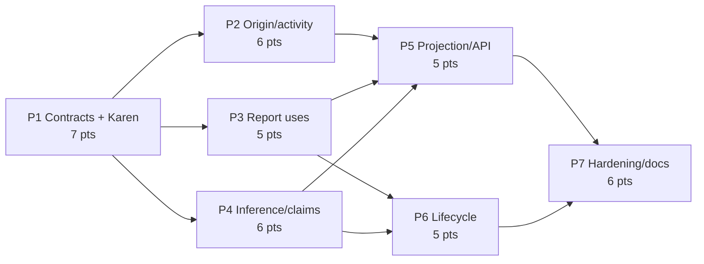

# Decisions Block: Research Provenance Continuity

**Feature Goal**: Preserve exact evidence identity from search/request context through run-local claims, durable inferences, verified report revisions, export, and lifecycle impact without replacing RAL or activation machinery.

This block records new architectural judgment only. Stable registry, materializer, catalog, reuse, activation, verification, and export behavior remains in the linked code and plans.

## 0. Boundary Decisions

- RAL owns immutable source edition/passage/assertion identity and governed catalog reads.
- Assertion-ledger activation owns historical/forward source-assertion population and explicit launch-time reuse reachability.
- RFUP owns upstream machine schema stamping, exact-passage mode, extraction, run sealing, and workflow portability.
- Research Provenance Continuity owns the canonical structured origin envelope and rebuildable facets; canonical planned/search-run envelopes; discoverable search-only activity; exact query/purpose/provider/site/corpus/filter/time and selection receipts; optional AOS project/intent/knowledge refs; durable report uses; separate inference/canonical-claim production; and their lineage/lifecycle projections.
- Catalog-Assisted Research Planning consumes the envelope and chooses evidence before discovery; it must not create a competing provenance type.
- File-backed immutable use records are canonical. Catalog rows, API response assembly, and search facets are derived.

## 1. Phase Boundaries

| Phase | Name | Scope | Success Criteria | Exit Gate | Points |
|---|---|---|---|---|---:|
| P1 | Canonical Contract Freeze | Origin/run/activity/receipt/AOS-ref/report-use/inference/canonical-claim identity, compatibility, denial, and authority rules | Examples validate; search-only and legacy absence remain valid; derived facets non-authoritative; OQ defaults explicit | task-completion-validator then Karen on same exact tree | 7 |
| P2 | Origin, Run, and Activity Materialization | Canonical origin and planned/search-only activity writers, exact scope/selection receipts, derived facet rebuild, governed discovery | Search-only list/fetch works; receipts round trip; facet rebuild parity; absent AOS refs remain valid | task-completion-validator exact-tree pass | 6 |
| P3 | Report-Use Materialization | Immutable verified-report-revision use records, digest binding, replay/conflict checks | Exact assertion/inference/canonical-claim versions publish atomically; legacy/mismatched inputs skip safely | task-completion-validator exact-tree pass | 5 |
| P4 | Inference and Canonical-Claim Materialization | Resolve exact bases; separate durable inference and explicit canonical-claim writers; atomic refs | Typed adversarial matrix passes; no implicit semantic merge or partial record/reference writes | task-completion-validator + Karen milestone | 6 |
| P5 | Projection and Read Contracts | Populate activity discovery, origin/run facets, report uses, typed lineage, API/export/OpenAPI/types | Delete/rebuild parity; authorized response completeness; legacy and denial shapes stable | API contract + task-completion-validator | 5 |
| P6 | Lifecycle Continuity | Enumerate inference/canonical-claim/report dependents in existing impact manifests/receipts | Exact action identity, interruption/resume, malformed receipt rejection | task-completion-validator + Karen milestone | 5 |
| P7 | Hardening and Docs | Adversarial fixtures, compatibility snapshots, full focused gates, docs/CHANGELOG/deferred specs | AC RPC-1..8 evidenced; no progress state overstated; final exact-tree review | task-completion-validator then Karen | 6 |
| **Total** | — | — | — | — | **40** |

### Ordering Rationale

- P1 is a hard serialization barrier. Downstream work begins only after task-completion-validator and Karen approve the same exact tree; any material contract change invalidates both verdicts.
- P2, P3, and P4 can run in parallel after `RPC-1.G` with distinct file ownership; all must land before P5 and the relevant P3/P4 records must land before P6.
- P5 and P6 can run in parallel if P6 solely owns `assertion_impact.py` and P5 owns catalog/discovery/router/export/OpenAPI.
- P7 runs only after the exact P5/P6 candidate is integrated.

## 2. Agent Routing

| Phase | Primary Agent(s) | Secondary / Reviewer | Ownership Notes |
|---|---|---|---|
| P1 | backend-architect, api-designer | task-completion-validator, Karen | Architect owns authority/identity; API designer owns schemas; reviewers bind the serialization gate to one exact tree. |
| P2 | python-backend-engineer | data-layer-expert | Single integration writer owns origin/activity service and discovery seam. |
| P3 | python-backend-engineer | backend-architect | Single writer owns report-use service/schema/tests. |
| P4 | python-backend-engineer | data-layer-expert, Karen | Single writer owns separate inference/canonical-claim services and atomic refs. |
| P5 | python-backend-engineer, api-designer | frontend-developer only for generated-type compatibility | Integration owner: python-backend-engineer. |
| P6 | backend-architect, python-backend-engineer | senior-code-reviewer, Karen | Architect freezes action enumeration; engineer implements reconciler integration. |
| P7 | task-completion-validator, documentation-writer | Karen | Reviewers read-only; docs writer owns docs/CHANGELOG after implementation freezes. |

**Parallel Opportunities**:

- P2 origin/activity work can proceed beside P3 report-use and P4 inference/canonical-claim work after `RPC-1.G`.
- P5 catalog/discovery/API work can proceed beside P6 reconciler work after required producers merge.
- Documentation inventory can be drafted during P5/P6 but must be verified against the final exact tree in P7.

## 3. Risk Hotspots

### Risk 1: Mutable report masquerades as a revision
- **Severity**: high
- **Rationale**: A path or run-local report ID alone can point to changed bytes while appearing stable.
- **Mitigation**: Bind report-use identity to canonical report digest plus monotonic revision/version metadata; test post-write substitution and replay conflict.

### Risk 2: Inference/source evidence conflation
- **Severity**: high
- **Rationale**: The materializer intentionally rejects non-supported claims, while the inference schema exists without a writer; an expedient implementation could write inference text as a source assertion.
- **Mitigation**: Separate service/path/schema/API labels; require exact input assertion refs; include adversarial no-source/partially-resolved/mixed-workspace fixtures.

### Risk 3: Existence leakage during lineage resolution
- **Severity**: high
- **Rationale**: Resolving report/inference refs before scope and rights checks can reveal hidden membership via errors or counts.
- **Mitigation**: Workspace/rights/lifecycle policy first; one safe denial envelope; zero candidate-derived facets/counts on denial.

### Risk 4: Missed impact dependents
- **Severity**: high
- **Rationale**: The lifecycle schema names inference/report revision actions, while canonical-claim and report-use producers are not all reachable today.
- **Mitigation**: Derive manifests from canonical records; require exact ordered action equality and interruption/resume tests copied in spirit from proven P5 receipt hardening.

### Risk 5: Cross-feature envelope drift
- **Severity**: medium
- **Rationale**: Catalog-assisted planning could invent fields before P1 freezes the contract.
- **Mitigation**: P1 publishes canonical origin, run/activity, receipt, AOS-ref, and materialization schemas; catalog, interchange, Knowledge MCP, and Operator MCP depend on `RPC-1.G` and use adapter-local DTOs until it lands.

### Risk 6: Search-only provenance disappears
- **Severity**: high
- **Rationale**: Run-oriented discovery can omit a valid search that never became a planned research run.
- **Mitigation**: Make activity kind and optional planned-run ref explicit; require governed list/fetch fixtures for search-only, denied, degraded, and legacy activity.

### Risk 7: Derived facets become parallel authority
- **Severity**: high
- **Rationale**: Independent writes to flattened origin/search facets can diverge from the canonical envelope and corrupt filters or audits.
- **Mitigation**: Derive facets only through one rebuild path; require delete/rebuild parity and prohibit facet mutation as provenance input.

## 4. Estimation Anchors

### Total: 40 points

| Phase | Points | Reasoning Anchor |
|---|---:|---|
| P1 | 7 | The contract now freezes six canonical artifact kinds, search-only discoverability, optional AOS refs, derived authority, compatibility, and a mandatory Karen exact-tree serialization gate. |
| P2 | 6 | Canonical origin/activity writers, exact scope/selection receipts, governed search-only discovery, and facet rebuild form one H3 service. |
| P3 | 5 | RAL materialization proves immutable record patterns; report digest/revision validation adds a distinct adversarial matrix. |
| P4 | 6 | Runtime inference resolution plus a separate explicit canonical-claim writer and atomic refs form a second H3 service. |
| P5 | 5 | RAL catalog/API is the read analog; search-only discovery and origin/run facets add another governed projection. |
| P6 | 5 | RAL impact reconciliation is the receipt/replay analog; three dependent object classes keep enumeration security-sensitive. |
| P7 | 6 | 17.6% of the 34-point implementation subtotal for plumbing, adversarial compatibility, generated contracts, docs, and exact-tree gates. |

**Anchor Honesty**:

- Repository plans provide comparable point estimates and commits prove those slices landed, but no authoritative actual-point ledger is present in the inspected tree. Treat H5 as a planned-surface anchor with medium confidence, not a measured velocity claim.
- No estimate assumes owner/private corpus execution; repository-local readiness and owner qualification remain separate.

## 5. Dependency Map

**Critical Path**: P1 exact-tree gate → (P2 + P3 + P4) → (P5 + P6) → P7

**Serialization Barriers**:

- Origin/run/activity/receipt and inference/canonical-claim schemas: P1 freezes; P2/P4 implement only after `RPC-1.G`.
- `src/research_foundry/services/assertion_catalog.py`: P5 sole writer.
- `src/research_foundry/services/assertion_impact.py`: P6 sole writer.
- `src/research_foundry/api/openapi.json`: regenerate once after P5 read shapes settle.

## 6. Model Routing

| Phase | Agent | Model | Effort | Rationale |
|---|---|---|---|---|
| P1 | backend-architect / api-designer | sonnet | extended | Identity and compatibility decisions are high leverage. |
| P1 | Karen | opus | extended | Tier 3 exact-tree serialization gate before downstream implementation. |
| P2 | python-backend-engineer | sonnet | extended | H3 activity persistence/discovery and receipt/facet rules. |
| P3 | python-backend-engineer | sonnet | adaptive | Bounded immutable report-use implementation. |
| P4 | python-backend-engineer | sonnet | extended | H3 inference/canonical-claim resolution and atomicity. |
| P5 | python-backend-engineer / api-designer | sonnet | adaptive | Existing catalog/router patterns plus activity discovery. |
| P6 | backend-architect / python-backend-engineer | sonnet | extended | Security-sensitive dependency enumeration and replay. |
| P7 | validation writer tasks | sonnet | adaptive | Focused tests and exact-tree evidence. |
| P7 | documentation-writer | haiku | adaptive | Usage-focused docs after contracts freeze. |
| P7 | Karen | opus | extended | Tier 3 final feature review. |

## 7. Open Questions for Expansion

- **RPC-OQ-1**: Resolve report-use identity: verified content digest plus explicit report revision ID is the default; document why if only one is retained.
- **RPC-OQ-2**: Prefer prepare-at-synthesis/finalize-after-verification so failed verification cannot publish canonical use/inference records; confirm atomic boundary.
- **RPC-OQ-3**: Canonical nested envelopes are authoritative; decide only which legacy top-level fields remain read aliases.
- **RPC-OQ-4**: Canonical claims are optional, separately typed materializations with exact assertion/inference support; never infer semantic merge from an inference or report use.
- **RPC-OQ-5**: Decide the operator repair surface for derived projection rebuild. Default: extend existing rebuild/service commands, no new canonical mutation API.

## 8. Plan Skeleton Pointer

- **Template**: `.agents/skills/planning/templates/implementation-plan-template.md`
- **PRD**: `docs/project_plans/PRDs/enhancements/research-provenance-continuity-v1.md`
- **Output**: `docs/project_plans/implementation_plans/enhancements/research-provenance-continuity-v1.md`
- **Human brief**: `docs/project_plans/human-briefs/research-provenance-continuity.md`

The expansion must preserve phase boundaries, 40-point bottom-up total, explicit file ownership, model/effort vocabulary, deferred-spec tasks, structured ACs, and exact-tree reviewer gates. Do not create progress artifacts during planning.
