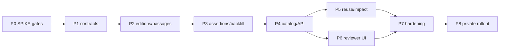

# Decisions Block: Reusable Assertion Ledger

**Feature Goal**: Turn Research Foundry's run-local evidence pipeline into a private, reusable assertion memory while preserving exact source provenance, correction history, and workspace boundaries.

This block records only the new decisions for implementation planning. Stable behavior remains documented in `AGENTS.md`, `intents/intent.md`, `docs/dev/architecture/`, and the linked findings report.

## Phase 0 pre-review decision record (2026-07-13)

- The local deterministic fixture harness supports only a conditional research
  verdict; it is not representative-corpus evidence and makes no empirical
  savings or merge-safety claim.
- Preserve the assertion-only fallback. Keep
  `RF_ASSERTION_REUSE_ENABLED=false` and
  `RF_CANONICAL_CLAIMS_ENABLED=false`; do not enable ledger behavior beyond
  local contract work before independent review and the named corpus/upstream
  gates.
- Treat nondeterministic identity, missing lineage, missed impact enumeration,
  stale eligible reuse, divergent replay, or duplicate downstream action as
  automated-reuse stop conditions.
- The canonical P0 tracker is
  `.Codex/progress/reusable-assertion-ledger/phase-1-progress.md` (`phase: 1`,
  task IDs `P0-001` through `P0-004`). `P0-GATES` is explicitly pending
  task-completion-validator and Karen review.

## 1. Scope and Product Boundary

### In scope

- A private canonical source registry with immutable source editions and passages.
- Durable source assertions whose meaning is limited to what an exact passage states.
- Retrieval packets containing source edition, passage, assertion provenance, status, freshness, and access decision.
- Exact deduplication, incremental refresh, correction/retraction propagation, and report/run impact discovery.
- Workspace-scoped lexical retrieval first; vector and graph projections only after isolation gates pass.
- Optional canonical-claim grouping only if the merge SPIKE meets its safety gate.
- API and runs-viewer surfaces for assertion discovery, provenance review, reuse, and stale-impact warnings.
- Evaluation fixtures for grounding, atomicity, identity, merge safety, retraction propagation, and isolation.

### Out of scope

- A public multi-tenant research network or rights-cleared public corpus.
- Automatic truth adjudication, consensus scoring, or autonomous public promotion.
- Silent semantic merging of source assertions.
- Replacing run-local claim ledgers or the file-canonical evidence pipeline.
- Shared vector/graph indexes before a dedicated tenant-leakage audit.

## 2. Phase Boundaries

| Phase | Name | Scope | Success Criteria | Exit Gate |
|---|---|---|---|---|
| P0 | Research gates | Execute three new SPIKEs and consume existing citation/segmentation evidence | Reuse economics, identity/merge, and retraction decisions are recorded with fixture evidence | Historical replay passes; identity and lifecycle contracts are enumerable |
| P1 | Canonical contracts | Versioned schemas and stable-ID rules for source, edition, passage, assertion, evaluation, lifecycle, and optional canonical claim | Schemas validate; compatibility and migration rules are explicit | Schema fixtures round-trip without altering existing ledgers/exports |
| P2 | Edition and passage registry | File-canonical private registry, content-addressed editions, robust selectors, workspace scope, import path | Unchanged sources reuse editions; changed renditions create new immutable editions | Multi-format ingest fixtures prove deterministic identity and no silent passage drift |
| P3 | Assertion materialization | Extract/import source assertions, extraction provenance, exact dedupe, run-local linkage, bounded backfill | Historical runs can reference durable assertions without changing local IDs | Replay corpus meets provenance and reuse thresholds; legacy pipeline remains green |
| P4 | Catalog, search, and API | Derived assertion read model, scoped lexical search, evidence packets, pagination, OpenAPI | Authorized callers retrieve complete evidence packets; missing fields remain backward-compatible | API/catalog tests and workspace isolation checks pass |
| P5 | Reuse, refresh, and impact | Retrieve-first run behavior, conditional refresh, correction/retraction propagation, report/export/writeback impact graph | Stale/retracted evidence cannot be silently reused; impacted outputs are enumerable | Retraction drill finds 100% of fixture dependencies before reuse |
| P6 | Reviewer experience | Runs-viewer assertion search/detail, provenance, merge review if enabled, and stale-impact workflows | Reviewers can inspect, accept/reject, split/reverse, and trace report usage | Runtime smoke covers every named UI surface and handles missing backend fields |
| P7 | Evaluation and hardening | Gold sets, confidence calibration, prompt-injection handling, performance, adversarial workspace leakage, migration/rollback | Quality and isolation thresholds are measurable and enforced in CI | Tier 3 validator and Karen milestone review pass |
| P8 | Documentation and private rollout | User/dev docs, changelog, feature flag, migration/backfill runbook, monitoring, private-beta rollout | Operators can enable, observe, disable, and recover safely | Private-beta health evidence passes; no public rollout authorized |

### Boundary rationale

- P0 precedes schema commitment because identity, merge, and retraction semantics are algorithmic H3 surfaces.
- P1 freezes compatibility before any persistent registry or API implementation.
- P2 owns source truth; P3 owns extracted observations. This prevents extraction output from becoming source identity.
- P4 remains a rebuildable read projection; P5 owns lifecycle behavior and dependent-output invalidation.
- P6 starts after API contracts stabilize, but UI design may begin with fixtures after P4 schemas are fixed.
- P7 is a hard barrier before rollout, not trailing cleanup.

## 3. Agent Routing

| Phase | Primary Agent(s) | Secondary Agent | Notes |
|---|---|---|---|
| P0 | spike-writer, backend-architect | data-layer-expert | Run bounded research; return actual fixtures and decisions |
| P1 | backend-architect, data-layer-expert | python-backend-engineer | Own schemas, IDs, compatibility, and ADR candidates |
| P2 | python-backend-engineer | data-layer-expert | Own registry storage, ingestion, selectors, and workspace scope |
| P3 | python-backend-engineer | backend-architect | Own extraction provenance, exact dedupe, backfill, and legacy seam |
| P4 | python-backend-engineer | data-layer-expert, api-designer | Own derived catalog, search, DTOs, API, OpenAPI |
| P5 | backend-architect | python-backend-engineer | Own refresh and dependency/impact algorithm; H3 surface |
| P6 | ui-engineer-enhanced | frontend-developer, ui-designer | Own review UX; backend/frontend seam has one integration owner |
| P7 | python-backend-engineer, data-layer-expert, frontend-developer | task-completion-validator, karen, senior-code-reviewer | Writing agents build fixtures and hardening; reviewers remain gate-only |
| P8 | documentation-writer | changelog-generator, DevOps, lead-pm | Private rollout only; no external release authority inferred |

### Parallel opportunities

- P0 historical replay and identity/merge work can run in parallel; retraction propagation consumes the identity fixture contract, and verdict synthesis follows all three artifacts.
- After P1, P2 implementation and P3 fixture design may overlap, but P3 persistence waits on P2.
- P4 API fixture work and P6 UI wireframing may overlap after contract freeze; generated types/OpenAPI are serialization barriers.
- P7 evaluation fixture authoring should begin during P2-P5, while final hardening waits on all implementation phases.

## 4. Risk Hotspots

### Risk 1: Provenance laundering
- **Severity**: high
- **Rationale**: Model-normalized text may be presented as something a source stated or as global truth.
- **Mitigation**: Immutable source assertions, explicit inference nodes, exact passage requirement, grounding evaluation, no silent promotion.

### Risk 2: False semantic merges and contradictions
- **Severity**: high
- **Rationale**: Scope, population, timeframe, negation, or method differences can make superficially similar claims non-comparable.
- **Mitigation**: SPIKE gate, reviewer queue, reversible merge/split events, qualifier preservation, assertion-only fallback.

### Risk 3: Passage drift and lifecycle failure
- **Severity**: high
- **Rationale**: HTML/PDF/OCR changes can detach assertions; corrections or retractions can leave stale reports apparently supported.
- **Mitigation**: Content-addressed editions, multiple selectors, immutable history, dependency traversal, 100% fixture impact gate.

### Risk 4: Workspace leakage
- **Severity**: high
- **Rationale**: Search ranks, embeddings, caches, counts, autocomplete, and merge candidates can reveal private corpus facts.
- **Mitigation**: Authorization before retrieval/ranking, workspace-scoped projections, adversarial leakage suite, no shared vector/graph index in v1.

### Risk 5: Review economics
- **Severity**: high
- **Rationale**: Human verification and merge queues may cost more than re-ingestion savings.
- **Mitigation**: Historical replay gate, exact dedupe first, abstention, sampled review, queue budgets, assertion-only fallback.

### Risk 6: Compatibility and migration
- **Severity**: medium
- **Rationale**: Existing source cards, ledgers, exports, viewer types, and writebacks must remain readable.
- **Mitigation**: Additive schemas, immutable run observations, versioned projections, missing-field UI resilience, rollbackable backfill.

## 5. Estimation Anchors

### Total: 71 points

| Phase | Points | Reasoning Anchor |
|---|---:|---|
| P0 | 8 | Three bounded H3 SPIKEs with corpus fixtures and decision artifacts |
| P1 | 8 | Broader than run-metadata-enrichment contract work due to multiple new durable nouns |
| P2 | 8 | Registry, selectors, workspace scope, and multi-format ingest |
| P3 | 8 | Backfill/creation-path seam comparable to run-metadata-enrichment but adds dedupe/provenance |
| P4 | 8 | Catalog/API slice plus OpenAPI barrier and scoped query behavior |
| P5 | 8 | H3 dependency/impact graph, refresh, correction/retraction propagation |
| P6 | 7 | Runs-frontend claim/provenance UI anchor with additional review states |
| P7 | 8 | Gold sets, security/isolation, performance, compatibility, reviewer gates |
| P8 | 8 | Docs, migration/runbook, feature flag, monitoring, private rollout, including its H6 operational allocation |

### Estimation notes

- H1: approximately eight new first-class domain nouns, but file-canonical storage means the CRUD-with-RBAC rule is a risk floor rather than a literal table count.
- H2: no dual local/enterprise repository implementation is assumed; multiple projections still require compatibility testing.
- H3: identity/merge, contradiction classification, impact traversal, diff/refresh, and ranking are algorithmic and SPIKE-gated.
- H4: schema/identity, source registry, assertion materialization, search/API, lifecycle, UI, and evaluation are independently estimated.
- H5 anchors: `run-metadata-enrichment-v1` (16-20 pts), `runs-frontend-v1` (13 pts), `wksp-304-workspace-isolation-enforcement-v1` (10 pts), and `public-multiuser-p5-auth-rbac-v1` (47.25 pts). This feature exceeds each narrow anchor because it combines their storage, lifecycle, policy, API, and UI surfaces.
- H6: 11 points are labeled and embedded across the 71 phase points; do not add them again or hide generated types, OpenAPI, migration inventory, feature flags, audit fields, changelog, or runbooks inside unlabeled tasks.

## 6. Dependency Map

**Critical path**: P0 -> P1 -> P2 -> P3 -> P4 -> P5 -> P7 -> P8

**Parallelizable slices**: UI design after P1; P6 implementation after P4; evaluation fixture authoring during P2-P5; documentation drafts after P4.

## 7. Model Routing

| Phase | Agent | Model | Effort | Rationale |
|---|---|---|---|---|
| P0 | spike-writer / architects | sonnet | extended | Ambiguous research and checkable fixture design |
| P1 | backend-architect | sonnet | extended | Durable identity and compatibility decisions |
| P2 | python-backend-engineer | sonnet | adaptive | Bounded implementation after contracts freeze |
| P3 | python-backend-engineer | sonnet | adaptive | Implementation plus migration fixtures |
| P4 | python-backend-engineer | sonnet | adaptive | API/catalog implementation |
| P5 | backend-architect | sonnet | extended | Algorithmic dependency and lifecycle behavior |
| P6 | UI agents | sonnet | adaptive | Existing viewer patterns; use repo design assets, no new image generation assumed |
| P7 | implementation and testing agents; gate reviewers | sonnet | extended | Writers build hardening evidence; reviewers independently validate without owning writes |
| P8 | docs/ops agents | haiku / sonnet | adaptive | Haiku docs; sonnet deployment and rollback mechanics |

## 8. Open Questions for Expansion

- **OQ-1**: Does the replay SPIKE meet the 20% reuse and 95% provenance thresholds, or should v1 stop at better run-level caching?
- **OQ-2**: What exact fingerprint fields define a durable source assertion after the identity SPIKE?
- **OQ-3**: Does canonical-claim merge safety pass, or must v1 expose assertion-only retrieval?
- **OQ-4**: Which passage selectors survive supported PDF, OCR, and changed-HTML fixtures?
- **OQ-5**: What is the canonical dependency edge from assertion lifecycle events to report revisions, exports, and writebacks?
- **OQ-6**: Can existing catalog tables remain projections, or is a separate assertion projection required?
- **OQ-7**: Which runs-viewer surfaces are in v1, and how do they behave when new fields are absent?
- **OQ-8**: Which existing citation/segmentation/contradiction charters must be concluded before their dependent phase starts?
- **OQ-9**: What explicit feature flags separate registry creation, retrieve-first reuse, canonical merges, and stale-evidence blocking?
- **OQ-10**: Which security audit closes WKSP-304 DI-1 before any shared-store or shared-index rollout?

## 9. Plan Skeleton Pointer

- **PRD**: `docs/project_plans/PRDs/features/reusable-assertion-ledger-v1.md`
- **Template**: `.agents/skills/planning/templates/implementation-plan-template.md`
- **Output**: `docs/project_plans/implementation_plans/features/reusable-assertion-ledger-v1.md`
- **Human brief**: `docs/project_plans/human-briefs/reusable-assertion-ledger.md`
- **Findings**: `docs/project_plans/reports/investigations/reusable-assertion-ledger-findings.md`
- **SPIKEs**: `docs/project_plans/SPIKEs/reusable-assertion-ledger-*-charter.md`

The implementation-planner must preserve the phase boundaries and total estimate, add file-level ownership and structured ACs, and split phase files if any artifact would exceed 800 lines.
