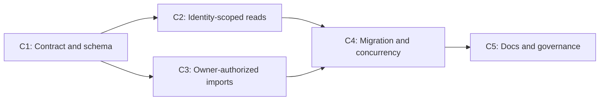

# Decisions Block: WKSP-304 Catalog Stats and Import Workspace Seams

This is a linked Tier-2 addendum to the completed WKSP-304 enforcement plan. It closes the
catalog stats/import seams found by the DI-1 full-surface audit without reopening or rewriting
the completed parent plan.

**Feature Goal**: Make catalog stats, public visibility, and import/rebuild mutations honor
canonical run ownership and authenticated workspace identity while preserving the existing
single-user path and immutable Markdown/YAML provenance.

## 1. Binding decisions

### D1 — Canonical ownership is inherited, never caller-stamped

- A catalog row inherits `workspace_id` from the canonical run export derived from `run.yaml`.
- The requesting identity authorizes the import and supplies actor attribution only.
- Caller input must never set or override the owner workspace.
- Missing run ownership is denied under active workspace isolation.
- `identity=None` keeps the legacy `"default"` fallback for single-user/CLI compatibility.

### D2 — Public is cross-workspace read visibility, not mutation authority

- A caller can read catalog projections for its own workspace and for canonically public runs.
- A foreign public run remains owned by its source workspace.
- Only the owner workspace may import, re-import, or rebuild a run projection.
- A foreign public import attempt is denied with the same external shape as a missing/private
  foreign run and performs zero catalog writes.
- Sensitivity classification and workspace visibility remain separate dimensions.

### D3 — One visibility predicate governs every read projection

When identity is present and workspace isolation is active, catalog reads use:

`owner_workspace_id = identity.workspace_id OR visibility = 'public'`

The predicate must cover:

- search items and totals;
- item detail and joined links/citing drafts;
- counts by item type;
- `runs_indexed`;
- `last_import_at`;
- project, status, sensitivity, term, and role facets.

Foreign private rows must contribute nothing, including timing, facet, error, or existence
signals.

### D4 — Bulk import discovery is authorization-scoped

- `import_all(identity=...)` discovers only runs owned by the caller workspace.
- Public foreign runs are not bulk-import mutation candidates.
- Per-run failures must not reveal foreign run IDs or counts.
- `identity=None` retains the current identity-free discovery behavior.

### D5 — Import attribution has one authoritative ledger and a transactional handoff

Successful and denied authenticated import attempts record:

- actor user/principal ID;
- actor workspace ID;
- canonical owner workspace ID when safely known;
- target run ID when disclosure-safe;
- action, result, and timestamp.

`audit_service`'s append-only audit ledger is the governance source of truth. The
`catalog_import_log` remains a disposable operational projection, not an audit authority.
Successful imports write an idempotent audit-event envelope/outbox row in the same SQLite
transaction as item/link/term/FTS changes, then append that event to `audit_service` after commit.
The API does not report an unqualified success until the append is acknowledged; an append
failure returns a typed `audit_pending` result and leaves the event replayable by stable event ID.
Denied attempts write no catalog SQLite rows but do append a denial event directly to the
authoritative audit ledger. Tests must distinguish "zero catalog writes" from the required audit
ledger write.

Pending envelopes are migration-blocking state even though the rest of the catalog is derived.
Rebuild/swap acquires the catalog write lock, flushes and acknowledges every pending envelope by
stable event ID, and aborts before building/swapping if the authoritative ledger cannot
acknowledge them. Restart replays pending envelopes before accepting a new import. Duplicate
event IDs are acknowledgements, not duplicate audit entries.

Historical actor identity must not be fabricated during migration. Rebuild may reconstruct the
operational outbox only from truthful records already present; it may not synthesize actor events.
Derived catalog records may be rebuilt; immutable audit/provenance records may not be rewritten
to simulate attribution.

### D6 — Catalog migration uses build-then-swap and is provenance-preserving

- Bump the disposable catalog schema version.
- Project run `workspace_id` and `visibility` into catalog rows.
- Make import-log rows workspace/visibility-aware and attribution-capable.
- Build the new schema in a sibling temporary database, fully import and validate it, then
  atomically replace `catalog.db`; never drop the live database in place.
- Quiesce imports and satisfy D5's pending-envelope flush precondition before snapshot/build.
- Preserve the pre-swap database as a bounded rollback backup until the new schema passes its
  validation window.
- On failure before atomic replace, discard the temporary database and keep the old database.
- Rollback under reverted code restores the pre-swap database when its schema version matches;
  otherwise delete only the derived database and deterministically rebuild the old schema from
  canonical exports.
- Because swap cannot start with a pending envelope, the rollback backup is audit-clean; restart
  and rollback tests must nevertheless prove stable-ID replay/duplicate suppression for failures
  that happen before the flush completes.
- Default legacy missing workspace ownership to `"default"` only on the single-user-compatible
  path; missing visibility defaults to workspace-private.
- Migration, rollback, rebuild, and concurrency tests hash canonical run/source/claim/evidence
  files before and after and require byte-identical content.

### D7 — Concurrent writes must converge atomically

- Same-run imports serialize and converge to one exact derived projection.
- A denied foreign import cannot delete, replace, or relabel an owner's rows.
- Readers observe a complete old or new snapshot, never the delete/insert midpoint.
- `import_all` racing `import_run` or rebuild must yield a consistent projection or a bounded,
  typed retry/failure; raw `database is locked` and mixed attribution are unacceptable.
- Term, link, FTS, import-log, and item rows converge together.

### D8 — Governance claims remain bounded

- Repository gates, fixtures, migration tests, or a healthy endpoint establish only the tested
  engineering behavior.
- They do not prove adversarial multi-tenant safety, owner-data qualification, public
  deployment, clinical validation, or a released hosted service.
- DI-1 remains `blocked-external`; Mode-D acceptance and re-audit decisions remain human-only.

## 2. Phase boundaries

| Phase | Name | Scope | Success criteria | Exit gate |
|---|---|---|---|---|
| C1 | Contract and projection schema | Freeze ownership/visibility/import-attribution contracts; update export projection; bump derived catalog schema | Canonical owner and visibility reach row builders without caller control; legacy defaults are explicit | Contract tests plus migration dry-run/rebuild tests pass |
| C2 | Identity-scoped reads | Thread identity into stats; apply own-or-public predicate to stats, search/detail joins, and every facet | Own and public data visible; foreign private data absent from counts, timestamps, facets, links, and totals | Targeted service/router matrix and mutation-removal leak checks pass |
| C3 | Owner-authorized imports | Thread identity into per-run/all-run import; authorize against canonical run owner; add audit attribution | Owner import succeeds; foreign private/public import denies before writes; bulk errors do not disclose | Zero-write denial spies and attribution assertions pass |
| C4 | Migration and concurrency proof | Build-then-swap/rollback, interrupted transaction, simultaneous import/read/rebuild cases, provenance hashing | Atomic convergence, bounded locking behavior, byte-identical canonical artifacts | Full targeted suite plus exact-tree task-completion-validator pass |
| C5 | Documentation and governance closeout | Update architecture/runbook/changelog and DI-1 delta evidence without self-signoff | Operational behavior and claim boundaries are documented; human gate remains pending | Karen feature review; no automated Mode-D acceptance |

**Boundary rationale**:

- C1 freezes the source-of-truth contract before any read or mutation code depends on it.
- C2 proves non-leakage independently of mutation authorization.
- C3 adds write authority only after the derived projection carries trustworthy ownership.
- C4 stress-tests the composed behavior rather than treating sequential idempotency as
  concurrency proof.
- C5 records engineering evidence while keeping human-only governance outside automation.

`P4` everywhere in this packet is the requested requirement ID. Execution phases deliberately use
`C1` through `C5` so requirement traceability cannot be confused with phase numbering.

## 3. Agent routing

| Phase | Primary agent | Secondary/reviewer | Notes |
|---|---|---|---|
| C1 | data-layer-expert | backend-architect | Own export projection and disposable-schema migration |
| C2 | python-backend-engineer | backend-architect | One writer across stats/search/facets to keep predicate semantics uniform |
| C3 | backend-architect | python-backend-engineer | Ownership authorization and audit attribution are security-sensitive |
| C4 | python-backend-engineer | data-layer-expert | Barrier-synchronized SQLite tests and provenance invariants |
| C5 | documentation-writer | changelog-generator | Docs only; no human signoff mutation |

All implementation is serialized through one active writer. Parallel work is limited to
read-only review or non-overlapping test design. C2 and C3 must not write the same service file
concurrently.

## 4. Risk hotspots

| Risk | Severity | Mitigation |
|---|---|---|
| Caller identity overwrites canonical ownership | Critical | D1, canonical export contract, spoof tests |
| Public visibility becomes foreign mutation authority | Critical | D2, owner-only import authorization, zero-write tests |
| Stats timestamp or facets leak foreign activity | High | D3, mixed own/public/private fixtures, mutation-removal tests |
| Bulk import reveals foreign run IDs through errors | High | D4, scoped discovery and disclosure-safe errors |
| Schema rebuild rewrites Markdown/YAML provenance | Critical | D6, hashes and mtimes before/after rebuild/rollback |
| Concurrent delete-then-insert exposes partial state | High | D7, barrier tests, transaction/busy-timeout review |
| Single-user CLI behavior regresses | Critical | Optional identity defaults and byte-compatible baseline tests |
| Green tests are overstated as Mode-D acceptance | Critical | D8, explicit blocked-external/human-only closeout |

## 5. Estimation anchors

**Locked estimate**: 10 points, Tier 2.

| Area | Points | Anchor/rationale |
|---|---:|---|
| Projection schema and rebuild migration | 2.0 | P5.3 migration patterns; derived DB lowers data-migration risk but not provenance-test cost |
| Own-or-public stats/facet/read semantics | 2.0 | Existing WKSP-304 query scoping; narrower surface with a new visibility dimension |
| Import authorization and attribution | 2.5 | DF-004 ownership/public visibility precedent plus security-sensitive audit behavior |
| Concurrency and rollback matrix | 2.0 | New surface; existing coverage proves sequential idempotency only |
| Cross-cutting plumbing/docs/reviews | 1.5 | 17.6% of implementation subtotal, covering DTO/export threading, audit fields, changelog, and gates |

H1 introduces no new canonical domain noun; catalog columns remain a derived projection.
H2 does not apply because the catalog service owns raw SQLite directly rather than dual
repository implementations. H3 applies to concurrent transaction behavior and is budgeted with
an explicit test matrix. H4 covers Catalog, Identity, and Governance separately. H5 anchors to
the original 10-point WKSP-304 plan, the P5.3 migration package, and DF-004. H6 is explicit.

## 6. Dependency map

C2 test design and C3 audit-event design may proceed in parallel after C1, but implementation
writes to `catalog_service.py` are serialized.

## 7. Model routing

| Phase | Agent | Model | Effort | Rationale |
|---|---|---|---|---|
| C1 | data-layer-expert | sonnet | extended | Schema/export contract and migration invariants |
| C2 | python-backend-engineer | sonnet | extended | Security-sensitive predicate consistency |
| C3 | backend-architect | sonnet | extended | Authorization and attribution decisions |
| C4 | python-backend-engineer | sonnet | extended | Deterministic concurrency fixture design |
| C5 | documentation-writer | haiku | adaptive | Bounded documentation updates |
| Reviews | task-completion-validator / karen | sonnet / opus | extended | Mandatory Tier-2 and Mode-D review gates |

## 8. Open questions resolved for expansion

- **OQ-1 resolved**: Public foreign catalog data is readable but not importable by a non-owner.
- **OQ-2 resolved**: `last_import_at` is scoped to own-or-public rows; no global activity oracle.
- **OQ-3 resolved**: Import ownership comes from canonical run metadata; identity never rewrites it.
- **OQ-4 resolved**: Legacy absent visibility becomes workspace-private.
- **OQ-5 resolved**: No automated action may set DI-1 or Mode-D human acceptance.

## 9. Expansion outputs

- PRD: `docs/project_plans/PRDs/harden-polish/wksp-304-catalog-stats-import-workspace-seams-v1.md`
- Implementation plan: `docs/project_plans/implementation_plans/harden-polish/wksp-304-catalog-stats-import-workspace-seams-v1.md`
- Human brief: `docs/project_plans/human-briefs/wksp-304-catalog-stats-import-workspace-seams.md`
- Progress files: deferred until execution initialization through `artifact-tracking`.
