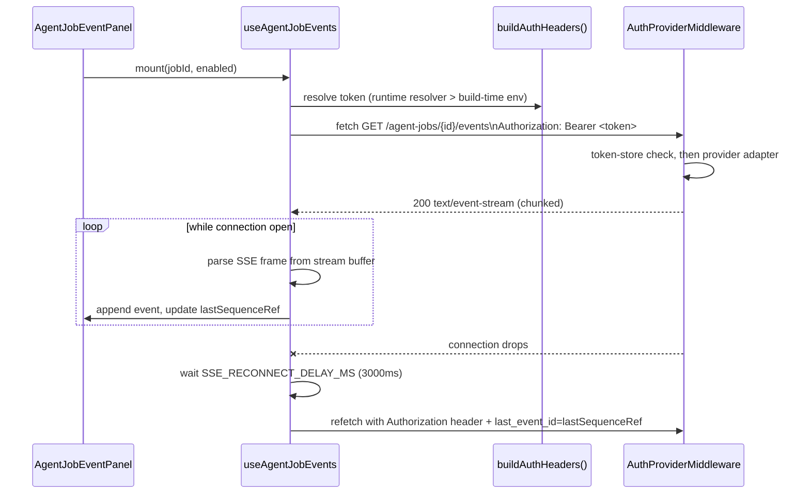

# Feature Brief & Metadata

**Feature Name:**

> Agent Research Loopback Slice — Hardening

**Filepath Name:**

> `agent-research-loopback-slice-v1` (kebab-case)

**Date:**

> 2026-08-03

**Author:**

> Nick (via prd-writer agent)

**Related Epic(s)/PRD ID(s):**

> `public-multiuser-p4-agents-v1` (implementation plan that shipped the slice this PRD hardens)

**Related Documents:**

> - `docs/project_plans/feature_contracts/enhancements/runs-viewer-builder-live-claim-previews.md` — sibling consumer of the same loopback flag family, shared-seam precedent (NOT a dependency)
> - `docs/project_plans/implementation_plans/features/public-multiuser-p4-agents-v1.md` — the plan that shipped the client/server slice this PRD hardens
> - `frontend/runs-viewer/src/hooks/useAgentJobs.ts` — SSE hook + mutation hooks under repair
> - `frontend/runs-viewer/src/api/client.ts` — `buildAuthHeaders()`/`getLoopbackAuthHeaders()`/`isLoopbackEnabled()` (the auth precedence this PRD's fix reuses)

---

## 1. Executive Summary

The agent-research loopback slice in the runs-viewer (gated by `isAgentsLoopbackEnabled`, driven by `VITE_RUNS_FRONTEND_LOOPBACK_API`) is feature-complete — all six client calls in `api/agentJobsClient.ts` have exact backend counterparts in `agent_jobs.py`. This PRD is **not** a build-the-feature PRD; it closes three confirmed defects found in that shipped slice: an SSE event stream with no working authentication, a cancel affordance that exists as dead code, and a test suite that mocks around the exact seam where the auth defect hid. All three are fixed without touching the endpoint contract.

**Priority:** HIGH

**Key Outcomes:**
- Outcome 1: The live agent-job event panel receives events under every configured auth mode (token-store, local_static, Clerk) — not just Clerk's cookie-fallback coincidence.
- Outcome 2: An operator can stop a running agent job from the Agents screen instead of only from the API.
- Outcome 3: A regression in the client↔server auth contract is caught by a test that exercises the real hook and client, not a mock.

---

## 2. Context & Background

### Current State

The Agents screen (`AgentsScreen.tsx`) renders a launch form, a policy-gate summary, a live SSE event panel (`AgentJobEventPanel.tsx`), and an evidence-intake panel — all loopback-only, gated behind `isAgentsLoopbackEnabled()`. The backend router (`api/routers/agent_jobs.py`) exposes six routes: launch, get, list-artifacts, stream-events (SSE), cancel, and accept. Client↔server endpoint parity is complete and verified 1:1 — this is a non-defect, not scope for this PRD.

### Problem Space

Three defects survive in the shipped slice, discovered by direct file-level audit (not re-derived here):

1. **SSE stream never authenticates outside a Clerk-cookie coincidence.** `buildEventsUrl()` (`useAgentJobs.ts:115-127`) puts the auth token in a `?token=` query parameter and reads *only* the build-time `VITE_RUNS_LOOPBACK_API_TOKEN` env var — it never consults the runtime token resolver (`setAuthTokenResolver`) that every other loopback call uses. Server-side, no code path accepts query-param bearer auth: `AuthProviderMiddleware.dispatch()` (`auth.py:200-226`) and `_resolve_token_identity()` (`auth.py:239-275`) read the `Authorization` **header** only, as do the local_static adapter (`adapters/local_static.py:125`) and the Clerk adapter (`adapters/clerk.py:294-307`, whose only non-header fallback is the `__session` **cookie**, not a query param). Under token-store or local_static auth, `EventSource` gets a flat 401 before the route body runs and the live event panel silently never receives events. Under Clerk it may work only by cookie-fallback coincidence, not because the query param did anything. The SSE route (`stream_events()`, `agent_jobs.py:396-428`) also carries no `_RBAC_AGENT_JOB` dependency, unlike launch/cancel/accept — a secondary asymmetry inherited into this fix (see NFR-2).
2. **Cancel is dead code.** `useCancelAgentJob()` (`useAgentJobs.ts:81`) and `POST /agent-jobs/{id}/cancel` (`agent_jobs.py:436`) both exist and work; no component calls the hook and `AgentsScreen.tsx` has no cancel affordance anywhere in its render tree (confirmed: launch form, policy summary, event panel, intake panel — no cancel button). A launched job cannot be stopped from the UI.
3. **No test exercises the real client.** All seven `src/test/agents-*.test.tsx` files mock the `@/hooks/useAgentJobs` module wholesale. This is *why* defect 1 hid in a "feature-complete" slice — the missing negative/positive control is the root cause, not a nice-to-have gap.

### Current Alternatives / Workarounds

None from the UI: an operator watching a stuck or misbehaving job today has no in-app way to cancel it, and under non-Clerk auth the event panel simply shows "Waiting for events…" forever with no diagnostic. The only workaround is calling `POST /agent-jobs/{id}/cancel` directly against the API.

### Architectural Context

- Client: `frontend/runs-viewer/src/hooks/useAgentJobs.ts` (React Query hooks + custom SSE hook), `src/api/agentJobsClient.ts` (typed fetch wrappers), `src/api/client.ts` (shared `buildAuthHeaders()`/`getLoopbackAuthHeaders()`/`isLoopbackEnabled()`/`getLoopbackBase()`).
- Server: `src/research_foundry/api/routers/agent_jobs.py` (six routes), `api/middleware/auth.py` (`AuthProviderMiddleware`), `api/auth/adapters/{local_static,clerk}.py`.
- Auth precedence (client.ts:114-123, `buildAuthHeaders()`): runtime `setAuthTokenResolver` closure token wins over build-time `VITE_RUNS_LOOPBACK_API_TOKEN` env token; `Authorization: Bearer <token>` header when either resolves, header omitted otherwise. This is the ONE precedence every other loopback call uses; the SSE hook is the only caller that doesn't.

---

## 3. Problem Statement

**User Story Format:**
> "As an operator running an agent research job under token-store or local_static auth, when I open the Agents screen, I see the event panel stuck on 'Waiting for events…' with a silent 401 in the network tab, instead of a live stream of stage-transition events."

> "As an operator with a runaway or misconfigured agent job, when I want to stop it, I have no button to press in the Agents screen, instead of being forced to shell out to the API directly."

**Technical Root Cause:**
- `buildEventsUrl()` never calls the runtime auth resolver and relies on `EventSource`, which cannot send custom headers — so a header-based fix requires replacing the transport, not patching the URL builder.
- `useCancelAgentJob()` is fully implemented and untested-in-integration but simply has zero call sites in any `.tsx` file.
- Every `agents-*.test.tsx` file mocks `@/hooks/useAgentJobs`, so the auth-header contract between the hook, the client, and the server middleware has no test surface at all.

---

## 4. Goals & Success Metrics

### Primary Goals

**Goal 1: SSE stream authenticates identically to every other loopback call**
- Replace the query-param `EventSource` transport with a fetch + `ReadableStream` reader that sends `Authorization: Bearer <token>` resolved via the same `buildAuthHeaders()`/`getLoopbackAuthHeaders()` precedence (runtime resolver wins over build-time env).
- Success: a live event stream is received under token-store, local_static, and Clerk auth alike — not only Clerk's incidental cookie path.

**Goal 2: A running job can be canceled from the UI**
- Wire the existing `useCancelAgentJob()` hook into a visible cancel affordance (with a confirm step) that invalidates the job-detail query on success.
- Success: clicking cancel on a running job transitions its status to `canceled` and the affordance disappears/disables per the job's terminal state.

**Goal 3: The auth-header regression class is caught by tests, not audits**
- Add at least one test that exercises the real `useAgentJobEvents` hook and real `agentJobsClient`/`client.ts` functions (no `@/hooks/useAgentJobs` module mock), including a positive control that fails if the `Authorization` header is dropped.
- Success: reverting the SSE fix (dropping the header) makes the new positive-control test fail; all other existing static-mode tests remain green byte-for-byte.

### Success Metrics

| Metric | Baseline | Target | Measurement Method |
|--------|----------|--------|-------------------|
| SSE auth paths exercised by an automated test | 0 (all mocked) | ≥3 (token-store, local_static, header-dropped negative control) | New test file(s) under `src/test/` |
| Cancel affordance call sites in `AgentsScreen`/`AgentJobEventPanel` render tree | 0 | ≥1 | Manual + `agents-launch.test.tsx`-style RTL assertion |
| Static (non-loopback) mode behavior diff | n/a | 0 bytes changed | `git diff` scoped to non-loopback branches; existing static-mode test suite green |

---

## 5. User Personas & Journeys

Single operator persona — the same person who launches, monitors, and accepts/cancels agent research jobs from the runs-viewer Agents screen in loopback mode. No additional personas are introduced by this hardening pass.

### High-level Flow

---

## 6. Requirements

### 6.1 Functional Requirements

| ID | Requirement | Priority | Notes |
| :-: | ----------- | :------: | ----- |
| FR-1 | `useAgentJobEvents` MUST open the SSE connection via `fetch()` + a `ReadableStream` reader, sending `Authorization: Bearer <token>` resolved through the same precedence as `buildAuthHeaders()` in `client.ts:114-123` (runtime `setAuthTokenResolver` result wins over build-time `VITE_RUNS_LOOPBACK_API_TOKEN`). | Must | Replaces `EventSource`; no query-param token. |
| FR-2 | The fetch-stream reader MUST buffer partial chunks across `read()` calls and only parse complete `data: {...}\n\n` frames, carrying any trailing partial fragment into the next chunk. | Must | Chrome/Node fetch streams deliver arbitrary chunk boundaries; a naive split-on-newline drops or corrupts frames that straddle a chunk boundary. |
| FR-3 | On stream error or unexpected close, the hook MUST reconnect after `SSE_RECONNECT_DELAY_MS` (3000ms, unchanged) and MUST pass `last_event_id=<lastSequenceRef.current>` on the reconnect request so the server resumes from the last known sequence — preserving the existing replay contract byte-for-byte. | Must | `last_event_id` stays a query param (server contract unchanged); only the auth token moves to the header. |
| FR-4 | The hook MUST expose the same `{ events, status }` shape and the same `AgentJobEventsStatus` states (`idle`/`connecting`/`live`/`closed`/`error`) as today, so `AgentJobEventPanel` requires no prop-contract change. | Must | Isolates the fix to the transport internals of `useAgentJobEvents`. |
| FR-5 | `AgentsScreen.tsx` (or `AgentJobEventPanel.tsx`) MUST render a visible cancel affordance for a job in a running state (per `RUNNING_STATUSES` in `AgentJobEventPanel.tsx:48`), wired to `useCancelAgentJob()`. | Must | target_surfaces: frontend/runs-viewer/src/screens/AgentsScreen.tsx, frontend/runs-viewer/src/components/Agents/AgentJobEventPanel.tsx |
| FR-6 | The cancel affordance MUST require an explicit confirm step (e.g. a confirm dialog or a two-step button) before dispatching `cancelAgentJob()`. | Must | Prevents accidental cancellation of a running job. |
| FR-7 | On successful cancel, the UI MUST invalidate the job-detail query (`agentJobQueryKey`) — already implemented inside `useCancelAgentJob()`'s `onSuccess` — and the cancel affordance MUST reflect the resulting terminal state (disabled or removed) without a manual refresh. | Must | Hook-side invalidation exists; this FR is the UI wiring + terminal-state reactivity. |
| FR-8 | At least one new test MUST exercise the real `useAgentJobEvents` hook together with the real `client.ts` auth-header resolution (no `@/hooks/useAgentJobs` module mock), asserting the outgoing request carries `Authorization: Bearer <token>` and no `?token=` query parameter. | Must | This is the contract-level test the existing seven `agents-*.test.tsx` files do not provide. |
| FR-9 | The new test suite MUST include a positive control: a test that asserts failure (or an explicit "auth header present" assertion that would fail) when the `Authorization` header is dropped from the SSE request — proving the auth failure mode defect 1 introduced is now actually caught. | Must | Root-cause fix for "why did defect 1 hide" — a mock-free negative case, not just a happy-path green test. |
| FR-10 | The new tests MUST cover both the runtime-resolver token path (`setAuthTokenResolver` injected) and the build-time env fallback path (`VITE_RUNS_LOOPBACK_API_TOKEN` only), confirming the precedence order from FR-1. | Should | Mirrors the precedence contract already tested for `loopbackGet()`/`getLoopbackAuthHeaders()` elsewhere in the client test suite. |

### 6.2 Non-Functional Requirements

**Performance:**
- The fetch-stream reconnect/backoff behavior must not busy-loop: reconnect attempts remain gated by `SSE_RECONNECT_DELAY_MS` (3000ms) exactly as today.

**Security:**
- NFR-1: The bearer token MUST NOT appear in the SSE request URL, browser history, referrer headers, or server access logs at any point after this fix — this is the entire rationale for the header-based approach over query-param auth (see §12 Decisions).
- NFR-2: `stream_events()` (`agent_jobs.py:396-428`) has no `_RBAC_AGENT_JOB` dependency today, unlike launch/cancel/accept. This PRD does not add RBAC to the SSE route — out of scope (see §7) — but the fix must not paper over or obscure this asymmetry; note it as a named residual risk in the implementation plan.
- NFR-3: Event payloads remain pre-redacted server-side (`redact_payload()` gate, unchanged); the client-side fetch-stream reader must not introduce any new client-side logging of raw payload values.

**Reliability:**
- NFR-4: Static (non-loopback) mode behavior MUST be byte-unchanged by this feature. No file under `frontend/runs-viewer/src/` may alter static-mode code paths, static-mode test fixtures, or static-mode test outcomes. Verification: `git diff` limited to loopback-only branches (`isLoopbackEnabled()`/`isAgentsLoopbackEnabled()` guarded code) plus a full run of the pre-existing static-mode test suite with zero new failures and zero changed assertions.

**Observability:**
- Existing `AgentJobEventPanel` status indicators (`connecting`/`live`/`closed`/`error`, unknown/terminal badges) are preserved unchanged per FR-4; no new telemetry is required by this PRD.

---

## 7. Scope

### In Scope

- Rewriting `useAgentJobEvents`'s transport from `EventSource` to a fetch + `ReadableStream` reader with header-based auth (FR-1 through FR-4).
- Wiring `useCancelAgentJob()` into a UI affordance with confirm + query invalidation (FR-5 through FR-7).
- A contract-level test suite that exercises the real client/hook boundary, including a positive auth-failure control (FR-8 through FR-10).

### Out of Scope

- **Agent-job workspace/RBAC scoping** (`workspace_id`/`created_by` hard-coded nullable at `agentJobsClient.ts:93-94`). Blocked behind the formal DI-1 re-audit + Mode-D sign-off gate recorded on ITT node `node_01KXRSGNM4E5YYTP13TY7E4KEA`. Not planned here; tracked as a deferred item.
- **Adding query-param auth** to the SSE route or middleware. Explicitly rejected (see §12 Decisions) — the header-based fetch-stream approach makes this unnecessary and it would introduce a new, weaker auth surface.
- **Deleting the static (non-loopback) fallback mode.** It is a supported product surface, not legacy code; NFR-4 requires it stay byte-unchanged, not removed.
- **Adding RBAC to `stream_events()`.** Noted as a residual asymmetry (NFR-2) but not remediated in this PRD.
- **Selective/partial artifact acceptance, launch-form UX changes, or any endpoint contract change.** Client↔server parity is already complete and verified; this PRD touches zero backend route signatures.

---

## 8. Dependencies & Assumptions

### Internal Dependencies

- **`buildAuthHeaders()`/`getLoopbackAuthHeaders()` (`client.ts:73-123`)**: the auth precedence this fix reuses verbatim — no changes needed to these functions themselves.
- **`AuthProviderMiddleware` (`auth.py:135-278`)**: server-side auth is unchanged; this PRD requires zero server changes by design (see §12).

### Assumptions

- No native fetch-stream SSE reader exists anywhere in this codebase today (verified) — manual SSE frame parsing (FR-2), manual reconnect/backoff (FR-3), and `last_event_id` replay parity must be hand-written. `EventSource` gave all three for free; this is the accepted cost of the header-auth approach (see §12 Decisions).
- The Clerk token resolver itself is not a defect: `src/test/p5-auth-header.test.ts` passes 14/14 as of 2026-08-03; any comment in that file describing "current (unfixed) code" is stale and describes a landed fix. No work is planned against the Clerk resolver in this PRD.
- `runs-viewer-builder-live-claim-previews` (status: completed) is a sibling consumer of the same loopback flag family (`isBuilderLoopbackEnabled`), sharing `client.ts` token machinery — referenced as shared-seam precedent, not a dependency this PRD waits on.

### Feature Flags

- `VITE_RUNS_FRONTEND_LOOPBACK_API`: unchanged. All work in this PRD is gated behind the existing `isAgentsLoopbackEnabled()`/`isLoopbackEnabled()` checks; no new flag is introduced.

---

## 9. Risks & Mitigations

| Risk | Impact | Likelihood | Mitigation |
| ----- | :----: | :--------: | ---------- |
| Manual SSE frame parser mis-handles a chunk boundary split mid-frame, silently dropping an event | Med | Med | FR-2 mandates partial-chunk buffering; test suite (FR-8/9) includes a chunk-boundary-split test case, not just whole-frame delivery |
| Reconnect/backoff regresses (busy-loops or stops resuming from `last_event_id`) | Med | Low | FR-3 requires byte-for-byte preservation of `SSE_RECONNECT_DELAY_MS` and `last_event_id` semantics; existing `agents-resilience.test.tsx` behavior must remain green |
| Cancel confirm step is skipped or fails to prevent accidental cancellation | Low | Low | FR-6 makes the confirm step a Must; validated by an RTL test asserting no `cancelAgentJob()` call fires without confirm interaction |
| Static-mode behavior regresses as a side effect of touching shared `client.ts` code | High | Low | NFR-4 + `git diff` verification scoped to loopback-guarded branches; full static-mode suite run with zero new failures |
| SSE route's missing RBAC dependency (NFR-2) is mistaken for "fixed" once auth headers are added | Med | Med | Explicitly documented as out of scope in §7 and as a residual risk in NFR-2 — not silently resolved by this PRD |

---

## 10. Target State (Post-Implementation)

**User Experience:**
- The live event panel receives events under any configured auth mode — token-store, local_static, or Clerk — with no dependency on cookie-fallback coincidence.
- An operator can cancel a running job from the Agents screen with a confirm step, and sees the job's status reflect `canceled` without a manual refresh.

**Technical Architecture:**
- `useAgentJobEvents` uses a fetch + `ReadableStream` transport instead of `EventSource`, sending the resolved bearer token as an `Authorization` header — matching every other loopback call's auth precedence.
- No backend route signature changes; the SSE route's request/response contract (`data: {json}\n\n` frames, `last_event_id` query param, terminal-state stream closure) is unchanged.

**Observable Outcomes:**
- A dropped `Authorization` header now fails a test instead of silently producing an empty event panel in production.
- Static-mode behavior is verifiably unchanged (zero-diff on non-loopback branches).

---

## 11. Overall Acceptance Criteria (Definition of Done)

### Functional Acceptance

- [ ] FR-1 through FR-4: SSE stream authenticates via header, preserves reconnect/backoff and `last_event_id` replay semantics, and exposes an unchanged hook contract.
- [ ] FR-5 through FR-7: Cancel affordance is visible for running jobs, requires confirm, and reflects terminal state after invalidation.
- [ ] FR-8 through FR-10: New test(s) exercise the real client/hook boundary with a positive auth-failure control; existing static-mode tests remain green with zero changed assertions.

### Technical Acceptance

- [ ] No backend route signature or contract change (verified against `agent_jobs.py` diff).
- [ ] NFR-1: no bearer token appears in the SSE request URL, browser history, or server access logs.
- [ ] NFR-4: `git diff` confined to loopback-guarded code paths; static-mode test suite has zero new/changed failures.

### Quality Acceptance

- [ ] FR-9's positive control fails when the `Authorization` header is deliberately dropped (manually verified during review, not just asserted to exist).
- [ ] Chunk-boundary-split SSE frame parsing is covered by a test case (FR-2 verification).

### Documentation Acceptance

- [ ] Module docstring in `useAgentJobs.ts` (the header comment block, lines 1-15) is updated to describe the fetch-stream transport instead of the current `EventSource`-based description.

---

## 12. Assumptions & Open Questions

### Assumptions

- See §8 Assumptions above (no restatement here; all planning-time assumptions are recorded there per template convention).

### Decisions (record as accepted — do not re-open)

- **Decision**: Fix the SSE auth defect via a **fetch + `ReadableStream` SSE reader carrying the token in an `Authorization` header**, reusing the existing `buildAuthHeaders()`/`getLoopbackAuthHeaders()` precedence (`client.ts:114-123`: runtime `setAuthTokenResolver` wins over build-time env).
  - **Rationale**: Zero server changes required; keeps the bearer credential out of URLs (logs/browser history/referrers).
  - **Rejected alternative**: Keep `EventSource` and add a runtime-resolved query-param token. Rejected because it would require adding query-param bearer auth to the middleware — a new auth surface — and would still put a credential in a URL.
  - **Accepted cost**: No fetch-stream SSE reader exists anywhere in this codebase today (verified). Manual SSE frame parsing with partial-chunk buffering (FR-2), manual reconnect/backoff (FR-3), and `last_event_id` replay parity (FR-3) must be hand-written — `EventSource` gave all three for free.
  - **Must preserve**: `SSE_RECONNECT_DELAY_MS = 3000` and `lastSequenceRef`/`last_event_id` replay behavior, unchanged.

### Open Questions

None blocking. The one architecturally load-bearing question (transport choice for SSE auth) is already resolved above as an accepted decision, not left open.

---

## 13. Appendices & References

### Related Documentation

- Implementation plan that shipped the slice this PRD hardens: `docs/project_plans/implementation_plans/features/public-multiuser-p4-agents-v1.md`
- Sibling shared-seam precedent (completed, not a dependency): `docs/project_plans/feature_contracts/enhancements/runs-viewer-builder-live-claim-previews.md`
- ITT node for the deferred workspace/RBAC scoping gate: `node_01KXRSGNM4E5YYTP13TY7E4KEA`

### Symbol References

- `useAgentJobEvents`, `buildEventsUrl` — `frontend/runs-viewer/src/hooks/useAgentJobs.ts`
- `buildAuthHeaders`, `getLoopbackAuthHeaders`, `isLoopbackEnabled` — `frontend/runs-viewer/src/api/client.ts`
- `AuthProviderMiddleware`, `_resolve_token_identity` — `src/research_foundry/api/middleware/auth.py`
- `stream_events`, `_sse_event_generator`, `cancel_job` — `src/research_foundry/api/routers/agent_jobs.py`

### Prior Art

- `src/test/p5-auth-header.test.ts` — the existing test proving the Clerk/runtime-resolver precedence works correctly for `loopbackGet()`; the new FR-8/FR-9 tests extend the same precedent to the SSE transport.

---

## Implementation

### Phased Approach

**Phase 1: SSE header-auth transport (FR-1 – FR-4)**
- Tasks:
  - [ ] Replace `EventSource` with a fetch + `ReadableStream` reader in `useAgentJobEvents`
  - [ ] Implement partial-chunk-safe SSE frame parsing
  - [ ] Preserve reconnect/backoff + `last_event_id` replay semantics

**Phase 2: Cancel affordance (FR-5 – FR-7)**
- Tasks:
  - [ ] Add cancel button/control wired to `useCancelAgentJob()`
  - [ ] Add confirm step before dispatch
  - [ ] Verify terminal-state reactivity after invalidation

**Phase 3: Contract-level test coverage (FR-8 – FR-10)**
- Tasks:
  - [ ] Add a test exercising the real hook + real client (no `useAgentJobs` mock)
  - [ ] Add the positive auth-failure control test
  - [ ] Add runtime-resolver vs. build-time-env precedence test cases

### Epics & User Stories Backlog

| Story ID | Short Name | Description | Acceptance Criteria | Estimate |
|----------|-----------|-------------|-------------------|----------|
| ARLS-01 | SSE header auth | Replace query-param EventSource with header-auth fetch-stream | FR-1–FR-4 | 6 |
| ARLS-02 | Cancel affordance | Wire dead cancel hook into UI with confirm | FR-5–FR-7 | 3 |
| ARLS-03 | Real-client test coverage | Contract test + positive auth-failure control | FR-8–FR-10 | 4 |

---

**Progress Tracking:**

See progress tracking: `.claude/progress/agent-research-loopback-slice/all-phases-progress.md`
