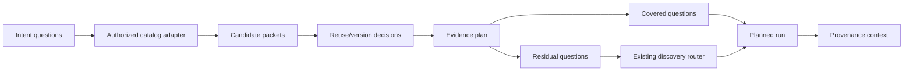

# Feature Brief & Metadata

**Feature Name:**

> Catalog-Assisted Research Planning

**Filepath Name:**

> `catalog-assisted-research-planning-v1`

**Date:**

> 2026-07-18

**Author:**

> Codex planning worker under delegated orchestration

**Related Documents:**

> - RAL PRD/plan: approved private assertion catalog, packet, reuse, and lifecycle seams.
> - Assertion-ledger activation: real ledger population and explicit reuse reachability.
> - Research Provenance Continuity: versioned correlation/evidence-selection envelope and downstream lineage.
> - RFUP: upstream extraction/verification/machine-contract work; this feature does not repeat it.

---

## 1. Executive Summary

Research Foundry exposes a private lexical assertion catalog and an explicit
per-assertion reuse decision, but research planning still begins from intent
questions and schedules discovery without consulting the catalog. The Search
Router declares a `cache_first` mode with zero external-query budget and an
empty provider chain, yet `run_search()` has no catalog retrieval branch; in
practice that mode produces an empty run rather than reusable evidence.

This feature makes retrieval-before-discovery an executable, governed planning
step. It queries the authorized assertion catalog for each research question,
evaluates exact assertion versions through existing reuse gates, records an
evidence plan with covered/residual questions, and routes only residual
questions to external discovery. It consumes the Research Provenance Continuity
envelope for lineage and leaves RAL, activation, RFUP, source discovery
providers, and canonical semantic merging in their existing ownership domains.

**Priority:** HIGH

**Key Outcomes:**

- `cache_first` becomes a real catalog-backed mode rather than an empty-provider no-op.
- Run plans show which questions are covered by eligible evidence and which still require discovery.
- External query budgets are spent on explicit residual gaps, not on rediscovering already eligible evidence.
- Every selected evidence packet carries exact version, rights, workspace, freshness, and decision provenance.

---

## 2. Context & Background

### Current State: Available Building Blocks

- `AssertionCatalog.search()` performs workspace/rights/lifecycle policy before lexical matching, counts, facets, and cursors.
- `AssertionCatalog.packet()` returns exact assertion, passage, edition, qualifiers, evaluation, access/rights, relationships, and run/report lineage.
- `assertion_reuse.evaluate_reuse()` and `run_launch.retrieve_first_reuse_decision()` return allow/refresh/deny decisions for exact assertion inputs.
- `planning.plan_run()` turns intent research questions into a brief, swarm plan, routing decision, and registered run.
- `search_router.modes` defines `cache_first` with zero external queries and `source_cards` output.
- `search_router.run_search()` resolves provider chains, executes discovery, extracts URLs, and persists `search_run.yaml`.
- `LaunchRunRequest` exposes opt-in reuse fields, but it accepts a caller-supplied assertion object rather than querying/selecting catalog evidence.

### Live Gaps

1. `cache_first` has no provider and no catalog branch, so it cannot return stored evidence.
2. `plan_run()` builds research questions and swarm tasks without checking the assertion catalog.
3. The run-launch API does not thread authenticated identity into `launch_run()`; it contains a TODO for future workspace scoping.
4. Search request/run schemas do not define a retrieval policy, selected packet refs, covered/residual question states, or fallback reason.
5. Reuse evaluation happens only when a caller already possesses and supplies one assertion payload.
6. There is no deterministic evidence-plan artifact connecting question → candidate → decision → selection → residual discovery.
7. Search metrics expose external queries/extraction counts but not catalog candidates evaluated, eligible packets selected, residual questions, or avoided-query counts.

### Non-Duplication Map

| Existing package | Already owns | This PRD adds |
|---|---|---|
| RAL | Assertion identity, governed catalog/packet reads, reuse decisions, lifecycle blocking | Adapter and planner that invoke those seams before discovery |
| Assertion-ledger activation | Ledger population and explicit supplied-assertion launch reachability | Automatic authorized retrieval/select/plan flow; no new backfill/forward writer |
| Research Provenance Continuity | Correlation and selected-evidence lineage envelope | Selection policy, evidence plan, coverage/residual decisions |
| RFUP | Exact passage mode, extraction, schema stamps, run seal, Path-B portability | No RFUP behavior; retrieval may consume RFUP-produced artifacts later |

---

## 3. Problem Statement

> As a research operator, when I launch research on a topic already represented in the private assertion catalog, Research Foundry plans discovery first instead of showing reusable evidence, its exact eligibility, and the remaining evidence gaps.

**Technical Root Causes:**

- The search router models cache-first intent but only implements provider-driven discovery/extraction.
- Planning and assertion catalog services have no integration adapter.
- Reuse policy is reachable only after an external caller supplies a complete assertion object.
- No durable evidence-plan contract exists for question-level coverage and residual gaps.
- Workspace identity is not yet threaded through the run-launch planning service.

---

## 4. Goals & Success Metrics

### Goal 1: Governed Retrieval Before Discovery

Query the existing assertion catalog only after workspace identity and capability checks. Denial or missing context must produce a typed, non-leaking result and must not silently fall through to external search unless request policy authorizes fallback.

### Goal 2: Evidence-Aware Planning

Produce a deterministic evidence plan that maps research questions to evaluated exact-version candidates, selected packets, coverage status, and residual reasons.

### Goal 3: Residual-Only Discovery

When request policy allows hybrid behavior, create discovery work only for residual questions. Preserve existing discovery behavior byte-for-behavior when retrieval-first is disabled.

### Goal 4: Auditable Selection

Carry selected evidence refs and decision receipts through the Research Provenance Continuity envelope into research brief, swarm/routing artifacts, search run, launch response, and export.

### Success Metrics

| Metric | Baseline | Target | Measurement |
|---|---|---|---|
| `cache_first` usefulness | Empty provider chain yields no stored evidence | Eligible fixture query returns exact governed packets with zero external provider calls | Router/service integration test |
| Question coverage artifact | No covered/residual state | Each primary/secondary question has one terminal state and reason | Evidence-plan schema validation |
| Residual-only discovery | Planning schedules normal discovery without catalog check | Hybrid fixture invokes providers only for residual question IDs | Provider spy assertions |
| Reuse gate coverage | Caller supplies one assertion manually | Every selected packet records allow/refresh/deny decision and version pin | Planner receipt tests |
| Legacy compatibility | Discovery is current default | Disabled/unavailable retrieval preserves prior provider chain, budgets, and output keys | Snapshot regression |
| Efficiency evidence | No catalog metrics | Fixture records candidates evaluated, selected packets, residual questions, and external calls avoided | Search-run metrics; no cost-savings claim |

---

## 5. Personas & Journeys

### Research Operator

Wants to know what the foundry already knows, whether it is still eligible, and why new discovery is scheduled.

### Planning Agent

Needs bounded, policy-authorized evidence packets and an explicit residual-question list before constructing discovery tasks.

### Governance Reviewer

Needs proof that hidden, stale, cross-workspace, or rights-denied candidates neither affect plan content nor leak through counts/reasons.

### High-Level Flow

---

## 6. Requirements

### 6.1 Functional Requirements

| ID | Requirement | Priority | Notes |
|---|---|---|---|
| CARP-FR-1 | Define a retrieval policy with explicit states for disabled, catalog-only, and catalog-then-discovery behavior. | Must | Exact names frozen in Phase 1. |
| CARP-FR-2 | Require authenticated workspace identity and enabled assertion capabilities before catalog access. | Must | No implicit default workspace for API reads. |
| CARP-FR-3 | Implement a bounded adapter over `AssertionCatalog.search()` and `.packet()`; preserve policy-first filtering and cursor limits. | Must | No direct ledger file scan. |
| CARP-FR-4 | Evaluate each candidate through existing reuse/version/extraction-contract gates before selection. | Must | Refresh/deny are not covered evidence. |
| CARP-FR-5 | Persist one evidence-plan artifact mapping each research question to evaluated candidate refs, decision reason, selection state, coverage state, and residual reason. | Must | File-canonical run artifact. |
| CARP-FR-6 | Implement deterministic question coverage using explicit lexical/qualifier/source constraints and a conservative threshold contract. | Must | H3 algorithm; Phase 1 freezes scenarios. |
| CARP-FR-7 | Route only residual question IDs to existing discovery providers when fallback is authorized. | Must | Provider spy proves no covered-question query. |
| CARP-FR-8 | Make `cache_first` return eligible catalog packets and zero external provider calls. | Must | Denied/empty remains typed and bounded. |
| CARP-FR-9 | Carry exact selected evidence refs and retrieval receipts through the Research Provenance Continuity envelope. | Must | Do not create alternative correlation fields. |
| CARP-FR-10 | Add retrieval metrics: questions evaluated, candidates evaluated, packets selected, covered questions, residual questions, and external calls avoided. | Should | Aggregate counts only after authorization. |
| CARP-FR-11 | Expose retrieval policy/results through CLI/service, MCP search tool, run-launch API, search-run persistence, and export additively. | Should | API identity is threaded into service calls. |
| CARP-FR-12 | Preserve pre-feature planning/discovery behavior when policy is disabled or the feature flag/capability is absent. | Must | No ambient catalog reads. |

### 6.2 Non-Functional Requirements

**Security and Privacy**

- Resolve authenticated workspace identity before catalog reads.
- Return one safe denial/empty envelope without hidden candidate counts, facets, text, IDs, or timing-derived detail.
- Never query another workspace, infer membership, or use a shared retrieval index.
- Keep external writeback default denied and outside this feature.

**Correctness**

- A question is covered only by at least one exact-version eligible packet that satisfies the frozen coverage contract.
- Refresh, denied, stale, invalidated, tombstoned, legacy-unresolved, or version-mismatched packets cannot mark coverage.
- Residual reasons are closed enums/codes, not model-generated prose.
- Deterministic replay produces the same selection/order for the same catalog generation and request.

**Compatibility**

- Retrieval policy is optional and defaults according to the Phase 1 decision; disabled behavior must preserve current planning/discovery semantics.
- Existing search modes and output fields remain accepted.
- Legacy clients handle new response fields as optional.

**Performance and Cost**

- Catalog queries are bounded by question count, candidate limit, and page cap.
- `cache_first` performs zero external provider calls.
- Metrics report observed counts only; no unmeasured dollar, latency, or quality uplift is claimed.

---

## 7. Scope

### In Scope

- Retrieval policy, evidence-plan, coverage/residual, and retrieval-receipt contracts.
- Authenticated adapter over existing assertion catalog/packet/reuse services.
- Conservative deterministic coverage and selection logic.
- `cache_first` catalog implementation.
- Catalog-then-discovery orchestration for residual questions.
- Planning/run-launch/search-run/MCP/API/export integration through the provenance envelope.
- Safe metrics, focused tests, generated OpenAPI/types, docs, and CHANGELOG.

### Out of Scope

- New assertion registry/materializer/catalog authority or activation drivers.
- New vector, embedding, semantic graph, cross-workspace, or public retrieval index.
- Canonical semantic merge or automatic claim equivalence.
- Model-generated query decomposition, answer synthesis, or coverage judgment in v1.
- New external discovery providers or RFUP native-adapter installation.
- Historical report/inference lineage; owned by Research Provenance Continuity.
- Owner/private corpus qualification, production activation, deployment, or external writeback.

---

## 8. Dependencies & Assumptions

### Internal Dependencies

- RAL assertion catalog, evidence packets, reuse evaluation, lifecycle state, workspace isolation, and rights decisions.
- Assertion-ledger activation has populated the ledger for useful environments; empty catalog remains a valid result.
- Research Provenance Continuity Phase 1 freezes the versioned `provenance_context`/selected-evidence envelope.
- Existing planning, run-launch, Search Router, MCP, API, export, and schema registry surfaces.

### Assumptions

- Lexical catalog matching plus explicit constraints is sufficient for a conservative v1 selection surface; missed matches become residual discovery, not false coverage.
- Exact eligible source assertions are sufficient for v1 planning; canonical claims stay optional and are not required.
- Each intent's research questions can be mapped deterministically to stable question IDs already produced by `planning._build_questions()`.
- Private owner data is unavailable during repository implementation; synthetic/repository fixtures cannot establish real-corpus reuse rate.

### Cross-Feature Sequence

Research Provenance Continuity P1 is a hard contract dependency. CARP P1 may draft its evidence-plan schema in parallel, but selected-evidence/correlation fields must import or reference the RPC contract rather than duplicate it.

---

## 9. Risks & Mitigations

| Risk | Severity | Mitigation |
|---|---|---|
| False coverage suppresses necessary discovery | High | Conservative coverage rule; H3 scenario matrix; refresh/deny never covers; residual-on-uncertainty. |
| Catalog read leaks workspace membership | High | Identity/scope/rights before retrieval and counts; two-workspace timing/response tests. |
| Stale evidence selected as current | High | Existing reuse/lifecycle/version gates on each packet; record exact decision receipt. |
| `cache_first` silently falls through to web | High | Zero-query budget invariant and provider spy; fallback requires explicit catalog-then-discovery policy. |
| Planner/search envelopes diverge | Medium | Consume RPC P1 contract; single seam task and contract round-trip. |
| Query expansion grows into an LLM planner | Medium | Deterministic research questions and lexical constraints only; defer adaptive generation. |
| Empty catalog blocks normal work | Medium | Disabled/fallback policies explicit; empty result becomes residual when authorized, never an implicit hard failure. |

---

## 10. Acceptance Criteria

#### AC CARP-1: Policy precedes catalog retrieval

- target_surfaces:
    - src/research_foundry/services/planning.py
    - src/research_foundry/services/assertion_catalog.py
    - src/research_foundry/api/routers/runs.py
- propagation_contract: Authenticated workspace identity and retrieval policy enter planning before any catalog search/packet call; denial ends with one safe result.
- resilience: Missing identity, disabled capability, or denied rights returns no candidate-derived IDs, text, facets, counts, or timing detail.
- visual_evidence_required: false
- verified_by: [CARP-6.2]

#### AC CARP-2: Cache-first returns governed packets only

- target_surfaces:
    - src/research_foundry/services/search_router/modes.py
    - src/research_foundry/services/search_router/router.py
    - src/research_foundry/services/assertion_catalog.py
- propagation_contract: `cache_first` queries the authorized assertion catalog, evaluates exact packets, and persists selected refs with an external-query count of zero.
- resilience: Empty or denied catalogs return typed empty/denied results and never call a provider.
- visual_evidence_required: false
- verified_by: [CARP-6.3]

#### AC CARP-3: Evidence plan separates covered and residual questions

- target_surfaces:
    - schemas/research_evidence_plan.schema.yaml
    - src/research_foundry/services/planning.py
    - schemas/research_brief.schema.yaml
- propagation_contract: Each stable question ID records evaluated candidates, exact decision refs, one coverage state, and one residual reason when not covered.
- resilience: Uncertain, legacy-unresolved, refresh, denied, stale, or version-mismatched candidates resolve to residual rather than covered.
- visual_evidence_required: false
- verified_by: [CARP-6.4]

#### AC CARP-4: Discovery receives residual question IDs only

- target_surfaces:
    - src/research_foundry/services/planning.py
    - src/research_foundry/services/search_router/policy.py
    - src/research_foundry/services/search_router/router.py
- propagation_contract: Catalog-then-discovery routing builds provider requests only for residual question IDs and retains coverage/decision receipts for selected packets.
- resilience: Disabled retrieval reproduces the pre-feature provider chain and question set; empty catalog becomes residual only when fallback is authorized.
- visual_evidence_required: false
- verified_by: [CARP-6.5]

#### AC CARP-5: Selection lineage uses the shared provenance envelope

- target_surfaces:
    - schemas/search_request.schema.yaml
    - schemas/search_run.schema.yaml
    - src/research_foundry/services/run_launch.py
    - src/research_foundry/services/export_service.py
- propagation_contract: Selected assertion versions and retrieval receipts flow through the RPC-defined context into search run, planned run, launch response, and export.
- resilience: If RPC context is absent on a legacy artifact, consumers expose no fabricated selection and continue reading existing fields.
- visual_evidence_required: false
- verified_by: [CARP-6.6]

#### AC CARP-6: Metrics are observed and non-leaking

- target_surfaces:
    - schemas/search_run.schema.yaml
    - src/research_foundry/services/search_router/router.py
    - src/research_foundry/services/export_service.py
- propagation_contract: Authorized runs record question/candidate/selection/residual and avoided-provider-call counts derived from executed control flow.
- resilience: Denied retrieval emits zero candidate-derived metrics; legacy runs omit the additive fields.
- visual_evidence_required: false
- verified_by: [CARP-6.7]

---

## 11. Implementation Outline

| Phase | Outcome | Dependency |
|---|---|---|
| P1 | Freeze retrieval policy, evidence plan, coverage/residual, identity, and RPC-envelope contracts | RPC P1 contract |
| P2 | Build governed catalog/packet/reuse adapter | P1 |
| P3 | Build deterministic evidence planner and residual question algorithm | P2 |
| P4 | Implement `cache_first` and catalog-then-discovery run planning | P3 |
| P5 | Propagate API/MCP/search-run/export contracts and safe metrics | P4 |
| P6 | Run adversarial/compatibility gates, docs, deferred specs, exact-tree review | P5 |

Detailed tasks, dependencies, model/effort routing, and reviewer gates live in the linked unified implementation plan.

---

## 12. Deferred Items

| Item | Reason | Promotion Trigger |
|---|---|---|
| Semantic/vector reranking | RAL v1 explicitly excludes vector indexes; lexical conservative fallback is sufficient | Measured lexical miss rate plus approved private-index threat model |
| Adaptive/model-generated query decomposition | Adds nondeterminism and prompt/model provenance | Deterministic residual planner proves insufficient on an approved evaluation set |
| Canonical-claim coverage | Canonical merging remains optional and source assertions are sufficient | Merge safety is qualified and canonical claim activation is authorized |
| Cross-workspace/public evidence planning | Violates private-first workspace boundary | Separate rights/federation design and security approval |

P6 must author a design spec for each deferred item before closeout.

---

## 13. Reviewer Gates

- `task-completion-validator` reviews each phase on its exact current tree.
- `karen` reviews the H3 coverage/residual phase, retrieval/discovery integration milestone, and final Tier 3 candidate.
- Any fix, generated contract change, or evidence update invalidates the relevant exact-tree approval.
- Provider spies must prove `cache_first` has zero external calls and covered questions never enter residual discovery.
- Repository readiness, real private-corpus usefulness, activation, and shipped/released state remain separate truths.
- No default-on retrieval decision is implemented until CARP-OQ-2 is resolved and reviewed.

---

## 14. Documentation Requirements

- Document retrieval policy modes, evidence plan, coverage/residual reasons, denial/empty behavior, and exact version pins.
- Update CLI/MCP/API/OpenAPI/search-run schema docs for additive request/response/metrics fields.
- Add a CHANGELOG `[Unreleased]` entry for operational `cache_first` and evidence-aware planning.
- Crosslink RAL, activation, RPC, and RFUP rather than duplicating their architecture.
- Describe observed fixture counts only; do not state empirical savings or quality uplift without owner/private evaluation.
