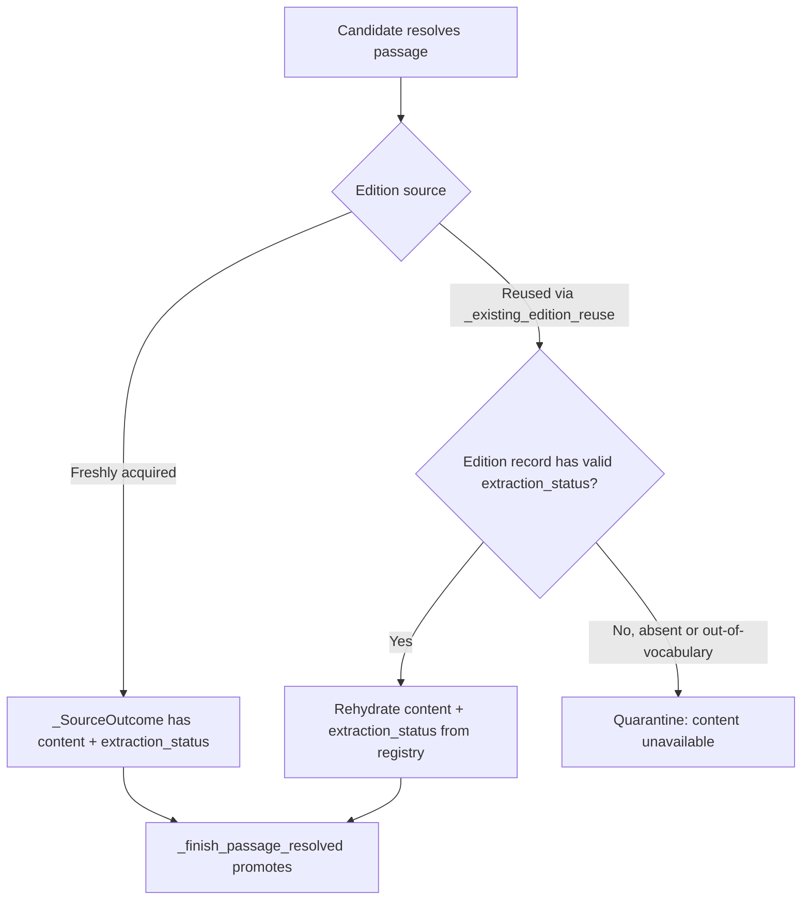

# Feature Brief & Metadata

**Feature Name:**

> ERI Reused-Edition Promotion

**Filepath Name:**

> `eri-reused-edition-promotion-v1`

**Date:**

> 2026-07-31

**Author:**

> Nick Miethe

**Related Epic(s)/PRD ID(s):**

> External Research Report Interchange (ERI) — `external-research-report-interchange-v1`

**Related Documents:**

> - `docs/project_plans/PRDs/enhancements/external-research-report-interchange-v1.md`
> - Commit `7e2c1e1` — "fix(eri): fail closed instead of asserting on reused-edition promotion" (the interim fix this PRD supersedes with a real fix)

---

## 1. Executive Summary

The External Research Report Interchange (ERI) `--run` promotion path currently quarantines every candidate that resolves against a *reused* source edition instead of a freshly-acquired one, because the `AssertionRegistry` has no way to hand back the reused edition's rendition bytes or its recorded extraction completeness. This PRD scopes an additive, back-compat-safe fix to the registry and resolver so reused-edition candidates promote exactly like fresh ones, while editions written before the fix keep failing closed rather than fabricating data they never recorded.

**Priority:** MEDIUM

**Key Outcomes:**
- Outcome 1: A `passage_resolved` candidate bound to a reused edition promotes to a run source card, matching the outcome for a freshly-acquired edition. (Verified-tier assignment, when it happens, is a separate downstream step owned by `verify_report` / assertion materialization — promotion itself never self-assigns it.)
- Outcome 2: The registry gains a durable, optional per-edition record of extraction completeness (`full_text` | `locator_only` | `partial`) plus a public accessor for stored rendition bytes, closing the structural gaps that made the reuse path unreachable.
- Outcome 3: Editions written before this change — which have no recorded extraction status — continue to fail closed with a distinguishable quarantine reason, rather than being silently promoted on a guess.

---

## 2. Context & Background

### Current State

Commit `7e2c1e1` fixed a crash: `_finish_passage_resolved` (`src/research_foundry/services/external_research_resolution.py:948`) previously asserted that a bound `_SourceOutcome` always carried non-`None` `content` and `extraction_status`. On the reuse path — `_existing_edition_reuse` reconstructing an outcome via `_ensure_source_outcome` — both fields are `None`, and the assertion crashed the run. The fix replaced the assertion with a fail-closed return of `_candidate_quarantine("verification_failed")`. This is correct and safe, but it is a functional dead end: reused-edition candidates never advance past quarantine, and that path is the common one on `--resume` (batch 1 acquires fresh content; the resume resolver reuses editions already on disk).

### Problem Space

Operators running a multi-batch ERI import via `rf ... --run --resume` see promotion stall on any candidate whose source content was already ingested in an earlier batch or an earlier run against the same workspace. The candidate is not wrong or unverifiable — the registry genuinely holds the bytes and once held the extraction status — it simply cannot report either fact back to the resolver today.

### Current Alternatives / Workarounds

None that preserve correctness. Re-fetching or re-extracting the source on the reuse path would violate the ERI contract that reuse is read-only and zero-network-I/O. Removing the fail-closed guard and trusting a fabricated extraction status would resurrect exactly the risk the `7e2c1e1` fix was written to avoid: promoting a candidate whose completeness tier was never actually verified.

### Architectural Context

- `AssertionRegistry` (`src/research_foundry/services/assertion_registry.py`) owns content-addressed, file-per-record immutable edition storage under `assertion_ledger/workspaces/<ws>/sources/<source_id>/editions/<edition_id>.yaml` with sibling `content.bin`. Edition id is `sed_<content_sha256>`. There is no sqlite, no `SCHEMA_VERSION` constant, no migration hook, and no schema-branching reader.
- Immutability is enforced by `_write_immutable_bytes` and `_write_immutable_mapping`, and the latter raises `RegistryIntegrityError` when `dict(existing) != dict(data)` on re-ingest of an already-recorded edition — but re-ingest of an already-published edition never reaches that comparison. `AssertionRegistry.ingest` early-returns a cached `RegistryImportResult` at line 425 (`if edition_path.exists() and edition_id in edition_ids: ...`) whenever the edition already exists, before the edition mapping is rebuilt at line 443 or written via `_write_immutable_mapping` at lines 458-459. Separately, the edition mapping embeds `captured_at: now_iso()`, which is non-deterministic across calls — so a genuine second call to `_write_immutable_mapping` for the same edition id could only ever match on the very first write regardless.
- `_edition_binding` (assertion_registry.py:243) is a closed projection that pulls exactly three keys out of `metadata_extensions` — `allowed_use`, `raw_content_sha256`, `normalized_content_sha256`. `_provenance_record` (:226) hashes that projection into `edition_binding_sha256` (:238), and `verify_source_card_binding` (:620) recomputes it the same way for verification. Any field added unconditionally to this projection changes the digest for every edition that already carries the underlying data.
- `schemas/source_edition.schema.yaml` sets `additionalProperties: false` at the top level (line 9) but leaves `metadata_extensions` open (`additionalProperties: true`, line 35, "Preserved non-identity metadata"). A new top-level field would fail schema validation; `metadata_extensions` is the schema's sanctioned extension point for this kind of addition, and no schema file change is required for this work.
- The registry's public surface today is `source_card_snapshot`, `verify_source_card_binding`, `ingest`, `resolve_passage`, `find_exact_passages`, and `list_passages`. `_load_edition_content` (line 587) and `_content_path` (line 141) exist but are private.
- `extraction_status` (enum `ExtractionStatus`: `full_text` | `locator_only` | `partial`) is produced in `src/research_foundry/services/source_cards.py` and carried on `_SourceOutcome` / `PromotionRequest` during a fresh acquisition, but nothing persists it per edition — so it has nowhere to be read back from on reuse.

---

## 3. Problem Statement

**User Story Format:**
> "As an operator running a resumed or multi-batch ERI import, when a candidate resolves against a source edition my workspace already has, I get a `verification_failed` quarantine instead of a promoted source card — even though the registry has the content and once knew its completeness."

**Technical Root Cause:**
- No public registry accessor returns stored immutable rendition bytes for an edition already on disk.
- `extraction_status` is never persisted per edition, so `_existing_edition_reuse` has no source of truth to rehydrate it from when reconstructing a `_SourceOutcome`.
- Files involved: `src/research_foundry/services/assertion_registry.py`, `src/research_foundry/services/external_research_resolution.py`, `src/research_foundry/services/external_research_interchange.py`.

---

## 4. Goals & Success Metrics

### Primary Goals

**Goal 1: Reused-edition candidates promote like fresh ones**
- A `passage_resolved` candidate bound to a reused edition reaches the same promotion outcome — a run source card — as an equivalent candidate bound to a freshly-acquired edition, given the same underlying content and a recorded extraction status.
- Measurable: the previously-blocked KnitWit S1 run-promotion checkpoint (see §Validation Anchor) completes on resume without quarantining reuse-bound candidates.

**Goal 2: Editions without a recorded (or with an invalid) extraction status keep failing closed**
- Editions written before this change — which never stored an extraction status — are not silently promoted on an assumed or default value. They quarantine with a reason that is distinguishable from "verification genuinely failed."
- Measurable: no promotion path can produce a promoted run source card for a reuse candidate whose bound edition record lacks a recorded `extraction_status`, and no out-of-vocabulary stored value is ever coerced into one of the three valid states.

**Goal 3: No schema migration, no re-fetch, no weakened immutability**
- Existing on-disk edition records are never rewritten or backfilled by this change. The reuse path performs zero network I/O. `_write_immutable_mapping` is not modified, and legacy editions' `edition_binding_sha256` digests do not change.
- Measurable: `_write_immutable_mapping` and `schemas/source_edition.schema.yaml` are byte-for-byte unmodified by this work; the additive field lives inside `metadata_extensions`, the schema's existing open extension point.

**Goal 4: `extraction_status` is optional and never inferred**
- No caller is forced to supply an `extraction_status` it doesn't actually have, and no code path guesses one on a caller's behalf — including callers that reconstruct editions from historical source cards written before the field existed.
- Measurable: an edition ingested by a caller with no authoritative status records nothing for the field, rather than a derived or default value.

### Success Metrics

| Metric | Baseline | Target | Measurement Method |
|--------|----------|--------|-------------------|
| Reuse-bound `passage_resolved` candidates reaching promotion | 0 (all quarantine) | Same rate as fresh-bound candidates with equivalent content | Re-run the pending KnitWit S1 checkpoint (packet `35d50aea`) to completion |
| Pre-change editions (no stored extraction status) promoted without a recorded status | N/A (must be 0 in any build) | 0 | Targeted test: reuse against an edition record predating the additive field |
| `edition_binding_sha256` for an edition record written before this change | Today's digest | Unchanged after this change | Recompute `_edition_binding` against a fixture edition predating the field; digest must match byte-for-byte |
| Out-of-vocabulary stored `extraction_status` value | N/A | Rejected at the registry boundary; never coerced to `full_text` or any other valid state | Targeted test: corrupt/foreign value on write and on read |

---

## 5. User Personas & Journeys

### Personas

**Primary Persona: ERI Operator**
- Role: Runs `rf` external-research-interchange imports against a workspace, often with `--resume` across multiple batches.
- Needs: A resumed or multi-batch import to promote every genuinely-verifiable candidate, not just the ones whose content happened to be freshly acquired in the current batch.
- Pain Points: Watching promotion silently stall on reuse, with no way to tell whether the quarantine reflects a real verification failure or a structural gap in the registry.

### High-level Flow

---

## 6. Requirements

### 6.1 Functional Requirements

| ID | Requirement | Priority | Notes |
| :-: | ----------- | :------: | ----- |
| FR-1 | The registry persists `extraction_status` per edition record at write time, additively and optionally, inside `metadata_extensions`, without altering any existing stored field. | Must | Storage remains file-per-record YAML; no sqlite, no schema_version constant, no migration hook introduced. `metadata_extensions` is the schema's sanctioned extension point (§Architectural Context) — no schema file change is required. |
| FR-2 | The registry exposes a public accessor for an edition's stored immutable rendition bytes, replacing the private-only `_load_edition_content` / `_content_path` pair as the reuse path's read surface. | Must | Public surface addition only; existing public methods (`source_card_snapshot`, `verify_source_card_binding`, `ingest`, `resolve_passage`, `find_exact_passages`, `list_passages`) are unchanged. |
| FR-3 | `_edition_binding` includes `extraction_status` in its projection — and therefore in `edition_binding_sha256` — only when the field is present on the record. | Must | This is the concrete back-compat requirement: legacy editions (field absent) produce a byte-identical binding and digest to today and keep verifying with no migration; new editions get genuine tamper-evidence for the field. |
| FR-4 | The registry validates the `extraction_status` tri-state (`full_text` \| `locator_only` \| `partial`) at its own boundary on both write and read, and rejects an out-of-vocabulary value rather than coercing it. | Must | Never depend on `ingest_source`'s override handling for this safety — `ingest_source` fail-opens an unrecognized override to a derived value (source_cards.py:251-260), and the derived value for non-empty content is `full_text`. |
| FR-5 | `extraction_status` is optional at ingest: a caller without an authoritative value passes nothing, and no caller infers one on its behalf. | Must | Applies in particular to `assertion_rollout.py:287`, which reconstructs editions from historical source cards that genuinely lack the field (source_cards.py:55-64) and cannot honestly choose between `partial` and `locator_only`. |
| FR-6 | `_existing_edition_reuse` in the resolver rehydrates a `_SourceOutcome` using the new content accessor and the persisted `extraction_status` when both are available and valid on the bound edition. | Must | Read-only; zero network I/O; no re-fetch or re-extraction on this path. |
| FR-7 | `_finish_passage_resolved` promotes a reuse-rehydrated candidate through the same logic path as a freshly-acquired one once content and extraction status are both present, rather than falling through to quarantine. | Must | The existing fail-closed guard remains the fallback, not the default. |
| FR-8 | When a reuse-bound edition record lacks a recorded (or has an invalid) `extraction_status`, the candidate quarantines with a new, distinct reason code added to `CANDIDATE_REASON_CODES` in `external_research_interchange.py`, separate from the existing `verification_failed` reason. | Must | This distinguishes "content genuinely unavailable/unverifiable" from "verification ran and failed" for downstream triage. |

### 6.2 Non-Functional Requirements

**Reliability:**
- The reuse path must remain fail-closed for any edition record that cannot supply both content and a valid recorded extraction status; there is no fallback that fabricates either.
- No behavior change for the freshly-acquired-content path.

**Security / Data Integrity:**
- Immutability of edition records is preserved. This work does not modify `_write_immutable_mapping`; `RegistryIntegrityError` continues to fire on any genuine content or metadata divergence, unchanged from today.
- `edition_binding_sha256` stays byte-identical for every edition that predates this change (FR-3); `extraction_status` enters the digest only for editions that have it, so `verify_source_card_binding` never breaks fleet-wide.
- The registry validates the `extraction_status` tri-state at its own write and read boundary and rejects an out-of-vocabulary value rather than coercing it (FR-4).
- No network I/O is introduced on the reuse path.

**Observability:**
- The new quarantine reason code must be distinguishable in existing candidate-outcome reporting from `verification_failed`, so operators can tell a structural gap (pre-change or invalid-status edition) apart from an actual verification failure.

---

## 7. Scope

### In Scope

- `src/research_foundry/services/assertion_registry.py`: additive, optional per-edition `extraction_status` persistence inside `metadata_extensions`; a new public accessor for stored rendition bytes; conditional (present-only) inclusion of `extraction_status` in `_edition_binding`; and tri-state validation of `extraction_status` at the registry's own write and read boundary. `_write_immutable_mapping` is not modified by this work.
- `src/research_foundry/services/external_research_resolution.py`: `_existing_edition_reuse` rehydration of content/extraction status, and the `_finish_passage_resolved` guard fall-through so a successfully rehydrated candidate proceeds to promotion instead of quarantine.
- `src/research_foundry/services/external_research_interchange.py`: one new entry in `CANDIDATE_REASON_CODES` (near line 104) distinguishing genuinely-unavailable-content quarantine from verification-failed quarantine.

### Out of Scope

- Any rewrite, backfill, or migration of edition records already on disk. Fabricating a retroactive `extraction_status` for pre-existing editions is precisely what the `7e2c1e1` fail-closed fix was written to prevent, and any such backfill would be a Mode-D schema migration in its own right.
- Re-fetching or re-extracting source text on the reuse path. Reuse is contractually read-only and zero-network-I/O; this PRD does not change that contract.
- Changes to the verified-tier verifier gate itself. This PRD only changes whether a reuse-bound candidate can *reach* promotion with real content and status; verified-tier assignment remains solely owned by `verify_report` / assertion materialization, not by `default_promote`.
- Introducing sqlite, a `SCHEMA_VERSION` constant, or any schema-branching reader for edition records. The additive-field approach is deliberately chosen to avoid needing one.
- Modifying `_write_immutable_mapping` in any way. This work does not touch the immutable-write comparison path at all — re-ingest of an already-published edition never reaches it (§Architectural Context).
- Making caller-supplied metadata disagreement raise on re-ingest. Today, `AssertionRegistry.ingest` early-returns the stored edition for an already-published edition and ignores any supplied `media_type` / `scope` / `rights` / `locator` / `metadata_extensions` that differ from what's already on disk; changing that behavior is separate work.

---

## 8. Dependencies & Assumptions

### Internal Dependencies

- **AssertionRegistry immutable-write path** (`_write_immutable_bytes`, `_write_immutable_mapping`): Existing and stable; unmodified by this work. Re-ingest of an already-published edition early-returns in `ingest` (assertion_registry.py:425) before either write function is reached, so this PRD's additive field never has to satisfy `_write_immutable_mapping`'s exact-equality check.
- **`_edition_binding` / `_provenance_record` / `verify_source_card_binding`** (assertion_registry.py:243, :226, :620): Existing and stable; this PRD depends on the conditional (present-only) inclusion rule in FR-3 to keep `edition_binding_sha256` unchanged for every edition written before this change.
- **ERI candidate quarantine/reason-code contract** (`external_research_interchange.py` `CANDIDATE_REASON_CODES`): Existing and stable; this PRD depends on it being additively extensible.
- **`--run` / `--resume` promotion pipeline** (`external_research_resolution.py`): Existing and stable; this PRD depends on `_existing_edition_reuse` and `_finish_passage_resolved` being the correct, sole seams for this fix.

### Assumptions

- Every freshly-acquired `_SourceOutcome` already carries a valid `extraction_status` at the point it is first persisted to an edition record; this PRD only needs to capture that existing value, not compute a new one.
- The pending KnitWit S1 checkpoint (packet `35d50aea`) is a faithful, reproducible validation vehicle for the reuse-on-resume scenario this PRD targets.
- Adding `extraction_status` inside `metadata_extensions` needs no change to `schemas/source_edition.schema.yaml`, since `metadata_extensions` already sets `additionalProperties: true` (line 35) while the top level sets `additionalProperties: false` (line 9); this should be confirmed against the current schema file during implementation, not assumed silently.

---

## 9. Risks & Mitigations

| Risk | Impact | Likelihood | Mitigation |
| ----- | :----: | :--------: | ---------- |
| Adding `extraction_status` unconditionally to `_edition_binding`'s projection changes `edition_binding_sha256` for every pre-existing edition that carries the field, breaking `verify_source_card_binding` fleet-wide with no backfill available. | High — every legacy edition with an existing binding fails re-verification on upgrade. | High (this is the default outcome of a naive unconditional addition to a closed projection) | FR-3: include `extraction_status` in `_edition_binding` only when present on the record; legacy editions produce a byte-identical binding and digest to today, so they keep verifying with no migration. |
| `ingest_source` fail-opens an unrecognized `extraction_status` override to the derived value, and the derived value for non-empty content is `full_text` (source_cards.py:251-260). A corrupt or out-of-vocabulary stored status would silently promote reused content as full-text evidence with no error. | High — silently upgrades an under-verified reuse candidate to the strongest evidence tier. | Medium if the registry trusts whatever string is already on disk | FR-4: the registry validates the tri-state at its own write and read boundary and rejects an out-of-vocabulary value rather than coercing it; it never depends on `ingest_source`'s override handling for this safety. |
| A fix that is too permissive ends up promoting a candidate whose extraction completeness was never actually verified, reintroducing the risk `7e2c1e1` closed. | High — silently promotes under-verified content into a run source card that a later verification pass has no way to distinguish from a genuinely-verified one. | Medium if the fall-through guard is implemented loosely | FR-8: any edition lacking a valid recorded `extraction_status` must quarantine, full stop; the new reason code exists specifically to keep this path visibly distinct and auditable. |
| A caller reconstructing editions from historical source cards (`assertion_rollout.py:287`) has no authoritative `extraction_status` for cards written before the field existed (source_cards.py:55-64), and infers one to satisfy a required parameter — reintroducing exactly the "fabricated completeness" risk this PRD otherwise guards against. | High — an inferred status is indistinguishable from a genuinely recorded one downstream. | Medium | FR-5: `extraction_status` is optional at ingest; a caller without an authoritative value passes nothing, and no caller — including `assertion_rollout.py`'s historical-reconstruction path — infers one. |
| Reuse path accidentally triggers network I/O (e.g., a refactor conflates "reuse" with "re-verify"). | Medium — violates the ERI reuse contract and could leak requests for local/sensitive workspaces. | Low | Scope explicitly excludes any re-fetch/re-extraction (§7 Out of Scope); implementation should assert zero network calls on this path in tests. |

---

## 10. Target State (Post-Implementation)

**Operator Experience:**
- A resumed or multi-batch ERI import promotes reuse-bound candidates exactly as it promotes fresh ones, with no visible distinction in outcome for equivalent content.
- Candidates that genuinely cannot be promoted (pre-change editions with no recorded, or an invalid, extraction status) still quarantine, but with a reason code that tells the operator this is a structural gap in the source edition's history, not a verification failure on the current run.

**Technical Architecture:**
- `AssertionRegistry` edition records additively and optionally carry `extraction_status` going forward, inside `metadata_extensions`; the registry's public surface gains one accessor for stored rendition bytes.
- `_edition_binding` includes the field in its digest only when present, so `edition_binding_sha256` for every pre-existing edition is unchanged.
- `_existing_edition_reuse` becomes a real rehydration path rather than a dead end, feeding `_finish_passage_resolved` the same shape of data a fresh acquisition would.
- No new storage engine, schema version, migration path, or schema file change is introduced; file-per-record immutable YAML + sidecar bytes remains the sole persistence mechanism, and `_write_immutable_mapping` is untouched.

**Observable Outcomes:**
- The pending KnitWit S1 run-promotion checkpoint (packet `35d50aea`, workspace `default`, target `rf_run_20260731_knitwit_s1_rights_evidence`) completes its run-source-card promotion on resume. (Any subsequent verified-tier assignment remains a separate step owned by `verify_report` / assertion materialization.)
- Quarantine outcomes for reuse candidates split visibly between "content unavailable / pre-change or invalid edition" and "verification failed," where today they are indistinguishably the latter.

---

## 11. Overall Acceptance Criteria (Definition of Done)

### Functional Acceptance

- [ ] A `passage_resolved` candidate bound to a reused edition with a recorded, valid `extraction_status` and available content promotes to a run source card, matching the outcome a freshly-acquired equivalent would reach.
- [ ] A `passage_resolved` candidate bound to a reused edition that has no recorded `extraction_status` still quarantines, using the new distinct reason code rather than `verification_failed`.
- [ ] `edition_binding_sha256` for an edition record written before this change is unchanged after this change — recomputing `_edition_binding` against a fixture predating the field reproduces the same digest.
- [ ] An out-of-vocabulary `extraction_status` value, on write or on read, is rejected at the registry boundary and never coerced to `full_text` or any other valid state.
- [ ] No network I/O occurs on the `_existing_edition_reuse` path in either the success or the quarantine case.

### Technical Acceptance

- [ ] No sqlite, `SCHEMA_VERSION` constant, migration hook, or schema-branching reader is introduced; `schemas/source_edition.schema.yaml` is unchanged.
- [ ] No existing public `AssertionRegistry` method's signature or contract changes; the new content accessor is additive.
- [ ] `_write_immutable_mapping` is not modified by this work.
- [ ] `extraction_status` is optional at ingest; no caller — including historical-reconstruction callers such as `assertion_rollout.py` — infers a value it doesn't have.

### Validation Acceptance

- [ ] The pending `--run` checkpoint (packet `35d50aea`, workspace `default`, target `rf_run_20260731_knitwit_s1_rights_evidence`) is re-resumed and completes the run-promotion tier that was previously blocked by the fail-closed quarantine from `7e2c1e1`.

---

## 12. Assumptions & Open Questions

### Assumptions

- The fix is purely additive to the registry's on-disk record shape; no consumer outside this codebase reads raw edition YAML in a way that would be surprised by a new key appearing on newly-written records.

### Open Questions

- [ ] **Q1**: Does the new quarantine reason code need a corresponding operator-facing message/documentation update, or is the reason code itself (surfaced in existing candidate-outcome reporting) sufficient for this PRD's scope?
  - **A**: TBD.

---

## 13. Appendices & References

### Related Documentation

- Fix commit: `7e2c1e1` — "fix(eri): fail closed instead of asserting on reused-edition promotion" (the interim safety fix this PRD replaces with a real promotion path).
- PRD: `docs/project_plans/PRDs/enhancements/external-research-report-interchange-v1.md` (parent ERI feature; defines the packet/candidate/quarantine contract this PRD extends).

### Symbol References

- `src/research_foundry/services/assertion_registry.py`: `ingest` (early-return at ~line 425, mapping rebuild at ~line 443, write at ~lines 458-459), `_edition_binding` (~line 243), `_provenance_record` (~line 226), `verify_source_card_binding` (~line 620), `_load_edition_content` (~line 587), `_content_path` (~line 141), `_write_immutable_bytes`, `_write_immutable_mapping`.
- `src/research_foundry/services/external_research_resolution.py`: `_finish_passage_resolved` (~line 948), `_existing_edition_reuse`, `_ensure_source_outcome`.
- `src/research_foundry/services/external_research_interchange.py`: `CANDIDATE_REASON_CODES` (~line 104).
- `src/research_foundry/services/source_cards.py`: `ExtractionStatus` enum (`full_text` | `locator_only` | `partial`); ingest override fail-open to derived value (~lines 251-260); historical cards lacking the field (~lines 55-64).
- `src/research_foundry/services/assertion_rollout.py`: historical-edition reconstruction from source cards (~line 287).
- `schemas/source_edition.schema.yaml`: top-level `additionalProperties: false` (~line 9); `metadata_extensions` `additionalProperties: true` (~line 35).

### Validation Anchor

- Pending `--run` checkpoint: packet `35d50aea`, workspace `default`, target `rf_run_20260731_knitwit_s1_rights_evidence`. Re-resuming this checkpoint after implementation is the concrete proof that reused-edition promotion now completes.

---

**Progress Tracking:**

See implementation plan: `docs/project_plans/implementation_plans/enhancements/eri-reused-edition-promotion-v1.md`
