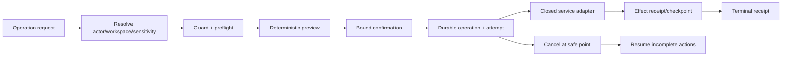

# Research Foundry Operator MCP

## Feature Brief & Metadata

**Feature name:** Research Foundry Operator MCP
**Date:** 2026-07-18
**Owner:** nick
**Tier / estimate:** Tier 3 / 29 points bottom-up
**Human brief:** `docs/project_plans/human-briefs/research-foundry-operator-mcp.md`
**Decisions block:** `.codex/worknotes/research-foundry-operator-mcp/decisions-block.md`

## 1. Executive Summary

Research Foundry has mature file-backed stage services and a partial agent-job
lifecycle, but no single governed MCP surface for local operator effects. This
feature adds a separate **Operator MCP** process for cost-bearing and mutating
operations. It is not an expanded Knowledge MCP: read-only catalog, source,
assertion, report, run, and lineage access remains in the Knowledge MCP package.

V1 uses local stdio and a closed tool registry. Every effect is preceded by
workspace/sensitivity resolution, governance guard/preflight, a deterministic
operation preview, and an opaque confirmation token bound to the exact action.
Long operations become durable attempts with bounded status, cancellation safe
points, resumable checkpoints, idempotent effects, and immutable terminal
receipts. Writeback is intentionally preview-only.

**Priority:** High

**Key outcomes:**

- An MCP-capable local agent can plan and operate RF only through named service adapters.
- A stale, replayed, cross-workspace, policy-changed, or payload-changed confirmation causes zero effects.
- Interrupted jobs can resume without duplicating completed effects.
- Writeback preview renders a governed candidate without touching external systems or downstream mirrors.

## 2. Context and Current State

### 2.1 Existing substrate

The implementation must reuse these current surfaces:

| Surface | Current capability | Operator-MCP implication |
|---|---|---|
| `services.planning.plan_run()` | Plans a run and writes brief/swarm/routing artifacts | Wrap after identity and confirmation gates |
| CLI `swarm run` | Dispatches adapters and writes source candidates inline in `cli_commands.py` | Extract canonical `swarm_service`; do not call Typer or shell |
| `services.source_cards.ingest_source()` | Creates source cards and conditionally materializes assertions | Resolve real workspace/sensitivity; do not reuse CLI's hard-coded default |
| `extract_run()`, `build_claim_ledger()`, `synthesize_report()`, `verify_report()`, `build_bundle()` | Canonical research stages | Register as closed job adapters with stage prerequisites |
| External Interchange P5 seam | Planned resumable packet importer and receipt contract | Consume only after its service gate lands |
| `AgentJobService` | Durable attempts, events, artifacts, poll, terminate, cleanup, status | Reuse, but close explicit workspace TODOs before exposure |
| `/api/agent-jobs` | Launch/status/events/cancel/accept HTTP surface | Do not route local MCP through HTTP; do not expose accept |
| Search Router MCP | Thin FastMCP stdio wrapper for search/extract | Reuse optional-dependency/stdio pattern, not its tool registry |
| `governance.preflight()` / `guard_check()` | Deterministic policy outcomes | Required before confirmation and execution |
| `audit_service.record_event()` | Append-only but intentionally fail-open | Supplemental; mandatory operator receipts carry effect truth |

### 2.2 Live gaps

- Agent-job create, spawn, cancel, and accept paths contain explicit future
  workspace-identity TODOs. They cannot be exposed as trusted operator tools as-is.
- CLI ingest resolves a hard-coded single-operator workspace; Operator MCP requires
  identity-derived workspace binding.
- Swarm dispatch lives inside a CLI command instead of a reusable service.
- The existing MCP server is Search-Router-specific and includes extraction; it is
  not a governed general operator surface.
- No confirmation-token protocol binds approval to canonical inputs, policy,
  workspace, sensitivity, and target.
- Current audit events cannot serve as effect receipts because audit delivery is
  intentionally fail-open.
- `services.writeback.writeback()` can perform real side effects; a pure preview seam
  does not yet exist.

## 3. Problem Statement

> As a local Research Foundry operator, when I let an MCP-capable agent advance a
> research run, I need each effect scoped, previewed, confirmed, replay-safe, and
> auditable instead of granting the agent a broad CLI/HTTP/shell surface whose
> workspace and side-effect boundaries are implicit.

The technical root cause is not missing business logic. It is missing privileged
transport and orchestration contracts around existing services.

## 4. Goals and Success Metrics

### Goal 1: Separate knowledge from operations

Operator MCP registers no general read/search/fetch resource tools. It exposes only
operation preview/lifecycle and the closed effects in §6. Knowledge MCP remains
independently deployable and read-only.

### Goal 2: Bind authority before effects

Actor, workspace, sensitivity, operation, canonical payload digest, idempotency key,
policy snapshot, target refs, and expiry are frozen before a confirmation token is
minted. Execution re-evaluates current policy and rejects drift.

### Goal 3: Make operations durable and recoverable

Each operation has a stable manifest and immutable action/effect receipts. Each
attempt uses existing AgentJob persistence. Cancel/resume acts at safe action
boundaries and converges with uninterrupted execution.

### Goal 4: Keep writeback non-executing

`writeback.preview` may validate and render a staged candidate. It cannot invoke an
integration client, downstream mirror, live push, approval, or publish action.

### Success metrics

| Metric | Baseline | Target | Measurement |
|---|---|---|---|
| Governed MCP operator tools | 0 | Closed inventory in §6 | Server tool introspection fixture |
| Cross-workspace effects | Unknown / unsafe TODOs exist | 0 | Two-workspace adversarial matrix |
| Duplicate effects on exact replay | No operator contract | 0 | Idempotency and effect-reconciliation fixtures |
| Conflicting confirmation execution | No confirmation protocol | 0 effects | Token/payload/policy/target mismatch fixtures |
| Resumed-operation drift | No shared contract | Byte-identical effect set and terminal result | Interrupted vs uninterrupted comparison |
| Writeback-preview external calls | No pure preview seam | 0 | Network/client spy |
| Unbounded error fields | No operator envelope | 0 | Schema and redaction tests |

## 5. Personas and Journey

### Primary persona: local RF operator

Chooses the local instance/workspace, reviews an exact operation preview, confirms a
bounded effect, monitors status, cancels or resumes, and inspects a durable receipt.

### Secondary persona: MCP orchestration agent

May request preflight, submit an authorized operation, and poll its own operation
receipts. It cannot invent tools, switch workspace, reuse confirmation for changed
inputs, execute writeback, or access Knowledge MCP data through this server.

### Reviewer / auditor

Can trace operation manifest -> confirmation binding -> attempts/events -> effect
receipts -> terminal receipt -> optional audit-event id without relying on console
text.

## 6. Tool Contract

### 6.1 Tool inventory

| Tool | Kind | Effect boundary | Confirmation |
|---|---|---|---|
| `operation.preflight` | synchronous policy/preview | No canonical effect | No |
| `run.plan` | asynchronous job | Run directory, brief, swarm plan, routing decision | Required |
| `swarm.start` | asynchronous job | Source-candidate artifact for an existing run | Required |
| `job.status` | bounded lifecycle read | None | No; bound operation access only |
| `job.cancel` | lifecycle mutation | Cancellation request/cleanup at safe point | Required |
| `job.resume` | lifecycle mutation | New attempt over incomplete manifest actions | Required |
| `external_report.import` | asynchronous job | ERI-governed staging/promotion effects | Required |
| `source.ingest` | asynchronous job | Source card and eligible forward materialization | Required |
| `run.extract` | asynchronous job | Extraction cards | Required |
| `run.claim_map` | asynchronous job | Claim ledger | Required |
| `run.synthesize` | asynchronous job | Draft/final report artifact per request | Required |
| `run.verify` | asynchronous governed result | Verification report/receipt; no downstream stage on failure | Required |
| `run.bundle` | asynchronous job | Evidence bundle after configured verify gate | Required |
| `writeback.preview` | asynchronous or bounded sync job | Staged preview artifact only | Required |

Tool names are closed. There is no `execute`, `shell`, `file`, `url.fetch`,
`provider.run`, `adapter.run`, `writeback.execute`, `agent-job.accept`, or wildcard tool.

### 6.2 Operation lifecycle

1. Canonicalize and schema-validate the requested operation.
2. Resolve actor and workspace from the trusted local identity source.
3. Resolve effective sensitivity as the strictest input/target/policy value.
4. Run capability, authorization, audit-health, guard, and preflight checks.
5. Build a bounded action preview and canonical digest.
6. Mint an opaque token bound to the preview and short expiry.
7. Re-submit the exact operation with token and idempotency key.
8. Atomically consume the token while writing the immutable operation manifest.
9. Execute actions through the named service adapter, persisting effect receipts and checkpoints.
10. Persist one terminal receipt and best-effort append-only audit event.

Exact replay returns the same terminal or in-progress operation reference. A changed
payload, target, identity, sensitivity, policy snapshot, or operation under the same
idempotency key returns `idempotency_conflict` and performs no new effect.

### 6.3 Cancellation and resume

- Cancel is a durable request, not only process termination.
- Atomic file publication and a service's documented indivisible transaction are
  non-cancelable; cancellation is observed at the next manifest action boundary.
- Completed effect receipts are immutable and never rolled back or replayed.
- Resume revalidates actor/workspace/current policy and requires new confirmation.
- Resume starts from the first incomplete action and records a new attempt linked to
  the stable operation id.
- If completed effects conflict with the current manifest, resume fails closed for
  manual review.

### 6.4 Bounded error envelope

Errors contain only `code`, safe `message`, `retryable`, `operation_id`, optional
`receipt_ref`, approved reason codes, and bounded field-validation details. Errors
never include raw exception strings, stack traces, secrets, environment values,
credentials, provider output, unrestricted paths, or unauthorized identifiers.

## 7. Requirements

### 7.1 Functional requirements

| ID | Requirement | Priority |
|---|---|---|
| OPM-FR-1 | Publish versioned operation, confirmation, receipt, and error schemas. | Must |
| OPM-FR-2 | Resolve trusted actor/workspace and effective sensitivity before object lookup or preview. | Must |
| OPM-FR-3 | Run authorization, audit-health, guard, and preflight before confirmation. | Must |
| OPM-FR-4 | Bind confirmation token to canonical operation inputs, identity, policy, targets, idempotency key, and expiry. | Must |
| OPM-FR-5 | Persist an immutable operation manifest before effects and immutable action/effect receipts afterward. | Must |
| OPM-FR-6 | Reuse AgentJob attempts/events/artifacts/status/termination without exposing accept. | Must |
| OPM-FR-7 | Support durable cancellation request and resume from the first incomplete action. | Must |
| OPM-FR-8 | Extract swarm dispatch from the CLI into a typed service used by CLI and MCP. | Must |
| OPM-FR-9 | Wrap only the canonical services named in §6.1; MCP handlers contain no business logic. | Must |
| OPM-FR-10 | Consume ERI's importer service/receipt contract; do not implement packet parsing in MCP. | Must |
| OPM-FR-11 | Enforce stage prerequisites and block downstream stages after verification failure. | Must |
| OPM-FR-12 | Add a pure writeback-preview service with zero live/client/mirror effects. | Must |
| OPM-FR-13 | Run as an optional-dependency FastMCP stdio server with a clear missing-SDK error. | Must |
| OPM-FR-14 | Emit bounded status, event, receipt, and error payloads with pagination/size limits. | Must |

### 7.2 Non-functional requirements

**Security and privacy**

- Fail closed on missing identity, workspace, policy, token binding, audit-health,
  schema, sensitivity, or target authorization.
- Apply no-existence-leak behavior to wrong-workspace operation/job/receipt refs.
- Secret-scan persisted previews, errors, events, and receipts; do not log tokens.
- No local stdio claim relaxes workspace or sensitivity requirements.

**Reliability**

- Canonical inputs and action ordering are deterministic.
- Operation/effect receipt writes use atomic publication and conflict detection.
- Process restart, timeout, cancel, or exact retry cannot duplicate completed effects.
- Verification failure is a governed terminal outcome, not an unhandled exception.

**Performance and limits**

- Operation inputs, action count, source count, import size, event page, error detail,
  runtime, and cost are bounded by schema/policy.
- Status polling never scans unrelated workspaces or unbounded event files.
- MCP server startup performs no network call or mutation.

**Compatibility**

- Existing CLI/service behavior remains unchanged when Operator MCP is disabled.
- New fields are additive; legacy AgentJob records remain readable.
- MCP optional dependency remains lazy and does not break base package import.

## 8. Scope

### In scope

- Local stdio FastMCP server and explicit tool registry.
- Identity/workspace/sensitivity, governance, confirmation, and bounded-error contracts.
- Durable operation coordinator reusing AgentJob attempts.
- Closed adapters listed in §6.1.
- Cancellation, resume, idempotency, effect receipts, terminal receipts, audit linkage.
- Pure writeback preview, focused tests, docs, CHANGELOG, and exact-tree reviews.

### Out of scope

- Knowledge MCP search/resources and general read-only retrieval.
- Remote transport, hosted service, LAN access, browser approval UI, OAuth, or API keys.
- Actual writeback, publish, share-token minting, agent-job accept, catalog promotion
  beyond the explicitly selected canonical service's own governed behavior.
- Arbitrary commands, files, paths, URLs, providers, adapters, plugins, schedules, or
  unattended multi-operation chains.
- Owner/private-corpus qualification, deployment, release, or external activation.

## 9. Dependencies and Assumptions

### Hard entry dependencies

| Dependency | Required contract |
|---|---|
| Research Provenance Continuity P1 | Stable context, activity, and receipt references |
| External Research Report Interchange P5 | Resumable import service with immutable receipts/checkpoints and Operator-MCP seam |
| Catalog-Assisted Research Planning P4 | Settled run planning/routing behavior and provenance envelope |
| Research Foundry Knowledge MCP | Approved read-only tool/resource names and non-overlap inventory |
| Search Router | Existing service and FastMCP stdio conventions |

### Assumptions

- The local subprocess launcher can supply a trusted configured actor/workspace
  identity; OPM-OQ-1 freezes the exact source.
- Existing service entrypoints remain the business-logic authority.
- AgentJob persistence is reusable for attempts after workspace-scoping gaps are
  closed; no public/remote endpoint is required.
- Private owner data is unavailable during repository implementation; synthetic
  fixtures do not qualify live operation safety or utility.

### Feature flags / enablement

- Operator MCP is opt-in and disabled unless explicitly launched.
- No server auto-start, daemon, LAN listener, or boot-time registration is added.
- Remote transport and writeback execution have no v1 flags because they do not exist.

## 10. Risks and Mitigations

| Risk | Severity | Mitigation |
|---|:---:|---|
| Caller-supplied workspace becomes authority | Critical | Trusted identity resolution before lookup; token/manifest workspace binding; two-workspace tests |
| Confirmation approves changed inputs | Critical | Canonical digest binding; short TTL; atomic single-use consumption; conflict tests |
| Cancel/resume duplicates effects | High | Action manifest, immutable effect receipts, safe points, exact reconciliation |
| MCP layer duplicates service logic | High | Thin adapters, direct-service parity tests, source scan for shell/arbitrary dispatch |
| Preview executes writeback | Critical | Pure preview seam, no execute tool, network/client/mirror spies and static call-path review |
| Audit event missing after effect | High | Mandatory primary operation receipt; audit health gate; explicit audit-delivery disposition |
| Error leaks sensitive data | High | Closed error schema, redaction, length limits, adversarial fixtures |
| Local stdio is mistaken for release readiness | Medium | Repository readiness and owner-authorized canary remain separate gates |

## 11. Target State

An operator launches one local stdio server for privileged RF actions and a separate
Knowledge MCP server for reads. An agent can request a bounded operation preview, but
cannot perform an effect without an exact short-lived confirmation. Each effect is
workspace-confined, sensitivity-governed, replay-safe, observable through job status,
cancelable at safe boundaries, resumable, and closed by an immutable receipt.

No v1 tool can issue a live writeback, accept arbitrary agent artifacts, execute a
shell command, or mutate through remote transport.

## 12. Acceptance Criteria

#### AC OPM-1: Preflight and confirmation bind exact authority

- target_surfaces:
    - schemas/operator_mcp_operation.schema.yaml
    - schemas/operator_mcp_confirmation.schema.yaml
    - src/research_foundry/services/operator_mcp_policy.py
- propagation_contract: Trusted actor/workspace, effective sensitivity, operation kind, canonical input digest, idempotency key, policy snapshot, targets, and expiry are frozen before token minting and revalidated before effect planning.
- resilience: Missing identity, denial, expiry, replay, changed payload, changed policy, changed sensitivity, or changed target produces zero operation manifest and zero canonical effect.
- visual_evidence_required: false
- verified_by: [OPM-6.2]

#### AC OPM-2: Workspace and sensitivity precede lookup and execution

- target_surfaces:
    - src/research_foundry/services/operator_mcp_policy.py
    - src/research_foundry/services/agent_job_service.py
    - src/research_foundry/services/source_cards.py
- propagation_contract: Identity-derived workspace and strictest effective sensitivity enter operation lookup, job access, canonical service adapters, events, receipts, and errors.
- resilience: Wrong-workspace or above-threshold references return one safe denial shape without object ids, counts, content, event timing, or filesystem detail.
- visual_evidence_required: false
- verified_by: [OPM-6.3]

#### AC OPM-3: Jobs are idempotent, cancelable, and resumable

- target_surfaces:
    - schemas/operator_mcp_receipt.schema.yaml
    - src/research_foundry/services/operator_operation_service.py
    - src/research_foundry/services/agent_job_service.py
- propagation_contract: Stable operation manifests create bounded attempts, persist immutable action/effect receipts, honor cancellation at safe points, and resume from the first incomplete action.
- resilience: Exact replay returns the prior operation; changed manifest conflicts; process loss or cancellation cannot replay a completed effect or fabricate a terminal success.
- visual_evidence_required: false
- verified_by: [OPM-6.4]

#### AC OPM-4: Closed tools delegate to canonical services

- target_surfaces:
    - src/research_foundry/services/operator_tool_adapters.py
    - src/research_foundry/services/swarm_service.py
    - src/research_foundry/operator_mcp/server.py
- propagation_contract: Each registered effect tool delegates through one named canonical service adapter and emits the common operation/receipt envelope.
- resilience: Unknown tool, provider, adapter, path, URL-fetch mode, or arbitrary command is schema-invalid and never dispatched.
- visual_evidence_required: false
- verified_by: [OPM-6.5]

#### AC OPM-5: Import and research stages preserve prerequisites and receipts

- target_surfaces:
    - src/research_foundry/services/operator_tool_adapters.py
    - src/research_foundry/services/external_research_import.py
    - src/research_foundry/services/verification.py
    - src/research_foundry/services/writeback.py
- propagation_contract: ERI import, ingest, extract, claim-map, synthesize, verify, and bundle adapters retain canonical service receipts, stage prerequisites, and provenance references in operation effects.
- resilience: Incomplete/quarantined import, missing stage input, or failed verification blocks dependent actions with a typed governed result and no false completion.
- visual_evidence_required: false
- verified_by: [OPM-6.6]

#### AC OPM-6: Writeback preview cannot execute or mirror

- target_surfaces:
    - src/research_foundry/services/writeback.py
    - src/research_foundry/services/operator_tool_adapters.py
    - src/research_foundry/operator_mcp/server.py
- propagation_contract: `writeback.preview` validates and renders a staged candidate under the operation staging root without invoking the live writeback function, integration clients, or downstream mirror paths.
- resilience: Unavailable targets, review-required sensitivity, missing bundle, or degraded integrations produce preview reason codes and zero external/mirror effect.
- visual_evidence_required: false
- verified_by: [OPM-6.7]

#### AC OPM-7: Transport, errors, and receipts stay bounded

- target_surfaces:
    - schemas/operator_mcp_error.schema.yaml
    - schemas/operator_mcp_receipt.schema.yaml
    - src/research_foundry/operator_mcp/server.py
- propagation_contract: Local stdio tools return schema-valid bounded operation, status, event, receipt, and error envelopes with explicit retry and audit-delivery dispositions.
- resilience: Missing MCP dependency gives one install hint; server startup performs no network call or mutation; internal exceptions are redacted and size-capped.
- visual_evidence_required: false
- verified_by: [OPM-6.8]

## 13. Open Questions

| ID | Question | Safe default |
|---|---|---|
| OPM-OQ-1 | What establishes local actor/workspace identity? | Explicit trusted local configuration; never request-body default |
| OPM-OQ-2 | Confirmation TTL and retry behavior? | Five minutes; consume with manifest; exact replay returns receipt |
| OPM-OQ-3 | One confirmation per stage or a confirmed chain? | One per operation; chain requires one complete bounded manifest preview |
| OPM-OQ-4 | Which actions are cancellation safe points? | Between manifest actions; atomic publication is non-cancelable |
| OPM-OQ-5 | Which AgentJob fields can be reused without provider semantics? | Reuse attempts/events/artifacts/status; operation manifest owns effect semantics |
| OPM-OQ-6 | Must degraded audit health block each effect? | Yes before confirmation; primary receipt remains mandatory |
| OPM-OQ-7 | Where is writeback preview staged? | Operation staging root only |
| OPM-OQ-8 | How is verification failure represented? | Completed governed denial/result; downstream action blocked |

## 14. Implementation Outline

| Phase | Outcome | Dependency |
|---|---|---|
| P1 | Freeze operation, identity, confirmation, error, guard, and receipt contracts | RPC P1 + Knowledge MCP namespace contract |
| P2 | Build durable operation coordinator over AgentJob attempts | P1 |
| P3 | Add plan/swarm/job lifecycle adapters and reusable swarm service | P2 + CARP P4 |
| P4 | Add ERI import and canonical research-stage adapters | P3 + ERI P5 |
| P5 | Expose local stdio server and pure writeback preview | P4 + Knowledge MCP boundary |
| P6 | Adversarial recovery/security gates, docs, deferred specs, exact-tree review | P5 |

Detailed tasks, estimates, agent/model routing, dependencies, deferred work, and
validation commands live in the linked unified implementation plan.

## 15. Reviewer and Documentation Gates

- `task-completion-validator` reviews each phase on its exact current tree.
- `karen` reviews P2 lifecycle semantics, P4 integrated mutations, and final Tier 3 closeout.
- Security review is mandatory for P1 identity/confirmation and P5 preview-only proof.
- Any material schema, policy, tool-registry, receipt, generated contract, or docs fix
  invalidates the relevant approval.
- Documentation covers local setup, tool inventory, confirmation flow, job lifecycle,
  cancellation/resume, errors, receipts, preview-only writeback, and troubleshooting.
- CHANGELOG `[Unreleased]` is required because the feature adds a user-facing operator surface.
- Repository readiness, owner-held canary, deployment, release, and remote/writeback
  authorization remain separate states.
