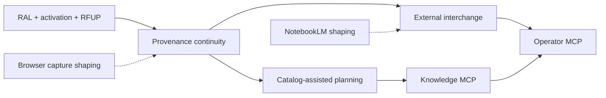

# Research Interchange, Provenance, and Agent Access

> Umbrella epic only. Child PRDs and implementation plans own feature behavior,
> estimates, task breakdowns, and execution evidence. This document owns package
> boundaries, dependency order, shared invariants, and promotion gates.

## 1. Executive Summary

Research Foundry already provides a deterministic research pipeline, durable run
artifacts, passage-bound assertions, catalog search, verification, and several
integration surfaces. The remaining platform gap is continuity: evidence acquired
outside the canonical run flow can lose origin context; discovery receipts are not
uniformly represented as run evidence; run launch does not yet make governed catalog
retrieval a first-class pre-discovery step; and agent access is fragmented between
CLI, HTTP, and a Search-Router-only MCP server.

This epic coordinates five independent feature packages. It deliberately references
the existing RAL, assertion-ledger activation, and RFUP families instead of widening
or restating them.

**Priority:** High

**Locked planning estimate:** 169 points. This is the sum of current child
H1-H6 totals—40 + 38 + 28 + 34 + 29—with no package discount. Each child
human brief remains the estimate authority for its owned work.

## 2. Current-State Boundary

The following are treated as existing substrate, not new scope:

- Reusable Assertion Ledger owns immutable editions, exact passages, source
  assertions, evaluation provenance, catalog/search, reuse decisions, refresh and
  impact handling, reviewer experience, and private-rollout hardening.
- Assertion-ledger activation owns population and reachability through historical
  backfill, forward ingest, reuse flags, and merge-UI activation.
- RFUP owns machine-contract stamping, exact-passage verification mode, governed
  URL/PDF extraction, council result normalization, run sealing/lineage, and Path-B
  workflow parameterization.
- The existing NotebookLM plan records the earlier integration approach; its command
  assumptions and runtime qualification must be refreshed in a shaping design spec,
  not silently copied.

The new work is confined to continuity between those surfaces and new governed entry
or access paths.

## 3. Authority and Trust Model

### 3.1 Authoritative records

Structured provenance records are authoritative. At minimum, an authoritative
evidence path resolves:

```text
origin envelope
  -> acquisition or import receipt
  -> immutable source edition
  -> exact passage
  -> source assertion and evaluation
  -> claim or explicitly labeled inference
  -> report-use edge
```

Tags, topics, project labels, vendor names, and other facets are derived views. They
may improve retrieval, but they cannot replace the structured origin, edition,
passage, and lineage records.

### 3.2 External research truth boundary

An external report, model answer, notebook synthesis, or browser annotation is not a
verified RF claim merely because it contains citations. Imported prose enters as one
of:

- platform synthesis,
- assertion candidate,
- annotation,
- or explicitly labeled inference.

Promotion requires the original source to be re-fetched or otherwise bound to an
immutable edition, the cited passage to be resolved exactly, and RF verification to
accept the resulting claim relationship. A missing, inaccessible, or drifting source
remains quarantined with a machine-readable denial reason.

## 4. Child Workstreams

| Order | Child slug | Tier / locked estimate | Ownership boundary | Depends on |
|---:|---|---:|---|---|
| 1 | `research-provenance-continuity` | Tier 3 / 40 pts | Canonical origin/run/activity envelopes, search-only discoverability, exact scope/selection receipts, optional AOS refs, inference/canonical-claim/report-use materialization | RAL, activation, RFUP |
| 2 | `external-research-report-interchange` | Tier 3 / 38 pts | Vendor-neutral handoff, inert vendor-data boundary, hard SSRF-safe acquisition prerequisite, immutable receipts, exact resolution, quarantine, resumability | Workstream 1 `RPC-1.G` |
| 3 | `catalog-assisted-research-planning` | Tier 3 / 28 pts | Governed pre-discovery retrieval, deterministic selection/denial receipt, freshness/revalidation, gap routing | Workstream 1 `RPC-1.G`; RAL catalog; activation |
| 4 | `research-foundry-knowledge-mcp` | Tier 3 / 34 pts | Exact schema-aligned core DTOs/dual encoding, RF-only extensions, non-writing projections, independent stdio process/registry/settings/credentials/inventory | Workstreams 1 and 3 exact-tree gates |
| 5 | `research-foundry-operator-mcp` | Tier 3 / 29 pts | Governed plan/swarm/import/verify/bundle/job mutations with idempotency, confirmation, and guard gates | Workstreams 2-4; existing auth/governance seams |
| shaping | `notebooklm-research-foundry-refresh` | No execution tier yet | Refresh integration assumptions and define promotion gates | Workstream 2 interchange contract |
| shaping | `browser-research-capture-extension` | No execution tier yet | MV3 capture envelope and native-messaging boundary; capture first, promote later | Workstream 1 origin envelope |

### Expected child artifact paths

Each execution workstream is expected to own:

- `docs/project_plans/PRDs/enhancements/<child-slug>-v1.md`
- `docs/project_plans/implementation_plans/enhancements/<child-slug>-v1.md`
- `docs/project_plans/human-briefs/<child-slug>.md`
- `.codex/worknotes/<child-slug>/decisions-block.md`

This epic does not create progress files. Progress is initialized only when a child
plan is approved for execution.

## 5. Dependency and Execution Order



### Wave 0: Contract confirmation

- Reconcile child boundaries against current code and the referenced plans.
- Lock the origin envelope, receipt identifiers, denial vocabulary, and canonical run
  envelope before any importer or MCP schema is committed.
- Keep NotebookLM and browser capture at `maturity: shaping`; neither is an entry
  criterion for the core child sequence.

### Wave 1: Provenance continuity

`research-provenance-continuity` lands first because every later package consumes its
origin, receipt, and report-use contracts. This wave must not change RAL identity or
verification semantics without a separately reviewed amendment to the RAL family.

### Wave 2: Import and planning

`external-research-report-interchange` and `catalog-assisted-research-planning` may
proceed in parallel after the Wave-1 contracts stabilize. They must serialize any
changes to source-card, assertion-registry, run-launch, or CLI barrier files.

### Wave 3: Read-only agent access

`research-foundry-knowledge-mcp` may begin only after the retrieval and provenance
response contracts are stable. It is a separate OS process with its own registry,
entry point, settings/credential allowlist, dependency boundary, and inventory; it
does not extend or import the Search Router registry. Only governed read services are
shared. Local v1 is schema-aligned, not OpenAI/ChatGPT-compatible.

### Wave 4: Privileged operator access

`research-foundry-operator-mcp` is last. Local stdio is the first supported transport.
Remote mutation remains deferred pending explicit promotion gates in Section 8.

## 6. Shared Requirements

### 6.1 Provenance continuity

- Every acquisition or import attempt receives a stable receipt identifier.
- Discovery and search activity intended to influence a report is attached to a
  canonical run envelope, including degraded and denied outcomes.
- Inference and canonical-claim materialization preserve their source-assertion basis;
  neither may collapse into a plain text tag or untyped relation.
- Report-use edges identify the report artifact, claim, location or anchor, and source
  assertion lineage needed for later refresh or invalidation.
- AOS context references are references, not duplicated context payloads, unless a
  sealed snapshot is explicitly required by the child contract.

### 6.2 External interchange

- `external_research_handoff/v1` contains `handoff.yaml`, `report.md` with
  `platform_synthesis`, `sources.yaml`, `assertion_candidates.yaml`, and optional
  activity or attachments.
- Import is idempotent and resumable; replaying the same immutable packet produces the
  same receipt and no duplicate authoritative records.
- Completeness tiers distinguish locator-only, source-resolved, passage-resolved, and
  verified material.
- Candidate quarantine is fail-closed and retains structured reasons for unresolved,
  conflicting, sensitive, or unverifiable material.
- Before any RFUP network effect, acquisition rejects unauthorized local/file,
  loopback/private/reserved/link-local/metadata, DNS-rebinding, and redirect-pivot
  targets and validates the connected peer. Every vendor field remains inert data and
  cannot become a prompt, tool description, route/control value, command, or schema selector.

### 6.3 Catalog-assisted planning

- Catalog retrieval runs before paid or external discovery when policy permits.
- Selection and denial are deterministic for the same inputs, policy, and catalog
  snapshot, and produce a receipt suitable for audit.
- Freshness, rights, sensitivity, evaluation, and workspace eligibility remain hard
  inputs to reuse.
- Coverage gaps route to bounded discovery rather than being silently treated as
  evidence absence.

### 6.4 Agent access separation

- Knowledge MCP tools are read-only and local-stdio-first in an independent
  process/registry/entrypoint/settings/credential/inventory boundary; only governed
  read services are shared with the application.
- Core `search(query)` and `fetch(id)` have exact DTOs and identical
  `structuredContent` plus canonical-JSON text encoding. Filters, paging, receipts,
  and typed reads use separately named `rf_*` tools.
- Operator MCP tools are cost-bearing or mutating and require guard, confirmation,
  idempotency, and human-review behavior appropriate to the underlying command.
- No remote tool returns filesystem paths as canonical resource identifiers; remote
  promotion requires canonical HTTPS URLs and a documented workspace/auth model.
- Local loopback URLs are explicitly non-canonical and do not support an
  OpenAI/ChatGPT compatibility claim. True compatibility requires a reachable
  canonical HTTPS profile promoted through remote transport, canonical URL, and
  cache-isolation shaping specs.
- Search-only activity becomes observable through the canonical run or activity
  envelope instead of remaining invisible to run-level provenance.

## 7. Design-Spec Boundaries

### NotebookLM refresh

The design spec must record that the existing NotebookLM integration is
`offline-unvalidated`, the local NotebookLM CLI is not currently available, and the
current skill syntax is `notebooklm source add` rather than the older `add-source`
form. Manual deterministic export is the first supported path. Any unofficial API
track requires a pinned dependency, canary qualification, and rollback path.

### Browser research capture

The design spec should prefer Manifest V3 `activeTab` permission plus native messaging
over broad persistent browsing permissions. The first promoted capability is a capture
envelope written to staging. Promotion into source cards or assertions is a later,
explicit action governed by the provenance and interchange contracts.

## 8. Initiative Promotion Gates

### Gate G1: Contract authority

- Origin, receipt, run-envelope, completeness-tier, and denial schemas have one owner.
- Child plans reference the schemas rather than redefining equivalent fields.
- Tags are documented as derived facets.

### Gate G2: Evidence trust

- External candidate fixtures cannot become supported claims without immutable
  edition and exact-passage bindings.
- Source drift, missing source, citation mismatch, and sensitivity denial fixtures
  remain quarantined with stable reason codes.

### Gate G3: Reuse safety

- Catalog selection fixtures cover stale, retracted, rights-denied, workspace-denied,
  low-evaluation, partial-coverage, and eligible assertions.
- A deterministic gap receipt triggers discovery only for the uncovered scope.

### Gate G4: Read-only access

- Knowledge MCP has no filesystem mutation, job launch, import, bundle approval, or
  writeback tool.
- Local stdio tests prove the exact eight-tool inventory, independent process/import/env
  and credential boundary, query/id-only core schemas, dual-encoding equality,
  RF-only pagination/filters/receipts, sensitivity filtering, and stable local IDs.
- Docs and configuration label local v1 schema-aligned and local/non-canonical. Remote
  compatibility stays blocked until canonical HTTPS live qualification.

### Gate G5: Operator access

- Every operator tool maps to an existing governed service or CLI contract.
- Retry tests prove idempotency; destructive or costly operations require explicit
  confirmation; exit-code-7 human-review behavior remains intact.
- Remote mutations remain absent until auth, workspace isolation, canonical HTTPS
  resources, audit logging, rate limits, and approval policy pass an explicit future
  review.

### Gate G6: Exact-tree review

- Each Tier-3 child receives `task-completion-validator` review at every phase.
- Karen reviews the contract milestone, integration milestone, and exact final tree.
- Repository-readiness evidence is not described as live integration qualification.

## 9. Decisions

| ID | Decision | Rationale |
|---|---|---|
| D1 | This parent is an epic PRD with no monolithic implementation plan. | The five packages have distinct trust boundaries, estimates, and reviewer gates. |
| D2 | Structured provenance is authoritative; tags are derived facets. | Facets aid discovery but cannot carry immutable origin or passage identity. |
| D3 | External prose remains synthesis or candidate material until exact verification. | Prevents citation laundering and preserves RF's claim-ledger authority. |
| D4 | Extend RAL and RFUP seams; do not create parallel registries or verifiers. | Those packages already own the durable evidence and verification contracts. |
| D5 | Split Knowledge MCP from Search Router and Operator MCP at the OS process, registry, entrypoint, settings/credential, dependency, and inventory layers; share governed read services only. | Read-only retrieval and cost-bearing/privileged operations require independently auditable least-privilege processes. |
| D6 | Local stdio precedes remote MCP. | It avoids prematurely coupling access design to unresolved multi-user auth and URL identity. |
| D7 | Browser capture stages an origin envelope before any promotion. | Capture is evidence intake, not automatic claim creation. |
| D8 | NotebookLM begins with manual deterministic export. | The prior plan is unqualified live and current CLI/API availability is unresolved. |

## 10. Risks and Mitigations

| Risk | Impact | Likelihood | Mitigation |
|---|---:|---:|---|
| Parallel provenance schemas emerge | High | Medium | G1 schema authority gate and parent-owned dependency order |
| Importer treats synthesis as evidence | Critical | Medium | Candidate quarantine plus G2 exact-passage fixtures |
| Catalog reuse launders stale evidence | High | Medium | Freshness/retraction/rights/workspace checks and gap receipts |
| Search-only actions remain unaudited | High | High | Canonical activity/run envelope in continuity child |
| Read and cost/mutation tools share process, registry, credentials, or policy | Critical | Medium | Independent Knowledge process/import/settings/inventory boundary; shared governed reads only |
| Remote mutation ships before auth is credible | Critical | Low | Explicit deferral and G5 absence tests |
| NotebookLM plan repeats stale commands | Medium | High | Shaping spec checks installed CLI and current skill syntax |
| Browser extension requests excessive permissions | High | Medium | MV3 activeTab-first design and native-host allowlist |
| Child estimates are compressed to fit the epic | High | Medium | Child H1-H6 briefs; 169-point H4 sum is the locked planning floor |

## 11. Epic Acceptance Criteria

- [ ] The epic links one PRD, implementation plan, human brief, and decisions block
  location for each child workstream.
- [ ] Every child names RAL, assertion-ledger activation, and RFUP as reused or
  excluded substrate where relevant.
- [ ] Provenance-continuity contracts land before importer, catalog-planning, or MCP
  code consumes them.
- [ ] A fixture external handoff remains candidate-only until source edition and
  exact passage resolution pass.
- [ ] A fixture catalog query yields a reproducible selection or denial receipt and
  routes uncovered scope to discovery.
- [ ] Knowledge MCP exposes exact core/dual-encoded and RF-extended reads in its own
  process/registry/settings/credential/inventory boundary with no mutation/provider
  tools, while Operator MCP exposes only explicitly governed operations.
- [ ] Local Knowledge MCP is labeled schema-aligned only; any OpenAI/ChatGPT compatibility
  claim cites a reachable canonical HTTPS remote profile and its three promoted specs.
- [ ] Operator MCP preserves guard, confirmation, idempotency, and human-review gates.
- [ ] NotebookLM and browser artifacts remain shaping design specs until their stated
  promotion gates pass.
- [ ] Child plans keep implementation files below 800 lines and use phase breakouts if
  necessary.
- [ ] Artifact schema validation, AC dry coverage, link checks, line counts, and
  `git diff --check` pass before any child is approved.

## 12. Open Questions

| ID | Question | Owner | Blocks |
|---|---|---|---|
| OQ-E1 | Is the canonical activity envelope a run subtype or a sibling acquisition-session artifact? | provenance child | G1 |
| OQ-E2 | Which report anchor is stable enough for report-use edges after Markdown edits? | provenance child | G1/G2 |
| OQ-E3 | What packet hash inputs exclude transport-only metadata while preserving idempotency? | interchange child | G2 |
| OQ-E4 | Which completeness tier is the minimum for catalog planning reuse? | catalog child | G3 |
| OQ-E5 | Which knowledge resources need cursor pagination in separately named `rf_*` tools? | knowledge MCP child | G4 |
| OQ-E6 | Which operator commands require typed confirmation versus exit-code-7 review? | operator MCP child | G5 |
| OQ-E7 | What reachable canonical HTTPS profile, URL namespace, and cache isolation would qualify future hosted compatibility? | knowledge MCP shaping specs | future remote promotion |

## 13. Child Handoff and Documentation Gate

Before approval, each child must own exactly one Section-4 boundary, cite runtime
seams and reused plan families, include a decisions block and H1-H6 human brief,
declare deferred items and integration ownership, use dependency/model/effort task
tables, and map observable acceptance criteria to verification tasks. Plans must also
evaluate CHANGELOG, user/dev docs, architecture contracts, Research Foundry skills,
MCP tool inventories, and run-export schema updates. Progress files remain absent
until execution is authorized. Integration maturity uses the truthful labels
`shipped-enforced`, `shipped-advisory`, `experimental`, `offline-unvalidated`, and
`gap`.

## 14. References

Planning anchors are enumerated in `related_documents`. Child code grounding starts
from the existing source-card, assertion registry/materializer/catalog, run-launch,
Search Router/MCP, and verifier services; child plans must cite exact symbols after
their implementation-time live-evidence pass.
**Status:** Draft. No child execution is authorized by this epic.
