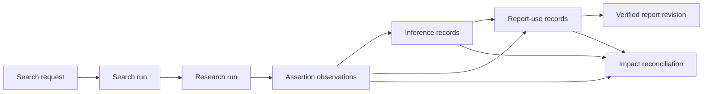

# Feature Brief & Metadata

**Feature Name:**

> Research Provenance Continuity

**Filepath Name:**

> `research-provenance-continuity-v1`

**Date:**

> 2026-07-18

**Author:**

> Codex planning worker under delegated orchestration

**Related Documents:**

> - RAL PRD/plan: durable source-edition, passage, assertion, catalog, reuse, and lifecycle foundations.
> - Assertion-ledger activation PRD/plan: real write, backfill, forward-ingest, and explicit reuse reachability.
> - RFUP PRD: upstream machine-contract, exact-passage, extraction, and run-seal work; this PRD does not repeat RFUP.
> - Catalog-assisted planning PRD/plan: consumer of the continuity envelope; owns retrieval selection and residual discovery.

---

## 1. Executive Summary

Research Foundry can now persist passage-bound source assertions, search a
governed assertion projection, populate the ledger from real runs, and evaluate
an explicitly supplied assertion before run launch. The lineage stops short of
continuous research provenance: `search_run` embeds an opaque request, run
launch does not persist a normalized selected-evidence envelope, the assertion
catalog hard-codes `report_uses: []`, and the shipped `inference_record` schema
has no runtime producer.

This feature adds the missing continuity layer. It owns one structured canonical
origin envelope plus rebuildable origin facets; one canonical planned/search-run
envelope that makes search-only activity discoverable; immutable activity and
selection receipts; optional references to AOS project, intent, and knowledge
objects; and durable inference, canonical-claim, and verified-report-use
materialization. It extends existing RAL and activation seams; it does not
rebuild the registry, materializer, catalog, retrieval policy, or activation
drivers.

**Priority:** HIGH

**Key Outcomes:**

- An auditor can start from a report revision and resolve every durable assertion/inference version used.
- An agent can carry evidence-selection provenance through search, launch, synthesis, verification, export, and lineage reads.
- Assertion lifecycle changes can enumerate affected inference/canonical-claim/report-use records instead of relying on permanently empty projection fields.
- An operator can discover a search activity even when it never became a planned research run, and can distinguish canonical origin/run/receipt records from derived facets.

---

## 2. Context & Background

### Current State: Proven Foundations

- `assertion_registry.py` persists workspace-isolated source editions and deterministic passages.
- `assertion_materialization.py` writes immutable source assertions, evaluations, and run observations; it only accepts `supported` source-claim candidates and writes `persistent_references` back to the run-local claim ledger.
- `assertion_catalog.py` rebuilds a governed lexical projection and returns exact assertion, passage, edition, rights, evaluation, and run-use data.
- `assertion_impact.py` already recognizes `inference` and `report_revision` as dependent object classes for stale propagation.
- `run_launch.py` exposes an opt-in `reuse_assertion` decision seam and intentionally does not drive discovery.
- `verification.py` requires inference bases and report labeling at the run-local claim level.
- `inference_record.schema.yaml` already defines durable inference identity, exact source-assertion refs, producer reasoning, and lifecycle status.

### Live Gaps

1. `AssertionCatalog._build_records()` derives `run_uses` from observations but sets `report_uses` to an empty list for every packet.
2. No service under `src/research_foundry` writes a durable `inference_record`; the schema is validated only through schema fixtures.
3. The claim ledger permits `persistent_references.inference_id`, but source materialization only populates edition, passage, assertion, and assertion-version fields.
4. Search request/run schemas permit loose correlation fields, while `search_run` stores the request as an untyped object; no normalized evidence-selection or parent-run lineage is required.
5. `LaunchRunRequest` can accept one caller-supplied assertion object, but the decision and exact evidence version are not a general continuity contract for downstream brief, swarm, report, and export stages.
6. General catalog report/claim links are rebuildable run-local projections. They do not substitute for immutable report-revision-to-assertion/inference use records.
7. Imported, captured, and generated artifacts expose ad hoc origin fields, so producer, method, acquisition, and source-kind context cannot be reconstructed consistently.
8. Search-only activity can disappear from run-oriented discovery, and no canonical envelope requires query purpose, provider/site/corpus/filter/time scope, or the selection/denial receipt.
9. Optional AOS project/intent/knowledge references have no governed continuity slot, and canonical-claim/report-use materializers are not consistently reachable from provenance-bearing runtime paths.

### Existing Plans This PRD Extends

| Existing package | Already owns | This PRD adds |
|---|---|---|
| Reusable Assertion Ledger (RAL) | Schemas, registry, materializer, assertion projection/API, reuse/impact foundations | Runtime producers and durable use records for report/inference continuity |
| Assertion Ledger Activation | Historical backfill, forward writes, explicit reuse reachability, merge UI activation | Provenance propagation after evidence is selected and when reports/inferences are created |
| RFUP | Machine schema stamping, exact-passage verification, PDF extraction, council normalization, run seal, workflow parameterization | Cross-stage evidence-use lineage; no RFUP requirement is reimplemented |
| Catalog-Assisted Research Planning | Governed retrieval-before-discovery and residual-gap planning | The normalized provenance envelope and durable lineage that planning must emit/consume |

---

## 3. Problem Statement

> As a research operator, when a report reuses evidence from prior runs or derives an inference, I can inspect run-local claim links but cannot reliably prove which immutable assertion versions the report revision used or carry that selection lineage from search/launch through verification and export.

**Technical Root Causes:**

- Durable source-observation identity stops at run-local claim usage.
- Report-use and inference object contracts exist conceptually or in schema but lack production write paths.
- Search and run-launch transport fields are additive and loose rather than one normalized, validated provenance context.
- Derived catalogs can show run-local relationships, but rebuildable rows cannot establish canonical report-use history.

---

## 4. Goals & Success Metrics

### Goal 1: Continuous Correlation Envelope

Add a versioned, optional provenance context that links a canonical origin,
search activity or planned run, selected assertion versions, optional AOS
project/intent/knowledge references, and later report revision. Legacy requests
remain valid and legacy readers tolerate the field's absence.

### Goal 2: Canonical Origin, Run, and Receipt Records

Persist a structured origin envelope and canonical planned/search-run envelope.
Make search-only runs discoverable and retain exact query/purpose,
provider/site/corpus/filter/time scope, candidate-selection, denial, and
degraded/fallback receipts. Treat all flattened origin/search facets as derived
and rebuildable.

### Goal 3: Durable Report Uses

Persist immutable, workspace-scoped report-use records only after evidence references and report content/revision identity validate. Rebuild `report_uses` from those records.

### Goal 4: Durable Inference and Canonical-Claim Lineage

Materialize inference records separately from source assertions, with exact
source-assertion inputs, reasoning producer metadata, and deterministic
identity/version rules. Materialize optional canonical-claim versions through a
separate typed path; never imply that semantic merge occurred merely because an
inference or report-use record exists.

### Goal 5: Lifecycle Continuity

Feed report revisions and inferences into the existing impact enumeration/reconciliation flow so stale or invalidated source evidence cannot remain silently current downstream.

### Success Metrics

| Metric | Baseline | Target | Measurement |
|---|---|---|---|
| Assertion packets with real report uses when applicable | `report_uses` always empty | 100% of fixture reports with durable use records enumerate exact revision IDs | Focused projection/API tests |
| Durable inference production | No runtime writer | 100% of eligible fixture inference claims produce schema-valid records; ineligible inputs fail closed | Unit + integration fixture matrix |
| Correlation continuity | Loose/optional IDs with no normalized selected-evidence contract | One additive envelope survives search/run/synthesis/export round trip | Contract round-trip test |
| Search-only discoverability | Search activity is only reliably visible through run-local artifacts | Every accepted search activity has a governed discoverable envelope even when `planned_run_id` is absent | Search-only create/list/fetch tests |
| Origin authority | Ad hoc origin fields and facets | One canonical origin envelope; derived facets rebuild identically after deletion | Origin rebuild test |
| Search/activity receipts | Query and selection context is incomplete or scattered | Exact query/purpose/provider/site/corpus/filter/time and selection/denial receipt round trips | Positive/negative receipt matrix |
| Lifecycle impact coverage | Object classes named but not all produced | Fixture invalidation enumerates and marks affected inference/canonical-claim/report records stale | Reconciler interruption/replay tests |
| Legacy compatibility | Existing clients omit new fields | Existing launch/search/export fixtures preserve prior key behavior when envelope absent | Before/after contract snapshots |

---

## 5. Personas & Journeys

### Research Operator

Needs to explain what evidence a report used, which versions were current at verification, and what became stale later.

### Synthesizing Agent

Needs a validated mechanism to cite selected source assertions and record separately derived conclusions without presenting inference as source evidence.

### Auditor / Reviewer

Needs a report-revision-first lineage read that resolves to exact assertion or inference versions without exposing cross-workspace existence signals.

### High-Level Flow

---

## 6. Requirements

### 6.1 Functional Requirements

| ID | Requirement | Priority | Notes |
|---|---|---|---|
| RPC-FR-1 | Define a canonical structured origin envelope for acquisition/import/capture/generation method, producer/tool, source kind, source locator/digest, workspace, timestamps, and parent origin refs. | Must | Flattened origin fields are compatibility aliases or derived facets, never parallel authority. |
| RPC-FR-2 | Define one canonical planned/search-run envelope with activity kind, request/activity/run IDs, workspace, parent refs, optional planned-run ref, and optional AOS project/intent/knowledge refs. | Must | Search-only activity remains valid and discoverable when no planned run exists. |
| RPC-FR-3 | Persist immutable activity receipts for exact query, purpose, provider, site, corpus, filters, time window, candidate-set digest, selected evidence versions, and denial/degraded/fallback outcomes. | Must | Preserve supplied values; do not infer provider/site/corpus scope from returned text. |
| RPC-FR-4 | Validate origin/run/receipt fields at each transport boundary and preserve unknown legacy absence as `None`/omitted rather than inventing identifiers. | Must | No synthetic backfill IDs or fabricated AOS refs. |
| RPC-FR-5 | Derive searchable origin/run facets only from canonical envelopes and prove delete/rebuild parity. | Must | Facets and catalog rows remain non-authoritative. |
| RPC-FR-6 | Persist immutable report-use records bound to a verified report revision digest and exact assertion/inference/canonical-claim versions. | Must | Canonical file-backed record; projection remains derived. |
| RPC-FR-7 | Reject report-use publication for missing, cross-workspace, rights-denied, stale, invalidated, or version-mismatched inputs. | Must | No existence-derived details in denials. |
| RPC-FR-8 | Produce schema-valid durable inference records from eligible run-local inference claims whose bases resolve to exact persistent assertion refs. | Must | Do not transform source assertions into inference records. |
| RPC-FR-9 | Record inference producer, reasoning method/summary, version, status, and exact source-assertion inputs. | Must | Reuse the existing inference schema unless Phase 1 proves an additive field is necessary. |
| RPC-FR-10 | Materialize optional canonical-claim versions only through the canonical-claim contract and attach exact assertion/inference support refs. | Must | No implicit semantic merge; absence of canonicalization remains explicit. |
| RPC-FR-11 | Populate claim-ledger persistent inference/canonical-claim references only after the corresponding durable write succeeds atomically. | Must | Replay must be deterministic. |
| RPC-FR-12 | Rebuild assertion packet report uses, inference lineage, canonical-claim lineage, and origin/run facets from canonical records. | Must | Projection deletion/rebuild cannot lose lineage. |
| RPC-FR-13 | Extend governed discovery/API/export shapes additively with search-only activities, origin/run receipts, report-use, inference, and canonical-claim lineage. | Must | Missing fields remain safe for old artifacts. |
| RPC-FR-14 | Enumerate inference, canonical-claim, and report-revision dependents in assertion-impact manifests and preserve interruption/resume semantics. | Must | Reuse existing manifest/receipt machinery. |
| RPC-FR-15 | Emit safe counts/reason codes for created, skipped, denied, stale, and legacy-unresolved records. | Should | No assertion text, locator, or hidden counts in denied telemetry. |
| RPC-FR-16 | Provide deterministic repair/rebuild commands or service entry points for derived projections only; canonical record mutation stays governed and append-only. | Should | No new general CRUD API. |

### 6.2 Non-Functional Requirements

**Security and Privacy**

- Resolve workspace scope before reading candidate records.
- Perform rights/lifecycle filtering before counts, facets, cursors, or use-record construction.
- Return typed reason codes without hidden assertion/report identifiers for denials.
- Preserve the assertion-only private boundary; no public federation, shared vector index, or cross-workspace graph is introduced.

**Integrity**

- Use deterministic canonical JSON digests and atomic immutable writes consistent with the registry/materializer patterns.
- Bind report uses to exact report content/revision identity and exact evidence versions.
- Bind origin, run, and activity receipts to canonical artifact/request digests and preserve the distinction between canonical envelopes and rebuildable facets.
- Fail closed on partial records, duplicate/mismatched action identities, path substitution, or replay conflicts.

**Compatibility**

- New fields are optional for historical artifacts and legacy API clients.
- No run-local claim ID, source card ID, or current RAL identifier is renamed.
- Existing search/run launch behavior is unchanged when provenance context is absent.
- Optional AOS refs are opaque governed identifiers; this feature neither copies AOS payloads nor makes AOS availability mandatory.

**Performance**

- Projection rebuild remains bounded by workspace artifacts and deterministic ordering.
- Report-use/inference writes do not add external network calls.
- No vector, embedding, or graph traversal service enters the request path.

---

## 7. Scope

### In Scope

- Canonical structured origin envelope plus derived/rebuildable origin facets.
- Canonical planned/search-run envelope, including discoverable search-only activity.
- Immutable query/purpose/provider/site/corpus/filter/time and selection/denial/degraded receipts.
- Optional AOS project/intent/knowledge references carried as references only.
- Durable report-use record contract and materializer.
- Runtime inference-record production from resolvable inference claims.
- Optional canonical-claim materialization from exact assertion/inference support refs.
- Assertion catalog/API/export lineage population.
- Existing impact-manifest integration for inference/canonical-claim/report revision records.
- Focused CLI/service repair or rebuild commands for projections.
- Synthetic and repository-local fixture validation, OpenAPI/type regeneration, and documentation.

### Out of Scope

- Replacing RAL source assertion identity, registry, passage segmentation, or source materializer.
- Historical assertion backfill or forward-ingest activation work already owned by assertion-ledger activation.
- Automatic catalog retrieval, evidence ranking, query decomposition, or residual discovery; those belong to catalog-assisted planning.
- Automatic semantic claim merging; v1 only materializes an explicitly requested canonical-claim version through the existing optional contract.
- Public federation, shared indexes, vector retrieval, or cross-workspace search.
- External writeback activation or owner-held private-corpus execution.
- RFUP machine schema versioning, PDF extraction, exact-passage mode, run sealing, or workflow parameterization.

---

## 8. Dependencies & Assumptions

### Internal Dependencies

- RAL source-edition/passage/assertion schemas and shipped registry/materializer/catalog services.
- Assertion-ledger activation forward writes and opt-in reuse reachability.
- Existing `inference_record` and `assertion_lifecycle_event` schemas.
- Existing report anchors, verification checks, export redaction, workspace scope, and impact receipts.
- RFUP may later add a machine schema stamp; this feature's envelope must remain additive whether RFUP lands before or after it.

### Cross-Feature Dependency

Catalog-assisted research planning, External Research Interchange, Knowledge MCP,
and Operator MCP depend on the Phase 1 exact-tree contract gate. They may develop
adapter-local DTOs in parallel, but none may invent a competing origin, run,
activity, selection, AOS-reference, or materialization envelope.

### Assumptions

- Source assertion observations are the authoritative bridge from run-local supported claims to durable assertion versions.
- Only verified report revisions qualify for canonical report-use publication in v1.
- An inference lacking at least one resolvable exact source assertion stays run-local and receives a machine-readable skip reason.
- Owner/private corpus execution is not available during repository implementation; readiness claims remain synthetic/repository-local unless owner evidence is later supplied.

---

## 9. Risks & Mitigations

| Risk | Severity | Mitigation |
|---|---|---|
| Report use points to mutable report text | High | Digest/version contract in Phase 1; immutable fixture; reject post-publication substitution. |
| Inference conflated with source assertion | High | Separate schemas/paths/API labels; adversarial tests reject inference text as source evidence. |
| Cross-workspace linkage leaks existence | High | Scope/rights checks before resolution; identical denial payload for absent/hidden/mismatched refs. |
| Lifecycle event misses a dependent | High | Build manifests from canonical use records; exact ordered action-identity equality; interruption/resume fixtures. |
| Search/run envelope grows into routing policy | Medium | Keep this PRD transport/lineage-only; catalog-assisted planning owns selection. |
| Legacy artifacts lack durable refs | Medium | Omit/mark `legacy_unresolved`; never mint synthetic persistent IDs. |
| Projection becomes accidental authority | Medium | Delete/rebuild tests from canonical records; no mutation endpoint for derived rows. |

---

## 10. Acceptance Criteria

#### AC RPC-1: Canonical origin and derived facets

- target_surfaces:
    - schemas/provenance_origin.schema.yaml
    - src/research_foundry/services/provenance_envelope.py
    - src/research_foundry/services/assertion_catalog.py
- propagation_contract: Acquisition/import/capture/generation method, producer/tool, source kind, locator/digest, workspace, timestamps, and parent origin refs persist in one canonical versioned envelope; searchable facets derive only from it.
- resilience: Deleting derived facets and rebuilding restores the same authorized values; malformed or cross-workspace parent refs fail closed and legacy absence mints no origin identity.
- visual_evidence_required: false
- verified_by: [RPC-7.2]

#### AC RPC-2: Planned and search-only activity round trip

- target_surfaces:
    - schemas/research_run_envelope.schema.yaml
    - schemas/search_activity_receipt.schema.yaml
    - schemas/search_request.schema.yaml
    - schemas/search_run.schema.yaml
    - src/research_foundry/services/run_launch.py
    - src/research_foundry/services/research_run_discovery.py
- propagation_contract: Each activity retains request/activity IDs, kind, workspace, parent refs, optional planned-run ref, exact query/purpose/provider/site/corpus/filter/time scope, candidate-set digest, selected evidence versions, and selection/denial/degraded receipt; search-only activity is listable and fetchable without a planned run.
- resilience: Missing planned-run or optional AOS refs remains valid; denied/legacy records expose no hidden candidate values and no fabricated identifiers.
- visual_evidence_required: false
- verified_by: [RPC-7.3]

#### AC RPC-3: Immutable report-use lineage

- target_surfaces:
    - src/research_foundry/services/synthesis.py
    - src/research_foundry/services/verification.py
    - src/research_foundry/services/assertion_catalog.py
- propagation_contract: A verified report revision produces immutable use records for the exact assertion/inference/canonical-claim versions cited, and catalog rebuild derives matching report revision IDs.
- resilience: Missing or legacy persistent refs produce `legacy_unresolved` skips and no canonical use record.
- visual_evidence_required: false
- verified_by: [RPC-7.4]

#### AC RPC-4: Inference and canonical claims stay typed and exact

- target_surfaces:
    - schemas/inference_record.schema.yaml
    - schemas/canonical_claim.schema.yaml
    - src/research_foundry/services/assertion_materialization.py
    - src/research_foundry/services/verification.py
- propagation_contract: An eligible inference resolves each basis to exact source-assertion versions before durable publication; an explicitly requested canonical claim separately binds exact assertion/inference support before its version/reference publishes.
- resilience: Empty, stale, mismatched, unresolved, or implicit-merge inputs stay unmaterialized with typed reasons; no partial durable record/reference remains.
- visual_evidence_required: false
- verified_by: [RPC-7.5]

#### AC RPC-5: Governed lineage reads

- target_surfaces:
    - src/research_foundry/services/assertion_catalog.py
    - src/research_foundry/api/routers/assertions.py
    - src/research_foundry/api/openapi.json
- propagation_contract: Authorized packet, activity, and lineage reads expose exact origin/run receipts, report uses, inference refs, and canonical-claim refs only after workspace, rights, lifecycle, and version checks.
- resilience: Legacy records return empty optional lineage collections; denied records return safe reason-code envelopes without candidate-derived values.
- visual_evidence_required: false
- verified_by: [RPC-7.6]

#### AC RPC-6: Lifecycle propagation is replay safe

- target_surfaces:
    - src/research_foundry/services/assertion_impact.py
    - schemas/assertion_lifecycle_event.schema.yaml
- propagation_contract: Invalidating an assertion enumerates dependent inference/canonical-claim/report-revision actions from canonical records and persists exact manifest-derived receipt identities.
- resilience: Interrupted reconciliation resumes deterministically; truncated, extra, duplicate, or mismatched receipts fail closed.
- visual_evidence_required: false
- verified_by: [RPC-7.7]

#### AC RPC-7: Optional AOS references remain optional and governed

- target_surfaces:
    - schemas/research_run_envelope.schema.yaml
    - src/research_foundry/services/provenance_envelope.py
    - src/research_foundry/services/export_service.py
- propagation_contract: Supplied AOS project, intent, and knowledge refs round trip as opaque identifiers without copying AOS payloads or becoming provenance authority.
- resilience: Missing refs preserve behavior; malformed, unauthorized, or cross-workspace refs are omitted or denied without existence signals.
- visual_evidence_required: false
- verified_by: [RPC-7.8]

#### AC RPC-8: Existing feature boundaries remain intact

- target_surfaces:
    - src/research_foundry/services/assertion_registry.py
    - src/research_foundry/services/assertion_materialization.py
    - src/research_foundry/services/run_launch.py
    - src/research_foundry/services/search_router/router.py
- propagation_contract: Focused regression tests prove existing registry identity, source materialization, explicit caller-supplied reuse, and discovery behavior remain unchanged when new fields or records are absent.
- resilience: Historical run/search artifacts without provenance context remain readable and do not trigger writes.
- visual_evidence_required: false
- verified_by: [RPC-7.9]

---

## 11. Implementation Outline

| Phase | Outcome | Dependency |
|---|---|---|
| P1 | Freeze origin, run/activity, receipt, AOS-ref, report-use, inference, canonical-claim, compatibility, and denial contracts; obtain Karen exact-tree approval | RAL + activation live evidence |
| P2 | Materialize canonical origin/run/search-only activity and immutable selection receipts; rebuild derived facets | P1 exact-tree gate |
| P3 | Add immutable report-use materialization after verification | P1 exact-tree gate |
| P4 | Add durable inference and optional canonical-claim materialization plus atomic claim-ledger refs | P1 exact-tree gate |
| P5 | Rebuild activity/catalog/API/export lineage from canonical records | P2, P3, P4 |
| P6 | Integrate inference/canonical-claim/report dependents into impact reconciliation | P3, P4 |
| P7 | Run adversarial, compatibility, OpenAPI/type, docs, and reviewer gates | P5, P6 |

Detailed tasks, estimates, dependencies, model/effort routing, and reviewer gates live in the linked unified implementation plan.

---

## 12. Deferred Items

| Item | Reason | Promotion Trigger |
|---|---|---|
| Historical report-use reconstruction | Old reports may lack exact durable refs; guessing would weaken provenance | A deterministic mapping study proves exact reconstruction without synthetic IDs |
| Multi-report transclusion lineage | Requires a report-component identity contract not present in v1 | A real use case demonstrates report-to-report reuse |
| Public provenance export | Rights and policy work exceeds the private-first boundary | Separate public-rights promotion approval and audit |
| Provenance graph/vector service | Derived traversal can leak membership and duplicates existing bounded lineage | Separate design + threat model + measured need |

Each deferred item must receive a design-spec path during the implementation plan's documentation phase before feature closeout.

---

## 13. Reviewer Gates

- `task-completion-validator` must approve each phase against the exact current tree.
- `karen` must approve the exact P1 contract tree before downstream packages consume it, then review the materialization milestone, lifecycle integration, and final closeout.
- Any material fix, generated OpenAPI/type update, or evidence change invalidates the prior exact-tree approval and requires rereview.
- Implementation approval, tracker metadata closeout, repository readiness, and owner-held/private execution remain separate states.
- No production/public activation follows from repository-local fixtures alone.

---

## 14. Documentation Requirements

- Add user/developer guidance for provenance context, report-use lineage, durable inference semantics, denial/legacy states, and lifecycle effects.
- Update API/OpenAPI documentation for additive fields and governed responses.
- Add a CHANGELOG `[Unreleased]` entry because API and operator behavior are user-facing.
- Crosslink RAL, activation, RFUP, and catalog-assisted planning rather than copying their architecture.
- Preserve the human brief as the H1-H6/orchestration lens; implementation agents should not load it unless explicitly named.
