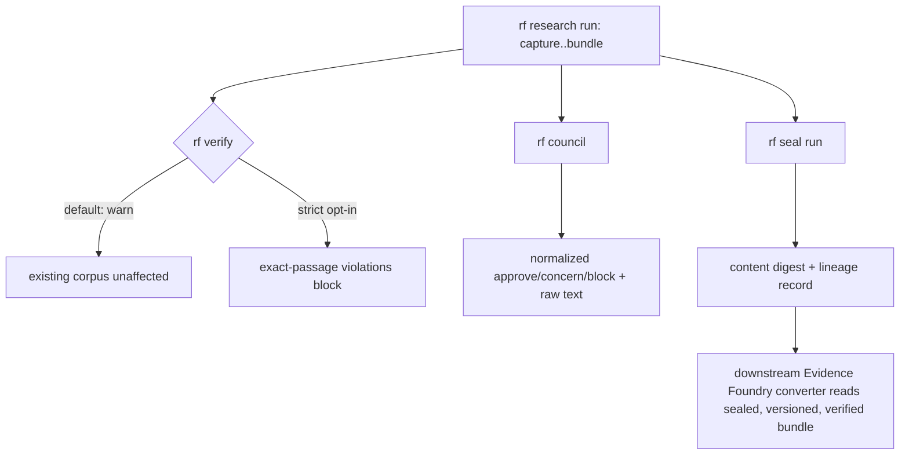

# Feature Brief & Metadata

**Feature Name:**

> rf Upstream Evidence Foundry (RFUP-1..5, RFUP-7)

**Filepath Name:**

> `rf-upstream-evidence-foundry-v1` (kebab-case)

**Date:**

> 2026-07-18

**Author:**

> Claude (Opus, orchestrator) via prd-writer subagent

**Related Epic(s)/PRD ID(s):**

> IntentTree node `node_01KXRTYKKW9ECTF9MCBQ8JV1EB` (parent, 7 work packages); per-item nodes RFUP-1..7:
> `node_01KXRTYKSH49WSKV2T9YWEYB4T`, `node_01KXRTYKYJD1ZHSZZJCBAKSBQ9`, `node_01KXRTYM3PYC9X5BDFQ054ZHT3`,
> `node_01KXRTYM91J4N0GRTAB4WPAQTG`, `node_01KXRTYME45WHHFQ382BNPBQ1D`, `node_01KXRTYMM3V25RMM8ZPBNRS9PN`,
> `node_01KXRTYMSFSZ4FGWNM4RE95YF5`.

**Related Documents:**

> - External spike-equivalent: `pediatric-anemia-site/docs/project_plans/expansion/02-evidence-foundry-on-research-foundry.md` (§6.2 gap register, §8.3 platform risks — originating evidence, lives in a different repo)
> - Decisions block: `.claude/worknotes/rf-upstream-evidence-foundry/decisions-block.md`
> - Current-state fact sheet: `.claude/worknotes/rf-upstream-evidence-foundry/current-state.md`

---

## 1. Executive Summary

A downstream project (pediatric-anemia-site) wants to build an "Evidence Foundry" clinical-content pipeline on top of Research Foundry, using `rf` as its evidence-to-verified-claim control plane. That design (external spec §6.2, §8.3) identified seven gaps in current `rf` behavior; six are in scope here as upstream enhancements that make `rf`'s existing surfaces (verify, fetch, council, run storage, machine output, the Path-B workflow) more precise, versioned, and tamper-evident — without adding any clinical-domain logic to `rf` itself. The seventh (native discovery adapter installation) is deferred by design.

**Priority:** HIGH

**Key Outcomes:**
- Outcome 1: Every `rf` machine-readable surface (verify, run export, catalog/API, `--json`) carries a stable, versioned contract downstream consumers can rely on without parsing Rich console output.
- Outcome 2: `rf verify` can hard-block claims lacking an exact passage anchor when a consuming project opts into strict mode, without breaking the existing warn-mode corpus.
- Outcome 3: `rf fetch` gains governed PDF text extraction, council verdicts normalize to a controlled enum, sealed runs become tamper-evident, and the proven Path-B workflow becomes portable (no hard-coded machine paths).

---

## 2. Context & Background

### Current State

Research Foundry (`rf`) is a file-backed, deterministic research control plane: `capture → triage → plan → ingest → extract → claim-map → synthesize → verify → council → bundle → writeback`. Per the current-state fact sheet:

- **RFUP-1**: `.claude/workflows/rf-run-execute.js` hard-codes the `rf` binary path, repo checkout path, TMP working dir, and a frozen date stamp (`20260613`) baked into `source_card_id` generation.
- **RFUP-2**: `rf fetch` extraction (`services/search_router/router.py`) relies entirely on the `jina`/`firecrawl` provider chain for markdown extraction; there is no dedicated PDF text parser — PDFs without extractable markdown degrade silently to locator-only cards.
- **RFUP-3**: `services/verification.py` treats `source_cards_have_locators` as a WARNING (not error); there is no dedicated exact-passage/quote-anchor eligibility check — passage support is only implicit via raw quote string-matching against the report body.
- **RFUP-4**: `errors.py` defines a stable `ExitCode` enum (0–7); CLI commands support `--json` flags inconsistently; there is no `rf_schema_version` field on any machine-readable output. The runs-viewer's own hand-written export schema is versioned (1.5) but this is not wired to core `rf` output.
- **RFUP-5**: `adapters/arc_council.py` reads ARC's `verdict` field as a free-form string (default `"pending"`); there is no controlled enum.
- **RFUP-7**: `paths.py` defines the run directory layout (`sources/`, `claims/`, `reports/`, `reviews/`, `writebacks/`); `claim_ledger.yaml` and source cards are plain mutable files. The assertion registry (`services/assertion_registry.py`) already has atomic-write + content-addressable digest patterns, but only for its own workspace-scoped, run-independent store — nothing marks a *run* itself as sealed/immutable.

### Problem Space

The Evidence Foundry design (external spec) needs to treat an `rf` bundle as a pinned, versioned, tamper-evident, machine-parseable evidence source — hashed, diffed, and trusted without re-deriving trust from Rich console text. Today's `rf` surfaces are functionally correct for interactive research use but were not built to be consumed as an external contract: paths are personal-machine-specific, passage support is advisory, machine output has no version stamp, council verdicts are free text, and nothing distinguishes a "final" run from one still being edited.

### Current Alternatives / Workarounds

Today, a downstream consumer would have to: parse Rich console output heuristically (fragile), trust `warn`-only locator checks as if they were hard gates (unsafe for release-grade evidence), hand-roll PDF extraction outside `rf`, treat ARC's free-text verdict as opaque, and re-implement its own digest/lineage layer over `runs/<run_id>/` to detect post-hoc edits. Each of these is exactly the kind of "second parallel evidence pipeline" the external spec explicitly rules out building downstream (§6.4).

### Architectural Context

This is backend/CLI Python work in the `research_foundry` package — no frontend/UI layer is touched except where the runs-viewer's existing hand-written export schema (`run-export.ts`) may need a version bump if a new field is added to run export (additive-only per Phase 1 scope; see Risk Hotspots).

---

## 3. Problem Statement

**User Story Format:**
> "As a downstream evidence-consuming system (Evidence Foundry / pediatric-anemia-site), when I read an `rf` run's machine output, I cannot reliably distinguish a versioned, hard-gated, tamper-evident evidence bundle from an in-progress research draft — instead of a stable, versioned, strict-mode-capable, sealed contract I can pin and hash."

**Technical Root Cause:**
- No schema version stamp on any machine-readable `rf` surface (RFUP-4).
- Exact-passage support is warning-only, not hard-gated (RFUP-3).
- No PDF text extraction path in `rf fetch` (RFUP-2).
- Council verdicts are unstructured free text (RFUP-5).
- No run-level seal/digest/lineage mechanism — runs are always mutable (RFUP-7).
- The one proven live-discovery workflow (Path-B) has hard-coded, single-machine paths (RFUP-1).

---

## 4. Goals & Success Metrics

### Primary Goals

**Goal 1: Stable machine contract**
- Every enumerated machine-readable `rf` surface carries `rf_schema_version`.
- Measurable: contract drift tests pass; documented machine-surface inventory exists.

**Goal 2: Hard-gatable evidence quality**
- `rf verify` can enforce exact-passage anchoring per-run/profile without breaking existing warn-mode consumers.
- Measurable: strict mode blocks a synthetic violation corpus; default mode shows zero regressions on real-corpus sample.

**Goal 3: Tamper-evident, portable evidence supply chain**
- PDF sources extract governed full text where possible; council verdicts normalize; sealed runs are tamper-evident; Path-B is portable across machines.
- Measurable: PDF fixture → full-text card; digest mismatch detected on sealed-run mutation; workflow dry-run succeeds with explicit args on a scratch run.

### Success Metrics

| Metric | Baseline | Target | Measurement Method |
|--------|----------|--------|-------------------|
| Machine surfaces stamped with `rf_schema_version` | 0 | 100% of enumerated surfaces (Phase 1 inventory) | Contract drift test suite |
| Real-corpus verify regressions (default mode) | n/a | 0 new failures | `rf verify` over real-corpus sample, before/after diff |
| Sealed-run mutation detection rate | n/a | 100% of test-suite mutation attempts | Digest re-check test |
| Literal absolute machine paths in `rf-run-execute.js` | 4+ (RF bin, repo, TMP, date stamp) | 0 | grep-verifiable source scan |

---

## 5. User Personas & Journeys

This is an infrastructure/control-plane PRD; primary "users" are downstream automated consumers and the research operators who run `rf`, not end-user personas.

**Primary Persona: Downstream Evidence Consumer (Evidence Foundry converter)**
- Role: Automated tool reading `rf` bundles as pinned input (external, in pediatric-anemia-site repo).
- Needs: Versioned machine contract, hard-gated exact-passage evidence, tamper-evident sealed runs.
- Pain Points: Cannot currently distinguish contract versions, cannot hard-block on missing passage anchors, cannot detect post-hoc run mutation.

**Secondary Persona: rf Research Operator**
- Role: Runs `rf` research swarms and Path-B workflows across machines/environments.
- Needs: Portable workflow config, unchanged default behavior in existing corpora.
- Pain Points: Path-B is hard-coded to one machine; strict passage gating must not silently break existing runs.

### High-level Flow

---

## 6. Requirements

Six requirement sections follow, one per RFUP item (RFUP-1, RFUP-2, RFUP-3, RFUP-4, RFUP-5, RFUP-7), each mapped to its decisions-block phase. **RFUP-6 does not appear here — see §14 Out of Scope / Deferred.**

### 6.1 RFUP-4 — Machine contract & schema versioning (Phase 1)

**Current state:** `errors.py` defines a stable `ExitCode` enum (0–7, `errors.py:12–26`); `cli_commands.py` has inconsistent `--json` flag coverage; no `rf_schema_version` field exists anywhere in machine output today.

| ID | Requirement | Priority | Notes |
| :-: | ----------- | :------: | ----- |
| FR-4.1 | Stamp `rf_schema_version` (semver string) into every machine-readable surface: run export, `rf verify` YAML/JSON output, catalog/API payloads, and all `--json` CLI outputs. | Must | Additive-only in this feature. |
| FR-4.2 | Document the stable machine contract explicitly: exit code (`ExitCode` enum) + YAML/JSON output IS the contract; Rich console output is presentation-only and MUST NOT be parsed by automation. | Must | Contract doc, not just code. |
| FR-4.3 | Add contract drift tests asserting `rf_schema_version` presence/value across all enumerated surfaces. | Must | Fails red on divergence. |
| FR-4.4 | No existing field on any enumerated surface is renamed or removed by this phase. | Must | runs-viewer export bumps 1.5→1.6 only if a field is genuinely added. |

**Acceptance Criteria:**
- **AC-RFUP4-1** — target_surfaces: `errors.py`, `cli_commands.py`, `services/verification.py`, `run-export.ts` (runs-viewer export), `/api/runs`, `/api/reports`, `/api/catalog` (LAN API). Every surface in this list emits a top-level `rf_schema_version` string field, verified by a contract test suite exercising each surface.
- **AC-RFUP4-2**: A documented machine-surface inventory (new doc section) enumerates every command/endpoint that emits `rf_schema_version` and its currently stamped value.
- **AC-RFUP4-3**: Contract drift tests fail when a machine surface's stamped `rf_schema_version` diverges from the declared canonical constant, and pass on unmodified code.
- **AC-RFUP4-4**: A before/after key-diff of a fixture run's JSON/YAML output across all `target_surfaces` in AC-RFUP4-1 shows zero renamed or removed keys — only the addition of `rf_schema_version`.
- **AC-RFUP4-5** (resilience, R-P2) — target_surfaces: runs-viewer data loader, `/api/runs`, `/api/reports`, `/api/catalog` consumers. Any consumer reading `--json`/YAML output that lacks `rf_schema_version` (pre-feature `rf` version, or a surface not yet migrated) treats it as an implicit "unversioned/legacy" contract rather than raising an unhandled exception.

### 6.2 RFUP-3 — Exact-passage hard-gating in rf verify (Phase 2)

**Current state:** `services/verification.py:57` treats `source_cards_have_locators` as a WARNING; passage support today is only implicit via raw quote string-matching against report body (`verification.py:1032–1033`); no dedicated exact-passage eligibility check exists.

| ID | Requirement | Priority | Notes |
| :-: | ----------- | :------: | ----- |
| FR-3.1 | Add a new eligibility check that fails (not warns) when a claim citing a source card lacks an exact passage/quote anchor. | Must | New check, distinct from `source_cards_have_locators`. |
| FR-3.2 | Gate the check via `verify.exact_passage: warn\|strict` (default `warn`), both as a config default and a run-level override (per OQ-1). | Must | Evidence Foundry consuming runs set `strict`. |
| FR-3.3 | Emit a machine-readable violation list in verify output distinguishable from the existing `source_cards_have_locators` warning list. | Must | Feeds RFUP-4's stamped output. |
| FR-3.4 | Preserve existing default (`warn`) behavior on the real corpus — zero new failures. | Must | Real-corpus regression is a hard exit gate (decisions block §3, HIGH severity). |

**Acceptance Criteria:**
- **AC-RFUP3-1** — target_surfaces: `services/verification.py`. A synthetic violation corpus (claims citing source cards without passage anchors) run under `verify.exact_passage: strict` returns a nonzero exit code and `verification.yaml.passed: false`.
- **AC-RFUP3-2**: The same synthetic violation corpus run under default (unset/`warn`) mode returns unchanged pre-feature behavior (warning only, no new blocking failure).
- **AC-RFUP3-3**: A regression run of `rf verify` in default mode over a real-corpus sample (drawn from the 2,835 backfilled assertions and prior KnitWit/other runs) produces zero new failures versus the pre-feature baseline verify output.
- **AC-RFUP3-4** — target_surfaces: `services/verification.py` verify output schema. Verify output includes a distinguishable `exact_passage_violations` list, present only when relevant claims are found, separate from `source_cards_have_locators`.
- **AC-RFUP3-5** (resilience, R-P2): Any downstream consumer of verify output (e.g., orchestration scripts branching on `VERIFY_EXIT`) handles the absence of `exact_passage_violations` (strict mode never engaged) without raising a KeyError — the field is optional, not required.

### 6.3 RFUP-2 — Governed URL/PDF extraction adapter (Phase 3)

**Current state:** `services/search_router/router.py:288–347` (`extract_urls()`) relies entirely on the `jina`/`firecrawl` provider chain (`_first_extraction_provider()`, line 31) for markdown extraction; no dedicated PDF parser exists; failed extraction degrades silently to a locator-only card (`degraded=True`, lines 344–346) with no explicit status field.

| ID | Requirement | Priority | Notes |
| :-: | ----------- | :------: | ----- |
| FR-2.1 | Add a PDF text extraction adapter (pypdf-class dependency, per OQ-3) as an optional installable extra (e.g. `research-foundry[pdf]`). | Must | Optional dep, not a hard requirement. |
| FR-2.2 | Wire the PDF adapter into `rf fetch` / the extraction pipeline as a path for PDF content-type/URLs, alongside the existing jina/firecrawl chain. | Must | Governed: passes existing governance gate before card write. |
| FR-2.3 | Add an explicit `extraction_status` field on source cards: `full_text \| partial \| locator_only`. | Must | Replaces the implicit `degraded` boolean with a queryable tri-state. |
| FR-2.4 | Extraction (including PDF parse) runs BEFORE the governance gate (sensitivity classification + secret scan) so extracted text is subject to existing checks. | Must | Security requirement — untrusted PDF content must be scanned. |
| FR-2.5 | Preserve graceful degrade-to-locator-only when PDF extraction fails or the `pdf` extra is not installed. | Must | No unhandled exception on missing optional dep. |

**Acceptance Criteria:**
- **AC-RFUP2-1** — target_surfaces: `services/search_router/router.py`, `services/source_cards.py`. Given a PDF fixture with an extractable text layer, `rf fetch` produces a source card with `extraction_status: full_text` and populated content.
- **AC-RFUP2-2**: Given a PDF fixture with no extractable text layer (scanned image), `rf fetch` produces a source card with `extraction_status: locator_only`, matching current locator-only degrade behavior.
- **AC-RFUP2-3** — target_surfaces: `services/search_router/router.py` governance gate call site. Extracted PDF text passes through the existing governance gate (sensitivity + secret scan) before card write, verified by a test asserting a PDF fixture containing a synthetic secret pattern is blocked/redacted per existing `guard check` rules.
- **AC-RFUP2-4** — target_surfaces: `services/search_router/router.py`. When the optional `pdf` extra is not installed, `rf fetch` against a PDF URL falls back to existing jina/firecrawl or locator-only behavior without raising an unhandled exception.
- **AC-RFUP2-5** (resilience, R-P2): `rf verify` and any other consumer of source cards handles cards written before this feature (no `extraction_status` field present) by treating them as an implicit `partial`/`locator_only` state (per existing `has_locator` logic) rather than raising a KeyError.

### 6.4 RFUP-5 — Council result normalization (Phase 4a)

**Current state:** `adapters/arc_council.py:74,78` reads `run_record.get("verdict")` as a free-form string, defaulting to `"pending"` if missing; there is no built-in consensus enum (`arc_council.py:36–88`).

| ID | Requirement | Priority | Notes |
| :-: | ----------- | :------: | ----- |
| FR-5.1 | Normalize council/ARC verdict free text into a controlled enum `approve \| concern \| block`, stored alongside the raw text (non-destructive). | Must | Raw string always retained in `AdapterResult.artifacts["arc_verdict"]`. |
| FR-5.2 | When the raw verdict text cannot be parsed into one of the three enum values, default to `concern` (fail-toward-caution) and set a `normalization_confidence` flag. | Must | No silent misclassification as `approve`. |
| FR-5.3 | Apply normalization at the adapter boundary (`adapters/arc_council.py`) only — never mutate ARC's own record. | Must | ARC remains source of truth for raw verdict. |
| FR-5.4 | Do not bump the runs-viewer export schema or add the enum to run export in this feature (per OQ-4 default). | Should | Stays CLI/YAML-only unless the viewer later needs it. |

**Acceptance Criteria:**
- **AC-RFUP5-1** — target_surfaces: `adapters/arc_council.py`. Given ARC verdict strings matching known-good approve phrasing (e.g. `"approve"`, `"approved"`, `"lgtm"`), the adapter emits `council_verdict: approve` with `normalization_confidence: high`.
- **AC-RFUP5-2**: Given an unrecognized free-form ARC verdict string, the adapter emits `council_verdict: concern` and `normalization_confidence: low`.
- **AC-RFUP5-3**: The raw ARC verdict string is present unmodified in `AdapterResult.artifacts["arc_verdict"]` regardless of normalization outcome.
- **AC-RFUP5-4**: No field is added to the runs-viewer's `run-export.ts` schema by this phase (verified by an unchanged export-schema-version assertion in the test suite).
- **AC-RFUP5-5** (resilience, R-P2) — target_surfaces: `adapters/arc_council.py`, `cli_commands.py` council command output. Any consumer of council output (CLI summary, run export) handles a missing normalized `council_verdict` field (older runs pre-dating this feature) by falling back to displaying only the raw `arc_verdict` string.

### 6.5 RFUP-7 — Run immutability, storage & audit (Phase 4b)

**Current state:** `paths.py:188–336` defines the run directory layout; `claim_ledger.yaml` and source cards (`paths.py:222–223, 234–235`) are plain mutable files; `services/assertion_registry.py:50–81, 156–200` already implements atomic temp-file+fsync+os.replace writes and content-addressable, immutable editions — but scoped to its own workspace-level store, independent of any given run.

| ID | Requirement | Priority | Notes |
| :-: | ----------- | :------: | ----- |
| FR-7.1 | Add a finalization/seal mechanism (surface TBD by planner per OQ-2 — new `rf seal <run>` command or an additive flag on an existing finalize/export path; prefer the smaller surface) marking a run as sealed. | Must | Additive, opt-in. |
| FR-7.2 | On seal, compute a content digest over the run's evidence chain (claim ledger + source cards + report), reusing the assertion-registry atomic-write/digest pattern. | Must | Reuse existing pattern, don't reinvent. |
| FR-7.3 | Store an append-only lineage record for sealed runs: seal timestamp, digest, sealer identity/context. | Must | Append-only by design — never rewrites history. |
| FR-7.4 | After sealing, a mutation to any digest-covered file is detectable via digest mismatch on re-check. | Must | Tamper-evident, not tamper-proof — no file locking. |
| FR-7.5 | Pre-seal run behavior (rf tail, report iteration, in-place edits) is entirely unaffected. | Must | Immutability is opt-in and additive only. |

**Acceptance Criteria:**
- **AC-RFUP7-1** — target_surfaces: `services/assertion_registry.py`, `paths.py`. Sealing a verified run writes a lineage record containing a content digest computed over the claim ledger, source cards, and report.
- **AC-RFUP7-2**: A mutation to any digest-covered file (e.g., editing `claim_ledger.yaml`) after sealing is detected by a digest re-check, returning a mismatch/tamper-evident result.
- **AC-RFUP7-3**: A run that has NOT been sealed can still be freely edited (rf tail, report iteration) with no behavior change versus pre-feature — verified by a regression test exercising the existing unsealed-run workflow.
- **AC-RFUP7-4**: The seal operation applies no file locking, chmod, or OS-level write protection — additive metadata + digest only, confirmed by a test asserting file permissions are unchanged pre/post seal.
- **AC-RFUP7-5** (resilience, R-P2) — target_surfaces: `cli_commands.py` run status output, `/api/runs`. Any consumer reading run metadata handles the absence of a lineage/seal record (unsealed runs, or runs predating this feature) by treating the run as "unsealed" rather than raising an error.

### 6.6 RFUP-1 — Path-B workflow parameterization (Phase 5)

**Current state:** `.claude/workflows/rf-run-execute.js` hard-codes the `rf` binary path (line 18: `/Users/miethe/.local/bin/rf`), the repo checkout path (line 19), the TMP working dir (line 20), and a frozen date stamp (line 21: `20260613`) baked into `source_card_id` generation (line 121). The TMP→cp write-safety pattern (lines 97–100, 127, 164, 189, 212) must be preserved unchanged.

| ID | Requirement | Priority | Notes |
| :-: | ----------- | :------: | ----- |
| FR-1.1 | Replace the hard-coded `rf` binary path with a configurable arg/config value, defaulting to current behavior on this machine. | Must | Backward-compat default required. |
| FR-1.2 | Replace the hard-coded repo checkout path with a configurable arg/config value. | Must | Same. |
| FR-1.3 | Replace the hard-coded TMP working dir with a configurable arg/config value. | Must | Same. |
| FR-1.4 | Replace the frozen date stamp with a run-date computed at invocation time; preserve four-constraints compliance (workflow-authoring skill) and the TMP→cp write-safety pattern unchanged. | Must | No literal past dates baked into `source_card_id` generation going forward. |
| FR-1.5 | Update the workflow registry entry to reflect the new config surface. | Should | Keeps `workflow-registry.md` accurate. |

**Acceptance Criteria:**
- **AC-RFUP1-1** — target_surfaces: `.claude/workflows/rf-run-execute.js`. `node --check` passes on the refactored workflow file.
- **AC-RFUP1-2**: A dry-run execution with explicit `--rf-bin`, `--repo`, `--tmp-dir` args reproduces prior default behavior on this machine (same generated command sequence shape) for a scratch run.
- **AC-RFUP1-3** — target_surfaces: `.claude/workflows/rf-run-execute.js`. No literal absolute machine paths (e.g. `/Users/miethe/...`) remain hard-coded in the script source, verified by a grep-based source scan in CI/tests.
- **AC-RFUP1-4**: The date stamp used in generated `source_card_id`s is computed at invocation time, verified by running the workflow in dry-run mode on two different dates and observing distinct stamps (not the literal `20260613`).
- **AC-RFUP1-5** (resilience, R-P2): When config args are omitted, the workflow falls back to documented defaults reproducing pre-refactor behavior on this machine, rather than crashing or silently no-op'ing.

---

## 7. Hard Scope Boundary

This PRD covers the **evidence / verified-claim side of Research Foundry ONLY** — the six enhancements above extend `rf`'s existing evidence pipeline (source cards, extraction, claim ledger, verify, council, run storage, the Path-B discovery workflow). It does **NOT** cover, and an implementer working under this PRD **MUST NOT** build any of the following, even if a downstream consumer (Evidence Foundry / pediatric-anemia-site) requests it as a "small addition":

- **No FHIR resource generation or mapping.** `rf` emits research artifacts (source cards, claims, reports), never `Questionnaire`, `PlanDefinition`, `ActivityDefinition`, or CDS Hooks service definitions. FHIR/terminology (LOINC/UCUM/SNOMED) projection is owned entirely by the downstream `rf-bundle-to-kb-pack` converter in the pediatric-anemia-site repository (external spec §4.2, §1.3 "Interoperability" row).
- **No rule DSL, executable clinical logic, or Boolean rule compilation.** `rf` stops at verified/inference/mixed/contradicted claims. Candidate rules, typed clinical facts, missingness semantics, and the `when`/`output` rule schema belong to the downstream converter and CDS runtime (external spec §1.3 "Rule proposal" row, §4.13).
- **No claim/bundle signing or release manifest generation.** RFUP-7 adds a *content digest + append-only lineage record* for tamper-evidence within `rf` — this is explicitly NOT a cryptographic signature, release manifest, or KB registry entry. Signed release assembly, clinical approval binding, and registry publication are downstream responsibilities (external spec §1.3 "Release" row, §4.1 "Release authority: None").

If any task under this PRD drifts toward FHIR emission, rule-logic compilation, or cryptographic signing/release-manifest work, it is out of scope for this PRD and must be redirected to the pediatric-anemia-site `rf-bundle-to-kb-pack` converter workstream instead. This boundary is a hard constraint from the decisions block (§0 Framing) and the external spec's division-of-labor statement: "`rf` owns evidence → verified claim; the pediatric CDS platform owns verified claim → executable rule → validated, signed release."

---

## 8. Scope

### In Scope

- RFUP-4: `rf_schema_version` stamping across enumerated machine-readable surfaces + contract drift tests.
- RFUP-3: Exact-passage hard-gating in `rf verify`, flag/profile-gated, default `warn`.
- RFUP-2: Governed PDF text extraction adapter for `rf fetch`, with explicit `extraction_status`.
- RFUP-5: Council verdict normalization to `approve|concern|block` (non-destructive).
- RFUP-7: Run seal + content digest + append-only lineage record (tamper-evidence only).
- RFUP-1: Path-B workflow (`rf-run-execute.js`) parameterization — no more hard-coded machine paths or frozen date stamp.
- Cross-phase regression, documentation, CHANGELOG updates, and RFUP-6 design-spec authoring (Phase 6).

### Out of Scope

- FHIR resource generation/mapping (see §7 Hard Scope Boundary).
- Clinical rule DSL / executable logic compilation (see §7 Hard Scope Boundary).
- Claim/bundle cryptographic signing or release manifest/registry (see §7 Hard Scope Boundary).
- **RFUP-6 (native discovery adapter installation)** — see §14 Out of Scope / Deferred below.
- Any pediatric-specific evidence-card schema extension (`pediatric_cds` block per external spec §3.6) — that extension lives in the downstream module manifest/authoring-decisions, not in core `rf` schemas (generic `rf` schemas already permit `additionalProperties: true`).

---

## 9. Dependencies & Assumptions

### External Dependencies

- **PDF extraction library** (RFUP-2): pypdf or pdfminer.six, selected by the implementation planner per OQ-3, installed as an optional extra.
- **ARC Council server** (RFUP-5): existing external dependency via `adapters/arc_council.py`; normalization work is adapter-boundary only, no ARC-side changes required.

### Internal Dependencies

- **assertion_registry.py digest/atomic-write patterns** (RFUP-7): reused, not reinvented, for run-seal digest computation.
- **Phase 1 stamped schema** (RFUP-4): Phases 2–4 (RFUP-3, RFUP-2, RFUP-7) emit their new fields under the stamped contract; Phase 1 must land first per the dependency map.

### Assumptions

- The real corpus (2,835 backfilled assertions + prior KnitWit/other runs) remains available for the Phase 2 regression sample.
- No downstream Evidence Foundry consumer requires the council enum in run export before this feature ships (OQ-4 default: stays CLI/YAML-only).
- Governance gate (sensitivity classification + secret scan) exists and is reusable as a call site for RFUP-2's extracted PDF text.

### Feature Flags

- `verify.exact_passage`: `warn` (default) | `strict` — RFUP-3 gating.

---

## 10. Risks & Mitigations

| Risk | Impact | Likelihood | Mitigation |
| ----- | :----: | :--------: | ---------- |
| Strict passage gating (RFUP-3) breaks existing corpus (2,835 backfilled assertions; KnitWit + prior runs) | High | Med | Flag/profile-gated, default `warn`; strict is opt-in per run/profile; regression test asserts zero new failures on real-corpus sample in default mode. |
| Immutability (RFUP-7) breaks in-place run workflows (rf tail, report iteration) | High | Low | Immutability applies only to explicitly sealed runs; pre-seal behavior unchanged; seal is additive metadata + digest, no file locking. |
| Schema stamp churn (RFUP-4) breaks runs-viewer/existing consumers | Med | Low | Additive-only in this feature; runs-viewer export schema bump (1.5→1.6) only if a field is genuinely added to run export. |
| PDF extraction dependency weight/security — parsing untrusted PDFs (RFUP-2) | Med | Med | Optional extra (`research-foundry[pdf]`); graceful degrade to locator_only when absent; extraction runs pre-governance-gate so secret scan/sensitivity apply to extracted text. |
| Council normalization (RFUP-5) misclassifies free-form verdicts | Low | Med | Non-destructive: raw text always retained; unparseable → `concern` (fail-toward-caution) + `normalization_confidence` flag. |
| Workflow param refactor (RFUP-1) breaks the proven Path-B lane | Med | Low | Backward-compat default config reproducing current behavior on this machine; dry-run gate before registry update; four-constraints checklist re-run. |
| Governance regression (WKSP-304 / DI-1 surface) | Med | Low | New adapter and seal surfaces go through the existing governance gate; no new privileged writeback targets; any workspace-scoping-relevant query flagged for the DI-1 audit register. |

**Mode D check:** none of the six in-scope items touch auth, payments, migrations, or data deletion. The closest edge is RFUP-7 (lineage) — it must NOT delete or rewrite history; append-only by design.

---

## 11. Target State (Post-Implementation)

**Consumer Experience:**
- A downstream tool reading any `rf` machine surface finds a stable `rf_schema_version` and can pin/hash it.
- A research operator running `rf verify --profile evidence-foundry` (or equivalent strict config) gets hard failures on claims lacking exact passages; existing default-mode consumers see no change.
- `rf fetch` against a PDF source produces a full-text card when extractable, or an explicitly labeled `locator_only` card otherwise — never a silent degrade.
- `rf council` output carries both the raw ARC text and a normalized `approve|concern|block` verdict.
- `rf seal <run>` (or equivalent) marks a run as sealed with a tamper-evident digest; any later mutation is detectable.
- The Path-B workflow runs identically on any machine with the right config, with no frozen date stamp.

**Technical Architecture:**
- New fields are additive across `errors.py`/`cli_commands.py`/`services/verification.py`/`services/search_router/router.py`/`services/source_cards.py`/`adapters/arc_council.py`/`paths.py`/`services/assertion_registry.py`.
- `.claude/workflows/rf-run-execute.js` reads config/args instead of hard-coded constants.

**Observable Outcomes:**
- Contract drift tests are part of the standard test suite.
- Real-corpus verify regression sample shows zero new failures.
- Digest re-check tooling exists for sealed runs.

---

## 12. Overall Acceptance Criteria (Definition of Done)

### Functional Acceptance

- [ ] All functional requirements (FR-1.x through FR-7.x) implemented across the six RFUP sections.
- [ ] Every AC listed in §6.1–§6.6 passes, including all R-P2 resilience ACs.
- [ ] Real-corpus regression sample (RFUP-3) shows zero new failures in default mode.

### Technical Acceptance

- [ ] Additive-only field changes — no existing machine-surface field renamed or removed.
- [ ] `rf_schema_version` present on all Phase-1-enumerated machine surfaces.
- [ ] No literal absolute machine paths remain in `.claude/workflows/rf-run-execute.js`.
- [ ] Digest/atomic-write patterns for RFUP-7 reuse `services/assertion_registry.py`, not a new implementation.

### Quality Acceptance

- [ ] `./.venv/bin/python -m pytest` green across the full suite post-merge (per project pytest-under-venv convention).
- [ ] `flake8 <src> --select=E9,F63,F7,F82` clean.
- [ ] `task-completion-validator` pass at the end of each phase; `karen` pass after Phase 3 and at Phase 6 (per decisions block §1 milestone checkpoints).

### Documentation Acceptance

- [ ] Machine-surface inventory doc created (RFUP-4, FR-4.2).
- [ ] CHANGELOG updated for the user-facing new CLI/config surfaces (`verify.exact_passage`, run-seal command, `extraction_status`, council enum).
- [ ] RFUP-6 design spec authored as a deferred-item artifact (Phase 6; see §14).

---

## 13. Assumptions & Open Questions

### Assumptions

- The 29-pt estimate (decisions block §4) holds; if scope grows materially during implementation planning, promote rather than stretch (per tiered-workflow-overhaul.md).
- No dual local/enterprise implementation split applies to this work (H2 n/a per decisions block).

### Open Questions

- [ ] **OQ-1**: Exact config key + profile shape for strict passage gating (`verify.exact_passage` vs sensitivity-profile-driven).
  - **A**: TBD — implementation-planner proposes; keep both a run-level flag and a config default.
- [ ] **OQ-2**: Seal trigger surface — new `rf seal <run>` command vs a flag on an existing finalize/export path.
  - **A**: TBD — planner picks the smaller surface; must be additive.
- [ ] **OQ-3**: Which PDF extraction library (pypdf vs pdfminer.six)?
  - **A**: TBD — planner picks based on existing dependency footprint; optional-extra either way.
- [ ] **OQ-4**: Does the council enum land in run export schema now (bump 1.6), or stay CLI/YAML-only until the viewer needs it?
  - **A**: Default — stays out of the viewer export for this feature (FR-5.4).

---

## 14. Out of Scope / Deferred

### RFUP-6: Native Discovery Adapter Install/Eval — DEFERRED

**Current state** (current-state.md): `adapters/__init__.py:17–26` declares 8 concrete adapters (`arc_council`, `claude_agent_sdk`, `gpt_researcher`, `notebooklm`, `openai_agents`, `paperqa2`, `opencode`, `litellm_router`); `load_all()` (lines 29–39) silently catches import errors so missing optional deps never break startup. Today, 0 of the 6 non-`arc_council`/non-`litellm_router` native discovery adapters are installed/live (external spec §6.2 gap register: "0/6 live adapters").

**Why it is deferred, not built:** The IntentTree node for RFUP-6 states explicitly: install/evaluate native adapters "only after a measured value/security gap." Both the decisions block (§0 Framing) and the external spec (§6.2, §8.1 "Which adapter should be installed first?") converge on the same answer — stabilize and parameterize the proven Path-B Claude workflow (RFUP-1, in scope above) first, because it is the working live-discovery lane; installing a native adapter before that is proven adds surface area (dependency weight, security review burden per adapter) without a demonstrated gap the Path-B lane can't already fill.

**Defer-until condition** (measured-value or security-gap trigger, per decisions block): Revisit RFUP-6 only when one of the following becomes true:
1. A **measured value gap** — the Path-B workflow (post-RFUP-1 parameterization) is shown to be insufficient for a specific discovery need (e.g., a research angle native `gpt_researcher`/`paperqa2` handles measurably better, evidenced by a comparison run), OR
2. A **security/governance gap** — a concrete requirement emerges (e.g., a downstream consumer needs a specific adapter's capability and the governance/DI-1 audit register has cleared it) that the existing adapter set cannot satisfy.

**What happens instead in this PRD's scope:** Phase 6 (Validation, docs & deferral) authors a `design_spec` for RFUP-6 at `docs/project_plans/design-specs/rfup-6-native-discovery-adapters.md` (maturity: `idea`) capturing the trigger condition above and the adapter shortlist, and records the IntentTree node status accordingly. No adapter installation, evaluation harness, or `load_all()` changes are made under this PRD.

**Effort estimate reference:** Not estimated as an implementation phase in this feature (decisions block §4 Estimation Anchors covers only the 6 in-scope phases, total 29 pts); RFUP-6 remains unscoped until the defer-until condition is met and a future PRD/design-spec promotion occurs.

---

## Implementation

### Phased Approach

Phase boundaries, agent routing, risk hotspots, and the dependency map are authored in the Opus decisions block (`.claude/worknotes/rf-upstream-evidence-foundry/decisions-block.md`) and are the source of truth for the implementation plan. Summary:

**Phase 1: Machine contract & schema versioning (RFUP-4)**
- Stamp `rf_schema_version` across all enumerated surfaces; contract doc + drift tests.

**Phase 2: Exact-passage hard-gating in rf verify (RFUP-3)**
- New strict eligibility check, flag/profile-gated, default `warn`; real-corpus regression gate.

**Phase 3: Governed URL/PDF extraction adapter (RFUP-2)**
- PDF extraction adapter (optional extra) + `extraction_status` field; governance-gate ordering preserved.

**Phase 4: Council normalization + run lineage (RFUP-5, RFUP-7)**
- 4a: Council verdict enum normalization (non-destructive).
- 4b: Run seal + content digest + append-only lineage record.

**Phase 5: Parameterize Path-B workflow (RFUP-1)**
- Config/args replace hard-coded RF/repo/TMP paths and frozen date stamp.

**Phase 6: Validation, docs & deferral**
- Full regression suite, CHANGELOG, machine-surface inventory doc, RFUP-6 design spec, IntentTree node status writebacks.

Ordering rationale, parallel opportunities, and per-phase agent/model routing are detailed in the decisions block §1–§6 and will be expanded into the full implementation plan by `implementation-planner`.

### Epics & User Stories Backlog

| Story ID | Short Name | Description | Acceptance Criteria | Estimate |
|----------|-----------|-------------|-------------------|----------|
| RFUP-4 | Machine contract & schema versioning | Stamp `rf_schema_version` across machine surfaces | §6.1 AC-RFUP4-1..5 | 5 pts |
| RFUP-3 | Exact-passage hard-gating | Strict `rf verify` passage check, flag-gated | §6.2 AC-RFUP3-1..5 | 4 pts |
| RFUP-2 | Governed PDF extraction | PDF adapter + `extraction_status` | §6.3 AC-RFUP2-1..5 | 8 pts |
| RFUP-5 | Council normalization | `approve\|concern\|block` enum | §6.4 AC-RFUP5-1..5 | ~2 pts (of combined 5) |
| RFUP-7 | Run seal & lineage | Content digest + append-only record | §6.5 AC-RFUP7-1..5 | ~3 pts (of combined 5) |
| RFUP-1 | Path-B parameterization | Remove hard-coded paths/date stamp | §6.6 AC-RFUP1-1..5 | 4 pts |
| VAL-6 | Validation, docs & deferral | Regression, CHANGELOG, RFUP-6 design spec | §12 Documentation Acceptance | 3 pts |

---

**Progress Tracking:**

See progress tracking (once created): `.claude/progress/rf-upstream-evidence-foundry/phase-N-progress.md`

**Human Brief** (qualifies: 29 pts, 6 phases per decisions block §8): `docs/project_plans/human-briefs/rf-upstream-evidence-foundry.md`
