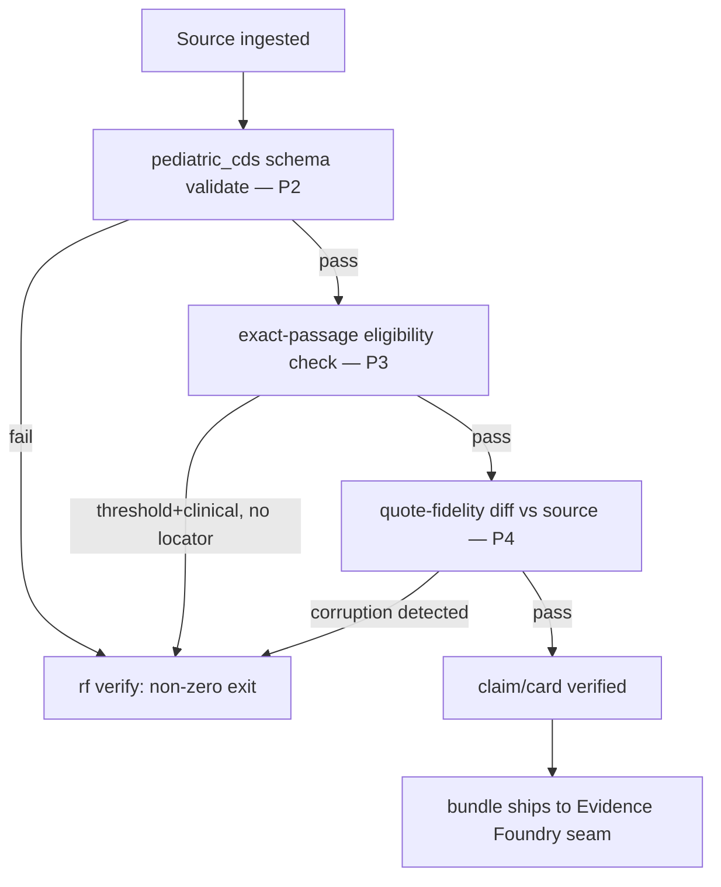

# Feature Brief & Metadata

**Feature Name:**

> RFUP External-Routing Gap Closure

**Filepath Name:**

> `rfup-external-routing-v1`

**Date:**

> 2026-07-22

**Author:**

> prd-writer (Sonnet 5)

**Related Epic(s)/PRD ID(s):**

> IntentTree work-area `RFUP` (`node_01KXRTYKKW9ECTF9MCBQ8JV1EB`); prior PRD `rf-upstream-evidence-foundry-v1` (RFUP-1..5,7, landed `001a834`, `status: completed`).

**Related Documents:**

> - `docs/project_plans/PRDs/enhancements/rf-upstream-evidence-foundry-v1.md` (prior, completed — do not re-scope)
> - `docs/project_plans/design-specs/rfup-6-native-discovery-adapters.md` (deferred-item placeholder this PRD's P5/P6 update)
> - `.claude/worknotes/rfup-external-routing/scope-brief.md` (authoritative scope synthesis)
> - `.claude/worknotes/rfup-external-routing/state-audit.md` (authoritative current-state audit, file:line)
> - ADR-0008 (`pediatric-anemia-site`, `proposed`, not accepted — read-only reference)

---

## 1. Executive Summary

RFUP-1..5,7 landed on `main` at `001a834`, closing six of the seven upstream `rf` enhancements the Evidence Foundry seam (pediatric-anemia-site CDS) needs. This PRD is a **delta plan** closing what remains: (1) a hard-gated JSON Schema for the `pediatric_cds` evidence-card block, replacing today's `additionalProperties: true` permissiveness; (2) an auto-strict eligibility filter so threshold/clinical claims default to `exact_passage_mode: strict` without an explicit flag; (3) a test suite for the already-parameterized Path-B workflow scripts (`rf-run-execute.js`, `rf-pediatric-cds-run-execute.js`), which have zero run-date/path-injection tests today; (4) a **new** quote-content-fidelity check catching character-level source corruption (e.g. PMC stripping superscripts, `×10⁹/L` → `×10/L`) that no scoped item covers; and (5) an eval-only native-adapter evaluation producing an accept/reject verdict on ADR-0008, with no install and no live external calls.

**Priority:** HIGH

**Key Outcomes:**
- Outcome 1: Pediatric/clinical evidence cards fail fast at ingest/verify when structurally incomplete, instead of silently passing through an `additionalProperties: true` gap.
- Outcome 2: Threshold claims feeding CDS rules get exact-passage enforcement by default for clinical-eligible claims, closing the "opt-in strict mode" gap.
- Outcome 3: A previously-untested orchestration surface (Path-B date/path handling) gets regression coverage before it runs unattended (unblocks `DF-E1-02`).
- Outcome 4: A previously-uncovered corruption class (character-level quote fidelity) gets detection, closing an open edge no RFUP item names.
- Outcome 5: Native-adapter installation stays governance-gated — this PRD produces the evaluation artifact the gate requires, without pre-authorizing an install.

---

## 2. Context & Background

### Current State

Per `.claude/worknotes/rfup-external-routing/state-audit.md` (full evidence trail, file:line):

| Item | Status | Detail |
|------|--------|--------|
| 1. Pediatric schema validator | **Absent** | No quote-content-fidelity or schema-completeness check for `pediatric_cds` blocks exists; `ExtractionStatus` is a retrieval-completeness signal, not content validation. |
| 2. Exact-passage hard-gate | **Done, warn-only by default** | `resolve_exact_passage_mode()` + the `exact_passage_present` check (`verification.py:412-461`, `:712-753`) are fully wired; `strict` mode hard-gates, but the shipped default is `warn`, and there is no eligibility filter that auto-selects `strict` for threshold/clinical claims. |
| 3. Path-B parameterization | **Done, untested** | `rf-run-execute.js` and `rf-pediatric-cds-run-execute.js` are fully args-driven (`resolvePath()`, `stampFromTimestamp()`); zero test files reference either script or its date-stamp fallback logic. |
| 4. Native adapters | **Scaffold-only, 0/6 evaluated** | 8 adapters registered in `adapters/__init__.py`; only `arc_council` is live. `litellm_router.py` got an ICA-provider config-mapping fix (`2d198a8`, pre-dates this branch) but `litellm` remains uninstalled — `available()` is always `False`. No value/security evaluation exists on file for any of the 6 non-`arc_council` adapters. |
| NEW — quote-content fidelity | **Absent, uncovered by any RFUP item** | `check_anchor_hash_match` (`verification.py:1051-1099`) only detects post-hoc tampering of an already-stored quote — it cannot catch corruption introduced at extraction time (e.g. a PMC extractor silently normalizing superscript digits). |

### Problem Space

The Evidence Foundry seam (pediatric-anemia-site's CDS rule pipeline) consumes `rf` bundles as its research substrate. Three gaps block it from treating those bundles as release-ready without downstream re-validation: an ingest-time schema hole (any well-formed-JSON `pediatric_cds` block passes, regardless of completeness), a default-off hard gate (threshold claims can ship without an exact passage unless a run explicitly opts into `strict`), and an unattended-scheduling blocker (Path-B has never been asserted against a regression test, so its behavior under malformed/injected date or path args is unverified going into `DF-E1-02`'s scheduled cadence). A fourth, previously-unnamed gap — character-level quote corruption from source extraction — was surfaced independently (a verified pediatric-CDS batch run found PMC stripping superscripts) and is not covered by any of the three scoped items.

### Current Alternatives / Workarounds

The downstream CDS converter (`tools/rf-bundle-to-kb-pack/` in pediatric-anemia-site) already performs post-hoc completeness/fidelity checks on the material it receives. This is a workaround, not a fix: it means every gap this PRD closes is currently caught late (if at all) rather than at the `rf` ingest/verify boundary where the evidence-first design intends it to be caught. The `--exact-passage strict` CLI flag already exists as an opt-in workaround for gap 2; it is not the shipped default.

### Architectural Context

This is backend/CLI Python work in `src/research_foundry` (services layer: `verification.py`, `source_cards.py`) plus one JS workflow test-suite addition (`.claude/workflows/`) plus a docs-only eval artifact (P5/P6). No new frontend surface. No database schema changes. Follows the existing evidence pipeline's own stage sequence (ingest → extract → claim-map → verify → council → bundle) rather than a routers→services→repositories layering — this project's `rf verify` gate pattern (config-resolved mode + CLI override + fail-closed on invalid values) is the established idiom to extend, per `resolve_exact_passage_mode()`.

---

## 3. Problem Statement

**User Story Format:**
> "As the Evidence Foundry seam (pediatric-anemia-site), when I consume an `rf` bundle as my CDS research substrate, I need structurally-complete pediatric evidence-card blocks, exact-passage-enforced threshold claims, character-fidelity-verified quotes, and a regression-tested unattended discovery path, instead of discovering these gaps downstream in my own converter after the bundle already shipped as 'verified'."

**Technical Root Cause:**
- `additionalProperties: true` on the `pediatric_cds` block (schema exists nowhere as a formal artifact — the block is currently unschematized).
- `exact_passage_mode` defaults to `warn`, with no eligibility filter distinguishing "this claim feeds a clinical threshold rule" from "this is a research-only bundle."
- No test file references `rf-run-execute.js`, `rf-pediatric-cds-run-execute.js`, or `stampFromTimestamp` — parameterization shipped without regression coverage.
- `check_anchor_hash_match` operates on the already-ingested quote; nothing diffs that quote against the source document's original rendering.
- Files: `src/research_foundry/services/verification.py`, `src/research_foundry/services/source_cards.py`, `.claude/workflows/rf-run-execute.js`, `.claude/workflows/rf-pediatric-cds-run-execute.js`, `src/research_foundry/adapters/litellm_router.py`.

---

## 4. Goals & Success Metrics

### Primary Goals

**Goal 1: Structural completeness at the seam boundary**
- Replace `additionalProperties: true` for `pediatric_cds` with a formal JSON Schema; hard-gate at ingest/verify.
- Success: 100% of a red-team malformed-block fixture set fails; 0 false positives against the 7 existing verified pediatric-CDS bundles.

**Goal 2: Default-safe exact-passage enforcement**
- Threshold/clinical-eligible claims get `strict` passage enforcement without requiring an explicit CLI flag.
- Success: eligible claims fail-closed without a locator; non-eligible (non-clinical) claims retain today's warn-only behavior — 0 regressions.

**Goal 3: Regression-tested unattended discovery**
- Path-B's date/path handling has test coverage before `DF-E1-02`'s scheduled cadence runs unattended.
- Success: run-date parsing (valid/malformed/absent) and path-injection (override precedence, no traversal escape) are asserted in a test suite.

**Goal 4: Character-level quote fidelity**
- Detect and gate on source-extraction corruption that silently alters a quoted value.
- Success: the PMC superscript-stripping case is caught; safe normalizations (e.g. NFKC, quote-mark style) are not false-flagged.

**Goal 5: Governance-gated native-adapter verdict**
- Produce a citable accept/reject verdict on ADR-0008 (litellm_router) without installing anything or using credentials.
- Success: a verdict + install/wiring plan exists; 0 live network calls or credential use during the evaluation itself.

### Success Metrics

| Metric | Baseline | Target | Measurement Method |
|--------|----------|--------|-------------------|
| `pediatric_cds` malformed-block detection rate | 0% (schema absent) | 100% on red-team fixture set | New schema-validation test suite |
| False-positive rate on existing verified bundles (P2) | N/A | 0% | Re-run schema validator against the 7 verified pediatric-CDS bundles |
| Threshold-claim strict-mode default coverage | 0% (opt-in only) | 100% of clinical-eligible threshold claims | New eligibility-filter test suite |
| Path-B test coverage | 0 test files | >=1 test file per script, covering date + path-injection cases | `./.venv/bin/python -m pytest` / JS test runner used by sibling workflow tests |
| Quote-fidelity detection (PMC fixture) | Not detected | Detected | New fidelity-check test suite |
| Native external calls/credentials during P5 | N/A | 0 | Evaluation-artifact review (no runtime dependency install, no `RF_LLM_API_KEY` use) |

---

## 5. User Personas & Journeys

### Personas

**Primary Persona: Evidence Foundry Seam Consumer (pediatric-anemia-site CDS converter)**
- Role: Downstream system consuming verified `rf` bundles as its rule-authoring substrate.
- Needs: Structurally-complete, exact-passage-verified, character-fidelity-verified evidence before treating a bundle as release-ready.
- Pain Points: Currently re-validates completeness/fidelity itself post hoc because `rf` doesn't hard-gate these upstream.

**Secondary Persona: `rf` operator running unattended discovery**
- Role: Runs Path-B (`rf-run-execute.js` family) on a schedule for `DF-E1-02`'s full CBC 12-angle operation.
- Needs: Confidence that date/path handling behaves correctly without a human watching each run.
- Pain Points: No regression coverage today — a date-parsing regression would only surface at actual scheduled-run time.

### High-level Flow

---

## 6. Requirements

### 6.1 Functional Requirements

| ID | Requirement | Priority | Notes |
| :-: | ----------- | :------: | ----- |
| FR-1 | Add run-date parsing tests for `stampFromTimestamp()` (valid ISO, malformed, absent→fallback) in `rf-run-execute.js` and `rf-pediatric-cds-run-execute.js`. | Must | P1. No new script logic — tests only, per state-audit "parameterization complete, no test coverage." |
| FR-2 | Add path-injection/override-precedence tests for `resolvePath()`-style arg resolution (RF/repo/TMP overrides win over literal fallback defaults; no path-traversal escape from invocation cwd). | Must | P1. |
| FR-3 | Author a formal JSON Schema for the `pediatric_cds` block (`source_status`, `study`, `applicability`, `laboratory`, `implementable_statement`, `diagnostic_accuracy`, `safety`, `conflict`, `lifecycle`), replacing `additionalProperties: true`. | Must | P2. Schema shape/semantics owned by pediatric-anemia-site; `rf` validates structural completeness only — see §7 seam boundary. |
| FR-4 | Wire the schema as a hard-gate check in `rf verify` (and/or `rf ingest`) — malformed/incomplete `pediatric_cds` blocks fail with a non-zero exit, mirroring the existing `exact_passage_present` fail-closed pattern. | Must | P2. |
| FR-5 | Add an eligibility filter that auto-selects `exact_passage_mode: strict` for claims with `assertion_kind: threshold` AND a clinical-sensitivity signal (see OQ-1), independent of the run's configured/CLI `--exact-passage` value. | Must | P3. |
| FR-6 | Set a documented default policy (config default in `config/claim_policy.yaml` and/or CLI default) so pediatric/CDS runs get FR-5's behavior without extra flags. | Should | P3. |
| FR-7 | Add a quote-content-fidelity check comparing an extracted quote's characters against the stored full-text source rendering (where available), flagging/failing on material corruption. | Must | P4 (new). |
| FR-8 | Define and apply a normalization allowlist distinguishing safe transforms (e.g. NFKC, whitespace, quote-style) from material corruption (e.g. superscript-digit stripping that changes a numeric value). | Must | P4. See OQ-3. |
| FR-9 | Produce a native-adapter (`litellm_router`) evaluation artifact: accept/reject verdict on ADR-0008, with an install/wiring plan, using static/documentation review only. | Must | P5. No install, no live external calls, no credentials — see §7 hard constraints. |
| FR-10 | Update `docs/project_plans/design-specs/rfup-6-native-discovery-adapters.md` with the P5 verdict and reaffirmed defer-until triggers for the remaining deferred adapters (`claude_agent_sdk`, `gpt_researcher`, `paperqa2`, `opencode`, and `litellm_router` if rejected). | Must | P6. |
| FR-11 | Add a CHANGELOG `[Unreleased]` entry covering all five phases' user-facing/operator-facing changes. | Must | P6. `changelog_required: true`. |

### 6.2 Non-Functional Requirements

**Performance:**
- Schema validation (P2) and eligibility filtering (P3) add negligible per-claim overhead (no new I/O; operates on already-loaded structures).
- Quote-fidelity diffing (P4) must not scale worse than linear in source-text length; cap comparison scope to the source card's stored full text (no new live fetch).

**Security:**
- P5 performs zero live network calls and uses zero credentials — evaluation is static/documentation-based only (see OQ-4).
- No secrets, keys, or provider credentials are introduced by any phase in this PRD.

**Reliability:**
- New hard gates (P2, P3 default, P4) must fail closed on ambiguous/invalid input (mirroring `resolve_exact_passage_mode`'s existing `RFError` pattern for bad override values) — never silently pass.
- P3's auto-strict eligibility filter must not regress existing non-clinical warn-mode runs (0 false-positive hard-gates on non-eligible claims).

**Observability:**
- Every new gate failure (P2, P3, P4) emits a structured `rf verify` finding with a distinguishable reason code, consistent with existing `add(..., "fail"/"warn", ...)` emission conventions in `verification.py`.

---

## 7. Scope

### In Scope

- P1: Run-date + path-injection tests for `rf-run-execute.js` and `rf-pediatric-cds-run-execute.js` only (no new script functionality).
- P2: Formal JSON Schema for the `pediatric_cds` block + hard-gate wiring at ingest/verify.
- P3: Exact-passage auto-strict eligibility filter for threshold/clinical claims + a documented default policy.
- P4 (new): Quote-content-fidelity check (detect/normalize/gate character-level source corruption).
- P5: Eval-only native-adapter (litellm_router) evaluation + ADR-0008 accept/reject verdict, with an install/wiring plan artifact.
- P6: CHANGELOG `[Unreleased]` entry; design-spec update for deferred items; context-file pointers.

### Out of Scope

- **Re-scoping RFUP-1..5,7** — already landed on `main` at `001a834`; this PRD does not re-litigate or re-implement any of that work.
- **Any CDS-specific logic in `rf`** — FHIR/terminology mapping, rule-DSL compilation, threshold-value extraction into executable rule logic, signing/key custody/KB release-registry mechanics, clinical review/dual-clinician sign-off, patient-specific inference or autonomous diagnosis/dosing/treatment directives. All of these stay in pediatric-anemia-site's converter and clinical-review workflow.
- **Installing any native adapter** (`litellm`, `gpt_researcher`, `paperqa2`, `opencode`, etc.) — P5 is evaluation-only; installation (if ever authorized) is a separate future PRD gated on this PRD's verdict.
- **Any live external call or credential use** during P5's evaluation.
- **A second evidence crawler or source-card database** — remains a non-goal on both sides of the seam.
- **Editing the `pediatric-anemia-site` repo** — including ADR-0008's status transition (see OQ-5); this PRD produces rf-side artifacts only.
- **A fresh pre-PRD SPIKE** — items 1-3's design is already settled (DF-E1-03, ADR-0008, existing RFUP-1/3 code); item 4 is delivered eval-only and doubles as this plan's Tier-3 SPIKE.
- **The `pediatric_cds` block's clinical semantics** (age partitions, lab/method/analyzer fields, threshold portability, lifecycle/review-by content) — pediatric-anemia-site authors and owns this content; `rf` validates structural completeness of whatever is supplied, not clinical correctness.

### Hard Constraints

1. **Seam boundary**: only evidence→verified-claim logic goes upstream into `rf`; CDS-specific FHIR/rule-DSL/signing logic never crosses into `rf`, in either direction.
2. **No fresh pre-PRD SPIKE**: items 1-3 reuse settled design (DF-E1-03/ADR-0008/existing RFUP specs); item 4 is delivered eval-only and serves as this plan's Tier-3 SPIKE.
3. **Mode-D avoidance**: this plan stays out of Mode-D execution territory — P5 is eval-only (no install, no live external calls, no credentials), so no auth/payment/deletion/migration/credential-use code path is exercised by this plan.

---

## 8. Dependencies & Assumptions

### External Dependencies

- **pediatric-anemia-site repo (read-only reference)**: source of the `pediatric_cds` block shape, ADR-0008, and the DF-E1-03 design spec. Not modified by this PRD.
- **7 existing verified pediatric-CDS bundles** (per project memory, `rf-pediatric-cds-run-execute.js`-produced, committed `aaa9d92`): used as the P2/P4 no-false-positive regression fixture set.

### Internal Dependencies

- **RFUP-1..5,7** (`rf-upstream-evidence-foundry-v1`, `status: completed`, landed `001a834`): P2's hard-gate reuses the machine-contract/schema-versioning work from that plan's Phase 1; P3 extends `resolve_exact_passage_mode()` from that plan's Phase 2.
- **`litellm_router.py`'s ICA-provider mapping fix** (`2d198a8`, pre-dates this branch, already on `main`-side history): P5 evaluates the adapter as it exists today, including this fix.

### Assumptions

- The `pediatric_cds` block field list enumerated in the scope-brief (§1: `source_status`, `study`, `applicability`, `laboratory`, `implementable_statement`, `diagnostic_accuracy`, `safety`, `conflict`, `lifecycle`) is stable enough to schema-ize now, even though `rf` doesn't own its clinical semantics.
- "Clinical-eligible" claim status (OQ-1) can be derived from fields already present on a claim/card (`assertion_kind`, presence of a `pediatric_cds` block, or an existing sensitivity tag) without introducing new schema fields.
- The quote-fidelity check (P4) operates only on already-ingested/stored source text — no new live fetch or re-crawl is introduced.

### Feature Flags

- None required — all four gates (P2 schema, P3 default policy, P4 fidelity check) are additive checks on the existing `rf verify`/`rf ingest` surface, controllable via existing config/CLI override patterns (`config/claim_policy.yaml`, `--exact-passage`).

---

## 9. Risks & Mitigations

| Risk | Impact | Likelihood | Mitigation |
| ----- | :----: | :--------: | ---------- |
| P3's auto-strict eligibility heuristic is too broad and hard-gates non-clinical runs that never asked for strict mode. | High | Medium | Scope the trigger narrowly (assertion_kind=threshold AND an explicit clinical-sensitivity signal, not threshold alone — resolve via OQ-1); pilot against existing non-clinical regression runs before defaulting on. |
| P2's schema is stricter than what pediatric-anemia-site currently emits, breaking existing verified bundles. | High | Medium | Validate the new schema against all 7 existing verified pediatric-CDS bundles as a 0-false-positive gate before hard-gating by default; treat any bundle-breaking field as a schema-authoring bug, not a downstream bug. |
| P4's fidelity diff produces false positives on legitimate paraphrase, OCR noise, or benign Unicode variation. | Medium | Medium | Define and test the normalization allowlist (FR-8/OQ-3) before hard-gating; pilot in warn mode against the 7 verified bundles first. |
| P4 has no source text to diff against for `extraction_status: locator_only` cards. | Medium | High | Resolve via OQ-2; default to a non-blocking signal (warn or skip, not fail) for locator-only cards until a full-text capture exists. |
| P5's "no install, no live calls" constraint limits how deep the security evaluation can go, producing a weak verdict. | Medium | Medium | Use static PyPI/GitHub metadata review + `pip download --no-deps` dependency-tree inspection (resolve exact method via OQ-4) as the evaluation floor; document evaluation-method limitations explicitly in the verdict artifact so reviewers can judge confidence. |
| P1's new tests exercise real `rf`/filesystem paths and become flaky or environment-coupled. | Low | Low | Mock `rf_bin`/`repo`/`tmp` args; assert only resolution/precedence logic, no live `rf` invocation or network access in the test suite. |

---

## 10. Target State (Post-Implementation)

**User Experience:**
- Operators running pediatric/CDS discovery get fail-fast, actionable `rf verify` errors for incomplete evidence-card blocks, missing exact passages on threshold claims, and corrupted quotes — instead of these gaps surfacing later in the downstream converter.
- Scheduled unattended Path-B runs (`DF-E1-02`) have regression-tested date/path handling before they run without a human present.

**Technical Architecture:**
- `pediatric_cds` blocks are validated against a formal JSON Schema at ingest/verify, hard-gating structural incompleteness.
- Threshold/clinical-eligible claims default to `exact_passage_mode: strict` without requiring `--exact-passage strict`.
- A new fidelity-check stage sits alongside the existing anchor-hash-drift check in the verify pipeline, diffing extracted quotes against stored source text.
- The native-adapter evaluation produces a durable artifact (updated design-spec + ADR-0008 verdict) governing whether/when `litellm_router` (or any other adapter) may later be installed.

**Observable Outcomes:**
- `rf verify` exit codes distinguish the four new gate classes (schema-incomplete, passage-missing-eligible, quote-corrupted) with structured reason codes.
- CHANGELOG `[Unreleased]` documents all five phases' operator-facing behavior changes.
- The RFUP design-spec register (`rfup-6-native-discovery-adapters.md`) reflects a concrete verdict instead of an open placeholder.

---

## 11. Overall Acceptance Criteria (Definition of Done)

### Functional Acceptance

- [ ] All functional requirements (FR-1 through FR-11) implemented.
- [ ] P2 schema hard-gates 100% of a red-team malformed-block fixture set (>=5 cases) with 0 false positives against the 7 existing verified pediatric-CDS bundles.
- [ ] P3's auto-strict eligibility filter hard-gates threshold/clinical-eligible claims lacking a locator, with 0 regressions against existing non-clinical warn-mode runs.
- [ ] P4's fidelity check detects the PMC superscript-stripping fixture case, with 0 false positives against the 7 verified bundles.
- [ ] P1's test suite covers: valid ISO timestamp parsing, malformed timestamp → fallback, absent timestamp → fallback, path-override precedence, and no path-traversal escape — for both `rf-run-execute.js` and `rf-pediatric-cds-run-execute.js`.
- [ ] P5 produces an accept/reject verdict on ADR-0008 with an install/wiring plan; the evaluation record shows 0 live external calls and 0 credential use.

### Technical Acceptance

- [ ] New gate checks follow the existing fail-closed convention (`RFError` on invalid config; `add(..., "fail", ...)` + `unsupported[]` append pattern) already established by `resolve_exact_passage_mode`/`exact_passage_present`.
- [ ] Schema validation and eligibility filtering introduce no new live network I/O.
- [ ] All new/changed config surfaces (`config/claim_policy.yaml` defaults) are documented in the implementation plan and CHANGELOG.

### Quality Acceptance

- [ ] `./.venv/bin/python -m pytest` passes for all new/changed Python test files (never bare `pytest`, per project convention).
- [ ] New JS test coverage for P1 runs cleanly (no live `rf` binary invocation, no network access).
- [ ] No regressions in the existing pediatric-CDS regression suite (7 verified bundles) across P2, P3, P4.

### Documentation Acceptance

- [ ] CHANGELOG `[Unreleased]` entry present, categorized per `.claude/specs/changelog-spec.md`.
- [ ] `docs/project_plans/design-specs/rfup-6-native-discovery-adapters.md` updated with the P5 verdict and reaffirmed defer-until triggers for remaining deferred adapters.
- [ ] Context-file pointers added where P2/P3/P4 change agent-relevant `rf verify` behavior.

---

## 12. Assumptions & Open Questions

### Assumptions

- The `pediatric_cds` field list from the scope-brief is stable enough to schema-ize now (see §8).
- "Clinical-eligible" claim status is derivable from existing fields without new schema additions.
- P4 operates only on already-ingested source text — no new live fetch.

### Open Questions

- [ ] **OQ-1**: Eligibility trigger for P3 auto-strict — `assertion_kind: threshold` alone, or threshold + clinical-sensitivity signal?
  - **A**: TBD — recommend threshold + clinical-sensitivity signal to avoid over-broad hard-gating (see Risks).
- [ ] **OQ-2**: P4 behavior for `extraction_status: locator_only` cards with no full text to diff against — skip, warn, or fail?
  - **A**: TBD — recommend warn/skip, not fail, until full-text capture exists for that card.
- [ ] **OQ-3**: Canonical normalization allowlist for P4 (safe transforms vs. material corruption)?
  - **A**: TBD — implementation plan must enumerate the allowlist explicitly before P4 hard-gates by default.
- [ ] **OQ-4**: Concrete, citable evaluation method for P5 given the no-install/no-credentials constraint?
  - **A**: TBD — candidate: static PyPI/GitHub metadata review + `pip download --no-deps` dependency-tree inspection.
- [ ] **OQ-5**: Does P5 touch ADR-0008's status in the pediatric-anemia-site repo, or produce an rf-side-only artifact?
  - **A**: Recommend rf-side-only artifact; downstream ADR-0008 status transition is out of scope here (seam boundary).

---

## 13. Appendices & References

### Related Documentation

- **PRD (prior, completed)**: `docs/project_plans/PRDs/enhancements/rf-upstream-evidence-foundry-v1.md`
- **Implementation Plan (prior, completed)**: `docs/project_plans/implementation_plans/enhancements/rf-upstream-evidence-foundry-v1.md`
- **Design Spec (deferred-item placeholder, to be updated by P6)**: `docs/project_plans/design-specs/rfup-6-native-discovery-adapters.md`
- **ADR-0008** (`pediatric-anemia-site`, `proposed`): Path-B hardening vs. native adapter — recommends Path-B hardening first, defers native-adapter install until a measured value/security gap exists.
- **DF-E1-03 design spec** (`pediatric-anemia-site`): joint design for items 1-2 (pediatric schema validator + exact-passage hard-gate).

### Symbol References

- `src/research_foundry/services/verification.py`: `resolve_exact_passage_mode` (412-461), `exact_passage_present` check (712-753), `check_anchor_hash_match` (1051-1099), `_index_source_cards` (273-303).
- `src/research_foundry/services/source_cards.py`: `ExtractionStatus` enum (37-49).
- `src/research_foundry/adapters/litellm_router.py`: module docstring (1-16), ICA-provider mapping (28-42).
- `.claude/workflows/rf-run-execute.js`: `resolvePath()` / path+date resolution (16-38).
- `.claude/workflows/rf-pediatric-cds-run-execute.js`: parameterized path/stamp resolution (26-29).

### Prior Art

- `.claude/worknotes/rfup-external-routing/scope-brief.md` — full item-by-item scope synthesis with seam-boundary framing.
- `.claude/worknotes/rfup-external-routing/state-audit.md` — full current-state audit with file:line evidence.

---

## Implementation

### Phased Approach

**Phase 1: Path-B test hardening**
- Tasks:
  - [ ] Add `stampFromTimestamp()` parsing tests (valid/malformed/absent) — FR-1.
  - [ ] Add `resolvePath()`/arg-override precedence + no-traversal tests — FR-2.

**Phase 2: Pediatric evidence-card JSON Schema + validator hard-gate**
- Tasks:
  - [ ] Author formal JSON Schema for the `pediatric_cds` block — FR-3.
  - [ ] Wire hard-gate check into `rf verify`/`rf ingest` — FR-4.
  - [ ] Validate against 7 existing verified bundles (0 false positives) + red-team fixture set (100% detection).

**Phase 3: Exact-passage eligibility + threshold-claim hard-gate default**
- Tasks:
  - [ ] Implement clinical-eligibility filter (resolve OQ-1) — FR-5.
  - [ ] Set default policy in `config/claim_policy.yaml` — FR-6.
  - [ ] Regression-test against existing non-clinical warn-mode runs.

**Phase 4: Quote-fidelity check (new)**
- Tasks:
  - [ ] Implement quote-vs-source diff check — FR-7.
  - [ ] Define normalization allowlist (resolve OQ-3) — FR-8.
  - [ ] Resolve locator-only eligibility behavior (OQ-2).
  - [ ] Validate against PMC superscript fixture + 7 verified bundles (0 false positives).

**Phase 5: Native-adapter SPIKE + ADR-0008 verdict (eval-only)**
- Tasks:
  - [ ] Resolve evaluation method (OQ-4); no install, no live calls, no credentials.
  - [ ] Produce accept/reject verdict on ADR-0008 + install/wiring plan — FR-9.

**Phase 6: Docs/deferrals finalization**
- Tasks:
  - [ ] CHANGELOG `[Unreleased]` entry — FR-11.
  - [ ] Update `rfup-6-native-discovery-adapters.md` design spec with P5 verdict + reaffirmed defer-until triggers — FR-10.
  - [ ] Context-file pointers for new `rf verify` gate behavior.

### Epics & User Stories Backlog

| Story ID | Short Name | Description | Acceptance Criteria | Estimate |
|----------|-----------|-------------|-------------------|----------|
| RFUP-EXT-1 | Path-B test hardening | Run-date + path-injection tests for both workflow scripts | FR-1, FR-2 | 3 pts |
| RFUP-EXT-2 | Pediatric schema validator | JSON Schema + hard-gate for `pediatric_cds` block | FR-3, FR-4 | 5 pts |
| RFUP-EXT-3 | Exact-passage auto-strict | Eligibility filter + default policy for threshold/clinical claims | FR-5, FR-6 | 4 pts |
| RFUP-EXT-4 | Quote-fidelity check | Character-level corruption detection vs. source text | FR-7, FR-8 | 8 pts |
| RFUP-EXT-5 | Native-adapter eval | Eval-only ADR-0008 verdict + install/wiring plan | FR-9 | 4 pts |
| RFUP-EXT-6 | Docs/deferrals finalization | CHANGELOG + design-spec update | FR-10, FR-11 | 2 pts |

---

**Progress Tracking:**

See progress tracking (once implementation plan is authored): `.claude/progress/rfup-external-routing/all-phases-progress.md`
