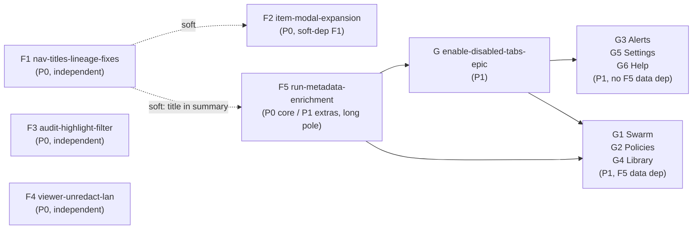

# EPIC: Runs-Viewer v2.2 Polish

**Feature Name:** Runs-Viewer v2.2 Polish

**Filepath:** `runs-viewer-v2.2-polish-epic-v1`

**Date:** 2026-06-20

**Author:** Nick Miethe (Opus orchestration)

**Epic slug:** `runs-viewer-v2.2-polish`

---

## 1. Executive summary

The runs-viewer facelift shipped partially in v2.1. Several core UX items remain broken or absent (no readable titles, broken lineage edges, inconsistent default tab, nav/routing bug, no item-expand modals), and three new asks have landed (audit highlight state machine + sticky report header, LAN unredaction, run linked-metadata model). This epic finishes the facelift and adds the metadata foundation required to unlock the six hard-disabled nav tabs.

**Priority:** HIGH

**Key outcomes:**
- Every run has a readable title, a stable nav flow, and working lineage graph edges (F1).
- Any item (run, claim, lineage node) can be expanded into a full stacked modal (F2).
- Audit tab has a proper highlight/filter state machine and a locked report header (F3).
- The LAN-only viewer shows all content without redaction markers (F4).
- Runs carry a first-class linked-metadata model (projects, category, tags) surfaced everywhere (F5).
- The six hard-disabled nav tabs (Library, Swarm, Policies, Alerts, Settings, Help) are enabled (G/G1–G6).

---

## 2. Context & background

### Current state

The runs-viewer is a read-only React SPA (`frontend/runs-viewer`) deployed LAN-only at `10.42.10.76:3030`. Data is a static export: `prebuild-static-data.mjs` calls `rf run export --all`, copies `runs/<id>/run.json` → `public/data/<id>/run.json` plus `public/data/index.json`; Vite bundles it. The viewer never mutates RF data.

v2.1 was shipped by Codex, but verification revealed:
- Portfolio table shows `run_id` slugs instead of human-readable titles (`deriveRunTitle` exists in `lib/runs.ts:193-202` but `RFRunSummary` lacks the fields it needs).
- Lineage graph edges are invisible: `LineageFlow.tsx` registers `nodeTypes` but not `edgeTypes`; React Flow v12 silently drops unregistered `smoothstep` edges.
- Default detail tab is `'trust'` (`coerceDetailTab` fallback, `detailTabs.ts:8`) instead of Overview; modal and page modes are inconsistent.
- Clicking a run card updates nav state without reliably opening the run (routing/state seam, `RunList.tsx:~333-336`).
- No double-click / expand-button path from run cards, lineage nodes, or ledger rows to a full overlay modal.
- Audit tab: LedgerFacets filters the left table only; highlights never propagate to the report pane. Report pane title scrolls away with the body.
- Six hard-disabled top-level nav tabs (`AppShell.tsx:~24-35`): Library, Swarm, Policies, Alerts, Settings, Help.
- Redaction markers visible on a personal LAN-only deployment where unredacted source truth exists at `runs/*/sources/*.md`.
- Runs carry no linked projects, category, or tags — backlog linkage is one-directional (idea → run) and is not threaded into the export.

### Architectural constraints

- **Static re-export discipline.** Export field additions require `rf run export --all` + `pnpm --filter runs-viewer build`. Plans adding export fields MUST include a "re-export + rebuild" task.
- **Export-threading is explicit.** `export_service.py:export_run()` (~lines 417-436) builds the run.json dict field-by-field. New `run.yaml` fields require explicit threading into the export dict, then `index.json` summary, then hand-written TS types at `frontend/runs-viewer/src/types/rf/run-export.ts`.
- **TS types are hand-written.** `run-export.ts` is not codegen'd. Sync manually unless the F5 codegen step is adopted.
- **Viewer is read-only.** It never mutates RF data; un-redaction works by changing the export threshold and re-exporting.

---

## 3. Problem statement

> "As a researcher using the LAN viewer, I see machine-readable run IDs instead of titles, invisible lineage edges, broken default navigation, no way to expand items into full modals, a broken audit highlight state machine, redaction markers on my own personal data, no run metadata (project/category/tags), and six nav tabs that do nothing — making the viewer unreliable and significantly harder to use than it should be."

**Technical root causes (summarized):**
- Missing `title` field in `RFRunSummary` / `index.json` export.
- `edgeTypes` not registered in `LineageFlow.tsx`.
- `coerceDetailTab` fallback hardcoded to `'trust'` (`detailTabs.ts:8`).
- `setModalRunId` state update without route change causes nav/highlight desync.
- No `<DetailModal stacked>` component or double-click / expand-button wiring.
- `LedgerFacets` does not propagate active-facet claim IDs to `ReportRenderer`.
- `foundry.yaml viewer.sensitivity_threshold` defaults to `public`; `RFResolvedSource` TS type missing `redacted?: boolean`.
- `run.yaml` `project` field is never threaded to export; backlog `links.run_id` inversion not implemented.
- Six nav items hard-disabled in `AppShell.tsx NAV_ITEMS`.

---

## 4. Goals & success metrics

### Primary goals

| Goal | Success signal |
|------|---------------|
| Trustworthy list view | Every run card shows a readable title; clicking reliably opens the run |
| Working lineage graph | Connector lines visible in graph view; render test passes |
| Correct navigation defaults | Detail tab defaults to Overview in both page and modal mode |
| Item expansion | Double-click or expand button opens any item in a stacked modal |
| Audit highlight | Selecting facets highlights matching claims in the report pane; state machine covers all 4 states |
| Sticky report header | Report pane title/ID locked; only body scrolls |
| Full LAN content | Zero `[redacted:sensitivity]` markers after re-export + rebuild |
| First-class run metadata | Linked projects, category, tags surfaced in list, cards, detail, modal |
| All tabs enabled | All 6 hard-disabled nav tabs reachable; sensible empty state when data absent |

### Success metrics

| Metric | Baseline | Target | Method |
|--------|----------|--------|--------|
| Runs with readable title in Portfolio | 0% | 100% | Visual smoke on deployed viewer |
| Lineage graph edge `<path>` elements rendered | 0 | ≥1 per graph with sources | Render-level test |
| Redaction markers visible post-rebuild | N (many) | 0 | grep `[redacted:sensitivity]` in exported data |
| P0 workstreams (F1–F4 + F5 core) merged | 0/5 | 5/5 | PR merge checklist |
| All 6 hard-disabled tabs reachable | 0/6 | 6/6 | Manual navigation smoke |

---

## 5. Workstreams

### 5.1 Workstream table

| # | Slug | Tier | Doc path | Priority | Depends on | Status |
|---|------|------|----------|----------|-----------|--------|
| E0 | `runs-viewer-v2.2-polish-epic` | epic | `PRDs/enhancements/runs-viewer-v2.2-polish-epic-v1.md` | — | — | planned |
| F1 | `nav-titles-lineage-fixes` | 1 | `feature_contracts/harden-polish/nav-titles-lineage-fixes.md` | P0 | — | planned |
| F2 | `item-modal-expansion` | 1 | `feature_contracts/features/item-modal-expansion.md` | P0 | F1 (soft: title helpers) | planned |
| F3 | `audit-highlight-filter-and-sticky-report` | 1 | `feature_contracts/harden-polish/audit-highlight-filter-and-sticky-report.md` | P0 | — | planned |
| F4 | `viewer-unredact-lan` | 1 | `feature_contracts/harden-polish/viewer-unredact-lan.md` | P0 | — | planned |
| F5 | `run-metadata-enrichment` | 3 | `PRDs/features/run-metadata-enrichment-v1.md` + `implementation_plans/features/run-metadata-enrichment-v1.md` | P0 (core) / P1 (enrichment extras) | F1 (soft: title in summary) | planned |
| G | `enable-disabled-viewer-tabs-epic` | epic | `PRDs/features/enable-disabled-viewer-tabs-epic-v1.md` | P1 | F5 (data-dependent tabs) | planned |
| G1 | `viewer-tab-swarm` | 1 | `feature_contracts/features/viewer-tab-swarm.md` | P1 | G, F5 | planned |
| G2 | `viewer-tab-policies` | 1 | `feature_contracts/features/viewer-tab-policies.md` | P1 | G, F5 | planned |
| G3 | `viewer-tab-alerts` | 1 | `feature_contracts/features/viewer-tab-alerts.md` | P1 | G | planned |
| G4 | `viewer-tab-library` | 1 | `feature_contracts/features/viewer-tab-library.md` | P1 | G, F5 | planned |
| G5 | `viewer-tab-settings` | 1 | `feature_contracts/features/viewer-tab-settings.md` | P1 | G | planned |
| G6 | `viewer-tab-help` | 1 | `feature_contracts/features/viewer-tab-help.md` | P1 | G | planned |

### 5.2 Priority breakdown

**P0 — ship first:**
- F1: nav-titles-lineage-fixes (unblocks F2 softly; foundational)
- F2: item-modal-expansion (FE-only; can run parallel after F1 title helpers land)
- F3: audit-highlight-filter-and-sticky-report (independent; parallel)
- F4: viewer-unredact-lan (independent; parallel)
- F5 core: run-metadata-enrichment — Linked Projects, Category, Tags (schema → backfill → creation → export → viewer display → filtering)

**P1 — after P0:**
- F5 enrichment extras: surface additional run data (cost/model profiles, source counts, writeback status, confidence distributions, etc.)
- G + G1–G6: enable the six hard-disabled nav tabs (Settings and Help can start early; Swarm/Policies/Alerts/Library require F5 export enrichment)

---

## 6. Shared concerns

The following constraints apply to every child plan in this epic.

| # | Concern | Mandate |
|---|---------|---------|
| SC-1 | **Static re-export discipline** | Any plan that adds a backend export field MUST include a "re-export + rebuild static data" task: `rf run export --all` → `pnpm --filter runs-viewer build` → restart `research-foundry-ui.service`. |
| SC-2 | **Export-threading is explicit** | New `run.yaml` fields are NOT auto-included in `run.json`. Thread field-by-field in `export_service.py:export_run()`, then `index.json` summary (if list-visible), then TS types in `run-export.ts`. |
| SC-3 | **TS types are hand-written** | `run-export.ts` is not codegen'd. Sync manually unless F5 codegen step is adopted. Document any drift introduced. |
| SC-4 | **R-P1 multi-surface rule** | Any AC using "everywhere / all / across / all surfaces" MUST enumerate explicit `target_surfaces:` from the canonical list below. |
| SC-5 | **R-P2 resilience** | Every new backend/export field must have an AC: "FE renders gracefully when field is absent/null" (older runs lack it until re-exported). |
| SC-6 | **Reviewer gates** | Tier 1 → `task-completion-validator` at sprint end. Tier 2/3 → `task-completion-validator` per phase + `karen` at feature end. |
| SC-7 | **No Mode D** | Un-redaction touches governance config but uses the operator's own LAN data, explicitly authorized and recoverable from `runs/*/sources/*.md`. Treat as normal Tier 1. |
| SC-8 | **R-P4 runtime smoke** | Any UI-touching phase must include a runtime smoke verification task referencing every `target_surfaces` entry from that phase. |

### Canonical viewer surfaces (use for `target_surfaces:` in all child ACs)

```
frontend/runs-viewer/src/screens/RunList.tsx
frontend/runs-viewer/src/components/RunList/RunCard.tsx
frontend/runs-viewer/src/components/RunList/FilterTabs.tsx
frontend/runs-viewer/src/components/RunDetail/RunDetailWorkspace.tsx
frontend/runs-viewer/src/components/RunDetail/RunDetailModal.tsx
frontend/runs-viewer/src/components/ClaimLedger/ClaimAuditWorkbench.tsx
frontend/runs-viewer/src/components/ClaimLedger/ClaimLedgerTable.tsx
frontend/runs-viewer/src/components/LineageGraph/LineageDetailPanel.tsx
frontend/runs-viewer/src/components/ProvenanceModal/ProvenanceModal.tsx
frontend/runs-viewer/src/components/SourceCard/SourceCard.tsx
```

---

## 7. Critical path & sequencing



**Long pole:** F5 (`run-metadata-enrichment`, Tier 3, ~16–20 pts) is the only multi-phase workstream. Its P0 core phases (schema, backfill, creation, export, viewer display, filtering) must complete before G1/G2/G4 tabs can ship data-backed content.

**Early start candidates (parallel with F5):**
- F1, F3, F4 are fully independent and can be executed immediately.
- F2 has a soft dependency on F1 title helpers but can start in parallel; integrate title once F1 lands.
- G5 (Settings) and G6 (Help) have no data dependency; they can start after G sub-epic is authored.
- G3 (Alerts) derives from existing `run.json` + `summarizeRunAttention`; can start before F5 completes.

**Execution order recommendation:**
1. Parallel batch: F1, F3, F4 (all independent, P0).
2. Start F5 immediately (longest; Tier 3 orchestration with phases).
3. F2 once F1 title helpers are merged (soft dependency).
4. Author G sub-epic after F5 Phase 1 scope is confirmed.
5. G5, G6, G3 in parallel (no/low data dep).
6. G1, G2, G4 after F5 P0 core phases land.

---

## 8. Scope

### In scope

- F1: readable titles, reliable run-click, correct default tab, lineage graph edges.
- F2: generic `<DetailModal stacked>` with double-click + expand-button across all item surfaces.
- F3: audit highlight/filter state machine (4 states) + sticky report pane header.
- F4: LAN unredaction via `foundry.yaml` threshold change + re-export + FE gate alignment.
- F5 P0: `linked_projects`, `category`, `tags`, `backlog_idea_ref` schema → backfill migration → creation path → export threading → viewer display (list, cards, detail, modal) → portfolio filtering.
- F5 P1: additional run data surface (cost/model profiles, source counts, writeback status, confidence/materiality distributions, freshness, routing/swarm context, audience).
- G1–G6: enable all six hard-disabled nav tabs with appropriate data source, routes, and graceful empty states.

### Out of scope

- Run mutation / writeback from the viewer (viewer remains read-only).
- Changes to governance policy or secret-scanning logic (`governance.py` is unchanged).
- Codegen for `run-export.ts` (proposed in F5 but not mandated; hand-sync remains the fallback).
- Formal report publishing / external sharing.
- Mobile / responsive layout optimisation beyond current state.

---

## 9. Risks & mitigations

| Risk | Impact | Likelihood | Mitigation |
|------|--------|-----------|-----------|
| F5 scope creep ("surface everywhere") | High | High | R-P1 mandatory target_surfaces list; runtime smoke task per R-P4; phase-gated delivery |
| Backfill slug-matching errors (idea → run linkage) | Medium | Medium | Dry-run mode required in migration script; idempotent; reversible |
| Export schema_version compatibility for older static bundles | Medium | Low | Version bump in export; FE resilience ACs (R-P2) for all new fields |
| React Flow v12 edge API drift | Low | Low | Verify against installed `@xyflow/react` version before fix; pin version |
| Stacked-modal Escape/focus ordering (F2) | Medium | Medium | Follow ProvenanceModal `stacked` + `onOpenChange` suppression pattern |
| Re-export overwrites run.json (F4) | Low (recoverable) | Certain | Re-export is atomic; source truth persists in `runs/*/sources/*.md`; document rollback |
| F5 dual-write consistency (run.yaml vs run_index vs derived file) | High | Medium | Single canonical write path; derived file is read-only cache; backfill is non-destructive |

---

## 10. Target state

After all P0 workstreams ship:
- The Portfolio table displays a readable title for every run, the lineage graph shows connector edges, clicking a run reliably opens it, and the default tab is Overview.
- Any item can be expanded into a full stacked modal via double-click or expand button.
- The audit tab shows a synchronized highlight state between the ledger and the report pane.
- The LAN viewer shows all content without redaction markers.
- Every run in the viewer carries linked projects, category, and tags sourced from the backlog and future creation path; Portfolio can be filtered by these fields.

After P1 and G-series ship:
- Runs surface additional operational data (cost, model profiles, writeback targets, confidence distributions) in the Overview tab enrichment area.
- All six hard-disabled nav tabs are reachable and provide useful content or graceful empty states.

---

## 11. Overall acceptance criteria

### Epic-level DoD

- [ ] All P0 child contracts (`task-completion-validator`) reviewed and passed.
- [ ] F5 implementation plan has `karen` sign-off at feature end.
- [ ] All P0 workstreams (F1–F4 + F5 core) deployed to `10.42.10.76:3030` and runtime-smoke verified.
- [ ] Zero `[redacted:sensitivity]` markers visible in the viewer after F4 re-export + rebuild.
- [ ] Every run card shows a non-slug readable title.
- [ ] Lineage graph renders connector edges; render-level test in CI.
- [ ] All 6 hard-disabled nav tabs reachable (P1 milestone).
- [ ] CHANGELOG `[Unreleased]` entry updated before each user-facing workstream merges.

### Shared AC checklist (all child plans)

- [ ] Every AC with "across/all/everywhere" lists explicit `target_surfaces:` (R-P1).
- [ ] Every new export field has a resilience AC for absent/null handling (R-P2).
- [ ] Every UI-touching phase includes a runtime-smoke verification task (R-P4).
- [ ] Re-export + rebuild task included in any plan that adds a backend export field (SC-1).

---

## 12. Assumptions & open questions

### Assumptions

- The viewer remains read-only; no mutation path is required.
- The personal LAN deployment is the sole operator; un-redaction is explicitly authorized.
- `run.yaml` already carries a `project` field (populated by `planning.py:plan_run()` ~lines 449–475); it just needs to be threaded to export.
- Backlog `links.run_id` inversion is the primary mechanism for backfilling existing runs; slug matching is sufficient (no fuzzy matching needed).
- React Flow v12 (`@xyflow/react`) is already installed; `SmoothStepEdge` is exported by the package.

### Open questions

- [ ] **OQ-1**: Should F5 adopt TS codegen for `run-export.ts` (kills hand-sync drift) or keep manual sync? Recommendation in F5 PRD but not mandated here.
- [ ] **OQ-2**: G3 (Alerts) can start before F5 — confirm `summarizeRunAttention` output in `lib/runs.ts:81–105` covers the desired alert signals without new export fields.
- [ ] **OQ-3**: G5 (Settings) — should viewer settings be persisted in `localStorage` or `foundry.yaml`? Scope to `localStorage` for v1.

---

## 13. References

- Epic brief (source of truth): `.claude/worknotes/runs-viewer-v2.2-polish/epic-brief.md`
- AppShell nav: `frontend/runs-viewer/src/app/AppShell.tsx` (lines ~24-35, ~105-111)
- Export service: `src/research_foundry/services/export_service.py` (lines ~417-436)
- TS types: `frontend/runs-viewer/src/types/rf/run-export.ts`
- Prebuild script: `scripts/prebuild-static-data.mjs`
- Backlog: `backlog/research_idea_backlog.yaml`
- Run index: `registries/run_index.yaml`
- Planning skill: `.claude/skills/planning/SKILL.md`
- Memory: runs-viewer deploy path → `.claude/memory/runs-viewer-deploy.md`
