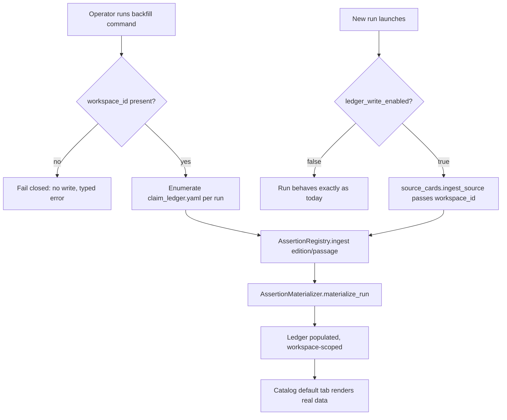
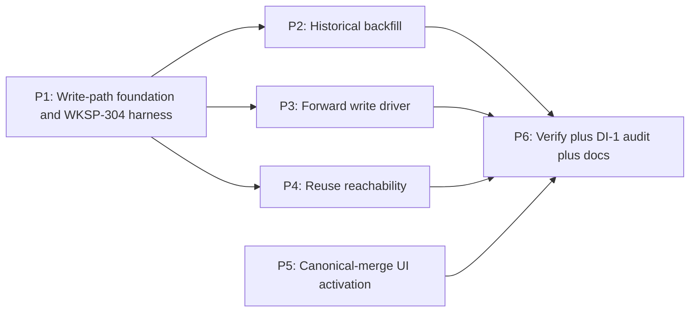

# Feature Brief & Metadata

**Feature Name:**

> Assertion-Ledger Population & Activation

**Filepath Name:**

> `assertion-ledger-activation-v1`

**Date:**

> 2026-07-15

**Author:**

> Opus (decisions block) + prd-writer (Sonnet)

**Related Epic(s)/PRD ID(s):**

> Follow-on to `reusable-assertion-ledger-v1` (PRD: `docs/project_plans/PRDs/features/reusable-assertion-ledger-v1.md`). Tracks AAR action items B2 and C.

**Related Documents:**

> - `docs/project_plans/implementation_plans/features/reusable-assertion-ledger-v1.md` — the plan that built the schemas, `assertion_registry`, `assertion_materialization`, reuse/impact services, and reviewer UI this feature drives. **Read this, do not restate it.**
> - `docs/project_plans/aars/2026-07-15-catalog-visibility-regressions.md` — the gaps AAR explaining why this feature exists (flags enabled, ledger empty, no driver).
> - `.claude/worknotes/assertion-ledger-activation/decisions-block.md` — the Opus decisions block this PRD expands (phase boundaries, risk hotspots, estimation anchors, OQ-1..OQ-4).
> - `docs/project_plans/implementation_plans/harden-polish/wksp-304-workspace-isolation-enforcement-v1.md` — the row-level isolation enforcement this feature's new write sites must comply with; source of the open DI-1 completeness-audit gate.

---

## 1. Executive Summary

`reusable-assertion-ledger-v1` shipped the schemas, the read-only `/api/assertions/*` API, the runs-viewer "Source assertions" catalog tab (now default), and three enabled `foundry.yaml` flags (`ledger_write_enabled`, `automated_reuse_enabled`, `canonical_claims_enabled`) — but **no shipped CLI or HTTP entry point exercises the write or reuse seams**. The ledger is empty and the default catalog tab renders nothing; "flag enabled" produced no observable capability (AAR lesson 3). This feature makes the ledger actually populate — from the ~41 existing runs' historical claim ledgers and from every run going forward — and makes reuse and the canonical-merge UI reachable. It is a pure **driver** feature: every service it calls (`assertion_registry`, `assertion_materialization`, `assertion_reuse`/`assertion_impact`) already exists and is idempotent by design; this feature wires real callers to those seams under the workspace-isolation write boundary (WKSP-304).

**Priority:** HIGH

**Key Outcomes:**
- Outcome 1: The runs-viewer Catalog's default "Source assertions" tab shows real data — historical (backfilled) and new (forward-written) — instead of an empty state.
- Outcome 2: `ledger_write_enabled`, `automated_reuse_enabled`, and `canonical_claims_enabled` each have a reachable, testable driver; no flag is a silent no-op.
- Outcome 3: Every new write introduced by this feature is workspace-confined and fails closed without a workspace id — closing the delta this feature adds to the open DI-1 gate (`docs/project_plans/implementation_plans/harden-polish/wksp-304-workspace-isolation-enforcement-v1.md:329`).

---

## 2. Context & Background

### Current State

Grounded against the current codebase (not the v1 plan's aspirational description):

| Seam | Path | State |
|---|---|---|
| Backfill enumeration | `src/research_foundry/services/assertion_rollout.py:72-94` (`backfill_dry_run`) | Read-only. Enumerates `<run>/claims/claim_ledger.yaml` candidates and existing assertion counts; returns a receipt with `authoritative_data_mutated: False`. No write path exists. |
| Forward ingest seam | `src/research_foundry/services/source_cards.py:154-167,303-319` (`ingest_source`) | **Present but unwired.** Already accepts `assertion_registry_workspace_id` and gates a call to `AssertionRegistry.ingest()` on `(workspace_id set) AND (content extracted) AND (not degraded) AND (ledger_write_enabled)`. No current caller (rf CLI, discovery swarm, `POST /api/runs`) passes `assertion_registry_workspace_id` — the condition is structurally correct but never true today. |
| Registry write | `src/research_foundry/services/assertion_registry.py:365` (`AssertionRegistry.ingest`) | Implemented, content-addressed, idempotent (`tests/unit/test_assertion_registry.py`: re-ingest of identical content returns `created=False`, same edition id). |
| Materialization | `src/research_foundry/services/assertion_materialization.py:158,668` (`materialize_run`) | Implemented; returns `MaterializationResult{run_id, workspace_id, edition_count, passage_count, assertion_count, result, reason}`. |
| Run launch / workspace identity | `src/research_foundry/api/routers/runs.py:240-265,289-291` (`LaunchRunRequest`) | No reuse fields present. `identity` is extracted from request state but explicitly **not yet threaded into `launch_run()`** (`# TODO(WKSP-304 P4)`); single-operator default resolves to the operator's workspace, `identity=None`. |
| Config | `foundry.yaml:51-54`, `src/research_foundry/config.py:99` (`AssertionLedgerControls`) | `ledger_write_enabled`, `automated_reuse_enabled`, `canonical_claims_enabled` are file-config booleans (not env vars), all `true` today, with fail-closed derived capabilities (`automated_reuse_allowed = ledger_write_enabled AND automated_reuse_enabled`, etc.). |
| Merge UI flag | `frontend/runs-viewer/src/lib/canonicalClaimsFlag.ts` | Build-time flag reader exists (`import.meta.env.VITE_RF_CANONICAL_CLAIMS_ENABLED === "true"`). Not wired into any bootstrap/deploy script (unlike `RF_UI_LOOPBACK`, which is). |

### Problem Space

See `docs/project_plans/aars/2026-07-15-catalog-visibility-regressions.md` for the full incident. The load-bearing lesson for this feature: *"Flag enabled" must gate on "capability driveable."* A default-on flag with no reachable driver reads as "done" but is a silent no-op. Two of the AAR's three action items are this feature's scope:

- **B2** — historical claim → source-assertion backfill migration (populate the ledger from ~3,000 historical claims across 41 runs).
- **C** — assertion-ledger activation: wire the forward write driver, expose reuse fields, build the merge UI flag.

### Current Alternatives / Workarounds

None. The classic "Claims" tab (B1, already restored in `068a4e6`) covers the historical claim data for now, but the assertion ledger itself — and everything built on top of it (reuse, canonical-merge review) — stays permanently empty without this feature.

### Architectural Context

This feature adds **no new services**. It calls existing services from new, real entry points:
- `services/assertion_rollout.py` gains a write-capable counterpart to `backfill_dry_run()`.
- `services/source_cards.py::ingest_source` gets a real caller that supplies `assertion_registry_workspace_id`.
- `api/routers/runs.py::LaunchRunRequest` gains reuse fields; `services/run_launch.py` wires them to the existing (already-built) `assertion_reuse`/`assertion_impact` services.
- `frontend/runs-viewer` gets a build-flag wired through bootstrap deploy, mirroring the existing `RF_UI_LOOPBACK` pattern.

### 2.1 SPIKE waiver rationale (tier note)

The point estimate (~18 pts) lands in Tier-3 territory, but the technical path is **known, not researched** — `backfill_dry_run()` already enumerates candidates with no write, and `assertion_registry`/`assertion_materialization` already implement the write path this feature calls. The remaining unknowns are **correctness and workspace scoping** (addressed by the P1 test harness and karen milestones), not feasibility. The SPIKE is waived. If `implementation-planner`'s bottom-up estimate exceeds ~18 pts, or the historical claim-ledger mapping is not 1:1 (OQ-1), **promote to Tier 3** and author a targeted backfill-mapping SPIKE before P2.

---

## 3. Problem Statement

> "As a research-foundry operator, when I enable `ledger_write_enabled` and run a research swarm, I expect the assertion ledger — and the catalog tab built on it — to populate, instead of staying silently empty because no entry point ever calls the write seam."

**Technical Root Cause:**
- `source_cards.ingest_source` accepts `assertion_registry_workspace_id` but no caller supplies it (see table above).
- `assertion_rollout.backfill_dry_run` is read-only by design; no write-path sibling was ever shipped.
- `LaunchRunRequest` has no reuse fields, so `automated_reuse_enabled` has nothing to evaluate.
- `VITE_RF_CANONICAL_CLAIMS_ENABLED` is read by the frontend but never set by any deploy path.

---

## 4. Goals & Success Metrics

### Primary Goals

**Goal 1: Populate the ledger, historical and forward**
- Backfill materializes source-assertions for the ~41 existing runs' claim ledgers.
- New runs populate the ledger going forward when `ledger_write_enabled=true`.

**Goal 2: Every new write is workspace-safe by construction**
- All new write call sites resolve and require `assertion_registry_workspace_id`; absence fails closed (no write, typed denial).
- The delta this feature adds to the WKSP-304 write surface is enumerated and audited (DI-1-scoped, not full-project DI-1 closure).

**Goal 3: Reuse and canonical-merge become reachable, not just built**
- A reuse decision (allow/deny/refresh) is invocable via CLI or HTTP.
- The canonical-merge UI renders when its flag is on and is wired through the standard deploy path.

### Success Metrics

| Metric | Baseline | Target | Measurement Method |
|--------|----------|--------|-------------------|
| Historical runs with materialized assertions | 0 | 41 (or all runs with a `claim_ledger.yaml`) | `rf assertion backfill --dry-run` receipt vs. post-backfill assertion count |
| Backfill re-run write count | N/A | 0 new writes on 2nd run | Idempotency test: run backfill twice, diff edition/passage/assertion counts |
| New-run ledger population | 0% of new runs | 100% of new runs when flag on | Integration test: launch a run, assert non-zero assertion count in workspace ledger |
| Flag-off regression | N/A | 0 behavior diffs | Regression test: full run with `ledger_write_enabled=false`, diff artifacts against pre-feature baseline |
| Reuse decision reachability | Not invocable | Invocable via CLI/HTTP, both allow and deny paths tested | Integration test against `assertion_reuse` service via new entry point |
| Merge UI render | Blank/unreachable | Renders on `:3030` with populated ledger | Manual + Playwright/component smoke; `tsc -p tsconfig.app.json --noEmit` clean |
| Cross-workspace leaks on new write sites | Unknown (unaudited) | 0 | DI-1-scoped audit + isolation regression matrix (P1 harness) |

---

## 5. User Personas & Journeys

### Personas

**Primary Persona: Research Foundry Operator**
- Role: Single-operator (or small-team) LAN deployment owner running research swarms.
- Needs: Enabling a flag in `foundry.yaml` should produce an observable, verifiable capability change.
- Pain Points: Discovered post-hoc that three enabled flags did nothing because no driver existed (this AAR).

**Secondary Persona: Reviewer (via runs-viewer)**
- Role: Consumes the Catalog "Source assertions" tab and, when enabled, the canonical-merge review controls.
- Needs: The default tab must show real provenance data, not an empty state that looks like a bug.
- Pain Points: Currently sees an empty tab and cannot distinguish "no data" from "broken."

### High-level Flow

---

## 6. Requirements

### 6.1 Functional Requirements

| ID | Requirement | Priority | Notes |
| :-: | ----------- | :------: | ----- |
| FR-1 | Establish a shared, tested contract proving an assertion write is confined to its `assertion_registry_workspace_id` and fails closed without one. | Must | P1. Substrate for FR-2/FR-3. |
| FR-2 | Add a write-capable counterpart to `assertion_rollout.backfill_dry_run()` that materializes historical `claims/claim_ledger.yaml` entries into the workspace ledger, exposed as a gated operator command (e.g., `rf assertion backfill`). | Must | P2/B2. Idempotent, resumable, dry-run-parity. |
| FR-3 | Wire a real entry point to pass `assertion_registry_workspace_id` + `ledger_write_allowed` into `source_cards.ingest_source` so new runs populate the ledger. | Must | P3/C1. Resolve OQ-2 for the entry point. |
| FR-4 | Expose reuse fields (`reuse_assertion`, `reuse_workspace_id`, `required_reuse_edition_id`, `required_extraction_contract`) on `LaunchRunRequest` and/or a `rf run launch` command so `automated_reuse_enabled` is reachable. | Must | P4/C2. Reuse the existing `assertion_reuse`/`assertion_impact` decision path; do not reinvent. |
| FR-5 | Build the runs-viewer with `VITE_RF_CANONICAL_CLAIMS_ENABLED=true` wired through the standard deploy/bootstrap path (mirroring `RF_UI_LOOPBACK`); verify merge-review controls render against populated ledger data. | Must | P5/C3. Frontend-only; `frontend/runs-viewer/src/lib/canonicalClaimsFlag.ts` is the existing read side. |
| FR-6 | Audit the new write sites (P2/P3/P4) against the WKSP-304 isolation contract; close the delta this feature adds to DI-1. | Must | P6. Not a full-project DI-1 closure — scoped to this feature's new write paths. |
| FR-7 | Document the new operator command(s), flags, and deploy variable in user/dev docs and CHANGELOG. | Should | P6. `changelog_required: true`. |

### 6.2 Non-Functional Requirements

**Security (primary risk surface — see §9):**
- Every new write call site MUST resolve `assertion_registry_workspace_id` before any write; absent id MUST short-circuit to a typed no-write denial (fail closed, matching the WKSP-304 `identity=None` short-circuit pattern at `src/research_foundry/api/routers/runs.py:289-291`).
- No new write site may bypass the P1 shared contract by calling `AssertionRegistry.ingest()` / `AssertionMaterializer.materialize_run()` directly without workspace resolution.

**Reliability:**
- Backfill is resumable: an interrupted backfill run, re-run, converges to the same end state with no partial/duplicate records (content-addressed writes already guarantee this at the registry layer; the backfill driver must not defeat it).
- Backfill idempotency: re-running backfill against an already-backfilled run performs 0 new writes (verified by diffing edition/passage/assertion counts before and after).

**Performance:**
- Backfill of the current ~41-run, ~3,000-claim corpus completes without requiring new indexing infrastructure (v1's file-first design holds); no specific latency SLA — correctness and idempotency take priority over speed for a bounded, operator-invoked migration.

**Observability:**
- Backfill and forward-write operations emit an operation receipt (mirroring the P5 `assertion_impact` receipt pattern) recording workspace id, counts, and result — not just a log line.
- Denials (missing workspace id, flag off) are typed and distinguishable from "nothing to do."

---

## 7. Scope

### In Scope

- P1 — Shared workspace-scoped write foundation + WKSP-304 isolation test harness (no user-facing behavior change).
- P2 (B2) — Historical claim→source-assertion backfill migration, exposed as a gated operator command.
- P3 (C1) — Forward write driver wiring so new runs populate the ledger.
- P4 (C2) — Reuse-field reachability via `LaunchRunRequest` / `rf run launch`.
- P5 (C3) — Canonical-merge UI activation via `VITE_RF_CANONICAL_CLAIMS_ENABLED`, deploy-flag wiring.
- P6 — End-to-end verification, DI-1-scoped audit of this feature's new write sites, docs/CHANGELOG.

### Out of Scope

- **B1 — Claims catalog tab.** Already shipped in `068a4e6` (classic `item_type=claim` tab restored alongside "Source assertions"). Not touched by this feature.
- **A2 — `rf serve --sensitivity-threshold` catalog-router propagation fix.** Already shipped in `068a4e6`. Not touched by this feature.
- Full-project DI-1 closure (the complete workspace-data-access completeness audit across *every* service). This feature audits only its own new write sites; project-wide DI-1 remains its own hard pre-multi-tenant-deploy gate (`docs/project_plans/implementation_plans/harden-polish/wksp-304-workspace-isolation-enforcement-v1.md:329`).
- Semantic/canonical-claim merge *logic* changes — v1 already built the merge review services/UI scaffolding; this feature only activates the build flag and verifies it renders against real data.
- New indexing infrastructure, shared/cross-workspace search indexes, or public-corpus promotion (all explicitly deferred by v1).
- Multi-tenant/enforced-isolation deployment (WKSP-304 enforcement stays advisory-by-default; this feature does not flip that switch).

---

## 8. Dependencies & Assumptions

### Internal Dependencies

- **`reusable-assertion-ledger-v1`** (status: repository-readiness complete): provides every service this feature calls — `assertion_registry`, `assertion_materialization`, `assertion_reuse`, `assertion_impact`, the `/api/assertions/*` router, and the reviewer UI surfaces. This feature does not modify their internals except at the new call-site seams.
- **WKSP-304 row-level isolation enforcement** (status: completed, advisory-by-default): defines the confinement/fail-closed pattern (`identity=None` short-circuit, query-layer `workspace_id` predicate, 404-not-403 denial) this feature's new writes must match structurally.

### Assumptions

- Single-operator deployment resolves `assertion_registry_workspace_id` to the operator's default workspace (OQ-3 confirms the exact resolution).
- The historical claim-ledger → source-assertion mapping is close enough to 1:1 that a SPIKE is not required (OQ-1 confirms; if false, promote to Tier 3 before P2).
- The existing `block_authoritative_reuse` governed-reuse path (built in v1's P5) is the correct mechanism to wire for FR-4, not a new policy.

### Feature Flags

| Flag | Location | Current value | Effect after this feature |
|---|---|---|---|
| `ledger_write_enabled` | `foundry.yaml` → `assertion_ledger.ledger_write_enabled` | `true` | Gates both backfill (P2) and forward writes (P3); flag-off must be byte-identical to today (AC-2). |
| `automated_reuse_enabled` | `foundry.yaml` → `assertion_ledger.automated_reuse_enabled` | `true` | Gates whether reuse fields (P4) can produce an "allow" decision; already fail-closed via `AssertionLedgerControls` (requires `ledger_write_enabled` too). |
| `canonical_claims_enabled` | `foundry.yaml` → `assertion_ledger.canonical_claims_enabled` | `true` | Gates whether the backend/API side of canonical-claim merge is active; already built by v1. |
| `VITE_RF_CANONICAL_CLAIMS_ENABLED` | `frontend/runs-viewer` build-time env | unset / not wired | New: must be set in the standard deploy/bootstrap path (P5) for the merge UI (`canonicalClaimsFlag.ts`) to activate. |

---

## 9. Risks & Mitigations

| Risk | Impact | Likelihood | Mitigation |
| ----- | :----: | :--------: | ---------- |
| WKSP-304 isolation leak on a new write site (DI-1-adjacent) — a write not scoped to `assertion_registry_workspace_id` is a cross-tenant data leak | High | Medium | P1 shared test harness proves confinement + fail-closed *before* P2/P3/P4 build on it; DI-1-scoped audit in P6; `senior-code-reviewer`/`karen` milestone after P2 and after P3; Mode-D-adjacent — no auto-merge, diffs reviewed before merge/deploy. |
| Backfill non-idempotency / double-materialization | Medium | Low | Content-addressed editions/passages already guarantee idempotency at the registry layer (proven by existing tests); explicit re-run-is-no-op regression test added in P2; dry-run parity assertion (backfill's real-run counts match `backfill_dry_run`'s candidate counts). |
| Enabling the forward write driver changes existing run behavior when the flag is on (or subtly regresses when off) | Medium | Medium | Gate strictly on `ledger_write_enabled`; flag-off path must be byte-identical to today (regression test, mirrors the AAR's A2 fix approach: assert the flag reaches its runtime consumer). |
| Historical claim-ledger mapping is not clean 1:1 (OQ-1) | Medium | Low-Medium | `implementation-planner` inspects `assertion_materialization` + a sample `claim_ledger.yaml` before committing to P2's task breakdown; promote to Tier 3 + backfill-mapping SPIKE if not 1:1. |
| Reuse fields widen the run-launch validation/attack surface | Low-Medium | Low | Validate and authorize reuse targets before evaluation; wire the existing governed `block_authoritative_reuse` path rather than inventing new policy. |
| Merge-UI build flag drifts on redeploy (forgotten on a future bootstrap change) | Low | Medium | Set `VITE_RF_CANONICAL_CLAIMS_ENABLED` in bootstrap the same way `RF_UI_LOOPBACK` is set; document the deploy flag in P6 docs. |

---

## 10. Target State (Post-Implementation)

**User Experience:**
- An operator can run a single gated command to backfill the ledger from history, and see the runs-viewer Catalog's default "Source assertions" tab populate with real provenance data.
- A researcher/agent can launch a run with reuse fields and get an allow/deny/refresh decision back, instead of the fields not existing.
- A reviewer sees canonical-merge controls in the runs-viewer when the feature is enabled, backed by real merge candidates.

**Technical Architecture:**
- `assertion_rollout.py` gains a write-capable sibling to `backfill_dry_run()` that calls the same registry/materialization services P3 uses, so backfill and forward-write share one code path for "materialize a claim ledger into the ledger."
- `LaunchRunRequest` → `run_launch.py` → `assertion_reuse`/`assertion_impact` is a new, thin wiring layer; no new decision logic.
- The runs-viewer build pipeline sets `VITE_RF_CANONICAL_CLAIMS_ENABLED` the same way it sets `RF_UI_LOOPBACK`.

**Observable Outcomes:**
- Non-zero assertion/edition/passage counts in the workspace ledger for all backfilled runs and all new runs launched with the flag on.
- A documented, auditable enumeration of every new workspace-scoped write call site introduced by this feature (the DI-1-scoped delta).

---

## 11. Overall Acceptance Criteria (Definition of Done)

### Structured acceptance criteria

#### AC-1: New writes are workspace-confined and fail closed without a workspace id
- target_surfaces:
  - `src/research_foundry/services/assertion_rollout.py`
  - `src/research_foundry/services/source_cards.py`
  - `src/research_foundry/services/run_launch.py`
  - `src/research_foundry/services/assertion_registry.py`
- propagation_contract: Every new write call site added by P2/P3/P4 resolves `assertion_registry_workspace_id` before calling `AssertionRegistry.ingest()` or `AssertionMaterializer.materialize_run()`.
- resilience: When `assertion_registry_workspace_id` is absent, the call site performs zero writes and returns a typed denial (mirrors the WKSP-304 `identity=None` short-circuit pattern) — never a silent no-op that looks like success.
- visual_evidence_required: false
- verified_by: [P1 isolation harness, P2 backfill test, P3 forward-write test, P6 DI-1 audit]

#### AC-2: The flag-off path is unchanged from today
- target_surfaces:
  - `src/research_foundry/services/source_cards.py`
  - `src/research_foundry/services/assertion_rollout.py`
- propagation_contract: With `ledger_write_enabled=false`, a run's ingest path and all produced artifacts (claim ledger, export, catalog data) are byte-identical to the pre-feature baseline.
- resilience: Flag-off is the tested default in the regression suite, not just an assumed inverse of flag-on.
- visual_evidence_required: false
- verified_by: [P3 flag-off regression test]

#### AC-3: Backfill is idempotent — re-run is a no-op
- target_surfaces:
  - `src/research_foundry/services/assertion_rollout.py`
  - `src/research_foundry/services/assertion_registry.py`
  - `src/research_foundry/services/assertion_materialization.py`
- propagation_contract: Running the backfill command twice against the same corpus produces identical edition/passage/assertion counts and 0 new writes on the second run.
- resilience: An interrupted backfill run (killed mid-run and re-run) converges to the same end state without duplicate or partial records.
- visual_evidence_required: false
- verified_by: [P2 idempotency test]

#### AC-4: A fresh run's ingest writes assertions when the flag is on
- target_surfaces:
  - `src/research_foundry/services/source_cards.py`
  - `src/research_foundry/services/assertion_rollout.py`
- propagation_contract: A real run launched through the resolved entry point (OQ-2) passes `assertion_registry_workspace_id` into `ingest_source`, and the ledger's assertion count for that workspace increases.
- resilience: Degraded or content-less sources (already-existing `ingest_source` gate conditions) still produce no write and no error escalation.
- visual_evidence_required: false
- verified_by: [P3 forward-write integration test]

#### AC-5: Reuse decision is invocable and governed
- target_surfaces:
  - `src/research_foundry/api/routers/runs.py`
  - `src/research_foundry/services/run_launch.py`
- propagation_contract: `LaunchRunRequest` (or `rf run launch`) accepts `reuse_assertion`, `reuse_workspace_id`, `required_reuse_edition_id`, `required_extraction_contract`; the request routes through the existing `assertion_reuse` evaluation and returns an allow/deny/refresh decision with reason.
- resilience: When reuse fields are absent, run launch behaves exactly as it does today (no reuse evaluation attempted); an unauthorized or cross-workspace reuse target is denied via the existing `block_authoritative_reuse` path, not a new ad hoc check.
- visual_evidence_required: false
- verified_by: [P4 reuse reachability test, including the denied path]

#### AC-6: Canonical-merge UI activates against real data
- target_surfaces:
  - `frontend/runs-viewer/src/lib/canonicalClaimsFlag.ts`
  - `frontend/runs-viewer/src/components/ClaimLedger/ClaimAuditWorkbench.tsx`
- propagation_contract: With `VITE_RF_CANONICAL_CLAIMS_ENABLED=true` set through the standard deploy/bootstrap path, merge-review controls render against a populated ledger on `:3030`.
- resilience: With the flag false or unset, merge controls are absent (matches the existing P6-of-v1 behavior: "Merge controls are absent when `RF_CANONICAL_CLAIMS_ENABLED` is false").
- visual_evidence_required: "Desktop >=1440px screenshot of the merge-review surface with the flag on and populated data, and with the flag off (absent)."
- verified_by: [P5 build-flag verification, P6 runtime smoke]

#### AC-7: DI-1-scoped audit closes this feature's new-write-site delta
- target_surfaces:
  - `src/research_foundry/services/assertion_rollout.py`
  - `src/research_foundry/services/source_cards.py`
  - `src/research_foundry/services/run_launch.py`
- propagation_contract: Every write call site introduced by P2/P3/P4 is enumerated in an audit artifact and reviewed against the WKSP-304 confinement/fail-closed contract.
- resilience: The audit is scoped to this feature's new sites (not a claim of full-project DI-1 closure); the artifact states that boundary explicitly to avoid repeating the WKSP-304 "100% coverage" false-completeness incident.
- visual_evidence_required: false
- verified_by: [P6, task-completion-validator + karen sign-off]

### Functional Acceptance

- [ ] FR-1 through FR-7 implemented.
- [ ] Historical backfill (P2) and forward driver (P3) both populate the same workspace-scoped ledger via the same underlying registry/materialization services.
- [ ] Reuse fields (P4) route through the existing governed reuse/impact services, not new logic.
- [ ] Canonical-merge UI (P5) renders against real, populated data — not a synthetic fixture only (unless OQ-4 resolves that a fixture is sufficient for verification, in which case both are documented).

### Technical Acceptance

- [ ] AC-1 through AC-7 all pass with evidence attached to the P6 verification report.
- [ ] No new write call site bypasses the P1 shared workspace-resolution contract.
- [ ] Backfill is exposed as an explicit, gated operator command (not auto-run on startup or on every request).
- [ ] `tsc -p tsconfig.app.json --noEmit` clean for the runs-viewer changes in P5.

### Quality Acceptance

- [ ] Isolation regression matrix (P1 harness) green: confinement + fail-closed proven for all new write sites.
- [ ] Idempotency tests (AC-3) green.
- [ ] Flag-off regression test (AC-2) green.
- [ ] `task-completion-validator` passes P1 through P6.
- [ ] `karen` milestone sign-off after P2 (security-sensitive backfill) and at feature end (P6).
- [ ] `senior-code-reviewer` (Mode E) reviews the P1 isolation-contract diff before merge.

### Documentation Acceptance

- [ ] New operator command(s) documented (usage, flags, idempotency guarantee).
- [ ] `VITE_RF_CANONICAL_CLAIMS_ENABLED` deploy wiring documented alongside the existing `RF_UI_LOOPBACK` pattern.
- [ ] CHANGELOG `[Unreleased]` entry added (per `.claude/specs/changelog-spec.md`; `changelog_required: true`).
- [ ] DI-1-scoped audit artifact for this feature's new write sites is written and linked from the implementation plan's P6.

---

## 12. Assumptions & Open Questions

### Assumptions

- Single-operator LAN deployment (`identity=None`) is the primary target; the P1 write-boundary contract must also degrade correctly if/when WKSP-304 enforcement is later armed.
- The existing `block_authoritative_reuse` governed-reuse path (built in v1's P5) is reused as-is for FR-4/AC-5.
- No new database/index infrastructure is required — this feature calls existing file-first services.

### Open Questions

- [ ] **OQ-1**: Is the historical claim-ledger→source-assertion mapping 1:1, or do some claim entries lack the passage/edition provenance needed to materialize an assertion?
  - **A**: TBD — `implementation-planner` inspects `assertion_materialization` + a sample `claims/claim_ledger.yaml` before finalizing P2's task breakdown. If not 1:1, promote to Tier 3 and author a backfill-mapping SPIKE first.
- [ ] **OQ-2**: Which is the correct single entry point to wire the forward write driver (C1/P3) — `rf ingest`, the discovery-swarm ingest path, or `POST /api/runs`?
  - **A**: TBD — prefer the narrowest entry point that covers real runs; resolve during P3 planning.
- [ ] **OQ-3**: What `assertion_registry_workspace_id` does a single-operator run resolve to (default workspace)?
  - **A**: TBD — confirm against the WKSP-304 resolution pattern (`identity=None` → operator's default workspace) during P1.
- [ ] **OQ-4**: Does the merge UI (C3/P5) require populated canonical claims (i.e., depends on P2 output) to be meaningfully verifiable, or can it be verified against a synthetic fixture?
  - **A**: TBD — resolve during P5 planning; if a fixture suffices for verification, document why real-data verification is not also required for AC-6.

---

## 13. Appendices & References

### Related Documentation

- **Implementation Plan (driven system):** `docs/project_plans/implementation_plans/features/reusable-assertion-ledger-v1.md` — schemas, `assertion_registry`, `assertion_materialization`, reuse/impact, reviewer UI.
- **AAR (why this feature exists):** `docs/project_plans/aars/2026-07-15-catalog-visibility-regressions.md`.
- **Decisions block (phase/risk/estimation source):** `.claude/worknotes/assertion-ledger-activation/decisions-block.md`.
- **WKSP-304 plan (isolation contract + open DI-1 gate):** `docs/project_plans/implementation_plans/harden-polish/wksp-304-workspace-isolation-enforcement-v1.md`.

### Symbol References (grounded 2026-07-15)

| Symbol | Path |
|---|---|
| `backfill_dry_run()` | `src/research_foundry/services/assertion_rollout.py:72-94` |
| `ingest_source()` | `src/research_foundry/services/source_cards.py:154-167,303-319` |
| `AssertionRegistry.ingest()` | `src/research_foundry/services/assertion_registry.py:365` |
| `AssertionMaterializer.materialize_run()` | `src/research_foundry/services/assertion_materialization.py:158,668` |
| `LaunchRunRequest`, identity TODO | `src/research_foundry/api/routers/runs.py:240-265,289-291` |
| `AssertionLedgerControls` | `src/research_foundry/config.py:99` |
| `foundry.yaml` assertion_ledger block | `foundry.yaml:51-54` |
| Merge-UI flag reader | `frontend/runs-viewer/src/lib/canonicalClaimsFlag.ts` |
| Idempotency proof (registry) | `tests/unit/test_assertion_registry.py` |

### Prior Art

- `docs/project_plans/implementation_plans/harden-polish/wksp-304-workspace-isolation-enforcement-v1.md` — the confinement/fail-closed pattern (`identity=None` short-circuit, query-layer predicate, 404-not-403 deny) this feature's writes must match.

---

## Implementation

### Phased Approach

**Phase P1: Write-path foundation & WKSP-304 scoping contract** (~3 pts)
- Establish/verify workspace-scoped assertion write invariants.
- Shared test harness proving a write is confined to `assertion_registry_workspace_id` and fails closed without it.
- No user-facing behavior change — this is the safety substrate P2/P3 build on.
- Exit gate: isolation tests green; `senior-code-reviewer` (Mode E) reviews the contract diff.

**Phase P2 (B2): Historical claim→assertion backfill migration** (~5 pts)
- Write-path counterpart to `backfill_dry_run()`; reads historical `claims/claim_ledger.yaml`, materializes editions/passages/source-assertions into the workspace ledger.
- Idempotent, resumable, workspace-scoped, dry-run parity.
- Exposed as an explicit, gated operator command (e.g., `rf assertion backfill`).
- Exit gate: backfill of the 41 existing runs populates the ledger; re-run is a no-op; **karen milestone** (security).

**Phase P3 (C1): Forward write driver** (~3 pts)
- Pass `assertion_registry_workspace_id` + `ledger_write_allowed` into `source_cards.ingest_source` from a real entry point (resolve OQ-2) so new runs populate the ledger.
- Exit gate: a fresh run's ingest writes assertions; flag-off path unchanged.

**Phase P4 (C2): Reuse reachability** (~3 pts)
- Expose reuse fields on `LaunchRunRequest` and/or `rf run launch`; wire to the existing `assertion_reuse`/`assertion_impact` decision path.
- Exit gate: reuse decision invocable via CLI/HTTP; governed-block path tested.

**Phase P5 (C3): Canonical-merge UI activation** (~2 pts)
- Build runs-viewer with `VITE_RF_CANONICAL_CLAIMS_ENABLED=true`; verify merge-review controls render; wire the deploy flag into bootstrap.
- Exit gate: merge UI renders against populated ledger on `:3030`; `tsc` clean.

**Phase P6: Verification, DI-1-scoped audit, docs** (~2 pts)
- End-to-end: backfilled + forward-written assertions visible in the default Catalog tab.
- DI-1-scoped full-surface audit for this feature's new write sites.
- CHANGELOG + user/dev docs.
- Exit gate: **karen** feature-end gate; DI-1-scoped audit sign-off.

### Dependency Map

Critical path: `P1 -> P2 -> P6`. P3/P4/P5 are parallelizable once P1 lands; P2 is the long pole (backfill is the algorithmic, security-sensitive phase — H3 flag applied).

### Epics & User Stories Backlog

| Story ID | Short Name | Description | Acceptance Criteria | Estimate |
|----------|-----------|-------------|-------------------|----------|
| ALA-P1 | Write-path foundation | Shared workspace-scoped write contract + isolation test harness | AC-1 | 3 pts |
| ALA-P2 | Historical backfill | Write-path backfill of `claims/claim_ledger.yaml` into the ledger, gated CLI command | AC-1, AC-3 | 5 pts |
| ALA-P3 | Forward write driver | Real entry point passes workspace id into `ingest_source` for new runs | AC-1, AC-2, AC-4 | 3 pts |
| ALA-P4 | Reuse reachability | Reuse fields on `LaunchRunRequest`/`rf run launch`, wired to existing reuse/impact services | AC-5 | 3 pts |
| ALA-P5 | Merge UI activation | `VITE_RF_CANONICAL_CLAIMS_ENABLED` deploy wiring + render verification | AC-6 | 2 pts |
| ALA-P6 | Verify, audit, docs | End-to-end verification, DI-1-scoped audit, CHANGELOG/docs | AC-1..AC-7 | 2 pts |

---

**Progress Tracking:**

See progress tracking (once implementation plan and phases are authorized): `.claude/progress/assertion-ledger-activation/phase-N-progress.md`
