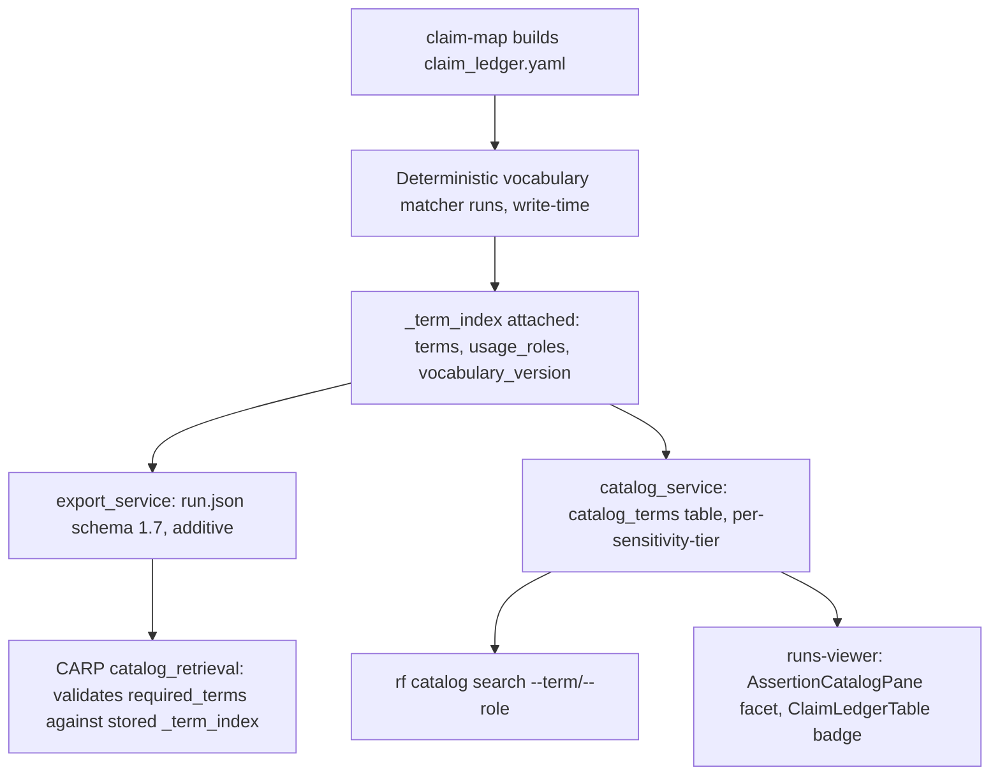

# Feature Brief & Metadata

**Feature Name:**

> Claim Term Indexing (v1)

**Filepath Name:**

> `claim-term-indexing-v1`

**Date:**

> 2026-07-24

**Author:**

> Nick Miethe (prd-writer / Opus orchestration)

**Related Epic(s)/PRD ID(s):**

> Corroborating context (not a parent epic): `catalog-assisted-research-planning-v1` (CARP C3, merged `d824290`) — its `required_terms` mechanism independently hand-rolled a per-question, query-time workaround for the gap this PRD closes at write time.

**Related Documents:**

> - Design spec (primary content source, formalized by this PRD): `docs/project_plans/design-specs/claim-term-indexing.md`
> - Feasibility brief (go, 0.77): `docs/project_plans/exploration/claim-term-indexing/claim-term-indexing-feasibility-brief.md`
> - Exploration charter: `docs/project_plans/exploration/claim-term-indexing/claim-term-indexing-charter.md`
> - Rights entity model ADR (strictness discipline this PRD respects): `docs/dev/architecture/adr-rights-entity-model.md`

---

## 1. Executive Summary

RF's corpus has no vocabulary-level index: `rf catalog search` answers exact-token FTS5 queries but cannot canonicalize synonyms or distinguish *how* a term is used (a threshold vs. a background mention). This feature adds a deterministic, write-time-computed term/usage-role index — `_term_index` — to claims, stored in the already-permissive `claim_ledger.yaml` schema, propagated read-only through `export`, `catalog`, `search`, and `serve`. It closes a gap CARP's C3 catalog planner already worked around by hand-rolling a per-question `required_terms` substring scan, and its own PRD names the resulting risk (missed synonym matches becoming residual discovery) as an accepted limitation this feature can reduce.

**Priority:** MEDIUM

**Key Outcomes:**
- Outcome 1: Every claim written by `claim-map` after this feature ships carries a versioned, namespaced term/usage-role index computed with zero model calls and zero network access.
- Outcome 2: `rf catalog search` and the runs-viewer catalog surfaces gain a `--term`/`--role` facet lookup that canonicalizes synonyms (e.g. "complete blood count" → `cbc`), which FTS5 substring matching cannot do today.
- Outcome 3: CARP's `required_terms` retrieval-quality lever gains a stored, versioned vocabulary signal to validate against, instead of relying solely on its own query-time hand-rolled scan.

---

## 2. Context & Background

### Current State

`rf catalog search` (`catalog_service.py:1259-1340`) answers exact-token substring/FTS5 queries over `search_text`, a flat field captured once at the most permissive sensitivity tier and never re-filtered per point at read time (`catalog_service.py:541-563`, `_redact_evidence_points` at `:1215-1234`). No claim, source card, inference, or writeback schema carries a term or tag field anywhere in the codebase today (confirmed by exhaustive grep, priorart leg). CARP's `_collect_candidates()` (`catalog_retrieval.py:385-449`) independently reinvented a case-folded, per-question `required_terms` substring scan at query time (`schemas/research_evidence_plan.schema.yaml:111-114`) precisely because no stored per-entity term field exists, and merged into production the same day this exploration ran (commit `d824290`). CARP's own PRD documents the accepted risk of that approach: missed synonym matches become residual discovery, not false coverage (`catalog-assisted-research-planning-v1.md:349`).

### Problem Space

Operators authoring pediatric-CDS runs (WBC/CBC/ferritin term-centric review), CARP's automated retrieval planner, and runs-viewer analysts reviewing bundles all need to find and browse claims by controlled vocabulary term rather than free-text substring alone, and to distinguish a clinically load-bearing mention (a threshold value) from a background one. No stored, versioned mechanism exists to do this; everything today is either exact-token FTS5/BM25 search or hand-authored, per-question query-time scanning.

### Current Alternatives / Workarounds

- **Exact-token FTS5/BM25 search** (`rf catalog search`, existing): no synonym canonicalization, no usage-role distinction, already-adequate for cheap literal-token lookups but not for vocabulary-level browse.
- **CARP's `required_terms` mechanism** (existing, production): a per-question, hand-authored, query-time substring scan against `search_text` — functional but not validated against a stored vocabulary the claim actually carries, and not reusable outside CARP's own planning flow.
- **Manual grep / re-reading claim-ledger markdown** (existing, ad hoc): the fallback for any lookup neither of the above covers; does not scale and leaves no durable index.

### Architectural Context

Research Foundry is a Markdown/YAML-first, file-canonical control plane: `catalog.db` (sqlite3+FTS5) is an explicitly derived, always-rebuildable read model (`catalog_service.py:1-30` docstring: "Deterministic IDs... rebuild always regenerates from run artifacts"), never a second source of truth. This feature replicates two patterns already proven in this codebase rather than introducing a new subsystem:

1. CARP's deterministic, case-folded substring-match extraction (`catalog_retrieval.py:385-419`), applied at **write time** (claim-map) instead of query time.
2. The catalog's derived/rebuildable sqlite3+FTS5 read-model doctrine, extended with a new `catalog_terms` join table mirroring the existing `catalog_links` pattern (`catalog_service.py:192-199`).

---

## 3. Problem Statement

**User Story Format:**
> "As an RF operator reviewing a pediatric-CDS bundle, when I want to find every claim that mentions a controlled clinical term (e.g. `cbc`) regardless of surface-form phrasing, and to know whether that mention is a threshold value or a background reference, I get only exact-substring FTS5 hits with no synonym canonicalization and no usage distinction, instead of a stored, versioned, facet-queryable term index."

**Technical Root Cause:**
- No claim, source-card, inference, or writeback schema carries a term/tag field (confirmed gap, exhaustive grep, priorart leg).
- `catalog_service.py`'s `search_text` is a flat blob captured once at max-permissive sensitivity, so any naive single-pass term derivation risks repeating that same redaction-leak precedent rather than fixing it (`catalog_service.py:541-563`, `:1215-1234`).
- CARP's `catalog_retrieval.py:385-449` independently re-solved a narrower version of this problem at query time because no write-time-computed, stored equivalent existed to reuse.
- Files involved: `services/claim_mapping.py`, `services/export_service.py`, `services/catalog_service.py`, `schemas/claim_ledger.schema.yaml`, `schemas/report_frontmatter.schema.yaml`.

---

## 4. Goals & Success Metrics

### Primary Goals

**Goal 1: Deterministic, non-authoritative term/usage-role index on claims**
- Every claim written by `claim-map` carries a `_term_index` block (`terms`, `usage_roles`, `vocabulary_version`) computed with zero model calls and zero network access.
- Measurable: 100% of new claims post-ship carry a `_term_index.vocabulary_version` stamp; the field never participates in `verify_report`'s checks or the `no_agent_cleared_rights_value` guard.

**Goal 2: Read-path propagation with zero new computation and zero sensitivity-leak regression**
- `export`, `catalog`, `search`, and `serve` propagate the already-computed `_term_index` field additively; none of them compute usage-role or term matches at read time.
- Measurable: `catalog_terms` rows are derivable strictly from the post-redaction evidence-point set (or an equivalent per-tier computation) — never from a single flat max-permissive blob.

**Goal 3: Safe backfill of existing verified bundles**
- A dry-run-by-default, idempotent backfill script (modeled on `services/rights_backfill.py`) can extend `_term_index` onto the 7 existing pediatric-CDS bundles without altering `verification_status` or any other already-attested field.
- Measurable: re-running the backfill against an already-indexed ledger with an unchanged vocabulary version is a no-op (0 writes); `rf verify` status is unchanged before/after, verified against a fixture regression suite.

### Success Metrics

| Metric | Baseline | Target | Measurement Method |
|--------|----------|--------|-------------------|
| Claims carrying `_term_index.vocabulary_version` | 0% (field does not exist) | 100% of claims written by `claim-map` post-ship | Schema/field presence check over a sample run's `claim_ledger.yaml` |
| `rf verify` status flips from `_term_index` injection | 0 (empirically confirmed on 1 run, 87 claims) | 0 across a fixture suite of >=2 runs | Before/after `rf verify` diff on a CI fixture set |
| `source_assertion_fingerprint()` drift from injected `_term_index` | Untested at the identity-hash layer | Byte-identical output, 100% pass | Dedicated regression test in CI |
| Term-facet recall on a known fixture census | N/A (no term facet exists) | `rf catalog search --term <x>` returns every claim containing `<x>` in the rebuilt catalog | Fixture-based recall test against a known term census |
| Sensitivity-tier leak on `catalog_terms` | N/A (no term table exists) | 0 terms exposed above the requesting read's sensitivity threshold | Redaction-parity test comparing `catalog_terms` rows to the post-redaction point set |

---

## 5. User Personas & Journeys

### Personas

**Primary Persona: RF Operator (pediatric-CDS bundle author/reviewer)**
- Role: Authors and reviews pediatric clinical-decision-support evidence bundles.
- Needs: Find every claim touching a controlled clinical term (CBC, ferritin, WBC) regardless of surface phrasing; distinguish a threshold-bearing mention from a background one.
- Pain Points: Exact-substring FTS5 misses synonyms; no way to browse claims by vocabulary term today.

**Secondary Persona: CARP Retrieval Planner (automated)**
- Role: `catalog_retrieval.py`'s `_collect_candidates()`, selecting candidate assertions per research question via `required_terms`.
- Needs: A stored, versioned vocabulary signal on the claim/assertion it is scanning, to validate its own query-time `required_terms` scan against and reduce residual-discovery false triggers.
- Pain Points: Currently hand-rolls its own per-question substring scan with no stored ground truth to check against.

**Tertiary Persona: runs-viewer Analyst**
- Role: Reviews bundles in the catalog/claim-ledger UI surfaces.
- Needs: A term facet and usage-role badge on existing catalog and claim-ledger screens, without a new screen to learn.
- Pain Points: `ClaimLedgerTable.tsx` has zero term/tag columns today (confirmed gap, priorart leg).

### High-level Flow

---

## 6. Requirements

### 6.1 Functional Requirements

| ID | Requirement | Priority | Notes |
| :-: | ----------- | :------: | ----- |
| FR-1 | A versioned, project-scoped vocabulary file format (e.g. `vocab/pediatric-terms.yaml`) maps canonical term IDs to surface-form aliases; every load is stamped with a `vocabulary_version`. | Must | Design spec §1, §2. Source location resolved by OQ-1. |
| FR-2 | A pure, deterministic matcher performs case-folded, word-boundary-aware substring/token matching over claim `text`, adapted directly from CARP's `required_terms` mechanism (`catalog_retrieval.py:385-419`). | Must | Design spec §2. For vocabularies beyond a few hundred terms, a single-pass multi-pattern matcher (e.g. Aho-Corasick) is the recommended algorithmic upgrade. |
| FR-3 | Usage-role classification uses two deterministic sources only: (a) a lexicon/rule-based regex context-window classifier (comparative operators/numeric adjacency ⇒ `threshold`; bare mention ⇒ `background`), and (b) `pediatric_cds` structured `threshold{value,units_ucum}` fields keyed directly. No model or embedding call, on read or write path. | Must | Design spec §2. Any future model-assisted pass requires its own `usage_role_model_version` stamp and is out of scope for v1 (OQ-2). |
| FR-4 | `_term_index` is attached to each `claim_ledger.yaml` claim item as a single namespaced key: `{terms: [...], usage_roles: {term: role}, vocabulary_version: str}`. A bare `usage_role` field is never emitted anywhere. | Must | Design spec §1. Namespace discipline mirrors the rights-summary "denormalized, non-authoritative" precedent (`adr-rights-entity-model.md`). |
| FR-5 | `_term_index` is computed and written exclusively in `claim_mapping.build_claim_ledger` (`claim-map` stage). `extract` and `verify` are unaffected as producers. | Must | Design spec §3. `claim_mapping.py` docstring already states "No network or model is required" for this pass. |
| FR-6 | `_term_index` must never be added to `SOURCE_ASSERTION_MATERIAL_FIELDS` (the fixed 5-tuple identity hash: `source_edition_id, passage_id, assertion_text_sha256, qualifiers, qualifier_extensions`). A regression test asserts `source_assertion_fingerprint()` is unchanged when `_term_index` is injected into an instance. | Must | Design spec §1; feasibility brief risk row 1 (severity H). `assertion_identity.py:16-21`. |
| FR-7 | `rf verify` remains a no-op consumer of `_term_index`: `verify_report`'s checks read only `text`, `sources`, `materiality`, `claim_type`, `status`. Verify may optionally lint for `_term_index` presence when vocabulary hits exist but must never compute usage-role via a model call at this gate. | Must | Design spec §3, empirically confirmed via before/after `rf verify` on a real 87-claim ledger (byte-identical output, 0 status flips). |
| FR-8 | `report_frontmatter.schema.yaml` gains a rolled-up union `_term_index`-shaped field, additive only, consistent with claim_ledger's namespace convention. | Should | Design spec §1 (`report_frontmatter.schema.yaml` is likewise permissive). |
| FR-9 | `export_run` (`export_service.py:668-694`) additively includes `_term_index` in `run.json`, landing as schema version **1.7** (the six prior bumps, 1.0→1.6, establish additive-field precedent). | Must | Design spec §3. Follow the machine-surface additive-only contract (`docs/dev/architecture/machine-surface-inventory.md:29`). |
| FR-10 | `catalog_service._build_claim_and_inference_rows` (`:567-620`) is extended to carry `_term_index` fields into `search_text`/`payload_json`, and a dedicated `catalog_terms(catalog_item_id, term, role, run_id)` join table is added, rebuilt in the same pass as `catalog_items` (`rebuild()`/`rebuild_schema()`). | Must | Design spec §3. Mirrors the existing `catalog_links` pattern (`catalog_service.py:192-199`). |
| FR-11 | Term/usage-role derivation for the catalog layer must be computed per-sensitivity-tier — either as multiple derived rows at write time, or filtered from the post-redaction evidence-point set at read time. It must never be folded into a single flat blob computed once at maximum permissiveness. | Must | Design spec §3; feasibility brief risk row 2 (severity M-H), directly naming the existing `search_text` leak precedent (`catalog_service.py:541-563`, `_redact_evidence_points` at `:1215-1234`) as the failure mode to avoid repeating. |
| FR-12 | `rf catalog search` gains optional `--term`/`--role` facet filters against the new term table, following the existing `item_type`/`project` filter pattern (`catalog_service.py:1263-1298`). | Must | Design spec §3. Distinct from and unaffected by `search_router/` (a separate external-provider subsystem). |
| FR-13 | `rf serve` (`api/routers/catalog.py`) passes `--term`/`--role` query params through to the catalog layer with no new read-path computation. | Should | Design spec §3. |
| FR-14 | A backfill script, modeled on `services/rights_backfill.py`, re-runs the deterministic claim-map extraction function against existing `claim_ledger.yaml` files and writes `_term_index` in place. Dry-run by default; idempotent against an unchanged vocabulary version; never touches `verification_status`, `status`, or any already-attested field. | Must | Design spec §5. Followed by a mandatory `rf catalog rebuild` pass. |
| FR-15 | `AssertionCatalogPane.tsx` gains a "terms present" facet chip-row sourced from `catalog_terms`; `CatalogScreen.tsx` gains a `?term=` deep-link parameter; `ClaimLedgerTable.tsx` gains a term/usage-role column or badge, visually distinct from any real `pediatric_cds` structured threshold value. | Should | Design spec §6. Additive facet/column/param work on existing surfaces; no new screen architecture. |

### 6.2 Non-Functional Requirements

**Performance:**
- The write-time matcher is a pure function, unit-testable in isolation, with no I/O beyond reading the vocabulary file and the claim text already in memory.
- For vocabularies beyond a few hundred terms, prefer a single-pass multi-pattern matcher (Aho-Corasick or equivalent) over repeated linear scans, to keep `claim-map` throughput from degrading as vocabulary size grows.

**Security / Governance:**
- `_term_index` participates in **no** verification, identity, or rights-governance check — it is outside `SOURCE_ASSERTION_MATERIAL_FIELDS` and outside the `no_agent_cleared_rights_value` guard's rights-clearance fields.
- Agent-writable paths (the vocabulary loader, the matcher, the backfill script) must never mint a `CLEARED_*`/`counsel_approved`/`attested` rights-clearance value, per the project's standing invariant.
- No model call is permitted on any read path (`catalog`, `search`, `serve`) or, for v1, on the write path either — usage-role classification is lexicon/rule-based and `pediatric_cds`-field-keyed only.

**Reliability:**
- Backfill is idempotent, dry-run-by-default, and additive-only — no destructive or in-place-mutating writes to already-attested fields.
- The catalog remains fully rebuildable from source files at any time (`catalog.db` is disposable, per the project's existing doctrine); `catalog_terms` rows regenerate on `rebuild()`.

**Observability:**
- Every `_term_index` block is stamped with `vocabulary_version`, giving a durable, greppable reproducibility marker for any vocabulary edit's downstream effect.
- Backfill runs in dry-run mode print a diff of claims that would gain `_term_index` entries before any write occurs.

---

## 7. Scope

### In Scope

- Vocabulary file format + `vocabulary_version` stamping (FR-1).
- Deterministic term matcher and lexicon/rule-based usage-role classifier at `claim-map` write time (FR-2, FR-3).
- `_term_index` namespaced field on `claim_ledger.yaml` claim items (FR-4, FR-5, FR-6, FR-7).
- Additive rollup field on `report_frontmatter.schema.yaml` (FR-8).
- `export_service` propagation to `run.json` schema 1.7 (FR-9).
- `catalog_service` extension: `catalog_terms` table, per-sensitivity-tier derivation (FR-10, FR-11).
- `rf catalog search` `--term`/`--role` facets and `rf serve` pass-through (FR-12, FR-13).
- Backfill script for the 7 existing pediatric-CDS bundles, modeled on `rights_backfill.py` (FR-14).
- runs-viewer additive UX: facet chip-row, deep-link param, claim-ledger term/role column or badge (FR-15).

### Out of Scope

See §12, "Deferred / Out-of-Scope (v2 and Beyond)" for the full list carried forward from the design spec. In brief: extension onto the strict, `additionalProperties: false` families (`canonical_claim`, `inference_record`, `source_assertion`); any model/embedding-derived usage-role mechanism; controlled-vocabulary sourcing beyond a hand-maintained list (MeSH/UMLS/LOINC); full semantic/RAG search over evidence bundles; changes to the `pediatric-anemia-site` repo itself.

---

## 8. Dependencies & Assumptions

### External Dependencies

- None required for v1. An Aho-Corasick-style matching library (e.g. `pyahocorasick`) is an optional performance upgrade, not a hard dependency, if vocabulary size grows beyond a few hundred terms.

### Internal Dependencies

- **CARP catalog-assisted research planning (C3)**: landed, `catalog_retrieval.py:385-449` — the extraction primitive this feature adapts. Status: complete (main `95e8419`).
- **`services/rights_backfill.py`**: the idempotent/additive/dry-run backfill pattern this feature's backfill script is modeled on. Status: complete, in production use.
- **`services/export_service.py` / `rf-run-export-schema.json`**: six prior additive schema bumps (1.0→1.6) establish the precedent this feature's 1.7 bump follows. Status: stable.
- **`adr-rights-entity-model.md`**: the strictness discipline (`additionalProperties: false` for identity/rights-bearing entities) this feature deliberately respects rather than works around. Status: adopted.

### Assumptions

- The pediatric-CDS use case (7 existing verified bundles) is the first and highest-priority backfill target; other bundle populations backfill after that validation.
- `claim_ledger.yaml` and `report_frontmatter.schema.yaml` remain `additionalProperties: true` for the duration of this feature's implementation window; if either tightens before implementation, this PRD's v1 scope must be re-validated before proceeding.
- The vocabulary-source decision (OQ-1) does not block starting implementation of the matcher/classifier itself, since both operate against whatever vocabulary file is loaded regardless of where it is sourced from.

### Feature Flags

- None proposed for v1. `_term_index` computation is unconditional at `claim-map` time once shipped (it is additive and non-authoritative, so no flag-gated rollout risk exists comparable to an authority-bearing feature).

---

## 9. Risks & Mitigations

| Risk | Impact | Likelihood | Mitigation |
| ----- | :----: | :--------: | ---------- |
| Content-addressed `source_assertion` identity drift if term/usage fields leak into the fixed 5-tuple hashing set | High | Low | Keep `terms`/`usage_role` fields strictly outside `SOURCE_ASSERTION_MATERIAL_FIELDS` (`assertion_identity.py:16-21`); FR-6 mandates a regression test asserting `source_assertion_fingerprint()` is unchanged by an injected `_term_index` key. |
| Catalog-layer sensitivity granularity mismatch — a flat pre-computed term index bypassing per-`evidence_point` redaction, repeating the existing `search_text` leak precedent | Medium-High | Medium | FR-11 mandates per-sensitivity-tier term derivation (or post-redaction filtering), never a single flat blob computed once at max-permissive sensitivity. |
| Namespace/semantic collision between a derived `usage_role: threshold` label and a real `pediatric_cds` schema-validated threshold block | Medium | Medium | FR-4 mandates the `_term_index.*` namespace with no bare `usage_role` field anywhere; FR-15's UI badge is visually distinct from real structured threshold values. |
| `canonical_claim`/`inference_record`/`source_assertion` are schema-locked; adding term fields there requires an explicit version bump and architect review | Medium | Low (deferred, not attempted in v1) | Scope v1 to `claim_ledger.yaml` + `report_frontmatter.schema.yaml`; defer strict-family extension to OQ-3 as an explicit v2 decision. |
| `rf verify` gate flipping `verification_status` on backfill/reindex of existing bundles | Low (empirically confirmed not triggered on 1 run) | Low | FR-7 and FR-14; recommend a fixture-based CI regression test (>=2 runs) per OQ-4 before any production-wide backfill. |
| Vocabulary and usage-role-mechanism reproducibility drift (a vocabulary edit silently changes historical index output) | Medium | Medium | FR-1 mandates a `vocabulary_version` stamp on every computed index; FR-3 restricts v1 to a lexicon/rule-based classifier, explicitly excluding model/embedding-derived roles. |

---

## 10. Target State (Post-Implementation)

**User Experience:**
- Operators and analysts filter claims and catalog items by controlled vocabulary term and usage role (`threshold`, `finding`, `background`) directly in `rf catalog search` and the runs-viewer catalog surfaces, with synonym canonicalization FTS5 cannot provide.
- A term/usage-role badge appears next to matched-term chips in `AssertionCatalogPane.tsx` and as a new column/badge in `ClaimLedgerTable.tsx`, visually distinct from real structured `pediatric_cds` values.

**Technical Architecture:**
- `_term_index` is computed once, deterministically, at `claim-map` write time and flows read-only through `export` (`run.json` 1.7) and `catalog` (`catalog_terms` table, per-sensitivity-tier), with `verify`, `search`, and `serve` acting strictly as consumers or pass-throughs — no read-path computation anywhere.
- Existing verified bundles (7 pediatric-CDS runs) carry `_term_index` after a dry-run-validated, idempotent backfill pass followed by a `rf catalog rebuild`.

**Observable Outcomes:**
- CARP's `catalog_retrieval.py` `required_terms` mechanism can be validated against a stored, versioned vocabulary signal rather than relying solely on its own query-time scan.
- `rf verify` status and the `no_agent_cleared_rights_value` guard remain provably unaffected by `_term_index`'s presence, confirmed by regression tests rather than inspection alone.

---

## 11. Overall Acceptance Criteria (Definition of Done)

### Structured acceptance criteria

#### AC-1: `_term_index` is namespaced, additive, and never authoritative
- target_surfaces:
  - `src/research_foundry/schemas/claim_ledger.schema.yaml`
  - `src/research_foundry/schemas/report_frontmatter.schema.yaml`
  - `src/research_foundry/services/claim_mapping.py`
- propagation_contract: Every `_term_index` write lands under the single namespaced key `_term_index.{terms,usage_roles,vocabulary_version}`; no bare `usage_role` field is ever emitted at any schema layer this feature touches.
- resilience: A claim with zero vocabulary hits still passes schema validation (an empty or absent `_term_index` is valid, not an error).
- visual_evidence_required: false
- verified_by: [unit test asserting namespace shape, schema validation test on both target schemas]

#### AC-2: `source_assertion` identity is provably unaffected
- target_surfaces:
  - `src/research_foundry/services/assertion_identity.py`
- propagation_contract: `source_assertion_fingerprint()` returns a byte-identical hash for an instance with and without an injected `_term_index` key.
- resilience: The regression test fails loudly (not silently) if `_term_index` or any future derived field is ever added to `SOURCE_ASSERTION_MATERIAL_FIELDS`.
- visual_evidence_required: false
- verified_by: [dedicated identity-hash regression test, gating CI]

#### AC-3: `rf verify` remains a no-op consumer
- target_surfaces:
  - `src/research_foundry/services/verification.py`
  - `src/research_foundry/cli_commands.py`
- propagation_contract: `rf verify` output (exit code, per-check table, `verification_status`) is unchanged across a fixture regression suite of >=2 runs before and after `_term_index` injection.
- resilience: If verify is extended to lint for `_term_index` presence, the lint failure path never mutates `verification_status` or blocks the existing 17-check gate.
- visual_evidence_required: false
- verified_by: [fixture-based before/after verify regression test, OQ-4]

#### AC-4: Export propagation is additive-only at schema 1.7
- target_surfaces:
  - `src/research_foundry/services/export_service.py`
  - `docs/dev/architecture/rf-run-export-schema.json`
- propagation_contract: `export_run` includes `_term_index` in `run.json` under schema version `1.7`; a consumer written against schema 1.6 continues to parse 1.7 output without error (unknown-additive-field tolerance).
- resilience: A claim with no `_term_index` (pre-backfill legacy data) exports without error; the field is optional, not required.
- visual_evidence_required: false
- verified_by: [export schema validation test, backward-compat parse test against a 1.6-shaped consumer fixture]

#### AC-5: Catalog term derivation respects sensitivity tiers
- target_surfaces:
  - `src/research_foundry/services/catalog_service.py`
- propagation_contract: `catalog_terms` rows for a given `catalog_item_id` are derivable strictly per-sensitivity-tier (or from the post-redaction evidence-point set at read time); no row exposes a term whose source evidence point's `sensitivity_rank` exceeds the requesting read's threshold.
- resilience: A read at a lower sensitivity threshold than the item's max-permissive tier never receives more terms than a correctly-redacted `search_text` would allow — this must not reintroduce the flat `search_text` leak precedent.
- visual_evidence_required: false
- verified_by: [redaction-parity test comparing catalog_terms rows across at least two sensitivity thresholds against the same fixture item]

#### AC-6: Term/role facet search works end-to-end
- target_surfaces:
  - `src/research_foundry/cli_commands.py`
  - `src/research_foundry/services/catalog_service.py`
  - `src/research_foundry/api/routers/catalog.py`
- propagation_contract: `rf catalog search --term <x>` and `rf serve`'s equivalent query param return every catalog item whose `_term_index.terms` contains `<x>`, including synonym-aliased matches per the loaded vocabulary.
- resilience: `--term`/`--role` filters combine correctly with the existing `item_type`/`project` filters (AND semantics, not silently ignored).
- visual_evidence_required: false
- verified_by: [fixture recall test against a known term census, CLI and serve-API parity test]

#### AC-7: Backfill is dry-run-safe, idempotent, and non-clobbering
- target_surfaces:
  - term-index backfill script (new, modeled on `src/research_foundry/services/rights_backfill.py`)
- propagation_contract: Running the backfill against the 7 existing pediatric-CDS bundles in dry-run mode prints an accurate diff with zero writes; running it for real is idempotent against an unchanged vocabulary version (0 writes on a second run) and never modifies `verification_status`, `status`, or any other already-attested field.
- resilience: An interrupted backfill run, re-run, converges to the same end state without duplicate or partial `_term_index` writes.
- visual_evidence_required: false
- verified_by: [dry-run diff accuracy test, idempotency test, before/after verify regression on the real 87-claim pediatric-CDS ledger]

#### AC-8: runs-viewer surfaces are additive, not a new screen
- target_surfaces:
  - `frontend/runs-viewer/src/components/AssertionCatalog/AssertionCatalogPane.tsx`
  - `frontend/runs-viewer/src/screens/CatalogScreen.tsx`
  - `frontend/runs-viewer/src/components/ClaimLedger/ClaimLedgerTable.tsx`
- propagation_contract: A "terms present" facet chip-row renders in `AssertionCatalogPane.tsx`; `CatalogScreen.tsx` accepts a `?term=` deep-link parameter; `ClaimLedgerTable.tsx` renders a term/usage-role column or badge, visually distinct from a real `pediatric_cds` threshold value.
- resilience: With no vocabulary hits on an item, the facet/column renders an empty or omitted state, not an error or a misleading zero-value badge.
- visual_evidence_required: "Desktop >=1440px screenshot of AssertionCatalogPane.tsx with the terms facet populated, CatalogScreen.tsx with a ?term= deep link applied, and ClaimLedgerTable.tsx showing the term/role badge next to (not overlapping) a real pediatric_cds threshold display."
- verified_by: [runtime smoke test on the runs-viewer dev build, visual review]

### Functional Acceptance

- [ ] All Must-priority functional requirements (FR-1 through FR-7, FR-9 through FR-14) implemented.
- [ ] Should-priority requirements (FR-8, FR-13, FR-15) implemented or explicitly deferred with rationale recorded.
- [ ] All 8 structured ACs above pass their `verified_by` checks.

### Technical Acceptance

- [ ] `_term_index` never appears in `SOURCE_ASSERTION_MATERIAL_FIELDS` or the `no_agent_cleared_rights_value` guard's rights-clearance fields (AC-2).
- [ ] No model call, network call, or embedding lookup exists on any read path (`catalog`, `search`, `serve`) or the write path (`claim-map`) for v1's usage-role mechanism.
- [ ] `run.json` schema bump to 1.7 is additive-only and documented in `rf-run-export-schema.json`.
- [ ] Catalog term derivation passes the sensitivity-tier redaction-parity test (AC-5).

### Quality Acceptance

- [ ] Unit tests cover the deterministic matcher and usage-role classifier as pure functions, independent of `claim_mapping.build_claim_ledger`'s I/O.
- [ ] Fixture-based regression suite (>=2 runs) covers `rf verify` before/after `_term_index` injection (AC-3, OQ-4).
- [ ] Backfill dry-run and idempotency tests pass against the real pediatric-CDS ledger fixture (AC-7).
- [ ] Identity-hash regression test (AC-2) gates CI — a future change that adds a field to `SOURCE_ASSERTION_MATERIAL_FIELDS` without updating this test is treated as a build break.

### Documentation Acceptance

- [ ] `docs/dev/architecture/rf-run-export-schema.json` updated for the 1.7 bump.
- [ ] Design spec (`docs/project_plans/design-specs/claim-term-indexing.md`) frontmatter updated to `maturity: promoted` with `prd_ref` set to this document (done as part of this PRD's authoring — see companion edit).
- [ ] Vocabulary file format documented (location TBD per OQ-1 resolution) with at least the pediatric vocabulary as a worked example.

---

## 12. Deferred / Out-of-Scope (v2 and Beyond)

Everything below is explicitly deferred by the design spec, not silently dropped:

- **Extension onto strict, `additionalProperties: false` entity families** — `canonical_claim.schema.yaml`, `inference_record.schema.yaml`, `source_assertion.schema.yaml`. Requires an explicit schema-version bump and `backend-architect` sign-off that it does not weaken the strict-family contract established by `adr-rights-entity-model.md`. Tracked as OQ-3.
- **Inference and report entity generalization** — same data shape, same write-time computation as claims, but gated on the same strict-family decision above. Design spec §4, step 2.
- **Source-card term indexing** — `source_assertion.schema.yaml` is the most identity-sensitive target of all (content-addressed hashing); any extension needs the identity-hash regression test from AC-2 as a hard precondition, not just a schema bump. Design spec §4, step 3.
- **Model- or embedding-derived usage roles** — any future write-time model-assisted enrichment pass requires its own `usage_role_model_version` stamp and must be evaluated as its own conditional-go gate. Tracked as OQ-2. Never permitted on the read path, in v1 or any future version.
- **Controlled vocabulary sourcing beyond a hand-maintained list** — MeSH, UMLS, LOINC integration is plausible future work once a hand-maintained vocabulary list outgrows itself, not required for v1. Tracked partially under OQ-1.
- **Full semantic search / RAG over evidence bundles** — explicitly out of scope per the exploration charter; only assessed as prior art, not proposed here.
- **`pediatric-anemia-site` repo changes** — this PRD is RF-side capability only; no changes to the consuming repo are in scope.
- **Broader fixture-based CI regression breadth** (multiple runs, strict-family entities once OQ-3 resolves) — the empirical addendum validated one run; OQ-4 names the recommended broader suite as a pre-production-backfill gate, not a v1 blocking requirement for the initial claim-ledger-only rollout.

---

## 13. Assumptions & Open Questions

### Assumptions

- The 7 existing pediatric-CDS bundles remain the representative, highest-stakes backfill target; no other bundle population is assumed to carry different structural risk.
- `claim_ledger.yaml` and `report_frontmatter.schema.yaml` remain open (`additionalProperties: true`) through this feature's implementation window.

### Open Questions

- [ ] **OQ-1**: Should the pediatric vocabulary live as a workspace-level `vocab/*.yaml` file per project domain, or as a shared RF-core default list with per-project overrides?
  - **A**: TBD — recommend a scoped follow-up decision before implementation planning locks the vocabulary-loading design.
- [ ] **OQ-2**: If a future write-time model-assisted usage-role enrichment pass is added, what is its own gating/versioning process, distinct from this design's v1 lexicon/rule-based clearance?
  - **A**: Deferred to v2; not required for v1 go-ahead.
- [ ] **OQ-3**: Does extending `_term_index` onto the strict `additionalProperties: false` families require only a schema-version bump, or a re-litigation of the strictness discipline in `adr-rights-entity-model.md`?
  - **A**: Deferred to v2; a future PRD or ADR should make this decision explicitly.
- [ ] **OQ-4**: What breadth of fixture-based CI regression is required before a production-wide backfill of the 7 pediatric-CDS bundles is authorized?
  - **A**: TBD — recommend at minimum a >=2-run fixture suite before backfill sign-off; exact breadth to be decided during implementation planning.
- [ ] **Sensitivity-tier derivation mechanics**: is `catalog_terms` computed per-tier at write time (multiple derived rows) or filtered from the post-redaction evidence-point set at read time?
  - **A**: TBD — implementation planning must resolve this before catalog schema work begins (design spec §7).

---

## 14. Appendices & References

### Related Documentation

- **ADRs**: `docs/dev/architecture/adr-rights-entity-model.md` (strictness discipline this PRD respects for the strict-family deferral).
- **Design Specifications**: `docs/project_plans/design-specs/claim-term-indexing.md` (primary content source for this PRD).
- **Feasibility Brief**: `docs/project_plans/exploration/claim-term-indexing/claim-term-indexing-feasibility-brief.md` (go, 0.77; per-leg findings and empirical `rf verify` addendum).
- **Exploration Charter**: `docs/project_plans/exploration/claim-term-indexing/claim-term-indexing-charter.md` (deal-killer condition, verdict criteria).
- **Machine-Surface Contract**: `docs/dev/architecture/machine-surface-inventory.md` (additive-only export change discipline).
- **Run-Export Schema History**: `docs/dev/architecture/rf-run-export-schema.json` (six prior additive bumps, 1.0→1.6, precedent for 1.7).

### Prior Art

- CARP's `required_terms` mechanism (`src/research_foundry/services/catalog_retrieval.py:385-449`, merged `d824290`) — the extraction primitive this feature adapts from query time to write time.
- `services/rights_backfill.py` — the idempotent/additive/dry-run backfill pattern this feature's backfill script is modeled on.
- CARP PRD (`docs/project_plans/PRDs/enhancements/catalog-assisted-research-planning-v1.md:349`) — the dated admission of the residual-discovery risk this feature reduces.

---

**Progress Tracking:**

An implementation plan has not yet been authored for this PRD (`plan_ref: null`). Once one exists, progress tracking will live at `.claude/progress/claim-term-indexing/`.
