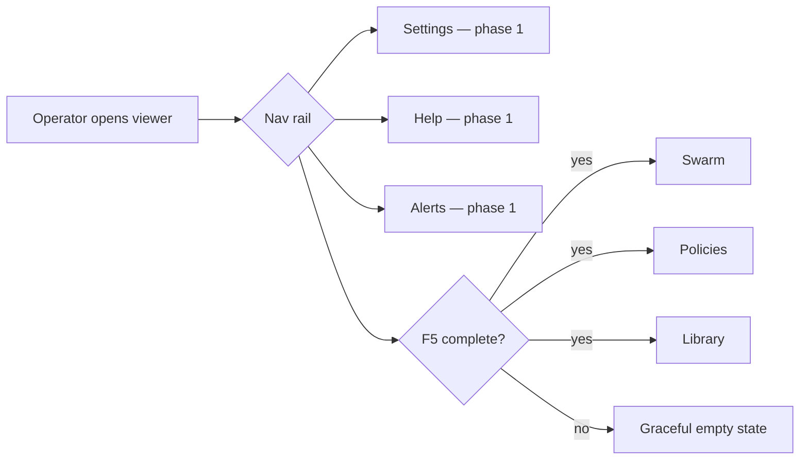
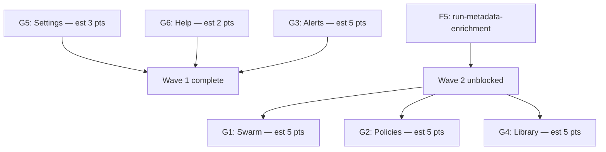

# Feature Brief & Metadata

**Feature Name:**

> Enable Disabled Viewer Tabs — Sub-Epic Index (G)

**Filepath Name:**

> `enable-disabled-viewer-tabs-epic-v1`

**Date:**

> 2026-06-20

**Author:**

> Nick Miethe (via Opus orchestration)

**Related Epic(s)/PRD ID(s):**

> `runs-viewer-v2.2-polish-epic` (parent); `run-metadata-enrichment` (F5, data prerequisite for data-dependent tabs)

**Related Documents:**

> - Parent epic: `docs/project_plans/PRDs/enhancements/runs-viewer-v2.2-polish-epic-v1.md`
> - Data prerequisite: `docs/project_plans/PRDs/features/run-metadata-enrichment-v1.md`
> - Child contracts: see §6 per-tab table and §13

---

## 1. Executive Summary

Six top-level navigation tabs in the runs-viewer SPA are hard-disabled with `'not implemented'` guards in `AppShell.tsx NAV_ITEMS`. This sub-epic unlocks them incrementally: cheap, data-independent tabs (Settings, Help, Alerts) ship first; data-dependent tabs (Swarm, Policies, Library) ship after F5 (`run-metadata-enrichment`) delivers enriched export fields. Each tab is a Tier 1 Feature Contract executed as an autonomous sprint. The shared contract for every tab: remove the disabled flag in `NAV_ITEMS`, register the route in `app/routes.tsx`, and render a new screen with a graceful empty state.

**Priority:** HIGH

**Key Outcomes:**
- Outcome 1: All 6 disabled nav tabs become navigable and render meaningful content.
- Outcome 2: Viewer feels complete and professional; no dead nav items visible to the operator.
- Outcome 3: Data-dependent tabs gracefully degrade until F5 export enrichment is complete.

---

## 2. Context & Background

### Current State

`AppShell.tsx NAV_ITEMS` (lines ~24-35) defines eight navigation items. Four are enabled or contextual (Portfolio, Runs, Reports, Ledger). Six are hard-disabled with a `'not implemented'` sentinel: **Library, Swarm, Policies, Alerts, Settings, Help**. Disabled items render in the nav rail but are not clickable and have no routes registered in `app/routes.tsx`.

A seventh tab — the Writeback detail tab inside a run's detail view — is a separate case: it is conditionally enabled by `writebackAvailable` data (not nav-level), driven by run-level `writebacks` data, and is NOT within this epic's scope.

### Problem Space

Disabled tabs erode trust in the viewer as a complete tool. The operator sees placeholder slots in the nav rail every session. Settings and Help in particular are zero-data features that can ship immediately; their continued disablement creates a poor first impression.

### Architectural Context

The viewer is a **read-only React SPA** at `frontend/runs-viewer`, deployed LAN-only at `10.42.10.76:3030`. Data flows from a static export: `prebuild-static-data.mjs` runs `rf run export --all`, producing `public/data/<id>/run.json` + `public/data/index.json`; Vite bundles it. `client.ts` supports an optional loopback API but is not required for these tabs. New screens register in `app/routes.tsx`; the nav entry is enabled in `AppShell.tsx NAV_ITEMS`.

---

## 3. Problem Statement

> "As the runs-viewer operator, when I look at the nav rail, I see six dead links that go nowhere — making the tool feel incomplete and reducing confidence in the data I can access."

**Technical Root Cause:**
- `AppShell.tsx NAV_ITEMS` guards each disabled tab with a `'not implemented'` flag (lines ~24-35).
- No route is registered in `app/routes.tsx` for any of the six tabs.
- No screen component exists for any tab.

---

## 4. Goals & Success Metrics

### Primary Goals

**Goal 1: Ship data-independent tabs fast (G5, G6, G3-partial)**
All three no-data-dependency tabs (Settings, Help, Alerts) are navigable with real content before F5 lands.

**Goal 2: Unlock data-dependent tabs after F5**
Swarm, Policies, and Library become functional once F5 export enrichment produces the required fields; each gracefully shows an empty-state placeholder until then.

**Goal 3: Zero regressions on existing navigation**
Enabling tabs must not break Portfolio, Runs, Reports, or Ledger routing or nav-highlight logic.

### Success Metrics

| Metric | Baseline | Target | Measurement Method |
|--------|----------|--------|--------------------|
| Disabled nav items | 6 | 0 | Manual nav audit post-deploy |
| Tabs with graceful empty state | 0 | 6 | Visual smoke test with empty data |
| Runtime smoke test pass | — | All 6 pass | R-P4 smoke task in each contract |

---

## 5. User Personas & Journeys

**Primary Persona: Research Foundry Operator (Nick)**
- Role: Solo LAN operator reviewing RF research runs
- Needs: Navigate to Settings to configure viewer; use Help for keyboard shortcuts and glossary; use Alerts to catch verification failures; use Swarm/Policies/Library for run governance and output visibility
- Pain Points: Dead nav links every session; must know internal file paths to find configuration

### High-level Flow

---

## 6. Per-Tab Inventory

The table below enumerates all six disabled tabs, their data sources, scope, tier, F5 dependency, child contract path, and AC summary. "Tier 1" for all; each contract is executed as an autonomous sprint by `feature-sprint-executor`.

| Tab | Data Source | Scope Summary | Tier | Depends on F5? | Child Contract Path |
|-----|------------|---------------|:----:|:--------------:|---------------------|
| **Settings** | Viewer config only (`foundry.yaml viewer.*`, `VITE_*` env, local storage) | Sensitivity threshold display, theme selector, default tab, base data path | 1 | No | `docs/project_plans/feature_contracts/features/viewer-tab-settings.md` |
| **Help** | Static content only | Keyboard shortcuts, RF glossary, about/version info | 1 | No | `docs/project_plans/feature_contracts/features/viewer-tab-help.md` |
| **Alerts** | `run.json` existing fields via `summarizeRunAttention()` in `lib/runs.ts` | Cross-run attention feed: verification failures, unsupported/contradicted claims, dangling sources, redactions, needs-human-review | 1 | No (uses existing export) | `docs/project_plans/feature_contracts/features/viewer-tab-alerts.md` |
| **Swarm** | `RFRunExport.context.swarm_plan`, `context.routing_decision`, agents list — enriched by F5 | Per-run swarm plan + agent roster + routing decision visualization | 1 | Yes — F5 exports `context.swarm_plan`/`routing_decision` | `docs/project_plans/feature_contracts/features/viewer-tab-swarm.md` |
| **Policies** | `RFRunExport.governance` block + `run.yaml` governance fields (sensitivity, approved_for_writeback, allowed_writebacks, requires_human_review); key profiles from `governance.py` | Per-run governance card + system policy display | 1 | Yes — F5 enriches governance export fields | `docs/project_plans/feature_contracts/features/viewer-tab-policies.md` |
| **Library** | `RFRunExport.writebacks[].{name,destination,status,url}`, reusable output candidates (F5), published reports index | Cross-run reusable outputs, writeback artifacts, skillbom candidates, published reports | 1 | Yes — F5 exports writeback + reusable_output fields | `docs/project_plans/feature_contracts/features/viewer-tab-library.md` |

**Estimated story points by tab:** Settings ~3, Help ~2, Alerts ~5, Swarm ~5, Policies ~5, Library ~5. Total: ~25 pts across 6 Tier 1 sprints.

**Note on writeback detail-tab:** The `writeback` tab inside the run detail view (`RunDetailWorkspace.tsx` line 42) is conditionally enabled by `writebackAvailable` (presence of F5 writeback-status data in the run export). It is NOT a top-level nav tab and is NOT in scope here. It will be addressed by the F5 run-metadata-enrichment contract.

---

## 7. Sequencing & Critical Path

Execution is in two waves. Wave 1 is independent of F5 and can start immediately. Wave 2 requires F5 export enrichment to ship meaningful data.

**Wave 1 (no F5 dependency — start immediately):**
- G5 Settings and G6 Help can run in parallel (pure static/config content, trivial data surface)
- G3 Alerts can run in parallel (uses existing `lib/runs.ts:summarizeRunAttention()` and current `run.json` fields)

**Wave 2 (after F5 export enrichment lands):**
- G1 Swarm, G2 Policies, G4 Library may run in parallel once the **Wave-2 Unblock Gate** (below) is satisfied.

#### Wave-2 Unblock Gate (concrete milestone)

Wave 2 is unblocked when **all** of the following hold:

1. **F5 Phase 4 — "Export & FE Types"** (the serialization barrier; see `docs/project_plans/implementation_plans/features/run-metadata-enrichment-v1/phase-4-5-export-and-display.md`) is merged — this is the phase that threads the enriched fields into `RFRunExport`.
2. **All runs are re-exported and the static bundle is rebuilt** (`public/data` regenerated via the viewer's static-data build). F5 code merged is *necessary but not sufficient* — the bundle must be rebuilt for the viewer to carry the new fields.
3. **Verification (state-checkable):** a sample re-exported run's `RFRunExport` carries `context.swarm_plan` + `context.routing_decision` (→ G1 Swarm) and `governance.allowed_writebacks` + `governance.requires_human_review` (→ G2 Policies).

**Gate owner:** `nick` (epic owner) confirms the re-export + bundle rebuild before dispatching Wave 2.

**Library (G4) nuance:** G4's `reusable_output_candidates` data may land in F5 Phase 7 (Enrichment Extras, P1) rather than P4 core. G4 may still start at the P4 gate — its writeback/report sections are F5-independent and the reusable-outputs section degrades gracefully (empty state) until P7. Do not block G4 solely on P7.

---

## 8. Shared Contract (All 6 Tabs)

Every child Feature Contract MUST satisfy these shared acceptance criteria in addition to tab-specific ACs.

### AC-SHARED-1: Nav item enabled

- **target_surfaces:**
  - `frontend/runs-viewer/src/app/AppShell.tsx` (NAV_ITEMS entry)
- Remove the `'not implemented'` disabled guard for the tab's NAV_ITEMS entry.
- The nav item is clickable and navigates to the tab's route.
- `isActiveNav()` highlights the tab correctly when the route is active.

### AC-SHARED-2: Route registered

- **target_surfaces:**
  - `frontend/runs-viewer/src/app/routes.tsx`
- A route is registered for the tab path (e.g., `/library`, `/swarm`, `/settings`, `/help`, `/alerts`, `/policies`).
- Navigating to the route renders the new tab screen without a 404 or blank page.

### AC-SHARED-3: New screen with graceful empty state

- **target_surfaces:**
  - The new tab's screen component (e.g., `frontend/runs-viewer/src/screens/SettingsScreen.tsx`)
- The screen renders with a sensible empty/placeholder UI when no data is available (or when F5 data fields are absent on pre-enrichment runs).
- Empty state includes: icon or illustration, short descriptive text, and (where applicable) a note on when data will appear.
- Screen does not throw or render a blank white page under any data condition.

### AC-SHARED-4: Runtime smoke verification

Each child contract MUST include a runtime smoke task (R-P4 requirement) in its verification phase that:
1. Opens the viewer in a browser.
2. Navigates to the new tab route.
3. Confirms the screen renders without console errors.
4. Confirms the nav item highlights correctly.
5. Confirms graceful empty state when data is absent.

### Shared-File Integration Strategy (locked decision)

The shared files `AppShell.tsx` (NAV_ITEMS) and `app/routes.tsx` are touched by every tab. **Locked strategy: parallel development + a single coordination commit per wave** — not sequential sprints, and not three independent piecemeal merges:

1. Each tab sprint builds its screen component and its *own* NAV_ITEMS/route delta on a separate branch.
2. Shared-file deltas are **not** merged piecemeal. After a wave's sprints complete, one **coordination commit** integrates all of that wave's NAV_ITEMS entries + route registrations in a single reviewed pass.
3. Screen-component changes (new files only) may merge independently; only the shared-file edits funnel through the coordination commit.

This keeps sprints parallel (fast) while confining the merge-conflict surface to one integration step per wave.

---

## 9. Requirements

### 9.1 Functional Requirements

| ID | Requirement | Priority | Notes |
|:--:|-------------|:--------:|-------|
| FR-1 | All 6 disabled NAV_ITEMS entries are enabled (disabled flag removed) | Must | AppShell.tsx lines ~24-35 |
| FR-2 | All 6 routes registered in `app/routes.tsx` | Must | One route per tab |
| FR-3 | Each tab renders a screen component with graceful empty state | Must | AC-SHARED-3 |
| FR-4 | Wave 1 tabs (Settings, Help, Alerts) ship without F5 dependency | Must | Can start immediately |
| FR-5 | Wave 2 tabs (Swarm, Policies, Library) gracefully degrade until F5 data is present | Must | Resilience per R-P2 |
| FR-6 | No regressions in Portfolio, Runs, Reports, or Ledger routing | Must | Verify via smoke test |
| FR-7 | Runtime smoke test passes for all 6 tabs | Must | R-P4 per-contract |

### 9.2 Non-Functional Requirements

**Performance:**
- Each new screen's initial render adds no perceptible load time for static-content tabs (Settings, Help).
- Data-driven tabs (Alerts, Swarm, Policies, Library) derive from already-loaded static export data — no additional network requests.

**Accessibility:**
- New screens follow existing viewer ARIA patterns (landmark roles, tab/route focus management).
- Nav items remain keyboard-navigable after enabling.

**Reliability:**
- Absence of F5-enriched export fields must never cause a tab to crash; always fall through to empty state.

---

## 10. Scope

### In Scope

- Enabling all 6 hard-disabled NAV_ITEMS entries in `AppShell.tsx`.
- Registering 6 new routes in `app/routes.tsx`.
- Creating 6 new screen components with content and graceful empty states.
- Runtime smoke verification task per tab (R-P4).
- Child Feature Contracts G1–G6 as enumerated in §6.

### Out of Scope

- The `writeback` detail tab inside run detail view (conditional on `writebackAvailable`, addressed by F5).
- Changes to existing enabled tabs (Portfolio, Runs, Reports, Ledger).
- Backend export changes (all backend work is F5's responsibility; these contracts consume F5 output).
- Auth or user-management features in Settings (viewer is LAN-only, single operator).
- Writing or mutating RF data from any tab (viewer is read-only).

---

## 11. Dependencies & Assumptions

### Internal Dependencies

- **F5 `run-metadata-enrichment`** (PRD: `docs/project_plans/PRDs/features/run-metadata-enrichment-v1.md`): Wave 2 tabs (G1 Swarm, G2 Policies, G4 Library) require F5 export enrichment to deliver meaningful content. Wave 1 tabs (G3, G5, G6) are independent.
- **`AppShell.tsx NAV_ITEMS`** (`frontend/runs-viewer/src/app/AppShell.tsx` lines ~24-35): shared file touched by all 6 tabs — coordinate to avoid merge conflicts when running tabs in parallel.
- **`app/routes.tsx`**: shared file touched by all 6 tab registrations — same coordination requirement.

### Assumptions

- Each tab is implemented as an independent Tier 1 sprint; no shared state management is required across tabs.
- Wave 1 sprints (G5, G6, G3) may run fully in parallel with each other.
- Wave 2 sprints (G1, G2, G4) may run fully in parallel with each other, provided they start after F5 export threading is complete.
- Shared file conflicts (`AppShell.tsx`, `routes.tsx`) are resolved via the locked Shared-File Integration Strategy (§8): one coordination commit per wave, not per-sprint piecemeal merges.

---

## 12. Risks & Mitigations

| Risk | Impact | Likelihood | Mitigation |
|------|:------:|:----------:|------------|
| Merge conflicts in `AppShell.tsx` and `routes.tsx` when 3 Wave 1 sprints run in parallel | Med | High | **Locked:** parallel dev + single coordination commit per wave (see §8 → Shared-File Integration Strategy) — shared NAV_ITEMS/route deltas integrated in one reviewed pass, not piecemeal |
| Wave 2 tabs silently break when F5 fields are absent (pre-enrichment runs) | Med | Med | Mandatory resilience AC per R-P2 in each Wave 2 contract; graceful empty state required |
| `isActiveNav()` does not correctly highlight new tab routes | Low | Low | Each contract includes a smoke test step verifying nav highlight |
| Child contract scope creep (e.g., Policies tab pulling in governance editing) | Med | Low | Scope boundaries explicit in each child contract; viewer is read-only — no mutations |

---

## 13. Appendices & References

### Child Feature Contracts (all Tier 1)

| Slug | Path | Wave | Est pts |
|------|------|:----:|:-------:|
| `viewer-tab-settings` | `docs/project_plans/feature_contracts/features/viewer-tab-settings.md` | 1 | 3 |
| `viewer-tab-help` | `docs/project_plans/feature_contracts/features/viewer-tab-help.md` | 1 | 2 |
| `viewer-tab-alerts` | `docs/project_plans/feature_contracts/features/viewer-tab-alerts.md` | 1 | 5 |
| `viewer-tab-swarm` | `docs/project_plans/feature_contracts/features/viewer-tab-swarm.md` | 2 | 5 |
| `viewer-tab-policies` | `docs/project_plans/feature_contracts/features/viewer-tab-policies.md` | 2 | 5 |
| `viewer-tab-library` | `docs/project_plans/feature_contracts/features/viewer-tab-library.md` | 2 | 5 |

### Source References (verified in epic-brief.md)

- `AppShell.tsx` NAV_ITEMS: brief §1.1 (lines ~24-35)
- `summarizeRunAttention()`: brief §1.8, `lib/runs.ts:81-105`
- `RFRunExport.context`, `governance`, `writebacks`: brief §1.10
- Backlog linkage + `suggested_project`: brief §1.11
- Export threading pattern: brief §0.1, §1.12

### Related Planning Documents

- Parent epic PRD: `docs/project_plans/PRDs/enhancements/runs-viewer-v2.2-polish-epic-v1.md`
- F5 PRD: `docs/project_plans/PRDs/features/run-metadata-enrichment-v1.md`
- Epic brief (source of truth): `.claude/worknotes/runs-viewer-v2.2-polish/epic-brief.md`

---

**Progress Tracking:**

See progress tracking: `.claude/progress/enable-disabled-viewer-tabs/all-phases-progress.md` (to be created when execution begins)
