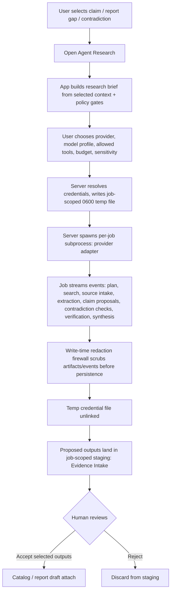

# Feature Brief & Metadata

**Feature Name:**

> Public Multi-User Release — Phase 4: Embedded Agent Research

**Filepath Name:**

> `public-multiuser-p4-agents-v1` (kebab-case)

**Date:**

> 2026-07-06

**Author:**

> Claude (Sonnet 5), prd-writer agent

**Related Epic(s)/PRD ID(s):**

> Parent initiative: Research Foundry Public Multi-User Release (`public-multiuser-release`). Sibling phase docs: P0+P1 plan (merged), P2+P3 opus handoff (merged, PRs #2/#3), P5 PRD (Public Multi-User Hardening — separate document, not covered here).

**Related Documents:**

> - Spec: `docs/project_plans/design-specs/public-multiuser-release-handoff-v1.md` (§9 Feature Area D, §10 API surface, §11 security/agent permissions, §12.4 Phase 4 scope+acceptance)
> - SPIKE (binding): `docs/project_plans/SPIKEs/public-multiuser-p4p5-foundations-spike.md` — ADR-002 (credential isolation, accepted GO)
> - Charter (background): `docs/project_plans/exploration/credential-process-isolation/credential-process-isolation-charter.md`
> - Precedent: `docs/project_plans/implementation_plans/public-multiuser-p2p3-opus-handoff.md` (D12 nullable-field forward-compat idiom, adapter/service patterns)

---

## 1. Executive Summary

Phase 4 gives Research Foundry a native, governed way to launch agent-driven follow-up research from inside the app — starting from a selected claim, report gap, or contradiction — instead of requiring an out-of-band CLI/swarm run. A server-owned `ResearchAgentProvider` abstraction wraps one initial provider (`claude_agent_sdk`, pending confirmation via OQ-1); a new agent-job model tracks launch, streamed status/artifacts, and proposed outputs; and every proposed output lands in job-scoped staging until a human explicitly accepts it into the Catalog. The load-bearing constraint, locked by SPIKE ADR-002, is credential isolation: each agent job runs in its own subprocess with credentials delivered via an unlinked, mode-0600 temp file — never an environment variable — closing the cross-profile and prompt-injection exfiltration paths that a live tool-use loop introduces and that today's in-process adapters do not have to defend against.

**Priority:** HIGH

**Key Outcomes:**
- Outcome 1: A researcher can launch a governed research job from a claim/report-gap context, watch it stream plan/search/extraction/verification events live, and review proposed source cards, claims, and report patches before anything touches the shared catalog.
- Outcome 2: Provider credentials never reach the browser, a job's persisted artifacts, or an unrelated adapter's process — enforced structurally (subprocess + temp-file + write-time redaction firewall), not by convention.
- Outcome 3: The `/agents` route ships as a real, governed product surface (budget/sensitivity/allowed-tools gates visible before launch) — not a disabled nav placeholder.

---

## 2. Context & Background

### Current State

Research Foundry already has the pieces Phase 4 composes, but no product-level job/session layer connects them:

- **Adapters are in-process imports.** `src/research_foundry/adapters/base.py` gates "real mode" purely on `importlib.util.find_spec`; there is no `subprocess`/`Popen` anywhere in the adapter layer. `src/research_foundry/adapters/claude_agent_sdk.py` exists today only as a degraded-mode stub — it echoes the request intent and returns `degraded=True`; real-mode execution is explicitly not implemented.
- **No `openai_agents` adapter file exists yet** — Phase 4 is greenfield for that provider (SPIKE finding G4).
- **Search Router and source-card/claim extraction are mature standalone services** — `src/research_foundry/services/search_router/` (`router.run_search`, `router.extract_urls`, budget tracking, safety/injection scanning) and `src/research_foundry/services/source_cards.py` (`ingest_source`, `create_source_card`) already produce the artifacts an agent job would need to intake, but nothing orchestrates them behind a job/session concept with streaming status.
- **Governance is deterministic-first and already has the shape Phase 4 needs to extend, not invent.** `src/research_foundry/services/governance.py` defines `ExitCode.HUMAN_REVIEW = 7` (`src/research_foundry/errors.py`), a `guard_check` policy pass, `scan_secrets`/`_redact` (currently invoked as a post-hoc scan, not a write-time guard), and a `work_writeback_requires_review` rule that ADR-002 explicitly generalizes into `agent_job_output_requires_review`.
- **Key profiles are name-level only.** `config/governance.yaml` defines `personal`/`work_approved`/`client_approved` profiles with per-profile `env_file` (`.env.personal`, etc., gitignored) but `no_work_keys_for_personal_runs` checks the declared profile name, not key material — any in-process adapter can read any key present in `os.environ` (SPIKE finding G1).
- **The frontend nav placeholder already exists and is correctly gated.** `frontend/runs-viewer/src/app/AppShell.tsx` `NAV_ITEMS` has `{ label: "Agents", state: "disabled", disabledReason: "Planned — governed agent research (Phase 4)" }`. Builder (P3) shipped the loopback-vs-static pattern this phase should reuse: `isBuilderLoopbackEnabled()` (`hooks/useBuilder.ts` re-exporting `api/reportsClient.ts`'s `isLoopbackEnabled`) gates a route to server-backed behavior in loopback mode and a read-only/disabled message in static-export mode. A frontend `EventSource` stub already exists in `frontend/runs-viewer/src/test/setup.ts`, anticipating SSE consumption.
- **File-canonical durable state, sqlite3-cache-only read models.** P2/P3 established the pattern this phase must follow: `catalog.db` (`.rf_cache/catalog.db`) is drop-and-rebuild-on-`user_version`-mismatch and holds only derived, rebuildable indexes; durable state lives as YAML/Markdown under the workspace root (e.g., `reports/drafts/<report_draft_id>/draft.yaml` via `FoundryPaths.report_draft_dir`). Agent job artifacts and proposals must follow the same discipline.

### Problem Space

Today, running agent-assisted research requires the out-of-app RF swarm workflow (Claude-authored source cards + a deterministic `rf` tail) — there is no in-app way to launch a scoped follow-up job, watch it progress, or gate its outputs behind an explicit review step. Worse, that gap has been safe only because today's adapters are static (single-shot, no live tool-use loop). Phase 4 introduces `openai_agents`-class server-owned orchestration with tools, guardrails, and multi-step reasoning — a genuinely new risk class the SPIKE calls out (finding G3: prompt-injection exfiltration) that the current in-process, shared-environment adapter model cannot safely host.

### Current Alternatives / Workarounds

- **CLI/swarm run (Path B)**: Claude Code agents author source cards, `rf` runs the deterministic tail. Works, but has no live browser-facing status, no acceptance UI, and (per the charter) no credential-isolation boundary designed for a live tool-use loop.
- **Direct adapter invocation**: `claude_agent_sdk.py`'s degraded stub can be called today, but real mode is intentionally unimplemented — it would require live SDK + credentials with no isolation boundary, which is precisely what ADR-002 exists to prevent from shipping unsafely.

### Architectural Context

Research Foundry's layered pattern: routers (`api/routers/*.py`, thin HTTP wrappers) → services (`services/*.py`, all business logic, file I/O, and now subprocess orchestration for agent jobs) → file-canonical YAML/Markdown durable state, with sqlite3 (`catalog.db`) as a rebuildable read-model cache only. All API responses use structured DTOs; errors map through `RFError`/`NotFoundError` to a consistent envelope (see `reports.py`'s "identical 404 for malformed id and missing record" pattern — reuse for agent-job IDs). Cursor-style list pagination and consistent error envelopes are the house style for any list/detail endpoint added here.

---

## 3. Problem Statement

**User Story Format:**
> As a researcher reviewing a claim ledger gap or an unsupported report paragraph, when I want follow-up research, I currently have to leave the app and run an out-of-band swarm/CLI workflow with no live status and no review gate, instead of launching a governed, observable, in-app research job whose outputs I explicitly accept before they become catalog or report content.

**Technical Root Cause:**
- No agent-job data model, API, or event-streaming transport exists (`api/routers/` has no agent-jobs router).
- No `ResearchAgentProvider` abstraction exists; `claude_agent_sdk.py` is a stub with real-mode execution explicitly unimplemented, and `openai_agents.py` doesn't exist.
- No subprocess spawn boundary exists anywhere in the adapter layer (`adapters/base.py` is purely in-process `importlib`-gated).
- `scan_secrets`/`_redact` in `governance.py` run as a post-hoc scan today, not a write-time guard on live artifact/event payloads.
- Files involved: `src/research_foundry/adapters/{base,claude_agent_sdk}.py`, `src/research_foundry/services/{governance,telemetry,search_router/*,source_cards}.py`, `src/research_foundry/api/routers/` (new `agent_jobs.py`), `frontend/runs-viewer/src/app/AppShell.tsx`, new `AgentsScreen.tsx`.

---

## 4. Goals & Success Metrics

### Primary Goals

**Goal 1: Ship one governed agent provider end-to-end**
- One `ResearchAgentProvider` implementation reaches launch → stream → propose → accept, before the second provider is started (spec §12.4, §9).
- Success: a full job lifecycle (queued → running → waiting_for_approval/completed → accepted) is exercisable in the loopback API and covered by an integration test.

**Goal 2: Structural credential isolation (ADR-002), not convention**
- Every `openai_agents`/`claude_agent_sdk` job runs in its own subprocess; credentials reach it only via a job-scoped, mode-0600, immediately-unlinked temp file.
- Success: no code path passes provider credentials via environment variable inheritance to a job subprocess; a secret-scan test asserts 0 raw credential matches in persisted job artifacts/events.

**Goal 3: Agents propose, humans accept — enforced, not advisory**
- Proposed source cards/claims/inferences/report patches land in job-scoped staging; promotion to Catalog/Report requires an explicit accept action gated by the new `agent_job_output_requires_review` rule (exit-code-7 `HUMAN_REVIEW`).
- Success: no code path writes an agent job's proposed output directly into `catalog_service`/`builder_service` state without passing through the accept endpoint.

### Success Metrics

| Metric | Baseline | Target | Measurement Method |
|--------|----------|--------|-------------------|
| Raw credential matches in job artifacts/events | N/A (no job model exists) | 0 | Secret-scan assertion test over persisted job trace + event stream fixtures |
| Agent-job outputs reaching Catalog without acceptance | N/A | 0 | Code-path audit + E2E test: attempt direct catalog write from a job context, assert rejection |
| `agent_job_event` rows with `key_fingerprint` when a credential was resolved | N/A | 100% | Telemetry schema assertion in job-lifecycle tests |
| Governance gates (budget/sensitivity/allowed-tools) rendered before job launch | N/A (no UI exists) | 100% of launch attempts | Frontend test asserting launch is blocked until gates are displayed and acknowledged |

---

## 5. User Personas & Journeys

### Personas

**Primary Persona: Researcher (single operator, LAN/loopback)**
- Role: Uses RF day-to-day to review claims, audit reports, and fill evidence gaps.
- Needs: A fast way to say "go find more on this" from a claim or report paragraph, watch progress, and review results before trusting them.
- Pain Points: Today this means leaving the app for a CLI/swarm run with no live feedback.

**Secondary Persona: Reviewer/Approver (same operator, different mode)**
- Role: The human-in-the-loop who approves credential-file code, the first live job, the redaction guard, and pepper storage (SPIKE Mode-D gates) during implementation, and who accepts/rejects proposed outputs during normal operation.
- Needs: Clear, auditable gates — both at build time (sign-off checkpoints) and at run time (accept/reject UI).
- Pain Points: No acceptance workflow exists today to distinguish "agent produced this" from "a human vetted this."

### High-level Flow

---

## 6. Requirements

### 6.1 Functional Requirements

| ID | Requirement | Priority | Notes |
| :-: | ----------- | :------: | ----- |
| FR-1 | Define a `ResearchAgentProvider` protocol (`start_job`, `stream_events`, `cancel_job`, `list_artifacts`, `accept_artifacts`) mirroring the existing `adapters/base.py` Protocol + registry idiom (spec §9). | Must | New module, e.g. `services/agent_providers/base.py`; registry pattern reused from `adapters/register`/`get_adapter`. |
| FR-2 | Ship exactly one concrete provider adapter to full real-mode execution in P4; the second provider is scaffolded as a registry entry but not implemented until the job model is stable. **Which provider ships first is OQ-1** — do not hard-pick in this PRD. | Must | Candidates: `claude_agent_sdk` (existing degraded stub to promote) or `openai_agents` (net-new). |
| FR-3 | Add an `agent_job` record: `agent_job_id`, `workspace_id` (nullable, D12), `project_id` (nullable), `provider`, `model_profile` (existing `config/model_profiles.yaml` name where possible), `request_kind`, `input_claim_ids`, `input_source_ids`, `input_report_id`, `policy_snapshot`, `budget_usd`, `max_runtime_minutes`, `status`, `created_by_user_id` (nullable, D12), `created_at`/`updated_at`. | Must | Status enum: `queued, running, waiting_for_approval, failed, canceled, completed, accepted`. File-canonical durable store per workspace-root convention (mirrors `report_draft_dir`), not `catalog.db`. |
| FR-4 | Add `agent_job_event`, `agent_job_artifact`, `agent_job_tool_call`, `agent_job_approval`, `agent_job_acceptance` records (spec §9). | Must | Events carry: stage (`plan/search/source_intake/extraction/claim_proposal/contradiction_check/verification/synthesis`), timestamp, redacted payload. |
| FR-5 | `POST /api/agent-jobs` — launch a job from a research brief (selected claim(s)/source(s)/report target, provider, model profile, allowed tools, budget, sensitivity). | Must | Spec §10. Validates policy_snapshot before spawn; rejects if governance pass fails (mirrors `guard_check`). |
| FR-6 | `GET /api/agent-jobs/{agent_job_id}` — job detail/status. | Must | Same "malformed id → identical 404" discipline as `reports.py` (no existence leak). |
| FR-7 | `GET /api/agent-jobs/{agent_job_id}/events` — stream job events via SSE. | Must | Spec §10: "SSE is sufficient for v1." Server-to-client only in v1. |
| FR-8 | `POST /api/agent-jobs/{agent_job_id}/cancel` — cancel a running job. | Must | Must terminate the subprocess and guarantee credential-file cleanup (crash-safe, ADR-002 consequence). |
| FR-9 | `POST /api/agent-jobs/{agent_job_id}/accept` — accept selected proposed artifacts into Catalog (and optionally attach to a report draft). | Must | This is the sole write path from a job's staged outputs into `catalog_service`/`builder_service`; gated by `agent_job_output_requires_review` (exit-code-7 `HUMAN_REVIEW`). |
| FR-10 | `GET /api/agent-jobs/{agent_job_id}/artifacts` (or embed in job detail) — list proposed artifacts pending review, distinct from accepted ones. | Must | Backs the frontend Evidence Intake list. |
| FR-11 | Subprocess-per-agent-job spawn: one child process per `openai_agents`/`claude_agent_sdk` job, holding only that job's resolved credential set. | Must | ADR-002. Existing static adapters (`gpt_researcher`, `paperqa2`, `litellm_router`, `opencode`, `arc_council`, `notebooklm`) explicitly stay in-process — this requirement does not reopen that question. |
| FR-12 | Credential delivery to the subprocess via a job-scoped temp file: mode `0600`, unique per-job path, unlinked immediately after the child reads it. | Must | Never an env var (env inheritance into any tool-spawned grandchild reintroduces the leak — ADR-002). Crash-safe cleanup must be tested (SPIKE consequence). |
| FR-13 | Write-time redaction firewall: reuse `governance.py`'s `scan_secrets`/`_redact` as a guard applied to artifact and event payloads *before* they are persisted or streamed, not only as a post-hoc scan. | Must | ADR-002. |
| FR-14 | Key fingerprint: salted-HMAC (server pepper, not a raw prefix hash) truncated to ~12 hex chars, recorded in both the run/job trace and CCDash telemetry alongside existing `key_profile_used` (`services/telemetry.py`). | Must | Pepper storage location is OQ-2 / SPIKE Mode-D gate #4. |
| FR-15 | Extend `policy_snapshot` with `allowed_tools` / `data_scopes`, enforced via each provider SDK's native guardrail/permission hooks. | Must | Spec §11. |
| FR-16 | Generalize `work_writeback_requires_review` into `agent_job_output_requires_review`: outputs land in job-scoped staging; promotion (file write, writeback, sharing, catalog acceptance) requires one exit-code-7 `HUMAN_REVIEW` approval per job, applied *after* the deterministic governance pass. | Must | ADR-002; reuses `ExitCode.HUMAN_REVIEW = 7` (`errors.py`). |
| FR-17 | Integrate existing Search Router (`services/search_router/router.run_search`, `extract_urls`) and source-card/claim extraction (`services/source_cards.py`) as tools/stages available to an agent job. | Must | Spec §9: jobs run "from a selected claim or report gap" — the brief-building step composes existing services, does not reimplement search. |
| FR-18 | Frontend `/agents` route: flip `AppShell.tsx` `NAV_ITEMS` Agents entry from `state: "disabled"` to `state: "enabled"`. | Must | Mirrors the P3 Builder flip. |
| FR-19 | `AgentsScreen.tsx`: job launch flow (claim/report-gap context → provider/model/tools/budget/sensitivity selection → governance gates displayed), live event stream panel, Evidence Intake (proposed artifacts) with accept/reject actions, job history list. | Must | Loopback-only in v1 (job orchestration requires a server) — reuse the `isBuilderLoopbackEnabled()` pattern (`hooks/useBuilder.ts` / `api/reportsClient.ts`) for an `isAgentsLoopbackEnabled()` analog; static mode renders a disabled/informational state, not a broken UI. |
| FR-20 | CLI parity: `rf agent-job launch|status|events|cancel|accept` mirroring existing `rf catalog`/`rf report draft` CLI conventions (threshold parity where reads are sensitivity-gated). | Should | Keeps CLI and API on one code path per house style. |

### 6.2 Non-Functional Requirements

**Performance:**
- Subprocess spawn latency is currently **unmeasured** (SPIKE consequence). FU-1 (deferred item, see §12) benchmarks this; implementation may proceed on the subprocess design in parallel, with in-process scoping as the documented fallback if the benchmark shows prohibitive cost (SPIKE verdict).
- SSE event delivery should not block the request/response cycle of other API routes (async/streaming-safe implementation).

**Security:**
- No provider credential ever reaches the browser, a job's persisted artifacts, or an unrelated process (ADR-002; this is the crown-jewel NFR for this phase).
- Job-scoped credential temp files must be created with mode `0600` and unlinked immediately after the child process reads them; cleanup must be crash-safe (tested: kill the subprocess mid-run, assert the temp file does not survive).
- Key fingerprint must never itself be flaggable by `governance.yaml`'s `secret_patterns` (SPIKE finding, carried from the charter's fingerprint-telemetry leg).

**Reliability:**
- Job cancellation must reliably terminate the subprocess and clean up its credential file even under process-kill/crash scenarios.
- Catalog/report state must never be left partially mutated by an unaccepted or canceled job (staging is isolated from durable catalog/report stores).

**Observability:**
- Every agent job emits structured events with stage, timestamp, and (when applicable) `key_fingerprint`, landing in both the job trace and CCDash telemetry alongside existing `key_profile_used`.
- Job status/lifecycle transitions are traceable end-to-end (queued → accepted or canceled/failed) for audit purposes (spec §11 audit requirement).

**Accessibility:**
- `AgentsScreen.tsx` launch flow, event stream panel, and Evidence Intake list follow existing RF frontend accessibility conventions (keyboard-navigable job list/detail, ARIA live region for streaming status updates).

---

## 7. Scope

### In Scope

- `ResearchAgentProvider` protocol/registry; one concrete provider promoted to real-mode execution (provider choice: OQ-1).
- Agent job data model (`agent_job`, `agent_job_event`, `agent_job_artifact`, `agent_job_tool_call`, `agent_job_approval`, `agent_job_acceptance`) and its file-canonical durable store.
- Agent job APIs: launch, detail, event streaming (SSE), cancel, accept, artifact listing; CLI parity commands.
- Job-scoped staging for proposed outputs; acceptance workflow as the sole promotion path into Catalog/Report.
- Integration with existing Search Router and source-card/claim extraction services as job stages/tools.
- Credential isolation per ADR-002: subprocess-per-agent-job, temp-file credential delivery (0600, unlinked), write-time redaction firewall, salted-HMAC key fingerprint, exit-code-7 `HUMAN_REVIEW` promotion gate.
- Governance gates (budget, sensitivity, allowed-tools/data-scopes) visible in the launch UI and enforced server-side.
- Frontend `/agents` route: flip AppShell nav from disabled to enabled; launch flow, event stream, Evidence Intake, job history.

### Out of Scope

- **Auth/RBAC enforcement and workspace isolation** — P5. P4 runs under the existing loopback/LAN single-operator model. `workspace_id`/`created_by` fields on the new agent-job records are nullable and unenforced (D12 precedent), carried forward for P5 to enforce.
- **The second provider adapter** (whichever of `openai_agents`/`claude_agent_sdk` is not chosen in OQ-1) — scaffolded as a registry entry, not implemented, until the job model is proven stable.
- **`oidc`/BYO and `clerk` auth providers** (SEAM-1, ADR-001) — P5.
- **FU-1 spawn-latency micro-benchmark** as a hard blocking prerequisite — tracked as a deferred item (§12), not required to complete before Wave-A design work starts, per SPIKE verdict.
- **Data migration to enforce `workspace_id`/`created_by`** — explicitly a P5 Mode-D sign-off gate (SPIKE gate #5), not this phase.
- **Multi-tenant / multi-operator credential models** — out of scope per the charter (RF is single-operator, LAN-local; the charter explicitly excludes revisiting this).

---

## 8. Dependencies & Assumptions

### External Dependencies

- **Provider SDK** (whichever wins OQ-1): Claude Agent SDK (Python) or OpenAI Agents SDK (Python). Neither is currently an installed/pinned dependency; adding it is part of this phase's scope for the chosen provider.

### Internal Dependencies

- **Search Router** (`services/search_router/`): stable, in production use via CLI/MCP — status: existing.
- **Source cards / claim extraction** (`services/source_cards.py`, claim ledger schema): stable — status: existing.
- **Governance** (`services/governance.py`, `config/governance.yaml`): stable, extended (not replaced) by this phase — status: existing, extension required.
- **Catalog** (`services/catalog_service.py`, P1): stable — status: existing; agent job acceptance writes through this service's existing import/insert paths, does not bypass them.
- **Builder** (`services/builder_service.py`, P3): stable — status: existing; agent job acceptance may attach outputs to a report draft through this service's existing block/claim-link APIs.
- **Telemetry** (`services/telemetry.py`): stable, extended with `key_fingerprint` — status: existing, extension required.
- **AppShell nav placeholder**: already correctly gated (`disabled`, "Phase 4") — status: existing, flip required.

### Assumptions

- P4 ships and operates under the existing loopback/LAN single-operator deployment model; no auth/RBAC gate blocks job launch or acceptance (P5 concern).
- The operator (single human) is both the researcher and the approver for Mode-D sign-off gates during implementation and for run-time accept/reject decisions.
- `catalog.db`'s drop-and-rebuild-on-mismatch cache discipline extends to any derived agent-job index the same way it does for catalog items and report drafts — durable job state lives in files, not the cache.

### Feature Flags

- `agents.enabled` (foundry.yaml): gates the entire Phase 4 surface (API routes + frontend route) — default `false` until Mode-D sign-off gates 1–3 clear (see §11).
- Per-provider enable flag (e.g. `agents.providers.<name>.enabled`): the non-shipped provider's registry entry stays present but disabled by default.

---

## 9. Risks & Mitigations

| Risk | Impact | Likelihood | Mitigation |
| ----- | :----: | :--------: | ---------- |
| Subprocess spawn latency is prohibitive for interactive use | Med | Med | FU-1 micro-benchmark (deferred item); documented in-process-scoping fallback per SPIKE verdict if latency proves unacceptable |
| Prompt-injection exfiltration via a live tool-use loop (SPIKE finding G3) | High | Med | Allowlisted tools/data-scopes enforced via provider-native guardrail hooks (FR-15); write-time redaction firewall (FR-13); staging-only outputs until human acceptance (FR-16) |
| Credential temp file survives a crash (not unlinked) | High | Low | Crash-safe cleanup test: kill subprocess mid-run, assert temp file removed; consider a reaper/janitor pass on job-store startup as defense-in-depth |
| Server pepper for key fingerprint itself becomes a credential-storage problem | Med | Med | Explicit Mode-D sign-off gate #4 (SPIKE) before shipping; OQ-2 tracks the storage-location decision |
| Agent output accidentally bypasses staging and mutates Catalog/Report directly | High | Low | FR-9/FR-16: acceptance endpoint is the only write path; code-path audit + E2E test asserting direct-write attempts are rejected |
| Fingerprint or redaction firewall itself leaks secret material (e.g., low-entropy prefix hash reversible) | Med | Low | Salted-HMAC construction (not raw prefix hash) per ADR-002; verified against `governance.yaml` `secret_patterns` so the fingerprint is never itself flagged |
| Scope creep into P5 auth/RBAC during implementation | Med | Med | Explicit Out-of-Scope section (§7); nullable D12 fields carried but unenforced; any auth work discovered as necessary triggers a stop-and-escalate per Mode D |

---

## 10. Target State (Post-Implementation)

**User Experience:**
- A researcher selects a claim, report paragraph, or unresolved gap and opens Agent Research from that context.
- The launch flow shows provider, model profile, allowed tools, budget, and sensitivity gates before allowing launch — no hidden defaults.
- Once launched, a live event panel streams plan/search/intake/extraction/proposal/verification/synthesis stages.
- Proposed outputs appear in an Evidence Intake list, separate from anything already in the Catalog; the researcher accepts or rejects individually.
- Accepted outputs appear in the Catalog (and, if attached, in the targeted report draft) carrying a `created_by_agent_job_id` provenance link.

**Technical Architecture:**
- `api/routers/agent_jobs.py` (thin HTTP layer) → `services/agent_job_service.py` (job lifecycle, subprocess orchestration, staging) → `services/agent_providers/{base,claude_agent_sdk,openai_agents}.py` (provider protocol + one real implementation) → provider SDK running in a per-job subprocess.
- Job durable state under a new `FoundryPaths` accessor (e.g. `agent_jobs/<agent_job_id>/`) mirroring `report_draft_dir`'s discipline; any sqlite-backed index is rebuildable-cache-only.
- Credential flow: `config/governance.yaml` profile → resolved secret material → job-scoped `0600` temp file → subprocess reads once → file unlinked. No env var carries the secret across the process boundary.
- Redaction: `governance.scan_secrets`/`_redact` invoked as a write-time guard inside the event/artifact persistence path, not only as an async post-hoc scan.

**Observable Outcomes:**
- CCDash telemetry events for agent jobs carry `key_profile_used` + `key_fingerprint` alongside existing fields.
- `AppShell.tsx` Agents nav item is enabled; static-export mode shows a clear "loopback-only" message rather than a broken route.

---

## 11. Overall Acceptance Criteria (Definition of Done)

Expanded from spec §12.4's four Phase 4 acceptance bullets. Structured ACs use the AC schema (`target_surfaces`, `propagation_contract`, `resilience`, `visual_evidence_required`, `verified_by`) per Plan Generator Rules R-P1/R-P2 where the AC spans multiple UI surfaces or depends on a new backend field.

### AC-1: Governed job launch from a selected claim or report gap

> Spec §12.4 bullet: "User can run a governed follow-up research job from a selected claim or report gap."

- **AC-1.1**: Launching Agent Research from a claim in `ClaimAuditWorkbench` or a flagged paragraph in the report audit surface pre-populates the research brief with that context (input_claim_ids / input_report_id).
- **AC-1.2**: The launch flow blocks submission until provider, model profile, allowed tools, budget, and sensitivity are explicitly set (no silent defaults reach the subprocess).
- **AC-1.3**: A launched job fails closed (does not spawn) if the deterministic governance pass (`guard_check`) rejects the request — mirrors existing `no_work_keys_for_personal_runs`-style blocking behavior, not a soft warning.

#### AC-1.4: Launch entry point is reachable from claim and report-gap contexts
- target_surfaces:
    - frontend/runs-viewer/src/components/ClaimLedger/ClaimAuditWorkbench.tsx
    - frontend/runs-viewer/src/components/ReportOverlay/ReportOverlay.tsx
    - frontend/runs-viewer/src/screens/AgentsScreen.tsx
- propagation_contract: >
    Selected claim_id(s) or report paragraph/anchor context are passed via route state (query param or router state) from ClaimAuditWorkbench/ReportOverlay's "Research this" action into AgentsScreen's launch form, pre-populating input_claim_ids / input_report_id.
- resilience: >
    If no context is passed (direct navigation to /agents), the launch form renders with an empty/manual context picker rather than erroring.
- visual_evidence_required: before/after screenshots at desktop >=1440px showing the "Research this" entry point and the pre-populated launch form.
- verified_by:
    - AGENT-VERIFY-launch-context-smoke

### AC-2: Job streams status and artifacts

> Spec §12.4 bullet: "Job streams status and artifacts."

- **AC-2.1**: `GET /api/agent-jobs/{agent_job_id}/events` delivers server-to-client SSE events for each stage transition (plan, search, source_intake, extraction, claim_proposal, contradiction_check, verification, synthesis) within the job's lifetime.
- **AC-2.2**: Every streamed event and every persisted `agent_job_event`/`agent_job_artifact` row has passed through the write-time redaction firewall before being sent to the client or written to disk.

#### AC-2.3: Event stream renders live in the Agents UI
- target_surfaces:
    - frontend/runs-viewer/src/screens/AgentsScreen.tsx
    - frontend/runs-viewer/src/components/Agents/AgentJobEventPanel.tsx
- propagation_contract: >
    AgentsScreen opens an EventSource against GET /api/agent-jobs/{id}/events on job selection; AgentJobEventPanel consumes the stream via a useAgentJobEvents hook and appends events to an ARIA live region as they arrive.
- resilience: >
    If the SSE connection drops or the job has no events yet, AgentJobEventPanel shows a "waiting for events" state rather than an empty/blank panel; on reconnect it resumes from the last known event without duplicating rows.
- visual_evidence_required: before/after screenshots at desktop >=1440px of the event panel mid-stream (running job) and post-completion (accepted job).
- verified_by:
    - AGENT-VERIFY-event-stream-smoke

### AC-3: Proposed outputs do not enter the catalog until accepted

> Spec §12.4 bullet: "Proposed outputs do not enter the catalog until accepted."

- **AC-3.1**: All source cards, claims, inferences, and report patches an agent job produces are written only to job-scoped staging (`agent_job_artifact` + associated files), never directly to `catalog_service` tables or `builder_service` draft files.
- **AC-3.2**: `POST /api/agent-jobs/{agent_job_id}/accept` is the only code path that promotes a staged artifact into the Catalog (via existing `catalog_service` insert paths) or a report draft (via existing `builder_service` block/claim-link APIs); a code-path audit test asserts no other route/service calls those write paths from agent-job context.
- **AC-3.3**: Accepted catalog items and report blocks/claim-links carry a resolvable `created_by_agent_job_id` for provenance.
- **AC-3.4**: Canceling or letting a job fail leaves zero staged artifacts promoted — staging is discarded, not partially committed.

#### AC-3.5: Evidence Intake acceptance flow — FE handles missing/partial staged data
- target_surfaces:
    - frontend/runs-viewer/src/screens/AgentsScreen.tsx
    - frontend/runs-viewer/src/components/Agents/EvidenceIntakePanel.tsx
- propagation_contract: >
    AgentsScreen fetches staged artifacts via GET /api/agent-jobs/{id}/artifacts (or the artifacts field embedded in job detail); EvidenceIntakePanel renders each staged item with individual accept/reject controls and calls POST /api/agent-jobs/{id}/accept with the selected subset.
- resilience: >
    If a staged artifact is missing an expected field (e.g. no source_candidates for a claim_proposal stage), EvidenceIntakePanel renders that item with a "incomplete proposal — review before accepting" badge rather than silently omitting it or crashing the list.
- visual_evidence_required: before/after screenshots at desktop >=1440px of the Evidence Intake list with at least one accepted and one rejected item.
- verified_by:
    - AGENT-VERIFY-acceptance-flow-smoke
    - AGENT-VERIFY-no-direct-write-audit

### AC-4: Budget, sensitivity, and allowed-tool gates are visible and enforced

> Spec §12.4 bullet: "Budget, sensitivity, and allowed-tool gates are visible and enforced."

- **AC-4.1**: `policy_snapshot` (including `allowed_tools` and `data_scopes`) is captured at launch time and frozen for the job's lifetime; the provider SDK's native guardrail/permission hooks are configured from this snapshot, not re-read from mutable config mid-run.
- **AC-4.2**: A job whose provider SDK attempts an action outside its `allowed_tools`/`data_scopes` is blocked at the SDK guardrail layer, and the block is recorded as an `agent_job_event`.
- **AC-4.3**: `budget_usd` / `max_runtime_minutes` are enforced server-side — a job exceeding either transitions to `failed` (or a defined budget-exceeded status) rather than continuing silently.

#### AC-4.4: Governance gates are visible before launch — target_surfaces required (R-P1: "visible" trigger)
- target_surfaces:
    - frontend/runs-viewer/src/screens/AgentsScreen.tsx
    - frontend/runs-viewer/src/components/Agents/AgentJobLaunchForm.tsx
    - frontend/runs-viewer/src/components/Agents/PolicyGateSummary.tsx
- propagation_contract: >
    AgentJobLaunchForm holds the in-progress policy_snapshot (provider, model_profile, allowed_tools, data_scopes, budget_usd, max_runtime_minutes, sensitivity) in local form state; PolicyGateSummary renders a read-only summary of the same state and must be visibly acknowledged (checkbox or equivalent) before the Launch button enables.
- resilience: >
    If the backend rejects the launch (governance guard_check failure), AgentJobLaunchForm surfaces the specific violated rule_id and message (from the guard_check response) rather than a generic error.
- visual_evidence_required: before/after screenshots at desktop >=1440px of the launch form with PolicyGateSummary populated and the Launch button in both disabled (gates unacknowledged) and enabled states.
- verified_by:
    - AGENT-VERIFY-launch-gates-smoke

#### AC-4.5: FE handles missing policy_snapshot fields (R-P2: new backend field resilience)
- target_surfaces:
    - frontend/runs-viewer/src/components/Agents/PolicyGateSummary.tsx
    - frontend/runs-viewer/src/screens/AgentsScreen.tsx
- propagation_contract: >
    PolicyGateSummary reads policy_snapshot from the agent_job detail response (GET /api/agent-jobs/{id}) when viewing an existing job's history.
- resilience: >
    If a job record predates a policy_snapshot field being added (schema evolution) or a field is null, PolicyGateSummary renders "not recorded" for that field rather than omitting the row or throwing.
- visual_evidence_required: false
- verified_by:
    - AGENT-VERIFY-policy-snapshot-resilience

### AC-5: Credential isolation gates (ADR-002 structural requirements — automated verification)

- **AC-5.1**: A secret-scan test over persisted job artifacts, event payloads, and CCDash telemetry for a completed job with a real (test) credential asserts 0 raw credential matches.
- **AC-5.2**: A crash-safety test kills the job subprocess mid-run and asserts the credential temp file no longer exists on disk afterward.
- **AC-5.3**: A code-path test asserts no job-related code passes a credential via `os.environ`/subprocess `env=` inheritance — only the temp-file path is exercised.
- **AC-5.4**: A telemetry assertion test confirms `key_fingerprint` is present and matches the salted-HMAC construction (not a raw/reversible prefix hash) whenever a credential was resolved for a job.
- **AC-5.5**: A governance test confirms `key_fingerprint` values are never matched by `config/governance.yaml`'s `secret_patterns` (the fingerprint must not itself be flaggable as a leaked secret).

### AC-6: Mode-D human sign-off gates (SPIKE §"Mode-D human sign-off gates" — process verification, not automated tests)

These four gates are explicit, sequential human approvals required **during execution**, not deliverables to automate away. Each must be logged (who approved, when, what was reviewed) before the next implementation wave proceeds.

- **AC-6.1 (Gate 1)**: Explicit human approval obtained **before** any subprocess-spawn or credential-file code is written.
- **AC-6.2 (Gate 2)**: Explicit human approval obtained **before** the first live job runs with real (non-test) provider keys.
- **AC-6.3 (Gate 3)**: Explicit human approval obtained **verifying the write-time redaction guard against a real run trace** (not a synthetic fixture) before the guard is trusted in normal operation.
- **AC-6.4 (Gate 4)**: Explicit human sign-off obtained on the **server pepper storage location** (OQ-2) before the key-fingerprint feature ships.

### Technical Acceptance

- [ ] Follows Research Foundry layered architecture (routers → services → file-canonical durable state; sqlite only as rebuildable cache).
- [ ] All new API responses are structured DTOs with the existing error envelope (`RFError`/`NotFoundError` → indistinguishable 404 for malformed IDs, matching the `reports.py` precedent).
- [ ] Cursor-style pagination applied to any list endpoint returned by this phase (job history, staged artifacts) if the list is unbounded.
- [ ] New `agent_job*` schemas include nullable `workspace_id`/`created_by`-equivalent fields per D12, unenforced.

### Quality Acceptance

- [ ] Unit tests cover: job lifecycle state machine, credential temp-file creation/cleanup (including crash path), write-time redaction firewall, key-fingerprint construction, policy_snapshot freeze-at-launch behavior.
- [ ] Integration tests cover: full job lifecycle (queued → running → waiting_for_approval/completed → accepted), acceptance-is-the-only-write-path audit, governance-pass rejection at launch.
- [ ] E2E (Playwright) test(s) cover: launch-from-claim-context, live event panel rendering, Evidence Intake accept/reject flow, `/agents` nav flip.
- [ ] Secret-scan and crash-safety security tests (AC-5) pass in CI.

### Documentation Acceptance

- [ ] CHANGELOG `[Unreleased]` entry (user-facing: `/agents` route ships; `changelog_required: true`).
- [ ] Provider abstraction and credential-isolation design documented (an ADR reference or short architecture note pointing back to ADR-002; do not re-litigate the decision in prose).
- [ ] `rf agent-job --help` CLI documented consistently with existing `rf catalog`/`rf report draft` help text conventions.

---

## 12. Assumptions & Open Questions

### Assumptions

- P4 operates entirely under the existing loopback/LAN single-operator model; no auth/RBAC gate is required for job launch or acceptance in this phase (P5 concern).
- The chosen first provider's SDK is installable and testable in the RF dev/CI environment without requiring paid/production credentials for the automated test suite (real-credential paths are exercised only behind Mode-D gate #2, with test doubles otherwise).
- `foundry.yaml`'s existing `model_profiles.yaml` naming convention (e.g. `rf_extract_free`, `rf_verify_balanced`) is reused for `agent_job.model_profile` rather than introducing a parallel naming scheme.

### Open Questions

- [ ] **OQ-1**: Which provider ships first in P4 — `openai_agents` or `claude_agent_sdk`? The existing scaffold favors `claude_agent_sdk` (a degraded-mode stub already exists at `adapters/claude_agent_sdk.py`), but `openai_agents` has no adapter file at all yet, so "further along" isn't the only consideration (e.g., which SDK's guardrail/tool-scoping primitives map more directly onto FR-15's allowed_tools/data_scopes enforcement). Do not hard-pick in this PRD — resolve at implementation-plan / decisions-block time.
  - **A**: TBD.
- [ ] **OQ-2**: Where does the server pepper for the salted-HMAC key fingerprint live — env var, a `foundry.yaml`-referenced secret file, or an OS keyring? This is also Mode-D sign-off gate #4 (AC-6.4) — it needs a decision before the fingerprint feature ships, not just before this PRD is approved.
  - **A**: TBD.
- [ ] **OQ-3**: Is the FU-1 spawn-latency micro-benchmark a hard prerequisite before Wave-A subprocess-spawn code is written, or can design/implementation proceed in parallel with benchmarking (falling back to in-process scoping only if the benchmark comes back prohibitive, per SPIKE verdict)?
  - **A**: TBD — recommend parallel, given SPIKE frames FU-1 as a follow-up, not a blocker, but flag for implementation-plan confirmation.
- [ ] **OQ-4**: Does job cancellation need to support partial-credit acceptance (accept some already-produced artifacts from a job the user then cancels), or is cancel-then-nothing-stageable-is-lost acceptable for v1?
  - **A**: TBD.

---

## 13. Appendices & References

### Related Documentation

- **SPIKE / ADR-002 (binding)**: `docs/project_plans/SPIKEs/public-multiuser-p4p5-foundations-spike.md`
- **Credential-isolation charter (background)**: `docs/project_plans/exploration/credential-process-isolation/credential-process-isolation-charter.md`
- **Design spec**: `docs/project_plans/design-specs/public-multiuser-release-handoff-v1.md` (§9, §10, §11, §12.4)
- **Prior-phase precedent (D12, adapter/service idioms)**: `docs/project_plans/implementation_plans/public-multiuser-p2p3-opus-handoff.md`

### Symbol References

- Adapter registry: `src/research_foundry/adapters/base.py` (`Adapter` Protocol, `register`/`get_adapter`/`all_adapters`)
- Existing stub to promote (if OQ-1 resolves to Claude): `src/research_foundry/adapters/claude_agent_sdk.py`
- Governance: `src/research_foundry/services/governance.py` (`guard_check`, `scan_secrets`, `_redact`, `ExitCode.HUMAN_REVIEW`)
- Telemetry: `src/research_foundry/services/telemetry.py` (`_KEY_PROFILE_BY_SENSITIVITY`, `emit_ccdash_event`)
- Search Router: `src/research_foundry/services/search_router/router.py` (`run_search`, `extract_urls`)
- Source cards: `src/research_foundry/services/source_cards.py` (`ingest_source`, `create_source_card`)
- File-canonical durable-store precedent: `src/research_foundry/paths.py` (`FoundryPaths.report_draft_dir`, `.report_drafts`, `.catalog_db`)
- Frontend loopback-gating precedent: `frontend/runs-viewer/src/hooks/useBuilder.ts` (`isBuilderLoopbackEnabled`), `frontend/runs-viewer/src/app/AppShell.tsx` (`NAV_ITEMS`)

### Prior Art

- P2/P3 execution handoff (`public-multiuser-p2p3-opus-handoff.md`) — same-initiative precedent for file-canonical durable state + sqlite-cache-only read models, dual-mode (loopback/static) UI gating, and the two-sequential-PR wave-plan pattern.
- RF swarm/CLI execution path (Path B) — the out-of-app alternative this phase supersedes for governed follow-up research.

---

## Implementation

Deferred to a separate Implementation Plan (Tier 3 — SPIKE complete, decisions-block + phased plan required before execution). This PRD intentionally stops short of phase/wave breakdown per the planning skill's Tier 3 workflow; the plan will apply H1–H6 estimation and produce the Opus decisions block.

### Deferred Items & In-Flight Findings Policy

| ID | Item | Source | Disposition |
|----|------|--------|-------------|
| FU-1 | Spawn-latency micro-benchmark for the agent-job subprocess model — validates GO vs the documented in-process-scoping fallback. | SPIKE §"Open follow-ups" | Carry into the implementation plan's Deferred Items table; not a blocker for design/implementation start (OQ-3), but must complete before the subprocess design is declared final if latency proves material. |
| FU-4 (partial) | Deferred sensitivity item: `[[runs-api-no-sensitivity-existence-gate]]` — relevant here only insofar as agent-job endpoints must not reopen the existence-leak pattern (AC-2/AC-3 "identical 404" discipline already carries this forward). | SPIKE §"Open follow-ups" | Full remediation is P5; this PRD's endpoints are built not to regress it. |

No other deferred/backlog items were found scoped to this feature area (`docs/project_plans/deferred-items-backlog.md` does not exist in this repo as of 2026-07-06).

---

**Progress Tracking:**

See progress tracking (once an implementation plan exists): `.claude/progress/public-multiuser-p4-agents/all-phases-progress.md`
