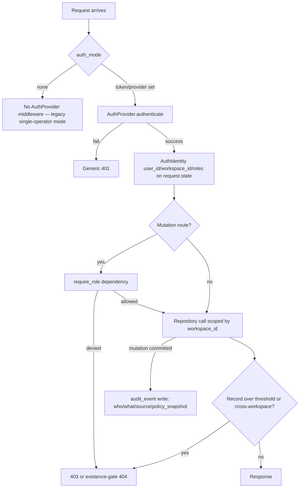

# Feature Brief & Metadata

**Feature Name:**

> Public Multi-User Hardening — Auth, RBAC, Workspace Isolation, and Audit (Phase 5)

**Filepath Name:**

> `public-multiuser-p5-auth-rbac-v1`

**Date:**

> 2026-07-06

**Author:**

> prd-writer (Sonnet 5), orchestrated by Opus 4.8

**Related Epic(s)/PRD ID(s):**

> `public-multiuser-release` (feature family) — Phase 5 of 5; follows merged P0-P3
> (`1f19379`, `8b9d8be`, `cb6af8b`) and precedes/composes with Phase 4 (Embedded Agent Research,
> `public-multiuser-p4-agents-v1`).

**Related Documents:**

> - Spec: `docs/project_plans/design-specs/public-multiuser-release-handoff-v1.md` — §10 (API
>   surface), §11 (Security/Sharing/Public Release Gates), §12.5 (Phase 5 scope + acceptance),
>   §14 (open questions, auth-provider question now resolved).
> - SPIKE: `docs/project_plans/SPIKEs/public-multiuser-p4p5-foundations-spike.md` — ADR-001
>   (auth-provider abstraction, binding), ADR-002 (P4 agent-job credential isolation, composed
>   here, not re-implemented), Mode-D sign-off gates, FU-4 deferred sensitivity items.
> - Prior-phase precedent: `docs/project_plans/implementation_plans/public-multiuser-p2p3-opus-handoff.md`
>   — D12 (nullable `workspace_id`/`created_by`, now enforced here), D10 (catalog.db is disposable —
>   binding constraint on where auth/audit state may live), landmine #3 (catalog.db rebuild) and
>   landmine #4 (no-existence-leak convention).

---

## 1. Executive Summary

Phase 5 turns Research Foundry from "single trusted operator behind a network perimeter" into a
governed multi-user system safe to expose on a shared LAN or publicly. It ships a swappable
`AuthProvider` port (ADR-001) with a zero-dependency `local_static` default and an opt-in `clerk`
adapter, enforces a 5-role RBAC model server-side across every mutation route, turns P2/P3's
unenforced `workspace_id`/`created_by` columns into a real isolation boundary via data migration,
adds a complete audit log, rate limits, and admin settings, and gates public sharing/publish flows
fail-closed on sensitivity. It also closes three deferred sensitivity gaps carried forward from
P2/P3 (SPIKE FU-4): the runs-API existence-gate gap, the blank-origin-draft body-sensitivity
residual, and draft→run/claim reverse catalog links.

**Priority:** HIGH

**Key Outcomes:**
- Outcome 1: An operator can safely share a Research Foundry workspace with a team (or the public)
  because authorization is enforced in the data layer, not hidden in the UI.
- Outcome 2: Every catalog mutation, report edit, agent-job launch, artifact acceptance, publish
  preview, and writeback is attributable — who, what, from which source, under which policy
  snapshot.
- Outcome 3: Public/shared report and catalog export fails closed on sensitivity violations, with
  no existence-leak seam left open across the run-detail endpoint family.

---

## 2. Context & Background

### Current State

P0-P3 shipped a real product surface — shared catalog (`catalog_service.py`, sqlite+FTS5 cache),
granular report-audit anchors (`report_anchors`, D8), and a file-canonical report builder
(`builder_service.py`) — all reachable over `TokenAuthMiddleware`
(`src/research_foundry/api/middleware/auth.py`): a single shared bearer token gated by
`auth_mode: none|token` in `foundry.yaml`. There is no user identity, no roles, and no enforced
workspace scoping. `workspace_id`/`created_by` fields exist on **some** surfaces — the durable,
canonical `draft.yaml` persisted by `builder_service.py` and `catalog_service.py`'s *derived*
`catalog_report_drafts` index table (schema DDL, `catalog_service.py:184-185`) — but are **nullable
and unenforced** by explicit P2/P3 decision (D12: "cheap forward-compat"). Critically,
`catalog_service.py`'s `catalog_items` table (the run-derived catalog rows, DDL at
`catalog_service.py:122-141`) has **no** `workspace_id`/`created_by` column at all today — D12's
forward-compat treatment never reached it. Every current API caller is implicitly the single
trusted operator.

### Problem Space

Shipping a public or shared-team release requires real identity, server-side authorization, and an
audit trail — without abandoning the project's local-first/air-gapped deployment option (many
operators run Research Foundry on a home-LAN node with no outbound internet; the SPIKE confirms
Clerk cannot serve that target — F5, no self-hosted Clerk).

### Current Alternatives / Workarounds

Today "access control" means: don't expose the port, or share one static bearer token. Neither
scales past one trusted operator, neither identifies who did what, and neither stops a
workspace-scoped record from leaking to a second user once multi-user access exists at all.

### Confirmed code-truth gaps (verified 2026-07-06, informs FR-13-15)

- `GET /api/runs/{run_id}`, `GET /api/runs/{run_id}/claims`, and
  `GET /api/runs/{run_id}/sources/{source_card_id}` (`api/routers/runs.py:68-133`) rely **only** on
  export-time field redaction; they have **no run-level existence gate**. The newer
  `GET /reports/{run_id}/anchors` endpoint (added in P2, `runs.py:136-188`) explicitly documents
  that it *adds* an existence gate the three sibling endpoints lack ("Sibling run-detail endpoints
  … do NOT apply this existence gate"). This is [[runs-api-no-sensitivity-existence-gate]] — the
  ADR-001 note that closing it depends on the enforced-identity path landing in this phase.
- `builder_service.py` (`create_draft`, `update_draft`) already threads `workspace_id`/`created_by`
  parameters end-to-end (lines 340-380, 862-957) but nothing in the router or service layer checks
  them against a request identity — any caller may read/write any draft.
- `catalog_service.py`'s `catalog_report_drafts` table (a *derived, rebuildable* index of the
  durable `draft.yaml` files, not `catalog_items`) persists `workspace_id`/`created_by` per-row
  (schema DDL at `catalog_service.py:184-185`; indexed via `_DRAFT_INDEX_COLUMNS` at
  `catalog_service.py:1498-1516`) with the same unenforced status. `catalog_service.py`'s
  `catalog_items` table has **no such column** and needs a schema addition (`SCHEMA_VERSION` bump +
  `rebuild()`) before it can carry `workspace_id` at all — see the P5.3 phase file's "Critical Schema
  Findings" for the full breakdown of which surface is durable-canonical (`draft.yaml`), which is a
  disposable derived cache (`catalog_report_drafts`, `catalog_items`), and which needs a net-new column.

### Architectural Context

- **Adapter idiom to mirror**: `src/research_foundry/adapters/base.py` — `Protocol` +
  `module_available()` capability probe + degraded-mode contract. `AuthProvider` follows the same
  shape (Protocol, registry, `available()`-style capability check for Clerk's outbound-internet
  requirement).
- **Fail-closed precedent**: `export_service.py` (`DEFAULT_THRESHOLD = "public"`,
  `SENSITIVITY_ORDER`) and `reports.py::publish_preview` (D13 checks, HTTP 422 on any error-severity
  failure) are the established fail-closed pattern this phase extends into RBAC and sharing.
- **Durable vs disposable storage**: `catalog.db` is an explicitly disposable cache
  (`PRAGMA user_version`; drop+rebuild on mismatch — P2/P3 D10, landmine #3). Auth/RBAC/audit state
  is durable by nature and **must not** be co-located with it (see Decision row above and OQ-1).

---

## 3. Problem Statement

> As an operator preparing to share Research Foundry with a team or the public, when I enable
> multi-user access, I need real identity, server-enforced roles, workspace isolation, and an
> audit trail, instead of relying on network obscurity and a single shared bearer token, so that
> private or sensitive workspace data cannot leak across users and every mutation is attributable
> to a person, a source, and a policy snapshot.

**Technical Root Cause:**
- No identity model exists above a shared bearer token (`TokenAuthMiddleware`).
- `workspace_id`/`created_by` fields exist on `builder_service.py`'s durable draft records and
  `catalog_service.py`'s derived `catalog_report_drafts` index but are never read as an
  authorization boundary; `catalog_service.py`'s `catalog_items` table lacks the column entirely.
- No audit-event table or service exists anywhere in the codebase.
- The no-existence-leak convention is applied inconsistently across sibling endpoints
  (`api/routers/runs.py`).
- UI-only gating (e.g., `AppShell.tsx` `NAV_ITEMS` disabled state) demonstrates client-side
  affordance hiding but has never been backed by a server-side authorization check, because no
  identity/role concept exists yet to check against.

---

## 4. Goals & Success Metrics

### Primary Goals

**Goal 1: Ship the AuthProvider port (ADR-001)**
- `AuthProvider` Protocol + registry at `api/auth/provider.py`, mirroring `adapters/base.py`.
- `local_static` (default, air-gapped) generalizes `TokenAuthMiddleware`; `clerk` (opt-in, pure-Python
  JWKS verify); `oidc`/BYO seam defined (concrete impl may defer, FU-2).
- Success: provider selectable via `foundry.yaml: auth.provider`; zero route/RBAC code branches on
  provider identity.

**Goal 2: Enforce 5-role RBAC server-side**
- Roles: owner, admin, researcher, reviewer, viewer. Every HTTP mutation route depends on a role
  check. The CLI/service-direct mutation surface (`rf ingest`, `rf source-card create`,
  `rf catalog rebuild`, `rf writeback`, `rf workspace migrate/enforce/rollback`) bypasses the HTTP
  request context `require_role(...)` reads from entirely — it is a distinct trust boundary, not an
  ungated instance of the same one, and is classified rather than gated (see FR-6a).
- Success: 100% of **HTTP-routed** catalog/report mutation routes reject an under-privileged
  `AuthIdentity` with a consistent 403/404 contract (never a silent UI-only block). The CLI/service
  mutation surface is separately classified admin-only/single-operator-trust, verified by a
  dedicated static contract test enumerating every such entry point (FR-6a).

**Goal 3: Enforce workspace isolation via real data migration**
- Backfill `workspace_id`/`created_by` on existing catalog/draft records; every read/write repository
  call is scoped by the caller's `AuthIdentity.workspace_id` unless the role is owner/admin acting
  across workspaces by explicit design.
- Success: a non-admin identity cannot read or mutate another workspace's private records
  (verified by a cross-workspace regression suite).

**Goal 4: Full audit log**
- New `audit_event` record for every catalog mutation, report edit, agent-job launch, accepted
  artifact, publish preview, and writeback — who/what/source/policy-snapshot.
- Success: 100% of the six governed mutation types produce a queryable audit row.
- Individual audit writes remain **fail-open** by design (never block or corrupt the mutation
  they record), but a persistently-degraded audit store must never be silent: a durable
  degraded-health state, a startup/on-demand write probe, and an admin-visible warning make the
  degradation observable, and a dedicated public-exposure gate **requires the audit store to be
  writable before shared/public exposure is allowed** (mutations themselves are never gated on
  audit health — only the exposure decision is).

**Goal 5: Close the 3 FU-4 deferred sensitivity gaps**
- Existence-gate parity across the run-detail endpoint family; a global source index closing the
  blank-origin-draft body-sensitivity residual; draft→run/claim reverse catalog links.
- Success: no sensitivity or provenance regression in the closing regression suite.

### Success Metrics

| Metric | Baseline | Target | Measurement Method |
|--------|----------|--------|-------------------|
| Auth providers shipped | 0 (bearer-token only) | 2 (`local_static`, `clerk`) + 1 documented seam (`oidc`) | Provider registry unit test matrix |
| RBAC-enforced mutation routes | 0% | 100% of **HTTP-routed** catalog/report(/agent-job) mutation routes; CLI/service-direct mutation surface separately classified (not counted in this %) | Route-level RBAC sweep test + CLI/service mutation-surface contract test (FR-6a) |
| Run-detail endpoints with existence-gate parity | 1 of 4 (`anchors` only) | 4 of 4 | Existence-gate parity regression suite |
| Governed mutation types producing an audit row | 0 | 6 of 6 (catalog mutation, report edit, agent launch, artifact acceptance, publish preview, writeback) | Audit-log completeness test |
| Cross-workspace leakage in regression suite | untested (isolation unenforced) | 0 leaks across catalog/report/(agent-job) reads and writes | Cross-workspace isolation regression suite |
| E2E scenarios covering auth/RBAC/sharing | 0 | ≥1 static-mode + ≥1 live-mode Playwright spec per surface (catalog, builder, sharing) | `p5-auth-rbac.spec.ts` + mode matrix |

---

## 5. User Personas & Journeys

### Personas

**Primary Persona: Workspace Owner/Admin**
- Role: Configures the auth provider, manages workspace members and role assignments, reviews the
  audit log, configures rate limits and sharing policy.
- Needs: A trustworthy, low-maintenance auth setup that works air-gapped by default and can be
  upgraded to Clerk when the workspace goes public.
- Pain Points Today: No way to add a second identity without sharing the one bearer token; no
  visibility into who changed what.

**Secondary Persona: Researcher / Reviewer / Viewer**
- Role: Day-to-day catalog search, report drafting/review, evidence acceptance — bounded by role.
- Needs: Clear, server-enforced boundaries (not silent UI hiding) so permission denials are
  explicit and debuggable.
- Pain Points Today: Every current user is equally privileged; there is no reviewer/viewer
  distinction at all.

**Tertiary Persona: External Public Reader** (via a shared/published report link)
- Role: Anonymous, read-only.
- Needs: Sensitivity-safe content; no path to catalog mutation or credential exposure.
- Pain Points Today: `report_draft` sharing has no dedicated sharing flow yet; publish-preview
  exists (P3, D13) but is not wired to a public-facing share surface.

### High-level Flow

---

## 6. Requirements

### 6.1 Functional Requirements

| ID | Requirement | Priority | Notes |
| :-: | ----------- | :------: | ----- |
| FR-1 | Add `AuthProvider` Protocol + registry at `api/auth/provider.py`: `authenticate(request) -> AuthIdentity \| None`, `register()`/`get_provider(name)`. `AuthIdentity{user_id, workspace_id, roles}`. | Must | Mirrors `adapters/base.py` Protocol+registry idiom (ADR-001). |
| FR-2 | Ship `local_static` adapter (DEFAULT): generalizes `TokenAuthMiddleware` to a multi-token → `{user_id, workspace_id, roles}` mapping (config-driven), constant-time comparison preserved. | Must | Zero new dependency; air-gapped default. |
| FR-3 | Ship `clerk` adapter (OPT-IN): pure-Python JWKS verification (PyJWT + `cryptography`), no Node SDK, no self-host. Map Clerk Organizations roles 1:1 to RF's 5 roles. | Should | Custom roles require a paid Clerk plan in production (FU-3, operator action, not blocking). Dark by default (config flag). |
| FR-4 | Define the `oidc`/BYO adapter seam (Protocol conformance point) in `api/auth/adapters/`; concrete implementation MAY defer past v1 if no on-prem-IdP consumer exists at ship. | Should | FU-2. The seam must land even if the impl doesn't. |
| FR-5 | Wire provider selection via `foundry.yaml: auth.provider` (`none\|local_static\|clerk\|oidc`); `create_app` resolves middleware/dependency from the registry. Preserve invariants: `auth_mode="none"` adds no middleware (true no-op); 401s stay generic; route/RBAC code never branches on provider identity. | Must | `api/app.py`, `config.py`. |
| FR-6 | Define 5 roles (owner, admin, researcher, reviewer, viewer) with an explicit capability matrix; add a `require_role(...)` FastAPI dependency enforced on every **HTTP** mutation route across catalog, reports/builder (and P4 agent-job routes when they land). | Must | Server-side only — UI hiding is not a substitute (Mode-D gate 6). Scope is the HTTP request surface — see FR-6a for the CLI/service-direct mutation surface, which `require_role(...)` cannot gate (no request-scoped identity). |
| FR-6a | Enumerate every CLI/service-layer mutation entry point that bypasses the HTTP RBAC layer entirely — `rf ingest`/`source_cards.py::ingest_source`, `rf source-card create`/`create_source_card`, `rf catalog rebuild`/`catalog_service.import_all`, `rf writeback`/`writeback.py::writeback`, and (forward-looking, P5.3) `rf workspace migrate\|enforce\|rollback` — and classify this surface as admin-only/single-operator-trust (the local-first threat model: CLI execution already implies filesystem-level access equivalent to admin). Add a static contract test enumerating these entry points and asserting no HTTP-routed bypass exists into any of them outside the gated routers. | Must | Sharpens the otherwise-implicit "no direct-write code path exists" claim into a concrete, enumerated, tested contract rather than an assumption. See P5.2 phase file task RBAC-006. |
| FR-7 | Enforce workspace isolation: add the missing `workspace_id` column to `catalog_service.py`'s `catalog_items` table (schema version bump + rebuild) and migrate existing catalog/draft records to backfill `workspace_id`/`created_by` (D12 follow-through where the fields already exist); every repository read/write is scoped to `AuthIdentity.workspace_id` unless role is owner/admin with explicit cross-workspace intent. | Must | Real data migration — Mode-D gate 5. Touches `catalog_service.py` (schema add + backfill), `builder_service.py` (backfill of already-present fields). |
| FR-8 | Add an `audit_event` record + `audit_service.py`: capture catalog mutations, report edits, agent-job launches, accepted artifacts, publish previews, and writebacks — `who`, `what`, `source_ref`, `policy_snapshot`, `timestamp`. Expose via API + CLI (`rf audit list\|show`). | Must | New durable store (see OQ-1/Decision row) — never the disposable `catalog.db`. |
| FR-8a | Add an audit-store health probe + durable degraded-health state + admin warning (`rf audit health`, `GET /api/audit/health`), and a public-exposure gate (`is_healthy_for_exposure()`) that blocks shared/public exposure while the audit store is unwritable. Individual mutation writes stay fail-open per FR-8 — only the exposure decision is gated. | Must | A silently-broken audit store defeats FR-8's "100% of governed mutation types produce a row" guarantee without ever surfacing that fact. See P5.5 phase file task AUDIT-004. |
| FR-9 | Add per-identity + per-route rate limiting (config-driven budget in `foundry.yaml`); return 429 with `Retry-After` on exceed. | Should | See OQ-4 for granularity default. |
| FR-10 | Add admin settings surface: workspace/member/role management, auth-provider status, rate-limit config — backend API + minimal admin UI panel. | Must | `/settings` route already exists in the shell; extend, don't fork a new top-level route. |
| FR-11 | Extend public sharing + publish-preview gates: reuse/extend P3's D13 fail-closed checks (`reports.py::publish_preview`) to a dedicated sharing flow; sensitivity fail-closed is enforced independent of role (an owner cannot bypass a sensitivity failure by role alone). | Must | Composes with existing `verify_draft`/D13. |
| FR-12 | Add a frontend auth-context abstraction (`frontend/runs-viewer/src/auth/AuthContext.tsx`): Clerk React components (`ClerkProvider`/`SignIn`) when `provider=clerk`; a local login form when `provider=local_static`; nothing when `auth_mode=none`. Static-export mode has no server and degrades to read-only public (already pre-gated at export). | Must | See AC-5 (target_surfaces) below. |
| FR-13 | **Close FU-4 #1** — add the no-existence-leak gate to `GET /api/runs/{run_id}`, `GET /api/runs/{run_id}/claims`, and `GET /api/runs/{run_id}/sources/{source_card_id}` (`api/routers/runs.py:68-133`), matching the pattern already implemented in `get_run_anchors` (`runs.py:136-188`). | Must | Confirmed code-truth gap (§2). Blocking for public release. |
| FR-14 | **Close FU-4 #2** — build a global source index so an unlinked report quote from a run outside the caller's visible/reachable set is still caught by report-body sensitivity checks (the P3 blank-origin-draft residual). | Must | Extends `verify_draft`/D13 checks. |
| FR-15 | **Close FU-4 #3** — add draft→run/claim reverse catalog links so catalog navigation surfaces which report drafts cite a given run or claim. | Should | Extends `catalog_service.py::_build_links` (P2 anchor work, ~line 849). |
| FR-16 | Add regression tests for sensitive report text, catalog visibility, job permissions (composes with P4's ADR-002 credential firewall), and writeback approvals — parametrized across auth providers and static/live modes. | Must | See AC-1/AC-2/AC-3. |
| FR-17 | Add full E2E coverage (static export + live API modes) for login, role-bounded catalog/builder actions, and sharing scenarios. | Must | `p5-auth-rbac.spec.ts`; extend existing `w1`/`w3` specs, don't replace (P2/P3 precedent). |

### 6.2 Non-Functional Requirements

**Performance:**
- Auth check overhead budget: < 5ms p95 added latency per request for `local_static`; JWKS
  verification for `clerk` must cache the key set (networkless per-request after first fetch).
- Rate-limit check must not add a synchronous network round-trip (in-process/local counter).

**Security:**
- Never place raw credentials, JWKS secrets, or Clerk secret keys in browser payloads, logs, or
  error messages (mirrors the existing `hmac.compare_digest`/no-log-the-value discipline in
  `middleware/auth.py`).
- RBAC is enforced server-side on every mutation route; UI-only affordance hiding is never the sole
  control (Mode-D gate 6).
- 401s remain generic (no information leak about which auth mode failed); 404s remain
  indistinguishable between "not found" and "exists but hidden" (existence-gate convention,
  landmine #4).
- Mode-D sign-off gates (from SPIKE, must fire during execution — see §11 Overall Acceptance
  Criteria, AC-GATE-1/2/3):
  1. Approval before enforcing the `workspace_id`/`created_by` migration (data migration on
     existing records).
  2. Sign-off that server-side RBAC (not UI hiding) enforces catalog visibility before any
     public/LAN exposure.
  3. Sign-off on Clerk secrets handling if/when the Clerk adapter is enabled.

**Reliability:**
- Every gate in this phase is fail-closed by default: an ambiguous auth state, missing role, or
  unresolved workspace scope denies rather than allows.
- Audit-log writes must not block the primary mutation path indefinitely; a failed audit write
  should surface loudly (not silently drop) but should not corrupt the underlying mutation's
  durable state.

**Observability:**
- OpenTelemetry spans for auth checks, RBAC decisions, and audit-log writes.
- Structured JSON logs with `trace_id`, `span_id`, `user_id`, `workspace_id` (never raw tokens/keys).
- Audit events double as telemetry: every row is queryable by actor, workspace, mutation type, and
  policy snapshot.

**Accessibility:**
- Local login form and admin settings UI meet WCAG 2.1 AA (keyboard navigation, labeled inputs,
  visible focus states) — consistent with the existing `rv-*`/`it-*` CSS convention (no Tailwind).

---

## 7. Scope

### In Scope

- `AuthProvider` port + registry (`local_static` default, `clerk` opt-in, `oidc`/BYO seam).
- 5-role RBAC (owner/admin/researcher/reviewer/viewer), enforced server-side on every mutation
  route.
- Workspace isolation enforcement, including the data migration backfilling existing
  `workspace_id`/`created_by` values.
- Full audit log (catalog mutations, report edits, agent-job launches, accepted artifacts, publish
  previews, writebacks).
- Rate limits, admin settings (workspace/member/role management, provider status, rate-limit
  config).
- Public sharing + publish-preview gates, fail-closed on sensitivity.
- Frontend auth-context abstraction (Clerk components / local login / none); static-export
  read-only-public degradation.
- Regression tests: sensitive report text, catalog visibility, job permissions (composes with P4's
  credential firewall), writeback approvals; full E2E in static + live API modes.
- Closing the 3 FU-4 deferred sensitivity items: runs-API existence-gate parity, global source
  index for the blank-origin-draft residual, draft→run/claim reverse catalog links.

### Out of Scope

- P4's Embedded Agent Research feature build-out itself (job model, provider adapters, streaming) —
  P5 only composes with P4's credential-isolation boundary (ADR-002) via regression tests, does not
  re-implement it. Tracked in the sibling `public-multiuser-p4-agents-v1` PRD.
- Concrete `oidc` adapter implementation (the seam lands here; the implementation may defer — FU-2).
- Clerk paid-plan procurement (operator action, not an engineering task — FU-3).
- Agent-job subprocess spawn-latency benchmarking (FU-1, a P4 concern).
- Migrating the catalog/builder store off SQLite onto Postgres (spec §14 open question — remains
  open, not resolved by this phase).
- Enterprise SSO federation beyond what Clerk Organizations already brokers.
- Mobile app / native clients.

---

## 8. Dependencies & Assumptions

### External Dependencies

- **PyJWT + `cryptography`** (backend): pure-Python JWKS verification for the `clerk` adapter — no
  Node SDK, no self-hosted Clerk instance required or available.
- **`@clerk/clerk-react`** (frontend, opt-in devDependency): `ClerkProvider`, `SignIn`, `UserButton`,
  `useAuth`/`useOrganization` — loaded only when `provider=clerk`.

### Internal Dependencies

- **P2/P3 catalog + builder services** (`catalog_service.py`, `builder_service.py`): mixed schema
  state — `builder_service.py`'s durable draft records and `catalog_service.py`'s derived
  `catalog_report_drafts` table already carry the `workspace_id`/`created_by` fields this phase
  enforces (D12); `catalog_service.py`'s `catalog_items` table does not and needs the column added
  (schema version bump + rebuild) before enforcement — status: merged (`8b9d8be`, `cb6af8b`).
- **P4 Embedded Agent Research** (`public-multiuser-p4-agents-v1`, planned): P5's job-permission
  regression suite composes with P4's ADR-002 credential firewall. See OQ-2 for sequencing.
- **Export/verification services** (`export_service.py`, `verification.py`): existing fail-closed
  sensitivity primitives this phase extends into RBAC/sharing.

### Assumptions

- Workspace/user/membership/role/audit tables land in a **new durable SQLite store**, separate from
  the disposable `catalog.db` cache (see Decision row, OQ-1). This is the single most
  architecturally load-bearing assumption in this PRD; confirm at the implementation-plan gate.
  The RF/AOS files-canonical constraint does not require these tables be Markdown/YAML — they are
  operational/identity state, not research evidence — but they must be durable (never
  drop+rebuild-on-mismatch like `catalog.db`).
- `local_static`'s current single-shared-token model generalizes to a multi-token → role mapping
  (OQ-5); this is required to serve more than one concurrent human identity.
- SQLite remains the storage engine for this phase (no Postgres migration — spec §14 stays open).
- P4 may ship before, after, or in parallel with P5; AC-3 (agent credentials never reach browser
  payloads) is validated against whatever P4 surface exists at P5's validation gate — a stub
  contract test if P4 has not shipped, full regression if it has (OQ-2).

### Feature Flags

- `auth.provider`: `none | local_static | clerk | oidc` (foundry.yaml).
- `auth.rate_limit.enabled`: bool, default `true` once shipped.
- `auth.audit_log.enabled`: bool — recommend always-on for mutation routes (not user-toggleable),
  since audit is a security control, not an optional feature.

---

## 9. Risks & Mitigations

| Risk | Impact | Likelihood | Mitigation |
| ----- | :----: | :--------: | ---------- |
| Enforcing `workspace_id` on existing unscoped records breaks currently-working single-operator deployments mid-migration | High | Medium | Mode-D gate 1 (explicit approval before enforcement); migration is additive/backfill, never destructive; dry-run + rollback plan required before flipping enforcement on. |
| RBAC gaps hide behind UI-only affordance hiding (the `AppShell.tsx` disabled-nav pattern looks like RBAC but isn't) | High | Medium | Mode-D gate 6 (explicit sign-off that server-side checks exist); route-level RBAC sweep test enumerates every mutation route and asserts a `require_role` dependency is present. |
| Clerk's "no self-hosted" constraint (F5) surprises an operator who enables it on an air-gapped node | Medium | Low | `clerk` adapter's `available()` check requires confirmed outbound internet + public domain before activation; documented prominently; never default. |
| Existence-gate inconsistency (3 of 4 sibling endpoints currently missing it) regresses again after this fix | High | Medium | FR-13 regression test locks endpoint parity; test asserts all 4 endpoints in the family return identical 404-vs-real-404 behavior for an over-threshold run. |
| Rate limiting introduces a performance regression or false-positive lockouts for legitimate burst usage | Medium | Medium | Config-driven budget with sane defaults; per-identity+per-route granularity (not global) to avoid one user starving another. |
| Frontend auth-context abstraction (3 modes: Clerk / local / none) grows unbounded complexity | Medium | Medium | Mirror the backend `AuthProvider` Protocol shape on the frontend; keep the abstraction to exactly 3 concrete implementations, no speculative 4th. |
| Audit-log write volume/perf degrades mutation-path latency | Low | Low | Audit writes are append-only and asynchronous-tolerant; failure to write audit surfaces as a loud error, never blocks or corrupts the underlying mutation. |
| P4 sequencing ambiguity (OQ-2) leaves AC-3 unverifiable at P5's validation gate | Medium | Medium | Stub contract test if P4 hasn't shipped; explicit note in Completion Report on which mode (stub vs full) validated AC-3. |

---

## 10. Target State (Post-Implementation)

**User Experience:**
- An operator sets `auth.provider` in `foundry.yaml` (or leaves it `local_static` by default) and
  the app enforces identity + role on every mutation without any route-level code change.
- A researcher/reviewer/viewer sees exactly the actions their role permits; denied actions surface
  an explicit, consistent error (never a silent no-op or a UI element that "shouldn't" have been
  clickable).
- An admin opens `/settings` to manage members, roles, provider status, rate limits, and the audit
  log.
- A public reader following a shared report link sees a sensitivity-safe, read-only view; anything
  over threshold is indistinguishable from "doesn't exist."

**Technical Architecture:**
- `AuthProvider` Protocol + registry, mirroring `adapters/base.py`, resolved once at `create_app`
  time from `foundry.yaml: auth.provider`.
- `require_role(...)` FastAPI dependency on every mutation route; repository-layer queries scoped
  by `AuthIdentity.workspace_id`.
- A new durable store for identity/membership/role/audit state, decoupled from the disposable
  `catalog.db` cache.
- Frontend `AuthContext` abstraction wrapping the app shell, degrading to read-only public in
  static-export mode.

**Observable Outcomes:**
- Every governed mutation type produces a queryable audit row.
- The full run-detail endpoint family shares one existence-gate contract.
- Public/shared sharing and publish flows fail closed on any sensitivity violation, independent of
  the caller's role.

---

## 11. Overall Acceptance Criteria (Definition of Done)

### Structured, multi-surface ACs (spec §12.5 acceptance bullets, expanded per R-P1..R-P4)

#### AC-1: A non-admin cannot view or mutate another workspace's private records
- target_surfaces:
    - src/research_foundry/services/catalog_service.py
    - src/research_foundry/services/builder_service.py
    - src/research_foundry/api/routers/catalog.py
    - src/research_foundry/api/routers/reports.py
    - src/research_foundry/api/auth/provider.py
    - src/research_foundry/cli_commands.py
- propagation_contract: >
    Every repository read/write call receives `AuthIdentity.workspace_id` from the request-scoped
    dependency and applies it as a `WHERE workspace_id = :identity_workspace_id` predicate (or an
    explicit owner/admin cross-workspace override), consistently across catalog and
    report/builder services. CLI-invoked mutations (`rf catalog rebuild`, `rf ingest`,
    `rf workspace migrate\|enforce\|rollback`) reuse the same workspace-scoped repository
    functions — there is no separate CLI-only write path that bypasses the `WHERE workspace_id`
    predicate; a CLI caller without a resolved `AuthIdentity` operates against an explicit
    `--workspace` argument or the single default workspace, never an unscoped write. (This is
    distinct from RBAC role-gating, which the CLI surface is separately classified against — see
    FR-6a.)
- resilience: >
    A record whose `workspace_id` does not match the caller's identity is treated identically to a
    non-existent record (404), never a 403 that would leak existence — matching the existing
    no-existence-leak convention (landmine #4).
- visual_evidence_required: false
- verified_by:
    - cross-workspace-isolation-regression-suite
    - rbac-route-sweep-test

#### AC-2: Public report export fails closed on sensitivity violations
- target_surfaces:
    - src/research_foundry/api/routers/reports.py
    - src/research_foundry/services/builder_service.py
    - src/research_foundry/services/verification.py
    - src/research_foundry/services/export_service.py
- propagation_contract: >
    The sharing/publish flow reuses the D13 `verify_draft` fail-closed checks (`publish_preview`)
    plus the new global-source-index check (FR-14); any error-severity failure blocks publication
    (HTTP 422) independent of the caller's role — an owner cannot bypass a sensitivity failure by
    role alone.
- resilience: >
    If the sensitivity label or global source index is unavailable/unresolvable, the check fails
    closed (blocks publish) rather than defaulting to permissive.
- visual_evidence_required: false
- verified_by:
    - publish-preview-fail-closed-regression
    - blank-origin-draft-sensitivity-regression

#### AC-3: Agent credentials never reach browser payloads
- target_surfaces:
    - src/research_foundry/services/audit_service.py
    - src/research_foundry/services/governance.py
- propagation_contract: >
    Composes with P4's ADR-002 (subprocess-per-agent-job, temp-file credential delivery). P5 adds
    the write-time redaction guard (`governance.py::scan_secrets`/`_redact` applied at write time,
    not only post-hoc) and the salted-HMAC key-fingerprint convention to the audit trail.
- resilience: >
    If P4 has not shipped by P5's validation gate, this AC is verified via a stub contract test
    asserting the redaction guard rejects a synthetic credential-shaped payload; full regression
    once P4 lands (OQ-2).
- visual_evidence_required: false
- verified_by:
    - credential-firewall-composition-test

#### AC-4: Catalog, builder, and agent workflows have E2E coverage
- target_surfaces:
    - frontend/runs-viewer/e2e/p5-auth-rbac.spec.ts
    - frontend/runs-viewer/e2e/w1-claim-audit.spec.ts
    - frontend/runs-viewer/e2e/w3-report-chip-navigation.spec.ts
    - tests/unit/test_cli_mutation_surface.py
    - src/research_foundry/services/audit_service.py
- propagation_contract: >
    New `p5-auth-rbac.spec.ts` covers login (per provider), role-bounded catalog/builder actions,
    and a sharing scenario, in both static-export and live-API modes; existing `w1`/`w3` specs are
    extended (not rewritten) to exercise an authenticated context. Coverage is not limited to the
    browser: the CLI/service-direct mutation surface is covered by FR-6a's static contract test
    (`tests/unit/test_cli_mutation_surface.py`, not a Playwright spec — the CLI has no
    browser), and each exercised workflow's audit-event emission (`audit_service.py`) is asserted
    as part of the regression suite (P5.9 TEST-001), not only the E2E flow.
- resilience: >
    Static-export mode has no server; auth-gated scenarios in static mode assert the read-only
    public degradation instead of a login flow.
- visual_evidence_required: false
- verified_by:
    - e2e-static-mode-run
    - e2e-live-mode-run
    - cli-mutation-surface-contract-test

#### AC-5: Frontend auth-context abstraction degrades correctly per provider/mode
- target_surfaces:
    - frontend/runs-viewer/src/auth/AuthContext.tsx
    - frontend/runs-viewer/src/app/AppShell.tsx
    - frontend/runs-viewer/src/api/client.ts
- propagation_contract: >
    `AuthContext` resolves to `ClerkProvider`/`SignIn` (provider=clerk), a local login form
    (provider=local_static), or nothing (auth_mode=none) at app-shell mount; `client.ts`'s
    `loopbackGet()` threads the resolved identity/token per the existing
    `p5-auth-header.test.ts` contract, extended per-provider.
- resilience: >
    Static-export build has no server to authenticate against — `AuthContext` renders no login UI
    and all data fetches degrade to the pre-gated (export-time) read-only public dataset.
- visual_evidence_required: before/after screenshots at desktop >=1440px for each of the 3 provider states (clerk, local_static, none)
- verified_by:
    - p5-auth-header-test-extended
    - frontend-auth-context-runtime-smoke

### Additional acceptance criteria (FR-2 backend-field resilience per R-P2)

- [ ] FE handles a missing/absent `AuthIdentity` (unauthenticated request in `auth_mode=none`):
      no role/workspace UI affordance is rendered; app behaves as the current single-operator mode.
- [ ] FE handles a 401/403 from any RBAC-gated route by surfacing a `ClientError` (never silently
      swallowed) — extends the existing `p5-auth-header.test.ts` pattern (401 case already covered;
      extend to 403).
- [ ] FE handles a missing `roles` array on an `AuthIdentity` payload by treating it as
      least-privilege (viewer-equivalent), never as an error or a privilege escalation.

### Mode-D sign-off gates (must fire during execution, from SPIKE — non-negotiable)

- [ ] **AC-GATE-1**: Explicit human approval obtained before enforcing the `workspace_id`/
      `created_by` migration on existing records (data migration on existing records).
- [ ] **AC-GATE-2**: Explicit sign-off that server-side RBAC (not UI hiding) enforces catalog
      visibility, obtained before any public/LAN exposure of this phase's work.
- [ ] **AC-GATE-3**: Explicit sign-off on Clerk secrets handling, obtained if/when the Clerk adapter
      is enabled in any deployment.

### FU-4 closure acceptance (deferred sensitivity items)

- [ ] `GET /api/runs/{run_id}`, `/claims`, `/sources/{source_card_id}` share the identical
      no-existence-leak contract as `GET /reports/{run_id}/anchors` (FR-13).
- [ ] A report body quote sourced from a run outside the caller's visible/reachable set is caught by
      the global source index and fails the sensitivity check rather than passing silently (FR-14).
- [ ] Catalog navigation for a given run/claim surfaces every report draft that cites it
      (draft→run/claim reverse links, FR-15).

### Functional Acceptance

- [ ] FR-1 through FR-17 implemented and demonstrably true (see FR table for detail-level criteria).
- [ ] All 5 roles enforced consistently across catalog, report/builder, and (composed) agent-job
      routes.
- [ ] Both shipped auth providers (`local_static`, `clerk`) pass the same identity/role contract
      test suite, parametrized by provider.

### Technical Acceptance

- [ ] Follows Research Foundry's layered architecture (routers → services → repositories).
- [ ] `AuthProvider` mirrors the `adapters/base.py` Protocol + registry idiom exactly (no bespoke
      shape).
- [ ] ErrorResponse-consistent HTTPException envelopes for all new failure modes.
- [ ] OpenTelemetry spans + structured logs for auth checks, RBAC decisions, and audit writes.

### Quality Acceptance

- [ ] Unit tests for `AuthProvider` registry + both adapters (`local_static`, `clerk`).
- [ ] Integration tests for RBAC enforcement across every mutation route (route sweep).
- [ ] Cross-workspace isolation regression suite (0 leaks).
- [ ] Sensitivity fail-closed regression suite (report text, catalog visibility, job permissions,
      writeback approvals) across static + live modes.
- [ ] Full E2E suite green: existing `w1`/`w3` extended + new `p5-auth-rbac.spec.ts`.
- [ ] Accessibility WCAG 2.1 AA on local-login form and admin settings UI.
- [ ] Security review passed, including the 3 Mode-D sign-off gates.

### Documentation Acceptance

- [ ] `foundry.yaml` documents `auth.provider` and its 4 values with the same care as the existing
      `viewer.sensitivity_threshold` comment block.
- [ ] Admin/operator guide for enabling Clerk (prerequisites: outbound internet, public domain,
      paid-plan custom roles).
- [ ] CHANGELOG `[Unreleased]` entry (this feature is user-facing — `changelog_required: true`).
- [ ] ADR-001 and ADR-002 references retained in this PRD's `related_documents`/`spike_ref`; no
      separate ADR file duplication needed unless a future revision changes the decision.

---

## 12. Assumptions & Open Questions

### Assumptions

- Auth/RBAC/audit state lives in a new durable store, never in the disposable `catalog.db` cache
  (see Decision row and OQ-1 — confirm at plan gate).
- `local_static` generalizes to a multi-token → role mapping (OQ-5).
- SQLite remains the storage engine; no Postgres migration in this phase.
- P4 may not have shipped by the time P5 validates AC-3; a stub contract test is an acceptable
  interim verification (OQ-2).

### Open Questions

- [ ] **OQ-1**: Where do user/workspace/membership/role/audit tables live — new durable SQLite file
      vs extending `catalog.db`?
  - **A**: Recommend a new durable store (e.g. `<workspace>/.rf_state/rbac.db`); `catalog.db` is
    disposable and would destroy this state on a version-mismatch rebuild. Confirm at plan gate.
- [ ] **OQ-2**: Does P5's agent-credential regression testing (AC-3) block on P4 landing first?
  - **A**: No — validate against a stub contract test if P4 hasn't shipped; upgrade to full
    regression once it has. Sequencing is not a hard blocker for P5's other ACs.
- [ ] **OQ-3**: What is the minimum public-sharing target — read-only report links, team-workspace
      links, or external public URLs (spec §14, still open)?
  - **A**: Recommend read-only, sensitivity-scoped share links first; defer broader public-URL
    productization to a follow-on phase.
- [ ] **OQ-4**: Rate-limit granularity — per-identity+per-route, or global?
  - **A**: Recommend per-identity+per-route sliding window, configured in `foundry.yaml`.
- [ ] **OQ-5**: Does `local_static` need a multi-token/user mapping table?
  - **A**: Yes — required to serve more than one concurrent human identity; today's single shared
    token cannot distinguish users.

---

## 13. Appendices & References

### Related Documentation

- **SPIKE (binding)**: `docs/project_plans/SPIKEs/public-multiuser-p4p5-foundations-spike.md` —
  ADR-001 (auth-provider abstraction), ADR-002 (P4 credential isolation, composed not
  re-implemented), Mode-D gates, FU-4.
- **Design Spec**: `docs/project_plans/design-specs/public-multiuser-release-handoff-v1.md` — §10
  (API surface), §11 (Security/Sharing/Public Release Gates), §12.5 (Phase 5 scope), §14 (open
  questions).
- **Prior-phase precedent**: `docs/project_plans/implementation_plans/public-multiuser-p2p3-opus-handoff.md`
  — D10 (catalog.db disposability), D12 (unenforced workspace fields, now enforced here), landmines
  #3 (catalog.db rebuild) and #4 (no-existence-leak convention).

### Symbol References

- Not available — `ai/symbols-*.json` graphs are currently missing for this project (confirmed
  2026-07-04, per project memory); this PRD grounds file references in direct code reads
  (`api/routers/runs.py`, `services/catalog_service.py`, `services/builder_service.py`,
  `api/middleware/auth.py`, `adapters/base.py`) rather than the symbol graph.

### Prior Art

- `src/research_foundry/adapters/base.py` — the Protocol+registry idiom `AuthProvider` mirrors.
- `src/research_foundry/api/middleware/auth.py` — the single-token `TokenAuthMiddleware`
  `local_static` generalizes.
- `frontend/runs-viewer/src/test/p5-auth-header.test.ts` — existing auth-header contract test to
  extend per-provider (already present in the codebase, pre-dating this PRD).

---

## Implementation

### Phased Approach

| Phase | Name | FRs | Estimate | Owner(s) | Key Tasks |
|-------|------|-----|----------|----------|-----------|
| 5a | AuthProvider Port + local_static | FR-1,2,5 | ~8-10 pts | `backend-architect` (design), `python-backend-engineer` | Protocol+registry (`api/auth/provider.py`); `local_static` multi-token→role mapping; `foundry.yaml: auth.provider` wiring (preserve `auth_mode="none"` no-op); new durable store scaffold (OQ-1). |
| 5b | RBAC + Workspace Isolation + Migration | FR-6,6a,7 | ~10-12 pts | `backend-architect`, `data-layer-expert`, `python-backend-engineer` | 5-role capability matrix + `require_role(...)`; apply to every HTTP catalog/report mutation route; classify the CLI/service-direct mutation surface (FR-6a); add missing `workspace_id` column to `catalog_items` + backfill `workspace_id`/`created_by` elsewhere (Mode-D gate 1); cross-workspace isolation regression suite. |
| 5c | Audit Log + Rate Limits + Admin Settings | FR-8,8a,9,10 | ~7-9 pts | `python-backend-engineer`, `ui-engineer-enhanced` | `audit_event` schema + `audit_service.py` wired into all 6 mutation types; audit-store health probe + degraded-health state + admin warning + public-exposure gate; rate-limit middleware; admin settings API + `/settings` UI extension. |
| 5d | Clerk Adapter + Frontend Auth-Context | FR-3,4,12 | ~7-9 pts | `python-backend-engineer` (JWKS), `frontend-architect`/`ui-engineer-enhanced` | `clerk` adapter (pure-Python JWKS verify, role mapping); `oidc`/BYO Protocol seam (impl optional); `AuthContext.tsx` 3-mode degradation; static-export read-only-public verified. |
| 5e | Public Sharing/Publish Gates + FU-4 Closures | FR-11,13,14,15 | ~6-8 pts | `python-backend-engineer`, `senior-code-reviewer` | Sharing flow reusing D13 fail-closed checks; existence-gate parity fix (`runs.py` family); global source index; draft→run/claim reverse catalog links. |
| 5f | Regression, E2E, Validation | FR-16,17 | ~5-7 pts | `task-completion-validator`, `senior-code-reviewer` | Sensitivity/catalog-visibility/job-permission/writeback regression suite; `p5-auth-rbac.spec.ts` (static+live), extend `w1`/`w3`; Mode-D sign-offs (AC-GATE-1/2/3); runtime smoke covering AC-5 `target_surfaces` (R-P4). |

### Epics & User Stories Backlog

| Story ID | Short Name | Description | Acceptance Criteria | Estimate |
|----------|-----------|-------------|-------------------|----------|
| S5-01 | AuthProvider port | Protocol + registry mirroring `adapters/base.py` | FR-1, FR-5 | 5 |
| S5-02 | local_static adapter | Multi-token→role mapping, default provider | FR-2 | 4 |
| S5-03 | Clerk adapter | Pure-Python JWKS verify, opt-in | FR-3 | 5 |
| S5-04 | OIDC/BYO seam | Protocol conformance point, impl optional | FR-4 | 2 |
| S5-05 | RBAC capability matrix + enforcement | 5 roles, `require_role` on every HTTP mutation route | FR-6, AC-1 | 8 |
| S5-05a | CLI/service-layer mutation-surface classification | Enumerate + classify `rf ingest`/`rf writeback`/`rf catalog rebuild`/`rf source-card create` as admin-only/single-operator-trust; static contract test | FR-6a, AC-4 | 2 |
| S5-06 | Workspace isolation migration | Add missing `workspace_id` column to `catalog_items`; backfill + enforce `workspace_id`/`created_by` everywhere | FR-7, AC-1, AC-GATE-1 | 6 |
| S5-07 | Audit log | `audit_event` + `audit_service.py`, 6 mutation types | FR-8 | 5 |
| S5-07a | Audit-store health probe + exposure gate | Degraded-health state, admin warning, `is_healthy_for_exposure()` public-exposure gate | FR-8a | 2 |
| S5-08 | Rate limiting | Per-identity+per-route budget | FR-9 | 3 |
| S5-09 | Admin settings | Member/role/provider/rate-limit management UI | FR-10 | 4 |
| S5-10 | Public sharing + publish gates | Fail-closed sharing flow | FR-11, AC-2 | 4 |
| S5-11 | Frontend auth-context | 3-mode abstraction, static degrade | FR-12, AC-5 | 5 |
| S5-12 | Existence-gate parity fix | FU-4 #1 | FR-13 | 2 |
| S5-13 | Global source index | FU-4 #2 | FR-14 | 3 |
| S5-14 | Reverse catalog links | FU-4 #3 | FR-15 | 2 |
| S5-15 | Regression + E2E suite | Sensitivity/RBAC/job-permission/writeback + static/live E2E | FR-16, FR-17, AC-3, AC-4 | 6 |

---

**Progress Tracking:**

See progress tracking: `.claude/progress/public-multiuser-p5-auth-rbac/all-phases-progress.md`
(created when the implementation plan is authored).
