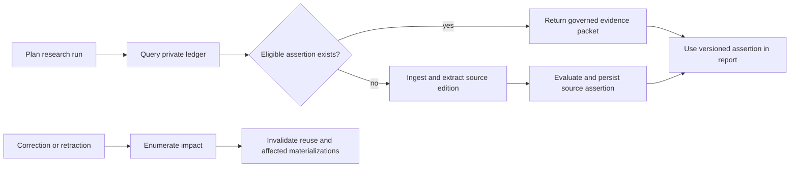

# Reusable Assertion Ledger v1

## Phase 0 evidence status (pre-review)

P0 has local deterministic fixture evidence only. Its three result artifacts
are conditional because representative private-corpus replay and concluded
citation, segmentation, and contradiction contracts are unavailable. Keep
`RF_ASSERTION_REUSE_ENABLED` and `RF_CANONICAL_CLAIMS_ENABLED` disabled; allow
only assertion-only, provenance-preserving contract work after independent
review. See the phase plan's P0-004 synthesis and
`.Codex/progress/reusable-assertion-ledger/phase-1-progress.md`.

## Feature brief

**Feature name:** Reusable Assertion Ledger v1
**Filepath name:** `reusable-assertion-ledger-v1`
**Date:** 2026-07-12
**Author:** prd-writer, under delegated planning orchestration
**Tier:** 3 — high-risk, multi-phase data, policy, retrieval, and migration work

**Primary evidence:**

- [Feasibility and product findings](../../reports/investigations/reusable-assertion-ledger-findings.md)
- [Historical replay charter](../../SPIKEs/reusable-assertion-ledger-historical-replay-charter.md)
- [Identity and semantic-merge charter](../../SPIKEs/reusable-assertion-ledger-identity-merge-charter.md)
- [Correction and retraction propagation charter](../../SPIKEs/reusable-assertion-ledger-retraction-propagation-charter.md)

## 1. Executive summary

Research Foundry currently makes claims auditable inside a research run, but a
future run cannot reliably determine whether a source passage has already been
ingested and evaluated. This feature adds a private, durable assertion ledger:
an edition-aware record of what an exact source passage states, with structured
qualifiers, extraction and review provenance, workspace policy, and downstream
report/run lineage.

The ledger changes the unit of reuse from a whole report or source file to a
passage-bound assertion. Agents can retrieve citation-ready evidence packets,
reuse eligible assertions, and identify disputed, stale, corrected, or missing
evidence before performing new extraction. Version 1 remains private and
workspace-scoped. A public corpus, shared indexes, federation, and automatic
truth adjudication are deliberately deferred.

**Priority:** HIGH

**Key outcomes:**

- Recurring-domain research avoids repeat extraction when the exact source
  edition and extraction contract remain eligible.
- Reports preserve the precise assertion version and passage used, even after
  later source or canonical-claim revisions.
- Corrections, retractions, and invalid extraction decisions produce a complete,
  inspectable impact set before an assertion may be reused again.
- Agents discover evidence through governed packets rather than context-free
  snippets or unqualified semantic matches.

## 2. Context and background

### 2.1 Current state

Research Foundry already has the core per-run components:

- `source_cards.py` creates source cards and deterministic evidence points with
  sensitivity and usage metadata.
- `claim_mapping.py` creates run-local claims with evidence references,
  confidence, report locations, and inference basis.
- `export_service.py` emits a sensitivity-aware claim graph with resolved source
  evidence, report anchors, and inference lineage.
- `catalog_service.py` builds a cross-run SQLite/FTS5 discovery read model from
  live exports.
- The run export schema and Runs Frontend consume claim provenance without
  treating the catalog as canonical storage.

The missing capabilities are durable identity and lifecycle. A run-local ID
such as `clm_001` cannot establish that a later extraction refers to the same
passage and edition, that a changed edition requires a new assertion, or that a
semantically similar proposition is genuinely equivalent.

### 2.2 Problem space

Repeated research currently pays the ingestion and extraction cost again, while
the useful evidence remains trapped inside prior runs. Search primarily returns
documents, reports, or run-local claims rather than governed assertion objects.
Corrections and retractions have no durable impact graph spanning report
revisions, exports, caches, indexes, and downstream writebacks.

The product must solve reuse without turning model output into asserted fact.
It must also prevent a false semantic merge, stale edition, or cross-workspace
retrieval signal from becoming more damaging simply because the record is
persistent and easy to reuse.

### 2.3 Current alternatives

- Re-ingest and re-extract each source for a new run.
- Search prior reports or catalog records and manually resolve provenance.
- Copy a prior claim into new work, with no durable edition or invalidation link.
- Use scholarly graphs or evidence services that do not cover arbitrary private
  sources, workspace policy, and Research Foundry report lineage together.

These approaches either repeat cost or weaken the chain from report statement
to exact passage and source edition.

### 2.4 Product boundary

Version 1 is a **private evidence-memory system**, not a public knowledge network
and not a universal truth graph. The system records what a source edition
asserts and how that assertion has been evaluated and used. Confidence in a
proposition emerges from provenance, corroboration, contradiction, freshness,
and review; the ledger does not declare factual truth on its own.

## 3. Semantic contract

The following object types must remain distinct in storage, APIs, exports, UI,
and agent prompts.

### 3.1 Source assertion

A source assertion means:

> This exact passage in this immutable source edition states this proposition,
> with these qualifiers.

It retains source and edition identity, robust passage selectors, nearby
context, passage hash, atomic assertion text, modality, negation, population,
geography, timeframe, intervention or exposure, outcome, extraction contract,
evaluation state, rights, sensitivity, retention, and workspace scope. It is
never silently rewritten to match another source.

### 3.2 Canonical claim

A canonical claim is a versioned semantic concept used to group comparable
source assertions for discovery and synthesis. It is not evidence and does not
replace the original assertion. Similarity may propose support, contradiction,
qualification, replication, or contextualization relationships. Merge decisions
must be reviewable, reversible, and qualifier-aware.

Canonical-claim grouping is optional for the private pilot. If the identity and
merge SPIKE fails its gate, v1 ships reusable source assertions without semantic
claim merging.

### 3.3 Inference

An inference is a derived proposition produced from assertions, canonical
claims, or other explicit inputs. It stores input versions, producing agent,
reasoning summary or rule, model and prompt/schema versions, timestamp, and
evaluation state. It must never be rendered or exported as something the cited
source asserted.

### 3.4 Target lineage

```text
source
  -> immutable source edition
      -> exact passage
          -> source assertion
              -> evidence relationship
                  -> canonical claim version (optional, gated)
                      -> report revision / run use

source assertions / canonical claims
  -> derived inference with explicit inputs and producer provenance
      -> report revision / run use
```

## 4. Goals and success metrics

### Goal 1 — Prove safe reuse economics

Replay 100–300 sources through 10–20 historical or representative runs. The
feature proceeds to automated reuse only if at least 20% of processing is safely
reusable and at least 95% of sampled reused assertions retain the correct passage
provenance.

### Goal 2 — Preserve assertion fidelity

An unchanged edition and passage must produce deterministic identity under the
same identity contract. A changed edition must produce explicit new identity
and lineage. Structured qualifiers must survive persistence, retrieval, export,
and report use without silent loss.

### Goal 3 — Make invalidation complete

Correction and retraction fixtures must enumerate 100% of affected assertion
versions, canonical-claim edges, report revisions, runs, exports, cache/index
records, and downstream writebacks before automated reuse is enabled.

### Goal 4 — Preserve private workspace boundaries

Workspace-scoped lexical assertion search, typed relationship traversal,
counts, facets, autocomplete, dedupe proposals, caches, exports, logs, and
deletion workflows must disclose zero unauthorized content or derived
membership signals in the adversarial isolation suite. Vector retrieval and
shared graph indexes are absent from v1; the isolation suite must also prove
that neither capability is exposed through API, OpenAPI, UI, configuration, or
index artifacts.

### Goal 5 — Improve evidence discovery

An agent or operator can retrieve a citation-ready evidence packet containing
the assertion, exact passage, edition/source metadata, qualifiers, evaluation
and freshness state, rights decision, evidence relationships, and report/run
lineage without manually joining run files.

### Success metrics

| Metric | Baseline | v1 gate | Measurement |
|---|---:|---:|---|
| Safely reusable processing | Unknown | >=20% | Historical replay SPIKE |
| Correct passage provenance in sampled reuse | Unknown | >=95% | Human-reviewed replay sample |
| Affected-object enumeration | No durable impact graph | 100% in fixtures | Retraction propagation SPIKE and regression suite |
| Unauthorized disclosure | Not tested for ledger surfaces | 0 records/signals | Adversarial workspace suite |
| Merge-candidate reviewer acceptance | No canonical grouping | >=80% if enabled | Narrow-domain merge audit |
| Harmful false merges | No canonical grouping | <2% if enabled | Negative-case merge audit |
| Legacy export compatibility | Current supported fixtures | 100% pass | Export and Runs Frontend contract tests |

## 5. Personas and journeys

### Primary persona — Research operator

- **Role:** Runs repeated research programs over overlapping source corpora.
- **Need:** Determine what evidence is reusable, fresh, disputed, or missing
  before launching a new run.
- **Pain:** Prior evidence is discoverable only through reports and run-local
  artifacts, so reuse is manual and difficult to audit.

### Secondary persona — Research agent

- **Role:** Plans, retrieves evidence for, and synthesizes a research run.
- **Need:** Query evidence packets and receive explicit reuse eligibility rather
  than infer safety from a semantic match.
- **Pain:** Re-ingestion wastes cost, but naïve reuse risks stale, private, or
  unqualified claims.

### Secondary persona — Evidence reviewer or auditor

- **Role:** Reviews assertion quality, semantic relationships, and report uses.
- **Need:** Inspect exact passages, qualifiers, edition diffs, extraction
  provenance, and reversible merge or invalidation decisions.
- **Pain:** Current review is distributed among source cards, claims, reports,
  and exports.

### Secondary persona — Workspace administrator

- **Role:** Governs tenant policy, retention, rights, and access.
- **Need:** Confirm workspace scope and delete or invalidate affected derivative
  records without exposing private corpus membership.
- **Pain:** Persistent search and relationship traversal expand the number of
  surfaces where access policy must be enforced.

### High-level journey



## 6. Functional requirements

| ID | Requirement | Priority | Acceptance intent |
|---|---|:---:|---|
| FR-001 | Persist `source`, immutable `source_edition`, `passage`, and `source_assertion` records behind a versioned ledger service. | Must | Same content and identity contract are deterministic; changed editions remain distinct. |
| FR-002 | Store robust passage selectors, surrounding context, content hash, and source locator sufficient to re-resolve or diagnose drift. | Must | Sampled assertions resolve to the captured passage or enter a non-reusable drift state. |
| FR-003 | Store atomic assertion text and structured qualifiers including modality, negation, population, geography, timeframe, intervention/exposure, and outcome when applicable. | Must | Qualifier fixtures round-trip without silent omission. |
| FR-004 | Store extraction provenance: model/provider, prompt and schema version, code version, timestamp, evaluation state, and reviewer decision. | Must | Evidence packets explain how the assertion was created and approved. |
| FR-005 | Evaluate reuse eligibility from edition identity, extraction contract, allowed use, sensitivity, freshness, evaluation, invalidation, and workspace policy. | Must | Ineligible assertions return a typed reason and cannot enter report assembly as reusable evidence. |
| FR-006 | Add optional persistent assertion and edition references to run artifacts and the versioned export contract without invalidating legacy run IDs or claim graphs. | Must | Legacy export/viewer fixtures pass unchanged; new consumers can follow persistent IDs. |
| FR-007 | Provide private, workspace-scoped lexical assertion search, structured filters, counts, facets, autocomplete, dedupe proposals, and typed relationship traversal. | Must | Results respect policy at record, relationship, aggregate, cache, and export boundaries; no vector or shared-graph capability is exposed. |
| FR-008 | Return evidence packets containing assertion, passage, source edition, qualifiers, evaluation/freshness, rights decision, evidence relationships, and report/run lineage. | Must | Agent retrieval never returns a context-free assertion string as a complete evidence result. |
| FR-009 | Record report revisions and run uses against exact assertion or inference versions. | Must | Auditors can identify the precise evidence version used by a report revision. |
| FR-010 | Represent inferences as a separate type with explicit inputs and producer provenance. | Must | API, export, UI, and validation prevent inference/source-assertion conflation. |
| FR-011 | Accept correction, retraction, invalid-extraction, and source-drift events; compute the affected dependency set; block reuse until policy permits. | Must | Retraction fixtures meet the 100% enumeration gate. |
| FR-012 | Rebuild workspace-scoped lexical read indexes from durable ledger and run evidence without making those indexes authoritative. Typed relationships remain ledger records queried through authorized services rather than a shared graph index. | Must | Deleting a lexical index does not delete the ledger; rebuilding yields equivalent discoverable records. |
| FR-013 | Preserve auditable append-only events for create, evaluate, reuse, merge, split, invalidate, restore, export, and delete operations. | Must | Material state changes identify actor, inputs, policy decision, and timestamp. |
| FR-014 | Support candidate canonical claims and evidence relationships only after the identity/merge SPIKE gate passes. | Should | If enabled, merge decisions are versioned, reversible, and preserve original assertions. |
| FR-015 | Integrate contradiction and qualification relationships through the existing contradiction-log contract rather than a second detector. | Should | Shared relationship fields and temporal semantics remain compatible. |
| FR-016 | Expose edition-diff and impact-summary data sufficient for later review UI work. | Should | Review surfaces can explain what changed and what uses are affected. |
| FR-017 | Emit metrics for reuse hits, reuse denials, extraction refreshes, latency, review outcomes, invalidation impact, and avoided model calls/cost. | Must | Pilot economics can be evaluated without reconstructing logs manually. |
| FR-018 | Provide an explicit deletion/revocation workflow scoped to a workspace and source edition. | Must | Derived indexes, caches, and non-retained materializations are removed or invalidated with an audit receipt. |

## 7. Non-functional requirements

### 7.1 Fidelity and reliability

- The ledger must fail closed when edition identity, passage resolution,
  evaluation status, or reuse policy is ambiguous.
- Identity operations must be deterministic for identical bytes and identity
  contract versions.
- A retry must not duplicate immutable editions, passages, or audit events.
- Qualifier and inference/source-separation invariants require schema validation
  plus fixture-based regression tests.
- The derived catalog and lexical retrieval indexes must be reproducible from
  durable records and canonical run artifacts.

### 7.2 Security, privacy, and governance

- Workspace identity and authorization are mandatory on ledger read, write,
  lexical search, typed relationship, aggregate, export, cache, and deletion
  operations.
- Version 1 uses workspace-scoped lexical indexes and caches. Vector indexes,
  vector retrieval, and shared graph indexes are prohibited, including dormant
  endpoints or configuration that could expose those capabilities.
- Source text is untrusted data. Parsers and extractors must not grant source
  content tool authority or treat embedded instructions as control messages.
- Sensitive passages must not appear in logs, trace attributes, metrics labels,
  error messages, or cross-workspace dedupe signals.
- Rights, allowed-use, sensitivity, retention, and revocation metadata must be
  available to the reuse policy before content is returned.
- Agent-job credential isolation reuses the completed P4/P5 subprocess boundary;
  this feature may add regression coverage but not a parallel mechanism.

### 7.3 Performance and scale

- Evidence-packet lookup must not invoke an LLM on the recall path.
- Performance targets for corpus scale, lookup latency, and index rebuild time
  are established from the historical replay corpus before implementation phase
  estimates are approved (**OQ-PERF-001**).
- Retrieval must use bounded pagination and must not load full source bodies when
  packet metadata and exact passage content satisfy the request.
- Reuse and refresh decisions must emit enough timing and cost data to compare
  ledger retrieval with fresh extraction.

### 7.4 Compatibility and portability

- Existing Markdown/YAML run artifacts remain canonical evidence for their run.
- New persistent IDs are additive in run and export schemas.
- Existing supported exports and Runs Frontend fixtures must remain readable.
- Internal provenance and annotation shapes should map explicitly to W3C PROV-O
  and W3C Web Annotation; public nanopublication export is not required for v1.

### 7.5 Observability

- Structured events include trace/run/workspace identifiers, operation,
  eligibility outcome, policy reason code, and object IDs without sensitive text.
- Metrics distinguish cache hit, safe reuse, denied reuse, refreshed extraction,
  invalidation, and manual-review outcomes.
- Correction/retraction propagation has a durable operation receipt with counts,
  failures, and resumable state.

## 8. Scope

### In scope

- Three blocking SPIKEs and explicit go/conditional/no-go outcomes.
- Private ledger schema, migrations, repository/service boundaries, and audit log.
- Immutable source edition and passage identity.
- Passage-bound source assertions and extraction/evaluation provenance.
- Eligibility policy, workspace-scoped lexical retrieval/indexing, and typed
  relationship traversal.
- Evidence-packet API/CLI contract for agent use.
- Additive run/export lineage and legacy compatibility.
- Correction/retraction propagation and impact enumeration.
- Optional canonical claims only if the merge gate passes.
- Pilot instrumentation, historical replay, validation, and user-facing docs.

### Out of scope

- Public shared research network, public corpus, or cross-tenant federation.
- Vector retrieval or vector indexes in any topology.
- Shared graph indexes or graph stores; v1 traverses typed ledger relationships
  through workspace-authorized services.
- Shared lexical, cache, autocomplete, or dedupe indexes.
- Public promotion, moderation, reputation, abuse response, or corpus licensing
  operations.
- Automatic truth adjudication, fact declaration, or source-quality oracle.
- Silent semantic merging or destructive rewriting of source assertions.
- Mandatory canonical-claim clustering if source-assertion reuse is valuable
  without it.
- Nanopublication publication or signed public assertion export.
- Broad extraction-model replacement; existing citation/segmentation SPIKEs own
  extraction fidelity.
- A second contradiction detector or separate writeback-governance mechanism.

## 9. Dependencies and assumptions

### Blocking SPIKEs

| SPIKE | Question | Continuation gate |
|---|---|---|
| Historical replay and reuse economics | Does recurring-domain reuse save enough work to justify durable operations? | >=20% safe reuse and >=95% sampled passage-provenance fidelity over 100–300 sources and 10–20 runs. |
| Assertion identity and semantic merge | Can identity remain deterministic while qualifier-aware semantic relationships remain safe? | Deterministic unchanged identity, explicit changed identity, >=80% merge acceptance, <2% harmful false merges, and no silent qualifier loss. |
| Correction/retraction propagation | Can an invalid source or extraction reach each materialized dependency? | 100% affected-object enumeration in fixtures before automated reuse. |

### Existing inputs that are not reopened

- Citation precision/recall and claim segmentation/source alignment own atomicity
  and extraction-fidelity measurement.
- Contradiction Log v1 owns contradiction detection and temporal guards.
- WKSP-304 owns the base row-level workspace enforcement pattern.
- Writeback default-deny owns topology-aware promotion and overrides.
- P4/P5 foundations own agent-job credential isolation.
- Runs Frontend and run-export schema own existing viewer compatibility seams.

### Assumptions

- A narrow recurring-domain corpus can supply representative replay fixtures.
- Source editions can be captured or fingerprinted under their allowed-use
  policy even when full-text retention is restricted.
- Private source-assertion reuse can produce value without canonical claims.
- Markdown/YAML run artifacts remain necessary for portability and audit.

### Feature flags

- `RF_ASSERTION_LEDGER_ENABLED`: enables ledger writes and read APIs.
- `RF_ASSERTION_REUSE_ENABLED`: enables automated reuse only after replay,
  provenance, propagation, and isolation gates pass.
- `RF_CANONICAL_CLAIMS_ENABLED`: enables candidate canonical grouping only after
  the identity/merge gate passes.

## 10. Risks and mitigations

| Risk | Impact | Likelihood | Mitigation |
|---|:---:|:---:|---|
| Extraction error or lost qualifier becomes easy to reuse | High | Medium | Exact passages, structured qualifiers, evaluation states, abstention, sampling, and fail-closed eligibility. |
| Semantically similar assertions are incorrectly merged | High | High | Candidate-only grouping, negative cases, reversible versions, human review, and source-assertion-only fallback. |
| Retraction misses derived materializations | Critical | Medium | Impact graph, 100% fixture gate, resumable invalidation, and reuse block until propagation completes. |
| Private corpus membership leaks through a derived signal | Critical | Medium | Workspace-scoped stores, WKSP-304 policy, adversarial surface tests, and no shared indexes in v1. |
| Source edition or OCR drifts | High | Medium | Immutable hashes, robust selectors, passage hash, edition diffs, and non-reusable drift status. |
| Inference is attributed to a source | High | Medium | Separate types, validation, labels, lineage, and schema-level incompatibility. |
| Review queue costs exceed saved extraction | High | Medium | Risk-tiered review, measured pilot economics, no mandatory merge review, and cost telemetry. |
| Rights or retention policy is incomplete | High | Medium | Allowed-use metadata, private default, revocation workflow, and no public promotion in v1. |
| Poisoned source content influences system behavior | High | Medium | Untrusted-data boundary, constrained extractors, provenance, content scanning, and independent evaluation. |

## 11. Target state

### User experience

Before a run ingests a known source, an operator or agent can query the private
ledger and see eligible evidence packets, denied reuse with reason codes, stale
or disputed records, and uncovered research gaps. Selecting a packet reveals
the exact passage, edition, qualifiers, provenance, evidence relationships, and
prior report/run uses. A source change or invalidation shows a bounded impact
operation rather than leaving stale reuse implicit.

### Technical architecture

- Durable versioned records sit behind repository and service boundaries.
- Source editions and passages use content-derived identity; mutable concepts
  and lifecycle records use stable opaque IDs and explicit versions.
- Run artifacts reference ledger objects additively.
- Retrieval uses rebuildable workspace-scoped lexical indexes; typed
  relationship traversal reads authorized ledger edges. The current derived
  catalog does not become canonical, and v1 exposes no vector or shared-graph
  index.
- Policy evaluation precedes retrieval and reuse.
- Correction/retraction events traverse explicit dependencies and produce audit
  receipts.

### Observable outcomes

- Repeat processing, model calls, elapsed time, and evidence-preparation effort
  can be compared with a fresh-extraction baseline.
- Each reused assertion links to its immutable edition and exact passage.
- Operators can enumerate reports and runs affected by a correction.
- Legacy runs and viewer exports remain usable.

## 12. Acceptance criteria

### AC-001 — Historical replay gate

- Replay includes 100–300 sources and 10–20 historical or representative runs.
- Safely reusable processing is at least 20%.
- Sampled reused assertions retain correct passage provenance at least 95% of
  the time.
- Results include model-call, elapsed-time, cost, and review-effort deltas.
- Failure yields a documented no-go or reduced-scope decision before building
  automated reuse.

### AC-002 — Identity and qualifier fidelity

- Identical edition bytes under the same identity-contract version resolve to
  the same edition identity.
- Changed edition bytes produce a new edition identity and revision lineage.
- Passage and assertion fingerprints are deterministic for unchanged inputs.
- Structured qualifier fixtures round-trip with no silent qualifier loss.
- A source assertion is never mutated to conform to a canonical claim.

### AC-003 — Optional canonical-claim gate

- Candidate merges achieve at least 80% reviewer acceptance in the SPIKE domain.
- Harmful false merges remain below 2%.
- Merge, split, and reversal preserve original assertions and audit lineage.
- If the gate fails, canonical grouping stays disabled and source-assertion reuse
  remains independently deliverable.

### AC-004 — Correction and retraction impact gate

- Fixtures cover corrected editions, invalid extraction, source retraction,
  deleted source, and changed OCR/passage resolution.
- The impact operation enumerates 100% of expected assertion versions,
  relationship edges, report revisions, runs, exports, index/cache records, and
  downstream writebacks.
- Affected assertions become ineligible before downstream refresh completes.
- Interrupted propagation resumes without skipping or duplicating targets.

### AC-005 — Workspace-isolation gate

- `target_surfaces`:
  - `src/research_foundry/services/assertion_catalog.py`
  - `src/research_foundry/services/assertion_reuse.py`
  - `src/research_foundry/api/routers/assertions.py`
  - `src/research_foundry/api/openapi.json`
  - `src/research_foundry/services/export_service.py`
  - `frontend/runs-viewer/src/components/ClaimLedger/ClaimAuditWorkbench.tsx`
  - `tests/security/test_assertion_ledger_isolation.py`
  - `tests/integration/test_assertions_api_isolation.py`
  - `tests/unit/test_assertion_catalog_isolation.py`
- The adversarial suite produces zero unauthorized content, identifiers,
  membership signals, counts, facets, autocomplete values, dedupe candidates,
  cache hits, export fields, log/metric attributes, or deletion/revocation
  effects through the listed implementation surfaces.
- Lexical search and typed relationship traversal remain workspace-scoped in
  service, router, export, OpenAPI, and Runs Frontend behavior.
- The named isolation tests verify workspace enforcement for lexical search,
  counts, facets, autocomplete, dedupe proposals, caches, exports, logs, typed
  relationship traversal, deletion, and revocation.
- The API, OpenAPI document, UI client behavior, runtime configuration, and
  generated index artifacts expose no vector search/retrieval capability and no
  shared graph-index capability.
- Workspace-scoped lexical index topology remains the deployed default.
- A failed surface blocks release of automated reuse.

### AC-006 — Evidence-packet contract

- A packet contains source assertion/version, exact passage and selectors,
  source edition metadata, structured qualifiers, extraction/evaluation state,
  freshness and invalidation state, rights/reuse decision, relationship edges,
  and report/run lineage.
- Inference packets are typed separately and name their input versions and
  producer provenance.
- Missing or denied content returns a typed reason without leaking private
  metadata.

### AC-007 — Legacy and export compatibility

- Supported legacy run fixtures export without requiring ledger records.
- Existing run-local claim IDs, report anchors, resolved sources, and inference
  lineage retain their documented semantics.
- New persistent IDs are optional and versioned.
- Runs Frontend contract tests remain green with legacy and ledger-enriched
  fixtures.

### AC-008 — Governance and operations

- Reuse eligibility fails closed for unknown edition, extraction contract,
  evaluation, rights, sensitivity, freshness, invalidation, or workspace state.
- State-changing operations emit an audit event and safe structured telemetry.
- Index rebuild, revocation, and invalidation operations have idempotent,
  resumable tests.
- Documentation explains source assertion, canonical claim, inference, reuse
  denial reasons, correction workflow, and private-v1 boundaries.
- CHANGELOG `[Unreleased]` documents the user-facing capability before release.

## 13. Assumptions and open questions

### Spike-dependent open questions

- **OQ-REUSE-001:** Which recurring-domain corpus satisfies the historical replay
  sample without biasing reuse upward? Owner: historical replay SPIKE.
- **OQ-REUSE-002:** Does the 20% reuse gate measure source-processing steps,
  elapsed work, model cost, or a weighted combination for the release decision?
  Owner: historical replay SPIKE; report each dimension regardless.
- **OQ-ID-001:** Which fields enter the assertion fingerprint, and which changes
  create a new assertion version instead of a new assertion identity? Owner:
  identity/merge SPIKE.
- **OQ-ID-002:** What is the minimum qualifier vocabulary for the pilot domain,
  and how are unknown domain qualifiers preserved? Owner: identity/merge SPIKE.
- **OQ-MERGE-001:** Does canonical-claim grouping clear the acceptance and harmful
  false-merge gates? Owner: identity/merge SPIKE; default answer is disabled.
- **OQ-RET-001:** Which downstream writeback systems can accept invalidation or
  correction notices, and which require manual remediation? Owner: retraction
  propagation SPIKE.
- **OQ-RET-002:** What data remains as a tombstone after rights-driven deletion
  while preserving a non-leaking audit record? Owner: retraction propagation
  SPIKE plus security review.
- **OQ-STORE-001:** Which durable private-ledger storage boundary best preserves
  file-first portability, transactionality, and future scale without making the
  current catalog canonical? Owner: implementation architecture phase after
  SPIKE results.
- **OQ-PERF-001:** What p95 lookup, ingestion, and rebuild targets are supported
  by the replay corpus and expected private beta size? Owner: replay SPIKE and
  implementation plan.

### Conditional future questions

- **OQ-PUBLIC-001:** What rights-cleared corpus and promotion policy could support
  a public pilot? Deferred; not a v1 implementation decision.
- **OQ-SHARED-001:** Can a shared index demonstrate zero cross-workspace leakage
  at acceptable operational cost? Deferred until private value is proven.
- **OQ-INTERCHANGE-001:** Should public assertions support signed
  nanopublications or RO-Crate bundles? Deferred until public promotion exists.

## 14. Implementation guidance

The implementation plan must be SPIKE-gated and preserve a useful fallback:

1. Complete and approve the three blocking SPIKE verdicts.
2. Lock semantic, identity, storage, and policy contracts through an ADR or
   equivalent versioned architecture artifact.
3. Implement immutable editions, passages, assertions, evaluation, audit, and
   workspace policy before retrieval or reuse.
4. Add run/export lineage and rebuildable private indexes.
5. Implement evidence packets and explicit reuse decisions.
6. Implement correction/retraction impact propagation before automated reuse.
7. Enable canonical claims only if their independent gate passes.
8. Run replay, fidelity, isolation, compatibility, and operational gates.
9. Finalize docs and CHANGELOG; retain public/shared capabilities as deferred
   design specs rather than implementation tasks.

### Epic backlog

| Story ID | Short name | Outcome | Gate |
|---|---|---|---|
| RAL-001 | Historical replay | Measured reuse economics and fidelity | AC-001 |
| RAL-002 | Durable identity | Immutable edition, passage, and assertion identities | AC-002 |
| RAL-003 | Ledger core | Versioned records, repositories, services, migrations, audit | AC-002, AC-008 |
| RAL-004 | Reuse policy | Typed safe-reuse and denial decisions | AC-008 |
| RAL-005 | Run/export lineage | Additive persistent references with legacy compatibility | AC-007 |
| RAL-006 | Private discovery | Workspace-scoped lexical search, typed relationship traversal, and rebuildable lexical indexes | AC-005 |
| RAL-007 | Evidence packets | Agent-ready governed retrieval contract | AC-006 |
| RAL-008 | Impact propagation | Correction, retraction, drift, and invalidation lifecycle | AC-004 |
| RAL-009 | Canonical claims | Optional reviewed grouping and reversible relationships | AC-003 |
| RAL-010 | Pilot hardening | Replay, isolation, security, operations, docs, CHANGELOG | AC-001–AC-008 |

## 15. References

- [Reusable Assertion Ledger findings](../../reports/investigations/reusable-assertion-ledger-findings.md)
- [Citation precision/recall charter](../../exploration/citation-precision-recall-metrics/citation-precision-recall-metrics-charter.md)
- [Claim segmentation/source-alignment charter](../../exploration/claim-segmentation-source-alignment/claim-segmentation-source-alignment-charter.md)
- [Contradiction Log v1 charter](../../exploration/contradiction-log-v1/contradiction-log-v1-charter.md)
- [WKSP-304 workspace isolation plan](../../implementation_plans/harden-polish/wksp-304-workspace-isolation-enforcement-v1.md)
- [Runs Frontend plan](../../implementation_plans/features/runs-frontend-v1.md)
- [Run export schema](../../../dev/architecture/rf-run-export-schema.md)
- W3C PROV-O, W3C Web Annotation, Nanopublications, and RO-Crate references are
  cataloged in the findings report and inform interoperability, not public-v1
  scope.
