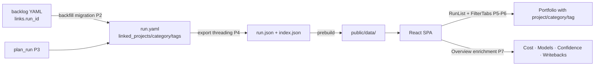

# Feature Brief & Metadata

**Feature Name:**

> Run Metadata Enrichment

**Filepath Name:**

> `run-metadata-enrichment-v1`

**Date:**

> 2026-06-20

**Author:**

> Nick Miethe (prd-writer / Opus orchestration)

**Related Epic(s)/PRD ID(s):**

> `runs-viewer-v2.2-polish-epic` — F5 (long pole; Tier 3)

**Related Documents:**

> - Epic brief: `.claude/worknotes/runs-viewer-v22-planning/epic-brief.md` §1.10–1.12, §2-F5
> - Decisions block: `.claude/worknotes/run-metadata-enrichment/decisions-block.md`
> - Epic PRD: `docs/project_plans/PRDs/enhancements/runs-viewer-v2.2-polish-epic-v1.md`
> - Implementation plan: `docs/project_plans/implementation_plans/features/run-metadata-enrichment-v1.md`
> - Human brief: `docs/project_plans/human-briefs/run-metadata-enrichment.md`

---

## 1. Executive Summary

Runs in the Research Foundry viewer carry no project, category, or tag metadata at the export layer, even though this information exists in the backlog and partially in `run.yaml`. This feature creates a first-class run linked-metadata model — **Linked Projects** (primary list field), **Categories**, and **Tags** — derived from the backlog for existing runs, populated at creation going forward, threaded through the export pipeline, and surfaced everywhere in the viewer. A secondary P1 scope surfaces additional high-value run data (cost/model profiles, confidence distributions, writeback status, etc.) through the same export pattern as enrichment widgets on the Overview tab.

**Priority:** HIGH

**Key Outcomes:**
- Outcome 1: Every run displays a primary "Linked Projects" field in the portfolio list, run card, and detail views.
- Outcome 2: Categories and tags are facet-filterable in the portfolio, replacing opaque run IDs as the primary navigation lens.
- Outcome 3: A formal run-export JSON schema + optional TS codegen eliminates hand-sync drift between the Python export and TypeScript types.

---

## 2. Context & Background

### Current state

The runs-viewer SPA (`frontend/runs-viewer`) is a read-only React app deployed LAN-only at `10.42.10.76:3030`. Its data source is a static export: `prebuild-static-data.mjs` invokes `rf run export --all`, which copies `runs/<id>/run.json` → `public/data/<id>/run.json` and builds `public/data/index.json`. Vite bundles the result; the viewer is never writeable.

`RFRunExport` (schema 1.1) and `RFRunSummary` (the lighter index.json shape) define the TS contract today. Neither includes `linked_projects`, `category`, `tags`, nor `backlog_idea_ref`. The export is built field-by-field in `export_service.py:export_run()` (~lines 417-436); new `run.yaml` fields are not auto-included.

The research backlog (`backlog/research_idea_backlog.yaml`) carries 55 ideas (RIB-NNN) with `pillar` (category), `tags[]`, `suggested_project`, and `links.run_id`. Linkage is one-directional: ideas point to runs; runs carry no inverse reference. `run.yaml` already has a `project` field (populated by `planning.py:plan_run()` ~lines 449-475) but it is not exported.

### Problem space

Operators browse runs by `run_id` slug (e.g., `run_knitwit_004`) because no higher-level taxonomy is visible. There is no way to filter the portfolio by project, domain, or topic. The audience for this viewer is a solo operator who wants to quickly answer "show me all AI-OS research runs" or "what did I run for KnitWit last month?" — questions that require project/category/tag metadata.

Additionally, several high-value run fields (cost, model profiles, confidence distribution, writeback target status) exist in `run.yaml` or are computable from export data but are never rendered. Some disabled viewer tabs (Swarm, Policies, Library) depend on enriched export fields being available.

### Current alternatives / workarounds

Operators must mentally map `run_id` slugs to projects. There is no workaround for project/category filtering; the FilterTabs component (`FilterTabs.tsx`) filters only by status and sensitivity. Tag and pillar data require reading `backlog/research_idea_backlog.yaml` manually.

### Architectural context

Research Foundry is a Python CLI + file-backed control plane. The export pipeline is:

```
run.yaml  →  export_service.export_run()  →  run.json  →  prebuild-static-data.mjs  →  public/data/  →  React SPA
```

`index.json` is a lightweight summary built in `prebuild-static-data.mjs` from the same export. Frontend types in `frontend/runs-viewer/src/types/rf/run-export.ts` are hand-written (no codegen); this is the primary source of drift.

No formal JSON schema file for run.json exists today; the contract is implicit in `export_run()` code and a comment pointing to `docs/dev/architecture/rf-run-export-schema.md`.

---

## 3. Problem Statement

**Core gap:** Runs carry no linked project, category, or tag at export, so the viewer cannot group, label, or filter by any meaningful taxonomy — despite the backlog already encoding this information.

**User story:**
> "As the operator, when I open the portfolio, I see a wall of `run_id` slugs instead of labeled runs grouped by project and topic, so I cannot quickly orient myself or find what I want without memorizing slug conventions."

**Technical root causes:**
- `run.yaml` has a `project` field but it is not threaded into `export_run()` or `index.json`.
- The backlog's `pillar`, `tags[]`, `suggested_project`, and `links.run_id` are never inverted to build a run→backlog map.
- `RFRunSummary` (the index.json shape used in the list view) is too thin to carry any metadata.
- `plan_run()` in `planning.py` does not populate `linked_projects`, `category`, or `tags` on new runs.
- Frontend types (`run-export.ts`) are hand-written and will drift as fields are added; no JSON schema or codegen guards this.

---

## 4. Goals & Success Metrics

### Primary goals

**Goal 1: First-class run metadata model**
- `run.yaml` carries `linked_projects[]`, `category`, `tags[]`, `backlog_idea_ref`, `backlog_idea_id` for all runs (new + backfilled).
- Schema is governed by a formal JSON schema file; optional TS codegen eliminates hand-sync risk.

**Goal 2: Metadata visible everywhere in the viewer**
- Linked Projects appears as a primary column/field on the portfolio list, run card, status lane, detail modal header, and detail Overview tab.
- Category and tags render as chips on RunCard, Overview, RunDetailModal header, and relevant side panes.
- All target surfaces handle missing/null fields gracefully (older pre-migration runs).

**Goal 3: Facet-based portfolio filtering**
- FilterTabs (or an extended filter panel) supports filter-by-linked-project, filter-by-category, filter-by-tag.
- Filtered views update RunList correctly; empty states are explicit.

**Goal 4 (P1): Surface high-value run data**
- Cost/model profiles, source-count-by-type, confidence+materiality distributions, freshness, writeback targets+status, routing/swarm context, and audience are threaded through the same export pipeline and shown in Overview enrichment widgets.
- Each disabled tab that depends on enriched export (Swarm/G1, Policies/G2, Library/G4) now has the data it needs.

### Success metrics

| Metric | Baseline | Target | Measurement method |
|--------|----------|--------|--------------------|
| Runs with `linked_projects` populated | 0 / 55 | 100% of runs with backlog link | `rf run list --format json \| jq '[.[] \| select(.linked_projects)]'` |
| Portfolio filter surfaces | 1 (status) | 4 (status + project + category + tag) | Manual count of FilterTabs options |
| Export type drift incidents | N/A (manual) | 0 post-codegen | CI type-check pass on `tsc --noEmit` |
| Hand-sync required for new export field | Always | Never (codegen) | Dev observation |
| P1 enrichment fields in Overview | 0 | ≥ 6 widgets | Manual audit of Overview tab |

---

## 5. User Personas & Journeys

### Personas

**Primary persona: Solo operator (Nick)**
- Role: Sole user of the LAN-deployed runs-viewer; manages 55+ research runs across multiple projects.
- Needs: Quickly orient in the portfolio, filter to a project's runs, understand a run's domain at a glance without reading the full report.
- Pain points: `run_id` slugs are opaque; no project/topic grouping; cost and model data buried in `run.yaml`.

**Secondary persona: AI execution agents**
- Role: Agents reading `run.json` / `index.json` to plan downstream tasks (e.g., disabled-tab implementers in G1–G4).
- Needs: Enriched, formally-typed export fields with explicit schema version.
- Pain points: Fields they need (swarm_plan, writeback status, linked_project) are absent from export.

### High-level flow



---

## 6. Requirements

### 6.1 Functional requirements

| ID | Requirement | Priority | Notes |
|----|-------------|----------|-------|
| FR-1 | `run.yaml` schema extended with `linked_projects[]`, `category`, `tags[]`, `backlog_idea_ref`, `backlog_idea_id` | Must | P0. See §1.10-1.11. |
| FR-2 | Formal JSON schema file for `rf-run-export` created; TS codegen optional but strongly preferred | Must | Kills hand-sync drift (§1.12). |
| FR-3 | Idempotent, dry-run-able backfill migration inverts backlog `links.run_id` to write metadata onto existing runs | Must | P0 Phase 2. Must be reversible. |
| FR-4 | `plan_run()` populates new fields on run creation; `rf capture` / `seed_swarm_runs.sh` accept `--backlog-idea-ref` | Must | P0 Phase 3. |
| FR-5 | `export_run()` threads `linked_projects`, `category`, `tags`, `backlog_idea_ref`, `backlog_idea_id` into run.json dict; `index.json` summary includes `linked_projects`, `category`, `tags` | Must | P0 Phase 4. Explicit threading per §0.1 rule. |
| FR-6 | Export `schema_version` bumped; `RFRunSummary` and `RFRunExport` TS types updated | Must | Phase 4. |
| FR-7 | Linked Projects displayed as a primary field on RunList table, RunCard, StatusLane | Must | P0 Phase 5. target_surfaces listed in §11. |
| FR-8 | Category and tags displayed as chips on RunCard, RunDetail Overview, RunDetailModal header, LineageDetailPanel, ClaimAuditWorkbench ClaimInspector | Must | P0 Phase 5. target_surfaces listed in §11. |
| FR-9 | FilterTabs + RunList filter state extended to support filter-by-linked-project, filter-by-category, filter-by-tag | Must | P0 Phase 6. |
| FR-10 | Empty state shown when filter produces zero results | Must | Phase 6. |
| FR-11 | P1 enrichment fields threaded through export and rendered in Overview enrichment widgets: cost_usd, model profiles, source-count-by-type, confidence+materiality distributions, freshness, writeback targets+status, routing/swarm context, audience | Should | P1 Phase 7. Each field resilient to absent/null. |
| FR-12 | Re-export + rebuild static data task included in any phase touching export or run.yaml | Must | Per §0.1.1 shared rule. |

### 6.2 Non-functional requirements

**Performance:**
- `index.json` growth from new summary fields must not add >10% to portfolio load time.
- Backfill migration completes in <60 s for 100 runs on the LAN node.

**Reliability:**
- Backfill migration is idempotent: re-running on already-migrated runs is a no-op.
- Migration is reversible: a `--dry-run` mode diffs proposed changes; a backup of modified `run.yaml` files is taken before write (git-tracked or explicit `.bak`).
- All new export fields are optional; older static bundles continue to load without FE errors.

**Observability:**
- Migration script logs per-run outcome (updated / skipped / no_backlog_link) to stdout.
- A summary line reports counts: `N updated, M skipped, K errors`.

**Accessibility:**
- Category and tag chips use accessible color contrast (WCAG AA).
- Filter controls are keyboard navigable; active filter state is announced to screen readers.

---

## 7. Scope

### In scope

- `run.yaml` schema extension: `linked_projects[]`, `category`, `tags[]`, `backlog_idea_ref`, `backlog_idea_id`.
- Formal `rf-run-export` JSON schema document + optional TS codegen pipeline.
- Backfill migration script: inverts `backlog/research_idea_backlog.yaml` `links.run_id` → writes fields onto existing `run.yaml` files + updates `run_index.yaml`.
- Creation path: `planning.py:plan_run()` populates fields; CLI surface for `--backlog-idea-ref`.
- Export threading: `export_service.py:export_run()` + `index.json` summary + `schema_version` bump.
- FE types: `RFRunSummary` + `RFRunExport` extended (or codegen'd).
- Viewer display (P0): Linked Projects as primary portfolio field; category + tags as chips on all relevant surfaces; R-P2 resilience on every surface.
- Portfolio filtering: FilterTabs + RunList state for project / category / tag.
- P1 enrichment: additional run data fields threaded + shown in Overview widgets.
- CHANGELOG, README, and schema doc updates.
- Runtime-smoke verification task covering all UI target_surfaces (R-P4).

### Out of scope

- Making the viewer writeable (it is and remains read-only).
- Changing run governance or secret-scanning policy (governance.py is untouched).
- Real-time or API-backed data (the viewer remains fully static-export based).
- Implementation of disabled viewer tabs G1–G6 (this PRD provides the data they need; tab enablement is in the G sub-epic).
- Codegen for types other than `run-export.ts` (out of scope for v1; can be revisited).
- Automated re-export scheduling (manual re-export remains the operator's responsibility).

---

## 8. Dependencies & Assumptions

### External dependencies

- `@xyflow/react` v12 (lineage graph; no changes required here — this dependency is already present).
- Python `pydantic` or equivalent for JSON schema validation of `run.yaml` fields (if formal validation added to migration).

### Internal dependencies

- **F1 `nav-titles-lineage-fixes`** (soft): F1 also touches `export_run()` and `index.json` (adds `title`). F5 Phase 4 supersedes/extends F1's export edit. Coordinate to avoid merge conflict; F5 must include F1's `title` field or be sequenced after F1 merges.
- **backlog YAML** (`backlog/research_idea_backlog.yaml`): authoritative source for `pillar`, `tags`, `suggested_project`, and `links.run_id`. Must not be modified by this feature (read-only input to backfill).
- **Downstream G1/G2/G4**: Swarm, Policies, Library tabs depend on P4/P7 enriched export fields. Those feature contracts should not begin implementation until F5 P4 is merged and re-exported.

### Assumptions

- The 55 backlog ideas in `research_idea_backlog.yaml` are the complete set of ideas that have `links.run_id` populated; no shadow linkage exists elsewhere.
- `run.yaml` is always valid YAML and readable by the migration script on the LAN node.
- The operator will manually re-export and rebuild after this feature ships (`rf run export --all` + `pnpm build`).
- `run_index.yaml` is derived state and safe to regenerate; no manual edits exist there.

### Feature flags

- None required. New export fields are optional in the schema; older runs without them degrade gracefully in the FE.
- (Optional) `VITE_SHOW_ENRICHMENT=0` to hide P1 enrichment widgets during staged rollout — decided at implementation time.

---

## 9. Risks & Mitigations

| Risk | Impact | Likelihood | Mitigation |
|------|--------|------------|------------|
| Dual-write consistency: `run.yaml`, `run_index.yaml`, and any derived `backlog_context.yaml` getting out of sync | High | Medium | Single writer pattern: only the migration script and `plan_run()` write metadata; `run_index.yaml` is always re-derived from `run.yaml`, never edited independently |
| Backfill correctness: slug mismatch between `links.run_id` in backlog and actual `run_id` on disk | High | Low | Use backlog `links.run_id` as the authoritative key (exact match, NOT fuzzy title match); dry-run diff reviewed before write; migration logs mismatches |
| Export `schema_version` compatibility: older static bundles in `public/data` won't have new fields | Medium | High | All new fields are optional; FE handles absent/null (R-P2 per-field ACs); version bump is for observability only, not a breaking change gate |
| "Everywhere" surface sprawl: new fields silently omitted from one or more target surfaces | Medium | Medium | Enumerate explicit `target_surfaces` per R-P1 in every AC; one runtime-smoke verification task per UI surface (R-P4) in Phase 8 |
| Migration reversibility: backfill writes to `run.yaml` cannot be easily undone | Medium | Low | Git-track `run.yaml` files (already in repo); migration takes a `.bak` snapshot; `--dry-run` mode required before any write |
| F1 export conflict: both F1 and F5 P4 edit `export_run()` and `index.json` | Low | High | Sequence F5 P4 after F1 merges, or explicitly coordinate the export edits in a single commit covering both `title` (F1) and metadata fields (F5) |
| TS codegen complexity: codegen pipeline may add tooling overhead | Low | Medium | Codegen is optional; if it adds excessive friction, hand-sync with a CI `tsc --noEmit` gate is acceptable for v1 |

---

## 10. Target state (post-implementation)

**User experience:**
- Opening the portfolio shows runs labeled by Linked Projects and tagged with category/domain chips — no more opaque slug walls.
- Filtering by "Agentic OS" or "knitwit" in the filter panel narrows the portfolio immediately.
- A run's Overview tab shows a rich metadata panel: linked project, category, tags, cost, model profiles, source counts, confidence distribution, writeback status — all in one glance.

**Technical architecture:**
- `run.yaml` is the authoritative metadata store; `export_run()` threads fields into `run.json` + `index.json`; FE types are codegen'd (or verified by CI).
- Backfill migration is a one-time operation (idempotent re-runs are no-ops); `plan_run()` populates new fields on every subsequent run.
- Formal `rf-run-export` JSON schema doc is the single source of truth for the export contract; TS codegen consumes it.

**Observable outcomes:**
- `public/data/index.json` entries include `linked_projects`, `category`, `tags`.
- `tsc --noEmit` passes after any export schema change (codegen keeps types in sync).
- Disabled tabs G1/G2/G4 can now be enabled (their data dependencies are met by F5 P4/P7).

---

## 11. Overall acceptance criteria (definition of done)

### P0 core ACs (structured, R-P1 + R-P2 enforced)

#### AC-1: `run.yaml` schema extended

- New fields `linked_projects[]`, `category`, `tags[]`, `backlog_idea_ref`, `backlog_idea_id` are valid YAML entries.
- A formal `rf-run-export` JSON schema file exists and validates the export shape.
- (If codegen enabled) `run-export.ts` is generated from schema; `tsc --noEmit` passes.

#### AC-2: Backfill migration

- Running `rf metadata backfill --dry-run` prints a diff of proposed changes without writing.
- Running `rf metadata backfill` (or equivalent script) writes `linked_projects`, `category`, `tags`, `backlog_idea_ref`, `backlog_idea_id` to all `run.yaml` files that have a corresponding `links.run_id` entry in the backlog.
- Re-running on already-migrated runs is a no-op (idempotent).
- Migration log reports counts: updated / skipped / no_backlog_link.
- Reversibility: modified `run.yaml` files can be restored via git or `.bak`.

#### AC-3: Creation path

- A new run created via `plan_run()` carries `linked_projects`, `category`, `tags`, `backlog_idea_ref` in `run.yaml`.
- `rf capture --backlog-idea-ref RIB-NNN` propagates the backlog linkage to the new run.

#### AC-4: Export threading

- `run.json` for any run with metadata includes `linked_projects`, `category`, `tags`, `backlog_idea_ref`, `backlog_idea_id`.
- `index.json` summary entries include `linked_projects`, `category`, `tags`.
- Export `schema_version` is bumped.
- `RFRunSummary` and `RFRunExport` TS types include the new fields (optional, with `?`).
- A "re-export + rebuild static data" task (`rf run export --all` + `pnpm build`) is documented and executed before FE verification.

#### AC-5: Linked Projects — primary portfolio display

- target_surfaces:
    - `frontend/runs-viewer/src/screens/RunList.tsx`
    - `frontend/runs-viewer/src/components/RunList/RunCard.tsx`
    - (StatusLane rendered within `RunList.tsx`)
- propagation_contract: `index.json` → `RFRunSummary.linked_projects` → RunList table column + RunCard badge + StatusLane label.
- resilience: When `linked_projects` is absent or empty, each surface renders gracefully (no crash; shows `—` or no badge).
- visual_evidence_required: Screenshot of portfolio with ≥1 run showing Linked Projects label.
- verified_by: [TASK-5.1, TASK-8.1 runtime smoke]

#### AC-6: Category + tags — chips everywhere

- target_surfaces:
    - `frontend/runs-viewer/src/components/RunList/RunCard.tsx`
    - `frontend/runs-viewer/src/components/RunDetail/RunDetailWorkspace.tsx` (Overview tab)
    - `frontend/runs-viewer/src/components/RunDetail/RunDetailModal.tsx` (header area)
    - `frontend/runs-viewer/src/components/LineageGraph/LineageDetailPanel.tsx`
    - `frontend/runs-viewer/src/components/ClaimLedger/ClaimAuditWorkbench.tsx` (ClaimInspector pane)
- propagation_contract: `run.json` → `RFRunExport.category` + `.tags[]` → chip components on each surface.
- resilience: Each surface renders with no chips (not blank/error) when `category` or `tags` is absent/null/empty.
- visual_evidence_required: Screenshot of RunCard and Overview tab with category chip and ≥1 tag chip visible.
- verified_by: [TASK-5.2, TASK-8.1 runtime smoke]

#### AC-7: Portfolio filtering

- target_surfaces:
    - `frontend/runs-viewer/src/components/RunList/FilterTabs.tsx`
    - `frontend/runs-viewer/src/screens/RunList.tsx`
- Filtering by a linked project shows only runs with that project in `linked_projects[]`.
- Filtering by category shows only runs matching that category.
- Filtering by tag shows only runs containing that tag in `tags[]`.
- Deselecting a filter restores the full list.
- Empty state: a distinct message appears when no runs match the filter (not a blank panel).
- resilience: Filter options derived dynamically from available data; no hardcoded project/tag names.
- verified_by: [TASK-6.1, TASK-8.1 runtime smoke]

### P1 enrichment ACs (per-field, same resilience rule)

#### AC-8: P1 enrichment fields in Overview

- target_surfaces:
    - `frontend/runs-viewer/src/components/RunDetail/RunDetailWorkspace.tsx` (Overview tab)
- The following fields are threaded through export and rendered as Overview widgets when present:
  `cost_usd`, model profiles (`extraction_model_profile`, `synthesis_model_profile`, `verification_model_profile`), source-count-by-type, confidence distribution, materiality distribution, freshness (`max_age_days`), writeback targets+status, routing_decision, swarm_plan summary, audience.
- resilience: Each widget is individually absent-safe; a run missing any field renders the widget hidden or with an explicit "not available" state — not an error.
- verified_by: [TASK-7.1, TASK-8.1 runtime smoke]

### Technical ACs

- [ ] `tsc --noEmit` passes with zero errors after all FE changes (excluding pre-existing `__tests__/a11y/` errors).
- [ ] `rf run export --all` runs to completion on the LAN node with no Python errors.
- [ ] `pnpm --filter runs-viewer build` succeeds and the SPA loads at `10.42.10.76:3030`.
- [ ] Unit tests cover: backfill derivation logic, export threading for each new field, filter reducer.
- [ ] Runtime-smoke task in Phase 8 covers every `target_surfaces` entry from ACs 5–8.

### Documentation ACs

- [ ] `CHANGELOG [Unreleased]` entry added for user-facing viewer changes.
- [ ] `rf-run-export-schema.md` (architecture doc) updated to reflect new fields and schema_version.
- [ ] `README` updated with new `rf metadata backfill` command.

---

## 12. Assumptions & open questions

### Assumptions

- Backlog `links.run_id` values exactly match `run_id` directories in `runs/`; no fuzzy matching is needed.
- `run_index.yaml` is not the source of truth for any downstream system other than this viewer; it is safe to regenerate.
- Codegen tooling (e.g., `quicktype` or `json-schema-to-typescript`) is available or easily added as a dev dependency; if not, the fallback is manual types + CI type-check.
- `plan_run()` already accepts `**kwargs`-style extra args or can be extended without breaking callsites.

### Open questions

- [ ] **OQ-1**: Should `linked_projects` be a list (multiple projects per run) or a single scalar? Defaulting to list per epic brief. Confirm if a run can legitimately belong to multiple projects.
  - **A**: List, per FR-1. Multiple projects per run is plausible (cross-project research).
- [ ] **OQ-2**: Does `backlog_context.yaml` (mentioned in decisions block risk H) need to be a separate file per run, or are all fields written directly into `run.yaml`?
  - **A**: Default to writing directly into `run.yaml` for simplicity; introduce a separate sidecar file only if `run.yaml` size becomes a concern (defer).
- [ ] **OQ-3**: Which codegen tool should be used for `run-export.ts`? `json-schema-to-typescript` (npm) is the pragmatic choice.
  - **A**: TBD at Phase 1; if codegen adds >2h setup cost, defer to a CI `tsc --noEmit` gate with hand-written types for v1.
- [ ] **OQ-4**: Should the P1 enrichment widgets in Overview be hidden behind `VITE_SHOW_ENRICHMENT` flag, or always shown (hiding gracefully when data absent)?
  - **A**: Always show (hiding gracefully when absent) — the viewer is LAN-only and single-user. A feature flag adds complexity without benefit.

---

## 13. Appendices & references

### Related documentation

- **Epic brief**: `.claude/worknotes/runs-viewer-v22-planning/epic-brief.md` — §1.9 (canonical surfaces), §1.10 (unsurfaced data), §1.11 (backlog linkage), §1.12 (creation & serving)
- **Decisions block**: `.claude/worknotes/run-metadata-enrichment/decisions-block.md` — phase boundaries, agent routing, risk hotspots, estimation anchors
- **Source files (verified)**: `src/research_foundry/services/export_service.py` (~lines 417-436 export dict, ~277-295 source resolution), `src/research_foundry/services/planning.py` (~lines 449-475 plan_run metadata), `backlog/research_idea_backlog.yaml`, `registries/run_index.yaml`, `scripts/prebuild-static-data.mjs`, `frontend/runs-viewer/src/types/rf/run-export.ts`

### Prior art

- v2.1 facelift export+display work (~13 pts FE-only) — estimation anchor H5 in decisions block.
- `rf run export --all` static-export pattern established in `prebuild-static-data.mjs`.

---

## Implementation

### Phase summary (8-phase breakdown)

| Phase | Name | Scope | Primary agents | Est. pts |
|-------|------|-------|---------------|----------|
| 1 | Schema & contract | `run.yaml` field additions; `rf-run-export` JSON schema; optional TS codegen | data-layer-expert + python-backend-engineer | 3 |
| 2 | Derivation & backfill | Invert backlog `links.run_id`; idempotent migration to `run.yaml` + `run_index.yaml` | python-backend-engineer | 3 |
| 3 | Creation path | `plan_run()` populates new fields; `rf capture` / `seed_swarm_runs.sh` `--backlog-idea-ref` flag | python-backend-engineer | 2 |
| 4 | Export & FE types | Thread fields into `export_run()` dict + `index.json`; bump `schema_version`; extend TS types | python-backend-engineer + ui-engineer-enhanced | 2 |
| 5 | Viewer display | Linked Projects primary on list/card/lane; category+tags chips on all target surfaces (ACs 5–6) | ui-engineer-enhanced + frontend-developer | 4 |
| 6 | Filtering/faceting | FilterTabs + RunList state for project/category/tag (AC-7) | ui-engineer-enhanced | 2 |
| 7 | Enrichment extras (P1) | P1 export fields + Overview enrichment widgets (AC-8) | python-backend-engineer + ui-engineer-enhanced | 3 |
| 8 | Tests & docs | Unit tests, runtime-smoke tasks (R-P4), CHANGELOG, README, schema doc | testing agents + documentation-writer + changelog-generator | 2 |

**Total estimate: ~16–20 pts. Tier 3. See human brief for H1–H6 sanity check.**

**Critical path:** P1 → P2 → P4 → P5 → P6. P3 parallel after P1. P7 parallel after P4. P8 last.

**Soft dependency on F1:** F5 Phase 4 supersedes F1's `title` export touch; coordinate or sequence F5 P4 after F1 merges.

**Human brief:** `docs/project_plans/human-briefs/run-metadata-enrichment.md`

**Implementation plan:** `docs/project_plans/implementation_plans/features/run-metadata-enrichment-v1.md`

**Progress tracking:** `.claude/progress/run-metadata-enrichment/`

---

**Progress tracking:**

See implementation plan: `docs/project_plans/implementation_plans/features/run-metadata-enrichment-v1.md`
