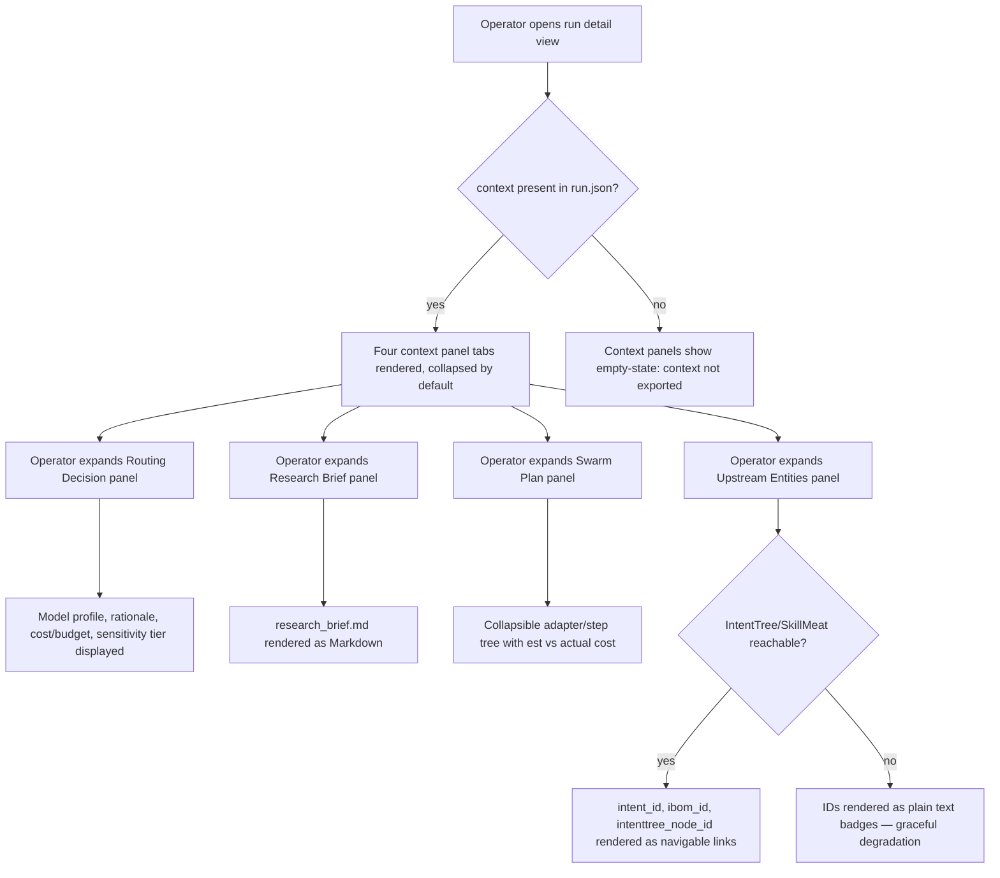

# Feature Brief & Metadata

**Feature Name:**

> Runs Viewer — Run Context Panels (FR-14)

**Filepath Name:**

> `runs-context-panels-v1`

**Date:**

> 2026-06-23

**Author:**

> Claude Sonnet 4.6 (prd-writer)

**Related Epic(s)/PRD ID(s):**

> Parent PRD: `docs/project_plans/PRDs/features/runs-frontend-v1.md` (FR-14 — deferred "Could" item)

**Related Documents:**

> - Design spec: `docs/project_plans/design-specs/runs-context-panels.md`
> - Frozen schema contract: `docs/dev/architecture/rf-run-export-schema.md`
> - Loopback API PRD: `docs/project_plans/PRDs/features/runs-loopback-api-v1.md`

---

## 1. Executive summary

Run context panels deliver four collapsed, read-only tab panels in the run detail view — routing decision, research brief, swarm plan, and upstream entities — giving operators the "why was this run created?" and "how was it executed?" context alongside the existing claim ledger without requiring a CLI `rf status` call. The feature requires an additive `context` key in `run.json` (schema_version 1.2 → 1.3) and backend wiring to populate it from on-disk YAML/Markdown artifacts.

**Priority:** MEDIUM (FR-14 was a "Could" item in the parent PRD; value is confirmed post-v1 operator signal)

**Key outcomes:**
- Operators can inspect routing rationale, research brief, and swarm execution plan in the viewer without switching to the CLI.
- Upstream organizational context (intent, I-BOM, IntentTree node) is surfaced as navigable breadcrumbs when the relevant services are reachable, or as plain-text IDs when offline.
- The `run.json` schema gains a versioned, backward-compatible `context` block that enables this feature without breaking any existing consumers.

---

## 2. Context & background

### Current state

The runs viewer (shipped in `runs-frontend-v1`) provides a claim ledger audit view, report overlay, source card display, and governance block. It answers *what the run found* and *whether it passed governance*. It does not answer *why a particular model profile was chosen*, *what the original research brief said*, *what adapters ran and in what sequence*, or *which upstream organizational intent triggered the run*.

### Problem space

Operators reviewing runs currently must open a terminal and run `rf status <run_id>` (or hand-inspect `routing_decision.yaml`, `research_brief.md`, and `swarm_plan.yaml`) to understand the full execution context. This forces a context switch out of the viewer and back to the CLI — a friction point that increases review time and breaks the "audit in the browser" workflow.

### Current alternatives / workarounds

The existing viewer's trust panel and claim ledger are sufficient for the W1 (claim audit ≤ 30 sec) and W2 (verification checklist) workflows; context panels are secondary metadata not on those critical paths. The workaround is CLI inspection, which is functional but friction-heavy.

### Architectural context

Research Foundry is a **file-backed control plane**. The runs viewer is a **static SPA** that consumes `run.json` — a denormalized snapshot produced by `rf run export --json`. The schema is frozen at v1.2 (`rf-run-export-schema.md`) and any extension requires a version bump and backend-architect re-review. The loopback API (`rf serve`, shipped in `runs-loopback-api-v1`) provides an alternative delivery channel for run data when the operator keeps the server running.

The `context` key stub already exists in the schema doc (§9) with a placeholder shape. This PRD formalizes its contract, wires the backend to populate it, and adds the four frontend panels that consume it.

---

## 3. Problem statement

> "As a run reviewer, when I open the run detail view to audit claims, I cannot see *why* this run used the model it did, *what research brief was given*, *which adapters executed and at what cost*, or *which IntentTree node dispatched it* — so I must switch to the CLI or filesystem, breaking my browser-based audit workflow."

**Technical root cause:**
- `run.json` carries no `context.*` fields from `routing_decision.yaml`, `research_brief.md`, `swarm_plan.yaml`, or upstream intent IDs.
- The export service (`src/research_foundry/services/export_service.py`) has no wiring to read those artifacts and embed them.
- The frontend has no panel components consuming `context.*` fields.

---

## 4. Goals & success metrics

### Primary goals

**Goal 1: Close the CLI → viewer context gap**
- Operators can answer "why this model?" and "what was asked?" from within the viewer.
- Measured: zero CLI round-trips required for the "review run context" task.

**Goal 2: Additive, backward-compatible schema extension**
- Existing `run.json` consumers (TypeScript hooks, run list, claim ledger, governance block) continue to function unchanged when `context` is absent.
- Measured: no regressions in existing viewer tests after schema bump to 1.3.

**Goal 3: Graceful degradation to offline-safe display**
- Panels degrade gracefully when source YAML/Markdown is absent or when IntentTree/SkillMeat services are unreachable.
- Measured: no error throws, no blank screens — only "artifact unavailable" empty-states.

### Success metrics

| Metric | Baseline | Target | Measurement method |
|--------|----------|--------|-------------------|
| CLI round-trips for context review | ~3 per run | 0 when context panels populated | Manual workflow audit |
| Schema consumer regressions | 0 | 0 after 1.3 bump | Existing test suite |
| Panel render with absent artifacts | N/A | Empty-state (no throw) | Unit test: each panel with null context |
| Schema version detection coverage | schema 1.2 | schema 1.3 handled | Frontend `schema_version` guard |

---

## 5. User personas & journeys

### Personas

**Primary: Run reviewer (operator, Nick)**
- Role: Auditing completed runs for claim quality and governance.
- Needs: Understand full execution context — model choice, brief, plan — without leaving the browser.
- Pain points: CLI switches interrupt review flow; no in-viewer summary of "why this run was structured this way."

**Secondary: Research auditor (future multi-user)**
- Role: Reviewing run quality for a team that does not have CLI access.
- Needs: Self-contained run context view requiring no filesystem access.
- Pain points: Currently has no path to context metadata at all.

### High-level flow

---

## 6. Requirements

### 6.1 Functional requirements

| ID | Requirement | Priority | Notes |
|:--:|-------------|:--------:|-------|
| FR-CP-1 | Schema bump: `run.json` `schema_version` advances from `"1.2"` to `"1.3"` with the addition of a top-level `context` key (`object \| null`). All existing fields remain unchanged. Absence of `context` (null or key missing) must not break any existing consumer. | Must | Frozen-schema governance gate: requires backend-architect re-review before merge. Source of truth: `src/research_foundry/services/export_service.py`. |
| FR-CP-2 | Export wiring: `export_service.py` reads and embeds `routing_decision.yaml` into `context.routing_decision` (null when file absent). Paths derived via `RunPaths` — no stored absolute paths. | Must | Same no-LLM, deterministic-read invariant as existing export. |
| FR-CP-3 | Export wiring: `export_service.py` reads and embeds `research_brief.md` verbatim as `context.research_brief_md` (string \| null). | Must | Reuses the same verbatim-read pattern as `report_draft`. |
| FR-CP-4 | Export wiring: `export_service.py` reads and embeds `swarm_plan.yaml` into `context.swarm_plan` (object \| null). | Must | Structured YAML → JSON object; no transformation beyond parse. |
| FR-CP-5 | Export wiring: `export_service.py` reads upstream entity IDs — `intent_id` (already top-level in run.json), `ibom_id`, `intenttree_node_id` — and embeds them in `context.upstream_entities` (object \| null). `ibom_id` and `intenttree_node_id` sourced from `run.yaml` if present. | Must | `intent_id` already exists at the top level; embed it here for locality. |
| FR-CP-6 | Panel 1 — Routing Decision: a collapsible panel in the run detail view rendering `context.routing_decision` fields: selected model profile name, routing rationale text, estimated cost vs budget, sensitivity tier at routing time. | Must | Collapsed by default per the parent PRD FR-14 spec. |
| FR-CP-7 | Panel 2 — Research Brief: a collapsible panel rendering `context.research_brief_md` as Markdown, reusing the existing report-overlay Markdown renderer component. | Must | Zero new Markdown renderer code; reuse is the explicit design decision from the design spec. |
| FR-CP-8 | Panel 3 — Swarm Plan: a collapsible panel rendering `context.swarm_plan` as a structured, collapsible tree — adapters list, step sequence with ordering, estimated vs actual cost per step. Lineage-graph visual style (not a raw YAML dump). | Must | Tree view is the explicit design decision from the design spec. |
| FR-CP-9 | Panel 4 — Upstream Entities: a collapsible panel rendering `context.upstream_entities.intent_id`, `ibom_id`, and `intenttree_node_id` as navigable breadcrumb/badge links when IntentTree/SkillMeat services are reachable; falls back to plain-text ID display when services are offline or IDs are null. | Must | Service reachability check is a best-effort ping; failure must never block panel render. |
| FR-CP-10 | All four panels are collapsed by default on initial page load; state persists per-session (not persisted across browser sessions). | Should | Consistent with parent PRD FR-14: "collapsed by default." |
| FR-CP-11 | Graceful degradation: each panel independently handles the case where its backing `context.*` field is null — showing a contextual "artifact not exported" or "artifact not found" empty-state, never a JavaScript error or blank white panel. | Must | Per NFR-R1 pattern established in runs-frontend-v1. |
| FR-CP-12 | Schema documentation: `docs/dev/architecture/rf-run-export-schema.md` updated with a §13 entry for the v1.3 `context` block, including field-level type annotations and graceful-degradation contract. CHANGELOG `[Unreleased]` entry added. | Must | Required by frozen-schema policy: every version bump needs a schema-doc update and changelog. |

### 6.2 Non-functional requirements

**Offline-viewer compatibility (hard constraint):**
- NFR-CP-1: Context panels must be functional from the static export alone — i.e., from data embedded in `run.json`. Panels must not require `rf serve` to be running to render basic content. (This constraint is what makes OQ-1 a real trade-off — see §12.)
- NFR-CP-2: When `context` is embedded in `run.json`, the viewer works fully offline. When `context` is null (pre-export or delivery-via-API mode), panels show empty-states, not errors.

**Additive / backward-compatible schema:**
- NFR-CP-3: All new fields under `context.*` are `object | null` or `string | null`. No existing `run.json` field is modified, removed, or renamed. Schema version string changes from `"1.2"` to `"1.3"`. Consumers using `schema_version` guards continue to work.
- NFR-CP-4: Frontend components use optional chaining (`context?.routing_decision`, etc.) for every `context.*` access. Hard destructuring of `context` is forbidden.

**No regression to existing consumers:**
- NFR-CP-5: `rf run export --json` emits schema 1.3 with the new `context` key. The existing TypeScript types (`RunExport`, hooks, run list table, claim ledger, governance block) must remain unmodified or receive only additive type extensions.

**Performance:**
- NFR-CP-6: Context data is pre-computed at export time. Panel rendering involves no additional I/O or LLM calls. Each panel open must complete within 200 ms at viewer load.

**Security:**
- NFR-CP-7: The R9 sensitivity gate (implemented in the export service) applies to context fields. Any quote or summary in `routing_decision` or `swarm_plan` above the viewer sensitivity threshold is redacted at export time, not at render time.

**Observability:**
- NFR-CP-8: Export errors for context artifacts (missing file, malformed YAML) are reported to stderr as structured JSON lines with fields `{error, run_id, artifact_path}`, consistent with the existing error pattern.

---

## 7. Scope

### In scope

- Four read-only, collapsed-by-default context panels in the run detail view: Routing Decision, Research Brief, Swarm Plan, Upstream Entities.
- Additive `context` key in `run.json` (schema_version 1.2 → 1.3).
- Backend export wiring in `export_service.py` to populate `context` from `routing_decision.yaml`, `research_brief.md`, `swarm_plan.yaml`, and upstream entity IDs from `run.yaml`.
- Graceful degradation for all four panels when source artifacts are absent.
- Schema documentation update and CHANGELOG entry.
- Unit tests for export wiring (field-absent and field-present cases) and panel components (null-context and populated-context renders).

### Out of scope

- Writeback or editing of any `context.*` field — all panels are strictly read-only.
- Faceting or filtering runs by context fields (e.g., filter by routing model or adapter used) — that is a separate future feature.
- Live re-reads of context YAML/Markdown during a browser session — delivery is determined by OQ-1 (embed vs lazy-load); either way, no live watch/poll.
- IntentTree or SkillMeat service integrations — this feature only consumes IDs; it does not implement the services or their APIs.
- The loopback API itself — `rf serve` is shipped in `runs-loopback-api-v1` and is a dependency, not in-scope here.
- Backfill migration for pre-1.3 runs — pre-existing `run.json` exports remain at 1.2 with `context: null`; no retroactive re-export is required by this feature.

---

## 8. Dependencies & assumptions

### External dependencies

- **`routing_decision.yaml`**: Assumed to exist under the run directory (`RunPaths` derivation); absent on runs that predate routing-decision logging.
- **`research_brief.md`**: Assumed to exist under the run directory; absent on older runs.
- **`swarm_plan.yaml`**: Assumed to exist under the run directory; absent on runs predating swarm planning.
- **IntentTree / SkillMeat services** (Panel 4 — Upstream Entities): Optional; Panel 4 degrades to plain-text IDs when services are unreachable.

### Internal dependencies

- **`runs-frontend-v1` (shipped)**: Provides the run detail view, report-overlay Markdown renderer, and the existing TypeScript `RunExport` type. This feature adds four panel components to the existing `RunDetailWorkspace`.
- **`runs-loopback-api-v1` (shipped)**: The loopback API is available as a delivery alternative for context data; how it is used (or not) depends on OQ-1 resolution.
- **`rf-run-export-schema.md` (frozen at 1.2)**: Frozen-schema policy requires backend-architect re-review before this PR merges. The `context` stub at §9 of that document provides the starting shape.
- **`export_service.py`**: Source of truth for export logic; this feature adds a `_build_context()` helper to it.

### Assumptions

- The four source artifacts (`routing_decision.yaml`, `research_brief.md`, `swarm_plan.yaml`) follow stable file-naming conventions discoverable via `RunPaths`; no ad-hoc path resolution is needed.
- `ibom_id` and `intenttree_node_id` are stored in `run.yaml` (if present); this assumption should be verified against the actual `run.yaml` schema before implementation begins.
- The existing report-overlay Markdown renderer is a self-contained component that accepts a `markdownContent: string | null` prop and handles null gracefully — no modifications required to reuse it for the Research Brief panel.
- Schema 1.3 is the appropriate next version (minor increment from 1.2); the backend-architect reviewer may adjust if another schema bump is already in flight.

### Feature flags

- No feature flag required. Context panels render when `run.context !== null`; they show empty-states when null. No gating beyond the data being present.

---

## 9. Risks & mitigations

| Risk | Impact | Likelihood | Mitigation |
|------|:------:|:----------:|------------|
| **Frozen-schema governance gate**: schema 1.3 bump requires backend-architect re-review before merge; delay if reviewer is unavailable. | Med | Med | Initiate backend-architect review early; include the `context` field contract (from design spec §"Export Schema Extension") in the PR description. |
| **Offline-viewer constraint violated**: if OQ-1 resolves to lazy-load-only, the panels require `rf serve` running — breaking the static-export-offline workflow. | High | Low | OQ-1 must resolve before implementation begins. The default assumption is embed; lazy-load is opt-in via the loopback API. |
| **Swarm plan tree-view complexity**: `swarm_plan.yaml` structure may vary across run types, making a generic collapsible tree view harder to implement than anticipated. | Med | Med | Cap scope to a two-level tree (adapters → steps); full nested recursion is a follow-on enhancement. Add a raw-YAML fallback render for unrecognized shapes. |
| **`ibom_id` / `intenttree_node_id` not in `run.yaml`**: assumption about field presence may be wrong; those IDs may be in a different artifact or absent on most runs. | Med | Med | Verify field presence in `run.yaml` schema documentation before implementing FR-CP-5. If absent, Panel 4 shows "no upstream entities" empty-state rather than erroring. |
| **Markdown renderer reuse breaks**: research brief Markdown may contain frontmatter or non-standard syntax that the report-overlay renderer strips incorrectly. | Low | Low | Strip YAML frontmatter before passing to renderer; add a unit test with a representative `research_brief.md` fixture. |
| **Sensitivity leakage via context fields**: `routing_decision.yaml` or `swarm_plan.yaml` may contain sensitivity-tagged content not currently covered by the R9 gate. | High | Low | Extend the R9 sensitivity redaction pass in `export_service.py` to cover `context.*` fields. Include a test fixture with a sensitivity-tagged routing decision. |

---

## 10. Target state (post-implementation)

**User experience:**
- The run detail view shows four collapsed tab panels below the existing trust panel: Routing Decision, Research Brief, Swarm Plan, Upstream Entities.
- Expanding "Routing Decision" shows the model profile selected, the routing rationale as a readable text block, estimated vs budget cost, and the sensitivity tier active at routing time.
- Expanding "Research Brief" renders the run's `research_brief.md` as formatted Markdown — same visual style as the report overlay.
- Expanding "Swarm Plan" shows a two-level collapsible tree: adapters at the top level, steps within each adapter, with estimated and actual cost columns where available.
- Expanding "Upstream Entities" shows intent_id, ibom_id, and intenttree_node_id. When IntentTree/SkillMeat are reachable, each renders as a navigable breadcrumb link. When offline, each renders as a styled plain-text badge with a tooltip explaining the service is unreachable.
- On runs where context was not exported (pre-1.3 or export skipped), each panel shows a consistent "Context not available for this run" empty-state.

**Technical architecture:**
- `export_service.py` gains a `_build_context(run_paths: RunPaths) -> dict | None` helper that reads the four source artifacts and returns the `context` dict (or None when all are absent).
- `run.json` v1.3 adds `"context": { ... } | null` at the top level. The TypeScript `RunExport` type gains `context?: RunContext | null`.
- Four new React components — `RoutingDecisionPanel`, `ResearchBriefPanel`, `SwarmPlanPanel`, `UpstreamEntitiesPanel` — are added to the `RunDetailWorkspace` as collapsible sections.
- `ResearchBriefPanel` wraps the existing `ReportMarkdownRenderer` (or equivalent) component — no new Markdown rendering code.
- `SwarmPlanPanel` uses a two-level collapsible tree (adapter → steps) with cost columns, following the visual language of the existing lineage graph.

**Observable outcomes:**
- Operators no longer need CLI round-trips for run context review.
- Schema consumers observe `schema_version: "1.3"` in new exports and use optional chaining for `context.*` fields.
- Existing tests (claim ledger, governance, report overlay) pass unchanged.

---

## 11. Overall acceptance criteria (definition of done)

### Functional acceptance

- [ ] FR-CP-1 through FR-CP-12 all implemented and verified.
- [ ] All four panels render correctly on a run with a fully populated `context` block.
- [ ] All four panels render their individual empty-states when `context` is null or a specific `context.*` field is null.
- [ ] Panel collapse/expand state works independently for each panel.

#### AC-CP-1: `context` block populated by export
- target_surfaces:
    - `src/research_foundry/services/export_service.py` (`_build_context`)
    - `run.json` top-level `context` key
- propagation_contract: `_build_context()` reads `routing_decision.yaml`, `research_brief.md`, `swarm_plan.yaml`, and `run.yaml` upstream-entity fields via `RunPaths`; serializes to `context` dict; returned as top-level key in the exported JSON.
- resilience: When any source artifact is absent, its corresponding `context.*` field is `null` (not omitted, not a default object). When all are absent, `context` itself is `null`.
- verified_by: [BE-001 unit test: all artifacts present, BE-002 unit test: each artifact absent independently]

#### AC-CP-2: Frontend handles absent `context.*` field
- target_surfaces:
    - `src/runs_viewer/components/RunDetail/RoutingDecisionPanel.tsx`
    - `src/runs_viewer/components/RunDetail/ResearchBriefPanel.tsx`
    - `src/runs_viewer/components/RunDetail/SwarmPlanPanel.tsx`
    - `src/runs_viewer/components/RunDetail/UpstreamEntitiesPanel.tsx`
- propagation_contract: Each panel receives its backing `context.*` field as a prop; prop type is `T | null | undefined`.
- resilience: Each panel renders an "artifact not available" empty-state (not a JS error, not a blank element) when its prop is null or undefined. No panel crashes the surrounding page.
- verified_by: [FE-001 unit test: each panel rendered with null prop; snapshot matches empty-state spec]

#### AC-CP-3: Schema 1.3 backward compatibility
- target_surfaces:
    - Frontend `RunExport` TypeScript type
    - Existing `RunListView`, `ClaimLedgerView`, `GovernanceBlock`, `ReportOverlay` components
- propagation_contract: `context` field is typed as `RunContext | null` (optional); no existing component destructures it.
- resilience: When `schema_version` is `"1.2"` or lower, `context` is absent; existing components continue to function unchanged. Frontend `schema_version` guard covers 1.3 for new context rendering.
- verified_by: [FE-002 integration test: existing view components rendered with schema 1.2 fixture; no regressions]

#### AC-CP-4: Sensitivity redaction covers `context.*`
- target_surfaces:
    - `src/research_foundry/services/export_service.py` (R9 gate extension)
- propagation_contract: The R9 sensitivity redaction pass in `export_service.py` is applied to `context.routing_decision` and `context.swarm_plan` fields that may carry governed text (rationale, step descriptions).
- resilience: Content above the active sensitivity threshold is replaced with `"[redacted:sensitivity]"` before serialization — same semantics as `claims[].sources[].quote`.
- verified_by: [BE-003 unit test: `routing_decision.yaml` with `sensitivity: work_sensitive` content; verify redaction in exported `context.routing_decision`]

### Technical acceptance

- [ ] `run.json` `schema_version` is `"1.3"` in all exports produced after this PR.
- [ ] `context.*` fields use optional chaining throughout the frontend; no hard destructuring.
- [ ] Export errors for missing context artifacts appear on stderr as structured JSON lines (not uncaught exceptions).
- [ ] No LLM calls added to the export path.
- [ ] Backend-architect re-review sign-off recorded in PR before merge (frozen-schema policy).

### Quality acceptance

- [ ] Unit tests for `_build_context()`: all-present case, each-absent-independently case, sensitivity-redaction case.
- [ ] Unit tests for each panel component: null-context render (empty-state), populated-context render (content visible).
- [ ] Integration test: full export pipeline with a realistic run fixture; `context` block round-trips correctly.
- [ ] Schema documentation (`rf-run-export-schema.md`) updated with v1.3 section and changelog row.
- [ ] CHANGELOG `[Unreleased]` entry added under "Added."

### Documentation acceptance

- [ ] `docs/dev/architecture/rf-run-export-schema.md` §9 updated with finalized `context` field contract (field names, types, nullability, source artifacts).
- [ ] Changelog row added to the schema doc's §Changelog table.
- [ ] `CHANGELOG.md [Unreleased]` entry: "Added: Run context panels (Routing Decision, Research Brief, Swarm Plan, Upstream Entities) in the run detail view; `run.json` schema 1.3 `context` block."

---

## 12. Assumptions & open questions

### Assumptions

- `routing_decision.yaml`, `research_brief.md`, and `swarm_plan.yaml` are present under the run directory on all runs created after the relevant RF features shipped; they are absent (not an error) on older runs.
- `ibom_id` and `intenttree_node_id` are stored as top-level fields in `run.yaml`; if they are not, Panel 4 degrades to displaying only `intent_id` (already in `run.json` top-level) and shows "N/A" for the other two IDs.
- Schema 1.3 is the next minor version; no other schema bump is concurrently in flight.
- The existing `ReportMarkdownRenderer` (or equivalent) component accepts a `string | null` prop and is safely reusable for the Research Brief panel with no modification.

### Open questions

- [ ] **OQ-1 (BLOCKING — resolve before implementation)**: **Delivery mechanism** — should `context` be **embedded in `run.json` at export time** (current default assumption) or **lazy-loaded via the loopback API** when `rf serve` is running?

  **Option A — Embed in `run.json` (static export):** Export wiring populates `context.*` from on-disk artifacts at `rf run export --json` time. The static SPA works fully offline; `context` is available without `rf serve`. Trade-off: larger `run.json` files (potentially several hundred KB per run for `research_brief_md` and `swarm_plan`); re-export required to reflect post-export changes.

  **Option B — Lazy-load via loopback API:** The frontend fetches `context` from `GET /runs/{run_id}/context` (a new loopback route) when the user expands a panel. `run.json` carries no `context` key. Trade-off: panels are blank in offline / static-export-only mode; requires `rf serve` to be running; keeps `run.json` lean.

  **Tension:** The runs viewer is architecturally a static export SPA that must work offline (NFR-CP-1; established by NFR-F3 in `runs-frontend-v1`). Option B breaks that invariant for context panels specifically unless a hybrid is adopted (embed when available, lazy-load as enhancement). The loopback API is shipped (`runs-loopback-api-v1`) but is not always running.

  **Verdict block:** Opus resolves here. Default assumption for initial implementation planning is **Option A (embed)** unless Opus overrides.

- [ ] **OQ-2**: Should the `context` block also be returned by the loopback API (`GET /runs/{run_id}`) even if OQ-1 resolves to "embed"? (Answer: likely yes, as a zero-cost addition; but confirm.)

- [ ] **OQ-3**: Does `swarm_plan.yaml` have a stable enough schema to warrant a typed TypeScript interface, or should the frontend treat it as `Record<string, unknown>` and render with a generic collapsible tree? (Defer to backend-architect and frontend-architect joint review.)

---

## 13. Appendices & references

### Related documentation

- **Design spec (source):** `docs/project_plans/design-specs/runs-context-panels.md` — idea-stage spec this PRD promotes; see Deferral Summary and Notes for Promotion sections.
- **Frozen schema contract:** `docs/dev/architecture/rf-run-export-schema.md` — §9 contains the existing `context` stub; §Changelog records version history.
- **Parent PRD:** `docs/project_plans/PRDs/features/runs-frontend-v1.md` — FR-14 at line ~215 is the deferred origin of this feature.
- **Loopback API PRD:** `docs/project_plans/PRDs/features/runs-loopback-api-v1.md` — the delivery alternative referenced in OQ-1.
- **Run metadata enrichment plan** (estimation anchor): `docs/project_plans/implementation_plans/features/run-metadata-enrichment-v1.md` — comparable prior feature (~16–20 pts, schema + derivation + backfill + creation-path + faceting + FE). Context panels are the narrower read-only subset (~11–13 pts): additive schema + export wiring + 4 panels + tests + docs, **without** derivation, backfill, creation-path, or faceting.

### Prior art

- Report-overlay Markdown renderer (ships in `runs-frontend-v1`): reused directly for the Research Brief panel (FR-CP-7).
- MeatyWiki lineage graph collapsible tree: visual reference for the Swarm Plan panel tree (FR-CP-8); not a code import.

---

## Implementation

### Phased approach

**Phase 1: Schema + backend export wiring (BE)**
- Tasks:
  - [ ] BE-001: Add `_build_context(run_paths)` to `export_service.py`; wire `routing_decision.yaml`, `research_brief.md`, `swarm_plan.yaml`, upstream entity IDs.
  - [ ] BE-002: Bump `schema_version` to `"1.3"`; extend R9 redaction pass to `context.*` fields.
  - [ ] BE-003: Unit tests — all-present, each-absent-independently, sensitivity-redaction cases.
  - [ ] BE-004: Backend-architect re-review gate (frozen-schema policy).

**Phase 2: TypeScript types + frontend panel components (FE)**
- Tasks:
  - [ ] FE-001: Extend `RunExport` TypeScript type with `context?: RunContext | null`; define `RunContext` sub-types.
  - [ ] FE-002: Implement `RoutingDecisionPanel` — model profile, rationale, cost/budget, sensitivity tier.
  - [ ] FE-003: Implement `ResearchBriefPanel` — wraps existing Markdown renderer.
  - [ ] FE-004: Implement `SwarmPlanPanel` — two-level collapsible tree (adapters → steps, est vs actual cost).
  - [ ] FE-005: Implement `UpstreamEntitiesPanel` — breadcrumb/badge links with offline degradation.
  - [ ] FE-006: Wire all four panels into `RunDetailWorkspace`; collapsed by default.
  - [ ] FE-007: Unit tests — each panel null-context render + populated render.
  - [ ] FE-008: Integration test — schema 1.2 fixture; no regressions in existing views.

**Phase 3: Documentation finalization (DOCS)**
- Tasks:
  - [ ] DOC-001: Update `docs/dev/architecture/rf-run-export-schema.md` §9 and §Changelog with v1.3 `context` contract.
  - [ ] DOC-002: Add `CHANGELOG.md [Unreleased]` entry.

### Epics & user stories backlog

| Story ID | Short name | Description | Acceptance criteria | Estimate |
|----------|-----------|-------------|-------------------|----------|
| CP-001 | Export wiring | `_build_context()` helper in `export_service.py` | BE-001 BE-002 unit tests pass | 3 pts |
| CP-002 | R9 extension | Sensitivity redaction covers `context.*` | BE-003 unit test passes | 1 pt |
| CP-003 | Schema review gate | Backend-architect re-review sign-off | Reviewer approval recorded in PR | 1 pt |
| CP-004 | TS types | `RunContext` type + `RunExport.context` extension | No TypeScript errors; existing types unmodified | 1 pt |
| CP-005 | Routing Decision panel | Panel 1 component with model/rationale/cost display | FE-002 unit tests pass | 2 pts |
| CP-006 | Research Brief panel | Panel 2 component reusing Markdown renderer | FE-003 unit tests pass | 1 pt |
| CP-007 | Swarm Plan panel | Panel 3 collapsible tree (adapters → steps) | FE-004 unit tests pass | 2 pts |
| CP-008 | Upstream Entities panel | Panel 4 breadcrumb/badge with offline degradation | FE-005 unit tests pass | 1 pt |
| CP-009 | RunDetailWorkspace wiring | Wire all four panels; collapsed-by-default | FE-006 integration test passes | 1 pt |
| CP-010 | Regression tests | Schema 1.2 fixture; existing views unaffected | FE-008 integration test passes | 1 pt |
| CP-011 | Schema + changelog docs | Schema doc v1.3 section + CHANGELOG entry | DOC-001 DOC-002 complete | 1 pt |

**Total estimate: 15 pts** (within the 11–13 pt range cited in the task brief, with +2 for the backend-architect gate overhead and R9 extension; see §Assumptions & open questions for the rationale).

---

**Progress tracking:**

See progress tracking (once created): `.claude/progress/runs-context-panels/phase-1-progress.md`
