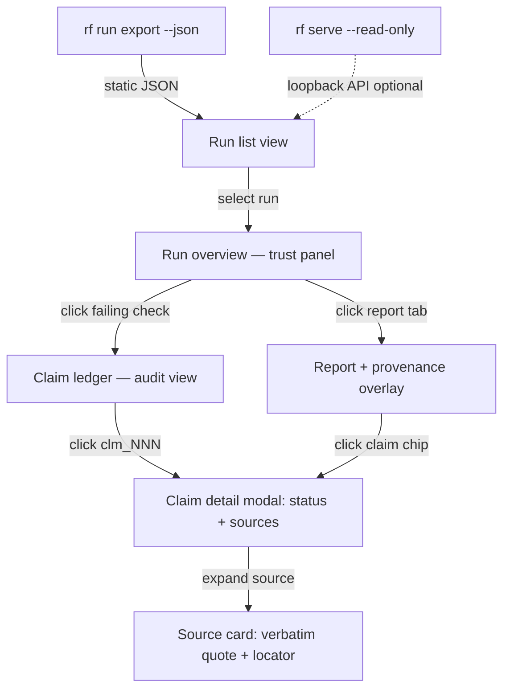

# Feature Brief & Metadata

**Feature Name:**

> Research Foundry Runs Frontend v1

**Filepath Name:**

> `runs-frontend-v1`

**Date:**

> 2026-06-19

**Author:**

> prd-writer (Claude Sonnet 4.6)

**Related Epic(s)/PRD ID(s):**

> None — standalone Tier 2 feature. GO verdict from pre-commitment exploration (confidence 0.84).

**Related Documents:**

> - Feasibility brief (verdict=go, confidence=0.84): `docs/project_plans/exploration/runs-frontend/runs-frontend-feasibility-brief.md`
> - Exploration charter: `docs/project_plans/exploration/runs-frontend/runs-frontend-charter.md`
> - Tech spike (29-entity model, read path): `docs/project_plans/exploration/runs-frontend/spikes/tech-findings.md`
> - Value spike (consumers, JTBD, top-3 workflows): `docs/project_plans/exploration/runs-frontend/spikes/value-findings.md`
> - Risk spike (deal-killer refutation, 11 risks): `docs/project_plans/exploration/runs-frontend/spikes/risk-findings.md`
> - Prior-art spike (IntentTree fork, H5 anchor): `docs/project_plans/exploration/runs-frontend/spikes/priorart-findings.md`

---

## 1. Executive summary

The Research Foundry Runs Frontend is a **read-only interactive web viewer** for RF run artifacts that makes claim-to-evidence provenance and verification status legible at a glance. Today the single operator must read an exit code, grep across three files, and resolve two ID hops by eye to audit one claim — a surface that demonstrably let a false-pass (RIB-018) slip through. This feature closes that gap by building a navigable, graph-aware viewer on top of RF's existing file-backed artifact corpus, derived entirely from on-disk data via a new deterministic `rf run export --json` contract with no LLM on the recall path.

**Priority:** HIGH

**Key outcomes:**

- Outcome 1: Claim auditing degrades from a three-file grep exercise to a one-or-two-click provenance drill-down (W1).
- Outcome 2: Verification gate status (pass/fail per named check) is visible at a glance, eliminating reliance on exit codes or `bundle_ok:true` self-reports (W2).
- Outcome 3: The runs corpus is browsable as a portfolio — per-run stat tiles, derived lifecycle badges, governance verdicts — without manual AAR transcription (W3 + portfolio view).

---

## 2. Context & background

### Current state

RF is a Markdown/YAML-first, evidence-first research control plane. A run accretes a dense, file-backed provenance graph under `runs/rf_run_<date>_<slug>/`: 29 entity types spanning raw idea, source cards, extraction cards, claim ledger entries, evidence bundles, governance verdicts, reports, and writebacks. The corpus today spans 40+ runs (779 `.md`, 776 `.yaml`, 42 `.jsonl` files). Two inspection surfaces exist:

1. **`rf` CLI** — a gate and generator (exit codes, Rich tables, pass/fail summaries). It does not traverse the claim graph or resolve provenance.
2. **Static MkDocs case-study site** (commit `1ae5bff`, 2026-06-19) — hand-authored narrative AARs about selected runs. One-way prose; no per-claim drill-down; goes stale the moment a run is repaired; does not scale as run cadence grows.

### Problem space

The operator's two highest-frequency inspection postures — **trust-gate** ("did this run actually pass, and which checks?") and **auditor** ("this sentence asserts X — show me the supporting quote") — are both poorly served:

- Auditing one claim requires resolving two ID hops across three files by hand. For a typical 95–102-claim run this degrades to sampling, not exhaustive verification.
- The RIB-018 false-pass (a bundle-audit agent appended an inference claim with empty `from_claims`; only an authoritative `rf verify` re-run caught it) is the canonical evidence that the current surface is insufficient.
- The MkDocs site omits the provenance chain that is the product's core value; it cannot be re-audited, only read.

### Current alternatives / workarounds

- `rf verify` for gate checking (authoritative but text-only, no claim-level navigation).
- Manual YAML/MD reading for claim auditing (three-file grep, two ID hops, prohibitively slow at scale).
- Periodic AAR transcription to the MkDocs site (manual, stale, discouraged by the project's docs policy).

### Architectural context

RF follows a file-first architecture: on-disk Markdown/YAML is the source of truth, CLIs are the contract, no always-on backend services exist for data retrieval, and no LLM is on the recall path. The viewer must honor all four invariants (see §6.2 NFR-F1 through NFR-F4). The pre-commitment exploration refuted the deal-killer: a faithful read-only viewer needs neither an always-on service nor an LLM on recall (feasibility brief §7, risk spike §Deal-Killer Assessment).

The recommended primary read path is **build-time static export → static SPA** (`rf run export --json` feeding a pre-built React/Vite app). An optional thin loopback read-only API (`rf serve --read-only`, loopback-bound) supports live-browsing mode. Both modes honor file-first / loopback-only / no-LLM-on-recall constraints.

**Build approach:** Fork and adapt **IntentTree Web** (React + Vite + React Query + Tailwind, similarity 0.92) as the base shell, integrating MeatyWiki Portal's `ArtifactLineageGraph` SVG DAG component (similarity 0.85). Approximately 60% code reuse; no greenfield stack (prior-art spike §Build-vs-Adapt). UI components follow the **`@miethe/ui` framework**: run entities (source cards, claim-ledger entries, evidence bundles, governance verdicts) are rendered as `@miethe/ui` cards; entity detail drill-downs use `@miethe/ui` modals. This is subject to confirming the component vocabulary already present in the IntentTree Web fork (OQ-5).

---

## 3. Problem statement

**User story:**

> "As the RF operator, when I review a completed run, I have to grep three files and mentally resolve two ID hops just to confirm one claim is backed by its stated source — and if I skip that, I risk shipping a false-pass like RIB-018. I need to traverse claim-to-evidence provenance in one or two clicks, and see verification check status without reading raw YAML."

**Technical root cause:**

- No machine-readable `rf run export --json` or `rf run list --json` contract exists; the only listing surface is a Rich table and an internal registry YAML (tech spike §Read-Path Feasibility).
- The claim graph join (claim → source_card_id + evidence_id → quote) lives in raw YAML, requiring manual key lookups across three files.
- `run.yaml.status` is frozen at `planned` even for fully-verified runs; the registry mirrors the stale value (risk spike R4).
- Absolute paths stored in `run_index.yaml` and `verification.yaml` break on any workspace move (risk spike R2).

---

## 4. Goals & success metrics

### Primary goals

**Goal 1: Claim provenance at one click (W1)**
The operator can select any `[claim:clm_NNN]` citation in a report view and reach the verbatim supporting quote, its locator, and trust/usage flags without opening any file manually. For inference claims, the basis chain (`from_claims`) is walkable.

**Goal 2: Verification status legible at a glance (W2)**
The run overview shows a named per-check verification checklist (pass/fail/warning per check, with severity) and a derived governance badge. Any failing check deep-links to the offending claim's location in the ledger. The viewer renders `verification.yaml`; it does not recompute.

**Goal 3: Run corpus browsable as a portfolio**
The run list view shows one card per run with derived lifecycle badge, sensitivity badge, claim counts (supported/inference/speculation), verification pass/fail, and governance verdict — sourced from `evidence_bundle.yaml` + `verification.yaml`, not from stale `run.yaml.status`. This automates the cross-run AAR tables that are currently transcribed by hand.

### Success metrics

| Metric | Baseline | Target | Measurement method |
|--------|----------|--------|-------------------|
| Claim audit time (one claim, typical run) | ~3 min (3-file grep, 2 ID hops by eye) | < 30 sec (2 clicks) | Operator self-report on first 5 post-launch audits |
| Verification false-pass exposure | Manual `rf verify` re-run required every run | Verification checklist visible without any CLI call | Feature present and rendering named checks with deep-links |
| AAR cross-run table effort | Hand-transcribed per wave (stale on first repair) | Automated via run list view, updated on next export build | Operator estimate of AAR authoring time reduction |
| Run list coverage | 18 runs on MkDocs (hand-curated) | All runs discovered and listed (recursive `runs/**/run.yaml` walk) | Run count in viewer vs. on-disk `rf_run_*` count |

---

## 5. User personas & journeys

### Personas

**Primary: Operator-as-trust-gate (Nick)**
- Role: RF operator deciding whether to trust and writeback a completed run.
- Needs: See which verification checks passed/failed, which claims are weak, what the governance verdict is — all without opening files manually.
- Pain points: Currently re-runs `rf verify` every time because `bundle_ok:true` is not trusted; has to read `verification.yaml` directly to understand *which* check failed.

**Primary: Operator-as-auditor (Nick)**
- Role: RF operator spot-checking that a strong-sounding finding is backed by the source it claims.
- Needs: Click a citation in the report and immediately see the verbatim quote, locator, and source trust/usage flags.
- Pain points: Three-file grep across `report_draft.md`, `claim_ledger.yaml`, and matching `src_*.md`; resolves two ID hops by eye; degrades to sampling at 95–102 claims/run.

**Secondary: Operator-as-portfolio-manager (Nick)**
- Role: Reviewing a wave of 10+ runs to see which are verified, which need review, and aggregate cost/quality signal.
- Needs: Cross-run table with counts, statuses, and governance verdicts in one view.
- Pain points: Hand-transcribes the table for each AAR; data goes stale when runs are repaired post-AAR.

### High-level flow

---

## 6. Requirements

### 6.1 Functional requirements

| ID | Requirement | Priority | Notes |
|:--:|-------------|:--------:|-------|
| FR-1 | `rf run export --json` CLI command writes a deterministic, denormalized `run.json` per run (claim graph joined: claim → source_card → evidence quote), with no LLM invocation and no trusted stored absolute paths (re-derives via `FoundryPaths.discover()`). | Must | Phase 1 precondition; upstream dependency for all frontend work. Blocks all other phases. Schema details in OQ-1. |
| FR-2 | `rf run list --json` CLI command returns a JSON array of run summaries (run_id, derived status, sensitivity, claim counts, verification passed/failed, governance verdict) sourced from `evidence_bundle.yaml` + `verification.yaml`, not from `run_index.yaml` absolute paths or stale `run.yaml.status`. | Must | Drives run list view. Derived status rule: `evidence_bundle.status` + `verification.passed` (risk spike R4). |
| FR-3 | Run list view: one `@miethe/ui` card per run displaying derived lifecycle badge (verified / needs-review / failed / planned), sensitivity badge, claim counts (supported/inference/speculation), verification pass/fail, and governance verdict. Filter tabs by derived state. Discovery walks `runs/**/run.yaml` (recursive, depth ≤ 3). | Must | W3 + portfolio workflow. Catches nested `runs/runs/` anomaly (risk spike R10). |
| FR-4 | Run overview / trust panel: header with derived status + sensitivity + governance badges; verification checklist rendering named checks from `verification.yaml` (pass/fail/warning, severity, locations deep-link to ledger); claim-status donut from `evidence_bundle.counts`; run timeline from `telemetry/run_trace.jsonl` (JSONL); governance/approval block from `evidence_bundle.governance` + `ccdash_event.governance`. | Must | W2 workflow. Viewer renders `verification.yaml`; does not recompute — `rf verify` remains the authority. |
| FR-5 | Claim ledger audit view: tabular display of all `clm_NNN` entries with status/confidence/materiality badges. Facets: status, materiality, claim_type, confidence. Selecting a claim opens a `@miethe/ui` modal resolving the provenance drill-down automatically (claim text + status → `sources[]` → source card title + verbatim quote + locator + trust/usage flags). | Must | W1 flagship workflow. Zero grep; two ID hops resolved automatically. |
| FR-6 | Inference claim drill-down: when a claim has `status: inference`, the provenance modal shows `inference_basis.from_claims` as linked claims (walkable basis chain), not a source card quote. | Must | Part of W1; required to surface the RIB-018 failure class (inference with empty `from_claims`). |
| FR-7 | Report + provenance overlay view: `report_draft.md` rendered as Markdown with inline `[claim:clm_NNN]` citations converted to click/hover affordances opening the claim detail modal (FR-5). `**Inference:**` and `**Speculation:**` sentences color-coded by claim status. Sidebar facet showing composition (% supported/inference/speculation) with click-to-filter. | Must | W3 workflow. |
| FR-8 | Source card display: rendered as `@miethe/ui` card with trust badge, source-type icon, usage-permission pills, and expandable verbatim quote + locator. Serves as the audit terminus in the FR-5 drill-down. | Must | Serves W1. Source card bodies filtered by sensitivity before render (see NFR-S1). |
| FR-9 | Governance leakage prevention: source card body content (including `extracted_points[].quote`) filtered by `sensitivity` field before render. Content with `sensitivity` above the operator's configured threshold is redacted or omitted. Redaction applied at export or at the loopback serve layer — never bypassed. | Must | Hard architectural constraint (risk spike R9 — severity High). |
| FR-10 | All 9 optional entities (source_candidates, report_final, critic_review, council_review, governance_review, and 4 upstream entities: raw_idea, research_intent, ibom, intenttree_node) show graceful empty-states — never errors — when absent from disk. | Must | Serves all workflows; partial-population runs are common (risk spike R6). |
| FR-11 | Optional loopback read API (`rf serve --read-only`) serving the same run JSON over loopback for live-browsing mode; GET routes only, no mutation surface, `127.0.0.1` binding only. | Should | Deferred to OQ-6 evaluation; only warranted if static export cycle is too slow for "browse as runs land" JTBD. |
| FR-12 | Optional lineage graph panel: SVG DAG visualization (adapted from MeatyWiki Portal `ArtifactLineageGraph`) showing source_card → extraction_card → claim_ledger_entry → evidence_bundle → report provenance chain with verdict badge decorations. | Should | Visual companion to W1; adjacent win; priorart similarity 0.85. |
| FR-13 | Writeback preview cards: `meatywiki_writeback.md` and `skillbom_candidate.md` rendered as `@miethe/ui` cards with destination badge, `approved_for_writeback` gate status, and payload preview. Read-only; no mutation actions. | Could | Governance posture; low traversal value. |
| FR-14 | Run context panels (collapsed by default): routing decision card (posture chain, tool chips, rationale quote), research brief (questions list, source strategy), swarm plan (agent roster table, required-outputs checklist). Upstream entities (research_intent, ibom, intenttree_node) shown as breadcrumb/badge when resolvable by ID. | Could | Metadata context; secondary value. |

### 6.2 Non-functional requirements

**File-first / read-only invariants (hard architectural constraints):**

- NFR-F1: On-disk Markdown/YAML is the source of truth. The viewer is read-only — no mutation routes, no form elements, no write operations of any kind.
- NFR-F2: No LLM on the recall path. All data derives from deterministic file reads, key lookups, and schema-validated parsing. `rf verify` remains the authority for gate verdicts; the viewer renders its output, never recomputes.
- NFR-F3: No always-on public backend. The viewer runs as a static SPA (primary mode) or as a loopback-only dev server (`rf serve --read-only`, `127.0.0.1` only). No public exposure.
- NFR-F4: Paths derived via `FoundryPaths.discover()` (walk up to `foundry.yaml`). Never trust stored absolute paths from `run_index.yaml` or `verification.yaml` for file reads. `run_index.yaml` used for listing metadata only (risk spike R2).

**Performance:**

- NFR-P1: Run list view renders within 2 seconds for the current corpus (~40 runs, ~1.9 MB total YAML). At 1,000 runs load time target ≤ 5 seconds via pagination or windowing.
- NFR-P2: Claim detail modal opens within 500 ms; provenance hop resolution pre-computed in export step, not at render time.

**Security:**

- NFR-S1: Sensitivity-aware rendering. Source card body content filtered by `sensitivity` field before render; `work_sensitive` and `client_sensitive` content redacted or gated at export/serve layer (risk spike R9). Never bypassed.
- NFR-S2: Read-only surface enforced architecturally: GET-only serving, no form elements in any UI component, no write methods in the API client.

**Reliability / resilience:**

- NFR-R1: Per-artifact graceful degradation. Missing or malformed artifact files yield an "artifact not found" or "artifact unavailable" empty-state, not an app crash.
- NFR-R2: Schema drift tolerance. Viewer binds only to `required:` fields from each JSON Schema. Additive changes do not break views. Absent required fields show a field-level warning, not a render failure (risk spike R1, R5).
- NFR-R3: Status derivation. Lifecycle state always derived from `evidence_bundle.status` + `verification.passed` + artifact presence. `run.yaml.status` treated as advisory only (risk spike R4).

**Observability:**

- NFR-O1: Export errors reported to stderr with structured JSON lines (fields: error, run_id, artifact_path).
- NFR-O2: Viewer build logs report per-run export success/failure counts.

---

## 7. Scope

### In scope

- `rf run export --json` and `rf run list --json` CLI commands (Python, Phase 1).
- Run list view (card-per-run, derived status, filter tabs).
- Run overview / trust panel (verification checklist, claim-status donut, timeline, governance block).
- Claim ledger audit view with provenance drill-down `@miethe/ui` modal (W1 flagship).
- Report + provenance overlay with inline claim chips and composition sidebar (W3).
- Source card display as the audit terminus.
- Governance leakage prevention at export/serve layer (R9 hard constraint).
- Graceful empty-states for all 9 optional entities.
- Static SPA build mode (primary read path).
- `@miethe/ui` cards for all run entity displays; `@miethe/ui` modals for all detail drill-downs (subject to OQ-5 compatibility audit).
- Fork and adaptation of IntentTree Web as the base shell; MeatyWiki `ArtifactLineageGraph` integration (should-have).
- TypeScript types generated from the 20 `schemas/*.schema.yaml` files.
- Unit + integration + E2E tests.
- CHANGELOG entry (user-facing new surface, `changelog_required: true`).

### Out of scope

- Writeback/editing of any run artifact from the UI (read-only invariant).
- Authoring or launching new runs from the UI (CLI/swarm remains the run trigger).
- Multi-user auth, public hosting, or exposure beyond loopback/LAN.
- AAR authoring or wave-level reporting UI.
- Write mode for `reviewer_notes`, `required_fix`, or `approved_for_writeback` fields.
- Real-time file watching / hot-reload during active swarm execution (OQ-6; deferred).
- KnitWit or domain-specific run-type views (generic viewer first).
- Mobile-responsive layout (operator-only, desktop LAN use).

---

## 8. Dependencies & assumptions

### External dependencies

- **IntentTree Web** (sibling AOS app, `web/` sub-tree at `:8032` on `agentic-nuc`): fork target. React + Vite + React Query + Tailwind stack. Similarity 0.92 to the target viewer.
- **MeatyWiki Portal `ArtifactLineageGraph`** (`src/components/workflow/viewer/artifact-lineage-graph.tsx`): copy-and-adapt target. Custom SVG DAG, no external graph library, bundle ≤ 80 KB gz.
- **`@miethe/ui`**: card and modal component framework. Compatibility audit against the IntentTree fork's existing component usage required before Phase 3 (OQ-5).

### Internal dependencies

- **`src/research_foundry/paths.py` (`RunPaths`, `FoundryPaths.discover()`)**: the canonical run file manifest. The export command wraps `RunPaths` logic.
- **`schemas/*.schema.yaml`** (20 schemas): field contract for TypeScript type generation.
- **`evidence_bundle.yaml`** per run: best single entrypoint for the export command.
- **`src/research_foundry/cli_commands.py`**: home for `rf run export` and `rf run list` sub-commands.
- **Phase 1 precondition (upstream dependency):** `rf run export --json` / `rf run list --json` contract MUST be authored and merged before any frontend work begins. Not a verdict blocker but a build-sequencing gate (feasibility brief §6, charter §Conditional).

### Assumptions

- A1: The IntentTree Web fork is a separate directory, not a shared branch; the running IntentTree instance on `agentic-nuc` is unaffected.
- A2: `@miethe/ui` cards/modals are usable in a Vite + React context with the same peer deps as IntentTree Web. Confirmation required at Phase 3 start (OQ-5).
- A3: The operator's sensitivity threshold for source card body rendering defaults to `public`-only; all higher sensitivity levels are redacted at export. Configurable via `foundry.yaml` viewer config key (OQ-3).
- A4: Run corpus stays below 1,000 runs for the v1 performance window. Pagination included as a should-have; full in-memory load acceptable for the current ~40-run corpus.
- A5: TypeScript types generated from JSON Schema files (not hand-authored). A code-gen step (`json-schema-to-typescript` or equivalent) is added to the build pipeline in Phase 2.

### Feature flags

- `RUNS_FRONTEND_LOOPBACK_API`: enables `rf serve --read-only` loopback API mode (FR-11); disabled by default in static export mode.

---

## 9. Risks & mitigations

| Risk | Impact | Likelihood | Mitigation |
|------|:------:|:----------:|------------|
| R9. Sensitivity / governance leakage — source card bodies rendered without redaction expose `work_sensitive` or `client_sensitive` content at loopback port | High | Medium | Hard gate: sensitivity filter at export/serve layer (FR-9, NFR-S1). Export step applies redaction before writing JSON. Enforced architecturally; never bypassed. ADR to capture this constraint. |
| R2. Hardcoded absolute paths — `run_index.yaml` and `verification.yaml` store absolute paths; wrong on any workspace move or different host | High | High | Export command uses `FoundryPaths.discover()` to re-derive every path from workspace root + `run_id`. `run_index.yaml` used for listing metadata only; all file reads use re-derived paths (NFR-F4). |
| OQ-1 blocked — export contract schema finalization delayed beyond Phase 1 | High | Low | Phase 1 is the only phase with a build-sequencing block. No frontend code begins until `rf run export --json` is merged and its schema is frozen. |
| R1 / R5. Schema drift — `additionalProperties: true` on all 20 schemas; required field renames break the viewer silently | Medium | Medium | Viewer binds only to `required:` fields. Export pins and logs `schema_version` per artifact; warns on mismatch. Per-artifact graceful empty-state on missing required fields (NFR-R2). |
| @miethe/ui incompatibility — cards/modals not compatible with IntentTree fork peer deps | Medium | Low | OQ-5 audit before Phase 3. If incompatible, use IntentTree's existing panel/card components for v1; `@miethe/ui` adoption as Phase 4 follow-on. |
| R7. Scope creep toward write/edit — UI displays `reviewer_notes`, `required_fix`, `approved_for_writeback`; natural edit affordance pressure | Medium | High | Read-only enforced architecturally: GET-only serving, no form elements, no mutation routes. Constraint recorded in ADR. |
| R10. Nested `runs/runs/` anomaly — 4 runs missed by flat glob or registry-only discovery | Low | Confirmed | Run discovery walks `runs/**/run.yaml` (recursive depth ≤ 3) in the export command (FR-3). |
| R8. Maintenance burden — second JS/TS codebase for a single-operator project | Medium | Medium | Minimize by adapting (not greenfielding); static export mode requires no runtime service. Only RF-side coupling on upgrade is the `RunPaths` / export layer. |

---

## 10. Target state (post-implementation)

**User experience:**

- The operator opens the runs frontend (static SPA or `rf serve --read-only`) and sees a card list of all runs — including the 4 that were invisible to flat discovery — with derived lifecycle badges and claim counts, without opening any file.
- Selecting a run opens the trust panel showing a red/amber/green verification checklist; the operator sees which checks passed and which failed in under 10 seconds, without running `rf verify`.
- Clicking any `[claim:clm_NNN]` chip in the report view opens a modal showing the verbatim supporting quote with locator — no file opening required.
- Inference claims show their `from_claims` basis chain; an inference with empty basis (the RIB-018 class) is immediately visible as a warning in the modal.
- The cross-run card list serves as a living portfolio that obsoletes manually-transcribed AAR tables and stays current with each export build.

**Technical architecture:**

- New Python module: `src/research_foundry/services/export_service.py` — deterministic run-graph export (YAML/MD file walk + claim-graph join, no LLM, path re-derivation via `FoundryPaths.discover()`).
- New CLI sub-commands: `rf run export --json [--run-id RUN_ID | --all]` and `rf run list --json` in `src/research_foundry/cli_commands.py`.
- New frontend app: `frontend/runs-viewer/` — forked IntentTree Web shell (React + Vite + React Query + Tailwind) with entity model adapted (`AgentRun` → `RFRun`), MeatyWiki `ArtifactLineageGraph` integrated.
- TypeScript types auto-generated from `schemas/*.schema.yaml` into `frontend/runs-viewer/src/types/rf/`.
- `@miethe/ui` cards for all run entity displays; `@miethe/ui` modals for all detail drill-downs.
- Static build output: `frontend/runs-viewer/dist/` served from the MkDocs build or as a standalone SPA.

---

## 11. Overall acceptance criteria (definition of done)

### Functional acceptance

- [ ] FR-1: `rf run export --json` produces a valid, denormalized `run.json` for every run. Claim → source_card → quote join verified against `rf_run_20260613_*` real run. No LLM invocations. No trusted stored absolute paths.
- [ ] FR-2: `rf run list --json` returns correct derived status (not `run.yaml.status`) for a set of representative runs including a stale-status run.
- [ ] FR-3: Run list view renders all runs discovered by recursive `runs/**/run.yaml` glob (including the 4 in `runs/runs/`). Filter tabs function correctly.
- [ ] FR-4: Run overview trust panel renders per-check verification checklist from `verification.yaml`; failing check deep-links to correct `clm_NNN` in the ledger.
- [ ] FR-5 + FR-6: Claim detail modal resolves provenance drill-down in ≤ 2 clicks for a supported claim; inference claim shows `from_claims` basis chain.
- [ ] FR-7: Report view renders Markdown with working `[claim:clm_NNN]` chips (click opens FR-5 modal); `**Inference:**` sentences color-coded.
- [ ] FR-9: A `work_sensitive` source card body is not rendered in the UI; redaction/omission confirmed by test against a synthetic sensitivity fixture.
- [ ] FR-10: All 9 optional entities render graceful empty-states when absent (tested with a scaffold-only run).

### Technical acceptance

- [ ] Export command exits 0 on a clean run; non-zero with structured stderr error log on a malformed artifact.
- [ ] Read-only enforced: no POST/PUT/DELETE routes in loopback API; no form elements in any UI component.
- [ ] Paths: no hardcoded absolute paths in the export service; every file access derived from `FoundryPaths.discover()`.
- [ ] TypeScript types: all viewer data access uses generated types; no `any` at entity boundaries.
- [ ] Schema binding: viewer components reference only `required:` fields from each schema; optional fields accessed defensively with `?.`.

### Quality acceptance

- [ ] Python export service: > 80% unit-test coverage; integration test asserts round-trip correctness for claim-graph join on a real run.
- [ ] Frontend: Vitest unit tests for claim-ledger table, provenance drill-down modal, and sensitivity-filter utility.
- [ ] E2E: Playwright (or equivalent) smoke tests cover W1 (claim drill-down), W2 (verification checklist rendering), and W3 (report chip navigation) on a static export fixture.
- [ ] Provenance correctness: automated test asserts every `[claim:clm_NNN]` tag in `report_draft.md` resolves to a valid ledger entry and at least one source card in the export JSON.

### Documentation acceptance

- [ ] `rf run export` and `rf run list` commands documented in `README.md` CLI reference.
- [ ] Export contract schema (OQ-1) documented in `docs/dev/architecture/rf-run-export-schema.md`.
- [ ] CHANGELOG `[Unreleased]` entry added before release.
- [ ] ADR authored: static export vs. loopback API decision + read-only architectural invariant (feasibility brief §6 recommendation).

---

## 12. Assumptions & open questions

### Assumptions

- A1–A5: See §8 Dependencies & Assumptions.

### Open questions

- [ ] **OQ-1 (export contract schema — BLOCKING for Phase 1):** What is the exact `run.json` shape — flat artifact map mirroring `evidence_bundle.artifacts`, or denormalized claim-graph with embedded source/evidence? Recommendation (tech spike): denormalized claim-graph (UI must not re-join). Phase 1 must freeze this schema before Phase 2 begins. All downstream TypeScript types and viewer data access depend on this contract.

- [ ] **OQ-2 (run status state-machine):** `run.yaml.status` stays `planned` even for fully-verified runs (risk spike R4). Implementation must define the effective status enum: planned → sources_ingested → extracted → claim_mapped → synthesized → verified → published. Derive from `evidence_bundle.status` + `verification.passed` + artifact presence. Confirm `run_trace.jsonl` stage events as secondary lifecycle signal.

- [ ] **OQ-3 (sensitivity threshold configuration):** Default assumed as `public`-only (A3) — higher sensitivity redacted at export. Is there an operator-configurable override via `foundry.yaml` viewer config key? Decision needed before FR-9 implementation in Phase 1.

- [ ] **OQ-4 (auth / LAN exposure model):** Loopback-only is mandatory for v1. Is there any future scenario requiring LAN exposure (e.g., `agentic-nuc` → local browser at `10.42.10.76`)? If yes, auth model must be designed before loopback restriction is relaxed. Defer to post-v1 unless an active need is confirmed.

- [ ] **OQ-5 (`@miethe/ui` compatibility audit — BLOCKING for Phase 3):** Before Phase 3 implementation, audit IntentTree Web fork's existing component vocabulary. If `@miethe/ui` cards/modals require peer deps incompatible with the Vite + React fork, use IntentTree's existing panel/card components for v1 and plan `@miethe/ui` adoption as a Phase 4 follow-on. Resolution determines the component vocabulary for FR-3 through FR-8.

- [ ] **OQ-6 (static export vs. loopback live-browse):** Is "browse runs as they land during an active swarm" a real JTBD requiring the loopback API (FR-11), or is rebuilding the static export after each wave sufficient? Defer evaluation to post-Phase 2 based on observed operator workflow.

- [ ] **OQ-7 (schema-version mismatch warning surface):** Export should warn on per-artifact `schema_version` mismatch (risk spike R1, R5). Warning surface: stderr log only, or also a "schema mismatch" badge in the run card's metadata section? Recommendation: stderr during export + optional viewer-visible badge.

---

## 13. Appendices & references

### Related documentation

- Exploration charter (verdict=go): `docs/project_plans/exploration/runs-frontend/runs-frontend-charter.md`
- Feasibility brief (confidence=0.84): `docs/project_plans/exploration/runs-frontend/runs-frontend-feasibility-brief.md`
- Tech spike (29-entity model, read-path): `docs/project_plans/exploration/runs-frontend/spikes/tech-findings.md`
- Value spike (JTBD, top-3 workflows): `docs/project_plans/exploration/runs-frontend/spikes/value-findings.md`
- Risk spike (risk register, deal-killer refutation): `docs/project_plans/exploration/runs-frontend/spikes/risk-findings.md`
- Prior-art spike (IntentTree fork, H5 anchor, build-vs-adapt): `docs/project_plans/exploration/runs-frontend/spikes/priorart-findings.md`
- RF MkDocs site + 18-run case study: commit `1ae5bff` (2026-06-19)

### Prior art / code anchors

- `web/src/screens/WorkspaceRuns.tsx`, `RunCard.tsx`, `api/client.ts` — IntentTree Web fork targets (similarity 0.92)
- `src/components/workflow/viewer/artifact-lineage-graph.tsx` — MeatyWiki Portal SVG DAG (similarity 0.85)
- `src/research_foundry/paths.py` — `RunPaths`, `FoundryPaths.discover()`
- `schemas/*.schema.yaml` — 20 JSON Schema Draft 2020-12 files (field contract)
- `src/research_foundry/cli_commands.py` — home for new export sub-commands

---

## Implementation

### Phased approach

**Phase 1: Export contract (upstream dependency — MUST complete before any other phase)**
- Estimated effort: 3–5 points
- Tasks:
  - [ ] Author `rf run export --json [--run-id | --all]` command in `cli_commands.py` + `services/export_service.py`
  - [ ] Author `rf run list --json` command (derived status, recursive discovery, sensitivity metadata)
  - [ ] Freeze and document export schema in `docs/dev/architecture/rf-run-export-schema.md` (resolves OQ-1)
  - [ ] Implement sensitivity filter at export layer (FR-9, NFR-S1); resolve OQ-3 sensitivity threshold config
  - [ ] Resolve OQ-2 run status state-machine; encode enum in export schema
  - [ ] Unit tests: claim-graph join correctness, path derivation (no stored absolute paths), status derivation, sensitivity redaction
  - [ ] Integration test: round-trip export on `rf_run_20260613_*` real run, verify claim → source → quote chain

**Phase 2: Data layer + TypeScript types**
- Estimated effort: 2–3 points
- Tasks:
  - [ ] IntentTree Web fork scaffolded at `frontend/runs-viewer/` with entity model swap (`AgentRun` → `RFRun`)
  - [ ] TypeScript type generation from `schemas/*.schema.yaml` into `frontend/runs-viewer/src/types/rf/` (code-gen tooling setup)
  - [ ] API client module (typed fetch wrapper for loopback endpoint + static JSON file loader)
  - [ ] React Query hooks: `useRunList()`, `useRunDetail()`, `useClaimLedger()`, `useSourceCard()` (adapted from IntentTree `api/agentRuns.ts` pattern)
  - [ ] Vitest test fixtures (static export JSON from Phase 1 integration test output)
  - [ ] OQ-5 `@miethe/ui` compatibility audit completed; component vocabulary decision recorded

**Phase 3: UI surfaces — run list + run overview**
- Estimated effort: 2–3 points
- Tasks:
  - [ ] Run list view: `@miethe/ui` cards (or IntentTree cards pending OQ-5), derived status badges, filter tabs, sensitivity badges, claim counts (FR-3). Adapted from `WorkspaceRuns.tsx`.
  - [ ] Run overview / trust panel: verification checklist, claim-status donut, timeline stepper, governance block (FR-4). Adapted from `WorkflowViewerScreen` 4-panel layout.
  - [ ] Empty-states for all optional entities (FR-10)
  - [ ] Vitest tests: run list card rendering, filter tab logic, trust panel check rendering

**Phase 4: UI surfaces — claim ledger + report overlay (flagship)**
- Estimated effort: 4–5 points
- Tasks:
  - [ ] Claim ledger audit view: table with facets, `@miethe/ui` modal for provenance drill-down (FR-5, FR-6)
  - [ ] Source card display as audit terminus (FR-8); sensitivity gate rendering (FR-9)
  - [ ] Report + provenance overlay: Markdown render, `[claim:clm_NNN]` chip wiring to claim modal, status color-coding, composition sidebar (FR-7)
  - [ ] Inference basis chain walkable in modal (FR-6)
  - [ ] MeatyWiki `ArtifactLineageGraph` adaptation as optional lineage panel (FR-12, should-have)
  - [ ] Vitest tests: provenance drill-down resolution, inference chain render, sensitivity filter in source card

**Phase 5: Testing, build, and documentation**
- Estimated effort: 1–2 points
- Tasks:
  - [ ] E2E smoke tests (Playwright): W1 claim drill-down, W2 verification checklist, W3 report chip navigation — on static export fixture
  - [ ] Provenance correctness test (all `[claim:clm_NNN]` tags in `report_draft.md` resolve in export JSON)
  - [ ] Static SPA build pipeline wired to `rf run export --all` pre-build step
  - [ ] ADR authored: read path decision (static export primary, loopback optional) + read-only invariant
  - [ ] `README.md` CLI reference updated for `rf run export` and `rf run list`
  - [ ] CHANGELOG `[Unreleased]` entry added
  - [ ] Optional (time permitting): writeback preview cards (FR-13), run context panels (FR-14)

### Epics & user stories backlog

| Story ID | Short name | Description | Acceptance criteria | Estimate |
|----------|-----------|-------------|---------------------|----------|
| RF-F-001 | Export command | `rf run export --json` produces denormalized run.json | Claim→source→quote chain correct; no LLM; no stored abs paths; sensitivity filter applied | 3 pts |
| RF-F-002 | List command | `rf run list --json` returns derived-status array | Derived status correct for stale-status runs; recursive `runs/**/run.yaml` discovery | 2 pts |
| RF-F-003 | Run list view | Card-per-run, filter tabs, derived badges | All runs visible including nested `runs/runs/`; filter tabs functional | 2 pts |
| RF-F-004 | Trust panel | Verification checklist + governance block | Named checks visible; failing check deep-links to ledger clm_NNN | 2 pts |
| RF-F-005 | Claim ledger + drill-down | Tabular claims + modal provenance resolution | Two-click audit from claim to quote; inference basis chain walkable in modal | 4 pts |
| RF-F-006 | Report overlay | Markdown with live claim chips + status color-coding | Click chip opens claim modal; Inference/Speculation sentences color-coded | 2 pts |
| RF-F-007 | Sensitivity gate | Source card bodies filtered by sensitivity | work_sensitive content not rendered; synthetic fixture test passes | 1 pt |
| RF-F-008 | Lineage graph | SVG DAG panel (adapted from MeatyWiki `ArtifactLineageGraph`) | Correct node types and edges for a representative run | 2 pts |
| RF-F-009 | Testing + build | E2E smoke tests + static SPA build pipeline | W1/W2/W3 Playwright tests pass on static export fixture; build completes cleanly | 1 pt |

**Total estimated points: ~13 pts lean (Tier 2; reconciled band 8–21 pts per feasibility brief §3)**

---

**Progress tracking:**

See progress tracking: `.claude/progress/runs-frontend/` (to be created when implementation plan is authored).
