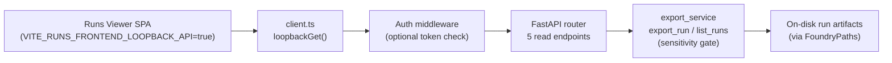

# Feature Brief & Metadata

**Feature Name:**

> Runs Viewer — Live Loopback API + Gated LAN Exposure

**Filepath Name:**

> `runs-loopback-api-v1`

**Date:**

> 2026-06-22

**Author:**

> Claude Sonnet 4.6 (prd-writer)

**Related Epic(s)/PRD ID(s):**

> - Parent: `docs/project_plans/PRDs/features/runs-frontend-v1.md`
> - OQ-6 / FR-11 (loopback API) — deferred from `runs-frontend-v1` Phase 5
> - OQ-4 (auth & LAN exposure) — deferred from `runs-frontend-v1` Phase 5

**Related Documents:**

> - `docs/project_plans/design-specs/runs-loopback-api.md` (OQ-6 design stub, promoted here)
> - `docs/project_plans/design-specs/runs-auth-lan.md` (OQ-4 design stub, promoted here)
> - `docs/dev/architecture/adr-runs-read-path.md` (v1 loopback-only invariant this feature supersedes)
> - `docs/dev/architecture/rf-run-export-schema.md` (frozen export schema — the API response contract)
> - `frontend/runs-viewer/src/api/client.ts` (dual-mode SPA client — the real 5-endpoint contract)
> - `src/research_foundry/services/export_service.py` (shared core: `export_run`, `list_runs`)
> - `.claude/worknotes/runs-loopback-api/decisions-block.md` (Opus decisions scaffold)

---

## 1. Executive summary

This feature adds an `rf serve` read-only HTTP API that serves the runs-viewer SPA's data directly from disk, applying the same sensitivity gate as the export service. It bundles two previously deferred design specs — OQ-6 (loopback API) and OQ-4 (auth & LAN exposure) — into one cohesive feature because the auth surface only matters if there is a live server to protect. The server binds to `127.0.0.1` by default with no auth (`auth_mode=none`); LAN exposure on `0.0.0.0` is a gated opt-in that requires a shared-secret token and **fails closed** if the token is absent.

**Priority:** MEDIUM

**Key outcomes:**

- Operators can browse live, in-flight runs from the SPA without re-running `rf run export --all`.
- The SPA's already-built dual-mode client activates loopback mode with a single env-var change.
- LAN access from other devices (e.g. browsing from a phone while `agentic-nuc` serves the API) is available with an explicit, authenticated opt-in — not a footgun.

---

## 2. Context & background

### Current state

The runs-viewer SPA (`frontend/runs-viewer/`) reads run data from pre-built static JSON files generated by `rf run export --json --all`. The ADR (`docs/dev/architecture/adr-runs-read-path.md`) records this as the sole v1 read path: deterministic, no always-on daemon, no auth surface. The SPA's fetch client (`frontend/runs-viewer/src/api/client.ts`) is already dual-mode: a `VITE_RUNS_FRONTEND_LOOPBACK_API` build flag switches it from static-file fetches to live HTTP calls. This flag seam was intentionally built in anticipation of this feature.

### Problem space

The static export cycle is adequate for a post-hoc audit workflow. It becomes friction when:
- A run just completed and the operator wants to browse its claims immediately without a manual `rf run export --all` + Vite rebuild.
- The run corpus grows large enough (100+ runs) that `--all` export time is disruptive.
- The operator's machine is `agentic-nuc` (10.42.10.76) and browsing happens from a laptop on the same LAN — the static-SPA `npx serve` approach requires SSH forwarding or a manual copy.

The OQ-6 design stub deferred shipping a live API until these JTBD were confirmed. Both have now been validated by the operator.

### Architectural context

- `export_service.py` provides `export_run(paths, run_id)` and `list_runs(paths)` — the sensitivity-gated, path-safe, deterministic core. The API must route through these functions; it must never re-implement serialization.
- `rf-run-export-schema.md` defines the frozen response shape (v1.2). No new schema design is required.
- The SPA dual-mode client defines the **exact 5 endpoints** the server must implement (see §6.1 FR-2).
- `agentic_meta_dev/infra/agentic-node/SERVICES.md` defines the existing port map; `8765` is MeatyWiki's API port and must not be reused.

---

## 3. Problem statement

> "As the RF operator, when a run completes, I need to browse its claims and source provenance in the viewer immediately — without re-running the static export + build cycle — and optionally from a device other than the machine running `rf`."

**Technical root cause:** The SPA has no live backend. The dual-mode client is wired but the server-side counterpart was deferred. The auth design (OQ-4) was also deferred, but designing LAN exposure without a live server would be premature.

---

## 4. Goals & success metrics

### Primary goals

**Goal 1: Live loopback API**
- `rf serve` starts a read-only FastAPI server on `127.0.0.1:7432` (default) serving the 5 endpoints the SPA's `client.ts` calls.
- Sensitivity gate parity with `export_service`: a run served by the API must be byte-equivalent to the same run's `run.json` for every field, including sensitivity-redacted fields.

**Goal 2: Gated LAN exposure**
- `bind_host=0.0.0.0` is a non-default opt-in that fails closed: the server refuses to bind unless `auth_mode=token` and a shared-secret token is configured.
- Valid token requests succeed; invalid or missing token requests receive `HTTP 401`.
- Optional IP allowlist provides an additional defense-in-depth layer.

**Goal 3: Thin footprint**
- FastAPI + uvicorn land as an optional `[serve]` extra in `pyproject.toml`; the core `rf` install is unchanged.
- A missing extra produces a clear "install rf[serve]" error on `rf serve`.

### Success metrics

| Metric | Target | Measurement method |
|--------|--------|--------------------|
| All 5 SPA endpoints return correct shape | 5/5 pass | TestClient endpoint contract tests |
| Sensitivity-gate parity | 100% field match vs `export_service` output | Dedicated parity test |
| Fail-closed bind | 0.0.0.0 without token → server refuses to start | Auth test `test_bind_failclosed` |
| Token auth correct | Valid token → 200; invalid → 401; no token → 401 | Auth unit tests |
| Core install footprint unchanged | `pip install research-foundry` imports succeed without fastapi/uvicorn | CI extra isolation test |

---

## 5. User personas & journeys

**Primary persona: Solo RF operator (`agentic-nuc` + laptop)**
- Runs RF research swarms on `agentic-nuc`; browses results in the viewer on a laptop.
- Current pain: must SSH in, re-run export, rebuild SPA, then either SSH-forward port or scp the built output to their laptop.
- With this feature: `rf serve --bind-host 0.0.0.0 --auth-mode token` on `agentic-nuc` (with a pre-configured token); browse `http://10.42.10.76:7432/` from the laptop.

**Secondary persona: Local-only operator**
- Uses `rf` on a single machine; wants to browse runs in real time.
- With this feature: `rf serve` (default, loopback-only, no auth); open the SPA against `http://127.0.0.1:7432/`.

### System flow



---

## 6. Requirements

### 6.1 Functional requirements

| ID | Requirement | Priority | Notes |
|:--:|-------------|:--------:|-------|
| FR-1 | `rf serve` Typer command with `--port` (default `7432`), `--bind-host` (default `127.0.0.1`), `--auth-mode` (`none`\|`token`), `--sensitivity-threshold` (default from config / `public`) | Must | Optional `[serve]` extra; clear error if missing |
| FR-2 | Implement the **5 endpoints** the SPA client calls, all `GET`, all read-only: `GET /api/runs`, `GET /api/runs/{run_id}`, `GET /api/runs/{run_id}/claims`, `GET /api/runs/{run_id}/sources/{source_card_id}`, `GET /data/governance.json` | Must | Shapes must match TS types in `client.ts` exactly |
| FR-3 | All data responses route through `export_service.export_run` / `list_runs`; no raw run artifact serialization in the API layer | Must | Sensitivity gate reuse invariant |
| FR-4 | `foundry.yaml → viewer.*` config keys: `bind_host`, `serve_port`, `auth_mode`, `auth_token_env`, `allowlist` | Must | `auth_token_env` names an env var; token never inline in config file |
| FR-5 | `VITE_RUNS_FRONTEND_LOOPBACK_API` / `VITE_RUNS_LOOPBACK_API_BASE` build-time flag semantics finalized and documented; default base URL updated from `8765` to `7432` | Must | FE env-config docs |
| FR-6 | Loopback-first auth posture: `auth_mode=none` when `bind_host=127.0.0.1`; `auth_mode=token` **required** when `bind_host=0.0.0.0`; fail-closed if token absent | Must | See §6.2 NFR-3 |
| FR-7 | Shared-secret token middleware: Bearer token in `Authorization` header; constant-time comparison; 401 on failure | Must | Auth-mode=token only |
| FR-8 | Optional IP allowlist (`foundry.yaml → viewer.allowlist`): when non-empty, requests from non-listed IPs receive `HTTP 403` | Should | Defense-in-depth layer |
| FR-9 | `GET /api/runs/{run_id}/claims` returns the claims array from the denormalized graph (same sensitivity filter as `export_run`) | Must | The SPA calls this endpoint in loopback mode |
| FR-10 | `GET /api/runs/{run_id}/sources/{source_card_id}` returns the first matching `RFResolvedSource` from the claim graph, or 404 | Must | The SPA calls this for drill-down provenance |
| FR-11 | `GET /data/governance.json` returns the governance config snapshot (matches `prebuild-static-data.mjs` output shape) | Must | FE governance chip wiring |
| FR-12 | `rf serve` co-exists with `rf run export --json`; both can run simultaneously without file lock or data inconsistency | Must | Per-request disk reads; no shared mutable state |
| FR-13 | `client.ts` `loopbackGet` sends an `Authorization: Bearer <token>` header when a token is configured via `VITE_RUNS_LOOPBACK_API_TOKEN` | Must | FE-side token propagation |

### 6.2 Non-functional requirements

| ID | Category | Requirement |
|:--:|----------|-------------|
| NFR-1 | Read-only invariant | Server exposes zero mutation endpoints. No POST, PUT, DELETE, PATCH at any path. |
| NFR-2 | Sensitivity-gate parity | A run response from the API must be field-equivalent to `export_service.export_run()` for the same sensitivity threshold. The API layer adds no redaction and removes none. |
| NFR-3 | Fail-closed binding | `bind_host=0.0.0.0` without `auth_mode=token` + a configured token must cause `rf serve` to exit non-zero with a clear error before binding. This is non-negotiable; a permissive fallback is a security regression. |
| NFR-4 | Constant-time token comparison | Token comparison must use `hmac.compare_digest` or equivalent to prevent timing attacks. |
| NFR-5 | Thin-core dep footprint | `fastapi`, `uvicorn`, `starlette` must be optional extras; `import research_foundry` without them must not fail. |
| NFR-6 | Per-request disk reads (v1 hot-reload) | v1 reads artifacts from disk on every request. No in-process cache. Ensures the viewer always reflects the current on-disk state without restart. |
| NFR-7 | Path-safe reads | All artifact reads use `FoundryPaths`/`RunPaths` derivation. Stored absolute paths from `run_index.yaml` or `verification.yaml` are never used for I/O (same invariant as `export_service`). |
| NFR-8 | Port deconfliction | Default port is `7432`. MeatyWiki's `8765` must never be the default. Port is configurable via `--port` and `foundry.yaml → viewer.serve_port`. |
| NFR-9 | CORS | CORS middleware allows the SPA's expected origin(s) in loopback mode; configurable for LAN deployment. |
| NFR-10 | 404 on unknown run | `GET /api/runs/{run_id}` for a non-existent run returns HTTP 404 with a structured error body; does not raise an unhandled exception. |

---

## 7. Scope

### In scope

- `rf serve` Typer command and FastAPI application factory
- The 5 endpoints the SPA's `client.ts` actually calls
- `foundry.yaml → viewer.*` config extension (`bind_host`, `serve_port`, `auth_mode`, `auth_token_env`, `allowlist`)
- Loopback-first auth posture + fail-closed bind gating
- Shared-secret token middleware + optional IP allowlist
- `client.ts` auth-header wiring (when token configured)
- FE env-config documentation (`VITE_RUNS_FRONTEND_LOOPBACK_API`, `VITE_RUNS_LOOPBACK_API_BASE`)
- `systemd --user` unit for `agentic-nuc` deployment
- ADR update, README/CLI docs, CHANGELOG `[Unreleased]`
- Design-spec promotion: both `runs-loopback-api.md` and `runs-auth-lan.md` to `maturity: promoted`

### Out of scope

- mTLS auth mode (deferred; see §8)
- SSH-tunnel auth mode (deferred; see §8)
- Filesystem-watch hot-reload cache (deferred; see §8)
- Any mutation endpoints (structurally prohibited by NFR-1)
- OpenAPI spec publication / developer-facing Swagger UI
- WebSocket or SSE streaming
- Multi-user session management or per-user sensitivity thresholds

---

## 8. Deferred items

| Item | Origin | Rationale | Disposition |
|------|--------|-----------|-------------|
| mTLS auth mode | OQ-4 / `runs-auth-lan.md` | Requires certificate provisioning infrastructure not present on agentic-nuc; disproportionate to the operator threat model. | Deferred to v2; annotate in `runs-auth-lan.md` |
| SSH-tunnel auth mode | OQ-4 / `runs-auth-lan.md` | Token-over-HTTPS covers the threat adequately; SSH-tunnel plumbing in the server is out of scope for v1. | Deferred to v2; annotate in `runs-auth-lan.md` |
| Filesystem-watch hot-reload cache | OQ-3 / `runs-loopback-api.md` | Per-request reads are correct and simple at operator scale; inotify/watchdog dep + invalidation bugs are not worth it for v1. | Deferred to v2; note in `runs-loopback-api.md` |

---

## 9. Dependencies & assumptions

### External dependencies

| Dependency | Version constraint | Scope |
|---|---|---|
| `fastapi` | `>=0.111` | `[serve]` extra only |
| `uvicorn[standard]` | `>=0.29` | `[serve]` extra only |
| `starlette` | (fastapi transitive) | `[serve]` extra only |

### Internal dependencies

| Dependency | Status | Notes |
|---|---|---|
| `export_service.export_run` + `list_runs` | Shipped (runs-frontend-v1 P1) | The API wraps these; never re-implements them |
| `frontend/runs-viewer/src/api/client.ts` dual-mode seam | Shipped (runs-frontend-v1 P2) | `VITE_RUNS_FRONTEND_LOOPBACK_API` flag already wired |
| `rf-run-export-schema.md` v1.2 | Frozen | API response contract; no new shape design |
| `foundry.yaml → viewer.*` config dict | Exists (partial) | P3 extends with new keys |

### Assumptions

- Port `7432` is not claimed in `agentic_meta_dev/infra/agentic-node/SERVICES.md`; if it is, the implementation-planner selects an alternate.
- The operator's `foundry.yaml` is not committed to a public repository (the token env-var approach mitigates inline exposure).
- `agentic-nuc` (10.42.10.76) is the primary LAN deployment target.
- v1 traffic is low-volume (single operator, interactive browsing); per-request disk reads are not a performance bottleneck.

### Feature flags

| Flag | Type | Purpose |
|------|------|---------|
| `VITE_RUNS_FRONTEND_LOOPBACK_API` | Build-time (boolean string) | Enables loopback mode in the SPA |
| `VITE_RUNS_LOOPBACK_API_BASE` | Build-time (URL string) | Overrides API base URL; default `http://127.0.0.1:7432/api` |
| `VITE_RUNS_LOOPBACK_API_TOKEN` | Build-time (string) | Bearer token injected into `loopbackGet` when set |

---

## 10. Risks & mitigations

| Risk | Impact | Likelihood | Mitigation |
|------|:------:|:----------:|------------|
| Sensitivity-gate bypass via raw serialization | High | Low | FR-3 + NFR-2: ALL responses route through `export_service`. Dedicated parity test in P6. |
| LAN exposure without auth (`0.0.0.0` misconfiguration) | High | Low | NFR-3: fail-closed bind — server refuses to start if `0.0.0.0` set without token. |
| Endpoint-shape drift from the SPA client | Medium | Low | P2 contract derived from `client.ts` line-by-line (5 endpoints, not the 2 the original spec names). Runtime smoke in P5. |
| Port collision with MeatyWiki (8765) | Low–Medium | Low | NFR-8: default port `7432`. Configurable. Document in CLI help and README. |
| Dep footprint growth (fastapi + uvicorn) | Low | Low | NFR-5: optional `[serve]` extra; CI isolation test verifies core import is unaffected. |

### Threat model — LAN exposure

Applies only when `bind_host=0.0.0.0` is explicitly configured:

| Threat | Severity | Countermeasure |
|--------|:--------:|----------------|
| Unauthenticated LAN user reads governed run data | High | Fail-closed bind (NFR-3); `auth_mode=token` required for 0.0.0.0 |
| Token timing attack | Medium | Constant-time comparison `hmac.compare_digest` (NFR-4) |
| Unauthorized LAN IP bypasses token | Low | Optional IP allowlist (FR-8) |
| Token exposed inline in `foundry.yaml` | High | Token lives in env var named by `auth_token_env`; never inline in config |
| Operator sets `auth_mode=none` on 0.0.0.0 | High | Fail-closed: startup error, not a silent degradation |

**Residual risk:** An operator who uses a weak token or places `agentic-nuc` on an untrusted network bears responsibility for those decisions. The design's default posture (loopback-only, no auth) is the safe path.

---

## 11. Target state (post-implementation)

**Operator experience:**

1. `rf serve` (loopback, no auth, default port `7432`): SPA built with `VITE_RUNS_FRONTEND_LOOPBACK_API=true` browses live runs at `http://127.0.0.1:7432/`.
2. `rf serve --bind-host 0.0.0.0 --auth-mode token` with `RF_SERVE_TOKEN` set: SPA accessible at `http://10.42.10.76:7432/` from a laptop with the same token in `VITE_RUNS_LOOPBACK_API_TOKEN`.
3. `rf run export --json` still works alongside the live server (no conflict; both are read-only, per-request).

**Technical architecture:**

```
rf serve
  └── FastAPI app (uvicorn, bind: 127.0.0.1:7432)
        ├── CORS middleware
        ├── Optional token auth middleware
        ├── Optional IP allowlist middleware
        ├── GET /api/runs → export_service.list_runs()
        ├── GET /api/runs/{id} → export_service.export_run()
        ├── GET /api/runs/{id}/claims → export_run()["claims"]
        ├── GET /api/runs/{id}/sources/{src_id} → claim graph scan
        └── GET /data/governance.json → FoundryConfig governance snapshot
```

**Observable outcomes:**

- `rf serve` is a first-class CLI command in `--help` and the README.
- `adr-runs-read-path.md` records the dual-mode read path (static export + loopback API).
- Both design specs promoted: `maturity: promoted`, `prd_ref` pointing here.
- `CHANGELOG.md [Unreleased]` includes entries for `rf serve`, loopback API mode, gated LAN exposure.

---

## 12. Acceptance criteria

### AC-1: `rf serve` command

| Criterion | Test target |
|-----------|-------------|
| `rf serve` starts without error; server accessible at `127.0.0.1:7432` | `CliRunner` integration test |
| `rf serve --port 9000` overrides port | Unit test |
| `rf serve` with `[serve]` extra missing raises clear "install rf[serve]" error | Extra isolation CI test |
| `rf serve --bind-host 0.0.0.0 --auth-mode none` exits non-zero before binding | Auth fail-closed test |

### AC-2: Five-endpoint contract parity

For each endpoint, the response shape must match the corresponding TypeScript type in `client.ts`:

| Endpoint | SPA function (client.ts) | TS return type | AC |
|----------|--------------------------|----------------|----|
| `GET /api/runs` | `fetchRunList()` | `RFRunSummary[]` | TestClient + sensitivity fixture |
| `GET /api/runs/{run_id}` | `fetchRunDetail()` | `RFRunExport` | TestClient + real-run fixture |
| `GET /api/runs/{run_id}/claims` | `fetchClaimLedger()` | `RFRunExport["claims"]` | TestClient |
| `GET /api/runs/{run_id}/sources/{source_card_id}` | `fetchSourceCard()` | `RFResolvedSource \| null` | TestClient; 404 on missing |
| `GET /data/governance.json` | `fetchGovernanceConfig()` | `GovernanceConfig` | TestClient |

### AC-3: Sensitivity-gate parity

- `GET /api/runs/{run_id}` response must be field-equivalent to `export_service.export_run(paths, run_id)` for the same threshold.
- A claim with `sensitivity: work_sensitive` and threshold `public` must have `quote` and `summary` set to `"[redacted:sensitivity]"` in the API response.

### AC-4: Fail-closed bind gating

- `rf serve --bind-host 0.0.0.0 --auth-mode none` → exits non-zero before binding.
- `rf serve --bind-host 0.0.0.0 --auth-mode token` without token env var set → exits non-zero.
- `rf serve --bind-host 0.0.0.0 --auth-mode token` with token set → binds successfully.

### AC-5: Token authentication

- Valid `Authorization: Bearer <token>` header → HTTP 200.
- Missing header (when `auth_mode=token`) → HTTP 401.
- Invalid token → HTTP 401.
- Token comparison uses `hmac.compare_digest` (verified by code review in P6).

### AC-6: IP allowlist (should-have)

- Non-empty `viewer.allowlist` → requests from unlisted IPs receive HTTP 403.
- Empty or absent allowlist → no IP filtering.

### AC-7: FE integration smoke

- SPA built with `VITE_RUNS_FRONTEND_LOOPBACK_API=true` and `VITE_RUNS_LOOPBACK_API_BASE=http://127.0.0.1:7432/api` loads run list from the live API.
- All 5 endpoint call paths verified via Playwright smoke or equivalent.

### AC-8: Core footprint isolation

- `pip install research-foundry` (no `[serve]` extra) succeeds; `import research_foundry` does not import `fastapi` or `uvicorn`.
- `rf serve` without the extra prints: `fastapi and uvicorn are required. Install with: pip install "research-foundry[serve]"`.

### AC-9: ADR update + design-spec promotion

- `docs/dev/architecture/adr-runs-read-path.md` updated to record the dual-mode read path.
- `docs/project_plans/design-specs/runs-loopback-api.md` → `maturity: promoted`, `prd_ref: docs/project_plans/PRDs/features/runs-loopback-api-v1.md`.
- `docs/project_plans/design-specs/runs-auth-lan.md` → `maturity: promoted`, `prd_ref: docs/project_plans/PRDs/features/runs-loopback-api-v1.md`.
- Deferred auth modes (mTLS, SSH-tunnel) annotated in `runs-auth-lan.md`.

### AC-10: CHANGELOG

- `CHANGELOG.md [Unreleased]` contains entries for: `rf serve` command (Added), loopback API mode (Added), gated LAN exposure with token auth (Added).

---

## 13. Assumptions & open questions

### Assumptions (validated by decisions block)

- Server stack = FastAPI + uvicorn, `[serve]` optional extra. No re-litigation.
- Auth posture = loopback-first, token-gated LAN, fail-closed. No re-litigation.
- Port `7432` deconflicts from MeatyWiki's `8765`; implementation-planner confirms vs `agentic-node/SERVICES.md`.

### Open questions (for implementation-planner)

| ID | Question | Recommended answer |
|----|----------|-------------------|
| OQ-C | Default env-var name for the shared-secret token | `RF_SERVE_TOKEN` |
| OQ-D | `GET /data/governance.json` source — `FoundryConfig.governance` or generated file? | Inspect `prebuild-static-data.mjs` + `fetchGovernanceConfig()` to confirm; replicate parity with static mode |
| OQ-E | CORS allowed origins for LAN deployment | Default: `*` in loopback; configurable via `viewer.cors_origins` for LAN |

---

## 14. Appendices & references

### Related documentation

- **ADR**: `docs/dev/architecture/adr-runs-read-path.md` — v1 loopback-only invariant (updated in P7)
- **Export schema**: `docs/dev/architecture/rf-run-export-schema.md` — frozen response contract v1.2
- **Design specs (promoted by this PRD)**:
  - `docs/project_plans/design-specs/runs-loopback-api.md` (OQ-6)
  - `docs/project_plans/design-specs/runs-auth-lan.md` (OQ-4)
- **Decisions block**: `.claude/worknotes/runs-loopback-api/decisions-block.md`
- **Parent PRD**: `docs/project_plans/PRDs/features/runs-frontend-v1.md`

### Key implementation files (for implementation-planner)

| File | Role |
|------|------|
| `src/research_foundry/services/export_service.py` | Shared core — wrap, do not duplicate |
| `src/research_foundry/cli_commands.py` | Pattern for new Typer command |
| `src/research_foundry/config.py` | `FoundryConfig.viewer` — extend with new keys |
| `frontend/runs-viewer/src/api/client.ts` | Dual-mode seam + 5-endpoint contract |
| `pyproject.toml` | Add `[serve]` optional extra |
| `tests/test_cli_governance.py` | Reference pattern for CLI + TestClient tests |

---

## Implementation phases (summary)

> Full breakdown in the Implementation Plan (`docs/project_plans/implementation_plans/features/runs-loopback-api-v1.md` — to be authored). Phases correspond to the decisions block.

| Phase | Name | Scope | Est. points |
|-------|------|-------|:-----------:|
| P1 | API foundation | `rf serve` command, FastAPI app factory, CORS, `[serve]` extra | 2 |
| P2 | Read endpoints | 5 endpoints via `export_service`; 404/error handling | 3 |
| P3 | Config & flag wiring | `viewer.*` config keys; port deconfliction; FE flag docs | 1.5 |
| P4 | Auth & LAN (gated) | Fail-closed bind; token middleware; IP allowlist; threat model | 2.5 |
| P5 | FE integration | `client.ts` auth-header wiring; env-config docs; smoke | 1 |
| P6 | Tests | Endpoint contract, sensitivity parity, auth, fail-closed, CLI | 2 |
| P7 | Deploy & docs | `systemd` unit; ADR + README + CHANGELOG; spec promotion | 1 |
| **Total** | | | **13** |

---

**Progress tracking:** `.claude/progress/runs-loopback-api/` (created when implementation begins)
