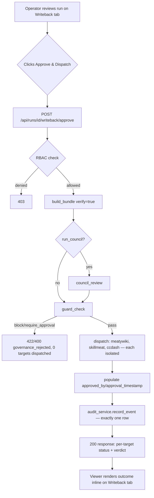

# Feature Brief & Metadata

**Feature Name:**

> Runs Writeback — Approve & Dispatch (v1)

**Filepath Name:**

> `runs-writeback-approve-dispatch-v1`

**Date:**

> 2026-07-18

**Author:**

> prd-writer (Claude Sonnet 5), orchestrated by Opus 4.8

**Related Epic(s)/PRD ID(s):**

> Follow-on to FR-13 (Writeback-Review Governance View, commit `45a03fc`). Deferred from `runs-frontend-v1` (parent PRD).

**Related Documents:**

> - `docs/project_plans/feature_contracts/features/runs-writeback-review-view.md` — FR-13 contract this builds on (read-only foundation, Completion Report included)
> - `docs/project_plans/design-specs/runs-writeback-preview.md` — original idea-stage spec (explicitly deferred the write path FR-13 now completes the read half of)
> - `docs/project_plans/PRDs/features/runs-frontend-v1.md` — parent PRD FR-13 was deferred from
> - `docs/dev/architecture/rf-run-export-schema.md` / `rf-run-export-schema.json` — export schema reference (schema 1.6)

---

## 1. Executive Summary

FR-13 upgraded the runs-viewer Writeback tab from a status stub into a **read-only** governance
review surface: an operator can see each writeback candidate's rendered content plus the full
governance verdict (`approved_for_writeback`, `reviewer_notes`, `required_fix`) without leaving the
viewer. But the operator still has to shell out to the CLI (`rf bundle` → `rf council` →
`rf writeback`) to actually act on that review. This feature adds the write path: a new governed API
endpoint that orchestrates the existing bundle/council/dispatch service chain behind a single
"Approve & Dispatch" action in the viewer, with a mandatory governance gate, RBAC-ready
authorization, and a full audit trail — so the end-to-end approve-and-publish action, not just the
preview, lives in the viewer.

**Priority:** HIGH

**Key Outcomes:**
- Outcome 1: An operator reviewing a run's writeback candidates can approve-and-dispatch them to
  MeatyWiki/SkillMeat/CCDash in one click, without a terminal.
- Outcome 2: Every approve+dispatch action runs through the deterministic governance gate
  (`guard_check`) — a check that today is **not** wired into the dispatch path at all (see §2) — and
  produces exactly one audit record, closing a real governance gap the CLI path currently has.
- Outcome 3: The endpoint is RBAC-ready from day one (calls `require_role`/`auth.rbac_enforcement`
  the same way `POST /agent-jobs` already does), so turning on multi-tenant OIDC later requires zero
  changes to this endpoint.

---

## 2. Context & Background

### Current State

**What FR-13 shipped (foundation for this feature, do not re-plan):** `run.json` export schema 1.6
carries `writebacks.{approved_for_writeback, reviewer_notes, required_fix, previews[]}`, all
computed server-side and rendered read-only in `RunDetailWorkspace.tsx`'s Writeback tab. No mutation
path exists in the SPA today (verified by FR-13's own read-only-invariant tests).

**What the CLI actually does today (code-truth correction to this feature's initial framing):**
There is **no `rf bundle --approve` flag** in this codebase. `rf bundle` has one option,
`--verify/--no-verify` (`cli_commands.py:489`). The real chain an operator runs today is:

1. `rf bundle <run>` → `services.writeback.build_bundle(run_id, verify=True)` — runs claim-ledger
   verification, writes `evidence_bundle.yaml` with `governance.approved_for_writeback = verified`
   (a **derived boolean**, not a manual decision) and `governance.{approved_by, approval_timestamp}`
   **always `None`** — these two fields are declared but never populated by any code path today.
2. `rf council <run>` → `services.writeback.council_review(...)` — a deterministic review producing
   `decision: approve|revise|required_block` plus `concerns[]` (each with `required_fix`), written to
   `reviews/council_review.yaml`. This is the actual source of the `reviewer_notes`/`required_fix`
   fields FR-13 exports (confirmed empirically in the FR-13 Completion Report — **not**
   `evidence_bundle.governance`, which does not declare these fields).
3. `rf writeback <run> --targets meatywiki,skillmeat,ccdash` → `services.writeback.writeback(...)` —
   renders one local file per target under `runs/<run>/writebacks/` **and mirrors each into a local
   workspace directory** (e.g. `meatywiki/sources/<slug>.md`, `skillmeat/skillboms/<id>.md`,
   `ccdash/events/<id>.yaml`) that those separate systems ingest out-of-band. **This is not a live
   HTTP push to a remote MeatyWiki/SkillMeat/CCDash API for these three targets** — unlike the
   `intenttree`/`arc`/`notebooklm` opt-in targets, which do perform live pushes
   (`_render_notebooklm_update` calls a live NotebookLM API; `intenttree` patches a live node).
   Candidate/event IDs are derived deterministically from the run's title/intent
   (`meatywiki_writeback_id`, `skillbom_candidate_id`, `ccdash_event_id`), so re-running `writeback()`
   for the same run **overwrites**, it does not duplicate — a useful, already-existing idempotency
   property this feature reuses rather than reinvents.
4. `writeback()` already wraps its full target loop in a single `try/except RFError` and writes one
   `audit_service.record_event(mutation_type="writeback", ...)` row per invocation (success or
   RFError-failure) — **but a non-`RFError` exception mid-loop (e.g., disk I/O failure rendering one
   target) propagates uncaught and produces no audit row**, and the loop has **no per-target
   isolation**: one target's exception aborts every target after it in the fixed
   ccdash→meatywiki→skillmeat→intenttree→arc→notebooklm order.
5. `governance.guard_check()` — the deterministic policy gate (block/require_approval/warn against
   6 rules: secret scanning, key-profile/provider mismatch, personal/work mixing, unmapped material
   claims, etc.) — is **never called** from `bundle()`, `council_review()`, or `writeback()` today.
   Its only real call sites are the standalone `rf guard` CLI command and (the one existing HTTP
   precedent) `POST /agent-jobs` in `agent_jobs.py`, which calls it **before** spawning any subprocess
   and maps a failed guard to a 422 (`block`) or 400 (`require_approval`) `governance_rejected`
   error body.

**The RF API server today:** `rf serve` (FastAPI, `api/app.py`) exposes `/api/runs` (GET list,
GET detail, GET claims, GET context) and one existing mutation, `POST /api/runs` (scaffold + register
a run; `api/routers/runs.py`). That route establishes the mutation-route pattern this feature
follows exactly: `Depends(require_role("owner", "admin"))` gate, `audit_service.record_event(...)`
after the mutation commits, and a `governance_rejected` error body shape for policy failures. Bearer
auth is owner-token (single operator) via `local_static.py`; `auth.rbac_enforcement` (`config.py`,
values `auto`/`disabled`/`enabled`) resolves once at app-create time into `app.state.rbac_enforced`,
which every `require_role` check reads. **`rf writeback` is explicitly classified in
`api/auth/rbac.py`'s own docstring as a "single-operator-trust," CLI-only mutation surface not
reachable via any gated HTTP route** — this feature is precisely what moves it into HTTP-reachable,
RBAC-gated territory, so the RBAC classification comment in `rbac.py` must be updated alongside the
new route.

**runs-viewer today:** `frontend/runs-viewer/src/api/client.ts` is GET-only — no typed POST bindings
exist yet for any mutation. `RF_UI_LOOPBACK` build mode bakes a bearer token into the LAN bundle and
resolves auth headers via `buildAuthHeaders()`.

### Problem Space

The operator's actual workflow gap is not "I can't see the writeback candidates" (FR-13 solved that)
— it's "I can't act on what I see without leaving the tool and running three CLI commands in the
right order, with no governance check between review and dispatch." Every approve+dispatch today is
effectively unaudited from a per-user-attribution standpoint (no route populates `actor_user_id`
anywhere in this codebase yet — confirmed by inspecting `POST /agent-jobs`'s own audit call, which
resolves `request.state.identity` but never threads it into the `AuditEvent`) and ungoverned by the
policy gate that exists specifically to catch secret leakage, key-profile mismatches, and unmapped
material claims before a run's content lands in a shared MeatyWiki/SkillMeat/CCDash workspace mirror.

### Current Alternatives / Workarounds

Operator opens a terminal, runs `rf bundle <run>`, `rf council <run> --roles ...`, then
`rf writeback <run> --targets meatywiki,skillmeat,ccdash`, reads console output to confirm each
target rendered, and separately checks `runs/<run>/writebacks/*` by hand if something looks off. No
governance check runs in this sequence at all today.

### Architectural Context

Layered pattern this feature follows: **API router** (thin — auth/RBAC dependency, request/response
DTOs, error mapping) → **new orchestration function** in the service layer (composes
`build_bundle`/`council_review`/`guard_check`/`writeback`, adds per-target isolation) → **existing
service functions** (unchanged) → **audit_service** (existing `writeback` mutation type, reused) →
**runs-viewer API client + Writeback tab** (new POST binding + action UI).

---

## 3. Problem Statement

**User Story Format:**
> "As the RF operator reviewing a run's writeback candidates in the viewer, when I decide a run is
> ready to publish, I have to drop into a terminal and run three ordered CLI commands with no
> governance check between them, instead of clicking one governed action in the tool I'm already
> using and trusting that the action itself enforces the same policy gate the CLI silently skips
> today."

**Technical Root Cause:**
- No HTTP mutation route exists for the bundle→council→writeback chain (`api/routers/runs.py` is
  GET + one unrelated POST).
- `guard_check()` is not wired into `writeback()`, `build_bundle()`, or `council_review()` — the gate
  exists but nothing calls it on this path.
- No route in the codebase yet threads `request.state.identity` into `AuditEvent.actor_user_id`.
- `writeback()`'s per-target loop has no failure isolation and no audit row on non-`RFError`
  exceptions.

---

## 4. Goals & Success Metrics

### Primary Goals

**Goal 1: One governed action replaces three ungoverned CLI commands**
- The new endpoint orchestrates bundle → (optional) council → guard gate → dispatch as a single
  server-side transaction-like sequence.
- Success: an operator can go from "reviewing a run" to "dispatched to all 3 default targets" in one
  API call / one UI click.

**Goal 2: Close the governance gap, not just relocate it**
- `guard_check()` runs before any target dispatch, every time, with no bypass path.
- Success: a run with a blocking violation (e.g., an unapproved key profile) cannot dispatch via this
  endpoint even though it could via the raw CLI today (this is an intentional behavior tightening —
  see Risk R7).

**Goal 3: RBAC-ready and fully audited from v1**
- The route is gated the same way `POST /agent-jobs` is gated; every invocation writes one audit row
  with as much attribution as the current identity model supports.
- Success: flipping `auth.rbac_enforcement` to `enabled` with an OIDC identity wired in requires zero
  code changes to this endpoint.

### Success Metrics

| Metric | Baseline | Target | Measurement Method |
|--------|----------|--------|-------------------|
| CLI commands needed to approve+dispatch a run from the viewer | 3 (terminal) | 1 (API call / UI click) | Manual walkthrough |
| Governance-gate coverage on the dispatch path | 0% (not wired) | 100% (every invocation) | Test: attempt dispatch with a deliberately blocking `GuardContext`, assert 422 + zero files written |
| Audit rows per approve+dispatch invocation | n/a (route doesn't exist) | Exactly 1, every outcome | Test: success, partial, and blocked paths each assert exactly one `audit_event` row |

---

## 5. User Personas & Journeys

### Personas

**Primary Persona: RF Operator (single-tenant today, per-workspace-user tomorrow)**
- Role: Runs and reviews research swarms; today the sole "owner" identity on the LAN deployment.
- Needs: Approve a reviewed run and get it published to MeatyWiki/SkillMeat/CCDash without leaving
  the viewer; trust that the action won't silently skip the governance check the CLI already skips.
- Pain Points: Terminal context-switch; no visibility into per-target dispatch outcome without
  reading raw file paths.

**Secondary Persona: Future multi-tenant reviewer (post-OIDC)**
- Role: A `reviewer` or `researcher`-scoped user in a shared workspace, once OIDC lands.
- Needs: The approve+dispatch action must already be gated by role today (even though only
  owner/admin exist in practice now) so their access is correctly restricted the moment OIDC ships.
- Pain Points: N/A today — this persona validates the RBAC-ready design decision, not a current user.

### High-level Flow

---

## 6. Requirements

### 6.1 Functional Requirements

| ID | Requirement | Priority | Notes |
| :-: | ----------- | :------: | ----- |
| FR-1 | New endpoint `POST /api/runs/{run_id}/writeback/approve` orchestrates `build_bundle(verify=True)` → optional `council_review()` → `guard_check()` → dispatch, as one server-side action. | Must | New orchestration function; does not modify `writeback()`'s CLI-facing signature. |
| FR-2 | Server-side authority invariant: the viewer never sets `approved_for_writeback`/`reviewer_notes`/`required_fix`/`approved_by` directly. The endpoint is the sole trigger; all fields remain derived from verification/council/guard outcomes, never accepted as raw request input. | Must | Extends FR-13's read-only invariant — the client PROPOSES an approve+dispatch intent, the server computes and ENFORCES the verdict. |
| FR-3 | `guard_check()` MUST run before any target dispatch. A `block` (exit 3) or `require_approval` (exit 7) result aborts before any target is attempted and returns the `governance_rejected` error body (same shape as `POST /agent-jobs`). | Must | Closes the gap: today's `writeback()` never calls this. |
| FR-4 | The route is gated by `Depends(require_role("owner", "admin"))`, honoring `auth.rbac_enforcement` (`auto`/`disabled`/`enabled`) exactly as `POST /api/runs` and `POST /agent-jobs` already do. | Must | No new RBAC mechanism — reuse `require_role`. |
| FR-5 | Every invocation writes exactly one `audit_service.record_event(mutation_type="writeback", ...)` row, regardless of outcome (success, partial, blocked, or unexpected failure), including outcomes not currently audited (non-`RFError` exceptions). | Must | Existing `writeback()` audits success/`RFError`-failure only; this endpoint's orchestration wraps ALL exception paths. |
| FR-6 | The audit row's `actor_user_id` is populated from `request.state.identity.user_id` when an identity is resolved (loopback/no-auth mode: remains `None`, which is expected and not a defect). | Must | First route in the codebase to actually thread identity into `AuditEvent` — every existing route (`POST /api/runs`, `POST /agent-jobs`) reads identity but never uses it. |
| FR-7 | Dispatch targets default to `meatywiki`, `skillmeat`, `ccdash`; each is attempted independently — one target's exception does not prevent the others from being attempted. | Must | New per-target isolation; `writeback()`'s existing loop has none. |
| FR-8 | Response reports per-target outcome (`success`/`failed`/`skipped`) plus overall `bundle_id`, `verified`, `council_decision`, `reviewer_notes`, `required_fix`, `guard` result, and `overall_status` (`success`/`partial`/`blocked`). | Must | See §7 API contract. |
| FR-9 | The endpoint is safe to re-invoke for the same run: re-dispatch reuses the existing deterministic target IDs (overwrite, not duplicate) and re-populates `approved_by`/`approval_timestamp` to the latest invocation's identity/time. | Must | Reuses existing ID-determinism; no new dedupe-key infrastructure needed. |
| FR-10 | `evidence_bundle.governance.approved_by` and `approval_timestamp` (declared, always `None` today) are populated by this endpoint from the resolved identity and `now_iso()`. | Should | First code path to populate these two long-dormant fields. |
| FR-11 | runs-viewer Writeback tab gains an "Approve & Dispatch" action (button + confirmation dialog), visible only when the run has a report and is not currently mid-dispatch. | Must | Builds on FR-13's tab; does not touch the read-only preview cards. |
| FR-12 | Frontend renders per-target dispatch outcome inline and distinguishes a `governance_rejected` block/require-approval error from a generic 500/network failure. | Must | Reviewer notes/required_fix already render read-only per FR-13 — this adds the action + its result, not new preview surfaces. |
| FR-13 | `rf bundle`, `rf council`, and `rf writeback` CLI commands and their existing behavior are unchanged. | Must | This feature is additive; the new orchestration function calls the same service functions the CLI calls, it does not alter them. |
| FR-14 | A second concurrent approve+dispatch call for the same `run_id` while one is in-flight does not corrupt partial state (either serialized via a simple advisory lock, or accepted as last-write-wins given the underlying renders are overwrite-idempotent). | Should | See OQ-2; decide in implementation planning, not this PRD. |

### 6.2 Non-Functional Requirements

**Performance:**
- Dispatch across 3 local-file targets should complete well under the existing `rf writeback` CLI's
  typical latency (sub-second to a few seconds); no new performance budget beyond "not perceptibly
  slower than the CLI equivalent."

**Security:**
- RBAC gate (`require_role("owner", "admin")`) on the mutation route, matching the existing
  `POST /agent-jobs` / `POST /api/runs` precedent exactly.
- Governance gate (`guard_check()`) runs before any dispatch — secret-pattern scanning, key-profile
  mismatch, and unmapped-material-claim rules all apply.
- No new secrets or credentials introduced; reuses the existing owner-token bearer model.

**Reliability:**
- Per-target isolation (FR-7): a failure in one target must not silently abort or corrupt the others.
- Audit-every-invocation (FR-5): no outcome is unaudited, including exception paths `writeback()`
  today leaves uncaught.

**Observability:**
- OpenTelemetry spans per the `POST /agent-jobs` precedent (guard-check span + dispatch span).
- Structured audit rows queryable via the existing `GET /api/audit` (already RBAC-gated to
  owner/admin, already supports `mutation_type=writeback` filtering).

---

## 7. Scope

### In Scope

- New backend orchestration function (e.g. `services/writeback.py::approve_and_dispatch()` or a
  thin sibling module) composing `build_bundle`, optional `council_review`, `guard_check`, and
  per-target-isolated dispatch.
- New route `POST /api/runs/{run_id}/writeback/approve` in `api/routers/runs.py` (or a new
  `writeback.py` router, following `agent_jobs.py`'s file-per-concern pattern if the file would
  otherwise grow past the existing `runs.py`'s established scope).
- RBAC gating via existing `require_role`; no new roles/permissions invented.
- Audit wiring via existing `audit_service.record_event` and the already-reserved `writeback`
  mutation type; first-ever `actor_user_id` population from resolved identity.
- Population of `evidence_bundle.governance.approved_by`/`approval_timestamp`.
- runs-viewer: "Approve & Dispatch" button + confirmation dialog + per-target result rendering on
  the existing Writeback tab (`RunDetailWorkspace.tsx`); new typed POST binding in `api/client.ts`.
- Updating `api/auth/rbac.py`'s classification comment (currently states `rf writeback` has no
  gated HTTP path — no longer true after this feature).
- Backend + frontend tests covering governance-block, RBAC-off/on, partial-target-failure,
  idempotent re-invocation, and audit-row-per-outcome.
- CHANGELOG entry (`changelog_required: true`).

### Out of Scope

- The pending OIDC adapter itself — this feature must not block on it (Decision #2); RBAC enforcement
  stays in the current single-operator/owner-token model until OIDC ships separately.
- Any live HTTP push to a real remote MeatyWiki/SkillMeat/CCDash API for the 3 default targets — as
  of today's code truth, these targets are local-file renders + local workspace mirrors, and this
  feature does not add new live-network integrations for them (unlike `notebooklm`/`intenttree`,
  which already do live pushes and remain CLI-only, untouched).
- Dispatching the three lower-priority opt-in targets (`intenttree`, `arc`, `notebooklm`) from the
  UI — remains CLI-only; may be a follow-on once this pattern is proven.
- Editing `reviewer_notes`/`required_fix`/council decisions from the UI — those remain
  `rf council`-only; this feature triggers the existing deterministic council, it does not add a
  manual override UI.
- Rollback/undo of a completed dispatch — out of scope; see Risk R5 for the accepted mitigation
  (idempotent re-render, no automated rollback).
- Fine-grained per-workspace multi-tenant scoping of runs (WKSP-304 territory) — this feature's RBAC
  gate is role-based only, not workspace-row-scoped, consistent with `POST /agent-jobs`'s current
  state.
- Changing `council_review()`'s deterministic voting logic or `guard_check()`'s policy rules.
- A hard concurrency lock mechanism beyond a simple advisory guard (FR-14 is a Should, not a Must;
  full distributed-lock infrastructure is explicitly not being built here).

### Feature Flags

- None required — the new route is additive and inert until called; no existing behavior changes
  unless this endpoint is invoked.

---

## 8. Dependencies & Assumptions

### Internal Dependencies

- **FR-13 (Writeback-Review Governance View)**: shipped, `status: completed`. This feature is its
  direct write-path follow-on and reuses its export schema (1.6) and Writeback tab as the mounting
  point for the new action.
- **`services/writeback.py` (`build_bundle`, `council_review`, `writeback`)**: unchanged, reused.
- **`services/governance.py` (`guard_check`, `GuardContext`, `load_run_context`)**: reused; not
  modified. `load_run_context(run_id, writeback_targets=..., ...)` already builds a `GuardContext`
  from a run — the new endpoint should use this helper rather than hand-building context fields.
- **`services/audit_service.py`**: `writeback` mutation type already reserved; reused as-is.
- **`api/auth/rbac.py` (`require_role`)**: reused as-is; only its classification-comment for
  `rf writeback` needs updating (documentation, not logic).
- **`POST /agent-jobs`** (`api/routers/agent_jobs.py`): the direct architectural precedent for
  guard-gated, RBAC-gated, audited mutation routes in this codebase — follow its error-mapping and
  audit-call patterns exactly rather than inventing new conventions.

### Assumptions

- The 3 default targets (meatywiki, skillmeat, ccdash) remain local-file + workspace-mirror renders,
  not live external API calls, for the duration of this feature (see §2). If a future feature adds a
  live push for any of these, this endpoint's per-target isolation and error-envelope design should
  still hold, but retry/idempotency semantics would need re-evaluation at that time.
- `auth.rbac_enforcement` resolution (`config.py::resolve_rbac_enforced`) and the `local_static`
  owner-token provider continue to work exactly as they do for existing routes; no changes to the
  auth provider layer are needed for this feature.
- A run must already have a report and pass (or fail-but-still-render) verification before
  approve+dispatch is meaningful — the endpoint does not gate on report existence beyond what
  `build_bundle`/`writeback` already assume (both raise `NotFoundError` if the run doesn't exist).

---

## 9. Risks & Mitigations

| ID | Risk | Impact | Likelihood | Mitigation |
| -- | ---- | :----: | :--------: | ---------- |
| R1 | Double-dispatch / duplicate external artifacts on repeat clicks. | Med | Med | Existing deterministic candidate IDs (`meatywiki_writeback_id`, `skillbom_candidate_id`, `ccdash_event_id`) already make re-render an overwrite, not a duplicate — reuse this rather than build new dedupe infra (FR-9). Document explicitly that this guarantee is local-file-specific and would need re-verification if a target ever becomes a live push (see Assumptions). |
| R2 | Two operators approve+dispatch the same run concurrently, racing on the same on-disk files. | Med | Low (single-operator LAN today) | FR-14 (Should): a simple advisory lock (e.g. a `.dispatch.lock` file with a short TTL) is sufficient given the low-concurrency reality today; do not over-engineer distributed locking. Both attempts still each produce their own audit row, so the race is at least fully visible after the fact even if not prevented. |
| R3 | No rollback/undo of a completed dispatch. | Med | Low | Explicitly out of scope (§7). Document the manual remediation path (delete the workspace mirror file + re-run `rf writeback` with corrected content) in user-facing docs; do not build automated rollback. |
| R4 | No per-user attribution today anywhere in the codebase — this endpoint is the first to thread identity into `AuditEvent`, so it's untested territory. | Med | Med | Cover explicitly in tests: identity present → `actor_user_id` populated; identity absent (loopback/no-auth) → `actor_user_id` is `None` and this is asserted as correct, not a bug. |
| R5 | Partial dispatch failure leaves mixed on-disk state (e.g., meatywiki written, ccdash failed). | Med | Med | FR-7's per-target isolation + FR-8's per-target status in the response make partial state visible immediately. Safe re-invocation (R1's overwrite property) lets the operator simply retry — no separate "resume only the failed targets" mechanism is needed given the low cost of re-rendering all 3. |
| R6 | Governance gate is newly required on a path that never had it — a run that would have dispatched cleanly via the raw CLI yesterday may now be blocked (e.g., unmapped material claims). | Low-Med | Med | This is an **intentional, expected behavior change**, not a regression — call it out explicitly in the acceptance criteria and rollout notes so it isn't mistaken for a bug during validation. The CLI paths remain unchanged and ungated; only this new endpoint enforces the gate. |
| R7 | Scope creep: natural pressure to let the UI edit `reviewer_notes`/`required_fix` or override the council decision once a write path exists at all. | Med | Med | Explicit out-of-scope callout (§7) mirrors FR-13's own read-only-invariant discipline. Reviewer must check the diff for any new mutation affordance beyond the single approve+dispatch action. |
| R8 | Frozen export-schema drift if this endpoint's response shape is later folded into `run.json`. | Low | Low | Not planned in this feature (the response is a live API result, not an export field) — flag only as a future-phase consideration if someone later wants dispatch history in the export. |

---

## 10. Target State (Post-Implementation)

**User Experience:**
- Operator opens a completed run's Writeback tab (FR-13's existing read-only view), sees the
  governance panel and candidate previews as today, and now sees an "Approve & Dispatch" action.
  Clicking it (behind a confirmation dialog, since this is a real external-workspace mutation)
  triggers the orchestrated bundle→council→guard→dispatch chain and renders per-target results
  inline within a few seconds.

**Technical Architecture:**
- One new orchestration function in the service layer, one new RBAC-gated/audited API route, one new
  typed client binding, one new UI action on an existing tab. No new database tables, no schema
  migrations, no changes to `run.json`'s export schema.

**Observable Outcomes:**
- `GET /api/audit?mutation_type=writeback` shows a queryable, complete history of every
  approve+dispatch invocation from the viewer, with per-outcome results and (when identity is
  present) attribution.
- CLI behavior is byte-identical to before this feature.

---

## 11. Overall Acceptance Criteria (Definition of Done)

### Functional Acceptance

- [ ] `POST /api/runs/{run_id}/writeback/approve` exists, is RBAC-gated identically to
      `POST /agent-jobs`, and orchestrates `build_bundle` → (optional) `council_review` →
      `guard_check` → per-target dispatch in that order.
- [ ] A `GuardContext` built from the run (via `load_run_context`) that fails with `block` or
      `require_approval` aborts before any of the 3 targets is attempted, and returns the
      `governance_rejected` error body (422 for block, 400 for require_approval), with **zero files
      written under `writebacks/`** for that invocation.
- [ ] A successful invocation writes/overwrites `writebacks/meatywiki_writeback.md`,
      `writebacks/skillbom_candidate.md`, `writebacks/ccdash_event.yaml` (plus their workspace
      mirrors), and returns per-target `success`/`failed`/`skipped` status for each.
- [ ] `evidence_bundle.governance.approved_by` and `approval_timestamp` are populated from the
      resolved identity and current time on success (previously always `None`).
- [ ] Exactly one `audit_event` row (`mutation_type="writeback"`) is written per invocation, for
      every outcome: success, partial (some targets failed), blocked (governance rejected), and
      unexpected exception — including outcomes `writeback()`'s own existing audit call does not
      cover today (non-`RFError` exceptions).
- [ ] `actor_user_id` on the audit row is populated when `request.state.identity` resolves an
      identity, and is `None` (not an error) when it does not.
- [ ] A deliberately-injected failure in one target (e.g., a forced exception in the meatywiki
      render) does not prevent the skillmeat and ccdash targets from being attempted; the response
      reports the failed target explicitly.
- [ ] Re-invoking the endpoint for the same `run_id` overwrites the same candidate/mirror files
      (verified by asserting stable IDs across two calls), not duplicates.
- [ ] `rf bundle`, `rf council`, and `rf writeback` CLI commands' existing test suites pass unchanged
      — no behavior regression in the CLI path.
- [ ] `api/auth/rbac.py`'s docstring classification of `rf writeback` as "no gated HTTP path" is
      updated to reflect the new route.
- [ ] runs-viewer Writeback tab shows an "Approve & Dispatch" action, gated behind a confirmation
      dialog, that calls the new endpoint and renders per-target outcomes; FR-13's read-only preview
      cards and governance panel are unchanged.
- [ ] The frontend distinguishes a `governance_rejected` response from a generic error in its UI
      messaging (operator can tell "blocked by policy" from "something broke").
- [ ] No code path in the SPA can set `approved_for_writeback`/`reviewer_notes`/`required_fix`/
      `approved_by` directly as raw fields — only the approve+dispatch action, which computes them
      server-side, can change them (extends FR-13's read-only-invariant test suite rather than
      replacing it).

### Technical Acceptance

- [ ] Follows the existing layered pattern: thin router → new orchestration service function →
      existing service functions (unchanged) → audit_service.
- [ ] API errors use the established `governance_rejected` envelope shape (`error`, `violations[]`)
      for guard failures, `HTTPException` with plain `detail` strings for `NotFoundError`/`RFError`,
      matching `POST /agent-jobs`/`POST /api/runs` conventions exactly (no new envelope invented).
- [ ] `guard_check()` call happens before any target-dispatch call in the orchestration function —
      verified by test ordering assertions, not just code inspection.

### Quality Acceptance

- [ ] Backend unit/integration tests cover: RBAC on/off (`auth.rbac_enforcement` = `disabled` vs
      `enabled`), governance block/require_approval/pass, per-target isolation, idempotent
      re-invocation, audit-row-per-outcome (all four outcome classes).
- [ ] Frontend tests cover: action visibility conditions, confirmation dialog, success/partial/blocked
      rendering, and — as a regression guard — that FR-13's existing read-only-invariant tests still
      pass unmodified.
- [ ] `pnpm --dir frontend/runs-viewer exec tsc -p tsconfig.app.json --noEmit`,
      `pnpm --dir frontend/runs-viewer lint`, `pnpm --dir frontend/runs-viewer test`,
      `pnpm --dir frontend/runs-viewer build` all pass.
- [ ] `./.venv/bin/python -m pytest` (project venv) passes for the changed backend modules;
      `flake8 --select=E9,F63,F7,F82` clean on changed files.

### Documentation Acceptance

- [ ] CHANGELOG `[Unreleased]` entry added (`changelog_required: true`): new approve+dispatch
      endpoint + viewer action.
- [ ] `api/auth/rbac.py` classification comment updated (see Functional Acceptance above).

---

## 12. Assumptions & Open Questions

### Assumptions

- See §8 Assumptions (duplicated pointer per template convention — do not restate elsewhere).

### Open Questions

- [ ] **OQ-1**: Should `council_review()` run automatically inside the new endpoint by default (an
      implicit `run_council: true`), or should the endpoint accept an already-current council result
      and skip re-running it if one exists and the bundle hasn't changed since?
  - **A**: TBD — resolve in implementation planning; leaning toward "always run it" for simplicity
    and determinism, since `council_review()` is cheap and idempotent (re-derives from verification).
- [ ] **OQ-2**: Should a second concurrent approve+dispatch call for the same run be hard-rejected
      (409 Conflict) or allowed to proceed (last-write-wins, both audited)?
  - **A**: TBD — FR-14 is a Should; implementation planning should pick the simplest option that
    satisfies "no corrupted partial state," likely a lightweight advisory lock given low real-world
    concurrency (see Risk R2).

---

## 13. Appendices & References

### Related Documentation

- FR-13 Feature Contract + Completion Report:
  `docs/project_plans/feature_contracts/features/runs-writeback-review-view.md`
- Original design spec: `docs/project_plans/design-specs/runs-writeback-preview.md`
- Parent PRD: `docs/project_plans/PRDs/features/runs-frontend-v1.md`
- Export schema reference: `docs/dev/architecture/rf-run-export-schema.md` /
  `docs/dev/architecture/rf-run-export-schema.json`

### Key Code References (code-truth grounding for implementation planning — do not re-derive)

- `src/research_foundry/cli_commands.py:489` (`bundle`), `:508` (`writeback`), `:620-666` (`guard`
  CLI command, shows `GuardContext`/`load_run_context` construction pattern).
- `src/research_foundry/services/writeback.py:178` (`build_bundle`), `:930` (`writeback`), `:1139`
  (`council_review`).
- `src/research_foundry/services/governance.py` (`GuardContext`, `GuardResult`, `guard_check`,
  `load_run_context`).
- `src/research_foundry/services/audit_service.py` (`AuditEvent`, `record_event`, `MUTATION_TYPES`
  — `"writeback"` already reserved).
- `src/research_foundry/api/routers/runs.py` (`POST /runs` — RBAC + audit + error-mapping precedent).
- `src/research_foundry/api/routers/agent_jobs.py:149-260` (`POST /agent-jobs` — **the** direct
  precedent for a guard-gated, RBAC-gated, audited mutation route in this codebase; follow its
  patterns over inventing new ones).
- `src/research_foundry/api/auth/rbac.py` (`require_role`, role/permission matrix, and the
  CLI-mutation-surface classification comment that needs updating for `rf writeback`).
- `frontend/runs-viewer/src/api/client.ts` (auth header resolution; GET-only today).
- `frontend/runs-viewer/src/components/RunDetail/RunDetailWorkspace.tsx` (FR-13's Writeback tab —
  mounting point for the new action).

---

## Implementation

### Suggested Phased Approach (for the implementation plan — not authored here)

**Phase 1: Backend orchestration + dispatch**
- New orchestration function composing `build_bundle` → `council_review` → `guard_check` →
  per-target-isolated dispatch (reusing `_render_meatywiki`/`_render_skillbom`/
  `telemetry.emit_ccdash_event` directly rather than calling the monolithic `writeback()`, so
  per-target try/except isolation is possible without changing `writeback()`'s existing behavior).
- Populate `approved_by`/`approval_timestamp`.
- Suggested agents: `python-backend-engineer`, `backend-architect` (design review checkpoint given
  `risk_level: high`).

**Phase 2: API layer — auth, audit, governance gate**
- New route (`api/routers/runs.py` or a new `api/routers/writeback.py`), `require_role` gate,
  `governance_rejected` error mapping, `audit_service.record_event` for all outcome classes,
  identity → `actor_user_id` threading, `rbac.py` docstring update.
- Suggested agents: `python-backend-engineer`, `backend-architect` (mandatory review given the RBAC/
  audit/governance surface — mirrors FR-13's mandatory schema-review-gate discipline).

**Phase 3: Frontend — Approve & Dispatch UI**
- Typed POST client binding, "Approve & Dispatch" button + confirmation dialog on the Writeback tab,
  per-target outcome rendering, `governance_rejected` vs. generic-error messaging.
- Suggested agents: `ui-engineer-enhanced` or `frontend-developer`.

**Phase 4: Tests + hardening**
- Backend: RBAC on/off, governance block/require_approval/pass, per-target isolation, idempotent
  re-invocation, audit-row-per-outcome (all 4 classes).
- Frontend: action visibility, dialog, outcome rendering, FR-13 read-only-invariant regression guard.
- Full validation suite (tsc, lint, vitest, build, pytest, flake8), CHANGELOG entry.
- Suggested agents: `python-backend-engineer`/`ui-engineer-enhanced` (tests), `documentation-writer`
  (CHANGELOG), `task-completion-validator` (mandatory per-phase gate), `karen` (mandatory
  end-of-feature gate per Tier 2 routing).

### Epics & User Stories Backlog

| Story ID | Short Name | Description | Acceptance Criteria | Estimate |
|----------|-----------|-------------|---------------------|----------|
| WBAD-001 | Orchestration function | Compose bundle/council/guard/dispatch with per-target isolation | §11 Functional Acceptance rows 1-3, 7 | 3-4 pts |
| WBAD-002 | API route + RBAC + audit | New route, `require_role`, `governance_rejected` mapping, audit-every-outcome, identity threading | §11 Functional Acceptance rows 4-6, 9-10 | 3-4 pts |
| WBAD-003 | Frontend action | Approve & Dispatch button, dialog, per-target outcome rendering | §11 Functional Acceptance rows 11-13 | 2-3 pts |
| WBAD-004 | Tests + hardening + docs | Full test coverage per §11 Quality Acceptance, CHANGELOG | §11 Quality + Documentation Acceptance | 2-3 pts |

---

**Progress Tracking:**

See progress tracking (once implementation plan exists):
`.claude/progress/runs-writeback-approve-dispatch/phase-N-progress.md`
