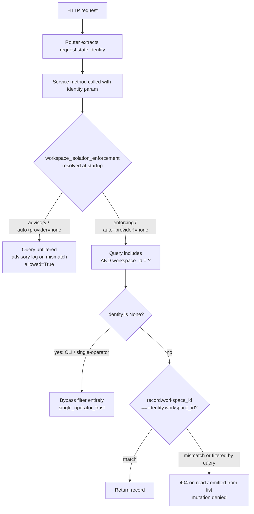

# Feature Brief & Metadata

**Feature Name:**

> WKSP-304: Row-Level Workspace Isolation Enforcement

**Filepath Name:**

> `wksp-304-workspace-isolation-enforcement-v1`

**Date:**

> 2026-07-08

**Author:**

> prd-writer (Claude Sonnet 5), orchestrated by Nick Miethe

**Related Epic(s)/PRD ID(s):**

> WKSP-301/302/303 (advisory-mode workspace migration, P5.3, commit `18b6c17`) — this PRD is the deferred WKSP-304 enforcement flip. Parent initiative: Public Multi-User Release, Phase 5 (Auth/RBAC).

**Related Documents:**

> - `.claude/worknotes/wksp-304-workspace-isolation-enforcement/exploration-findings.md` (ground-truth scope discovery; this PRD's primary input)
> - `docs/project_plans/implementation_plans/features/public-multiuser-p5-auth-rbac-v1/phase-3-workspace-migration.md` (P5.3 migration + advisory-mode rationale)
> - `docs/project_plans/human-briefs/public-multiuser-p5-auth-rbac.md` (P5 orchestrator lens; WKSP-304 deferral note)
> - `docs/dev/architecture/workspace-migration-runbook.md` (migration/rollback runbook — context only, not modified by this feature)

---

## 1. Executive Summary

Research Foundry's row-level workspace isolation is currently **advisory-only**: `require_workspace_scope()` in `src/research_foundry/api/auth/scope.py` logs a WARNING on cross-workspace mismatch but *always returns `allowed=True`*. Isolation today is achieved purely by deploying separate filesystem roots per tenant — there is no query-layer enforcement of `workspace_id`. This PRD flips that gate to fail-closed: cross-workspace reads return 404, cross-workspace list results are filtered out, and mutations are denied, all gated behind a new `workspace_isolation_enforcement` config flag that mirrors the existing, already-shipped `auth.rbac_enforcement` pattern (P5.6). This is the last blocking gap before Research Foundry can run a shared-store multi-tenant deployment; single-operator deployments are unaffected.

**Priority:** HIGH

**Key Outcomes:**
- Outcome 1: A caller authenticated into workspace A cannot read, list, or mutate a record belonging to workspace B — enforced at the query layer, not by convention or post-hoc logging.
- Outcome 2: The single-operator (`identity=None`, no auth middleware) path is provably unaffected — it is a permanent exception, not a compatibility risk.
- Outcome 3: Shared-store multi-tenant deployment is unblocked; the config flag lets operators dry-run (`auto`) before hard-cutting to `enabled`.

---

## 2. Context & Background

### Current State

Research Foundry ships two isolation strategies stacked on top of each other:

1. **Filesystem-root isolation (shipped, load-bearing today)** — each deployment gets its own `FoundryPaths` root. This is the *only* isolation mechanism that actually holds today; it works because there is exactly one workspace per deployment.
2. **Row-level `workspace_id` column (schema-only, advisory)** — P5.3 (`18b6c17`) added and backfilled `workspace_id` on all records (legacy rows → `workspace_id="default"`). `require_workspace_scope()` was wired everywhere a cross-workspace mismatch *could* occur, but it was deliberately left advisory: enforcement was held back to (a) keep the backfill reversible during the P5.3 dry-run window, and (b) separate the auth contract (P5.2/P5.6) from the enforcement wiring (this PRD).

The dry-run telemetry from the advisory logging already ran clean during P5.3 evaluation — the schema and backfill are proven; only the enforcement gate is missing.

### Problem Space

If Research Foundry is ever deployed with a **shared store** serving multiple workspaces from one process (the intended end-state for a hosted/multi-tenant offering), advisory-only isolation is a complete security failure: any authenticated caller can read or list any other workspace's catalog items, drafts, or agent jobs. The mismatch is logged, not blocked. This is silently safe *today* only because every shipped deployment topology is single-workspace (filesystem-root isolation covers it) — the row-level gate has never actually been load-bearing in production.

### Current Alternatives / Workarounds

The only current mitigation is topology: deploy one filesystem root per tenant. This does not scale to a shared-store, multi-tenant hosting model and was never intended as the long-term isolation mechanism — it was the interim state while P5 built the auth/RBAC foundation this PRD completes.

### Architectural Context

Research Foundry's layered flow for this feature: **Router** (extracts `request.state.identity`) → **Service** (business logic, currently identity-blind for the 3 in-scope services) → **raw parameterized SQL** (no ORM) → SQLite/Postgres-backed catalog store. There is no repository layer distinct from the service layer in this codebase — services own their SQL directly. The existing **advisory predicate** (`require_workspace_scope`) already implements the *comparison* logic (`AuthIdentity.workspace_id` vs `record["workspace_id"]`); WKSP-304 does not redesign that comparison — it (a) moves the check earlier (query-time, not post-fetch), and (b) makes it deny instead of log.

**Existing shipped pattern to mirror** — `auth.rbac_enforcement` (P5.6, `src/research_foundry/config.py:471-560`):
- `AuthRbacEnforcement` enum: `auto | enabled | disabled`.
- `Config.auth_rbac_enforcement()` parses `auth.rbac_enforcement` (default `auto`), raises `ValueError` on an invalid enum value.
- `Config.resolve_rbac_enforced(provider, bind_host)` — called once at app-create time, result cached on `app.state.rbac_enforced`; raises `ValueError` at startup if `disabled` + non-loopback `bind_host`.
- `auth_identity is None` passthrough in `require_role()` already provides single-operator-trust semantics for `provider="none"`.

This PRD's config flag, `workspace_isolation_enforcement`, reuses this exact structure under a new name, independently resolved, independently validated, independently stored on `app.state`.

---

## 3. Problem Statement

**User Story Format:**
> "As a platform operator running Research Foundry in shared-store multi-tenant mode, when a caller from Workspace A queries a catalog item, draft, or agent job, I need the system to deny access to Workspace B's records at the query layer — not merely log the mismatch — so that a single leaked mismatch cannot expose another tenant's data."

**Technical Root Cause:**
- `require_workspace_scope()` (`src/research_foundry/api/auth/scope.py:68-147`) is a post-hoc predicate always returning `allowed=True`; nothing consumes its return value to deny a request.
- Service methods (`catalog_service.get_item`, `builder_service.get_draft`, `agent_job_service.get_job`, and their `list_*`/`count_*` siblings) do not accept a caller-identity parameter and therefore cannot filter their SQL by `workspace_id`.
- Routers resolve `request.state.identity` for RBAC role checks (`require_role`) but do not forward that identity into the service calls that fetch the underlying record.

---

## 4. Goals & Success Metrics

### Primary Goals

**Goal 1: Fail-closed query-layer enforcement**
- Flip `require_workspace_scope` (or its query-layer equivalent) from "always allow" to "deny on mismatch" when enforcement is active.
- Measurable: every read/list/mutate query point enumerated in §6.1 FR-3 issues a parameterized `AND workspace_id = ?` predicate under enforcement.

**Goal 2: Orthogonal, fail-closed config gate**
- `workspace_isolation_enforcement` (`auto|enabled|disabled`) mirrors `auth.rbac_enforcement`'s two invariants exactly, independently of the RBAC flag.
- Measurable: startup raises `ValueError` for every `disabled` + non-loopback combination; `auto` resolves to enforcing whenever `auth.provider != "none"`.

**Goal 3: Zero regression to single-operator and existing auth-provider deployments**
- `identity=None` callers (CLI, direct-service, `provider=none`) continue to bypass the filter entirely, unconditionally, regardless of the enforcement flag's value.
- Measurable: 100% of existing test suites (`test_workspace_migration_service.py`, `test_p5_regression_suite.py`) pass unmodified.

### Success Metrics

| Metric | Baseline | Target | Measurement Method |
|--------|----------|--------|---------------------|
| Cross-workspace record leaks in regression matrix | N/A (advisory mode, untested) | 0 | New enforcement test matrix (§7 Phase 5) |
| Single-operator (`identity=None`) test pass rate | 100% (advisory mode) | 100% (enforcing mode) | Existing + new fallback tests |
| Enforcement regression tests passing | 0 (do not exist yet) | ~40-50/~40-50 | `pytest` full suite for this feature |
| Config validation matrix (loopback × enforcement value) | N/A | 100% pass | New `test_config_workspace_enforcement.py` |

---

## 5. User Personas & Journeys

**Primary Persona: Platform Operator (multi-tenant hosting)**
- Role: Runs Research Foundry as a shared-store service for multiple research teams/tenants.
- Needs: Certainty that Workspace A's research artifacts, drafts, and agent jobs are never visible to Workspace B, with an auditable enforcement gate they control via config.
- Pain Points: Cannot deploy shared-store multi-tenant today — the only safe topology is one filesystem root per tenant, which does not scale operationally.

**Secondary Persona: Single-Operator Developer (unchanged)**
- Role: Runs Research Foundry locally / via CLI with no auth provider configured.
- Needs: Zero behavior change. Every existing CLI and direct-service workflow must keep working exactly as before.
- Pain Points: None introduced by this feature if the `identity=None` fallback holds — this persona is a regression boundary, not a beneficiary.

### High-level Flow

See the Mermaid decision-flow diagram in §2 (Architectural Context) — it is the canonical flow for both personas: the single-operator path takes the `identity is None` branch and bypasses filtering entirely; the multi-tenant path takes the enforcing branch.

---

## 6. Requirements

### 6.1 Functional Requirements

| ID | Requirement | Priority | Notes |
| :-: | ----------- | :------: | ----- |
| FR-1 | Add `workspace_isolation_enforcement` config flag (`auto\|enabled\|disabled`) to `config.py`, structurally mirroring `auth.rbac_enforcement` (`AuthRbacEnforcement`-equivalent enum, `Config.workspace_isolation_enforcement()` parse method, `Config.resolve_workspace_isolation_enforced(provider, bind_host)` resolver). | Must | Independent flag, independently resolved, independently cached on `app.state`. Reuses `_is_loopback()` helper already in `config.py`. |
| FR-2 | Startup validation: raise `ValueError` when `workspace_isolation_enforcement=disabled` AND `viewer.bind_host` is not loopback (`127.0.0.1`/`::1`). | Must | Fail-closed invariant #1, exact mirror of `resolve_rbac_enforced`'s existing guard (`config.py:536-544`). |
| FR-3 | `auto` resolves to enforcing when `auth.provider != "none"`; resolves to advisory when `provider == "none"`. | Must | Fail-closed invariant #2. Matches `AUTO` semantics for RBAC (`config.py:547-556`), applied to the new flag. |
| FR-4 | Thread caller identity from router → service for every read/list/mutate call in scope (see AC-1 target_surfaces). | Must | Router extracts `request.state.identity` (existing pattern in `admin.py:92-96`, `reports.py:738-749`); pass it as an explicit `identity: AuthIdentity \| None` parameter into the service call. |
| FR-5 | Add `workspace_id` predicate to every SQL query point in the 3 in-scope services, parameterized (never string-interpolated). | Must | See AC-2. Applies to `catalog_service.py`, `builder_service.py`, `agent_job_service.py`. |
| FR-6 | Flip `require_workspace_scope` (or a new query-layer equivalent gate) to return `allowed=False` on mismatch when enforcement is active; callers deny with 404 (read) or omit the row (list). | Must | See AC-3. `identity=None` still returns `allowed=True, reason="single_operator_trust"` unconditionally — untouched by this flip. |
| FR-7 | LEFT JOIN / linked-record leaks are closed: any joined table that can surface rows from another workspace (e.g., `catalog_items ← LEFT JOIN catalog_links`) must apply the same `workspace_id` predicate to the joined side. | Must | See AC-4. |
| FR-8 | Soft-deleted / tombstoned rows remain workspace-scoped — a tombstone from workspace B must not be visible to a workspace A caller regardless of delete-state filtering logic. | Must | See AC-4. |
| FR-9 | Mutation endpoints (create/update/delete) reject cross-workspace targets with the same fail-closed deny as reads. | Must | See AC-5. |
| FR-10 | No functional or behavioral change to any code path when `identity is None`. | Must | See AC-6. Regression-only requirement; no new code added on this path beyond a bypass check. |

### 6.2 Non-Functional Requirements

**Performance:**
- Added `WHERE workspace_id = ?` predicates must not introduce a full-table scan; confirm existing indexes on `workspace_id` (added in the P5.3 migration) are used by `EXPLAIN QUERY PLAN` on the 3-5 highest-traffic query points (`catalog_service.list_items`, `get_item`).
- No measurable added latency (>10ms p95) on the affected endpoints versus advisory-mode baseline.

**Security:**
- All new WHERE-clause parameters use the existing parameterized-query convention (`?` placeholders / driver-level bind params) — no string interpolation, no f-string SQL construction, anywhere in the 3 touched services.
- Enforcement must be **fail-closed by default**: if the enforcement resolution logic throws or is misconfigured, the safe failure mode is "deny" or "startup abort," never "silently allow."

**Reliability:**
- The `identity=None` single-operator path must have zero behavioral delta — verified by running the full existing test suite (unmodified) against the enforcing code path.

**Observability:**
- Denial events (mismatch under enforcement) should emit a structured log distinct from the existing advisory WARNING (see OQ-3) — decision deferred to implementation planning, not blocking this PRD.
- Existing OpenTelemetry/structured-log conventions from `require_workspace_scope`'s advisory path are preserved for the advisory branch (unchanged when `auto`+`provider=none`).

---

## 7. Structured Acceptance Criteria

#### AC-1: Identity threading across all in-scope routers
- target_surfaces:
    - src/research_foundry/api/routers/catalog.py
    - src/research_foundry/api/routers/agent_jobs.py
    - src/research_foundry/api/routers/reports.py
    - src/research_foundry/api/routers/admin.py
    - src/research_foundry/api/routers/audit.py
    - src/research_foundry/api/routers/auth_identity.py
- propagation_contract: Each router resolves `identity = getattr(request.state, "identity", None)` (existing pattern) and passes `identity` as an explicit keyword argument into every service call that reads, lists, or mutates a workspace-scoped record. `auth_identity.py` and `admin.py` already resolve identity for their own endpoints and require no new resolution logic — only verification that any downstream service calls they make also receive it.
- resilience: When `identity is None` (no auth middleware configured), routers pass `identity=None` explicitly — never omit the argument, since an omitted argument must not silently default to a caller-controlled value.
- visual_evidence_required: false
- verified_by: [TASK-2.1, TASK-2.2, TASK-2.3, TASK-5.2]

#### AC-2: Query-layer workspace_id scoping in the 3 in-scope services
- target_surfaces:
    - src/research_foundry/services/catalog_service.py (`get_item`, `list_items`, `count_items`, `get_draft_index`, `list_draft_index`, `get_related_items`)
    - src/research_foundry/services/builder_service.py (`get_draft`, `list_drafts`, `find_drafts`, `build_report_from_draft`)
    - src/research_foundry/services/agent_job_service.py (`get_job`, `list_jobs`)
- propagation_contract: Every method above gains an `identity: AuthIdentity | None = None` parameter. When `identity is not None` and enforcement is active, the underlying SQL gains `AND workspace_id = :workspace_id` (or equivalent parameterized placeholder) bound to `identity.workspace_id`. When `identity is None`, no predicate is added — the query runs exactly as it does today.
- resilience: A method receiving `identity=None` must produce byte-identical SQL to the pre-WKSP-304 query (verified by a query-text or query-plan diff test per method).
- visual_evidence_required: false
- verified_by: [TASK-3.1, TASK-3.2, TASK-3.3, TASK-5.1]

#### AC-3: Deny path — read returns 404, list omits, on cross-workspace mismatch under enforcement
- target_surfaces:
    - src/research_foundry/api/auth/scope.py (`require_workspace_scope` / new enforcing equivalent)
    - src/research_foundry/services/catalog_service.py
    - src/research_foundry/services/builder_service.py
    - src/research_foundry/services/agent_job_service.py
- propagation_contract: When `workspace_isolation_enforcement` resolves to enforcing and `identity.workspace_id != record.workspace_id`, single-record read methods raise/propagate a not-found condition (surfaced as HTTP 404 by the router's existing `HTTPException` handling — no new error envelope needed); list methods exclude the mismatched row from the returned page (via the query-layer predicate in AC-2, not a post-fetch filter).
- resilience: A record with `workspace_id is None` (any record that somehow escaped the P5.3 backfill) is treated as a mismatch under enforcement — denied, never defaulted to allowed.
- visual_evidence_required: false
- verified_by: [TASK-4.1, TASK-4.2, TASK-5.1]

#### AC-4: No join or tombstone leaks
- target_surfaces:
    - src/research_foundry/services/catalog_service.py (any query joining `catalog_items` to a linked/related table, e.g. `catalog_links`)
    - src/research_foundry/services/builder_service.py (draft-to-report join paths, if any)
- propagation_contract: Every LEFT JOIN or subselect that can surface rows from a table other than the primary `workspace_id`-scoped table must apply the same `workspace_id` predicate to the joined side, not only the primary side. Soft-deleted/tombstoned rows carry their original `workspace_id` and remain subject to the same predicate — deletion state must never bypass workspace scoping.
- resilience: A join that omits the joined-side predicate must fail a dedicated leak-detection test (§7 Phase 5, "join/leak edge cases," ~15 tests) — this is the primary regression class this AC exists to catch.
- visual_evidence_required: false
- verified_by: [TASK-3.4, TASK-5.3]

#### AC-5: Mutation endpoints deny cross-workspace targets
- target_surfaces:
    - src/research_foundry/api/routers/catalog.py
    - src/research_foundry/api/routers/agent_jobs.py
    - src/research_foundry/api/routers/reports.py
- propagation_contract: Update/delete operations first resolve the target record's `workspace_id` (via the now-scoped `get_item`/`get_draft`/`get_job` from AC-2/AC-3) before applying the mutation; a cross-workspace target is denied with the same 404 semantics as a read, before any write executes.
- resilience: No mutation SQL executes against a record whose workspace has not been verified — verify via a test that asserts zero UPDATE/DELETE statements are issued for a cross-workspace target (mock/spy on the DB execute call).
- visual_evidence_required: false
- verified_by: [TASK-4.3, TASK-5.4]

#### AC-6: Single-operator fallback is fully preserved
- target_surfaces:
    - src/research_foundry/api/auth/scope.py
    - src/research_foundry/services/catalog_service.py
    - src/research_foundry/services/builder_service.py
    - src/research_foundry/services/agent_job_service.py
- propagation_contract: `identity=None` short-circuits to `WorkspaceScopeResult(allowed=True, reason="single_operator_trust")` and to unfiltered SQL, unconditionally — this branch is evaluated before the enforcement flag is even consulted.
- resilience: Every existing test in `test_workspace_migration_service.py` and `test_p5_regression_suite.py` passes unmodified with `workspace_isolation_enforcement=enabled` set globally in the test environment (a deliberate "break it if you dare" regression gate).
- visual_evidence_required: false
- verified_by: [TASK-5.5, TASK-6.1]

#### AC-7: Config fail-closed invariants
- target_surfaces:
    - src/research_foundry/config.py
- propagation_contract: `workspace_isolation_enforcement=disabled` + non-loopback `viewer.bind_host` raises `ValueError` at startup (app-create time), exactly mirroring `resolve_rbac_enforced`'s existing guard. `auto` + `auth.provider != "none"` resolves to enforcing; `auto` + `provider == "none"` resolves to advisory.
- resilience: An invalid enum value (anything other than `auto|enabled|disabled`) raises `ValueError` listing valid values, exactly mirroring `auth_rbac_enforcement()`'s existing behavior (`config.py:494-502`).
- visual_evidence_required: false
- verified_by: [TASK-1.1, TASK-1.2, TASK-5.6]

**R-P2 note (implicit "FE handles missing X" AC):** This feature adds no new field to any API response schema — `workspace_id` already exists on every returned record since the P5.3 backfill. The observable behavior change (404 on cross-workspace read, narrower list results) uses HTTP semantics the frontend already handles for ordinary not-found and empty-list cases. No new FE resilience AC is required; frontend is explicitly out of scope (§8).

**R-P4 note (UI runtime smoke):** Not applicable — no `*.tsx` files appear in `files_affected`; this is a backend-only enforcement flip.

---

## 8. Scope

### In Scope

- `src/research_foundry/api/auth/scope.py` — wire the enforcement flag; flip the deny path.
- `src/research_foundry/config.py` — add `workspace_isolation_enforcement` flag + fail-closed validation, mirroring `auth.rbac_enforcement`.
- Query-layer scoping in `catalog_service.py`, `builder_service.py`, `agent_job_service.py` (the ~20-25 methods / ~60-80 query points enumerated in AC-2).
- Identity threading through the 6 routers enumerated in AC-1 (`catalog.py`, `agent_jobs.py`, `reports.py`, `admin.py`, `audit.py`, `auth_identity.py`).
- Join/leak closure (AC-4) and mutation deny paths (AC-5) within the 3 in-scope services.
- New enforcement regression test matrix (~40-50 tests, §7 Phase 5 of the implementation plan).
- Documentation: CHANGELOG `[Unreleased]` entry, `workspace-migration-runbook.md` update noting enforcement is now available/default-resolved, and an operator-facing note on `auto` vs `enabled` vs `disabled` semantics.

### Out of Scope

- **Auth-core / RBAC changes.** `require_role`, `AuthIdentity`, `auth.rbac_enforcement`, and the P5.2/P5.6 role model are untouched — this PRD only reuses their config idiom.
- **New auth providers.** No changes to `provider` resolution, no new provider types.
- **Frontend.** No FE files change; no new UI affordance for the enforcement flag (it is an operator-facing config value, set via YAML/env, not a runtime toggle exposed in the admin UI in this PRD's scope).
- **Cross-workspace admin override / support-access role.** Deferred pending resolution of OQ-2; not designed or implemented here.
- **Multi-region / multi-database sharding.** This PRD assumes a single shared store; sharding strategy is a separate initiative.
- **`runs.py` router.** Grep confirms no `workspace_id` or identity references in this router today; if a future audit finds a workspace-scoped read/write here, it is a follow-on, not part of this PRD's ~6-router scope.

---

## 9. Dependencies & Assumptions

### External Dependencies

- None. No new libraries; raw parameterized SQL only (existing driver, no ORM introduced).

### Internal Dependencies

- **P5.3 workspace-isolation migration (`18b6c17`)**: Complete. Backfill of `workspace_id="default"` on legacy rows is the precondition this PRD assumes is universally true — every record has a non-null `workspace_id` post-migration.
- **P5.6 RBAC enforcement toggle**: Complete, shipped pattern this PRD mirrors structurally. No functional dependency (the two flags are independent), but the implementation-planner should read `config.py:471-560` directly as the template.
- **P5.2 `AuthIdentity` / `request.state.identity`**: Complete; this PRD consumes it as-is, does not modify it.

### Assumptions

- Every persisted record in the 3 in-scope services has a non-null `workspace_id` following the P5.3 backfill (verified assumption, not re-verified by this PRD — a violation surfaces as a deny under AC-3's "workspace_id is None → treated as mismatch" rule, which is itself the safety net).
- No hidden 4th service or router outside the 6 enumerated in AC-1 calls into `catalog_service`/`builder_service`/`agent_job_service`'s scoped methods. Verified by `grep -rln "catalog_service\|builder_service\|agent_job_service" src/research_foundry/api/routers/*.py` during exploration — confirmed 3 direct callers (`catalog.py`, `agent_jobs.py`, `reports.py`); `admin.py`/`audit.py`/`auth_identity.py` are included in AC-1 for identity-threading completeness even though they don't call the 3 services directly today, since they are workspace-identity-adjacent surfaces reviewers will expect covered.
- SQLite is the primary test/dev backend (parameterized `?` placeholders); if Postgres is also a supported backend, the same predicate must use its native parameter style — implementation-planner to confirm during Phase 2/3 exploration.

### Feature Flags

- `workspace_isolation_enforcement`: `auto` (default) | `enabled` | `disabled`. Set in the same config section as `auth.rbac_enforcement` (`auth:` block or a new `workspace:` block — implementation-planner's call, but keep it discoverable next to the RBAC flag for operator symmetry).

---

## 10. Risks & Mitigations

| Risk | Impact | Likelihood | Mitigation |
| ----- | :----: | :--------: | ---------- |
| Visibility regression — a list endpoint accidentally exposes cross-workspace rows because one of the ~60-80 query points was missed | High | Medium | Exhaustive AC-2 target_surfaces enumeration (every method, not "all queries"); Phase 5 regression matrix explicitly tests all 2-workspace × {read, list, mutate} combinations per method. |
| Join leaks — `catalog_items ← LEFT JOIN catalog_links` (or similar) surfaces a linked row from another workspace even when the primary row is correctly scoped | High | Medium | AC-4 dedicated requirement; ~15 join/leak edge-case tests in Phase 5; explicit code-review checklist item: "does every JOIN target also carry the workspace_id predicate?" |
| Soft-delete / tombstone leaks — archived/hidden rows leak via a query predicate that filters on delete-state but forgets workspace scoping | Medium | Medium | AC-4 explicitly requires tombstones remain workspace-scoped; tested alongside join leaks in the same ~15-test bucket. |
| Single-operator fallback breaks — `identity=None` path is accidentally altered while adding the `identity` parameter to 20+ method signatures | Critical | Medium | AC-6 makes this a first-class, explicitly-verified requirement: the full pre-existing test suite must pass unmodified with enforcement globally enabled; `identity=None` short-circuit is evaluated before any enforcement-flag check, by construction. |
| SQL injection — new WHERE clauses are added via string formatting instead of parameterized bind params | Critical | Low | NFR-Security explicitly forbids string interpolation; code review gate; a dedicated test asserting the query string contains a placeholder token (`?` or `:workspace_id`), never an interpolated literal, for each of the ~60-80 query points touched. |

---

## 11. Target State (Post-Implementation)

**User Experience:**
- Multi-tenant operators set `workspace_isolation_enforcement=enabled` (or trust `auto` once any real auth provider is configured) and gain a fail-closed guarantee: cross-workspace access is denied at the database query, not merely logged.
- Single-operator developers observe zero change — every CLI/direct-service workflow behaves identically before and after.

**Technical Architecture:**
- `config.py` gains a `workspace_isolation_enforcement`/`resolve_workspace_isolation_enforced()` pair structurally identical to the RBAC pattern, cached on `app.state` at app-create time.
- The 3 in-scope services accept an `identity` parameter on every read/list/mutate method; the 6 in-scope routers pass it through from `request.state.identity`.
- `auth/scope.py`'s `require_workspace_scope` (or its enforcing successor) actually gates access — `allowed=False` is a real, consumed signal for the first time.

**Observable Outcomes:**
- 0 cross-workspace leaks across the full regression matrix (success metric).
- Enforcement resolution is deterministic and testable in isolation from the rest of the auth stack (mirrors the already-proven RBAC toggle's testability).

---

## 12. Overall Acceptance Criteria (Definition of Done)

### Functional Acceptance

- [ ] AC-1 through AC-7 (§7) all pass.
- [ ] FR-1 through FR-10 (§6.1) all implemented and verified.
- [ ] Single-operator fallback (AC-6) verified via unmodified pass of pre-existing test suites.

### Technical Acceptance

- [ ] All new WHERE-clause predicates are parameterized (NFR-Security); verified by a dedicated SQL-construction test per query point or per method.
- [ ] `workspace_isolation_enforcement` config resolution has 100% branch coverage (auto/enabled/disabled × loopback/non-loopback × provider=none/other).
- [ ] No ORM introduced; raw-SQL convention preserved.

### Quality Acceptance

- [ ] ~40-50 new enforcement regression tests land and pass (Phase 5 test matrix, §7 of the implementation plan).
- [ ] Existing `test_workspace_migration_service.py` and `test_p5_regression_suite.py` pass unmodified with enforcement globally enabled.
- [ ] Security review confirms no string-interpolated SQL in the touched files.

### Documentation Acceptance

- [ ] CHANGELOG `[Unreleased]` entry added (`changelog_required: true` — mandatory per frontmatter).
- [ ] `docs/dev/architecture/workspace-migration-runbook.md` updated to note enforcement availability and the `auto|enabled|disabled` operator decision.
- [ ] `config.py` docstring for the new flag mirrors the RBAC flag's docstring depth (semantics of each enum value spelled out).

---

## 13. Assumptions & Open Questions

### Assumptions

- Every persisted record has a non-null `workspace_id` post-P5.3-backfill (see §9).
- SQLite parameterization style (`?`) is sufficient for the primary target backend; Postgres compatibility (if applicable) confirmed during implementation planning.
- No 4th service outside the 3 enumerated calls into workspace-scoped query points (verified via grep during exploration).

### Open Questions

- [ ] **OQ-1**: Should cross-workspace list endpoints silently filter (empty result, 200) or signal narrowing explicitly (e.g., a response header)?
  - **A**: TBD — proposal is silent filtering (no existence-leaking signal); confirm during Phase 4 implementation review.
- [ ] **OQ-2**: Does an admin/owner cross-workspace override role belong in this PRD's scope, or is it fully deferred?
  - **A**: TBD — current position: fully deferred (see §8 Out of Scope); single-operator CLI already covers the operator-debug use case.
- [ ] **OQ-3**: Should enforcement denial events emit a distinct structured audit log (separate from the existing advisory WARNING)?
  - **A**: TBD — non-blocking; implementation-planner may resolve during Phase 4/6 without PRD amendment, since it does not change the deny behavior itself, only its observability.

---

## 14. Appendices & References

### Related Documentation

- Migration/rollback runbook: `docs/dev/architecture/workspace-migration-runbook.md`
- P5.3 phase plan (migration + advisory rationale): `docs/project_plans/implementation_plans/features/public-multiuser-p5-auth-rbac-v1/phase-3-workspace-migration.md`
- P5 human brief (orchestrator lens, WKSP-304 deferral note): `docs/project_plans/human-briefs/public-multiuser-p5-auth-rbac.md`
- RBAC enforcement toggle (structural template for this PRD's config flag): `.claude/worknotes/observations/rbac-enforcement-toggle.md` (per project memory index) and `src/research_foundry/config.py:471-560`

### Symbol References

- N/A — `ai/symbols-api.json` not consulted for this PRD; exact `config.py`/`scope.py` line numbers were confirmed by direct file read during exploration (see file:line citations throughout §6-§10).

### Prior Art

- `.claude/worknotes/wksp-304-workspace-isolation-enforcement/exploration-findings.md` — the primary scope-discovery input for this PRD; treat as ground truth alongside this document.
- `.claude/rules/rbac-enforcement-toggle.md` (per user memory index) — the "two fail-closed invariants" pattern this PRD's config flag must never weaken, applied to the new orthogonal flag.

---

## Implementation

### Phased Approach

This PRD proposes the following phase structure; the implementation plan finalizes task-level detail, batching, and subagent routing.

**Phase 1: Config flag + fail-closed validation**
- Add `workspace_isolation_enforcement` to `config.py` mirroring `auth.rbac_enforcement` exactly (FR-1, FR-2, FR-3; AC-7).
- Integration owner: `data-layer-expert` (or `backend-architect`) — single-file phase, no cross-owner seam.
- Duration: ~0.5-1 day.

**Phase 2: Identity threading, router → service**
- Wire `identity` extraction/pass-through in the 6 in-scope routers (AC-1).
- Integration owner: `python-backend-engineer`; seam task required — verify each router's passed `identity` actually reaches the service signature added in Phase 3 (R-P3: overlapping files between Phase 2 and Phase 3 owners).
- Duration: ~1-1.5 days.

**Phase 3: Query-layer scoping in the 3 services**
- Add `identity` parameter + `workspace_id` WHERE predicate to every method in AC-2; close join/tombstone leaks (AC-4).
- Integration owner: `backend-architect` + `data-layer-expert` (query correctness); seam task with Phase 2's router-threading owner to confirm end-to-end propagation per router/service pair.
- Duration: ~2-3 days (largest phase — ~60-80 query points).

**Phase 4: Flip scope.py to enforcing + deny paths**
- Flip `require_workspace_scope` (or its enforcing successor) to return `allowed=False` under enforcement; wire 404-on-read and mutation-deny (AC-3, AC-5, AC-6).
- Integration owner: `backend-architect`; depends on Phase 1 (flag) and Phase 3 (scoped queries) being complete.
- Duration: ~1 day.

**Phase 5: Regression + enforcement test matrix (~40-50 tests)**
- 2-workspace × {read, list, mutate} × {allowed, denied} core matrix (~12), single-operator fallback (~10), join/leak edge cases (~15), config validation (~5), plus targeted SQL-injection-safety assertions.
- Integration owner: `python-backend-engineer`; mandatory `task-completion-validator` gate before Phase 6.
- Duration: ~2 days.

**Phase 6: Docs / CHANGELOG / runbook update**
- CHANGELOG `[Unreleased]` entry; `workspace-migration-runbook.md` update; `config.py` docstring parity with the RBAC flag.
- Integration owner: `documentation-writer` (haiku) for docs; `changelog-generator` for CHANGELOG.
- Duration: ~0.5 day.

### Epics & User Stories Backlog

| Story ID | Short Name | Description | Acceptance Criteria | Estimate |
|----------|-----------|-------------|----------------------|----------|
| WKSP-304-1 | Config flag | Add `workspace_isolation_enforcement` + fail-closed validation | AC-7 | 1 pt |
| WKSP-304-2 | Router identity threading | Thread `identity` through 6 routers | AC-1 | 1.5 pts |
| WKSP-304-3 | Catalog service scoping | Scope all `catalog_service.py` query points | AC-2, AC-4 | 2.5 pts |
| WKSP-304-4 | Builder service scoping | Scope all `builder_service.py` query points | AC-2, AC-4 | 1.5 pts |
| WKSP-304-5 | Agent job service scoping | Scope all `agent_job_service.py` query points | AC-2 | 1 pt |
| WKSP-304-6 | Enforcing deny path | Flip `scope.py`; 404-on-read, list-omit, mutation-deny | AC-3, AC-5, AC-6 | 1.5 pts |
| WKSP-304-7 | Regression matrix | ~40-50 enforcement tests | §12 Quality Acceptance | 2 pts |
| WKSP-304-8 | Docs finalization | CHANGELOG, runbook, docstrings | §12 Documentation Acceptance | 0.5 pts |

**Estimation anchor (H5):** Explorer estimate of 8-10 pts, Tier 2 (see exploration findings §8), consistent with the sum above (~11.5 pts pre-buffer, within the ≥30% delta tolerance given the 60-80 query-point regression surface — trust the bottom-up sum; implementation plan should verify against P5.6's actual RBAC-toggle effort as the closest comparable).

### Deferred Items

N/A — no deferred items. All scope identified during exploration is covered by FR-1 through FR-10 and AC-1 through AC-7 above; out-of-scope items (§8) are explicit exclusions, not deferrals, and none carry a `DI-` backlog reference at this time.

---

**Progress Tracking:**

See progress tracking (created after implementation plan approval): `.claude/progress/wksp-304-workspace-isolation-enforcement/all-phases-progress.md`
