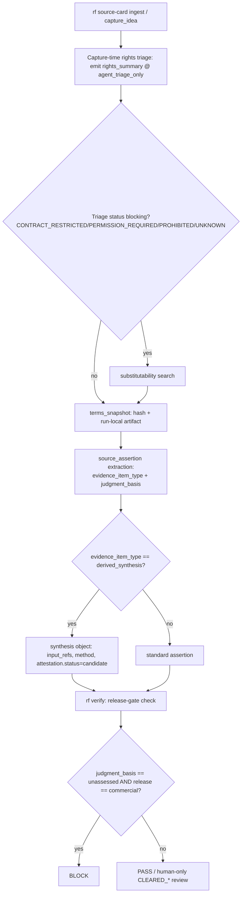

# Feature Brief & Metadata

**Feature Name:**

> Rights & Evidence-Item Entity Model

**Filepath Name:**

> `rights-entity-model-v1` (kebab-case)

**Date:**

> 2026-07-21

**Author:**

> Claude (Sonnet 5), prd-writer

**Related Epic(s)/PRD ID(s):**

> Upstream handoff from pediatric-anemia-site (capability request, not an RF-internal epic)

**Related Documents:**

> - Handoff: `pediatric-anemia-site/docs/project_plans/research/research-foundry-rights-entity-model-handoff-v1.md`
> - v1.0 baseline spec: `pediatric-anemia-site/docs/project_plans/research/research_foundry_rights_governance_spec_v1.0/Research_Foundry_Source_Reuse_and_Rights_Governance_Spec_v1.0.md`
> - Deferred design spec this PRD partially resumes: `docs/project_plans/design-specs/reusable-assertion-ledger-public-rights-promotion.md`
> - RF-side ADR to be authored in Phase 5: `docs/dev/architecture/adr-rights-entity-model.md`

---

## 1. Executive Summary

The pediatric-anemia-site project — an RF consumer — handed back a capability request asking Research Foundry to own a rights/licensing/provenance entity model at the platform level rather than have every consuming content repo re-derive it. This PRD adopts that request as-authored (OQ-RF-1: accept). It first ports the pediatric-repo's v1.0 baseline rights schemas (`rights_record`, `rights_extension`, `content_reuse_assessment`, `permission_record`, `rights_failure`) into RF's own `schemas/*.schema.yaml` registry — applying the ten §9 schema-conflict fixes the handoff's own review surfaced — because RF does not have any rights substrate today. It then layers the four requested capabilities on RF's existing evidence entities (`source_card`, `source_assertion`): a denormalized `rights_summary` mirror (C1), an `evidence_item_type`/`judgment_basis` taxonomy (C2, "the substantive contribution back upstream"), first-class `derived_synthesis` provenance (C3), and capture-time rights emission with substitutability search (C4).

**Priority:** HIGH

**Key Outcomes:**
- Outcome 1: Every RF-captured source and evidence item carries a fail-closed rights posture from the moment it is captured — never as a later backfill sweep.
- Outcome 2: No automated agent code path can ever produce a `CLEARED_*`/`counsel_approved`/`attested` value, provably, over every write path that touches those fields.
- Outcome 3: RF gains an `evidence_item_type`/`judgment_basis` taxonomy that is domain-general (not clinical-only) and independent of both the rights axis and the existing component-type axis — no field is derived from another.

---

## 2. Context & Background

### Current State

RF has no rights, licensing, or provenance-of-permission model. `source_cards.py::ingest_source` writes a `trust.source_rank` (defaulting `unknown`) and a small `usage.{allowed_for_public_output, allowed_for_work_output, allowed_for_personal_meatywiki}` boolean set derived purely from `sensitivity` — a privacy/audience control, not a rights/licensing control. There is no `rights_record` concept, no distinction between measured and judged evidence, and no first-class representation of a synthesized (derived) claim's provenance chain. `governance.py` enforces ~8 deterministic policy rules (key-profile, writeback-review, secret-scanning, unmapped-claims) but has no rule preventing an agent from writing a clearance-style value, because no such value exists yet to guard.

### Problem Space

Consumers that build commercial content products on top of RF-sourced evidence (pediatric-anemia-site is the first, but the boundary test the handoff proposes — "if a second, unrelated content module would need it too, it is Research Foundry's" — implies more will follow) currently have to build and maintain their own rights/licensing governance layer entirely downstream of RF, re-deriving facts (access basis, contract terms, component-level clearance) that were only knowable at the moment RF captured the source. Backfilling access-basis assessment after the fact is lossy: subscription/paywall context that was visible at fetch time is often unrecoverable later.

### Current Alternatives / Workarounds

The pediatric-anemia-site repo built its own v1.0 rights-governance spec and five JSON schemas entirely inside its own repo, duplicated from nothing (there was no upstream shape to inherit from). That spec's own internal review surfaced ten unresolved schema-conflict items (§9) before the spec was even handed off — meaning the workaround was accumulating its own defect backlog rather than pointing at a stable RF-owned contract.

### Market / Competitive Notes (Optional)

N/A — internal platform capability.

### Architectural Context

RF is a Markdown/YAML-first control plane: schemas are Draft 2020-12 JSON Schema authored as YAML at `schemas/*.schema.yaml`, loaded and validated through `SchemaRegistry` (`src/research_foundry/schemas.py`) via `jsonschema.Draft202012Validator`. Two schema families already coexist by convention: a **loose/legacy** family (`source_card`, `claim_ledger` — `additionalProperties` effectively true, minimal `required`) and a **strict/immutable** family (`passage`, `inference_record`, `source_assertion` — `additionalProperties: false`, `schema_version: {const: "1.0"}`, pattern-constrained IDs, nullable fields expressed as `type: [T, "null"]`, no `$defs`/`$ref` used anywhere yet). Governance is a deterministic rule pass (`governance.py::guard_check`) returning a worst-severity verdict (`block | require_approval | warn`) that never raises. Verification (`verification.py::verify_report`) runs a fixed sequence of named checks with an exit-code precedence ladder and has no existing point-in-time (`--as-of`) resolver — the closest analog is `resolve_exact_passage_mode`'s CLI-override → config → default precedence chain.

---

## 3. Problem Statement

**User Story Format:**
> "As a consuming content repository (e.g. pediatric-anemia-site), when I ingest evidence through Research Foundry, I currently get no rights/licensing posture on that evidence at all instead of a fail-closed, capture-time rights classification I can build a commercial release gate on top of."

**Technical Root Cause:**
- RF's schema registry has no rights/licensing entity type.
- RF's evidence unit (`source_assertion`) has no axis distinguishing measured facts from expert judgment, and no provenance structure for multi-source-derived claims.
- RF's governance layer has no rule preventing an agent from writing a clearance-grade value, because no clearance-grade field exists to guard.
- Files involved: `schemas/*.schema.yaml`, `src/research_foundry/schemas.py`, `src/research_foundry/services/{source_cards,capture,governance,verification}.py`, `src/research_foundry/cli_commands.py`.

---

## 4. Goals & Success Metrics

### Primary Goals

**Goal 1: Own the rights substrate, not just mirror it**
- RF's `schemas/*.schema.yaml` gains its own canonical `rights_record`/`rights_extension`/`content_reuse_assessment`/`permission_record`/`rights_failure` schemas with the ten §9 adjudications applied at the source, not carried forward as debt.
- Success: all five schemas register in `SchemaRegistry`, pass `test_registry_lists_all_schemas`, and have valid/invalid instance builders.

**Goal 2: Fail-closed by construction, everywhere**
- Every rights/judgment enum defaults `unknown`/`unassessed`; no path exists where an agent produces a clearance-grade value.
- Success: negative tests pass over both `overall_status` and `decision.status` write paths (§9.10); release-gate bidirectional tests pass.

**Goal 3: Capture-time, not backfill**
- Rights triage and terms snapshotting happen in the same pass that ingests a source; substitutability search triggers automatically on blocking triage.
- Success: 100% of newly ingested sources/evidence items carry `rights_summary` at `agent_triage_only` with no separate sweep step required.

### Success Metrics

| Metric | Baseline | Target | Measurement Method |
|--------|----------|--------|--------------------|
| Sources with a rights_summary at capture | 0% (no field exists) | 100% of new ingests | `ingest_source` post-condition test |
| Agent-writable CLEARED_* paths | unguarded (0 fields exist to guard) | 0 (proven) | negative test suite, both write paths |
| Divergence-validator reproducibility | N/A | byte-identical output for fixed `--as-of` | two-run diff in CI |
| Release-gate bidirectional correctness | N/A | blocks commercial / passes capture, both tested | pytest, two directions |

---

## 5. User Personas & Journeys

**Primary Persona: RF Capture Agent (automated)**
- Role: `rf_source_carder`/`ingest_source` caller during a discovery swarm.
- Needs: emit a defensible, fail-closed rights posture without ever risking a clearance write.
- Pain Points (today): no field exists to populate at all.

**Secondary Persona: Consuming Content Repo Maintainer (human)**
- Role: pediatric-anemia-site (and future consumers) integrating RF evidence into a commercial product.
- Needs: a stable, RF-owned contract to bind a local release gate against, without re-deriving rights logic per-repo.
- Pain Points (today): builds and maintains a parallel rights model with its own unresolved schema conflicts.

### High-level Flow

---

## 6. Requirements

### 6.1 Functional Requirements

| ID | Requirement | Priority | Notes |
| :-: | ----------- | :------: | ----- |
| FR-1 | Port `rights_record.schema.yaml` into `schemas/` (Draft 2020-12, strict family) with §9.3/§9.4/§9.5/§9.6/§9.7/§9.10 fixes applied. | Must | Phase 0 |
| FR-2 | Port `rights_extension.schema.yaml` into `schemas/`, scoped as the fuller entity-level extension record — explicitly NOT the taxonomy carrier (§9.1). | Must | Phase 0 |
| FR-3 | Port `content_reuse_assessment.schema.yaml` with unified `component_type` vocabulary (§9.2/§9.8) and shared `review_status`/`decision.status` enums (§9.7/§9.10). | Must | Phase 0 |
| FR-4 | Port `permission_record.schema.yaml` and `rights_failure.schema.yaml` as-is structurally (no §9 conflicts named against them). | Must | Phase 0 |
| FR-5 | Extend `SchemaRegistry`/`EXPECTED_SCHEMA_NAMES`/`test_schema_validation.py` to cover all 5 new schemas with valid/invalid instance builders. | Must | Phase 0 |
| FR-6 | Add `evidence_item_type` (required enum, 7 members + `other`) to `source_assertion.schema.yaml`, extensions namespace `extensions.evidence_taxonomy`. | Must | P1 (C2) |
| FR-7 | Add `judgment_basis` (required enum, defaults semantically to `unassessed`) to the same `extensions.evidence_taxonomy` block, independent of `evidence_item_type`. | Must | P1 (C2) |
| FR-8 | No code path may derive `evidence_item_type` or `judgment_basis` from the other, nor from any existing component-type field. | Must | P1 (C2) — three-axes invariant |
| FR-9 | `judgment_basis` enum is domain-general (not clinical-only naming) per OQ-RF-2 resolution. | Should | P1 |
| FR-10 | Add `rights_summary` mirror object to `source_card.schema.yaml` and `source_assertion.schema.yaml`: ≤6 restriction fields, `mirror_is_authoritative: const false`, `rights_record_ids[]` required non-empty whenever any mirror value is non-`unknown`. | Must | P2 (C1) |
| FR-11 | Build `services/rights_validation.py::check_rights_divergence(paths, *, as_of, ...)` — validates mirror-vs-record fidelity, link-before-assert, and presence-not-clearance invariants. | Must | P2 (C1) |
| FR-12 | Divergence validator is exposed as `rf rights validate --as-of YYYY-MM-DD` (required flag, no implicit wall-clock default). | Must | P2 (C1) |
| FR-13 | Validator emits fail on: non-`unknown` mirror value without a linked `rights_record_id`; any mirror-vs-linked-record value divergence. | Must | P2 (C1) |
| FR-14 | Add `record_scope: first_party` and `overall_status: OWNED` to `rights_record.schema.yaml` (already covered by FR-1's §9.5 fix; restated here as C3's direct dependency). | Must | Phase 0 → P3 |
| FR-15 | Add conditional `synthesis` object to `source_assertion.schema.yaml`, required when `evidence_item_type == derived_synthesis`: `input_refs[]` (`minItems: 2`), `method`, `divergence_notes[]`, `reproduces_source_arrangement` (required bool), `first_party_rights_holder`, `attestation{attested_by, attested_at, attestation_ref, status}`. | Must | P3 (C3) |
| FR-16 | `synthesis.attestation.status` enum is `[candidate, attested]`; no service-layer write path invoked by an agent identity may set `attested`. | Must | P3 (C3) — authorization boundary |
| FR-17 | A `derived_synthesis` assertion may exist without a third-party `source_id`/`source_edition_id`/`passage_id` (conditionally nullable when `evidence_item_type == derived_synthesis`). | Must | P3 (C3) |
| FR-18 | `ingest_source`/`capture_idea` emit `rights_summary` at `review_status: agent_triage_only` in the same call that creates the source card — no separate backfill sweep. | Must | P4 (C4) |
| FR-19 | Terms snapshotting: content-addressed artifact (`terms_snapshot_sha256`) + `terms_verified_at`, stored under `runs/<run_id>/rights/terms_snapshots/`, excluded from exported/shipped bundles. | Must | P4 (C4) |
| FR-20 | Snapshot failure is recorded structurally (a typed failure record), never as an absent/null field. | Must | P4 (C4) |
| FR-21 | A blocking triage status (`CONTRACT_RESTRICTED`, `PERMISSION_REQUIRED`, `PROHIBITED`, or use-blocking `UNKNOWN`) triggers a `substitutability` assessment (`status: substitute_found \| no_substitute_found \| not_searched`). | Must | P4 (C4) |
| FR-22 | New `rf rights` CLI command group (`rights_app`, following the `assertion_app` pattern) for `inspect`, `list`, `validate`. | Must | P4/P2 |
| FR-23 | New `governance.py` guard rule: block any agent-writable code path from producing `CLEARED_*`, `counsel_approved`, or `attestation.status=attested` on any of `rights_record.overall_status`, `content_reuse_assessment.decision.status`, `rights_extension.clearance_status`, `synthesis.attestation.status`. | Must | P5 |
| FR-24 | Release-gate rule in `verification.py`: `judgment_basis: unassessed` blocks commercial-release disposition evaluation, is non-blocking for internal-capture writes. | Must | P5 |
| FR-25 | Author RF-side ADR `docs/dev/architecture/adr-rights-entity-model.md` recording all ten §9 adjudications, OQ-RF-1..4 resolutions, and OQ-RF-5/6 as named known gaps. | Must | P5 |
| FR-26 | Add a P6 consistency test asserting byte-identical enum lists between `rights_record.overall_status`/`content_reuse_assessment.decision.status`, and between the two `review_status` enums (post §9.7/§9.10 fix), and between the two `component_type` enums (post §9.2/§9.8 fix). | Must | P6 |

### 6.2 Non-Functional Requirements

**Fail-closed defaults (hard invariant):**
- Every rights/judgment enum introduced or ported in this feature defaults to `unknown`/`unassessed`. Existing RF entities that predate this feature migrate to "visible ignorance" (explicit `unknown` mirror) on first touch, never silent breakage — no migration may leave a rights field unset/absent where the schema requires it.

**Authorization boundary (Mode-D-adjacent — human-only writes):**
- No automated agent code path may set `CLEARED_*`, `counsel_approved`, or `attestation.status=attested`. Agents write `agent_triage_only`/`candidate`/non-cleared statuses only. This MUST be provable via negative tests exercised over BOTH enum write paths named in §9.10 (`rights_record.overall_status` and `content_reuse_assessment.decision.status`, plus `decision.release_gate` and `synthesis.attestation.status`).

**No third-party full-text storage (handoff §6.1):**
- RF does not store third-party full text or verbatim spans on behalf of consumers under this feature. Every new locator field must point at a re-fetchable position (source + edition + section/table/row/column), never at retained third-party expression.

**Divergence validator determinism:**
- `check_rights_divergence` MUST be time-parameterized via an explicit `--as-of` argument and MUST NEVER call wall-clock time (`datetime.now()`, `time.time()`, etc.) internally. Two invocations with the same `--as-of` value and unchanged inputs MUST produce byte-identical output.

**Release-gate asymmetry (handoff §3.4/§8):**
- `judgment_basis: unassessed` blocks any commercial-release disposition evaluation and is non-blocking for internal capture. Both directions MUST be covered by automated tests; neither may be assumed from the other.

**Three independent axes, no derivation:**
- Evidence quality (`evidence_item_type`), rights (`rights_summary`/clearance), and measured-vs-judged (`judgment_basis`) are three independent axes. No schema field or code path may compute one from another.

**Reliability:**
- Capture-time rights emission failures (e.g., snapshot fetch failure) degrade to a structurally-recorded failure, never a silent absence — matching RF's existing fail-closed sentinel pattern (`_IO_ERROR_SENTINEL_PREFIX` precedent in `verification.py`).

**Observability:**
- Rights-relevant writes append to the existing run-trace mechanism (same pattern as `ingest_source`'s trace append); the divergence validator's `--as-of` value is logged alongside its verdict for auditability.

---

## 7. Scope

### In Scope

- Phase 0 Rights Substrate: porting all five v1.0 baseline schemas into RF's own `schemas/*.schema.yaml`, with all ten §9 adjudications applied.
- C1: entity-level `rights_summary` mirror on `source_card` and `source_assertion`, plus the time-parameterized divergence validator.
- C2: `evidence_item_type` + `judgment_basis` taxonomy on `source_assertion`.
- C3: `derived_synthesis` as a first-class `evidence_item_type` member with full attribution/attestation structure, shipped together (not retrofitted later).
- C4: capture-time rights emission, terms snapshotting (hash + run-local artifact), and substitutability search on blocking triage.
- Governance gate: agent-write prohibition on `CLEARED_*`/`counsel_approved`/`attested`, and the commercial-release-gate rule for `judgment_basis: unassessed`.
- An RF-side canonical rights ADR.

### Out of Scope

- Editing the pediatric-repo's v1.0 spec document — RF produces its own schemas and its own ADR; the source spec is read-only input.
- A runtime rights-resolution API (OQ-RF-3 deferred alternative to the mirror).
- Terms-snapshot external hosting beyond the RF run directory (OQ-RF-4's hosting question).
- Rights-terms surveillance execution (a scheduled re-check loop) — OQ-RF-5, record-the-debt.
- A formal counsel/rights-owner role and workflow — OQ-RF-6, record-the-debt.
- Cross-file `$ref`/shared-`$defs` schema-loading infrastructure in `SchemaRegistry` (deferred; consistency tests substitute for it in v1).
- Any change to the pediatric-repo or any other consumer repo.

### Dependencies & Assumptions

### External Dependencies

- None (no new third-party libraries; `jsonschema` Draft202012Validator is already an RF dependency).

### Internal Dependencies

- `SchemaRegistry` (`src/research_foundry/schemas.py`) — must load and validate the 5 new + 2 extended schemas.
- `services/source_cards.py::ingest_source` — capture-time emission hook point.
- `services/capture.py::capture_idea`/`triage_idea`/`_governance_from_sensitivity` — governance-block precedent to extend or sit alongside.
- `services/governance.py::guard_check` — new rule slot, following the existing `work_writeback_requires_review`/`intenttree_writeback_requires_review` pattern.
- `services/verification.py::verify_report` — new release-gate check slot in the existing named-checks sequence.
- `cli_commands.py` — new `rights_app` Typer sub-app, modeled on `assertion_app`.

### Assumptions

- RF's evidence-granularity attachment points for `rights_summary`/taxonomy are `source_card` (source-level) and `source_assertion` (evidence-item-level) — the closest existing analogs to the handoff's "source entities and evidence entities" language. This is a PRD-authored decision, not upstream-specified.
- The pediatric-anemia-site repo will consume the ported RF schemas by reference (via `rights_record_ids[]` etc.) once RF ships them; no reverse dependency exists.
- `disambiguate_id`-style ID minting (already used for `raw_idea`/`research_intent`) is sufficient for the new rights entity IDs; the sha256-fingerprint identity pattern used by `source_assertion` is not required for `rights_record`/`content_reuse_assessment`/`permission_record`/`rights_failure` since they are not claimed to be immutable-by-construction in the same sense.

### Feature Flags

- None — this is additive schema/governance surface; existing entities gain optional-then-required fields via a fail-closed migration (see NFR), not a flag-gated behavior change.

---

## 8. Risks & Mitigations

| Risk | Impact | Likelihood | Mitigation |
| ----- | :----: | :--------: | ---------- |
| Duplicated enums (§9.7/§9.10) drift apart over time without cross-file `$ref` | High | Medium | P6 consistency test fails CI on any textual divergence; documented as an explicit accepted trade-off in the ADR |
| Governance guard rule misses a write path that can still set `CLEARED_*` | Critical | Medium | FR-23 explicitly enumerates all 4 known fields; P6 negative tests target each by name; ADR documents the enumerated set so future fields must be added to both the rule and the test |
| Conditional (`if/then`) JSON Schema for `derived_synthesis` is under-tested and silently permits a malformed synthesis record | High | Medium | P6 builds both a valid and an invalid `derived_synthesis` instance exercising the conditional branch explicitly |
| Capture-time emission adds latency/failure surface to `ingest_source` | Medium | Low | Emission failure degrades to structural fail-closed record (FR-20), never blocks the underlying source ingest |
| `--as-of` validator accidentally reads wall-clock time via a transitive dependency | Critical | Low | Code review checklist item + a targeted unit test that monkeypatches `datetime.now`/`time.time` to raise, asserting the validator never calls them |
| Scope creep into building the deferred runtime resolution API (OQ-RF-3) or surveillance loop (OQ-RF-5) during implementation | Medium | Medium | Explicitly named Out of Scope; phase owners flag any drift toward these for Opus review |

---

## 9. Target State (Post-Implementation)

**User Experience:**
- An RF capture agent ingesting a source gets a fully-populated, fail-closed `rights_summary` and taxonomy fields with zero additional calls.
- A human reviewer is the only actor who can ever move a record to `CLEARED_*`/`counsel_approved`/`attested`, via a path that does not exist for agents at all (not merely blocked at runtime).
- A consuming repo can run `rf rights validate --as-of <date>` against an RF-exported bundle and get a reproducible pass/fail on mirror fidelity.

**Technical Architecture:**
- 5 new RF-canonical schemas in `schemas/*.schema.yaml`; `source_card` and `source_assertion` extended with `rights_summary`/taxonomy/synthesis fields; a new `services/rights_validation.py`; a new governance guard rule; a new release-gate check in `verify_report`; a new `rf rights` CLI group.

**Observable Outcomes:**
- Every new source/evidence item has a non-null rights posture at capture.
- CI enforces enum consistency and the authorization boundary on every commit.
- The ADR at `docs/dev/architecture/adr-rights-entity-model.md` is the single citable resolution to OQ-RF-1..4, with OQ-RF-5/6 explicitly named as open debt.

---

## 10. Overall Acceptance Criteria (Definition of Done)

Framed per handoff §8: **all of the following must be checkable by a third party with repository access and no conversation history.**

### Capability 1 — rights_summary mirror
- [ ] `rights_summary` (or equivalently named object) is defined on `source_card` and `source_assertion` with the fields in FR-10; every field defaults `unknown`/`null`; none is permissive; `mirror_is_authoritative` is schema-pinned `false`.
- [ ] Validator fails on a non-`unknown` mirror value with no linked `rights_record_id`, and on any mirror-vs-linked-record divergence, with passing negative tests for both.
- [ ] `rf rights validate --as-of <date>` is time-parameterized and never calls wall-clock time; two runs with the same `--as-of` and unchanged inputs are byte-identical.

### Capability 2 — evidence_item_type / judgment_basis
- [ ] `evidence_item_type` is a required field carrying the 7-member (+`other`) enum; `judgment_basis` is a separate required field defaulting `unassessed`.
- [ ] No schema field or code path derives either from the other, or from any existing component-type field (FR-8).
- [ ] Release-gate rule treats `unassessed` as blocking for commercial-release evaluation and non-blocking for internal capture, tested in both directions.

### Capability 3 — derived_synthesis
- [ ] `derived_synthesis` is an `evidence_item_type` member with a `synthesis` object: `input_refs` `minItems: 2`, non-empty `method`, required `reproduces_source_arrangement`.
- [ ] `attestation.status` cannot be set to `attested` by any agent-writable path — schema-enforced enum plus a governance-layer test that fails closed.
- [ ] A `derived_synthesis` assertion can exist without a third-party `source_id`/`source_edition_id`/`passage_id`.

### Capability 4 — capture-time triage
- [ ] Capture emits `rights_summary` for every ingested source/evidence item at `review_status: agent_triage_only`, in the same pass, with no separate backfill sweep.
- [ ] Terms snapshotting produces a content-addressed artifact plus `sha256` and `verified_at`; snapshot failure is recorded structurally.
- [ ] A blocking triage status triggers substitute discovery; `no_substitute_found` is recorded as a positive structured result, not an absence.

### Global
- [ ] No agent-writable code path can produce `CLEARED_*`, `counsel_approved`, or `attestation.status=attested` — proven by tests over both `overall_status` and `decision.status` write paths (plus `decision.release_gate` and `synthesis.attestation.status`).
- [ ] No capability introduced in this feature stores third-party full text.
- [ ] `docs/dev/architecture/adr-rights-entity-model.md` exists, records all ten §9 adjudications and OQ-RF-1..4 resolutions, and explicitly names OQ-RF-5/6 as known gaps.

### Technical Acceptance
- [ ] All 5 ported schemas register in `SchemaRegistry` and pass `test_registry_lists_all_schemas`.
- [ ] `schemas/*.schema.yaml` conventions match the existing strict family (Draft 2020-12, `additionalProperties: false`, nullable via `type: [T, "null"]`, `schema_version` const).
- [ ] `pytest` (via `./.venv/bin/python -m pytest`, per repo convention) passes for all new/modified test files.

---

## 11. Assumptions & Open Questions

### Assumptions

- RF's evidence-granularity attachment points are `source_card` and `source_assertion` (see §7 Assumptions above).
- The consuming repo's local rights model migrates to reference RF's schemas by ID rather than maintaining its own parallel copies, though that migration is out of scope for this PRD (RF only needs to ship a stable, adoptable shape).
- `disambiguate_id`-based ID minting is adequate for the four new rights entity types.

### Open Questions

See frontmatter `open_questions` for the machine-readable OQ-RF-1..6 ledger (all six resolved-or-record-the-debt as part of this PRD). Human-readable restatement:

- [x] **OQ-RF-1**: Accept as authored, or counter-propose? — **Resolved: accept-as-authored.**
- [x] **OQ-RF-2**: Base axis or domain specialization? — **Resolved: base axis on `source_assertion`, domain-extensible via `other`.**
- [x] **OQ-RF-3**: Mirror or runtime API? — **Resolved: mirror (this PRD); runtime API deferred.**
- [x] **OQ-RF-4**: Where does the terms snapshot live? — **Resolved: RF run directory, hash + artifact; external hosting deferred.**
- [ ] **OQ-RF-5**: Does RF own surveillance execution? — **Record-the-debt: schema carries `next_review_at`; no execution loop built.**
- [ ] **OQ-RF-6**: Is there an RF rights-owner/counsel role? — **Record-the-debt: no such role exists; named as a known gap in the ADR.**

---

## 12. Deferred Items & In-Flight Findings Policy

| ID | Item | Why deferred | Where recorded |
| :-: | ---- | ------------- | --------------- |
| DI-RIGHTS-1 | Runtime rights-resolution API (alternative to the denormalized mirror) | OQ-RF-3 resolved in favor of the mirror for v1; a fast resolution API is a larger, separate infra investment | ADR (Phase 5); this PRD §7 Out of Scope |
| DI-RIGHTS-2 | Terms-snapshot external hosting beyond the RF run directory | OQ-RF-4 resolved to hash+artifact-in-run-dir only; hosting is a distinct storage/ops decision | ADR (Phase 5) |
| DI-RIGHTS-3 | Rights-terms surveillance execution loop (scheduled re-check + diff) | OQ-RF-5 record-the-debt; `next_review_at` field ships but is decorative until a scheduler exists | ADR (Phase 5), named explicitly as a known gap |
| DI-RIGHTS-4 | Formal rights-owner/counsel role and attestation workflow | OQ-RF-6 record-the-debt; no such role exists anywhere upstream today | ADR (Phase 5), named explicitly as a known gap |
| DI-RIGHTS-5 | Cross-file `$ref`/shared `$defs` support in `SchemaRegistry` | YAGNI for v1; duplicated-enum + consistency test closes the correctness gap without new schema-loading infra | §9.7/§9.10 decisions above |
| DI-RIGHTS-6 | `§9.9` example-fixture correction (role string in human-reviewer field) | Moot for RF — RF does not port the pediatric-repo's vendored JSON examples, only the schema structure | Decisions block above |

`deferred_items_spec_refs: []` — none of the six items above warrant a separate design-spec artifact at this time; each is fully captured by its ADR entry and this table. `findings_doc_ref: null`.

---

## 13. Appendices & References

### Related Documentation

- **Handoff (primary source)**: `pediatric-anemia-site/docs/project_plans/research/research-foundry-rights-entity-model-handoff-v1.md`
- **v1.0 baseline spec**: `pediatric-anemia-site/docs/project_plans/research/research_foundry_rights_governance_spec_v1.0/Research_Foundry_Source_Reuse_and_Rights_Governance_Spec_v1.0.md`
- **v1.0 baseline schemas (port source)**: `pediatric-anemia-site/docs/project_plans/research/research_foundry_rights_governance_spec_v1.0/schemas/{rights_record,rights_extension,content_reuse_assessment,permission_record,rights_failure}.schema.json`
- **Deferred design spec (adjacent scope)**: `docs/project_plans/design-specs/reusable-assertion-ledger-public-rights-promotion.md`
- **RF-side ADR pattern to follow**: `docs/dev/architecture/adr-runs-read-path.md`

### Symbol References

- N/A — RF does not yet have a symbols graph entry for the rights domain; regenerate `ai/symbols-*.json` after implementation per repo convention.

### Prior Art

- RF's existing "governance emitted at capture" precedent: `capture.py::_governance_from_sensitivity`.
- RF's existing fail-closed sentinel precedent: `verification.py`'s `_IO_ERROR_SENTINEL_PREFIX`.
- RF's existing CLI sub-app pattern to model `rights_app` on: `assertion_app`.

---

## Schema Contracts (Reference)

Compact field deltas — full baseline structure is in the v1.0 schemas listed above; only RF-side changes are restated here.

**`rights_record.schema.yaml`** (deltas from v1.0 baseline):

| Field | Change |
|---|---|
| `access.basis` | + `unknown` member (§9.3) |
| `access.automated_retrieval_allowed` / `text_and_data_mining_allowed` / `model_training_allowed`, `contract.bulk_retrieval` / `model_training` | unified to one enum: `allowed \| allowed_with_conditions \| prohibited \| not_addressed \| unknown` (§9.4) |
| `record_scope` | + `first_party` member (§9.5) |
| `overall_status` | + `OWNED` member (§9.5); 11→12-member enum, still no `CLEARED_*` write path for agents |
| `source_id` | conditionally optional when `record_scope == first_party` (§9.5) |
| `access.terms_url` / `copyright.license_url` | `pattern: "^https?://"` replaces `format: uri` (§9.6a) |
| `contract` | when non-null, all 7 restriction sub-fields required (each accepts `unknown`); empty `{}` fails validation (§9.6b) |
| `component_decisions[].component_type` | unified singular vocabulary, + `abstract`/`supplementary_material` (§9.2/§9.8) |
| `review.review_status` | canonical 6-member superset enum, shared textually with `content_reuse_assessment.review.review_status` (§9.7) |

**`rights_summary` mirror** (new object; attached to `source_card` + `source_assertion`, C1):

| Field | Type | Notes |
|---|---|---|
| `mirror_of_record_id` | `[string, "null"]` | |
| `mirror_derived_at` | `[string, "null"]`, date-time | |
| `mirror_is_authoritative` | `const: false` | |
| `rights_record_ids` | `array<string>` | required non-empty when any mirror value below is non-`unknown` |
| `reuse_assessment_ids` / `permission_record_ids` | `array<string>` | |
| `copyright_status` | enum, default `unknown` | mirrors `rights_record.copyright.status` |
| `access_basis` | enum, default `unknown` | mirrors `rights_record.access.basis` |
| `restrictions{}` | ≤6 sub-fields (`incorporation_into_other_products`, `adaptation`, `commercial_use`, `redistribution`, `sublicensing`, `text_and_data_mining`/`model_training` merged) | each default `unknown` |
| `clearance_status` | enum (12-member, incl. `OWNED`), default `UNKNOWN` | never agent-writable to `CLEARED_*`/`OWNED` — see FR-23 |
| `review_status` | enum, default `agent_triage_only` | |

**`source_assertion.schema.yaml`** additions (C2/C3):

| Field | Type | Notes |
|---|---|---|
| `extensions.evidence_taxonomy.evidence_item_type` | required enum: `observed_finding \| reference_interval_value \| equation_or_method \| guideline_recommendation \| instrument_or_questionnaire \| bibliographic_metadata \| derived_synthesis \| other` | independent axis (FR-6/FR-8) |
| `extensions.evidence_taxonomy.judgment_basis` | required enum: `measured \| derived_from_measured \| expert_judgment \| mixed \| unassessed` | default `unassessed` (FR-7/FR-8) |
| `synthesis` | conditional object, required iff `evidence_item_type == derived_synthesis` | FR-15 |
| `synthesis.input_refs[]` | `minItems: 2`; each `{source_assertion_id, rights_record_id: [string,"null"], contribution: enum[anchor,corroborating,contradicting,scope_limiting]}` | |
| `synthesis.method` | required string | |
| `synthesis.divergence_notes` | `array<string>` | |
| `synthesis.reproduces_source_arrangement` | required boolean | |
| `synthesis.first_party_rights_holder` | `[string, "null"]` | |
| `synthesis.attestation` | `{attested_by: [string,"null"], attested_at: [string,"null"], attestation_ref: [string,"null"], status: enum[candidate, attested]}` | agent-writable paths produce `candidate` only (FR-16) |
| `source_edition_id` / `passage_id` | become `[string, "null"]` (nullable) iff `evidence_item_type == derived_synthesis` | FR-17 |

**Capture-time objects** (C4, new — location TBD by implementer between `source_card`-embedded and a sibling run-local record; ADR to record final choice):

| Field | Type | Notes |
|---|---|---|
| `terms_snapshot_sha256` | `[string, "null"]` | |
| `terms_snapshot_ref` | `[string, "null"]` | run-local path, excluded from exports (FR-19) |
| `terms_verified_at` | `[string, "null"]`, date-time | |
| `terms_snapshot_failure` | `[object, "null"]` | typed failure record, never a bare absent field (FR-20) |
| `substitutability.searched_at` | date-time | |
| `substitutability.status` | enum: `substitute_found \| no_substitute_found \| not_searched` | |
| `substitutability.candidate_source_ids` | `array<string>` | |
| `substitutability.coverage_notes` | `[string, "null"]` | |

---

## Implementation

### Phased Approach

**Phase 0: Rights Substrate**
- Duration: ~8-10 pts
- Tasks:
  - [ ] Port `rights_record.schema.yaml`, `rights_extension.schema.yaml`, `content_reuse_assessment.schema.yaml`, `permission_record.schema.yaml`, `rights_failure.schema.yaml` into `schemas/`, applying §9.2–§9.10 adjudications (FR-1..FR-4).
  - [ ] Extend `SchemaRegistry`/`EXPECTED_SCHEMA_NAMES` and `tests/test_schema_validation.py` builders for all 5 (FR-5).
  - [ ] Assigned subagent(s): `data-layer-expert`, `python-backend-engineer`. Model: sonnet.

**Phase 1: Evidence Taxonomy (C2)**
- Duration: ~5-6 pts
- Tasks:
  - [ ] Add `extensions.evidence_taxonomy.{evidence_item_type, judgment_basis}` to `source_assertion.schema.yaml` (FR-6, FR-7).
  - [ ] Add explicit no-derivation guard (code review checklist + a static test asserting no function computes one field from the other) (FR-8).
  - [ ] Assigned subagent(s): `python-backend-engineer`, `data-layer-expert`. Model: sonnet.

**Phase 2: Rights Summary Mirror + Validator (C1)**
- Duration: ~8-10 pts
- Tasks:
  - [ ] Add `rights_summary` mirror object to `source_card.schema.yaml` and `source_assertion.schema.yaml` (FR-10).
  - [ ] Build `services/rights_validation.py::check_rights_divergence` (FR-11), time-parameterized, no wall-clock reads.
  - [ ] Wire `rf rights validate --as-of` CLI (FR-12, FR-22 partial).
  - [ ] Assigned subagent(s): `python-backend-engineer`, `backend-architect`. Model: sonnet. This phase carries the algorithmic-service flag (H3) — divergence resolution/reproducibility logic.

**Phase 3: Derived Synthesis (C3)**
- Duration: ~7-9 pts
- Tasks:
  - [ ] Add conditional `synthesis` object + nullable `source_edition_id`/`passage_id` to `source_assertion.schema.yaml` via JSON Schema `if/then` (FR-15, FR-17).
  - [ ] Enforce `attestation.status` agent-write ceiling at the schema + service layer (FR-16).
  - [ ] Assigned subagent(s): `data-layer-expert`, `python-backend-engineer`. Model: sonnet.

**Phase 4: Capture Emission + Substitutability (C4)**
- Duration: ~8-10 pts
- Tasks:
  - [ ] Extend `ingest_source`/`capture_idea` to emit `rights_summary` at `agent_triage_only` in the same capture pass (FR-18).
  - [ ] Implement terms snapshotting: content-addressed artifact, run-local storage, structural failure recording (FR-19, FR-20).
  - [ ] Implement substitutability search trigger on blocking triage status (FR-21).
  - [ ] Complete `rf rights` CLI group (`inspect`, `list`) (FR-22).
  - [ ] Assigned subagent(s): `python-backend-engineer`, `backend-architect`. Model: sonnet.

**Phase 5: Governance Gate + Canonical Rights ADR**
- Duration: ~6-8 pts
- Tasks:
  - [ ] New `governance.py` guard rule blocking agent-writable `CLEARED_*`/`counsel_approved`/`attested` over all 4 named fields (FR-23).
  - [ ] New `verification.py` release-gate check for `judgment_basis: unassessed` bidirectional rule (FR-24).
  - [ ] Author `docs/dev/architecture/adr-rights-entity-model.md` (FR-25), following `adr-runs-read-path.md`'s frontmatter/section pattern, `resolves: [OQ-RF-1, OQ-RF-2, OQ-RF-3, OQ-RF-4]`, explicit "Known Gaps" section for OQ-RF-5/OQ-RF-6.
  - [ ] Assigned subagent(s): `backend-architect` (guard rule + gate), `documentation-complex` (ADR — architectural synthesis, not routine docs). Model: sonnet.

**Phase 6: Testing / Docs / Finalization**
- Duration: ~6-8 pts
- Tasks:
  - [ ] Enum-consistency tests: `overall_status` == `decision.status`; `review_status` (both schemas); `component_type` (both schemas) (FR-26).
  - [ ] Negative-write-path tests over both `CLEARED_*` fields + `release_gate` + `attestation.status` (Global acceptance criterion).
  - [ ] Release-gate bidirectional tests (commercial blocks, capture doesn't).
  - [ ] Divergence-validator determinism test (byte-identical two-run diff; monkeypatch wall-clock calls to raise).
  - [ ] CHANGELOG `[Unreleased]` entry (this feature is `changelog_required: true`).
  - [ ] Assigned subagent(s): `task-completion-validator` (review gate), `python-backend-engineer` (test authorship), `changelog-generator` (CHANGELOG). Model: sonnet for tests, haiku for CHANGELOG.

### Epics & User Stories Backlog

| Story ID | Short Name | Description | Acceptance Criteria | Estimate |
|----------|-----------|-------------|-------------------|----------|
| RIGHTS-001 | Rights substrate port | Port 5 v1.0 schemas with §9 fixes | §10 Technical Acceptance | 8-10 pts |
| RIGHTS-002 | Evidence taxonomy | evidence_item_type + judgment_basis | §10 Capability 2 | 5-6 pts |
| RIGHTS-003 | Rights mirror + validator | rights_summary + `--as-of` validator | §10 Capability 1 | 8-10 pts |
| RIGHTS-004 | Derived synthesis | synthesis object + attestation ceiling | §10 Capability 3 | 7-9 pts |
| RIGHTS-005 | Capture emission | capture-time triage + snapshot + substitutability | §10 Capability 4 | 8-10 pts |
| RIGHTS-006 | Governance gate + ADR | agent-write ban + release gate + ADR | §10 Global + ADR checklist | 6-8 pts |
| RIGHTS-007 | Testing + finalization | consistency/negative/determinism tests + CHANGELOG | §10 Technical Acceptance | 6-8 pts |

---

**Progress Tracking:**

See progress tracking (to be created after implementation plan): `.claude/progress/rights-entity-model/all-phases-progress.md`
