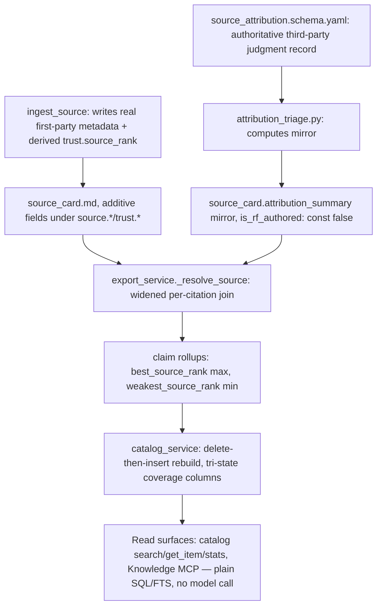

# Feature Brief & Metadata

**Feature Name:**

> Source Metadata Capture & Propagation (Phases A+B)

**Filepath Name:**

> `source-metadata-propagation-v1` (kebab-case)

**Date:**

> 2026-08-02

**Author:**

> Claude (Sonnet 5), prd-writer

**Related Epic(s)/PRD ID(s):**

> Follow-on from the `source-metadata-propagation` pre-commitment exploration (verdict: conditional). H5 estimation anchor: `rights-entity-model-v1` (merged `17a2cb0`).

**Related Documents:**

> - Exploration charter, feasibility brief, proposed ADR, and three leg SPIKEs (tech/risk/prior-art) — see frontmatter `related_documents`.
> - H5 anchor: `docs/project_plans/PRDs/infrastructure/rights-entity-model-v1.md` and `docs/dev/architecture/adr-rights-entity-model.md`.

---

## 1. Executive Summary

RF records source-quality signals write-only today: `trust.source_rank` is hardcoded to `"unknown"` on every ingested card (`source_cards.py:331-338`), `ingest_source()` has no parameter for structured provider metadata (`:178-192`), and third-party judgments about a source (citation counts, rankings, backlinks) have no owning entity at all. This PRD threads real first-party metadata into capture, widens the already-existing export-time hydration join (`export_service._resolve_source()`, `:601-661`) to propagate a richer attribute set to claims and reports, and adds a new `source_attribution` entity — shaped on the landed `rights-entity-model` — for third-party judgments, governed by a new fail-closed guard rule. It covers **Phases A+B only** of the exploration's conditional verdict; Phase C (live third-party ingestion) is out of scope, deferred behind a licensing precondition (see §7 DEF-1).

**Priority:** P2 (high risk, infrastructure)

**Key Outcomes:**
- Outcome 1: Source-quality signals become queryable/filterable attributes on claims and in the catalog, instead of permanently inert write-only fields.
- Outcome 2: A new `source_attribution` entity gives third-party judgments about a source their own provenance, without any risk of being mistaken for an RF-authored fact.
- Outcome 3: The 7 committed pediatric-CDS bundles are proven — by a live `rf verify` run, not a code trace — to keep verifying across the schema change.

---

## 2. Context & Background

### Current State

`services/source_cards.py::ingest_source` hardcodes `source.authors: []`, `source.publisher: None`, `source.version: None`, `trust.source_rank: "unknown"` at write time (`:322-338`), even though all of these fields already exist in `schemas/source_card.schema.yaml`. `ingest_source()`'s signature (`:178-192`) takes bare extracted `content: str` with no parameter for structured provider metadata, so metadata already present in `services/search_router/` provider responses is discarded at a Python call boundary — not rejected by a schema. Separately, `export_service._resolve_source()` (`:601-661`, fed by `_load_source_cards()` at `:580-598`) already performs a deterministic per-citation join that hydrates `title`/`source_type`/`url`/`trust`/`usage`/`sensitivity`/`quote`/`summary` onto a claim's citation — but nothing downstream queries the hydrated set as a first-class, filterable attribute. `authority_score()` exists (`ranking.py:19-43`) with no call site; `rf_deep_reader`'s `credibility_score` output is read by no code.

### Problem Space

Report authors and operators cannot filter, sort, or triage evidence by anything but claim text. A primary peer-reviewed source and an unranked one are indistinguishable except by reading prose, because `trust.source_rank` defaults every card to `unknown` forever. Third-party judgments about a source (citation counts, rankings) have no owning entity, no provenance model, and no path to becoming a governed, queryable attribute without risking being read as an RF-attested fact.

### Current Alternatives / Workarounds

None. There is no existing mechanism to capture or surface source-quality signals beyond the inert `trust.source_rank` field and prose in the report body.

### Architectural Context

RF is a Markdown/YAML-first control plane: schemas are Draft 2020-12 JSON Schema authored as YAML at `schemas/*.schema.yaml`, validated at ingest time only (`source_cards.py::_validate`, called from `:379`) — `rf verify` does **not** re-validate the general `source_card` schema; it only hard-gates the nested `pediatric_cds` block (`verification.py:66, :557-580`, `ExitCode.SCHEMA(2)`). The catalog (`catalog_service.py`) is a derived-by-construction SQLite+FTS5 read model, rebuilt delete-then-insert per run from `export_data` (`:1341-1349`) — no incremental migration path exists, so every attribute reaching the catalog is a rebuild-from-files projection. The landed `rights-entity-model` (ADR `docs/dev/architecture/adr-rights-entity-model.md`, merged `17a2cb0`) is the direct precedent for this feature's shape: a new authoritative entity (`rights_record`), a denormalized non-authoritative mirror on the source card (`rights_summary`, `mirror_is_authoritative: const false`), a time-parameterized divergence validator (`check_rights_divergence(as_of=...)`, never reading the wall clock), and a fail-closed governance guard (`no_agent_cleared_rights_value`) proven by negative tests over named write paths.

**Preserved dissent** (recorded per orchestrator adjudication, not re-litigated here): the prior-art leg recommended extending `source_assertion.schema.yaml` with a sibling `third_party_assertions[]` block rather than authoring a new top-level entity. This was overruled — see frontmatter `decisions` for the rejected-but-preserved rationale.

---

## 3. Problem Statement

**User Story Format:**
> "As an RF report author or operator, when I need to triage or filter evidence by source quality, I currently cannot — every card reads `source_rank: unknown` and third-party judgments about a source have no representation at all — instead of being able to query/filter/sort claims and sources by a governed, provenance-carrying attribute set."

**Technical Root Cause:**
- `ingest_source()` discards structured provider metadata at the Python call boundary (`source_cards.py:178-192, :322-338`).
- `export_service._resolve_source()` hydrates a thin attribute set; nothing widens it or consumes it as filterable (`export_service.py:601-661`).
- No entity exists to own a third-party judgment about a source with its own provenance (`_RIGHTS_GOVERNED_FIELDS`, `governance.py:35-40`, is structurally blind to any such field even if one existed).

---

## 4. Goals & Success Metrics

### Primary Goals

**Goal 1: Make source-quality signals real, not hardcoded**
- `trust.source_rank` is a derived value, not a permanent `"unknown"` default; first-party identifiers (DOI/PMID/authors/publisher/version) are captured, not discarded.

**Goal 2: Propagate deterministically, at export, with no read-path model call**
- Widen the existing `_resolve_source()` join; add claim-level rollups; keep the catalog derived-by-construction with zero incremental migration risk.

**Goal 3: Give third-party judgments an owning entity, governed fail-closed**
- New `source_attribution` entity + non-authoritative mirror + divergence validator + governance guard, all provably safe with **zero** live third-party records present (Phase C ships none).

### Success Metrics

See frontmatter `success_metrics` for the full machine-readable list. Summary:

| Metric | Baseline | Target | Measurement Method |
|--------|----------|--------|---------------------|
| Cards with real first-party metadata at ingest | 0% (hardcoded empty) | 100% of new ingests | `ingest_source` post-condition test |
| Claims with `best_source_rank`/`weakest_source_rank` | 0% (fields don't exist) | 100% of claims with >=1 resolved citation | export-run determinism test |
| `pediatric_cds.<new_key>` emissions | untested | 0 | dedicated unit test |
| Live `rf verify` pass on 7 pediatric bundles | untested (code-trace only) | pass, pre- and post-change | CI gate, pre-merge |
| Agent-writable `is_rf_authored: true` / null-evidence third-party writes | ungoverned | 0, proven | negative test suite |

---

## 5. User Personas & Journeys

**Primary Persona: RF Capture/Discovery Agent (automated)**
- Role: `ingest_source()`/discovery-swarm caller.
- Needs: emit real, structured first-party metadata and a defensible `source_rank` without any read-path cost.
- Pain points today: metadata is discarded at a Python call boundary; `source_rank` is a permanent lie.

**Secondary Persona: RF Report Author / Reviewer (human or agent)**
- Role: triages evidence, builds reports, queries the catalog/Knowledge MCP.
- Needs: filter/sort by source quality with an honest coverage signal (never confusing "not yet assessed" with "assessed and found nothing").
- Pain points today: no such attribute exists to filter or sort by at all.

---

## 6. Requirements

### 6.1 Functional Requirements — Phase A (capture + propagation, ~24 pts)

| ID | Requirement | Priority | Notes |
| :-: | ----------- | :------: | ----- |
| FR-1 | `ingest_source()` accepts and writes structured first-party metadata (authors, DOI/PMID/ISBN identifiers, publisher, version, published_at) into the already-modeled `source.*` fields. | Must | `source_cards.py:178-192, :308-363`; provider payloads via `services/search_router/`. Depends on OQ-1. |
| FR-2 | `trust.source_rank` is derived deterministically at capture time, replacing the permanent `"unknown"` hardcode. | Must | `source_cards.py:332`. See OQ-4 — if derivation needs a model call, it MUST stay write-path-only and record extraction provenance; never a read-path call. |
| FR-3 | `export_service._resolve_source()` is widened to hydrate the new first-party attribute set alongside the existing `trust`/`usage` attachment, per citation. | Must | `export_service.py:580-598, :601-661`. Pure dict join; no model, no network, no clock. |
| FR-4 | Claim-level rollups `best_source_rank` (max) and `weakest_source_rank` (min) are computed post-resolve over the ordered enum `primary\|secondary\|tertiary\|unknown`. | Must | `export_service.py`, post-`_resolve_source`. Both rollups ship together — neither is a replacement for the other (see frontmatter decision on aggregation). |
| FR-5 | Cross-source numeric attribution values (e.g. citation/backlink counts) propagate as a set-union keyed by `(asserter_id, assertion_kind)` only. No averaging or summing across `assertion_kind`s is implemented anywhere in the propagation path. | Must | Refused explicitly — see decisions. |
| FR-6 | The catalog gains queryable columns for the widened attribute set via the existing delete-then-insert-per-run rebuild path. | Must | `catalog_service.py:557-572, :850-889`. Depends on OQ-2 (migration path). |
| FR-7 | Every query/filter surface exposing a new attribute reports tri-state coverage (`present \| absent \| not-yet-assessed`) and an explicit "N of M sources have this attribute" summary, shipped in the **same** release as the first such surface. | Must | Hard precondition of go, not a follow-up — see decisions. Target surfaces: catalog `search`/`get_item`/`stats` (`catalog_service.py:1461, :1772, :1923`) and Knowledge MCP read entry points (`knowledge_access.py:1598, :1626`). |
| FR-8 | No backfill of existing source cards. Pre-existing cards read as `not-yet-assessed`, never conflated with a verified-absent/zero value. | Must | Design invariant, not a migration chore. |
| FR-9 | A unit test asserts the ingest/export writer never emits a key under `pediatric_cds.<new_key>` for any field introduced by this feature. | Must | Proves the namespace constraint (NFR-1) is not merely a convention. |
| FR-10 | A live `rf verify` run against all 7 committed pediatric bundles passes, pre- and post-change, as a pre-merge gate. | Must | `runs/rf_run_20260717_{reg_001,reg_004,rf_cbc_001,rf_cbc_002,rf_ev_001,rf_gro_002,rf_kid_001}_pediatric_cds_*`, via `./scripts/rf-data`. The exploration only code-traced this claim; it must be executed before merge. |

### 6.2 Functional Requirements — Phase B (attribution entity + governance, ~14 pts)

| ID | Requirement | Priority | Notes |
| :-: | ----------- | :------: | ----- |
| FR-11 | New authoritative `schemas/source_attribution.schema.yaml` records a third-party judgment about a source, subject-anchored on `source_card_id` (+ optional `source_edition_id`) — never on a claim. | Must | Shaped on `rights_record.schema.yaml`; `additionalProperties: false` at the top level. The schema also enforces `if asserted_by.asserter_type startsWith third_party_ then retrieval_evidence_ref required` — this conditional is the PRIMARY provenance control (see FR-20); the name-based guard (FR-19) is defence-in-depth only. |
| FR-12 | A non-authoritative `attribution_summary` mirror is added to `source_card.schema.yaml`, carrying `is_rf_authored: const false` and a link-before-assert invariant (no non-default mirror value without >=1 linked `attribution_id`). | Must | Patterned on `source_card.schema.yaml:139-152, :310-372`'s `rights_summary`. |
| FR-13 | The `attribution_summary` mirror's own subtree is `additionalProperties: false` (fail-closed), matching the already-landed `rights_summary` precedent. All **other** new fields — `source.*` identifiers, `trust.*` fields, and the `asserted_by` sub-object inside `source_attribution` records — are authored `additionalProperties: true`. The closed+required `substitutability` block pattern (`source_card.schema.yaml:384-407`) is not reused anywhere. | Must | Resolves the risk leg's general "stay additive" guidance against the tech leg's C-3 fail-closed-mirror adjudication: the mirror closure is a deliberate, narrow exception mirroring `rights_summary`, not a reversion to `substitutability`. |
| FR-14 | `services/attribution_triage.py` computes the `attribution_summary` mirror from linked `source_attribution` records. | Must | Patterned on `rights_triage.py::compute_capture_rights_summary` (`:90-113`). Emits a typed `attribution_triage_failure` on structural failure, never a silent absence. |
| FR-15 | `check_attribution_divergence(as_of=...)` validates mirror-vs-record fidelity and link-before-assert; the function signature takes an injected `as_of` and contains no call to `datetime.now()`/`time.time()` anywhere in its implementation. | Must | Patterned on `rights_validation.py::check_rights_divergence` (`:128`). Proposed home: `services/attribution_validation.py`. |
| FR-16 | Every `source_attribution` record carries at minimum `{source, value, observed_at, license_basis}`. `license_basis` records which licensing-table finding (Crossref/OpenAlex/DataCite = CC0; Semantic Scholar = attribution-required; PubMed/NCBI = per-record only; Scopus/Web of Science = excluded) justified caching the value. | Must | Audit trail for a future ToS dispute — see risk leg §"Third-Party Terms". |
| FR-17 | `observed_at`/`valid_as_of` are fields distinct from the source card's own `accessed_at`. A refresh creates a **new** `source_attribution` record; an existing record is never overwritten in place. | Must | Mirrors `source_assertion.schema.yaml`'s `observed_at` (`:78`) discipline, applied to a mutable-world observation. |
| FR-18 | Every rendered surfacing of an attribution value is "N citations as of `<observed_at>`" — never a bare number. | Must | Applies to report/claim-view rendering of any `source_attribution`-sourced value. |
| FR-19 | A governance guard rule, `no_agent_authored_attribution_value`, blocks any agent-writable code path from writing a `source_attribution` record with `asserter_type: third_party_*` and a null `retrieval_evidence_ref`, and from ever writing `is_rf_authored: true` (schema-enforced `const false` backs this). | Must | `governance.py`, direct analogue of `no_agent_cleared_rights_value` (`:500-520`). **Defence-in-depth only** — see FR-20/FR-21 for the primary structural control. |
| FR-20 | The PRD documents that `_RIGHTS_GOVERNED_FIELDS` (`governance.py:35-40`) and `no_agent_authored_attribution_value` are **defence-in-depth ONLY**. A second field-name allowlist reproduces the original allowlist's blindness one level up — an agent can simply write `trust.third_party_citation_rank` instead of a guarded name. The **PRIMARY control is schema shape**: `source_attribution.schema.yaml`'s `additionalProperties: false` + conditional `retrieval_evidence_ref` requirement (FR-11), plus the value-free, recompute-only `attribution_summary` mirror (FR-12/FR-13, resolving OQ-3) that leaves no sibling value-bearing property to bypass into. | Must | States the governance gap this feature closes and why a name-based fix alone would be theatre. |
| FR-21 | A negative test in `tests/test_governance_adversarial.py` proves a **sibling-field bypass** — writing a third-party value under an unguarded field name (e.g. `trust.third_party_citation_rank`) instead of the name the guard rule recognizes — is rejected by schema shape. Removing the schema's `if/then` conditional and re-running the same test MUST turn the suite RED (non-vacuity proof). | Must | New requirement, closes the sibling-field bypass class named in FR-20. |

### 6.3 Non-Functional Requirements

**NFR-1 — Namespace constraint (hard invariant):**
- Every new field lands under `source.*`, `trust.*`, or a new top-level block. **Never inside `pediatric_cds`** — both `oneOf` branches of `pediatric_cds.schema.json` are `additionalProperties: false` and hard-gated `SCHEMA(2)` (`verification.py:66`); a key placed there breaks all 7 committed bundles. Proven by FR-9.

**NFR-2 — No read-path model call, no authoritative derived DB:**
- The catalog remains derived-by-construction (delete-then-insert per run); no incremental update path is introduced. Catalog/Knowledge MCP reads remain plain SQL/FTS. A write-path model call for `trust.source_rank` derivation (if OQ-4 resolves that way) does not violate this — the constraint is read-path-only.

**NFR-3 — Determinism (divergence validator):**
- `check_attribution_divergence` MUST be time-parameterized via an explicit `as_of` argument and MUST NEVER read wall-clock time internally. Two invocations with the same `as_of` and unchanged inputs MUST produce byte-identical output.

**NFR-4 — Tri-state coverage (cross-cutting):**
- No filterable/queryable surface introduced by this feature may collapse "not yet assessed" and "assessed, found nothing" into a single falsy state. This applies to every surface named in FR-7.

**NFR-5 — No-backfill invariant:**
- Nothing in Phase A or B triggers a backfill sweep over pre-existing source cards. Absence on a pre-existing card is always `not-yet-assessed`.

**NFR-6 — Existing bundles keep verifying:**
- The general `source_card` schema is not re-validated by `rf verify` (only ingest-time `_validate` and the closed `pediatric_cds` block are checked). This feature's additive changes must not introduce a new `rf verify` check that inspects unrecognized keys.

**NFR-7 — Exported contract is versioned (new):**
- Any change to the shape of `export_run()`'s output MUST bump `docs/dev/architecture/rf-run-export-schema.json`'s version and ship a legacy fixture — captured pre-change — that still validates against the bumped schema, regression-tested in `tests/test_schema_validation.py`. Applies to M1's widened hydration and to any later change that alters export shape.

**Observability:**
- `attribution_triage.py` writes append to the existing run-trace mechanism (same pattern as `ingest_source`'s trace append). `check_attribution_divergence`'s `as_of` value is logged alongside its verdict.

---

## 7. Scope

### In Scope

- **Phase A**: real first-party source metadata threaded into `ingest_source()`; deterministic `trust.source_rank` derivation; export-time propagation via `export_service._resolve_source()`; claim-level rollups (`best_source_rank`/`weakest_source_rank`); catalog columns + tri-state query surface; regression over the 7 committed pediatric bundles.
- **Phase B**: `schemas/source_attribution.schema.yaml` (authoritative) + non-authoritative `attribution_summary` mirror; `attribution_triage.py`; `check_attribution_divergence(as_of=...)`; governance guard rule `no_agent_authored_attribution_value`.

### Out of Scope / Deferred

| ID | Item | Why deferred | Where recorded |
| :-: | ---- | ------------- | --------------- |
| DEF-1 | Phase C: third-party live ingestion (fetch path + `rf attribution` CLI, ~8 pts) | **`defer-until: per-provider license terms verified for bundle redistribution.`** Propagation architecture is proven independent of what feeds it; ingestion itself is the licensing-gated piece. | Feasibility brief §7; tech-findings.md item 10 |
| DEF-2 | Scopus / Web of Science & journal-ranking vendors (JCR, SCImago) | Proprietary, contractual terms explicitly prohibit caching/redistributing derived data without a paid license RF does not hold. Procurement precondition. | risk-findings.md §"Third-Party Terms" |
| DEF-3 | Semantic Scholar / PubMed ingestion | Needs the attribution mechanism (Phase B) proven first; unblocked once B lands. Attribution and per-record-only terms respectively make these usable, but not until an owning entity exists to carry the provenance. | risk-findings.md §"Third-Party Terms" |
| DEF-4 | `writeback.build_bundle()` attribution count/staleness summary in the bundle manifest | Not needed for correctness — the export join is already the mechanism; a manifest summary is reviewer legibility, not a requirement. | tech-findings.md OQ-3 |
| DEF-5 | Exhaustive downstream-consumer audit for silent-drop-of-new-fields (catalog, run-export hand-listed key allowlists) | Flagged by the risk leg, not chased to ground in the exploration; confirm during implementation whether any allowlist bump is needed. | risk-findings.md risk register |
| DEF-6 | Live ToS re-verification for Semantic Scholar / NCBI | **Verification performed 2026-08-06; gate still OPEN** (closure is human-only — `governance.py` rule 9). Nine live pages retrieved and quoted in `def-6-tos-verification-2026-08-06.md`. The pass corrected rather than confirmed the table: Semantic Scholar licensing is per-dataset and may be CC BY-NC (the prior blanket "ODC-BY" claim is withdrawn), and NCBI's supposed bulk-redistribution-as-substitute-product prohibition was unsupported by any live page. Not legal advice. | `def-6-tos-verification-2026-08-06.md`; risk-findings.md Confidence section |

`deferred_items_spec_refs: []` — none of the six items above warrant a separate design-spec artifact; each is fully captured by its exploration-artifact citation. `findings_doc_ref: null`.

### Dependencies & Assumptions

**Internal Dependencies:**
- `services/source_cards.py::ingest_source` — capture-time wiring hook point.
- `services/export_service.py::_resolve_source`/`_load_source_cards` — propagation join.
- `services/catalog_service.py` — derived read-model rebuild path.
- `services/governance.py::guard_check` — new rule slot alongside `no_agent_cleared_rights_value`.
- `services/rights_triage.py` / `services/rights_validation.py` — direct structural precedents for `attribution_triage.py` / `attribution_validation.py`.
- `schemas/source_card.schema.yaml`, `schemas/rights_record.schema.yaml` (pattern source).
- `services/search_router/providers/*` — existing provider metadata (Phase A wiring target; no new fetch capability added).

**External Dependencies:**
- None new in Phase A/B. No third-party API is fetched by this feature — that capability is Phase C (DEF-1). Phase A only wires *already-returned* provider metadata into the source card.

**Assumptions:**
- RF's search-router providers currently return DOI/authors/publisher metadata somewhere in their response payload even though `ingest_source()` discards it today (OQ-1 unresolved; if false, FR-1's cost grows but scope does not change).
- The catalog's sqlite schema is rebuild-only (OQ-2 unresolved; if an incremental migration path exists, FR-6's cost changes but the design does not).
- `trust.source_rank` can be derived deterministically at capture time without a model call (OQ-4 unresolved; if a model call is needed, it stays write-path-only per NFR-2).
- Zero third-party `source_attribution` records exist in the corpus at the end of Phase B (no fetch path ships). Phase B's schema and governance surface must be provably safe with zero records present — matching the proposed ADR's own Consequences framing.

**Feature Flags:**
- None. This is additive schema/service surface; no user-facing behavior change is flag-gated.

---

## 8. Risks & Mitigations

| Risk | Impact | Likelihood | Mitigation |
| ----- | :----: | :--------: | ---------- |
| New fields land inside `pediatric_cds` | High | Low | Hard namespace rule (NFR-1) + unit test (FR-9) |
| No-backfill leaves pre-existing cards silently reading "no data" indistinguishable from "verified zero" | Medium-High | High (certain, by construction) | Tri-state coverage shipped with the first query surface, hard precondition of go (FR-7, FR-8, NFR-4) |
| Agent-writable path mints a third-party rating that reads as RF-attested fact | High | Medium | `no_agent_authored_attribution_value` guard + `is_rf_authored: const false` + co-located `source`/`observed_at` on every value (FR-16, FR-19) |
| `_RIGHTS_GOVERNED_FIELDS` allowlist gap looks like coverage it does not provide | High | Medium | FR-20: primary control is schema shape (`additionalProperties:false` + `if/then`), not a second name list; FR-21's sibling-field bypass negative test proves the name-based rule alone would be theatre |
| Claims about the 7 pediatric bundles are code-trace only, never executed | Medium | Medium | Live `rf verify` pre-merge gate (FR-10), not a follow-up |
| Downstream consumers (catalog, run-export) hand-list keys and silently drop new fields | Low-Medium | Low | Flagged, not chased to ground — audit deferred (DEF-5); confirm during implementation whether any allowlist needs a bump |
| `trust.source_rank` derivation may not be fully deterministic (OQ-4) | Medium | Medium | Split into its own task; if a model call is required, keep it write-path-only and record extraction provenance |
| Catalog sqlite migration path unknown (OQ-2) | Medium | Medium | Resolve during implementation-plan authoring; FR-6's estimate may move |
| Third-party ToS/licensing violation via cached+redistributed data | Medium | Medium (source-dependent) | Out of scope for A/B (zero live ingestion); DEF-1/DEF-2/DEF-3 name the gating precondition explicitly for Phase C |

---

## 9. Target State (Post-Implementation)

**User Experience:**
- An RF capture agent ingesting a source gets real first-party metadata and a derived `source_rank` with zero additional calls.
- A report author can filter/sort claims by `best_source_rank`/`weakest_source_rank` and see an honest "N of M sources assessed" coverage line — never a misleading zero.
- No path exists — for a human or an agent — to write a third-party judgment that reads as an RF-authored fact.

**Technical Architecture:**
- `ingest_source()` writes real `source.*`/`trust.*` fields; `export_service._resolve_source()` hydrates the widened set per citation; the catalog exposes queryable columns via its existing rebuild path. `schemas/source_attribution.schema.yaml` exists as an authoritative record type with a fail-closed `attribution_summary` mirror on `source_card`; **zero live records exist** (no fetch path ships in this scope).
- Schema shape (`additionalProperties: false` + a conditional `retrieval_evidence_ref` requirement) is the PRIMARY provenance control; the governance guard `no_agent_authored_attribution_value` sits alongside `no_agent_cleared_rights_value` in `governance.py` as defence-in-depth only.

**Observable Outcomes:**
- All 7 pediatric bundles verify cleanly under a live `rf verify` run.
- `pytest` proves: no `pediatric_cds.<new_key>` emission, divergence-validator determinism, and zero agent-writable paths to an RF-attested-looking third-party value.

---

## 10. Overall Acceptance Criteria (Definition of Done)

### Capability A1 — Capture wiring
- [ ] `ingest_source()` writes real `source.authors`/`source.publisher`/`source.version`/`source.locator.doi` (or equivalent identifiers) instead of hardcoded empty values (FR-1).
- [ ] `trust.source_rank` is a derived, non-`"unknown"`-by-default value for newly ingested sources where derivation is possible (FR-2).

### Capability A2 — Propagation + rollups
- [ ] `export_service._resolve_source()` hydrates the widened attribute set per citation; two successive `export_run` invocations with unchanged inputs produce byte-identical hydrated output (FR-3).
- [ ] `best_source_rank`/`weakest_source_rank` are present on every claim with >=1 resolved citation (FR-4).
- [ ] No code path anywhere in the propagation chain averages or sums a numeric value across `assertion_kind`s (FR-5).
- [ ] Any change to the exported payload shape versions `rf-run-export-schema.json` with a legacy fixture that still validates (NFR-7).

### Capability A3 — Catalog + tri-state coverage
- [ ] Catalog exposes the widened attribute set as queryable columns via the existing rebuild path (FR-6).
- [ ] `catalog_service.search`/`get_item`/`stats` and the Knowledge MCP read entry points report tri-state coverage with an "N of M sources have this attribute" summary (FR-7, verified_by: this checklist item).

### Capability A4 — Regression safety
- [ ] A unit test proves the writer never emits `pediatric_cds.<new_key>` (FR-9).
- [ ] A live `rf verify` run against all 7 committed pediatric bundles passes pre- and post-change (FR-10) — recorded in CI, not asserted from a code trace.

### Capability B1 — Attribution entity
- [ ] `schemas/source_attribution.schema.yaml` exists, registers in `SchemaRegistry`, and has valid/invalid instance builders (FR-11).
- [ ] `attribution_summary` mirror exists on `source_card.schema.yaml` with `is_rf_authored: const false`, its own subtree `additionalProperties: false`, and a passing link-before-assert negative test (FR-12, FR-13).
- [ ] `attribution_triage.py::compute_attribution_summary` produces the mirror from linked records, with a typed failure record on structural failure (FR-14).
- [ ] `check_attribution_divergence(as_of=...)` is time-parameterized; a monkeypatch test asserts it never calls `datetime.now()`/`time.time()`; two runs with the same `as_of` are byte-identical (FR-15).
- [ ] Every `source_attribution` instance builder in tests carries `{source, value, observed_at, license_basis}` at minimum (FR-16).
- [ ] A refresh test proves a new record is created and the old one is never overwritten (FR-17).

### Capability B2 — Governance guard
- [ ] `no_agent_authored_attribution_value` blocks any agent-writable write of `asserter_type: third_party_*` with a null `retrieval_evidence_ref`, and any attempted `is_rf_authored: true` write — both proven by negative tests (FR-19, defence-in-depth).
- [ ] The PRD documents that the PRIMARY provenance control is schema shape (`additionalProperties:false` + `if/then`), not the name-based guard rules, which are defence-in-depth only (FR-20).
- [ ] A sibling-field bypass attempt is rejected by schema shape, not just the name-based guard; removing the schema `if/then` turns the suite RED (FR-21).

### Global
- [ ] No agent-writable code path can produce an attribution value that reads as RF-authored fact.
- [ ] No capability introduced in this feature performs a live third-party fetch (Phase C is out of scope).
- [ ] `pytest` (via `./.venv/bin/python -m pytest`, per repo convention) passes for all new/modified test files.

---

## 11. Assumptions & Open Questions

### Assumptions

See §7 Dependencies & Assumptions above.

### Open Questions

See frontmatter `open_questions` for the machine-readable OQ-1, OQ-2, OQ-4 ledger (three open, carried forward — not guessed at in this PRD). Human-readable restatement:

- [ ] **OQ-1**: Which search-router providers actually return DOI / citation counts / structured author lists today? FR-1's estimate rests on this.
- [ ] **OQ-2**: Does the catalog sqlite schema have an established migration path, or is it rebuild-only? Affects FR-6's estimate.
- [ ] **OQ-4**: Is `trust.source_rank` derivable deterministically, or does it need a write-path model call? Affects FR-2's implementation and whether it stays in Phase A's critical path.

**OQ-3 is RESOLVED, not open** — see frontmatter `decisions`: `attribution_summary` carries `attribution_ids`, counts, and the monotone rollups ONLY, never a raw third-party value, and is recompute-only from authoritative records at export.

Note: the tech leg's own OQ-5 (whether the owning-entity choice depends on the Reusable Assertion Ledger's attestation lifecycle) is **resolved, not carried forward** — the ledger is disqualified on subject-anchoring before attestation is reached (see frontmatter decision 1).

---

## 12. Appendices & References

### Related Documentation

- Exploration bundle: charter, feasibility brief, proposed ADR, and three leg SPIKEs — see frontmatter `related_documents`.
- H5 anchor: `docs/project_plans/PRDs/infrastructure/rights-entity-model-v1.md`, `docs/dev/architecture/adr-rights-entity-model.md`.

### Prior Art

- RF's existing non-authoritative mirror precedent: `source_card.schema.yaml`'s `rights_summary` (`:139-152`).
- RF's existing time-parameterized divergence-validator precedent: `rights_validation.py::check_rights_divergence` (`:128`).
- RF's existing fail-closed governance-guard precedent: `governance.py::no_agent_cleared_rights_value` (`:500-520`).

---

## Schema Contracts (Reference)

Compact field shape — full JSON Schema authoring is an implementation-plan task, not restated here.

**`source_attribution.schema.yaml`** (new, authoritative, `additionalProperties: false` at top level):

| Field | Type | Notes |
|---|---|---|
| `attribution_id` | string | `attr_...` |
| `subject.source_card_id` | string | required — subject is a SOURCE, not a claim |
| `subject.source_edition_id` | `[string, null]` | optional, edition-specific judgments |
| `asserted_by.asserter_id` | string | e.g. `openalex`, `crossref`, `semantic_scholar`, `manual_operator` |
| `asserted_by.asserter_type` | enum | `third_party_service \| third_party_publication \| operator` |
| `asserted_by.retrieved_at` | date-time | |
| `asserted_by.retrieval_method` | enum | `api \| file_import \| manual_entry` |
| `asserted_by.retrieval_evidence_ref` | `[string, null]` | **required non-null when `asserter_type == third_party_*`**, enforced by schema `if/then` (PRIMARY control, FR-11/FR-20) — `no_agent_authored_attribution_value` (FR-19) is defence-in-depth only |
| `asserted_by.terms_ref` | `[string, null]` | licensing lineage for the cached value |
| `asserted_by.valid_as_of` | date-time | distinct from the card's `accessed_at` (FR-17) |
| `assertion_kind` | enum | `citation_count \| inbound_link_count \| rating \| rank \| index_membership \| retraction_notice \| other` |
| `value` | object | `{numeric: ...}` or `{label: ...}` / `{boolean: ...}` |
| `value_scale` | `[string, null]` | e.g. `unbounded_count`, `quartile` |
| `is_rf_authored` | `const: false` | hard governance invariant (FR-19) |
| `license_basis` | string | required — audit trail (FR-16) |

**`attribution_summary` mirror** (new; attached to `source_card`, `additionalProperties: false` on its own subtree — FR-13; value-free, recompute-only — resolves OQ-3):

| Field | Type | Notes |
|---|---|---|
| `mirror_is_authoritative` | `const: false` | |
| `attribution_ids` | `array<string>` | required non-empty whenever any mirror value below is non-default |
| `best_source_rank` | enum, default `unknown` | rollup, max over `primary\|secondary\|tertiary\|unknown` (FR-4) |
| `weakest_source_rank` | enum, default `unknown` | rollup, min over the same enum (FR-4) |
| `coverage_status` | enum | `present \| absent \| not_yet_assessed` (FR-7/NFR-4) — not a raw third-party value, consistent with OQ-3's resolution (ids/counts/rollups only) |

---

## Implementation

Detailed task breakdown is authored separately as a Tier 3 milestone Implementation Plan (`plan_ref` above), per this repo's plan doctrine (`references/plan-doctrine.md`) — routing constraints, not per-task model/agent pins, are declared there. This section names the forward milestone shape only.

**Milestone A1 — Capture is real:** FR-1, FR-2. A newly ingested source carries real first-party metadata and a derived `source_rank`.

**Milestone A2 — Propagation is queryable:** FR-3 through FR-10. Export hydrates the widened set with rollups; the catalog exposes it with tri-state coverage; the 7 pediatric bundles verify live.

**Milestone B1 — Attribution entity + governance:** FR-11 through FR-20. The entity, mirror, triage/validation services, and governance guard ship together, provably safe with zero live records.

**Routing note:** Milestone A2's `rf verify` regression gate and Milestone B1's governance-guard correctness are the surfaces most likely to warrant a `security`-lens second reviewer at plan-authoring time (irreversible-outward / authz-boundary triggers) — deferred to the implementation plan's per-milestone `gate_lens` classification, not decided here.

---

**Progress Tracking:**

See progress tracking (to be created after implementation plan): `.claude/progress/source-metadata-propagation/all-phases-progress.md`
