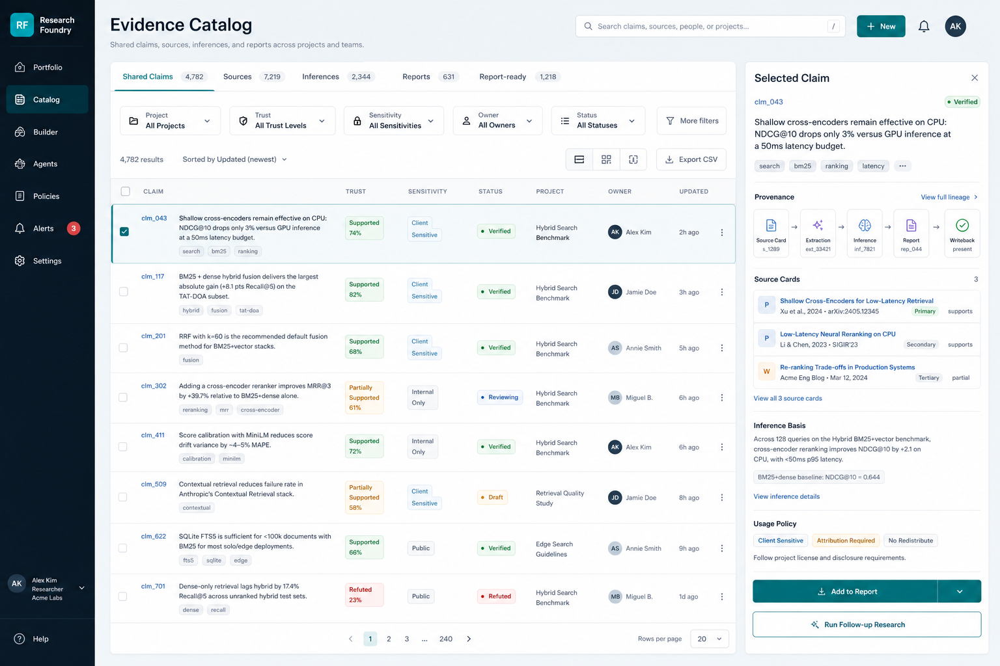
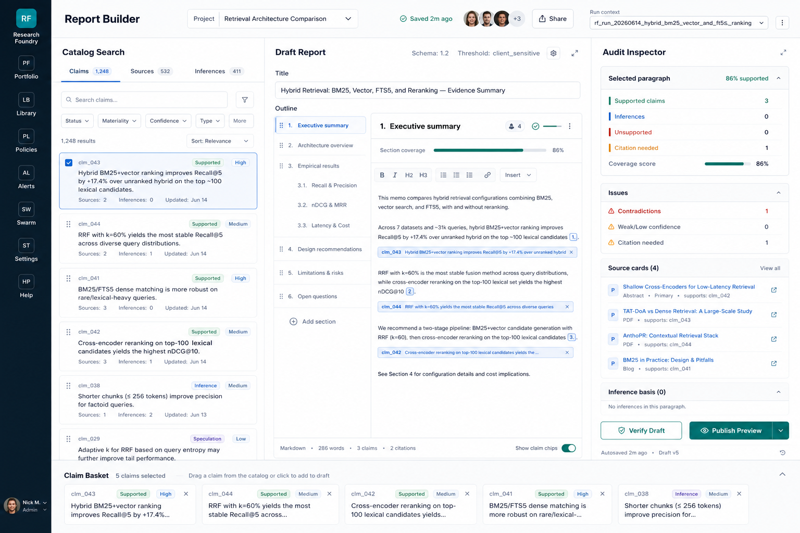
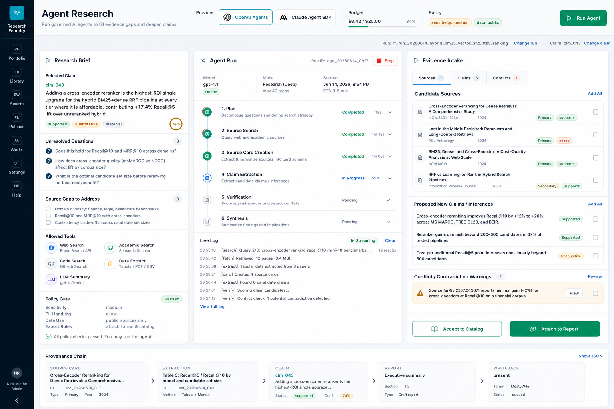

# Research Foundry Public Multi-User Release Handoff Spec

## 1. Intent

Research Foundry should evolve from a read-mostly run viewer into a public,
multi-user evidence workspace. The next release should let teams search,
review, reuse, and extend a shared catalog of claims, source cards,
inferences, reports, and writeback-ready artifacts.

This spec preserves the core Research Foundry contract:

- Markdown/YAML artifacts remain durable research truth.
- `run.json` remains the deterministic, denormalized read contract for a run.
- The recall path stays deterministic; no model call is required to render
  claims, sources, report text, audit status, or provenance.
- Agents may propose new evidence, claims, and report edits, but catalog/report
  mutation is explicit, governed, attributable, and auditable.

The requested product additions are:

- A shared catalog of claims, sources, inferences, report sections, writebacks,
  and reusable research artifacts.
- A stronger report audit function with paragraph/span-level claim links and
  precise provenance navigation.
- A report builder that composes reports from catalog claims, sources, and
  inferences while showing coverage and risk before publication.
- Native embedded agent research jobs using a selected provider family,
  initially OpenAI Agents SDK or Claude Agent SDK, behind a server-owned
  provider abstraction.

## 2. Design References

Current-state screenshots captured from the live app:

- `docs/project_plans/design-specs/assets/public-multiuser-release/current-portfolio.png`
- `docs/project_plans/design-specs/assets/public-multiuser-release/current-library.png`
- `docs/project_plans/design-specs/assets/public-multiuser-release/current-audit.png`
- `docs/project_plans/design-specs/assets/public-multiuser-release/current-report.png`
- `docs/project_plans/design-specs/assets/public-multiuser-release/current-swarm.png`

Generated concept mockups created with the built-in `imagegen` tool:







Mockup direction:

- Keep the dark RF rail, light blue-gray canvas, white operational panels,
  compact dashboard density, and green/blue/amber/red trust language.
- Avoid marketing surfaces. The first screen should be a working evidence
  operations tool.
- Use cards only for repeated items, modals, or bounded tools. Avoid nested
  cards and decorative backgrounds.
- Treat the catalog, builder, and agent workspace as public-release product
  surfaces, not local operator debug panels.

## 3. Code-Truth Baseline

Frontend runtime truth:

- Real routes are `/runs`, `/runs/:runId`, `/library`, `/policies`,
  `/alerts`, `/settings`, and `/help`.
- `/runs/:runId/swarm` redirects to `/runs/:runId?view=swarm`; current detail
  tab normalization maps swarm to the context surface.
- The current shell is in `frontend/runs-viewer/src/app/AppShell.tsx`.
- The current detail experience is split between `RunDetailScreen`,
  `RunDetailModal`, and `RunDetailWorkspace`.
- Detail tabs include Overview, Trust, Audit, Report, Lineage, Context, and
  Writeback.
- The current audit surface is `ClaimAuditWorkbench`: left ledger, center
  report, right selected-claim inspector, plus selected-claim lineage.
- `ReportRenderer` converts `[claim:clm_NNN]` references into interactive
  claim chips and supports selected/composition highlighting.
- `ProvenanceModal` shows claim details, inference basis, and source cards.
- `LibraryScreen` is currently an artifact/output index, not a real shared
  evidence catalog.

Backend/domain truth:

- Canonical storage remains Markdown/YAML-first under runs, registries, and
  generated exports.
- Source cards are schema-backed artifacts under `runs/<run>/sources`.
- Claim ledgers support sources, inference basis, and report locations in the
  schema, but report locations are not yet a granular anchor system.
- `rf run export --json` emits denormalized `run.json` with resolved claim,
  source, and evidence graph plus sensitivity redaction on source evidence.
- The current API is a read-only runs API over exports:
  `/api/runs`, `/api/runs/{run_id}`, claims, and source lookup.
- Search Router exists as Python API, CLI, and MCP wrapper, but there is no
  product-level agent job/session API.
- Claude Agent SDK, GPT Researcher, PaperQA2, LiteLLM, and related adapters are
  mostly adapter-first or degrade-safe seams today, not a public app workflow.

Existing gaps:

- No tenant, team, user, membership, saved collection, catalog database, or
  role-based authorization model.
- No shared catalog API.
- No persisted report builder state or draft revision model.
- No paragraph/span-level report link index.
- No server-managed agent job model, streaming run events, provider credential
  isolation, or acceptance workflow.
- `report_draft` is exported verbatim. Public sharing needs report-body
  sensitivity validation, not only source evidence redaction.

## 4. Product Principles

Evidence-first:

- Every material report claim must resolve to a catalog claim or be visibly
  labeled inference/speculation.
- Evidence gaps are product objects. They can be assigned, researched, ignored,
  or accepted, but not hidden.

Shared but governed:

- Catalog items carry workspace/project ownership, visibility, sensitivity,
  usage restrictions, and review state.
- Public release defaults should be conservative: least privilege, no raw
  sensitive evidence leakage, and visible policy gates before sharing.

Composition over regeneration:

- The report builder should assemble from cataloged claims and sources first.
- LLMs can draft connective prose and propose improvements, but they should not
  silently create unsupported material claims.

Agents propose; humans accept:

- Embedded agents should produce candidate source cards, extracted points,
  claims, inferences, contradiction flags, and report patches.
- The app must require explicit user acceptance before those outputs become
  catalog records or report content.

## 5. Target Information Architecture

Recommended top-level navigation:

| Route | Label | Purpose |
| --- | --- | --- |
| `/runs` | Portfolio | Run-level operational overview and modal-first run review. |
| `/catalog` | Catalog | Shared cross-run catalog of claims, sources, inferences, reports, and reusable outputs. |
| `/builder` | Builder | Report drafting and evidence composition workspace. |
| `/agents` | Agents | Native governed research jobs, provider selection, job history, and intake review. |
| `/policies` | Policies | Governance, sensitivity, usage rules, and review requirements. |
| `/alerts` | Alerts | Claim contradictions, stale source alerts, failed jobs, review queues. |
| `/settings` | Settings | Workspace, provider, API, data path, appearance, and auth settings. |
| `/help` | Help | Product help and implementation docs. |

`/library` can either redirect to `/catalog` or become a sub-view named
"Reusable Outputs" under Catalog. Do not keep both as overlapping top-level
concepts.

## 6. Feature Area A: Shared Evidence Catalog

### User Outcomes

- Search claims, source cards, inferences, reports, and reusable outputs across
  runs and projects.
- Filter by project, source type, trust, sensitivity, status, owner, reviewer,
  age, and usage policy.
- Open a selected claim and see its complete provenance, source cards,
  inference basis, report usage, contradictions, and downstream writebacks.
- Add catalog items to a report draft or launch follow-up research from a gap.
- Save collections for later report composition or review.

### Catalog Item Model

Create a normalized shared catalog read/write model without replacing run
exports. Suggested core records:

- `workspace`
- `user`
- `workspace_membership`
- `project`
- `catalog_item`
- `catalog_claim`
- `catalog_source`
- `catalog_evidence_point`
- `catalog_inference`
- `catalog_report`
- `catalog_report_block`
- `catalog_report_claim_link`
- `catalog_collection`
- `catalog_collection_item`
- `catalog_review`
- `catalog_audit_event`

Minimal `catalog_item` fields:

| Field | Notes |
| --- | --- |
| `catalog_item_id` | Stable ID, not tied to a run-local ID. |
| `item_type` | `claim`, `source`, `evidence_point`, `inference`, `report`, `report_block`, `writeback`, `reusable_output`. |
| `workspace_id` | Required for multi-user isolation. |
| `project_id` | Optional but recommended for filtering. |
| `source_run_id` | Nullable. Points back to the producing RF run when imported from `run.json`. |
| `source_artifact_ref` | YAML/Markdown path or content-addressed artifact key. |
| `local_ref` | Run-local ID such as `clm_043`, `src_...`, `ev_...`. |
| `title` | Human-readable display title. |
| `summary` | Short UI summary. |
| `sensitivity` | Public/personal/work/client sensitivity. |
| `visibility` | Private, workspace, project, public. |
| `status` | Draft, reviewing, verified, refuted, archived. |
| `created_by_user_id` | Required for public release. |
| `created_by_agent_job_id` | Nullable. Required for agent-created proposals. |
| `accepted_by_user_id` | Nullable until accepted. |
| `created_at`, `updated_at` | Required. |

Implementation note: for a public multi-user release, use a server-side
database for catalog/search/job state. Keep Markdown/YAML run artifacts as
durable research evidence and keep `run.json` as the run recall contract.

### Import Strategy

Phase 1 import can be deterministic:

1. Read `public/data/index.json` or live `/api/runs`.
2. Fetch each run's `run.json`.
3. Upsert catalog records for claims, resolved sources, evidence points,
   report draft, writebacks, and reusable outputs.
4. Preserve run-local IDs as aliases, not as global IDs.
5. Mark imported records as `origin=run_export`.

No LLM should be required for initial catalog indexing.

## 7. Feature Area B: Granular Report Audit

### Target Behavior

The current report audit already supports claim chips and selected-claim state.
The next version should add stable report anchors so reviewers can audit at the
paragraph, sentence, and span level.

Required interactions:

- Click any report claim chip to select the matching claim and scroll/open the
  selected-claim inspector.
- Click a claim in the catalog or ledger to highlight every report paragraph
  and span where it is used.
- Filter the report to show unsupported, contradicted, inferred, speculative,
  stale, or citation-needed material.
- Show per-section coverage: supported claims, inferences, unsupported claims,
  citation-needed spans, and contradiction count.
- Display exact source cards and evidence locators for the selected paragraph.
- Export an audit packet that includes report anchors, claim IDs, source IDs,
  verification status, and reviewer notes.

### Report Location V2

Extend the current `report_locations` idea into an explicit anchor model.

Suggested fields:

| Field | Purpose |
| --- | --- |
| `report_location_id` | Stable link ID. |
| `report_id` | Owning report. |
| `report_version_id` | Draft/final revision. |
| `claim_id` | Linked catalog or run claim. |
| `block_id` | Stable report block ID. |
| `section_id` | Stable section or heading slug. |
| `paragraph_id` | Stable paragraph ID. |
| `span_start`, `span_end` | Character offsets inside normalized paragraph text. |
| `quote_text_hash` | Hash of linked span for drift detection. |
| `relation` | Supports, contradicts, context, inferred_from, cited_nearby. |
| `citation_id` | Optional citation/footnote record. |
| `link_status` | Active, stale, missing_claim, missing_source, needs_review. |

Use a Markdown/MDX AST parser for report parsing and link extraction. Avoid
regex-only report rewriting for anything that affects persisted anchors.

### Verification Additions

Add deterministic checks:

- Every material paragraph has at least one supported claim link or is marked
  narrative/background.
- Every `[claim:...]` tag resolves to a run or catalog claim.
- Every report anchor still matches the current paragraph hash.
- Every public/shared report body passes sensitivity validation before export.
- Unsupported, contradicted, inference, and speculation links are visible in
  the report UI before publish.

## 8. Feature Area C: Report Builder

### User Outcomes

- Start a report from a template, a run, a catalog collection, or a blank draft.
- Search catalog claims/sources/inferences and add them to a Claim Basket.
- Drag or insert selected claims into report blocks.
- See coverage and risk while writing, not after the draft is complete.
- Verify the draft before publishing or writeback.
- Preserve report revisions and reviewer decisions.

### Builder State

Persist builder state separately from final Markdown:

- `report_draft_id`
- `report_version_id`
- `workspace_id`
- `project_id`
- `title`
- `audience`
- `sensitivity`
- `status`
- `blocks[]`
- `claim_links[]`
- `source_links[]`
- `comments[]`
- `review_state`
- `created_by`, `updated_by`

Report block fields:

- `block_id`
- `block_type`: heading, paragraph, table, quote, callout, evidence_summary.
- `order`
- `markdown`
- `linked_claim_ids`
- `linked_source_ids`
- `coverage_status`
- `risk_flags`

The final report can still export to Markdown with frontmatter, but the builder
needs structured draft state for collaboration, anchors, and review.

### Builder UI

Use the generated Report Builder mockup as the target:

- Left: catalog search with Claims, Sources, Inferences tabs and filters.
- Center: draft report outline and block editor with inline claim chips.
- Right: audit inspector with selected paragraph coverage, issue counts, source
  cards, inference basis, and publish gates.
- Bottom: Claim Basket for pending insertions.

Do not ship the builder as a blank Markdown editor. Its core value is evidence
composition with live audit state.

## 9. Feature Area D: Embedded Agent Research

### Provider Strategy

Use a provider abstraction:

```text
ResearchAgentProvider
  start_job(request) -> agent_job_id
  stream_events(agent_job_id) -> events
  cancel_job(agent_job_id)
  list_artifacts(agent_job_id)
  accept_artifacts(agent_job_id, selection)
```

Initial provider implementations:

- `openai_agents`: for server-owned orchestration, tools, guardrails,
  sessions, handoffs, tracing, and human review.
- `claude_agent_sdk`: for Claude Code as a library, built-in tools,
  permissions, sessions, MCP, hooks, and streaming.

External docs checked on 2026-07-04:

- OpenAI Agents SDK docs describe using the SDK when the application owns
  orchestration, tool execution, approvals, and state.
- OpenAI Agents SDK Python docs describe guardrails, tools, MCP integration,
  sessions, human-in-the-loop, tracing, and sandbox agents.
- Claude Agent SDK docs describe Claude Code as a library, programmable from
  Python and TypeScript, with built-in tools, MCP, permissions, sessions,
  hooks, and streaming.

Do not put provider credentials in the browser. All SDK calls must run on the
server side or in a controlled worker. User-scoped provider credentials must be
stored encrypted and resolved only inside the job runner.

### Agent Job Model

Core records:

- `agent_job`
- `agent_job_event`
- `agent_job_artifact`
- `agent_job_tool_call`
- `agent_job_approval`
- `agent_job_acceptance`

Minimum `agent_job` fields:

| Field | Notes |
| --- | --- |
| `agent_job_id` | Stable job ID. |
| `workspace_id`, `project_id` | Isolation and filtering. |
| `provider` | `openai_agents` or `claude_agent_sdk`. |
| `model_profile` | Existing RF model profile name when possible. |
| `request_kind` | Follow-up research, source discovery, contradiction check, report patch, verification. |
| `input_claim_ids` | Selected claims. |
| `input_source_ids` | Selected sources. |
| `input_report_id` | Optional report target. |
| `policy_snapshot` | Frozen policy used at launch. |
| `budget_usd`, `max_runtime_minutes` | Required guardrails. |
| `status` | Queued, running, waiting_for_approval, failed, canceled, completed, accepted. |
| `created_by_user_id` | Required. |

### Agent Workflow

The app should support this governed flow:

1. User selects a claim, report paragraph, source gap, or unresolved question.
2. User opens Agent Research.
3. App builds a research brief from selected context and policy gates.
4. User chooses provider, model profile, allowed tools, budget, and sensitivity.
5. Server starts an agent job.
6. Job streams events: plan, search, source intake, extraction, claim proposals,
   contradiction checks, verification, synthesis.
7. Candidate outputs appear in Evidence Intake.
8. User accepts selected outputs to Catalog and optionally attaches them to a
   report draft.

Agents must not directly publish to Catalog, Report, MeatyWiki, SkillMeat, or
CCDash without an explicit acceptance/writeback step.

## 10. API Surface

Keep the existing read-only runs API for run exports. Add public-release APIs
behind auth, workspace isolation, RBAC, and audit logging.

Suggested catalog endpoints:

```text
GET  /api/catalog/search
GET  /api/catalog/items/{catalog_item_id}
GET  /api/catalog/claims/{claim_id}
GET  /api/catalog/sources/{source_id}
POST /api/catalog/import/run/{run_id}
POST /api/catalog/collections
POST /api/catalog/collections/{collection_id}/items
PATCH /api/catalog/items/{catalog_item_id}
POST /api/catalog/items/{catalog_item_id}/review
```

Suggested report endpoints:

```text
POST /api/reports
GET  /api/reports/{report_id}
POST /api/reports/{report_id}/versions
PATCH /api/reports/{report_id}/blocks/{block_id}
POST /api/reports/{report_id}/claim-links
POST /api/reports/{report_id}/verify
POST /api/reports/{report_id}/publish-preview
```

Suggested agent endpoints:

```text
POST /api/agent-jobs
GET  /api/agent-jobs/{agent_job_id}
GET  /api/agent-jobs/{agent_job_id}/events
POST /api/agent-jobs/{agent_job_id}/cancel
POST /api/agent-jobs/{agent_job_id}/accept
```

Use SSE or WebSocket for job event streaming. SSE is sufficient for v1 if jobs
only stream server-to-client status and outputs.

## 11. Security, Sharing, and Public Release Gates

Auth and RBAC:

- Add workspace/team membership before any public multi-user release.
- Roles: owner, admin, researcher, reviewer, viewer.
- Mutations require role checks.
- Catalog visibility must be enforced server-side, not only hidden in UI.

Sensitivity:

- Source evidence redaction already exists in `run.json`; extend equivalent
  validation to report body, catalog summaries, generated snippets, and agent
  outputs before public sharing.
- Public/shared reports must fail verification if raw sensitive quotes appear
  outside governed source evidence fields.

Audit:

- Log all catalog mutations, report edits, agent launches, accepted artifacts,
  publish previews, and writebacks.
- Store enough context to answer: who changed what, based on which source, with
  which policy snapshot.

Agent permissions:

- Never expose raw credentials to the browser or to untrusted job artifacts.
- Each job has an allowlist of tools and data scopes.
- Human approval is required before file writes, writebacks, public sharing, or
  catalog acceptance.

## 12. Implementation Phases

### Phase 0: Product Grounding and Route Cleanup

Owner: `ui-engineer-enhanced`, `backend-architect`, `senior-code-reviewer`.

- Decide whether `/library` becomes `/catalog` or redirects to it.
- Update route metadata and shell labels to reflect the target IA.
- Document current read-only surfaces and which future buttons remain disabled.
- Add current screenshots and generated mockups to the design spec package.

Acceptance:

- No false top-level affordances.
- Current viewer behavior remains intact.
- Existing tests still pass.

### Phase 1: Shared Catalog Read Model

Owner: `python-backend-engineer`, `data-layer-expert`, `ui-engineer-enhanced`.

- Add server-side catalog storage.
- Add deterministic import from existing run exports.
- Add catalog search/list/detail APIs.
- Build `/catalog` as the current Library replacement.
- Show selected claim/source provenance and Add to Report/Run Follow-up actions
  as disabled or contextual until later phases are ready.

Acceptance:

- Catalog records can be rebuilt from current `run.json` exports.
- Run-local IDs are preserved as aliases.
- Search/filter works across claims, sources, inferences, and reports.
- Sensitivity and visibility are enforced server-side.

### Phase 2: Granular Report Audit Links

Owner: `python-backend-engineer`, `ui-engineer-enhanced`, `task-completion-validator`.

- Add `ReportLocationV2` or equivalent anchor model.
- Implement Markdown AST extraction for report blocks and claim spans.
- Persist anchors back to catalog/report state and expose them through APIs.
- Upgrade `ClaimAuditWorkbench` and `ReportOverlay` to paragraph/span coverage.

Acceptance:

- Selecting a claim highlights exact report usage locations.
- Selecting a paragraph shows linked claims/sources and issue status.
- Anchor drift is detected after report edits.

### Phase 3: Report Builder

Owner: `frontend-architect`, `ui-engineer-enhanced`, `python-backend-engineer`.

- Add persisted structured draft model.
- Build Builder route with catalog search, Claim Basket, report outline, block
  editor, and audit inspector.
- Add draft verification endpoint.
- Export final Markdown with frontmatter and stable claim links.

Acceptance:

- A user can create a report from catalog claims without direct file editing.
- Unsupported/inference/speculation risk is visible before publish.
- Draft revisions preserve anchors and audit history.

### Phase 4: Embedded Agent Research

Owner: `backend-architect`, `python-backend-engineer`, `ui-engineer-enhanced`,
`rf_governance_officer`.

- Add `ResearchAgentProvider` abstraction.
- Implement one provider first, then add the second after the job model is
  stable.
- Add agent job APIs, event streaming, artifact proposals, and acceptance flow.
- Integrate existing Search Router and source-card/claim extraction services.

Acceptance:

- User can run a governed follow-up research job from a selected claim or
  report gap.
- Job streams status and artifacts.
- Proposed outputs do not enter the catalog until accepted.
- Budget, sensitivity, and allowed-tool gates are visible and enforced.

### Phase 5: Public Multi-User Hardening

Owner: `security reviewer`, `backend-architect`, `senior-code-reviewer`,
`task-completion-validator`.

- Add full auth, RBAC, workspace isolation, audit logs, rate limits, and admin
  settings.
- Add public sharing and publish-preview gates.
- Add regression tests for sensitive report text, catalog visibility, job
  permissions, and writeback approvals.
- Run full E2E against static and live API modes.

Acceptance:

- A non-admin cannot view or mutate another workspace's private records.
- Public report export fails closed on sensitivity violations.
- Agent credentials never reach browser payloads.
- Catalog, builder, and agent workflows have E2E coverage.

## 13. Validation Plan

Frontend:

```sh
pnpm --dir frontend/runs-viewer test
pnpm --dir frontend/runs-viewer lint
pnpm --dir frontend/runs-viewer build
pnpm --dir frontend/runs-viewer exec playwright test
```

Backend:

```sh
pytest
python -m research_foundry --help
rf run export --json --all
rf serve --help
```

Public-release validation:

- Multi-user auth/RBAC tests.
- Catalog import idempotency tests.
- Report anchor drift tests.
- Sensitivity fail-closed tests for source evidence and report body.
- Agent job lifecycle tests: queued, running, streamed event, proposal,
  accepted, canceled, failed.
- Audit log tests for every mutation.

## 14. Open Questions

- Which auth provider should be used for public multi-user launch: local users,
  OAuth/OIDC, Clerk, Better Auth, or another provider?
- Should the first shared catalog use SQLite for homelab deploys and Postgres
  for public SaaS, or should Postgres be required from day one?
- Should `/library` remain as "Reusable Outputs" after `/catalog` ships?
- Should first agent provider be OpenAI Agents SDK or Claude Agent SDK?
- What is the minimum public sharing target: read-only report links, team
  workspace links, or external public URLs?
- Should accepted agent outputs write back to Markdown/YAML immediately, or
  should database catalog acceptance be the first durable state with file
  export as a separate action?

## 15. Fable 5 Handoff Prompt

Use this prompt to hand the work to Fable 5 or the next implementation agent:

```text
You are implementing Research Foundry public multi-user release v1.

Read:
- docs/project_plans/design-specs/public-multiuser-release-handoff-v1.md
- docs/dev/architecture/rf-run-export-schema.md
- frontend/runs-viewer/src/app/App.tsx
- frontend/runs-viewer/src/app/AppShell.tsx
- frontend/runs-viewer/src/screens/LibraryScreen.tsx
- frontend/runs-viewer/src/components/ClaimLedger/ClaimAuditWorkbench.tsx
- frontend/runs-viewer/src/components/ReportOverlay/ReportOverlay.tsx
- src/research_foundry/services/export_service.py
- src/research_foundry/api/routers/runs.py

Do not attempt the full release in one patch. Start with Phase 0 and Phase 1:
route/IA cleanup plus a deterministic shared catalog read model imported from
existing run exports. Preserve current run viewer behavior and existing
run.json semantics. Do not put model calls on the recall path. Preserve
unrelated dirty worktree changes.

Before implementing, write a short phase plan with files to touch, data model
choice, migration strategy, and tests. Use subagents for codebase exploration,
backend catalog storage/API, frontend catalog UI, and security review.
```

## 16. External References Checked

- OpenAI Agents SDK guide: https://developers.openai.com/api/docs/guides/agents
- OpenAI Agents SDK Python docs: https://openai.github.io/openai-agents-python/
- Claude Agent SDK overview: https://code.claude.com/docs/en/agent-sdk/overview
- Claude Agent SDK Python reference: https://code.claude.com/docs/en/agent-sdk/python
- Claude Agent SDK TypeScript reference: https://code.claude.com/docs/en/agent-sdk/typescript
