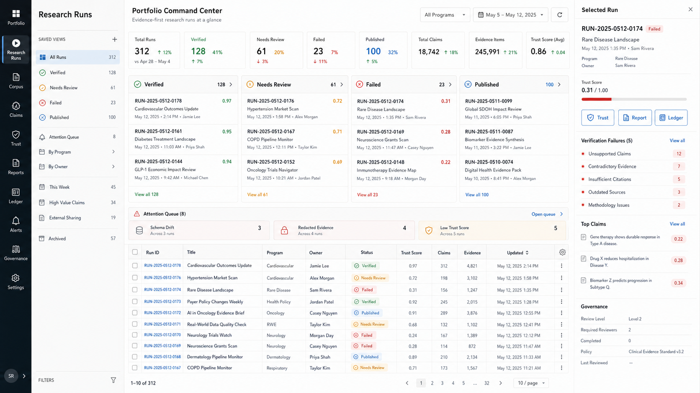
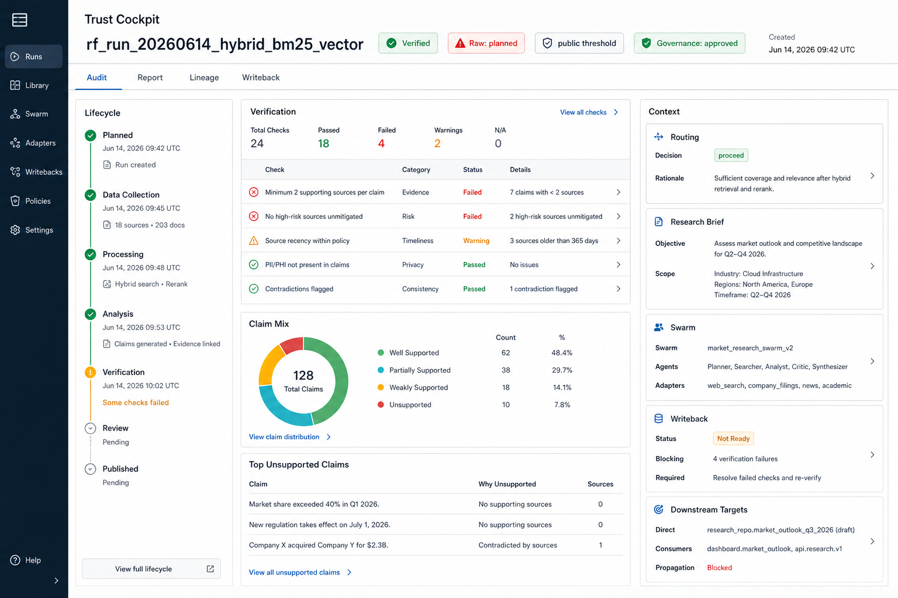
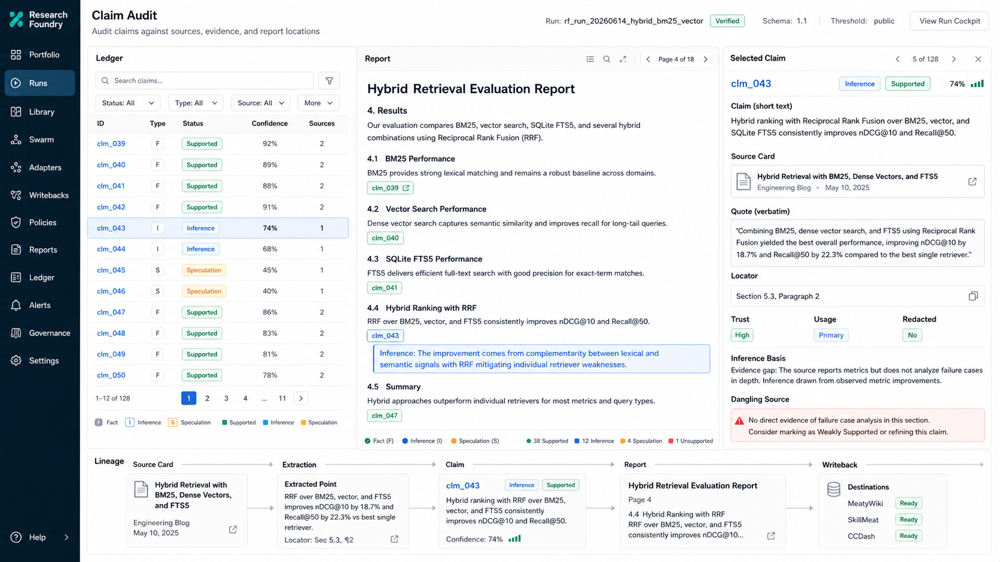

# Design Spec: Runs Frontend Facelift v2

## 1. Intent

The v1 runs frontend proves the read-only/static architecture and the core audit
flows: run list, trust overview, claim ledger, report overlay, lineage, and
provenance modal. The v2 facelift should keep those contracts intact while
turning the viewer into an operator cockpit: more context visible at rest,
fewer tab switches during audit, clearer run health, and a stronger visual
model for claim-to-source trust.

This is not a rewrite. It is a UX and information-architecture upgrade on top
of the existing React/Vite app at `frontend/runs-viewer/`.

## 2. Product Thesis

Research Foundry is an evidence control plane, so the frontend should look and
behave like an evidence operations desk, not a generic dashboard. The interface
should make three questions answerable in seconds:

1. Which runs need attention?
2. Can I trust this run's report?
3. What exact evidence backs this claim?

The redesign prioritizes dense, structured, scan-friendly surfaces over large
empty cards. It should feel calm, precise, and governed: light operational
canvas, strong tabular hierarchy, restrained color, and status accents for
verification, governance, sensitivity, and evidence strength.

## 3. Current Baseline

Source map:

- React 18 + Vite SPA in `frontend/runs-viewer/`.
- Routes are `/runs` and `/runs/:runId`.
- `RunListScreen` renders a single-column filtered card list.
- `RunDetailScreen` uses tabs for Trust Overview, Claim Ledger, Report, and
  Lineage.
- Data comes from static export JSON by default, with loopback mode env-gated.
- Redaction is load-bearing: governed evidence text above threshold must never
  be displayed.
- Playwright covers W1 claim audit, W2 verification checklist, and W3 report
  chip navigation.

Important v1 constraints to preserve:

- Read-only SPA: no write actions, no mutation hooks, no form-driven edits.
- Static export remains the default read path.
- Keep route semantics and test ids stable unless tests are updated in the
  same phase.
- Do not soften fail-closed source-card redaction.
- Privilege `status_derived` over stale `run.yaml.status`.

## 4. Facelift Goals

| Goal | Outcome |
|------|---------|
| G1: Portfolio triage | `/runs` becomes a run command center with corpus metrics, saved/filterable views, status lanes, and attention queues. |
| G2: Detail at rest | Run detail shows trust, verification, claim composition, lifecycle, governance, and context in one scan without forcing tab hopping. |
| G3: Audit workbench | Ledger, report, source card, and provenance chain become a single coordinated audit workspace. |
| G4: Context promotion | Deferred FR-14 context panels and FR-13 writeback preview become structured secondary panels rather than buried optional cards. |
| G5: Evidence visualization | Lineage moves from a separate tab to an always-available supporting layer for selected claims and run artifacts. |
| G6: Design system upgrade | Replace the inherited "basic list + cards" feel with a domain-specific visual system for evidence, governance, and run health. |

## 5. Screen Plan

### Screen A: Portfolio Command Center (`/runs`)

Target user posture: "What should I inspect next?"

Proposed layout:

- Left rail: workspace selector, saved views, source filters, sensitivity
  threshold indicator.
- Top strip: corpus health metrics:
  - total runs
  - verified/published count
  - failed or needs-review count
  - redacted evidence count
  - stale schema count
- Main body: split between status lanes and a compact run table.
- Right inspector: selected run preview with verification failures, top claims,
  governance status, and direct links to trust, report, and ledger.

Key changes:

- Make "failed" a first-class bucket instead of deriving it awkwardly from
  existing tab behavior.
- Add persistent search across run id, intent id, report title, source title,
  and claim text when available.
- Add sort controls for newest, highest risk, most claims, failed checks, and
  redaction count.
- Show `status_raw` only as a warning when it disagrees with `status_derived`.

### Screen B: Run Detail Trust Cockpit (`/runs/:runId`)

Target user posture: "Can I trust this run?"

Proposed layout:

- Header band: run id, derived lifecycle, raw-status mismatch badge, sensitivity
  threshold, governance verdict, created date.
- Left column: vertical lifecycle rail from planned to published, with current
  rung and missing artifacts.
- Center column: verification checklist, failing check drill-downs, claim
  composition, and top unsupported/mixed claims.
- Right column: context stack:
  - routing decision summary
  - research brief summary
  - swarm/adapters used
  - writeback readiness
  - downstream targets

Key changes:

- Collapse the current optional entity grid into meaningful panels.
- Promote context panels from "empty artifact slots" into a structured
  secondary context stack.
- Keep tabs, but use them as workspace modes below the always-visible cockpit:
  Audit, Report, Lineage, Writeback.
- Surface run-level risks, not just artifact presence.

### Screen C: Claim Audit Workbench

Target user posture: "Show me why this claim is true."

Proposed layout:

- Three-pane workbench:
  - Left: faceted claim list/table.
  - Center: report text with claim chips and evidence highlights.
  - Right: selected claim inspector with source card, quote, locator,
    trust/usage flags, inference basis, and broken-provenance warnings.
- Bottom rail or overlay: compact lineage chain for the selected claim:
  source card -> extracted point -> claim -> report location -> writeback.

Key changes:

- Replace modal-only provenance with a docked inspector for repeated auditing.
- Keep modal behavior for small screens and keyboard-focused flows.
- Let claim selection synchronize across ledger, report chips, and lineage.
- Mark inference/speculation as readable editorial annotations, not just color
  spans.
- Flag empty inference basis, dangling source references, redacted evidence, and
  mixed/contradicted claims with distinct visual treatments.

## 6. Information Architecture

The v2 app should have four top-level workspace modes under a persistent shell:

| Mode | Route | Purpose |
|------|-------|---------|
| Portfolio | `/runs` | Corpus triage and run selection. |
| Trust | `/runs/:runId?view=trust` | Run-level verification, lifecycle, governance, and context. |
| Audit | `/runs/:runId?view=audit` | Claim ledger, report, evidence, and source inspection. |
| Lineage | `/runs/:runId?view=lineage` | Artifact graph, selected-claim chain, and writeback destinations. |

Tabs can remain as the internal control, but URL query state should be added so
deep links survive refresh and can be copied into worknotes.

## 7. Data Contract Needs

The first visual pass can be built mostly from `run.json` schema 1.1, but the
richer context/writeback panels require additive schema extension.

Existing usable fields:

- `status_derived`, `status_raw`
- `sensitivity`, `sensitivity_threshold`
- `claim_counts`
- `verification.present`, `verification.passed`, `verification.checks[]`
- `governance`
- `timeline[]`
- `claims[]` with resolved `sources[]`
- `artifact_schema_versions`
- `report_draft`

Additive v2 candidates:

```jsonc
{
  "context": {
    "routing_decision": {},
    "research_brief_md": "...",
    "swarm_plan": {},
    "upstream_entities": {}
  },
  "writebacks": {
    "targets": [],
    "approved_for_writeback": false,
    "reviewer_notes": null,
    "required_fix": null,
    "previews": []
  },
  "attention": {
    "failed_checks": 0,
    "dangling_sources": 0,
    "empty_inference_basis": 0,
    "redacted_sources": 0,
    "schema_mismatches": []
  }
}
```

Any schema extension requires an export schema version bump and backend
architecture review per `docs/dev/architecture/rf-run-export-schema.md`.

## 8. Visual Direction

Working direction: "Evidence operations desk."

Principles:

- Dense, not cramped: table-first layouts, readable metrics, compact inspectors.
- Light operational canvas with high-contrast text and restrained semantic
  accents.
- Rounded corners no larger than 8px.
- Avoid decorative blobs, generic purple gradients, and marketing composition.
- Color is semantic: green for verified/supported, amber for warning/inference,
  red for failed/contradicted, teal for source/evidence, blue for structure,
  charcoal for primary text.
- Use icons for repeated actions and status categories when implemented
  (`lucide-react` or existing local icon path if adopted).
- Use tabular numerals for counts and check states.
- Treat redaction as a first-class state, not missing data.

## 9. Implementation Phases

### Phase 0: Baseline Hardening

- Fix known schema drift: generated frontend type comments/versions should
  match export schema 1.1.
- Normalize governance naming in summary/card code.
- Make failed/needs-review filter semantics explicit.
- Preserve current W1/W2/W3 Playwright coverage.

### Phase 1: Shell and Portfolio Command Center

- Add persistent app shell with left rail and top health strip.
- Rework `RunListScreen` into portfolio layout with search, sort, status lanes,
  compact table, and selected-run inspector.
- Maintain current card list as a responsive/mobile fallback.

### Phase 2: Trust Cockpit

- Recompose `RunDetailScreen` so header, lifecycle, verification, claim
  composition, and governance are visible together.
- Replace optional artifact grid with structured context/writeback summary
  panels that degrade gracefully when schema fields are absent.
- Add URL query-state for detail workspace mode.

### Phase 3: Claim Audit Workbench

- Add docked `ClaimInspector` as the default desktop provenance surface.
- Synchronize selected claim across ledger, report chips, source card, and
  lineage strip.
- Keep `ProvenanceModal` as mobile and keyboard fallback.
- Add explicit visuals for dangling sources, empty inference basis, redaction,
  and mixed/contradicted claims.

### Phase 4: Context and Writeback Schema Extension

- Promote `runs-context-panels.md` and `runs-writeback-preview.md` from
  idea-stage stubs into a v2 schema proposal.
- Extend export service only after schema review.
- Add tests proving context/writeback absence still renders gracefully.

### Phase 5: Visual Polish and Verification

- Responsive desktop/tablet/mobile pass.
- Keyboard navigation pass for workbench panes and claim chips.
- Reduced-motion and contrast pass.
- Playwright visual smoke for portfolio, trust cockpit, and audit workbench.
- Update README/CHANGELOG when implementation ships.

## 10. Acceptance Criteria

### AC-1: Portfolio triage

- target_surfaces:
  - frontend/runs-viewer/src/screens/RunList.tsx
  - frontend/runs-viewer/src/components/RunList/
- propagation_contract: run summaries flow from `useRunList` into health strip,
  status lanes, table rows, filters, and selected-run inspector.
- resilience: missing optional summary fields render as unknown/empty states;
  stale raw status becomes a warning only when `status_raw !== status_derived`.
- visual_evidence_required: desktop screenshot at width >= 1440px and mobile
  screenshot at width <= 430px.
- verified_by: portfolio Playwright smoke and run-list unit coverage.

### AC-2: Trust cockpit

- target_surfaces:
  - frontend/runs-viewer/src/screens/RunDetail.tsx
  - frontend/runs-viewer/src/components/TrustPanel/
- propagation_contract: a single `RFRunExport` powers header, lifecycle,
  verification, governance, context, and writeback summary panels.
- resilience: absent context/writeback fields never throw; redaction state is
  displayed, not hidden.
- visual_evidence_required: desktop screenshot with verification failures and
  at least one redacted evidence state.
- verified_by: W2 verification checklist E2E plus new cockpit smoke.

### AC-3: Claim audit workbench

- target_surfaces:
  - frontend/runs-viewer/src/components/ClaimLedger/
  - frontend/runs-viewer/src/components/ReportOverlay/
  - frontend/runs-viewer/src/components/SourceCard/
  - frontend/runs-viewer/src/components/ProvenanceModal/
- propagation_contract: selected claim id synchronizes across ledger, report
  chip, source card, and selected-claim lineage strip.
- resilience: dangling source, empty inference basis, redacted source text, and
  missing report each have explicit states.
- visual_evidence_required: desktop screenshot showing all three panes and a
  selected claim with quote/locator visible.
- verified_by: W1 claim audit E2E, W3 report-chip E2E, and new selection-sync
  component tests.

## 11. Mockup Set

The first mockup set targets three desktop screens:

1. Portfolio Command Center:
   `docs/project_plans/design-specs/assets/runs-frontend-facelift/portfolio-command-center.png`
2. Run Detail Trust Cockpit:
   `docs/project_plans/design-specs/assets/runs-frontend-facelift/run-detail-trust-cockpit.png`
3. Claim Audit Workbench:
   `docs/project_plans/design-specs/assets/runs-frontend-facelift/claim-audit-workbench.png`

These are conceptual bitmap mockups generated for direction-setting, not
implementation screenshots. Use them to guide layout, hierarchy, and visual
tone, then translate into real React/CSS with existing route and test
constraints.

### Preview Links







Generation mode: built-in `image_gen` tool. CLI fallback was not used.

## 12. Open Questions

| ID | Question | Proposed Resolution |
|----|----------|---------------------|
| OQ-V2-1 | Should portfolio support saved views? | Start with local UI presets only; persist later if the operator asks. |
| OQ-V2-2 | Should context/writeback data be embedded in static JSON or lazy-loaded by loopback API? | Embed only compact summaries in static JSON; defer full lazy loading until loopback API is promoted. |
| OQ-V2-3 | Should lineage use the installed `@xyflow/react` dependency? | Evaluate in Phase 3; current hand-rendered SVG may be enough for selected-claim chains. |
| OQ-V2-4 | How much report text should be visible beside the ledger? | Desktop: full center pane. Tablet/mobile: switch to tabs or drawer. |
| OQ-V2-5 | Should v2 introduce a command palette? | Defer unless keyboard-heavy review sessions expose a clear need. |
