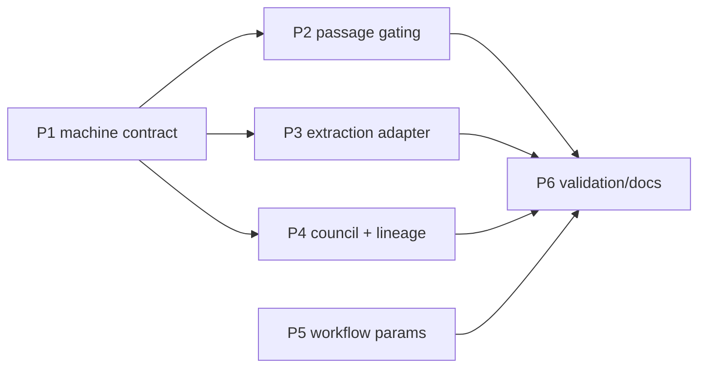

# Implementation Plan: rf Upstream Evidence Foundry (RFUP-1..5, RFUP-7)

**Plan ID**: `IMPL-2026-07-18-RF-UPSTREAM-EVIDENCE-FOUNDRY`
**Date**: 2026-07-18
**Author**: Opus (decisions block) via `implementation-planner` subagent expansion
**Human Brief**: `docs/project_plans/human-briefs/rf-upstream-evidence-foundry.md` (qualifies: 29 pts, 6 phases)
**Related Documents**:
- **PRD**: `docs/project_plans/PRDs/enhancements/rf-upstream-evidence-foundry-v1.md`
- **Decisions block**: `.claude/worknotes/rf-upstream-evidence-foundry/decisions-block.md`
- **Current-state fact sheet**: `.claude/worknotes/rf-upstream-evidence-foundry/current-state.md`
- **External spike-equivalent**: `pediatric-anemia-site/docs/project_plans/expansion/02-evidence-foundry-on-research-foundry.md` (§6.2 gap register, §8.3 risk table)
- **ADRs**: none yet — no architectural decision surfaced requiring a standalone ADR

**Complexity**: Large (Tier 3)
**Total Estimated Effort**: 29 pts across 6 phases (matches decisions-block §4 anchors exactly; no delta)
**Target Timeline**: ~4-5 weeks (single-track sequential-plus-parallel; see wave plan)

## Executive Summary

Six upstream enhancements harden Research Foundry's existing evidence pipeline (verify, fetch, council, run storage, machine output, the Path-B discovery workflow) into a stable, versioned, hard-gatable, tamper-evident contract a downstream consumer (Evidence Foundry / pediatric-anemia-site) can rely on without parsing Rich console text. Work proceeds machine-contract-first (Phase 1) so Phases 2-4 emit their new fields under an already-stamped schema, with the independent JS-side workflow parameterization (Phase 5) deliberately scheduled after the Python phases to preserve reviewer bandwidth, and closes with cross-phase regression, docs, and the RFUP-6 deferral artifact (Phase 6). Two karen milestone checkpoints (after Phase 3, at Phase 6) gate the highest-risk phases per Tier 3 convention.

## Implementation Strategy

### Architecture Sequence

This is CLI/backend Python work in `research_foundry`, not a full-stack layered build — the sequence follows the evidence pipeline's own stages rather than DB→Repo→Service→API→UI:

1. **Machine Contract Layer** (Phase 1) — `rf_schema_version` stamping across every machine-readable surface; the foundation every later phase's new fields land under.
2. **Verify Gating Layer** (Phase 2) — new hard-gate eligibility check in `services/verification.py`.
3. **Extraction Adapter Layer** (Phase 3) — governed PDF extraction adapter wired into `rf fetch`.
4. **Council + Lineage Layer** (Phase 4) — council verdict normalization and run-seal tamper-evidence.
5. **Workflow Parameterization Layer** (Phase 5) — Path-B (`rf-run-execute.js`) portability.
6. **Validation & Documentation Layer** (Phase 6) — cross-phase regression, docs, CHANGELOG, RFUP-6 deferral.

### Parallel Work Opportunities

Per decisions-block §2: Phase 2 ∥ Phase 3 (different modules — verify vs fetch); Phase 4a (council) ∥ Phase 4b (lineage) — independent sub-areas within the same phase; Phase 5 ∥ any Python phase (technically), though deliberately scheduled in wave 3 for review-bandwidth reasons (see wave_plan `agent_context` on P5 above). Watch item: Phase 1 and Phase 2 both write to `services/verification.py`'s output emission path — Phase 2 rebases on Phase 1's stamped schema; not a hard conflict since P1 completes before P2 starts (wave 1 vs wave 2).

### Critical Path

`P1 → P2 → (P4) → P6` (decisions-block §5). P3 and P5 hang off P1 loosely — P3 needs the `extraction_status` field to land under the stamped schema; P5 is fully independent but scheduled late by design.



### Phase Summary

| Phase | Points | Subagents | Model |
|-------|--------|-----------|-------|
| 1 | 5 | python-backend-engineer, api-designer | sonnet |
| 2 | 4 | python-backend-engineer | sonnet |
| 3 | 8 | python-backend-engineer, backend-architect | sonnet |
| 4 | 5 | python-backend-engineer, data-layer-expert | sonnet |
| 5 | 4 | ai-artifacts-engineer | sonnet |
| 6 | 3 | documentation-writer, changelog-generator, prd-writer | haiku (sonnet for RFUP-6 design spec) |
| **Total** | **29** | — | — |

**Reviewer gates** (not counted in phase points, tracked as explicit task rows): `task-completion-validator` at the end of every phase (1-6); `karen` milestone checkpoints after Phase 3 and at Phase 6 (feature end), per decisions-block §1 Tier 3 ordering rationale.

> Estimation rationale (H1-H6 sanity check) lives in the Human Brief. This plan's per-phase point rollup (5+4+8+5+4+3=29) matches decisions-block §4 Estimation Anchors exactly — no delta.

## Deferred Items & In-Flight Findings Policy

### Deferred Items

Deferred items are tasks intentionally pushed out of this plan's scope, tracked so the work isn't lost.

**Rule**: Every deferred item has a corresponding design-spec authoring task in Phase 6 (TASK-6.4). The resulting design-spec path is appended to `deferred_items_spec_refs` in this plan's frontmatter on authoring.

#### Deferred Items Triage Table

| Item ID | Category | Reason Deferred | Trigger for Promotion | Target Spec Path |
|---------|----------|-----------------|-----------------------|-----------------|
| RFUP-6 | backlog | IntentTree node text: install/evaluate native discovery adapters "only after a measured value/security gap"; 0/6 live non-`arc_council` adapters installed today (current-state.md); Path-B (RFUP-1, in scope) is the proven live-discovery lane | measured value or security gap | `docs/project_plans/design-specs/rfup-6-native-discovery-adapters.md` |

This is the only deferred item — decisions-block §0 explicitly scopes RFUP-6 out; no other deferrals are introduced by this plan.

### In-Flight Findings

Findings doc is NOT pre-created (`findings_doc_ref: null`). Create `.claude/findings/rf-upstream-evidence-foundry-findings.md` only on the first real in-flight discovery during execution, per `.claude/skills/planning/references/deferred-items-and-findings.md`. If created, set `findings_doc_ref` in this plan's frontmatter and append the path to `related_documents`.

### Quality Gate

Phase 6 cannot be sealed until: the Deferred Items triage row above has its Target Spec Path populated (TASK-6.4 authored) AND (`findings_doc_ref` remains null, OR the findings doc exists with `status: accepted`).

## Phase Breakdown

**Column conventions**: `Estimate` = story points (never in Effort). `Model` = `opus | sonnet | haiku`. `Effort` = `adaptive | extended` only (this plan is 100% claude-native per decisions-block §6 — no gemini/codex/nano-banana rows). Reviewer/gate rows use `Estimate: gate` (unpointed). All test/validation commands use `./.venv/bin/python -m pytest` (never bare `pytest`) per project convention.

### Phase 1: Machine contract & schema versioning (RFUP-4)

**Duration**: ~2-3 days (5 pts) **Dependencies**: None **Anchor**: assertion-ledger P3 forward-write driver (stamp+thread a field through emit paths) **Assigned Subagent(s)**: python-backend-engineer, api-designer

| Task ID | Task Name | Description | Acceptance Criteria | Estimate | Assigned Subagent(s) | Model | Effort | Dependencies |
|---------|-----------|-------------|----------------------|----------|-----------------------|-------|--------|---------------|
| TASK-1.1 | Schema-version constant & inventory scaffold | Add a canonical `RF_SCHEMA_VERSION` semver constant (single source of truth) and scaffold the machine-surface inventory doc listing every enumerated surface (`errors.py` exit codes, `cli_commands.py` `--json` outputs, `services/verification.py` verify output, `/api/runs`, `/api/reports`, `/api/catalog`). No behavior change yet. | PRD FR-4.1 scaffold; inventory doc lists all 6 target_surfaces from AC-RFUP4-1 | 1 pt | python-backend-engineer | sonnet | adaptive | None |
| TASK-1.2 | Stamp CLI `--json` outputs + exit-code contract doc | Thread `rf_schema_version` into every `--json` CLI output in `cli_commands.py`; author the FR-4.2 contract doc stating exit code (`ExitCode` enum) + YAML/JSON output IS the stable contract, Rich console is presentation-only. Additive-only. | AC-RFUP4-1 (CLI surfaces), AC-RFUP4-2 (contract doc), FR-4.4 (no renames) | 1.5 pt | python-backend-engineer (impl), api-designer (contract doc) | sonnet | adaptive | TASK-1.1 |
| TASK-1.3 | Stamp verify output, run export, and LAN API payloads | Stamp `rf_schema_version` into `services/verification.py` verify YAML/JSON output and the LAN API payloads (`/api/runs`, `/api/reports`, `/api/catalog`). Check the runs-viewer's hand-written `run-export.ts` (dual-update rule) — additive-only; bump 1.5→1.6 ONLY if a field is genuinely added in this phase (Risk Hotspot MED). Expected outcome: no new run-export field, no bump. | AC-RFUP4-1 (verify + API surfaces), AC-RFUP4-4, AC-RFUP4-5 (resilience) | 1.5 pt | python-backend-engineer | sonnet | adaptive | TASK-1.1 |
| TASK-1.4 | Contract drift tests + fixture key-diff | Add contract drift tests asserting `rf_schema_version` presence/value on every enumerated surface (fails red on divergence). Add a before/after key-diff test over a fixture run's JSON/YAML output across all `target_surfaces` confirming zero renamed/removed keys. | AC-RFUP4-3, AC-RFUP4-4 | 1 pt | python-backend-engineer | sonnet | adaptive | TASK-1.2, TASK-1.3 |
| TASK-1.5 | Phase 1 quality gate | `task-completion-validator` reviews inventory doc, stamped surfaces, and drift tests against AC-RFUP4-1..5 and FR-4.1-4.4. | Validator sign-off recorded; all Phase 1 ACs verified | gate | task-completion-validator | sonnet | adaptive | TASK-1.4 |

Validation: `./.venv/bin/python -m pytest -k contract_drift`

**Phase 1 Quality Gates:**
- [ ] `rf_schema_version` present on all Phase-1-enumerated surfaces
- [ ] Contract drift tests fail on divergence, pass on unmodified code
- [ ] Zero renamed/removed keys in fixture key-diff
- [ ] `task-completion-validator` sign-off recorded (TASK-1.5)

---

### Phase 2: Exact-passage hard-gating in `rf verify` (RFUP-3)

**Duration**: ~2 days (4 pts) **Dependencies**: Phase 1 (soft rebase on stamped schema) **Anchor**: writeback-default-deny-gate exploration (flag-gated verify check, similar shape) **Assigned Subagent(s)**: python-backend-engineer

| Task ID | Task Name | Description | Acceptance Criteria | Estimate | Assigned Subagent(s) | Model | Effort | Dependencies |
|---------|-----------|-------------|----------------------|----------|-----------------------|-------|--------|---------------|
| TASK-2.1 | `verify.exact_passage` config key + run-level override (OQ-1) | Implement `verify.exact_passage: warn\|strict` (default `warn`) as BOTH a config default and a run-level CLI override flag (e.g. `--exact-passage strict`); run-level flag wins on conflict. Resolves OQ-1 per the mandated dual-surface default. | FR-3.2 | 1 pt | python-backend-engineer | sonnet | adaptive | Phase 1 (rebase, non-blocking) |
| TASK-2.2 | New exact-passage eligibility check | Add a new eligibility check (distinct from `source_cards_have_locators`) in `services/verification.py` that fails (not warns) when a claim citing a source card lacks an exact passage/quote anchor, gated by `verify.exact_passage`. | FR-3.1, AC-RFUP3-1, AC-RFUP3-2 | 1.5 pt | python-backend-engineer | sonnet | adaptive | TASK-2.1 |
| TASK-2.3 | Violation list + real-corpus regression | Emit `exact_passage_violations` list in verify output (stamped, distinguishable from `source_cards_have_locators`); add a real-corpus regression test over the 2,835-assertion sample + prior KnitWit/other runs in default mode asserting zero new failures (HIGH risk mitigation). | FR-3.3, FR-3.4, AC-RFUP3-3, AC-RFUP3-4, AC-RFUP3-5 (resilience) | 1.5 pt | python-backend-engineer | sonnet | adaptive | TASK-2.2 |
| TASK-2.4 | Phase 2 quality gate | `task-completion-validator` reviews strict/default-mode behavior and the real-corpus regression result against AC-RFUP3-1..5. | Validator sign-off recorded; zero real-corpus regressions confirmed | gate | task-completion-validator | sonnet | adaptive | TASK-2.3 |

Validation: `./.venv/bin/python -m pytest -k exact_passage`

**Phase 2 Quality Gates:**
- [ ] Strict mode blocks synthetic violation corpus; default mode unchanged
- [ ] Real-corpus regression sample shows zero new failures (default mode)
- [ ] `exact_passage_violations` field optional and non-breaking for existing consumers (AC-RFUP3-5)
- [ ] `task-completion-validator` sign-off recorded (TASK-2.4)

---

### Phase 3: Governed URL/PDF extraction adapter (RFUP-2)

**Duration**: ~4-5 days (8 pts) **Dependencies**: Phase 1 **Anchor**: Search Router MVP (`rf search`/`rf fetch`, merged `d119993`) — same pipeline, adapter + provider work; H3 applies (extraction/transform) **Assigned Subagent(s)**: python-backend-engineer, backend-architect

| Task ID | Task Name | Description | Acceptance Criteria | Estimate | Assigned Subagent(s) | Model | Effort | Dependencies |
|---------|-----------|-------------|----------------------|----------|-----------------------|-------|--------|---------------|
| TASK-3.1 | PDF extraction adapter (OQ-3: pypdf) | Add `pypdf` as an optional installable extra `research-foundry[pdf]` (OQ-3 resolved — no existing PDF dependency signal in `pyproject.toml`; pypdf is the decisions-block §7 fallback default). Implement a dedicated PDF text extraction module producing full-text content when a text layer is present. | FR-2.1 | 2 pt | python-backend-engineer, backend-architect (adapter shape) | sonnet | adaptive | None |
| TASK-3.2 | Wire adapter into `rf fetch` pipeline | Wire the PDF adapter into `services/search_router/router.py` `extract_urls()` alongside the existing jina/firecrawl chain, selecting the PDF path for PDF content-type/URLs. Preserve graceful degrade to locator_only when the `pdf` extra is absent or extraction fails (no unhandled exception). | FR-2.2, FR-2.5, AC-RFUP2-1, AC-RFUP2-2, AC-RFUP2-4 | 2 pt | python-backend-engineer | sonnet | adaptive | TASK-3.1 |
| TASK-3.3 | Explicit `extraction_status` field | Add `extraction_status: full_text\|partial\|locator_only` to `services/source_cards.py`, replacing the implicit `degraded` boolean with a queryable tri-state. Cards written before this feature (no field) are treated as implicit `partial`/`locator_only` by consumers. | FR-2.3, AC-RFUP2-5 (resilience) | 1.5 pt | python-backend-engineer | sonnet | adaptive | TASK-3.2 |
| TASK-3.4 | Governance-gate ordering + secret-scan test | Verify (and adjust if needed) that PDF extraction runs BEFORE the governance gate (sensitivity + secret scan) call site in `services/search_router/router.py`. Add a test asserting a PDF fixture containing a synthetic secret pattern is blocked/redacted per existing `guard check` rules. | FR-2.4, AC-RFUP2-3 | 1.5 pt | python-backend-engineer | sonnet | adaptive | TASK-3.2 |
| TASK-3.5 | PDF fixture test suite | Add PDF fixtures (extractable text layer; scanned/no-text-layer) exercising `rf fetch` end-to-end; assert `extraction_status: full_text` and `locator_only` outcomes respectively. | AC-RFUP2-1, AC-RFUP2-2 | 1 pt | python-backend-engineer | sonnet | adaptive | TASK-3.3, TASK-3.4 |
| TASK-3.6 | Phase 3 completion validator gate | `task-completion-validator` reviews PDF adapter, governance-gate ordering, and fixture results against AC-RFUP2-1..5. | Validator sign-off recorded | gate | task-completion-validator | sonnet | adaptive | TASK-3.5 |
| TASK-3.7 | karen milestone checkpoint (post-Phase 3) | Tier 3 mid-feature milestone review — karen assesses actual completion state of Phases 1-3 against claimed status before Phase 4/5 proceed. | karen sign-off recorded; no unresolved blast-radius findings | gate | karen | opus | adaptive | TASK-3.6 |

Validation: `./.venv/bin/python -m pytest -k pdf_extraction`

**Phase 3 Quality Gates:**
- [ ] PDF fixture with text layer → `extraction_status: full_text`
- [ ] PDF fixture without text layer → `extraction_status: locator_only` (matches current degrade behavior)
- [ ] Extracted PDF text passes through governance gate (secret-scan test)
- [ ] Missing `pdf` extra falls back gracefully, no unhandled exception
- [ ] `task-completion-validator` sign-off recorded (TASK-3.6)
- [ ] `karen` milestone sign-off recorded (TASK-3.7)

---

### Phase 4: Council normalization + run lineage (RFUP-5, RFUP-7)

**Duration**: ~2-3 days (5 pts) **Dependencies**: Phase 1 **Anchor**: council normalization is S (~2pt); lineage digest reuses assertion-registry atomic-write/digest patterns → 5 combined **Assigned Subagent(s)**: python-backend-engineer, data-layer-expert

| Task ID | Task Name | Description | Acceptance Criteria | Estimate | Assigned Subagent(s) | Model | Effort | Dependencies |
|---------|-----------|-------------|----------------------|----------|-----------------------|-------|--------|---------------|
| TASK-4.1 | Council verdict normalization enum (4a) | Normalize `adapters/arc_council.py`'s free-form `verdict` string into a controlled enum `approve\|concern\|block`, stored alongside raw text (non-destructive; raw string always retained in `AdapterResult.artifacts["arc_verdict"]`). Unparseable text → `concern` (fail-toward-caution) + `normalization_confidence: low`; recognized approve phrasing → `approve` + `normalization_confidence: high`. Normalize at the adapter boundary only — never mutate ARC's own record. Per OQ-4 default, do NOT add the enum to `run-export.ts` (no 1.6 bump). | FR-5.1, FR-5.2, FR-5.3, FR-5.4, AC-RFUP5-1..5 | 2 pt | python-backend-engineer | sonnet | adaptive | None |
| TASK-4.2 | Seal trigger surface (4b, OQ-2) | Add the seal trigger as an additive flag on the existing finalize/export CLI path (smaller surface than a new command, per OQ-2's stated preference — `paths.py`/`cli_commands.py` already establish a finalize/export-style command this flag can extend). If exploration finds no clean existing attach point, fall back to a new `rf seal <run>` command and flag the deviation in the Completion Report. | FR-7.1 | 1 pt | python-backend-engineer, data-layer-expert | sonnet | adaptive | None |
| TASK-4.3 | Content digest + append-only lineage record | On seal, compute a content digest over the run's evidence chain (claim ledger + source cards + report), reusing `services/assertion_registry.py`'s atomic-write (temp+fsync+os.replace) and content-addressable digest patterns — do not reinvent. Store an append-only lineage record (seal timestamp, digest, sealer identity/context) that never rewrites history. | FR-7.2, FR-7.3, AC-RFUP7-1 | 1.5 pt | data-layer-expert (digest/lineage), python-backend-engineer | sonnet | adaptive | TASK-4.2 |
| TASK-4.4 | Tamper-evidence + pre-seal-unaffected regression | Digest re-check test detecting mutation to any digest-covered file post-seal; regression test confirming an unsealed run's existing workflow (rf tail, report iteration) is entirely unaffected; assert seal applies no file locking/chmod/OS-level write protection (permissions unchanged pre/post seal). Consumers of run metadata (`cli_commands.py` status, `/api/runs`) treat absence of a lineage record as "unsealed" (resilience). | FR-7.4, FR-7.5, AC-RFUP7-2..5 | 0.5 pt | python-backend-engineer | sonnet | adaptive | TASK-4.3 |
| TASK-4.5 | Phase 4 quality gate | `task-completion-validator` reviews council normalization and seal/lineage/tamper-evidence work against AC-RFUP5-1..5 and AC-RFUP7-1..5. | Validator sign-off recorded | gate | task-completion-validator | sonnet | adaptive | TASK-4.1, TASK-4.4 |

Validation: `./.venv/bin/python -m pytest -k run_seal` and `./.venv/bin/python -m pytest -k council_verdict`

**Phase 4 Quality Gates:**
- [ ] Council verdict enum present in machine output; raw ARC text always retained
- [ ] No field added to `run-export.ts` by this phase (OQ-4 default confirmed)
- [ ] Sealed-run mutation attempt detected by digest re-check
- [ ] Unsealed-run workflow (rf tail, report iteration) unaffected
- [ ] `task-completion-validator` sign-off recorded (TASK-4.5)

---

### Phase 5: Parameterize Path-B workflow (RFUP-1)

**Duration**: ~2 days (4 pts) **Dependencies**: Phase 1 (soft/scheduling only — see wave_plan P5 `agent_context`) **Anchor**: `knitwit-run-execute.js` generalization (same workflow, already partially generalized once) **Assigned Subagent(s)**: ai-artifacts-engineer (workflow-authoring skill loaded)

| Task ID | Task Name | Description | Acceptance Criteria | Estimate | Assigned Subagent(s) | Model | Effort | Dependencies |
|---------|-----------|-------------|----------------------|----------|-----------------------|-------|--------|---------------|
| TASK-5.1 | Replace hard-coded paths with config/args | Replace hard-coded constants (`.claude/workflows/rf-run-execute.js` lines 18-20: RF binary path, repo checkout path, TMP working dir) with configurable args/config values, each defaulting to current behavior on this machine. Preserve the TMP→cp write-safety pattern (lines 97-100, 127, 164, 189, 212) unchanged. | FR-1.1, FR-1.2, FR-1.3, AC-RFUP1-2, AC-RFUP1-5 (resilience) | 2 pt | ai-artifacts-engineer | sonnet | adaptive | None |
| TASK-5.2 | Run-date computed at invocation | Replace the frozen date stamp (line 21: `20260613`) baked into `source_card_id` generation (line 121) with a run-date computed at invocation time. Re-run the four-constraints checklist (workflow-authoring skill) to confirm compliance post-refactor. | FR-1.4, AC-RFUP1-4 | 1 pt | ai-artifacts-engineer | sonnet | adaptive | TASK-5.1 |
| TASK-5.3 | Validation + registry update | `node --check` on the refactored file; dry-run with explicit `--rf-bin`/`--repo`/`--tmp-dir` args on a scratch run reproducing prior default behavior; grep-based source scan confirming no literal absolute machine paths remain; update the workflow registry entry to reflect the new config surface. | FR-1.5, AC-RFUP1-1, AC-RFUP1-3 | 1 pt | ai-artifacts-engineer | sonnet | adaptive | TASK-5.2 |
| TASK-5.4 | Phase 5 quality gate | `task-completion-validator` reviews the parameterized workflow against AC-RFUP1-1..5. | Validator sign-off recorded | gate | task-completion-validator | sonnet | adaptive | TASK-5.3 |

Validation: `node --check .claude/workflows/rf-run-execute.js` (JS syntax; no pytest applicable to this phase)

**Phase 5 Quality Gates:**
- [ ] `node --check` passes
- [ ] Dry-run with explicit args reproduces prior default behavior on this machine
- [ ] No literal absolute machine paths remain (grep-verifiable)
- [ ] Date stamp computed at invocation time (distinct stamps across two dry-run dates)
- [ ] `task-completion-validator` sign-off recorded (TASK-5.4)

---

### Phase 6: Validation, docs & deferral

**Duration**: ~1-2 days (3 pts) **Dependencies**: Phases 2, 3, 4, 5 complete **Anchor**: standard finalization phase incl. H6 plumbing budget **Assigned Subagent(s)**: documentation-writer, changelog-generator, prd-writer

| Task ID | Task Name | Description | Acceptance Criteria | Estimate | Assigned Subagent(s) | Model | Effort | Dependencies |
|---------|-----------|-------------|----------------------|----------|-----------------------|-------|--------|---------------|
| TASK-6.1 | Full cross-phase regression suite | Run the full regression suite under venv across all Phase 1-5 changes: contract drift (P1), real-corpus verify regression (P2), PDF fixtures + governance gate (P3), council normalization + seal tamper-evidence (P4), workflow dry-run (P5). Run `flake8` errors-only lint. | `./.venv/bin/python -m pytest` green; `flake8 <src> --select=E9,F63,F7,F82` clean | 1 pt | python-backend-engineer | sonnet | adaptive | Phases 2, 3, 4, 5 |
| TASK-6.2 | Machine-surface inventory finalization + service-contract docs | Finalize the machine-surface inventory doc (scaffolded TASK-1.1) with final stamped values; update docs touching `rf fetch`/`verify`/council (service contract doc, skills referencing these commands). | Inventory doc accurate and complete (§12 Documentation Acceptance) | 0.5 pt | documentation-writer | haiku | adaptive | TASK-6.1 |
| TASK-6.3 | CHANGELOG update | Add `[Unreleased]` CHANGELOG entries for user-facing new CLI/config surfaces: `verify.exact_passage` flag, seal trigger flag (TASK-4.2), `extraction_status` field, council verdict enum. Categorize per `.claude/specs/changelog-spec.md` (new capability surfaces → Added). | Entry exists under `[Unreleased]` with correct categorization; `changelog_ref` frontmatter set | 0.5 pt | changelog-generator | haiku | adaptive | TASK-6.1 |
| TASK-6.4 | RFUP-6 design spec authoring (deferred item) | Author `docs/project_plans/design-specs/rfup-6-native-discovery-adapters.md` (`doc_type: design_spec`, `maturity: idea`) per PRD §14: capture the defer-until trigger (measured value gap OR security/governance gap) and the adapter shortlist (`gpt_researcher`, `notebooklm`, `openai_agents`, `paperqa2`, `opencode`, `litellm_router` — the 6 non-`arc_council`/non-`litellm_router`-live adapters per current-state.md). Set `prd_ref` to the parent PRD. Append the resulting path to this plan's `deferred_items_spec_refs`. | Design spec authored; Deferred Items Triage row's Target Spec Path resolves to a real file; `deferred_items_spec_refs` populated | 0.5 pt | prd-writer | sonnet | adaptive | None (parallel to TASK-6.1) |
| TASK-6.5 | IntentTree node status writebacks | Update IntentTree node status for the RFUP-1,2,3,4,5,7 nodes (per this plan's `intenttree_workspace`/`intenttree_tree`) to reflect completion; update the RFUP-6 node to note deferral with the TASK-6.4 design-spec path. Best-effort/non-fatal if the IntentTree API is unreachable. | Node statuses updated OR logged-and-skipped if API unreachable | 0.5 pt | documentation-writer | haiku | adaptive | TASK-6.1, TASK-6.4 |
| TASK-6.6 | Phase 6 completion validator gate | `task-completion-validator` reviews the full regression result, docs, CHANGELOG, and RFUP-6 design spec against §12 Overall Acceptance Criteria. | Validator sign-off recorded | gate | task-completion-validator | sonnet | adaptive | TASK-6.2, TASK-6.3, TASK-6.4, TASK-6.5 |
| TASK-6.7 | karen feature-end checkpoint | Tier 3 end-of-feature review — karen assesses actual completion state of all six phases against claimed status; confirms the deferred-items quality gate and no unresolved Mode D edges (lineage append-only check). | karen sign-off recorded; feature marked complete | gate | karen | opus | adaptive | TASK-6.6 |

Validation: `./.venv/bin/python -m pytest` (full suite, no `-k` filter)

**Phase 6 Quality Gates:**
- [ ] Full regression suite green under venv; flake8 errors-only clean
- [ ] Machine-surface inventory doc finalized
- [ ] CHANGELOG `[Unreleased]` entry present for all new user-facing surfaces
- [ ] RFUP-6 design spec authored; `deferred_items_spec_refs` populated
- [ ] IntentTree node statuses updated (or best-effort-skipped and logged)
- [ ] `task-completion-validator` sign-off recorded (TASK-6.6)
- [ ] `karen` feature-end sign-off recorded (TASK-6.7)

---

## Risk Mitigation

Risk hotspots below are carried forward verbatim in substance from decisions-block §3, phase-tagged to this plan's task table.

| Risk | Phase | Sev | Mitigation |
|------|-------|-----|-----------|
| Strict passage gating breaks existing corpus (2,835 backfilled assertions; KnitWit + prior runs) | Phase 2 | HIGH | Flag/profile-gated, default `warn` (TASK-2.1). Strict is opt-in per run/profile. Regression test (TASK-2.3) runs default mode over a real-corpus sample and asserts zero new failures. |
| Immutability breaks in-place run workflows (rf tail, report iteration) | Phase 4 | HIGH | Immutability applies only to explicitly sealed runs; pre-seal behavior unchanged (TASK-4.4 regression test). Seal is additive metadata + digest, no file locking. |
| Schema stamp churn breaks runs-viewer / existing consumers | Phase 1 | MED | Additive-only in this feature (TASK-1.2, TASK-1.3). runs-viewer export schema checked; bump to 1.6 only if a field is genuinely added — expected outcome is no bump. |
| PDF extraction dependency weight / security (parsing untrusted PDFs) | Phase 3 | MED | Optional extra `research-foundry[pdf]` (TASK-3.1); graceful degrade to locator_only when absent (TASK-3.2); extraction runs pre-governance-gate so secret scan/sensitivity apply to extracted text (TASK-3.4). |
| Council normalization misclassifies free-form verdicts | Phase 4 | LOW | Non-destructive: raw text always retained; unparseable → `concern` (fail-toward-caution) + `normalization_confidence` flag (TASK-4.1). |
| Workflow param refactor breaks the proven Path-B lane | Phase 5 | MED | Backward-compat default config reproducing current behavior on this machine (TASK-5.1); dry-run gate before registry update (TASK-5.3); four-constraints checklist re-run (TASK-5.2). |
| Governance regression (WKSP-304 / DI-1 surface) | Phase 3, Phase 4 | MED | New adapter and seal surfaces go through the existing governance gate; no new privileged writeback targets. Any workspace-scoping-relevant query flagged for the DI-1 audit register during TASK-3.4/TASK-4.3 implementation. |

**Mode D check** (per decisions-block §3): none of the six in-scope items touch auth, payments, migrations, or data deletion. The closest edge is Phase 4b (lineage) — it must NOT delete or rewrite history; append-only by design (enforced by TASK-4.4).

### Schedule Risks

| Risk | Impact | Likelihood | Mitigation Strategy |
|------|--------|------------|----------------------|
| Scope creep beyond the 29-pt estimate | Medium | Low | Promote rather than stretch if scope grows during any phase (tiered-workflow-overhaul.md convention); flag in the phase's Completion Report. |
| Phase 3 (8 pts, largest phase) slips and delays the karen milestone | Medium | Medium | Phase 3 tasks (TASK-3.1..3.5) are internally sequenced with clear sub-boundaries; TASK-3.7 karen checkpoint can proceed once TASK-3.6 validator gate passes even if Phase 4/5 are still in flight (they only soft-depend on Phase 1). |
| OQ-2 fallback (new `rf seal` command instead of a flag) expands Phase 4 scope | Low | Low | Fallback path is explicitly pre-authorized in TASK-4.2's description; any deviation is flagged in the Completion Report, not silently absorbed. |

## Resource Requirements

### Team Composition (all Claude subagents, no external human team split)

- Backend/CLI implementation: `python-backend-engineer` (Phases 1-4, primary), `backend-architect` (Phase 3 adapter shape review), `data-layer-expert` (Phase 4 digest/lineage)
- Contract/API doc: `api-designer` (Phase 1 contract doc)
- Workflow scripting: `ai-artifacts-engineer` (Phase 5, `workflow-authoring` skill)
- Documentation: `documentation-writer` (Phase 6 inventory/docs/IntentTree writebacks), `changelog-generator` (Phase 6 CHANGELOG), `prd-writer` (Phase 6 RFUP-6 design spec)
- Reviewers: `task-completion-validator` (every phase), `karen` (Phase 3 milestone, Phase 6 feature end)

### Skill Requirements

- Python (typer CLI, pydantic-style dataclasses, pytest), YAML/Markdown file-backed storage patterns
- `workflow-authoring` skill (four-constraints checklist) for Phase 5
- `changelog-generator` and `ai-artifacts-engineer` skills for Phase 6

### Infrastructure

- Existing `./.venv` (project convention: `./.venv/bin/python -m pytest`, never bare `pytest`)
- Real-corpus regression sample (2,835 backfilled assertions + prior KnitWit/other runs) available locally for Phase 2
- Optional `research-foundry[pdf]` extra installable in CI/test environments for Phase 3

## Success Metrics

### Delivery Metrics

- All 6 phases sealed with `task-completion-validator` sign-off; Phase 3 and Phase 6 additionally carry `karen` sign-off
- Zero P0/P1 regressions in the full `./.venv/bin/python -m pytest` suite post-merge

### Business/Outcome Metrics (mirrors PRD §4 Success Metrics)

- `rf_schema_version` stamped on 100% of enumerated machine surfaces with zero renamed/removed existing fields
- `verify.exact_passage=strict` blocks 100% of a synthetic violation corpus; default mode shows zero new failures on the real-corpus regression sample
- `rf seal` produces a tamper-evident digest detectable on 100% of post-seal mutation attempts in the test suite, with zero behavior change to unsealed runs

### Technical Metrics

- No literal absolute machine paths remain in `.claude/workflows/rf-run-execute.js` (grep-verifiable, down from 4+)
- Digest/atomic-write patterns for run-seal reuse `services/assertion_registry.py`, not a new implementation

## Communication Plan

Single-orchestrator, subagent-execution model (no multi-team standups). Status flows through: phase Completion Reports → `task-completion-validator` sign-off → (Phase 3, Phase 6) `karen` sign-off → Opus commits and squash-merges per phase, per `.claude/rules/git-workflow.md`. Escalate to the user only on Mode D edge cases (none expected — see Mode D check above) or if a phase's point estimate materially exceeds its anchor (>30% delta per H5).

## Post-Implementation

- Confirm the machine-surface inventory doc stays current if future features add new `--json`/machine surfaces (contract drift tests catch silent divergence)
- Monitor whether Evidence Foundry's first live consumption run against a sealed, strict-mode run surfaces any gaps not caught by the synthetic violation corpus
- RFUP-6 design spec (TASK-6.4) becomes the entry point for a future promotion once its defer-until trigger condition is met

---

## Wrap-Up: Feature Guide & PR

**Triggered**: Automatically after Phase 6 is sealed (karen feature-end sign-off, TASK-6.7, passes).

### Step 1 — Feature Guide

Delegate to `documentation-writer` (haiku) to create `.claude/worknotes/rf-upstream-evidence-foundry/feature-guide.md` with frontmatter (`doc_type: feature_guide`, `feature_slug: rf-upstream-evidence-foundry`, `prd_ref`, `plan_ref`, `spike_ref` pointing to the external spec, `adr_refs: []`) and sections: What Was Built, Architecture Overview, How to Test (include `verify.exact_passage`, `rf fetch` PDF flow, seal command/flag, council enum), Test Coverage Summary, Known Limitations (RFUP-6 deferral). Commit before opening the PR.

### Step 2 — Open PR

```bash
gh pr create \
  --title "rf upstream: evidence-foundry enablement (RFUP-1..5,7)" \
  --body "$(cat <<'EOF'
## Summary
- Machine contract: rf_schema_version stamped across verify/fetch/catalog/API/CLI surfaces
- rf verify: hard-gatable exact-passage check (verify.exact_passage: warn|strict, default warn)
- rf fetch: governed PDF extraction adapter + explicit extraction_status; council verdict normalization; run seal + tamper-evident lineage; Path-B workflow parameterized (no more hard-coded machine paths)

## Feature Guide
.claude/worknotes/rf-upstream-evidence-foundry/feature-guide.md

## Test plan
- [ ] Full ./.venv/bin/python -m pytest suite green
- [ ] Real-corpus verify regression: zero new failures in default mode
- [ ] PDF fixture full-text + locator-only paths verified
- [ ] Sealed-run digest mismatch detected on mutation attempt
- [ ] Path-B dry-run reproduces prior default behavior with explicit args

🤖 Generated with Claude Code
EOF
)"
```

---

**Progress Tracking:**

See progress tracking (created via `artifact-tracking` skill, not by this plan): `.claude/progress/rf-upstream-evidence-foundry/phase-N-progress.md`

---

**Implementation Plan Version**: 1.0
**Last Updated**: 2026-07-18
