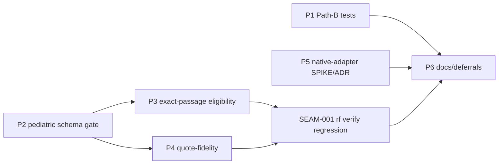

# Implementation Plan: RFUP External-Routing Gap Closure

**Plan ID**: `IMPL-2026-07-22-RFUP-EXTERNAL-ROUTING`
**Date**: 2026-07-22
**Author**: implementation-planner (Sonnet 5)
**Human Brief**: N/A — not yet created (decisions-block.md §8 recommends one given ≥8 pts + ≥2 phases; scaffolding is out of scope for this planning pass)
**Related Documents**:
- **PRD**: `docs/project_plans/PRDs/enhancements/rfup-external-routing-v1.md`
- **Decisions Block**: `.claude/worknotes/rfup-external-routing/decisions-block.md`
- **ADRs**: `/Users/miethe/dev/homelab/development/pediatric-anemia-site/docs/adr/0008-pathb-hardening-vs-native-adapter.md` (read-only reference, `proposed` — see Hard Constraints)

**Complexity**: Large (Tier 3)
**Total Estimated Effort**: ~24-27 pts (bottom-up; see Estimation Sanity Check)
**Target Timeline**: 4 waves, no fixed calendar target (this is an orchestrated delta, not a scheduled sprint)

## Origin Note

IntentTree source node `node_01KXRTYKKW9ECTF9MCBQ8JV1EB` is this work's origin node, but it lives in the pediatric program's tree, not `rf`'s — it is a reference pointer only, not a live binding for this plan's own IntentTree sync (this repo's `wave_plan` and frontmatter are the authoritative planning surface).

## Executive Summary

RFUP-1..5,7 landed on `main` at commit `001a834`. This is a **delta plan**, not a rebuild: it closes the four items the Evidence Foundry seam (pediatric-anemia-site's CDS pipeline) still needs — a formal JSON Schema hard-gate for the `pediatric_cds` evidence-card block (P2), an auto-strict exact-passage eligibility filter for threshold/clinical claims (P3), a regression-test suite for the already-parameterized Path-B workflow scripts (P1), and an eval-only native-adapter/ADR-0008 verdict (P5) — plus one newly-discovered gap with no scoped RFUP item: a character-level quote-content-fidelity check (P4). A final phase (P6) closes out documentation and deferred-item tracking. The plan runs in 4 waves: Wave 1 (P1 ∥ P5, independent), Wave 2 (P2, the schema-gate root), Wave 3 (P3 ∥ P4, both extending `verification.py`, gated by a shared seam-regression task), Wave 4 (P6, final docs).

## Invariants — Hard Constraints (verbatim, do not deviate)

1. **Seam boundary**: only evidence→verified-claim logic goes upstream into `rf`; CDS-specific FHIR/rule-DSL/signing logic never crosses into `rf`, in either direction.
2. **P5 is EVAL-ONLY**: no install, no live external calls, no credentials. The ADR-0008 accept/reject verdict is the sole deliverable. Any install is a separate future feature, gated on this verdict.
3. **This is a DELTA plan**: RFUP-1..5,7 already landed on `main` at commit `001a834`. Do not re-scope, re-litigate, or re-implement that work.

## Implementation Strategy

### Pipeline Sequence (not a routers→repositories→services stack)

Per the PRD's Architectural Context, this feature does not follow MP's routers→services→repositories→DB layering — there is no new DB schema and no new frontend surface. Instead it extends `rf`'s existing **evidence pipeline stage sequence** (ingest → extract → claim-map → verify → council → bundle), adding three new gates at the `verify` stage:

1. **P2 — schema completeness gate** (blocks structurally-incomplete `pediatric_cds` blocks)
2. **P3 — eligibility-driven strict passage gate** (blocks threshold/clinical claims lacking an exact passage)
3. **P4 — quote-fidelity gate** (blocks character-level source corruption)

P1 (tests) and P5 (eval) sit off this pipeline entirely — P1 tests the Path-B orchestration script, P5 is a documentation/eval artifact with zero code execution. P6 is docs-only.

### Parallel Work Opportunities

- **Wave 1**: P1 (Path-B test hardening) ∥ P5 (native-adapter SPIKE/eval) — fully independent domains, no shared files.
- **Wave 3**: P3 (eligibility gate) ∥ P4 (quote-fidelity gate) — both extend `verification.py` but touch disjoint functions; see `integration_owner` + `SEAM-001` below for how the overlap is managed without serializing the wave.

### Critical Path

**P2 → {P3, P4} → SEAM-001 → P6.** P1 and P5 are off the critical path but are still hard dependencies of P6 (Wave 4 `depends_on: [P1, P3, P4, P5]`) since P6 finalizes docs/deferrals for all five preceding phases.

### Phase Summary

| Phase | Title | Estimate | Target Subagent(s) | Model(s) | Notes |
|-------|-------|----------|--------------------|----------|-------|
| P1 | Path-B test hardening | 2 pts | python-backend-engineer | sonnet | Wave 1, ∥ P5. Tests only, no script logic change. |
| P2 | Pediatric evidence-card schema + hard-gate | 5 pts | python-backend-engineer, data-layer-expert | sonnet | Wave 2. Critical-path root. |
| P3 | Exact-passage eligibility + threshold hard-gate | 4 pts | python-backend-engineer | sonnet | Wave 3, ∥ P4. `integration_owner`. |
| P4 | Quote-fidelity check (new) | 5 pts | python-backend-engineer | sonnet | Wave 3, ∥ P3. `integration_owner`. |
| SEAM-001 | `rf verify` gate-composition regression | 1 pt (H6 bucket) | python-backend-engineer | sonnet | Wave 3, after P3+P4 land. R-P3 seam task. |
| P5 | Native-adapter SPIKE + ADR-0008 verdict (eval-only) | 5 pts | spike-writer | opus (+ search-specialist, sonnet, prior-art) | Wave 1, ∥ P1. Doubles as this plan's Tier-3 SPIKE. |
| P6 | Docs / deferrals finalization | 3 pts | documentation-writer, changelog-generator | sonnet (haiku hard-errors in this env — see below) | Wave 4, final. |
| **Total** | — | **~24-27 pts** | — | — | See Estimation Sanity Check |

**Haiku override (explicit)**: the decisions-block's default agent-routing table assumes `documentation-writer`/`changelog-generator` run on haiku (per this repo's standard doc-task convention). That default does not apply here: haiku-model default agents hard-error in this environment (see project memory `haiku-subagents-inaccessible`). **P6 routes both agents on sonnet.**

### Estimation Sanity Check

**Noun count (H1)**: 0 new CRUD-with-RBAC domain nouns — no new DB tables. `pediatric_cds` is a JSON-Schema-validated block on an existing evidence-card structure, not a new first-class entity with its own repository/router. H1 floor = 0 pts (does not apply).

**Dual-impl multiplier (H2)**: N/A — `rf` has no local/enterprise dual-implementation split; single Python service layer throughout.

**Algorithmic flag (H3)**: P4 (quote-fidelity diff/normalize/transform) trips the flag (`diff`, `transform` in its description). Budgeted at 5 pts (>3 pt floor) with the required ≥5 enumerable fixture scenarios:
1. Superscript-class corruption (PMC ×10⁹/L → ×10/L) — must be flagged.
2. NFKC-safe normalization (compatibility Unicode forms) — must NOT be flagged.
3. Curly-quote-safe normalization (curly ↔ straight quotes) — must NOT be flagged.
4. `extraction_status: locator_only` card (no source text to diff) — warn, not fail/skip.
5. Clean/no-corruption pass case (exact match after normalization) — must NOT be flagged.

**Bundle decomposition (H4)** — 6 capability areas (≥3 triggers the per-area floor):

| Capability Area | Independent Estimate | Notes |
|------------------|----------------------|-------|
| P1 — Path-B tests | 2 pts | Tests only, no new logic |
| P2 — pediatric schema gate | 5 pts | New schema + hard-gate wiring + fixtures |
| P3 — eligibility gate | 4 pts | Eligibility filter + default policy + regression |
| P4 — quote-fidelity gate | 5 pts | H3-flagged; ≥5 fixture scenarios |
| P5 — native-adapter eval | 5 pts | Research/eval effort, no install |
| P6 — docs/deferrals | 3 pts | CHANGELOG + 2 design-spec authoring tasks + context pointers |
| **Σ** | **24 pts** | Floor for plan total (excludes SEAM-001 + remaining H6) |

**Anchor (H5)**: commit `001a834` "RFUP-1..5,7" — same surface (`verification.py`, `source_cards.py`, `.claude/workflows/*.js`, `config/claim_policy.yaml`), ran as a 6-phase Tier-3 plan at ~29 pts actual. This delta plan's 24-27 pts is smaller (-7% to -17% vs. anchor), justified because 3 of 6 phases here (P1, P2, P3) extend already-designed/settled mechanisms (DF-E1-03, ADR-0008 recommendation, existing RFUP-1/3 code) rather than building net-new machine-contract plumbing from zero, as the anchor plan did. Within the ±30% band — no further justification required.

**Plumbing budget (H6)**: ~3 pts (~12.5% of the 24-pt subtotal) covering: schema DTO/version stamp consistent with RFUP-4's machine-contract (P2), CLI flag wiring for the eligibility default (P3), test fixtures across P2/P3/P4, the CHANGELOG entry (P6), and **SEAM-001** (1 of the 3 pts) — the cross-owner `rf verify` regression proving P2/P3/P4 compose without masking or double-counting.

**Huge-file touch (H7)**: `verification.py` is 1,398 lines (`wc -l`, verified at planning time) — under the 2K-line trigger. `source_cards.py` (451 lines), `rf-run-execute.js` (309 lines), `rf-pediatric-cds-run-execute.js` (388 lines), and `litellm_router.py` (151 lines) are all well under threshold. **H7 does not trigger** — no ≥2× multiplier applied to any task in this plan.

**Bottom-up total**: 24 (H4 Σ) + 3 (H6, includes SEAM-001) = **27 pts**
**Top-down intuition**: ~24-26 pts (decisions-block estimate)
**Locked estimate**: **~24-27 pts** (range retained rather than a single point — H6 plumbing is a budget, not yet task-decomposed to the 0.5-pt level; no compression below the H4 floor of 24).

### Generator Rule Compliance

- **R-P1** (no bare "across/everywhere/all X" without `target_surfaces:`): No AC in this plan uses "across", "everywhere", "throughout", "all X", or "visible" to describe scope. All ACs name concrete files/functions/fixtures directly. Compliant by construction — no expansion needed.
- **R-P2** (every new field gets an implicit "handles missing field" AC): Three new fields are introduced across this plan — the `pediatric_cds` schema's sub-fields (P2), the clinical-eligibility signal (P3), and the fidelity-check output/status field (P4). Each phase file below carries an explicit "handles missing/absent field" AC for its new field(s) (see Phase 2 AC-P2-4, Phase 3-4 file AC-P3-3, AC-P4-4).
- **R-P3** (≥2 owner specialties + `files_affected` intersection ≥1 → `integration_owner` + seam task): P2, P3, and P4 all touch `src/research_foundry/services/verification.py` (P2 also touches `source_cards.py`). `integration_owner: python-backend-engineer` is declared on the Wave-3 pair (P3+P4) — see the Phase 3-4 file frontmatter — and **SEAM-001** is the seam task: it runs the full `rf verify` regression after both P3 and P4 land, proving the three gates (P2 schema, P3 eligibility, P4 fidelity) compose without masking or double-counting each other. Compliant.
- **R-P4** (UI-touching phases → runtime-smoke task): **Does not trigger.** This plan has no UI files in scope — zero `*.tsx`/`*.ts` frontend files appear in any phase's `files_affected`. All work is backend Python (`.py`), one new JSON Schema, JS workflow tests (`.js`, orchestration scripts, not UI), and documentation. No runtime-smoke task is added, and this is stated explicitly per the rule's own instruction rather than silently omitted.

## Deferred Items & In-Flight Findings Policy

### Deferred Items Triage Table

| Item ID | Category | Reason Deferred | Trigger for Promotion | Target Spec Path |
|---------|----------|-----------------|------------------------|-------------------|
| DF-RFUP-EXT-01 | research-needed | The 5 native adapters NOT evaluated by P5 (`gpt_researcher`, `notebooklm`, `openai_agents`, `paperqa2`, `opencode`) remain scaffold-only per the RFUP-6 design-spec's existing defer-until gate. P5 evaluates only `litellm_router`. | The RFUP-6 design-spec's own existing defer-until trigger: a measured Path-B value gap (documented comparison run) OR a governance/DI-1-cleared requirement — per `docs/project_plans/design-specs/rfup-6-native-discovery-adapters.md` §1. | docs/project_plans/design-specs/rfup-6-native-discovery-adapters.md — **updated in place by P6/DOC-006a** (litellm_router row reflects the P5 conditional verdict; the other 5 remain `maturity: idea`, defer-until trigger reaffirmed unchanged). |
| DF-RFUP-EXT-02 | dependency-blocked | PRD OQ-5: ADR-0008 lives in `pediatric-anemia-site` and is `proposed`, not `accepted`. This plan's seam boundary forbids writing to that repo, so the actual ADR-0008 status transition cannot happen here. | The pediatric-anemia-site maintainer accepts/rejects ADR-0008 based on this plan's P5 verdict artifact. | docs/project_plans/design-specs/rfup-external-routing-adr-0008-verdict.md — **authored by P6/DOC-006b** (`maturity: shaping`; documents the `conditional` verdict + unexecuted install/wiring plan; the actual ADR-0008 status transition remains out of scope, tracked here). |

`litellm_router` itself is P5's own eval subject, not a deferred item — it is intentionally excluded from this table.

### In-Flight Findings

Not pre-created. `.claude/findings/rfup-external-routing-findings.md` will be created lazily on the first real finding during execution, per the lazy-creation rule. `findings_doc_ref: null` at plan authoring time.

### Quality Gate

P6 (final phase) cannot be sealed until:
- Both triage-table rows above have a populated `Target Spec Path` and the corresponding design-spec has been authored (see P6 phase file, DOC-006a/DOC-006b tasks) — `deferred_items_spec_refs` frontmatter updated accordingly.
- `findings_doc_ref` is either still `null` (no findings occurred) or, if populated, the findings doc is finalized to `status: accepted`.

## Reviewer Gates

- **`task-completion-validator`** at the end of every phase, P1 through P6 (mandatory Tier-3 gate per-phase).
- **ONE `karen` milestone after Wave 3 completes** (after P3 + P4 + SEAM-001) — **not** a separate `karen` pass at P2. This is a deliberate orchestrator decision consolidating the clinical-gate cluster's entire risk surface (P2 schema + P3 eligibility + P4 fidelity, per decisions-block Risk R1 — "false-pass admits corrupt/incomplete evidence into a pediatric CDS pipeline; false-block halts valid runs... this is *why* the feature is Tier 3 despite modest points") into a single review point after all three gates are provably composed by SEAM-001. This **overrides** the decisions-block's per-phase exit-gate column, which lists `karen` at P2 and again at P4 individually — do not add that separate P2 pass.
- **`karen` again at end of feature**, after P6.

## Phase Files

Detailed task breakdowns, structured ACs, and quality gates for each phase live in sibling files (this parent exceeds the 800-line budget when phase detail is inlined):

| Phase(s) | File | Wave |
|----------|------|------|
| P1 | [phase-1-pathb-tests.md](./rfup-external-routing-v1/phase-1-pathb-tests.md) | 1 |
| P2 | [phase-2-pediatric-schema-gate.md](./rfup-external-routing-v1/phase-2-pediatric-schema-gate.md) | 2 |
| P3, P4, SEAM-001 | [phase-3-4-clinical-gate-cluster.md](./rfup-external-routing-v1/phase-3-4-clinical-gate-cluster.md) | 3 |
| P5 | [phase-5-adapter-eval.md](./rfup-external-routing-v1/phase-5-adapter-eval.md) | 1 |
| P6 | [phase-6-docs-deferrals.md](./rfup-external-routing-v1/phase-6-docs-deferrals.md) | 4 |

## Risk Mitigation (Summary)

| Risk | Impact | Likelihood | Mitigation |
|------|--------|------------|-------------|
| R1 — Clinical-gate correctness (P2/P3/P4 false-pass or false-block) | High | Medium | Fail-closed defaults; paired valid+corrupt fixtures per gate; single consolidated `karen` milestone after Wave 3; SEAM-001 regression. |
| R2 — Shared `verification.py` churn across P2/P3/P4 | Medium | Medium | Sequence P2 before Wave 3; `integration_owner` declared; SEAM-001 seam task. |
| R3 — Item-4 scope creep into install / Mode-D | Medium | Low | Hard Constraint 2 (P5 eval-only, no egress/credentials); ADR verdict is the sole deliverable. |
| R4 — Quote-fidelity strategy ambiguity (normalize vs. reject; corruption classes) | Medium | Medium | Resolved via decisions list (two-stage allowlist policy); scoped to known superscript-class + extensible detector for v1. |
| R5 — JS test harness absence | Low | Low | Resolved via decisions list (`node:test`, confirmed available on Node 20.19.3 in this env). |
| R6 — Schema-version/machine-contract drift vs. RFUP-4 | Low | Low | Reuse existing schema-version stamping pattern from `001a834`; fail-closed on drift. |

Full risk detail (including per-phase mitigations tied to specific tasks) lives in each phase file's Risk Mitigation section.

## Success Metrics

See frontmatter `success_metrics` (mirrors the PRD's §4 Success Metrics table 1:1 — this plan does not restate them in prose to avoid drift between the two documents).

---

**Progress Tracking**: `.claude/progress/rfup-external-routing/all-phases-progress.md` (create via artifact-tracking skill when execution begins)

---

**Implementation Plan Version**: 1.0
**Last Updated**: 2026-07-22
