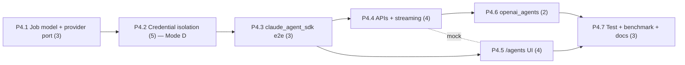

# Implementation Plan: Public Multi-User P4 — Embedded Agent Research

**Plan ID**: `IMPL-2026-07-06-PUBLIC-MULTIUSER-P4-AGENTS`
**Date**: 2026-07-06
**Author**: Implementation Planner Agent (expanded from Opus decisions block)
**Human Brief**: `docs/project_plans/human-briefs/public-multiuser-p4-agents.md`
**Related Documents**:
- **PRD**: `docs/project_plans/PRDs/features/public-multiuser-p4-agents-v1.md`
- **SPIKE (binding)**: `docs/project_plans/SPIKEs/public-multiuser-p4p5-foundations-spike.md` — ADR-002 (accepted GO)
- **Decisions Block**: `.claude/worknotes/public-multiuser-p4-agents/decisions-block.md`
- **Precedent**: `docs/project_plans/implementation_plans/public-multiuser-p2p3-opus-handoff.md`

**Complexity**: Large (Tier 3)
**Total Estimated Effort**: 24 story points
**Target Timeline**: Single-operator, agent-delegated execution; no fixed calendar target — gated by 4 sequential Mode-D human sign-offs (see below), not by wall-clock schedule.

## Executive Summary

Phase 4 adds a native, governed way to launch agent-driven follow-up research from inside Research Foundry: one `ResearchAgentProvider` (`claude_agent_sdk` first, per D1), a file-canonical agent-job model with SSE event streaming, and a frontend `/agents` route — all built on top of the SPIKE ADR-002 credential-isolation boundary (subprocess-per-agent-job, temp-file creds, write-time redaction firewall, salted-HMAC fingerprint). Proposed outputs never touch the Catalog or a report draft directly; they land in job-scoped staging and require an explicit human "accept" action (exit-code-7 `HUMAN_REVIEW`). The 7 phases are strictly sequential through the credential boundary (P4.1→P4.2→P4.3) — nothing provider-specific is built until the isolation layer is proven — then fan out: the API layer (P4.4) and the frontend route (P4.5) can build concurrently against mocked contracts, a second provider (P4.6) reuses the proven boundary, and P4.7 closes with the credential-firewall regression suite, the FU-1 benchmark writeup, and the two remaining Mode-D sign-offs. Auth/RBAC enforcement is explicitly out of scope (P5); this plan carries the nullable `workspace_id`/`created_by` fields forward unenforced (D12/D7), keeping the P4→P5 handoff migration-free.

## Implementation Strategy

### Architecture Sequence

This feature does not follow the generic Database→Repository→Service→API→UI→Testing→Docs→Deploy template ordering — it is a phased capability rollout gated by a security boundary, not a single vertical slice. The actual sequence (locked in the decisions block):

1. **Job/Provider Contract (P4.1)** — `agent_job*` schemas and the `ResearchAgentProvider` Protocol + registry are frozen before the security-critical isolation layer is built on top of them. No provider implementation yet.
2. **Credential Isolation & Firewall (P4.2, Mode D)** — subprocess spawn, temp-file credential delivery, write-time redaction guard, and key fingerprinting must be proven 0-credential-leak *before* any real provider key ever touches the boundary.
3. **First Provider Adapter E2E (P4.3)** — `claude_agent_sdk` is wired end-to-end through the isolation + governance gates and the existing Search Router / source-card / claim pipeline. One working vertical slice de-risks the API/streaming surface.
4. **Agent-Job APIs + Streaming + Acceptance (P4.4)** — the backend contract (launch/detail/events/cancel/accept) is stable and mockable before the frontend consumes it.
5. **Frontend `/agents` Route (P4.5)** — builds concurrently with P4.4 once P4.3's contracts are mocked (distinct file trees: backend `api/` vs frontend `runs-viewer/`).
6. **Second Provider Adapter (P4.6)** — `openai_agents` is added only after the whole vertical (model→API→UI→acceptance) is proven with the first provider.
7. **Testing, Benchmark, Docs (P4.7)** — credential-firewall regression suite, FU-1 benchmark writeup, Codex adversarial review, CHANGELOG, and the two remaining Mode-D sign-offs (redaction-guard-on-real-trace, pepper-storage location).

### Parallel Work Opportunities

**P4.4 (backend `api/`) ∥ P4.5 (frontend `runs-viewer/`)** once P4.3's job/artifact/event shapes are mocked (file-ownership split: no shared files, no serialization-barrier collision — see `wave_plan`). This is the only parallel slice in the plan; P4.1→P4.2→P4.3 are strictly serial through the credential boundary, and P4.6/P4.7 each depend on the P4.4/P4.5 outputs.

### Critical Path

P4.1 → P4.2 → P4.3 → P4.4 → P4.6 → P4.7, with P4.3 → P4.5 → P4.7 as the parallel branch that rejoins at P4.7. P4.2 (credential isolation) is the dominant risk and effort concentration on this path — see Risk Mitigation below.



### Phase Summary

| Phase | Title | Estimate | Target Subagent(s) | Model(s) | Notes |
|-------|-------|----------|--------------------|----------|-------|
| P4.1 | Job model + `ResearchAgentProvider` port | 3 pts | backend-architect, python-backend-engineer | sonnet (extended) | MUST-stay; contract design. No provider impl. |
| P4.2 | Credential isolation + firewall (Mode D) | 5 pts | python-backend-engineer, backend-architect | sonnet (extended) | **MUST-stay, no ICA/Codex.** Worktree isolation. Mode-D Gate #1 at entry. |
| P4.3 | First provider adapter (`claude_agent_sdk`) e2e | 3 pts | python-backend-engineer | sonnet (adaptive) | MUST-stay. Mode-D Gate #2 before real keys. |
| P4.4 | Agent-job APIs + event streaming + acceptance | 4 pts | python-backend-engineer | sonnet (adaptive) + **ICA Sonnet 4.6** (bounded endpoints, behind review gate) | Write-path (accept) stays MUST-stay. |
| P4.5 | Frontend `/agents` route | 4 pts | ui-engineer-enhanced | sonnet (adaptive) + **ICA Sonnet 4.6** (job-list/event-log subcomponents, behind review gate) | Launch form/gates stay on primary (governance-visible UI). |
| P4.6 | Second provider adapter (`openai_agents`) | 2 pts | python-backend-engineer, backend-architect | sonnet (adaptive) | Reuses P4.3 pattern; no new isolation code. |
| P4.7 | Testing, benchmark, docs | 3 pts | python-backend-engineer, documentation-writer | sonnet (adaptive) / haiku (docs) + **Codex gpt-5.5** (read-only adversarial review) | Mode-D Gates #3/#4. |
| **Total** | — | **24 pts** | — | — | — |

> Estimation rationale (H1–H6 sanity check, anchor comparison, bundle-vs-sum table) lives in the Human Brief: `docs/project_plans/human-briefs/public-multiuser-p4-agents.md` §2. Plan retains per-phase task estimates only.

## Mode-D Human Sign-Off Gates

Four explicit, sequential human approvals are required **during execution**, not automated away. Each must be logged (who approved, when, what was reviewed) before the next wave proceeds — silence is not a pass.

| Gate | Trigger | Phase | AC |
|------|---------|-------|-----|
| #1 | Approval **before** any subprocess-spawn or credential-file code is written | P4.2 entry | AC-6.1 |
| #2 | Approval **before** the first live job runs with real (non-test) provider keys | P4.3 | AC-6.2 |
| #3 | Approval verifying the write-time redaction guard against a **real run trace** (not synthetic) | P4.7 | AC-6.3 |
| #4 | Sign-off on the **server pepper storage location** before the key-fingerprint feature ships | P4.7 | AC-6.4 |

Detail and task-level placement: see phase files linked below.

## Phase Files

Detailed task breakdowns, acceptance criteria, and quality gates for each phase live in:

- **[Phase 1–2: Foundations](./public-multiuser-p4-agents-v1/phase-1-2-foundations.md)** — P4.1 Job model + provider port, P4.2 Credential isolation + firewall (Mode-D Gate #1)
- **[Phase 3–4: Backend Integration](./public-multiuser-p4-agents-v1/phase-3-4-backend-integration.md)** — P4.3 `claude_agent_sdk` e2e (Mode-D Gate #2), P4.4 Agent-job APIs + streaming + acceptance
- **[Phase 5: Frontend](./public-multiuser-p4-agents-v1/phase-5-frontend.md)** — P4.5 `/agents` route, launch/stream/Evidence Intake, runtime smoke
- **[Phase 6–7: Second Adapter & Validation](./public-multiuser-p4-agents-v1/phase-6-7-second-adapter-validation.md)** — P4.6 `openai_agents` adapter, P4.7 Testing/benchmark/docs (Mode-D Gates #3/#4)

## Deferred Items & In-Flight Findings Policy

### Deferred Items

| Item ID | Category | Reason Deferred | Trigger for Promotion | Target Spec Path |
|---------|----------|-----------------|-----------------------|-------------------|
| FU-1 | spike-needed | Spawn-latency micro-benchmark validates the subprocess design vs the documented in-process-scoping fallback (ADR-002); non-blocking per D3 so the critical path isn't stalled on a benchmark. | If the SEC-2.5 benchmark (phase-1-2-foundations.md) shows p95 spawn latency materially degrading interactive use (threshold set during writeup), the in-process-scoping fallback design must be promoted before P4.6/P4.7 close. | `docs/project_plans/design-specs/agent-job-spawn-latency-fu1.md` (authored in P4.7, task VAL-7.4) |
| FU-4 (partial) | dependency-blocked | The runs-API sensitivity existence-gate (`[[runs-api-no-sensitivity-existence-gate]]`) full remediation is P5 auth/RBAC scope. This plan's new agent-job endpoints must not *reopen* the pattern (identical-404 discipline), but do not need to *fix* the pre-existing gap. | P5 auth/RBAC implementation plan closes this globally. | N/A — no new spec; API-4.2 (phase-3-4-backend-integration.md) carries the identical-404 discipline forward as a non-regression constraint, tracked against the P5 PRD. |

### In-Flight Findings

**Lazy-creation rule**: `.claude/findings/public-multiuser-p4-agents-findings.md` is NOT pre-created. Create it only on the first real in-flight finding (schema gap, plan/reality mismatch). On creation: set `findings_doc_ref` in this plan's frontmatter, append the path to `related_documents`, and if load-bearing, add a corresponding design-spec task in P4.7.

### Quality Gate

P4.7 cannot be sealed until: `agent-job-spawn-latency-fu1.md` exists with a GO/fallback verdict (VAL-7.4) OR is explicitly marked incomplete with rationale; `agent-job-pepper-storage-decision.md` exists with Mode-D Gate #4 logged (VAL-7.5); `findings_doc_ref` is populated + `accepted` if any findings were captured, or remains `null` with "N/A — no findings captured."

## Risk Mitigation

### Technical Risks (from decisions block — verbatim)

| Risk | Severity | Rationale | Mitigation |
|------|----------|-----------|-------------|
| Prompt-injection exfiltration via live tool-use loop | High | `openai_agents` (P4.6) runs a live tool loop (SPIKE G3); a malicious source could coerce credential/data exfil. | Allowlisted tools/data-scopes in `policy_snapshot`; subprocess boundary; write-time redaction firewall; staging-only outputs; SDK-native guardrails; Codex adversarial review in P4.7 (VAL-7.2). |
| Credential leak into artifacts/events/browser | High | Today artifacts serialize to the run trace which the viewer statically exports (SPIKE G2). | Write-time `_redact` guard (not post-hoc scan, P4.2); fingerprint-only telemetry; secret-scan CI assertion as P4.2's exit gate. |
| Subprocess spawn latency prohibitive | Medium | New spawn path, latency unmeasured (SPIKE FU-1). | FU-1 benchmark early in P4.2 (non-blocking, SEC-2.5); documented in-process-scoping fallback (D3). |

### Schedule / Process Risks

| Risk | Impact | Likelihood | Mitigation |
|------|--------|------------|-------------|
| Server pepper for key fingerprint itself becomes a credential-storage problem | Med | Med | Explicit Mode-D Gate #4 before shipping the fingerprint feature (P4.7, VAL-7.5); OQ-2/pepper-storage decision doc. |
| Scope creep into P5 auth/RBAC during implementation | Med | Med | Explicit Out-of-Scope in PRD §7; nullable D12 fields carried but unenforced; any auth-adjacent work discovered mid-phase triggers stop-and-escalate per Mode D. |
| Mode-D gate silently skipped under delegation pressure | High | Low | Gates are frontmatter `decision_gates` (this plan) — Opus must confirm each is logged before advancing the wave; reviewer gates below cross-check. |

## Reviewer Gates

| Phase | Reviewer | Trigger |
|-------|----------|---------|
| P4.1 | `task-completion-validator` | End of phase |
| P4.2 | `task-completion-validator` + **`karen`** | End of phase (security milestone) |
| P4.3 | `task-completion-validator` | End of phase |
| P4.4 | `task-completion-validator` | End of phase |
| P4.5 | `task-completion-validator` + **`karen`** | End of phase (integration milestone) |
| P4.6 | `task-completion-validator` | End of phase |
| P4.7 | `task-completion-validator` + **`karen`** | End of phase (end-of-feature, Tier 3) |

A phase is not "complete" until its reviewer(s) pass it. Silent reviewers (`karen` returning only an idle notification) are never treated as a pass — re-invoke and confirm an explicit verdict.

## Model & Effort Assignment

Phase-level `model`/`effort` defaults live in this plan's `wave_plan.phases[]` frontmatter; per-task `Model`/`Effort` (and, where offload applies, `Provider`) columns in the phase files override those defaults. Canonical vocabulary: `.claude/skills/planning/references/multi-model-guidance.md`.

**Offload waves (locked, verbatim from decisions block):**
- **ICA Sonnet 4.6** (`~/ica-claude.sh`, `claude-sonnet-4-6[1m]`) takes P4.4's bounded, contract-clear endpoints and P4.5's job-list/event-log subcomponents — both **behind a `task-completion-validator` gate**. Pipe long prompts via stdin (ICA gotcha, per P2/P3 precedent); give the FE delegate the mockup + AppShell nav pattern.
- **Codex gpt-5.5** (`codex exec`, read-only sandbox): adversarial review of the credential firewall (P4.2 design, exercised in P4.7 task VAL-7.2) + final-plan review. Never used for Mode-D implementation.
- **MUST-stay on Claude subscription (no ICA/Codex for implementation)**: P4.1, P4.2, P4.3, P4.6 — contract design, credentials, and both provider adapters.

## Resource Requirements

Single-operator, agent-delegated execution (no team FTE allocation). Human time budget is concentrated at the 4 Mode-D gates (review + explicit sign-off, not implementation) and at the 3 `karen` milestone reviews (P4.2, P4.5, P4.7). Agent composition per phase is listed in the Phase Summary table above and detailed in each phase file's "Agent Routing" note.

## Success Metrics

See `success_metrics` in this plan's frontmatter (mirrors PRD §4 Success Metrics verbatim):
- 0 raw provider credentials in job artifacts/events/browser traffic (secret-scan assertion).
- 100% of accepted-to-catalog agent outputs carry a resolvable `created_by_agent_job_id` via the acceptance endpoint.
- 100% of `agent_job_event` rows carry a `key_fingerprint` when a credential was resolved.
- 0 unapproved catalog/report/file mutations from an agent job in the E2E suite.

## Communication Plan

- Mode-D gate approvals are logged inline in the executing session (who/when/what reviewed) — not a separate status report.
- `karen` milestone reviews at P4.2/P4.5/P4.7 serve as the formal checkpoint communication; no additional standup/report cadence for this single-operator feature.

## Post-Implementation

- CCDash telemetry: confirm `key_profile_used` + `key_fingerprint` land on agent-job events in production use (not just test fixtures).
- Monitor FU-1 benchmark numbers against real usage patterns; revisit the in-process-scoping fallback if spawn latency complaints surface post-ship.
- P5 (auth/RBAC) picks up enforcement of the nullable `workspace_id`/`created_by` fields this plan carries forward unenforced — confirm P4 is merged before P5 implementation begins (see Human Brief §3 cross-feature coupling).

---

## Wrap-Up: Feature Guide & PR

**Triggered**: Automatically after P4.7 is sealed (all phase quality gates pass, including both remaining Mode-D gates).

### Step 1 — Feature Guide

Delegate to `documentation-writer` (haiku) to create `.claude/worknotes/public-multiuser-p4-agents/feature-guide.md`.

**Frontmatter**:
```yaml
---
doc_type: feature_guide
feature_slug: "public-multiuser-p4-agents"
prd_ref: docs/project_plans/PRDs/features/public-multiuser-p4-agents-v1.md
plan_ref: docs/project_plans/implementation_plans/features/public-multiuser-p4-agents-v1.md
spike_ref: docs/project_plans/SPIKEs/public-multiuser-p4p5-foundations-spike.md
adr_refs: ["ADR-002"]
created: <today>
---
```

**Required sections** (keep under 200 lines): What Was Built; Architecture Overview (link ADR-002, don't re-litigate); How to Test (loopback job launch → stream → accept flow; credential-isolation regression suite); Test Coverage Summary; Known Limitations (in-process fallback status if FU-1 triggered it; P5 auth/RBAC deferral).

Commit the feature guide before opening the PR.

### Step 2 — Open PR

```bash
gh pr create \
  --title "feat(agents): P4 embedded agent research (ResearchAgentProvider, credential isolation)" \
  --body "$(cat <<'EOF'
## Summary
- Adds ResearchAgentProvider abstraction + governed agent-job model (launch/stream/artifacts/accept)
- Subprocess-per-agent-job credential isolation per ADR-002 (temp-file creds, write-time redaction firewall, salted-HMAC fingerprint)
- Frontend /agents route: launch flow, live event stream, Evidence Intake accept/reject

## Feature Guide
.claude/worknotes/public-multiuser-p4-agents/feature-guide.md

## Test plan
- [ ] All unit + integration tests pass
- [ ] Credential-isolation regression suite green (secret-scan, crash-safety, code-path audit)
- [ ] Smoke-tested locally (loopback mode)
- [ ] Static-export mode shows the correct disabled/informational /agents state
- [ ] All 4 Mode-D gates logged with explicit sign-off

🤖 Generated with Claude Code
EOF
)"
```

Derive PR summary bullets from this plan's Executive Summary and the CHANGELOG entry authored in P4.7.

---

**Implementation Plan Version**: 1.0
**Last Updated**: 2026-07-06
