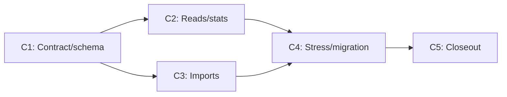

# WKSP-304 Catalog Stats and Import Workspace Seams — Implementation Plan

**Human Brief**: `docs/project_plans/human-briefs/wksp-304-catalog-stats-import-workspace-seams.md`

## 1. Executive Summary

This addendum closes the catalog stats and import ownership gaps found after the original
WKSP-304 plan completed. The critical path first projects canonical run ownership/visibility,
then applies one own-or-public read predicate, then authorizes import mutations against the
canonical owner. Migration and concurrency tests follow before documentation and human-governance
handoff.

## 2. Architecture Contract

```text
request.state.identity
  -> router optional identity
  -> export canonical run owner + visibility
  -> catalog authorization (owner-only writes)
  -> derived SQLite projection
  -> read predicate (own OR public) AND sensitivity threshold
```

- Identity authorizes and attributes; canonical run metadata owns.
- Public grants cross-workspace read visibility only.
- `identity=None` bypasses new enforcement and preserves the single-user path.
- Catalog remains derived; Markdown/YAML evidence and claim provenance remain authoritative.

## 3. Phase Summary

| Phase | Scope | Estimate | Primary agent | Model / effort | Gate |
|---|---|---:|---|---|---|
| C1 | Contract, export projection, schema bump | 2.0 | data-layer-expert | sonnet / extended | validator |
| C2 | Stats/read/facet own-or-public scoping | 2.0 | python-backend-engineer | sonnet / extended | validator |
| C3 | Owner-authorized import and attribution | 2.5 | backend-architect | sonnet / extended | validator |
| C4 | Migration, rollback, concurrency, provenance | 2.0 | python-backend-engineer | sonnet / extended | validator |
| C5 | Docs, changelog, governance closeout | 1.5 | documentation-writer | haiku / adaptive | validator + Karen |
| **Total** |  | **10.0** |  |  |  |

## 4. Dependency and Batch Plan



- Only one active writer may modify `catalog_service.py`.
- C2 test design and C3 audit design may be read-only parallel work after C1; implementation is
  serialized.
- Each phase starts only after the prior required exact-tree reviewer gate passes.

## 5. Requirement Traceability

`P4` is the user-supplied requirement ID. Execution phases use `C1`–`C5`.

| Requirement | FR/AC mapping | Tasks and tests |
|---|---|---|
| WKSP-304 | FR-1–FR-12 / AC-1–AC-12 | C1-1 through C5-REVIEW and the complete validation matrix |
| P4 | FR-1–FR-12 / AC-1–AC-10 | C1-1 through C4-REVIEW; catalog service/router and targeted catalog tests |

## 6. Phase C1 — Canonical Projection and Derived Schema

**Entry**: PRD and decisions block reviewed.

| ID | Task | Acceptance criteria | Files | Est. | Assignee |
|---|---|---|---|---:|---|
| C1-1 | Freeze owner/visibility DTO contract | Export projection returns normalized canonical `workspace_id` and `visibility`; no caller-controlled owner field | `export_service.py`, tests | 0.5 | backend-architect |
| C1-2 | Bump derived catalog schema | Add item visibility plus operational audit-outbox/import-log fields; document build-then-swap migration | `catalog_service.py` | 0.5 | data-layer-expert |
| C1-3 | Replace authenticated hardcoded default | Row builders use canonical owner/visibility; `identity=None` legacy default remains | `catalog_service.py`, `test_catalog_service.py` | 0.5 | python-backend-engineer |
| C1-4 | Rebuild/default fixtures | v4 mismatch rebuilds; absent visibility becomes workspace-private; no fictional actor history | `test_catalog_service.py` | 0.3 | data-layer-expert |
| C1-REVIEW | Exact-tree phase review | `task-completion-validator` verifies canonical ownership and single-user compatibility | review artifact | 0.2 | task-completion-validator |

**Exit gate**: projected owner/visibility is canonical, migration is rebuild-only, and existing
identity-free import determinism remains green.

## 7. Phase C2 — Identity-Scoped Stats, Reads, and Facets

| ID | Task | Acceptance criteria | Files | Est. | Assignee |
|---|---|---|---|---:|---|
| C2-1 | Centralize read predicate | Parameterized own-or-public predicate composes with sensitivity threshold | `catalog_service.py` | 0.4 | python-backend-engineer |
| C2-2 | Thread stats identity | Router passes optional identity; counts, `runs_indexed`, and `last_import_at` are scoped | `catalog.py`, `catalog_service.py` | 0.4 | python-backend-engineer |
| C2-3 | Apply predicate to detail/links | Public foreign visible; private foreign absent; outgoing/incoming/citing joins cannot leak | `catalog_service.py` | 0.3 | python-backend-engineer |
| C2-4 | Close every facet | Project/status/sensitivity/term/role facets use the same visible corpus | `catalog_service.py`, `test_catalog_terms.py` | 0.4 | python-backend-engineer |
| C2-5 | Mixed-visibility leak matrix | Own/private + foreign/public included; foreign/private contributes to no total/facet/timestamp | `test_workspace_isolation_enforcement.py`, `test_serve_catalog.py` | 0.3 | python-backend-engineer |
| C2-REVIEW | Exact-tree phase review | Reviewer removes/perturbs one predicate and confirms tests detect leakage | review artifact | 0.2 | task-completion-validator |

**Required regression anchors**:

- `tests/unit/test_catalog_service.py` existing identity-none/advisory patterns;
- `tests/unit/test_catalog_terms.py` sensitivity and term/role join-leak cases;
- `tests/test_workspace_isolation_enforcement.py` workspace facet cases;
- `tests/test_serve_catalog.py` empty/global stats baselines.

## 8. Phase C3 — Owner-Authorized Import and Attribution

| ID | Task | Acceptance criteria | Files | Est. | Assignee |
|---|---|---|---|---:|---|
| C3-1 | Thread optional identity | Three catalog routes pass identity; CLI/rebuild callers need no changes | `catalog.py`, `catalog_service.py` | 0.3 | python-backend-engineer |
| C3-2 | Authorize per-run import | Canonical owner is resolved before any transaction/write; missing/foreign private/public deny identically | `catalog_service.py`, `export_service.py` | 0.7 | backend-architect |
| C3-3 | Scope bulk discovery | Authenticated bulk import discovers owner runs only; errors/totals reveal no foreign run | `catalog_service.py` | 0.5 | backend-architect |
| C3-4 | Add authoritative audit handoff | Transaction stores a stable-ID outbox envelope; post-commit append targets authoritative `audit_service`; denial writes audit only; append failure is typed; restart replays and duplicate IDs acknowledge without duplicate attribution | `catalog_service.py`, `audit_service.py` | 0.4 | backend-architect |
| C3-5 | Zero-write and spoof tests | SQL spies prove denied calls execute no catalog DB mutation; identity cannot transfer ownership; required denial audit still records | `test_catalog_service.py`, `test_rbac_catalog.py` | 0.4 | python-backend-engineer |
| C3-REVIEW | Exact-tree phase review | Reviewer verifies public is read-only, outbox replay is idempotent, and attribution does not fabricate history | review artifact | 0.2 | task-completion-validator |

## 9. Phase C4 — Migration, Rollback, Concurrency, Provenance

| ID | Task | Acceptance criteria | Files | Est. | Assignee |
|---|---|---|---|---:|---|
| C4-1 | Provenance snapshot harness | Hash and mtime run YAML, source Markdown, claim ledger, evidence bundles, report draft, anchors | `test_catalog_concurrency.py` | 0.3 | python-backend-engineer |
| C4-2 | Build-then-swap and rollback | Quiesce imports and flush/ack all pending audit envelopes before build; abort swap if flush fails; build sibling DB, validate, atomic replace, retain bounded audit-clean prior DB; reverted-code rollback restores compatible backup or rebuilds old derived schema | `catalog_service.py`, `test_catalog_service.py`, `test_catalog_concurrency.py` | 0.4 | data-layer-expert |
| C4-3 | Interruption and pending-audit matrix | Interrupt before/during audit flush, during build, immediately before swap, and after swap; prove pending survival across restart, stable-ID replay/ack, duplicate suppression, swap refusal while pending, and schema-version restore vs rebuild | `test_catalog_concurrency.py` | 0.3 | data-layer-expert |
| C4-4 | Same-run and authorization races | Same-owner imports converge; denied foreign import cannot delete, replace, or relabel owner rows | `test_catalog_concurrency.py` | 0.3 | python-backend-engineer |
| C4-5 | Bulk/rebuild/read races | `import_all` vs per-run/rebuild and readers vs importer observe complete snapshots or bounded typed retry; outbox attribution remains unmixed | `catalog_service.py`, `test_catalog_concurrency.py` | 0.4 | data-layer-expert |
| C4-REVIEW | Exact-tree phase review | Full targeted suite green; reviewer inspects swap/rollback, transaction, audit handoff, and provenance hashes | review artifact | 0.3 | task-completion-validator |

Raw `database is locked`, unbounded retry, partial delete/insert visibility, or mixed owner/
visibility state fails the phase.

## 10. Phase C5 — Documentation and Governance Closeout

| ID | Task | Acceptance criteria | Files | Est. | Assignee |
|---|---|---|---|---:|---|
| C5-1 | Operator documentation | Document own/public reads, owner-only import, denial/audit behavior, migration/rebuild | operator guide/runbook | 0.4 | documentation-writer |
| C5-2 | CHANGELOG | Add user-facing behavior under `[Unreleased]` without deployment claims | `CHANGELOG.md` | 0.2 | changelog-generator |
| C5-3 | DI-1 evidence delta | Record tested surfaces and remaining blocked-external scope; do not change human decision | delta audit/report | 0.3 | documentation-writer |
| C5-4 | Validation ledger | Record exact commands, candidate tree, and honest status labels | completion artifact | 0.2 | task-completion-validator |
| C5-REVIEW | Feature review | Karen reviews all ACs and claim boundaries on exact candidate tree | review artifact | 0.4 | karen |

## 11. Validation Matrix

Minimum targeted commands during execution:

```bash
pytest -q tests/unit/test_catalog_service.py
pytest -q tests/unit/test_catalog_terms.py
pytest -q tests/unit/test_rbac_catalog.py
pytest -q tests/test_workspace_isolation_enforcement.py
pytest -q tests/test_serve_catalog.py
pytest -q tests/unit/test_catalog_concurrency.py
```

Run the repository’s authoritative full suite after targeted gates. Existing unrelated failures
must be baseline-classified, not hidden or counted as feature success.

## 12. Risk and Stop Conditions

Stop and escalate if:

- canonical run owner/visibility cannot be obtained without reading ungoverned raw files outside
  the export contract;
- public visibility semantics conflict with the accepted run isolation ADR;
- concurrency safety requires changing canonical Markdown/YAML write behavior;
- the schema bump cannot rebuild deterministically;
- a reviewer finds a new foreign-private side channel;
- any step would automate DI-1/Mode-D human acceptance.

## 13. Deferred Items and Findings Policy

No deferred product item is authorized by this plan. New multi-tenant surfaces discovered during
execution become a findings report/design spec and a new gate; they are not silently absorbed.
DI-1 remains an external human governance gate, not an implementation task.

## 14. Completion Boundary

Completion requires all phase reviewers and final Karen review. Even then, the allowed claim is
“repository behavior technically verified for the tested catalog seams.” It is not proof of
adversarial multi-tenant safety, owner-data qualification, public deployment, clinical
validation, or released hosted service.
