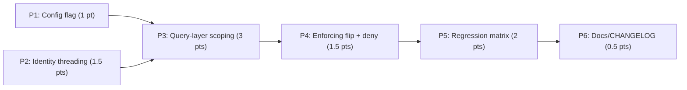

# Implementation Plan: WKSP-304 — Row-Level Workspace Isolation Enforcement

**Plan ID**: `IMPL-2026-07-08-WKSP-304`
**Date**: 2026-07-08
**Author**: implementation-planner (Claude Sonnet 5), orchestrated by Opus decisions block
**Human Brief**: `docs/project_plans/human-briefs/wksp-304-workspace-isolation-enforcement.md`
**Related Documents**:
- **PRD**: `docs/project_plans/PRDs/harden-polish/wksp-304-workspace-isolation-enforcement-v1.md`
- **Decisions Block**: `.claude/worknotes/wksp-304-workspace-isolation-enforcement/decisions-block.md`
- **Exploration Findings**: `.claude/worknotes/wksp-304-workspace-isolation-enforcement/exploration-findings.md`
- **ADRs**: None yet — cross-workspace deny status code (D5, pending) may warrant a lightweight ADR if contested during P4 review.

**Complexity**: Medium (Tier 2) | **Total Estimated Effort**: 10 pts | **Target Timeline**: ~7-8 working days

---

## Executive Summary

Research Foundry's row-level workspace isolation is currently advisory-only: `require_workspace_scope()` logs a WARNING on cross-workspace mismatch but always returns `allowed=True`. This plan flips that gate to fail-closed in six phases: (P1) add an orthogonal `workspace_isolation_enforcement` config flag mirroring the already-shipped `auth.rbac_enforcement` pattern; (P2) thread caller identity from 6 routers into 3 services (inert); (P3) add flag-gated `workspace_id` WHERE predicates to ~60-80 query points across the 3 services, closing JOIN/tombstone leaks (inert until P4); (P4) atomically arm the enforcement gate — flip to deny, wire 404-on-read/list-omit/mutation-deny; (P5) land a ~40-50 test regression matrix including mutation-tested leak coverage; (P6) close out CHANGELOG/runbook/docstring documentation. The critical invariant governing this plan is the **P3-to-P4 ordering**: P3's query-layer predicates are structurally inert (flag-gated off) so P2/P3 carry zero deny-risk; P4 is the single atomic "arm it" step and must not begin until P3's 100%-coverage checklist signs off (see P4 `entry_criteria` below). Single-operator (`identity=None`) callers are unconditionally exempt by construction, verified by an unmodified pass of the full pre-existing test suite with enforcement globally enabled.

---

## Implementation Strategy

### Architecture Sequence

This feature does not follow the standard DB -> Repository -> Service -> API -> UI layering (no new tables, no repository layer distinct from services, no UI). Its sequence is dictated by data-flow order instead:

1. **Config Layer** (P1) — the enforcement flag must exist and resolve before anything reads it.
2. **Identity Plumbing** (P2) — caller identity must reach the service call signature before the query body can consume it. Inert; zero deny-risk.
3. **Query-Layer Scoping** (P3) — the `workspace_id` predicate is added to every read/list method and every JOIN/tombstone path. Flag-gated inert until P4; single-owner phase for query-correctness cohesion.
4. **Enforcement Gate** (P4) — the atomic arming step: flip `allowed=False` on mismatch, wire deny paths, prove the `identity=None` short-circuit ordering.
5. **Regression Verification** (P5) — the runtime-verification phase; every AC and every `target_surfaces` entry gets an explicit test.
6. **Documentation Finalization** (P6) — CHANGELOG, runbook, docstring parity.

### Parallel Work Opportunities

- **P1 ∥ P2**: the config flag (`config.py`) and router identity threading (6 router files) touch disjoint files and are both inert (D4) — they can run concurrently and converge before P3 consumes both.
- Everything from **P3 onward is serial**. P3 is deliberately single-owner (do not fan across 3 agents by service — JOIN-leak reasoning must be held in one context, per decisions block §2). P4 arms the gate after P3 completes. P5 verifies after P4. P6 documents after P5's mandatory gate.

### Critical Path

**P1 → P3 → P4 → P5 → P6** (P2 joins before P3 consumes identity; P1 and P2 are the only parallelizable slice).

### Phase Summary

| Phase | Title | Estimate | Target Subagent(s) | Model(s) | Notes |
|-------|-------|----------|--------------------|----------|-------|
| P1 | Config flag + fail-closed validation | 1 pt | python-backend-engineer | sonnet (adaptive) | Mechanical copy of `auth.rbac_enforcement` pattern (`config.py:471-560`). |
| P2 | Identity threading, router -> service | 1.5 pts | python-backend-engineer | sonnet (adaptive) | Inert plumbing across 6 routers; integration_owner for the P2<->P3 seam. |
| P3 | Query-layer scoping (3 services) | 3 pts | data-layer-expert, backend-architect | sonnet (extended) | Largest phase; ~60-80 query points; single-owner query correctness; **P3->P4 exit gate**. |
| P4 | Enforcing flip + deny paths | 1.5 pts | backend-architect, python-backend-engineer | sonnet (extended) | Mode D core: atomic arming step; D3 short-circuit ordering proof. |
| P5 | Regression + enforcement test matrix | 2 pts | python-backend-engineer | sonnet (adaptive) | ~40-50 tests; mutation-tested leak coverage; **mandatory task-completion-validator gate**. |
| P6 | Docs / CHANGELOG / runbook | 0.5 pts | documentation-writer, changelog-generator | haiku (adaptive) | Closing doc pass + final regression sign-off. |
| **Total** | — | **10 pts** | — | — | — |

> Estimation rationale (H1-H6 sanity check, anchor comparison to P5.6) lives in the Human Brief. This plan retains per-phase task estimates only.

---

## Acceptance Criteria Traceability

Structured ACs are carried over verbatim from PRD §7 (`docs/project_plans/PRDs/harden-polish/wksp-304-workspace-isolation-enforcement-v1.md`), with phase and P5 test-ID mapping added by this plan. Full AC bodies (target_surfaces, propagation_contract, resilience, visual_evidence_required) live in the PRD; this table is the plan-level index.

| AC | Short Description | Implemented In | Verified In (P5) | Notes |
|----|--------------------|-----------------|-------------------|-------|
| AC-1 | Identity threading across all 6 in-scope routers | Phase 2 (TASK-2.1, TASK-2.2, TASK-2.3, TASK-2.4-seam) | TASK-5.2 | See Phase 1-2 file for target_surfaces (6 router paths). |
| AC-2 | Query-layer `workspace_id` scoping in 3 services | Phase 3 (TASK-3.1, TASK-3.2, TASK-3.3) | TASK-5.1 | ~20-25 methods / ~60-80 query points; see Phase 3 file. |
| AC-3 | Deny path — 404 on read, list omits, under enforcement | Phase 4 (TASK-4.1, TASK-4.2) | TASK-5.1 | `scope.py` + 3 services; `workspace_id IS NULL` treated as mismatch. |
| AC-4 | No join or tombstone leaks | Phase 3 (TASK-3.4) | TASK-5.3 | Primary regression class this AC exists to catch; mutation-tested. |
| AC-5 | Mutation endpoints deny cross-workspace targets | Phase 4 (TASK-4.3) | TASK-5.4 | Verified via zero-UPDATE/DELETE-issued spy test. |
| AC-6 | Single-operator fallback fully preserved | Cross-cutting (P1-P4 construction; D3) | TASK-5.5 | Re-confirmed at close-out by TASK-6.1 (Phase 6). Critical severity — "break it if you dare" gate. |
| AC-7 | Config fail-closed invariants | Phase 1 (TASK-1.1, TASK-1.2) | TASK-5.6 | Loopback guard + `auto` provider-keyed resolution + invalid-enum ValueError. |

**R-P2 note** (carried from PRD): This feature adds no new field to any API response schema — `workspace_id` already exists on every record since the P5.3 backfill. No new FE resilience AC is required; frontend is out of scope.

**R-P4 note** (carried from PRD): Not applicable — no `*.tsx` files in `files_affected`; backend-only enforcement flip. The P5 "runtime smoke" equivalent for this backend feature is the full regression matrix referencing every `target_surfaces` entry across AC-1..AC-7 (see Phase 5 file).

---

## Deferred Items & In-Flight Findings Policy

### Deferred Items

**DI-1: Full workspace-data-access completeness audit** — Audit all read/create/list/delete service paths across every service (not only the two gaps fixed by this bounded remediation) for cross-workspace isolation enforcement. Discovered by karen's end-of-feature review 2026-07-09. HARD PRE-DEPLOY GATE for any shared-store multi-tenant deployment.

Per PRD §"Deferred Items": all original FR-1 through FR-10 and AC-1 through AC-7 scope from exploration is covered by this implementation. Out-of-scope items (PRD §8: auth-core changes, new auth providers, frontend, cross-workspace admin override, multi-region sharding, `runs.py` router) remain explicit exclusions, not deferrals, and carry no `DI-` backlog reference. DI-1 above is a new deferral discovered during end-of-feature review, not an original-scope gap.

### In-Flight Findings

Lazy-creation rule applies: `.claude/findings/wksp-304-workspace-isolation-enforcement-findings.md` is created only on the first real finding during execution (e.g., a 4th hidden query-point caller surfacing during P3's grep re-confirmation — see Phase 3 file, TASK-3.0). `findings_doc_ref` stays `null` until then.

---

## Phase Breakdown

Detailed task tables, entry/exit criteria, and quality gates live in phase files (this plan exceeds the 800-line single-file budget once fully expanded). Each phase file follows the phase-breakdown-template.md structure.

| Phase | File | Entry Criteria (summary) | Exit Criteria (summary) |
|-------|------|---------------------------|--------------------------|
| P1 | [Phase 1-2: Config Flag + Identity Threading](./wksp-304-workspace-isolation-enforcement-v1/phase-1-2-config-identity.md) | None (wave 1) | Flag resolves correctly across all provider/bind permutations; `ValueError` raised on the forbidden combo. |
| P2 | [Phase 1-2: Config Flag + Identity Threading](./wksp-304-workspace-isolation-enforcement-v1/phase-1-2-config-identity.md) | None (wave 1) | Every in-scope router passes identity to the service layer; existing suite unmodified-green; seam task confirms propagation. |
| P3 | [Phase 3: Query-Layer Scoping](./wksp-304-workspace-isolation-enforcement-v1/phase-3-query-layer-scoping.md) | P1 + P2 complete | **100%-coverage checklist signed off** — every AC-2 method carries a parameterized, flag-gated predicate; every JOIN/tombstone closed (AC-4); existing suite green in advisory mode. |
| P4 | [Phase 4: Enforcing Flip + Deny Paths](./wksp-304-workspace-isolation-enforcement-v1/phase-4-enforcing-flip.md) | **MUST NOT START until P3's 100%-coverage checklist (TASK-3.6) has signed off.** This is the non-negotiable P3->P4 ordering invariant (decisions block D4, Risk 1). Starting P4 with any unscoped AC-2 method causes a self-inflicted false-deny outage and masks real leaks. | With flag enabled, cross-workspace denied; with `identity=None`, fully functional; advisory mode behaviorally unchanged; `task-completion-validator` passes the fail-closed invariants. |
| P5 | [Phase 5: Regression + Enforcement Test Matrix](./wksp-304-workspace-isolation-enforcement-v1/phase-5-regression-matrix.md) | P4 complete and validator-passed | Full ~40-50 test matrix green; leak tests fail when a predicate is deliberately removed (mutation-tested); **mandatory `task-completion-validator` gate** before P6. |
| P6 | [Phase 6: Docs / CHANGELOG / Runbook](./wksp-304-workspace-isolation-enforcement-v1/phase-6-docs-changelog.md) | P5 gate passed | CHANGELOG `[Unreleased]` entry lands; runbook updated; `config.py` docstring parity; final regression sign-off (TASK-6.1); `karen` end-of-feature review passes. |

---

## Risk Mitigation

### Technical Risks (carried from decisions block §3, mapped to phases)

| Risk | Severity | Phase | Mitigation |
|------|----------|-------|-------------|
| R1: Enforcing flip lands before queries are fully scoped (ordering violation) | High | P3 -> P4 boundary | D4 makes P3 predicates inert until the flag flips; P4 `entry_criteria` blocks on P3's 100%-coverage checklist (TASK-3.6). This is the plan's single most important gate. |
| R2: Single-operator fallback (`identity=None`) breaks during signature churn | Critical | P2, P3, P4 (construction); P5, P6 (verification) | D3 — `identity is None -> allowed` short-circuit is the first statement in the gate, before any flag read, by construction. AC-6 verified by an unmodified full-suite pass with enforcement globally enabled (TASK-5.5); re-confirmed at TASK-6.1. |
| R3: JOIN / tombstone leaks (scoped primary row surfaces an unscoped joined/soft-deleted row) | High | P3 (closure), P5 (verification) | AC-4 dedicated requirement; ~15 mutation-tested leak edge-case tests (TASK-5.3); code-review checklist item in TASK-3.6: "does every JOIN target and every tombstone filter also carry `workspace_id`?" |
| R4: A query point outside the enumerated set (hidden caller / 4th surface) | Medium | P3 (TASK-3.0 pre-work) | Re-run `grep -rln` over routers + services to confirm the caller set before edits. `workspace_id IS NULL` is treated as a mismatch (deny) under enforcement — a safety net for any row/path that slips scoping. |
| R5: SQL injection via new predicates | Medium | P3 (implementation), P5 (TASK-5.7 verification) | All predicates parameterized (`?` / native placeholder); code review flags any f-string/`%`-format in a WHERE clause; dedicated injection-safety assertions per query point. |

### Schedule Risks

| Risk | Impact | Likelihood | Mitigation |
|------|--------|------------|-------------|
| P3 scope underestimated (60-80 query points is a range, not a count) | Medium | Medium | TASK-3.0 re-confirms the exact caller/query-point set before estimating remaining P3 sub-tasks; if the count materially exceeds 80, escalate to Opus for a P3 re-split rather than silently compressing the checklist. |
| P4 rushed to unblock P5/P6 | High | Low | P4 `entry_criteria` is a hard gate, not a soft target; `task-completion-validator` is mandatory before P5 can begin drafting against a real enforcing build. |

---

## Reviewer Gates

Per Tier 2 reviewer-gate policy (`.claude/skills/dev-execution/validation/completion-criteria.md`):

| Gate | Phase | Reviewer | Blocking? |
|------|-------|----------|-----------|
| Phase-end validation | P1, P2, P3, P4, P5, P6 | `task-completion-validator` | Yes — each phase must pass before the next phase's owner is dispatched. |
| P3 exit gate (100%-coverage checklist) | P3 -> P4 boundary | `task-completion-validator` (reviews TASK-3.6 checklist output) | Yes — hard gate per P4 `entry_criteria` above. |
| P4 fail-closed invariant review | P4 -> P5 boundary | `task-completion-validator` | Yes — reviews D3 ordering proof + deny-path wiring before the regression matrix is authored against it. |
| Mandatory pre-P6 gate | P5 -> P6 boundary | `task-completion-validator` | Yes — explicit per decisions block §1 ("mandatory task-completion-validator gate before P6"). |
| End-of-feature review | After P6 | `karen` | Yes — Mode D / `risk_level: high` feature; no feature-complete claim stands without karen's sign-off. |

---

## Resource Requirements

### Team Composition (agent routing)

- **python-backend-engineer** (sonnet): P1 (solo), P2 (solo), P4 (secondary), P5 (solo). Established plumbing + test-authoring patterns.
- **data-layer-expert** (sonnet, extended): P3 primary — owns SQL predicate correctness and JOIN/tombstone closure reasoning; the single highest-stakes implementation role in this plan.
- **backend-architect** (sonnet, extended): P3 secondary (gate-helper contract review), P4 primary — owns the fail-closed flip and D3 ordering proof.
- **documentation-writer** (haiku): P6 — CHANGELOG, runbook, docstring.
- **changelog-generator** (haiku): P6 — CHANGELOG entry authoring/verification.

### Skill Requirements

- Raw parameterized SQL (SQLite; Postgres placeholder-style TBD per OQ-3, resolved in Phase 3 pre-work).
- FastAPI router/service call-signature conventions (existing `request.state.identity` pattern).
- pytest fixture design for 2-workspace test scenarios; mutation-testing discipline (deliberately break a predicate, confirm the test catches it).

---

## Success Metrics

Carried from PRD §4 "Success Metrics" (source of truth; do not re-derive):

| Metric | Baseline | Target | Measurement Method |
|--------|----------|--------|---------------------|
| Cross-workspace record leaks in regression matrix | N/A (advisory mode, untested) | 0 | Phase 5 enforcement test matrix |
| Single-operator (`identity=None`) test pass rate | 100% (advisory mode) | 100% (enforcing mode) | Existing + new fallback tests (TASK-5.5, TASK-6.1) |
| Enforcement regression tests passing | 0 (do not exist yet) | ~40-50 / ~40-50 | `pytest` full suite for this feature |
| Config validation matrix (loopback x enforcement value) | N/A | 100% pass | `tests/test_config_workspace_enforcement.py` (TASK-5.6) |

---

## Wrap-Up: Feature Guide & PR

Triggered automatically after Phase 6 is sealed (all phase quality gates pass + `karen` end-of-feature review).

**Step 1 — Feature Guide**: Delegate to `documentation-writer` (haiku) to create `.claude/worknotes/wksp-304-workspace-isolation-enforcement/feature-guide.md` per the standard frontmatter and section set (What Was Built, Architecture Overview, How to Test [advisory vs enforcing modes], Test Coverage Summary, Known Limitations [e.g., no cross-workspace admin override — OQ-2 deferred]).

**Step 2 — Open PR**: Standard `gh pr create` flow per the implementation-plan-template.md wrap-up convention, once the feature guide is committed. Derive PR summary bullets from this plan's Executive Summary and the Phase 6 CHANGELOG entry.

---

**Progress Tracking:**

See `.claude/progress/wksp-304-workspace-isolation-enforcement/all-phases-progress.md` (created after this plan is approved).

---

**Implementation Plan Version**: 1.0
**Last Updated**: 2026-07-08
