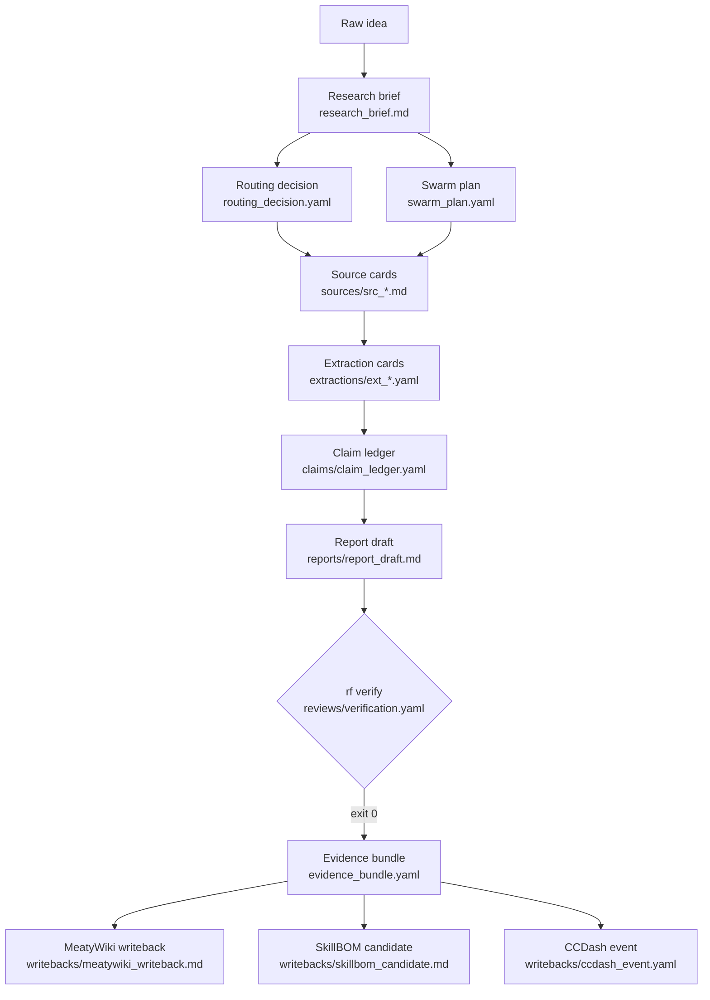

# Anatomy of One Run: RIB-002

This page traces a single RF run — **RIB-002**, the hallucination-mitigation literature review — from raw idea through verified evidence bundle. Every excerpt comes from the real committed files in `runs/rf_run_20260614_what_does_the_empirical_literature_say/`.

---

## Artifact flow



---

## Stage 1: Research brief

The brief captures the question, depth, audience, and output requirements. It drives the rest of the run.

```yaml
# research_brief.md (frontmatter excerpt)
schema_version: 0.1
type: research_brief
id: brief_20260614_what_does_the_empirical_literature_say
title: What does the empirical literature say about unsupported-claim/hallucination
audience: technical
research_depth: deep
```

**Objective (from brief body):** What does the empirical literature say about unsupported-claim/hallucination rates in multi-step LLM synthesis, what existing frameworks implement claim-to-source traceability, and how does a claim-ledger + verifier architecture compare to RAG, constitutional AI, and self-consistency for reducing material unsupported claims?

---

## Stage 2: Routing decision

Routing selects the abstraction level, posture chain, tools, and writeback targets — before any agent runs.

```yaml
# routing_decision.yaml
selected_abstraction_level: L4
selected_posture_chain:
- researcher
- critic
- synthesizer
- governance_officer
selected_tools:
- claude_code
- claude_agent_sdk
- litellm
human_required: false
rationale: Source-backed synthesis with claim audit. Cheap extraction, deep synthesis,
  balanced verification per the linked I-BOM model policy.
expected_output: evidence_bundle
writebacks:
- target: meatywiki
  type: source_note
- target: skillmeat
  type: skillbom_candidate
- target: ccdash
  type: execution_event
```

---

## Stage 3: Swarm plan

The swarm plan assigns a named agent role and model profile to each step. Cheap profiles handle extraction; deep profiles handle synthesis.

```yaml
# swarm_plan.yaml (agents excerpt)
agents:
- role: source_scout
  posture: researcher
  tool: gpt_researcher
  model_profile: rf_extract_cheap
  task: Find candidate sources and produce source_candidates.yaml.
- role: source_carder
  posture: operator
  tool: claude_agent_sdk
  model_profile: rf_extract_cheap
  task: Convert sources into source cards.
- role: synthesis_lead
  posture: synthesizer
  tool: claude_agent_sdk
  model_profile: rf_synthesize_deep
  task: Write report only from supported claims and labeled inferences.
- role: governance_officer
  posture: red_team
  tool: deterministic_validator
  model_profile: none
  task: Block invalid key/data/writeback combinations.
```

---

## Stage 4: Source card

The source carder converts each discovered source into a normalized Markdown/YAML card with verbatim quotes and extracted evidence points. This is `src_20260614_rib002_00` — the SAFE paper.

```yaml
# sources/src_20260614_rib002_00.md (frontmatter excerpt)
source_card_id: src_20260614_rib002_00
source:
  title: "Long-form factuality in large language models"
  source_type: paper
  locator: {url: "https://arxiv.org/abs/2403.18802", file_path: null}
  authors: [Jerry Wei, Chengrun Yang, Xinying Song, ...]
  publisher: "arXiv (NeurIPS 2024)"
  published_at: "2024-03"
extracted_points:
- evidence_id: ev_003
  locator: "Abstract"
  summary: "On ~16,000 individual facts SAFE agrees with crowdsourced human annotators
    72% of the time, and on a random subset of 100 disagreement cases SAFE wins 76%."
  quote: "on a set of ~16k individual facts, SAFE agrees with crowdsourced human
    annotators 72% of the time, and on a random subset of 100 disagreement cases,
    SAFE wins 76% of the time."
- evidence_id: ev_004
  locator: "Abstract"
  summary: "SAFE is more than 20 times cheaper than human annotators."
  quote: "At the same time, SAFE is more than 20 times cheaper than human annotators."
```

12 source cards were created for this run, citing arXiv papers (SAFE, RARR, ALCE, FacTool, CoVe), vendor docs (Anthropic Citations, Vectara leaderboard), and benchmarks (DRBench).

---

## Stage 5: Claim ledger

The claim mapper reads each extraction card and registers every material claim with its source linkage. Claims get a `clm_NNN` ID, a `materiality` tag, a `status`, and a `sources` list pointing to the exact evidence item.

```yaml
# claims/claim_ledger.yaml (clm_064 — the SAFE decompose-verify claim)
- claim_id: clm_064
  text: SAFE (Search-Augmented Factuality Evaluator) uses an LLM to break a long-form
    response into individual atomic facts and verify each via a multi-step reasoning
    process that issues Google Search queries, the same decompose-then-verify pattern
    as a claim ledger.
  materiality: material
  claim_type: factual
  status: supported
  confidence: medium
  sources:
  - source_card_id: src_20260614_rib002_00
    evidence_id: ev_001
    relation: supports
    locator: Abstract
  inference_basis:
    from_claims: []
    reasoning_summary: null
```

This run produced 95 claims: 75 supported, 18 inference, 2 speculation. Zero unsupported.

---

## Stage 6: Report with inline claim tags

The synthesis agent may only cite claim IDs that already exist in the ledger, or it must attach an explicit `Inference:` or `Speculation:` label. Every material sentence carries a `[claim:clm_NNN]` tag. Here is the executive summary opening:

```markdown
# reports/report_draft.md (executive summary excerpt)

**Inference:** Empirical 2023-2026 measurements converge on the conclusion that no
current LLM eliminates unsupported claims in grounded synthesis: even best-case
grounded summarization hallucinates at 1.8% (Vectara, Antgroup Finix S1 32B),
best-case document-QA fabricates at 1.19% (GLM 4.5 at 32K), and the best citation
systems leave ~50% of ELI5 answers not fully supported, so a residual unsupported-
claim rate must be assumed and managed rather than designed away. [claim:clm_inf01]

**Inference:** A claim-ledger + verifier architecture is functionally the
decompose-then-verify pattern that SAFE and FacTool already validate (break a
long-form response into atomic facts, then check each against retrieved evidence),
so RF's design inherits SAFE's demonstrated 72% agreement with human annotators
and >20x cost advantage over human evaluation as its expected-performance prior.
[claim:clm_inf04]
```

The `[claim:clm_inf04]` tag must match an entry in `claim_ledger.yaml` with `status: inference` and a populated `from_claims` list. If it does not, `rf verify` fails exit 4.

---

## Stage 7: Verification gate

`rf verify` runs 13 deterministic checks. Every check must pass for exit 0.

```yaml
# reviews/verification.yaml
run_id: rf_run_20260614_what_does_the_empirical_literature_say
passed: true
exit_code: 0
checks:
- id: report_has_frontmatter
  severity: error
  status: pass
- id: all_claim_ids_exist
  severity: error
  status: pass
  detail: all cited claim ids resolve to the ledger
- id: material_claims_have_claim_ids
  severity: error
  status: pass
  detail: every material sentence carries a claim tag or label
- id: supported_claims_have_source_cards
  severity: error
  status: pass
  detail: all supported claims reference at least one existing source card
- id: inferences_have_basis
  severity: error
  status: pass
  detail: all inference claims declare an inference basis
- id: inference_is_labeled
  severity: error
  status: pass
  detail: inference claims in the report are labeled (or absent)
- id: unsupported_claims_block_publish
  severity: error
  status: pass
  detail: no unsupported claims in the ledger
unsupported: []
```

Exit code 0 is the only green state. This run passed on the first attempt.

---

## Stage 8: Evidence bundle

Once verification exits 0, `rf bundle` assembles the durable artifact manifest.

```yaml
# evidence_bundle.yaml
id: bundle_20260614_intent_research_20260614_what_does_the
status: verified
counts:
  source_cards: 12
  claims_total: 95
  claims_supported: 75
  claims_inference: 18
  claims_speculation: 2
  claims_unsupported: 0
governance:
  sensitivity: personal
  approved_for_writeback: true
```

The bundle is the durable asset. The swarm that produced it is disposable and rerunnable.

---

## Stage 9: Writebacks

Three candidate files are emitted — one per configured target:

- **`writebacks/meatywiki_writeback.md`** — a source note distilled from the run: 75 supported claims across 12 source cards, linked to `[[Research Foundry]]` and `[[Agentic Control Plane]]`.
- **`writebacks/skillbom_candidate.md`** — a reusable SkillBOM candidate (`skill_research_swarm_v0`) recording the agent postures, tools, output schemas, and known failure modes from this run.
- **`writebacks/ccdash_event.yaml`** — execution telemetry: `claims_total: 95`, `unsupported_claims: 0`, `verification_passed: true`, `rework_count: 0`, `quality_score: pending`.

Live writeback to the HTTP targets (MeatyWiki, SkillMeat, CCDash) is deferred. The file candidates are written regardless of network state.

---

[See the full wave results →](the-wave.md)
